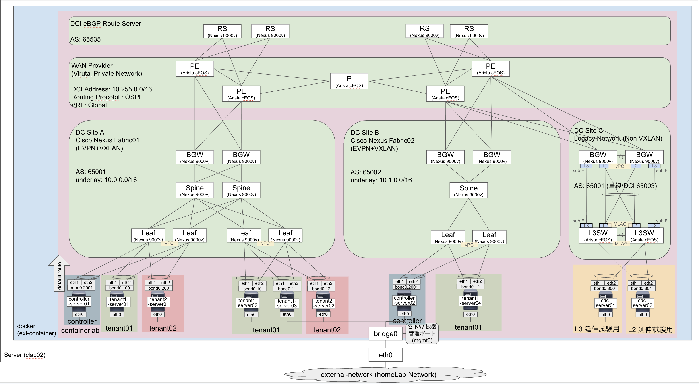
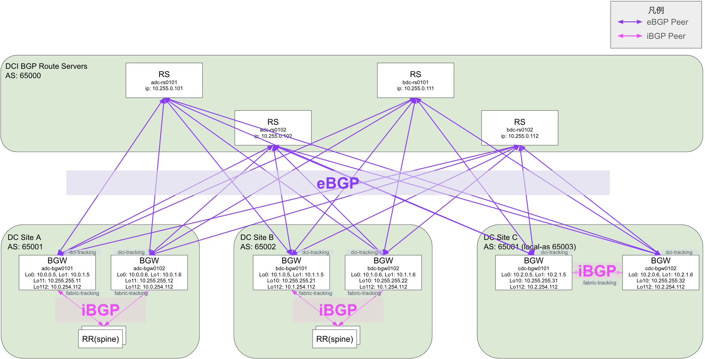
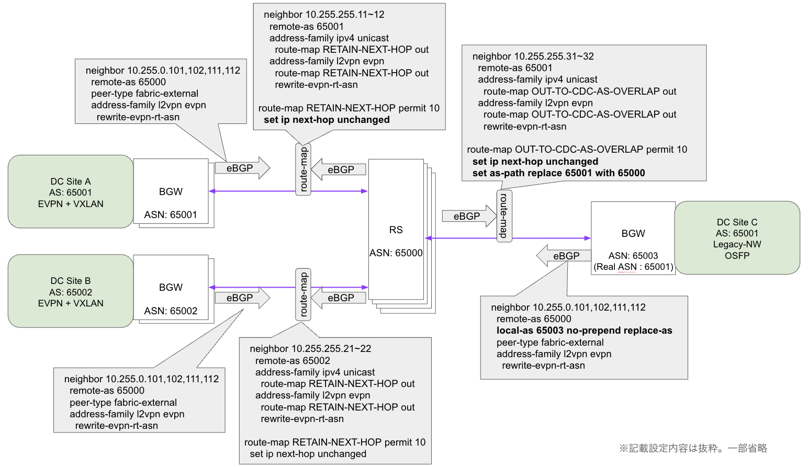
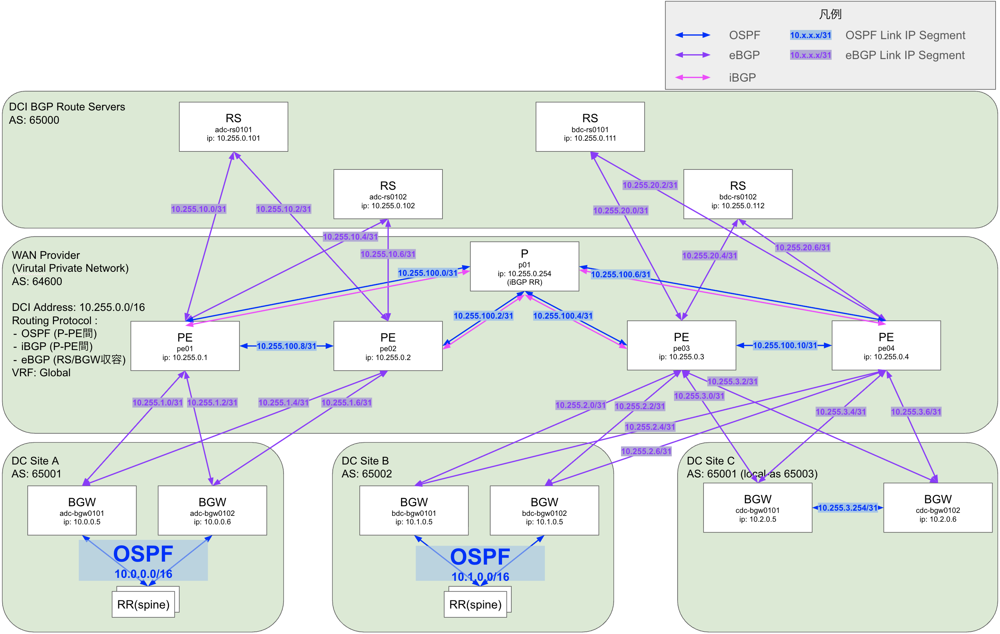
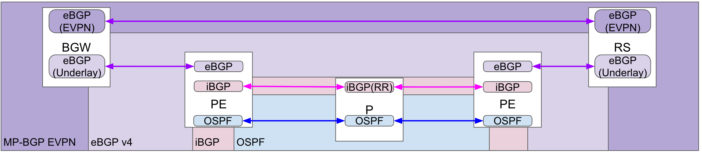
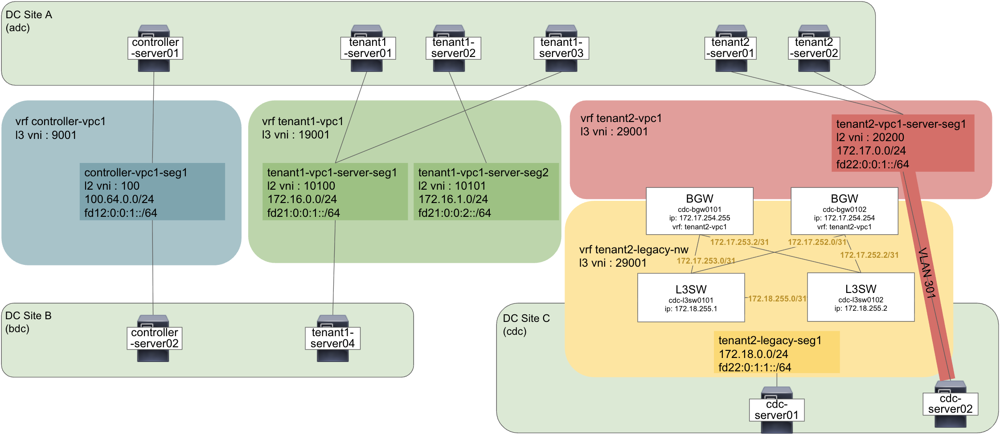

# nxos_evpn-multisite

Cisco Nexus 9000v (N9Kv) で構成した EVPN+VXLAN Fabric の複数サイトを WAN 越しに接続する EVPN Multisite を検証する

まだ開発中。。。

## 概要



- DataCenter(DC) Site は 3サイトとする
  - DC Site A
    - 通常の Fabric サイト想定用
      - EPVN BGP + Undrlay OSPF 構成
    - Leaf を2セットとして Fabric 内の疎通確認も可能とする
    - 冗長数を 2 として冗長試験も可能とする
  - DC Site B
    - Site 間疎通確認用での通常の Fabric 構成
    - Spine は1つに省略
    - Leaf も1セットのみ
  - DC Site C
    - レガシーサイト想定用
    - AS番号重複での DCI 接続試験用
    - レガシーサイト内に L3SW を配置して、レガシーセグメントを DCI に載せて通信を試験する
    - [レガシーサイト統合](https://www.cisco.com/c/en/us/products/collateral/switches/nexus-9000-series-switches/white-paper-c11-739942.html#Legacysiteintegration)の推奨に従って[vPCボーダーゲートウェイを使用した構成設計](https://www.cisco.com/c/en/us/products/collateral/switches/nexus-9000-series-switches/whitepaper-c11-742114.html)をする
      -  EVPNマルチサイトアーキテクチャではvPCは必須ではありませんが、既存サイトへの回復力が高くループのない接続を提供するために必要です。
      - 
    - 既存レガシーネットワーク想定の L3SW と BGW との接続
      - fabric-tracking は SVI 非対応のため物理ポートで収容する 
        - [EVPN multisite DCI-tracking and EVPN multisite fabric-tracking are only supported on physical interfaces. Use on SVIs is not supported.](https://www.cisco.com/c/en/us/td/docs/dcn/nx-os/nexus9000/106x/configuration/vxlan/cisco-nexus-9000-series-nx-os-vxlan-configuration-guide-release-106x/m_configuring_multisite_93x.html#reference_imd_jvs_sgb)
      - Sub-Interface で複数 VRF がある場合は収容する
        - [Separate sub-interfaces can be defined in a multitenant (that is, multi-VRF) deployment.](https://www.cisco.com/c/en/us/products/collateral/switches/nexus-9000-series-switches/whitepaper-c11-742114.html#Step6MigratefirsthopFHRPGatewayinthelegacysitetothevPCBGWAnycastGateway)
      

### 機種構成

- Fabric 機器は Cisco Nexus 9000v (N9Kv) / Nexus 9300v nexus9300v64-lite.10.5.4.M.qcow2 を使用する
  - mgmt0 は外部からアクセス用として containerlab サーバの bridge0 へ接続して固定 IP をアサインする
  - メモリフットプリントを削減するため、10.5(3)F 以上を使用する ([参照 Reduced footprint N9Kv Lite image to 4.5G](https://www.cisco.com/c/en/us/td/docs/dcn/nx-os/nexus9000/105x/configuration/n9000v-9300v-9500v/cisco-nexus-9000v-9300v-9500v-guide-release-105x/m-new-and-changed-105x.html))
  - VXLAN の対応として、所謂 [New L3 VNI Mode](https://community.cisco.com/t5/tkb-%E3%83%87%E3%83%BC%E3%82%BF%E3%82%BB%E3%83%B3%E3%82%BF%E3%83%BC-%E3%83%89%E3%82%AD%E3%83%A5%E3%83%A1%E3%83%B3%E3%83%88/ndfc-new-l3vni-mode-%E3%81%AB%E3%81%A4%E3%81%84%E3%81%A6/ta-p/5128776#toc-hId-328186197) が N9Kv が非対応 ([L3VNI without VLAN : No](https://www.cisco.com/c/en/us/td/docs/dcn/nx-os/nexus9000/106x/configuration/n9000v-9300v-9500v/cisco-nexus-9000v-9300v-9500v-guide-release-106x/m-overview.html#Cisco_Reference.dita_55d93795-31c2-428b-be6b-8c2ed0fa7677)) のため、VLAN 付きの L3 VNI で試験する必要がある
- Fabric 機器以外は軽量化・複数種類試験のため [`Arista cEOS`](https://containerlab.dev/manual/kinds/ceos/) を使用する
  - Management0 は外部からアクセス用として containerlab サーバの bridge0 へ接続して固定 IP をアサインする
  - 4.32.0F を使用した際にパケット複製被疑で不具合が出たので避けている (詳細まで切り分けはしてない)
- Server は疎通確認用に [network-multitool](https://github.com/srl-labs/network-multitool) を使用する
  - bonding で Network 機器へ接続する (eth1,eth2)
  - containerlab 上の検証ネットワーク向けにデフォルトルートを作成して疎通試験するようにする
  - eth0 は外部からアクセス用として containerlab サーバの bridge0 へ接続する
    - 基本的には `docker exec -it [container name] bash` などでアクセスするので IP は固定してない

使用するコンテナイメージ:

```text
REPOSITORY                        TAG
vrnetlab/cisco_n9kv               10.5.4.M.lite
ceos                              4.35.4M
ghcr.io/hellt/network-multitool   latest
```

- Default User/Password
  - cisco_n9kv : admin:admin ([参照](https://containerlab.dev/manual/kinds/vr-n9kv/#credentials))
  - ceos : admin:admin ([参照](https://containerlab.dev/manual/kinds/ceos/#credentials))
  - network-multitool : admin:multit00l ([参照](https://github.com/srl-labs/network-multitool#network-multitool-container-image))

### EVPN MultiSite BGP 構成



- EVPN eBGP/iBGP
  - データセンターサイト内は iBGP, サイト間は eBGP
  - iBGP はルートリフレクター(RR)を使用する。RRはSpineで実装する
  - eBGP はルートサーバ(RS)を使用する。RSは専用ルータを実装する ([参考: Configure Nexus EVPN-VXLAN Multi-Site with Route Server](https://www.cisco.com/c/en/us/support/docs/switches/nexus-9000-series-switches/220269-configure-nexus-evpn-vxlan-multi-site-wi.html))
- AS 番号
  - AS 番号は重複しているものも試験する
  - サイトアサインは下記
    - DC Site A : 65001
    - DC Site B : 65002
    - DC Site C : 65001 (重複対策時は 65003 に変換する)
  - eBGP Route Server は 65000 とする



- EVPN eBGP Route Server (RS)
  - Route Server では next-hop は書き換えずに伝搬して、データトラフィックは BGW 間で直接疎通できるようにする
  - AS 重複している BGW 向けには AS Path の書き換えを実施する (Overlap)
    - BGW 側での allowas-in でも可能

また、[VXLAN EVPNマルチサイトストーム制御の設定](https://www.cisco.com/c/en/us/td/docs/dcn/nx-os/nexus9000/106x/configuration/vxlan/cisco-nexus-9000-series-nx-os-vxlan-configuration-guide-release-106x/m_configuring_multisite_93x.html#Cisco_Task.dita_52c31ad1-43f1-4739-863a-50542a64332a)も入れておく

```sh
evpn storm-control broadcast level 10
evpn storm-control multicast level 10
evpn storm-control unicast level 10
```


### DCI Underlay IP Address



- 各サイト下記 IP をアサインする
  - DC Site A : 10.0.0.0/16
  - DC Site B : 10.1.0.0/16
  - DC Site C : 10.2.0.0/16
  - WAN 接続 / RS : 10.255.0.0/16
- アドレス境界
  - DC Site と WAN 用のアドレス境界は BGW で実施する

EVPN BGP と DCI Underlay のプロトコル関係の概要図は下記の通り




### Overlay IP Address



Server コンテナは `scripts/linux/init-bond-singlevlan-route.sh` で `eth1`/`eth2` を bonding し、VLAN subinterface に IPv4/IPv6 とデフォルトルートを設定する。

| Node | VLAN | IPv4 | IPv4 GW | IPv6 | IPv6 GW |
| --- | ---: | --- | --- | --- | --- |
| controller-server01 | 2001 | 100.64.0.1/24 | 100.64.0.254 | fd12:0:0:1::101/64 | fd12:0:0:1::1 |
| controller-server02 | 2002 | 100.64.1.1/24 | 100.64.1.254 | fd12:0:0:2::101/64 | fd12:0:0:2::1 |
| tenant1-server01 | 100 | 172.16.0.1/24 | 172.16.0.254 | fd21:0:0:1::101/64 | fd21:0:0:1::1 |
| tenant1-server02 | 10 | 172.16.0.2/24 | 172.16.0.254 | fd21:0:0:1::102/64 | fd21:0:0:1::1 |
| tenant1-server03 | 11 | 172.16.1.1/24 | 172.16.1.254 | fd21:0:0:2::101/64 | fd21:0:0:2::1 |
| tenant1-server04 | 100 | 172.16.0.4/24 | 172.16.0.254 | fd21:0:0:1::104/64 | fd21:0:0:1::1 |
| tenant2-server01 | 200 | 172.17.0.1/24 | 172.17.0.254 | fd22:0:0:1::101/64 | fd22:0:0:1::1 |
| tenant2-server02 | 20 | 172.17.0.2/24 | 172.17.0.254 | fd22:0:0:1::102/64 | fd22:0:0:1::1 |
| cdc-server01 | 300 | 172.18.0.1/24 | 172.18.0.254 | fd22:0:1:1::101/64 | fd22:0:1:1::1 |
| cdc-server02 | 301 | 172.17.0.10/24 | 172.17.0.254 | fd22:0:0:1::10a/64 | fd22:0:0:1::1 |

## 構築手順

### 前提

- `bridge0` に接続できる containerlab 実行環境を用意する
  - 機器の外部接続に利用する
  - 必要に応じて `evpn-multisite.clab.yaml`, `ssh-reflesh.sh` の IP を変更する
  - containerlab 環境の IP は `172.16.0.0/12` は使用してない前提で、重複するとサーバの接続 IP に影響が出る
- `vrnetlab/cisco_n9kv:10.5.4.M.lite` と `ceos:4.35.4M` を事前に pull/import しておく
- N9Kv は台数が多いため、ホスト側のメモリに余裕を持たせる

### 起動

```sh
cd ~/my-containerlab/nxos_evpn_multisite
containerlab deploy -t evpn-multisite.clab.yaml
```

N9Kv は起動に時間がかかり起動時に containerlab 実行環境サーバに負荷がかかるので、`evpn-multisite.clab.yaml` では一部 Node に `startup-delay` を設定して初期起動時の負荷を分散している。

WAN の cEOS Node と C Site の L3SW は `startup-config` で `configs/` 配下の設定を投入する。N9Kv Fabric/Route Server は `configs/<node>.cfg` に設定ファイルを用意しているため、起動後に SSH や automation で適用する。初回起動後に SSH known_hosts が古い場合は下記を実行する。

```sh
./ssh-reflesh.sh
```

### 疎通確認

Server コンテナから tenant 間・site 間の疎通を確認する。

#### Site-A to Site-B

```sh
docker exec -it clab-evpn-multisite-controller-server01 ping -c 5 100.64.1.1
docker exec -it clab-evpn-multisite-tenant1-server01 ping -c 5 172.16.0.4
docker exec -it clab-evpn-multisite-tenant1-server02 ping -c 5 172.16.0.4
docker exec -it clab-evpn-multisite-tenant1-server03 ping -c 5 172.16.0.4
```

```sh
docker exec -it clab-evpn-multisite-controller-server01 ping6 -c 5 fd12:0:0:2::101
docker exec -it clab-evpn-multisite-tenant1-server01 ping6 -c 5 fd21:0:0:1::104
docker exec -it clab-evpn-multisite-tenant1-server02 ping -c 5 fd21:0:0:1::104
docker exec -it clab-evpn-multisite-tenant1-server03 ping -c 5 fd21:0:0:1::104
```

#### Site-A to Site-C

```sh
docker exec -it clab-evpn-multisite-tenant2-server01 ping -c 5 172.17.0.10
docker exec -it clab-evpn-multisite-tenant2-server01 ping -c 5 172.18.0.1
docker exec -it clab-evpn-multisite-tenant2-server02 ping -c 5 172.17.0.10
docker exec -it clab-evpn-multisite-tenant2-server02 ping -c 5 172.18.0.1
docker exec -it clab-evpn-multisite-cdc-server01 ping -c 5 172.17.0.1
docker exec -it clab-evpn-multisite-cdc-server01 ping -c 5 172.17.0.2
docker exec -it clab-evpn-multisite-cdc-server02 ping -c 5 172.17.0.1
docker exec -it clab-evpn-multisite-cdc-server02 ping -c 5 172.17.0.2
```

```sh
docker exec -it clab-evpn-multisite-tenant2-server01 ping6 -c 5 fd22:0:0:1::10a
docker exec -it clab-evpn-multisite-tenant2-server01 ping6 -c 5 fd22:0:1:1::101
docker exec -it clab-evpn-multisite-tenant2-server02 ping6 -c 5 fd22:0:0:1::10a
docker exec -it clab-evpn-multisite-tenant2-server02 ping6 -c 5 fd22:0:1:1::101
docker exec -it clab-evpn-multisite-cdc-server01 ping6 -c 5 fd22:0:0:1::101
docker exec -it clab-evpn-multisite-cdc-server02 ping6 -c 5 fd22:0:0:1::101
docker exec -it clab-evpn-multisite-cdc-server02 ping6 -c 5 fd22:0:0:1::102
```

Network 機器の管理 IP は固定にしているので yaml を参照する。 `containerlab inspect` でも確認可能。

### 停止

```sh
containerlab destroy -t evpn-multisite.clab.yaml
```

設定も削除する場合は下記とする。N9Kv は起動時に設定が多いと設定投入中にハングして落ちる時があるので、下記推奨。

```sh
containerlab destroy -t evpn-multisite.clab.yaml -c
```

## 参考： 実施環境

### サーバスペック

MiniPC(ASUS NUC) に Ubuntu を入れて KVM で仮想ホストサーバにしており、VM で Rocky9 を入れて Containerlab を動かしている

|    項目    |                         スペック                          |
| :--------: | :------------------------------------------------------: |
|   サーバ機種   |　                       NUC14RVKU5                        |
|    CPU     | Intel(R) Core(TM) Ultra 5 125H <br> 12Core(P4/E8/LPE2)/18Thread |
|   Memory   |        128GiB (DDR5-5600 64GiB x2)    |
|    Disk    |    1TB PCIe Gen4 |
|  Host OS  |          Ubuntu24.02 LTS          |
|  HyperVisor  |          KVM          |
| Guest OS | Rocky Linux 9.7 (Blue Onyx)|
| Guest vCPU | 18 vCPU |
| Guest Memory | 125 GiB |
| Guest Disk | 512 GiB |
| ContainerLab Version | 0.75.0 |


### リソース使用率

参考にリソース使用率も残す。起動が終わって安定した後の測定。cEOS が 1.5GiBあたり、サーバは数 MiB くらいなので軽量

```sh
$ (echo "NAME CPU% MEM_USAGE"; \
 docker stats --no-stream --format "{{.Name}}\t{{.CPUPerc}}\t{{.MemUsage}}" | \
 sed 's/clab-evpn-multisite-//' | \
 sort) | column -t
NAME                 CPU%    MEM_USAGE     
adc-bgw0101          74.87%  4.583GiB   /  122.3GiB
adc-bgw0102          65.16%  4.582GiB   /  122.3GiB
adc-lfsw0101         59.90%  4.584GiB   /  122.3GiB
adc-lfsw0102         52.92%  4.583GiB   /  122.3GiB
adc-lfsw0103         49.82%  4.58GiB    /  122.3GiB
adc-lfsw0104         55.32%  4.582GiB   /  122.3GiB
adc-rs0101           33.44%  5.203GiB   /  122.3GiB
adc-rs0102           61.48%  4.731GiB   /  122.3GiB
adc-spsw0101         58.52%  4.584GiB   /  122.3GiB
adc-spsw0102         53.09%  4.582GiB   /  122.3GiB
bdc-bgw0101          42.68%  4.582GiB   /  122.3GiB
bdc-bgw0102          69.70%  4.582GiB   /  122.3GiB
bdc-lfsw0101         62.62%  4.582GiB   /  122.3GiB
bdc-lfsw0102         58.91%  4.582GiB   /  122.3GiB
bdc-rs0101           85.74%  4.763GiB   /  122.3GiB
bdc-rs0102           57.45%  4.726GiB   /  122.3GiB
bdc-spsw0101         34.15%  4.582GiB   /  122.3GiB
cdc-bgw0101          53.00%  4.585GiB   /  122.3GiB
cdc-bgw0102          64.25%  4.586GiB   /  122.3GiB
cdc-l3sw0101         3.12%   1.451GiB   /  122.3GiB
cdc-l3sw0102         2.77%   1.448GiB   /  122.3GiB
cdc-server01         0.00%   1.137MiB   /  122.3GiB
cdc-server02         0.00%   2.398MiB   /  122.3GiB
controller-server01  0.00%   1012KiB    /  122.3GiB
controller-server02  0.00%   1012KiB    /  122.3GiB
p01                  5.20%   1.215GiB   /  122.3GiB
pe01                 4.32%   1.24GiB    /  122.3GiB
pe02                 12.70%  1.209GiB   /  122.3GiB
pe03                 3.13%   1.212GiB   /  122.3GiB
pe04                 7.24%   1.219GiB   /  122.3GiB
tenant1-server01     0.00%   2.215MiB   /  122.3GiB
tenant1-server02     0.00%   1.004MiB   /  122.3GiB
tenant1-server03     0.00%   1004KiB    /  122.3GiB
tenant1-server04     0.00%   1020KiB    /  122.3GiB
tenant2-server01     0.00%   2.098MiB   /  122.3GiB
tenant2-server02     0.00%   1008KiB    /  122.3GiB
```

```sh
$ uptime
 00:17:28 up 10 days, 13:17,  2 users,  load average: 17.20, 16.25, 16.26
```

```sh
$ free
               total        used        free      shared  buff/cache   available
Mem:       128279668   105064112     1384776      936188    24577140    23215556
```

```sh
$ df
ファイルシス        1K-ブロック      使用    使用可 使用% マウント位置
devtmpfs                   4096         0      4096    0% /dev
tmpfs                  64139832         0  64139832    0% /dev/shm
tmpfs                  25655936     28876  25627060    1% /run
/dev/mapper/rl-root   531364356 105055752 426308604   20% /
/dev/vda1                983040    257740    725300   27% /boot
tmpfs                  12827964         0  12827964    0% /run/user/1000
```