# 構成設計と構成図

## 0. 設計の更新方法

この文書は完成形だけを先に固定するものではない。各構築 Stage の開始時に対象範囲を
As-designed として具体化し、受入確認後に実測した interface、address、経路、配置を As-built へ
更新する。確定値と segment 内の host assignment は
[パラメータ・アドレス割り当て台帳](parameter-and-address-allocation.md)で一元管理する。

| 更新時点 | 図と表に反映する内容 |
|---|---|
| Stage開始前 | 要件、責務境界、予定経路、予定address、障害境界 |
| 設定作成後 | values/manifestと対応するcomponent、port、protocol、依存関係 |
| 受入確認後 | 実測address、選択interface、route/next-hop、component配置、既知制約 |
| 設計変更時 | 変更理由、影響する要件ID、rollback先、再確認が必要なStage |

## 1. 責務の分離

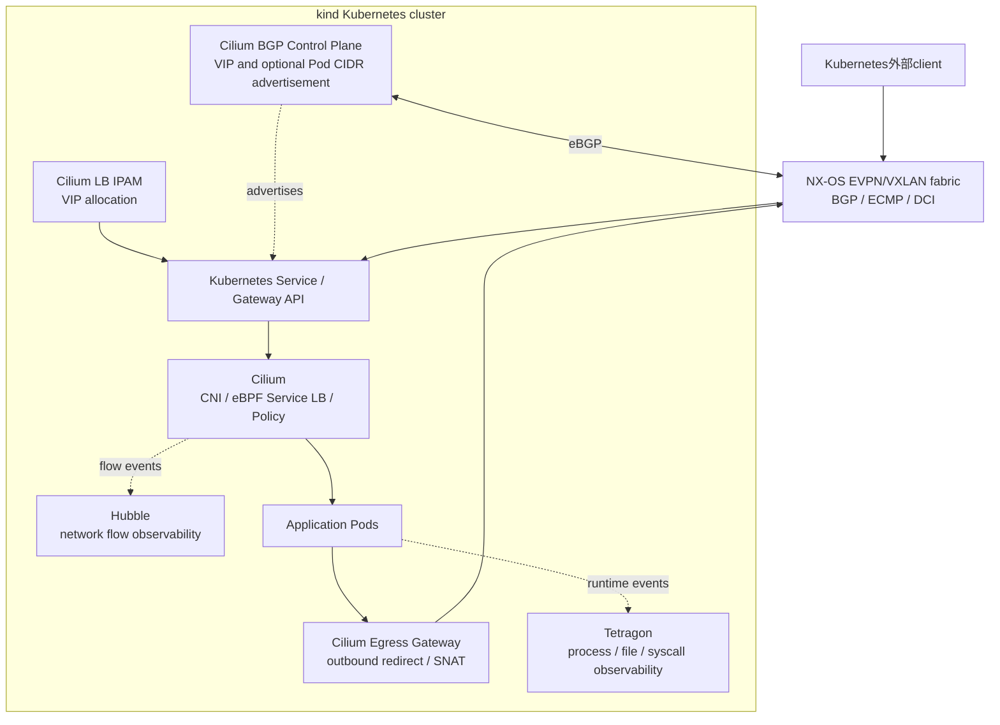

責務は次のように扱う。

- LB IPAMはVIPを割り当てる。到達経路は提供しない。
- BGP Control PlaneはVIPやPod CIDRを広告する。Cilium datapath自体は構築しない。
- eBPF Service LBはService frontendからbackend Podを選択する。
- Egress Gatewayは選択したPodの外向き通信をgateway nodeへ転送し、予測可能なsource IPへSNATする。
- HubbleはCilium datapathからネットワークflowを取得する。
- Tetragonはkernel hookを使い、process、file、network syscallなどのruntime eventを取得する。

## 2. Single-site k02 構成案

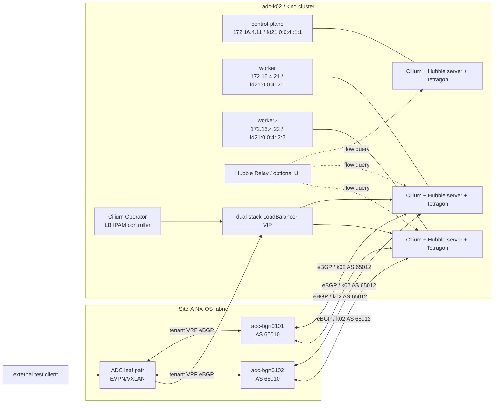

`adc-k02` の Cilium BGP Control Plane は Leaf と直接 peer を形成せず、既存の
`adc-bgrt0101/0102` で終端する。ADC BGR は AS `65010`、k02 は AS `65012` とする。
Leaf は ADC BGR から受信した Service VIP route を EVPN/VXLAN fabric へ反映し、BGR は
VLAN `104`／VNI `10104` を介して各 k02 Node から VIP route を受信する。
クラスタ自体は control-plane 1 Node と worker 2 Node の 3 Node 構成だが、BGP speaker は
`bgp-speaker=true` を持つ worker 2 Node だけとする。control-plane は Cilium Agent、
Hubble、Tetragon を実行するが BGP session を形成しない。

### Single-site の検証対象通信経路

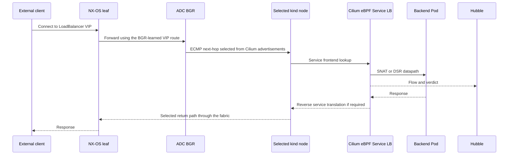

疎通成功だけではなく、次を同じ時刻で突き合わせる。

- NX-OS BGP RIB/FIBとnext-hop
- nodeのroute、Cilium service/backend、BPF map
- Hubble flowのsource、destination、verdict
- 必要に応じleaf/node interface counterまたはpacket capture

Egress Gatewayは同じ「外部接続」でも逆方向の機能として扱い、LB/BGPの合格後に独立して追加する。

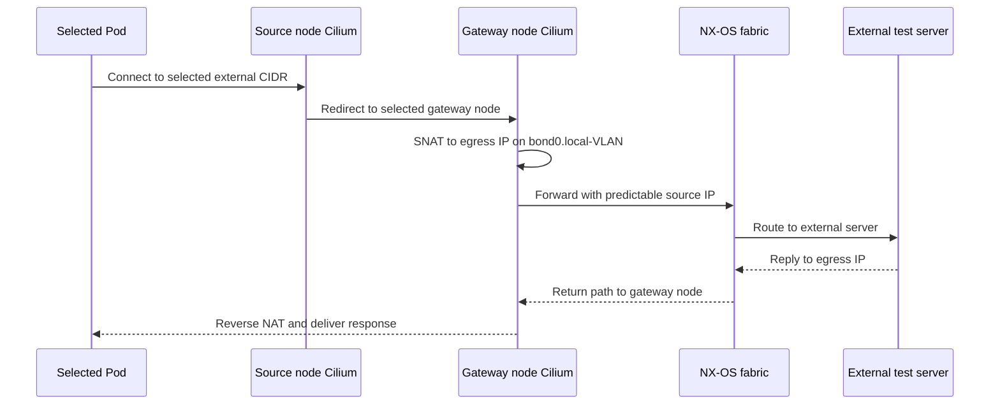

Egress Gateway は k02 single-site 専用 Helm overlay で有効化する。Gateway Node は
`adc-k02-worker` と `adc-k02-worker2`、Egress IP はそれぞれ `.31`／`::3:1` と `.32`／`::3:2`、外部試験
server は既存の `adc-t1sv0102` とする。source Pod、destination CIDR、Gateway Node、Egress IP を明示し、
外部 server の log／capture、Gateway Node の BPF map／capture、NX-OS counter を同じ時刻で比較する。
Egress IP は Policy 適用前に運用者が worker の `bond0.14` と worker2 の `bond0.104` へ secondary address として
設定し、Service VIP 用 BGP advertisement とは分離する。Cilium は Egress IP を Node へ動的に追加しない。
IPv4／IPv6 は別 Policy とし、選択中 profile の単一 `egressGateway` と対応する `egressIP` を明示する。

Cilium `1.20.1` では `gw-a`／`gw-b` の Kustomize profile を排他的に使い、切替は明示的な Policy 更新とする。
自動 active-active／active-standby は前提にせず、既存 connection 切断を許容して新規 connection の手動復旧時間を
判定する。単一 floating Egress IP の hitless failover は初期設計に含めない。

通常の single-site／multisite profile では Egress Gateway と Cluster Mesh を分離し、CES は Egress Gateway
と同時に有効化しない。Cluster Mesh の構築と基本受入が完了した後だけ、実験 profile で両機能を同時に
有効化し、各 cluster の local Pod → local Gateway に限定して動作を確認する。cross-cluster Gateway は
設計対象外とし、同時有効化試験の構成と判定は
[専用試験文書](egress-clustermesh-coexistence-test.md)を正本とする。

新規 Pod への Policy 反映には遅延があり得るため、外部 firewall の source allowlist だけを初期 packet の
遮断保証として扱わない。

## 3. Multi-site Cluster Mesh 構成案

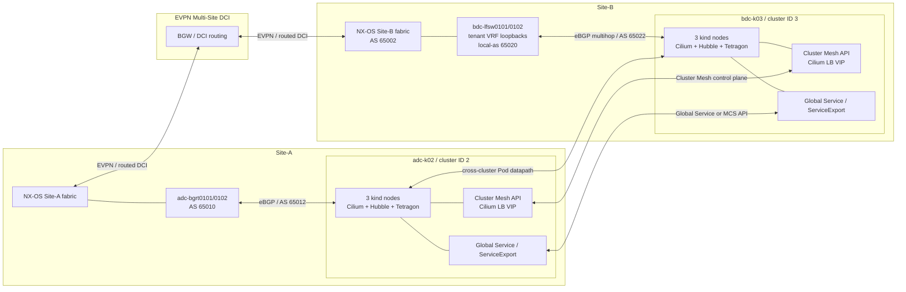

Cluster Meshではcontrol planeとdata planeを分けて確認する。

| Plane | 通信 | 確認対象 |
|---|---|---|
| Cluster Mesh control plane | `clustermesh-apiserver`相互接続 | VIP、BGP、証明書、remote cluster status |
| Kubernetes control plane | kubectl/API server | kubeconfig context、API endpoint、障害時の独立性 |
| Cilium data plane | node間およびPod間 | InternalIP、VXLAN/native route、MTU、policy identity |
| Service discovery | Global ServiceまたはMCS API | DNS、backend同期、site affinity、partition |
| Observability | Hubble Relay/API | cluster識別、共有CA、部分障害 |

## 4. アドレス計画

詳細な host assignment、固定 VIP、予約範囲は
[パラメータ・アドレス割り当て台帳](parameter-and-address-allocation.md)を正本とする。以下は構成図を
読むための segment summary であり、実装前に Docker network、host route、既存 lab の全 prefix と
再度照合する。

| 用途 | adc-k02 | bdc-k03 | 状態 |
|---|---|---|---|
| Cluster name | `adc-k02` | `bdc-k03` | `Assigned` |
| Cluster ID | `2` | `3` | `Assigned` |
| Kubernetes cluster domain | `cluster.local` | `cluster.local` | `Assigned` |
| Management interface | `eth0` | `eth0` | `Runtime` address |
| Fabric interface | `bond0.14`／`bond0.104` | `bond0.105` | `Existing` |
| L2 VNI | `10104` | `10105` | `Existing` |
| Node IPv4 | `172.16.4.0/24` | `172.16.5.0/24` | `Existing` |
| Node IPv6 | `fd21:0:0:4::/64` | `fd21:0:0:5::/64` | `Existing` |
| BGP termination | `adc-bgrt0101/0102` | `bdc-lfsw0101/0102` の tenant VRF loopback | `Assigned` |
| Network-side ASN | ADC BGR `65010` | Leaf の Cilium 向け `local-as 65020`。Fabric ASN は `65002` を維持 | `Assigned` |
| Cilium ASN | `65012` | `65022` | `Assigned` |
| BGP endpoint IPv4 | `172.16.4.4`、`172.16.4.5` | `172.16.253.101/32`、`172.16.253.102/32` | `Assigned` |
| BGP endpoint IPv6 | `fd21:0:0:4::4`、`fd21:0:0:4::5` | `fd21:0:0:253::101/128`、`fd21:0:0:253::102/128` | `Assigned` |
| Pod IPv4 | `10.202.0.0/16` | `10.203.0.0/16` | `Assigned` |
| Service IPv4 | `10.102.0.0/16` | `10.103.0.0/16` | `Assigned` |
| Pod IPv6 | `fd00:10:202::/56` | `fd00:10:203::/56` | `Assigned` |
| Service IPv6 | `fd00:10:102::/112` | `fd00:10:103::/112` | `Assigned` |
| LB VIP IPv4 | `172.16.14.10-172.16.14.50` | `172.16.15.10-172.16.15.50` | `Assigned` |
| LB VIP IPv6 | `fd21:0:0:14:0:0:1:0/112` | `fd21:0:0:15:0:0:1:0/112` | `Assigned` |
| Cilium／Pod MTU | `9000` | `9000` | `Assigned` |
| Node Fabric MTU | `9100` | `9100` | `Assigned` |

`172.16.254.0/24` は既存 ADC Leaf–BGR 接続用、`172.16.253.0/24` は BDC の BGR／Leaf 重畳
BGP endpoint 用として予約する。BDC Leaf の endpoint は pool 内の `/32`、
`/128` とし、Anycast Gateway の `172.16.5.1`／`fd21:0:0:5::1` を BGP peer address には使用しない。
Anycast Gateway は k03 Node から Leaf 固有 loopback への next-hop として使用する。

## 5. 複数NICと管理・fabric分離

kind nodeはDocker管理用`eth0`と、NX-OSへ接続する`eth1`/`eth2`を束ねた
`bond0.<local-VLAN>`を持つ。複数NIC自体はCiliumの制限ではなく、管理planeとfabric dataplaneを
分離するために維持する。

### 5.1 interfaceの責務

| Interface / address | 責務 | default route |
|---|---|---|
| `eth0` / Docker管理address | 外部kubectl、kind API endpoint、Cilium agentからAPI serverへの接続 | 維持する |
| `eth1` / `eth2` | containerlabからleafへ接続するLACP member | 設定しない |
| `bond0.<local-VLAN>` / fabric node address | Node InternalIP、VXLAN underlay、Cilium BGP、NodePort/LB受信 | fabric prefixだけを向ける |

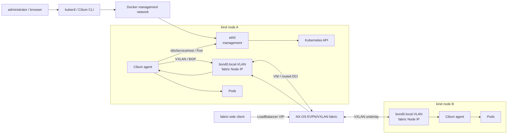

Kubernetes Node `InternalIP`やCilium tunnel endpointが自動的に`eth0`を選択すると、通信が成功しても
NX-OS fabricを通らない。次を初期設計値として扱う。

| 制御点 | 初期方針 |
|---|---|
| kubelet `node-ip` | 各nodeの`bond0.<local-VLAN>`に設定したIPv4/IPv6を明示する |
| Cilium `k8sServiceHost` / `k8sServicePort` | `eth0`管理networkから到達できるAPI endpointを使用する |
| Cilium `devices` | `eth0`と`bond0.<local-VLAN>`を対象とする。local VLAN差はwildcardまたはnode別設定で吸収する |
| Cilium `nodePort.addresses` | siteのfabric側Node IPv4/IPv6 CIDRだけを指定する |
| Linux routing | defaultは`eth0`に残し、node、BGP peer、fabric client、Cluster Mesh prefixをbond側へ向ける |
| XDP acceleration | bond/multi-device制約を分離するため初期は`disabled`とする |

Kind 作成時点では Containerlab の `eth1`／`eth2` と Fabric address が存在しないため、Fabric IP を
`kubeadmConfigPatches` の `node-ip` へ直接指定しない。初期 bootstrap は次の順序とする。

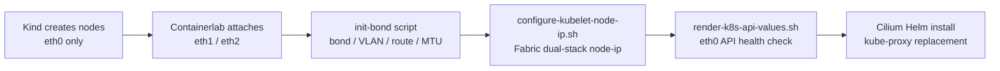

`configure-kubelet-node-ip.sh` は local Fabric address の存在を確認し、
`/var/lib/kubelet/kubeadm-flags.env` の `--node-ip` だけを冪等に更新して kubelet を再起動する。
`render-k8s-api-values.sh` は control-plane `eth0` IPv4 を取得し、全 Node から TCP `6443` の
`/livez` が成功した場合だけ Git 管理外の Helm runtime values を生成する。

Stage 0でbootstrap順序を設計し、Stage 1で次を実測する。

1. `kubectl get nodes -o wide`のdual-stack Node `InternalIP`
2. `CiliumNode.spec.addresses`とVXLAN tunnel endpoint
3. `cilium-dbg status --verbose`または同等のstatusで検出されたdevice
4. `ip route get <remote-node-or-client-ip>`の出力interfaceとsource address
5. NX-OS側MAC/ARP/ND、BGP RIB/FIB、interface counterまたはcapture

### 5.2 local VLAN と L2 VNI

Cilium は remote Leaf の local VLAN ID を使用しない。Node が持つ Fabric IP 間の到達性を利用するため、
各 Leaf で local VLAN が同じ L2 VNI へ map され、ARP／NDP、MTU、VXLAN underlay が成立すれば、
Leaf ごとに VLAN ID が異なっていても Cilium の制約にはならない。

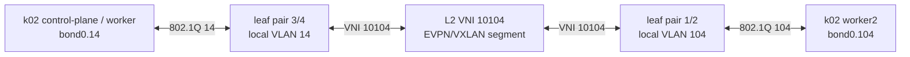

local 設定では k02 の VLAN `14` と VLAN `104` がともに VNI `10104` へ map されている。したがって、
VLAN 番号を統一するためだけの Leaf 変更は不要と判断する。Node-facing trunk は lab での機能追加を
妨げないよう VLAN `1-4094` の許可を維持する。

- 各 Node が接続先 Leaf で定義された local VLAN tag を送受信する
- 各 local VLAN が同じ L2 VNI、EVPN route target、NVE member へ対応する
- 同一 subnet の Node 間で ARP／NDP と IPv4／IPv6 通信が成立する
- Cilium `devices` 設定が各 Node の実 interface 名に match する
- Node Fabric MTU `9100` と Fabric MTU `9214`／`9216` で Cilium／Pod MTU `9000` が end-to-end で成立する

2026-08-23 に、VLAN `14`／`104` と VNI `10104` が全 ADC Leaf で `Up` となり、k02 Node の MAC が
local port-channel と remote `nve1` の双方で学習されることを確認した。一方、Node MTU `9000` に対して
Node-facing port-channel／member が `1500` だったため、Fabric API は TLS handshake で timeout した。
該当 Leaf port-channel は running-config へ `9216` を適用し、member への反映、LACP `(P)`、trunk
allowed VLAN `1-4094` の維持を確認した。k02 の全 Node も `9100` へ変更し、worker／worker2 から
control-plane Fabric API の IPv4／IPv6 `/livez` が HTTP `200` を返すことを確認した。Cilium／Pod MTU
`9000` の導入後に PMTUD、fragment、path MTU boundary を再検証する。2026-08-24 に ADC Leaf 4 台の
running-config を startup-config へ保存した。

multisite の k03 は control-plane、worker、worker2 とも `bond0.105` を使用し、Leaf 側の VLAN `105`、
VNI `10105` と一致している。k02 の VLAN `14`／`104` と VNI `10104` の組み合わせは local VLAN 差を
許容する設計として維持する。

### 5.3 Hubble UIのアクセス経路

Hubble UIのbrowser accessは公開方法で経路が変わる。標準運用は管理network、fabric検証時だけ
一時的なCilium LoadBalancer Serviceを使用する。

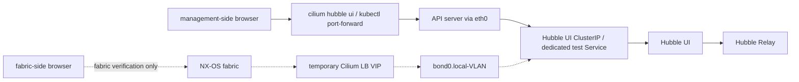

- 通常時: Hubble UIはClusterIPのままにし、API serverへのport-forwardを`eth0`経由で使用する。
- fabric確認時: UIを選択する専用LoadBalancer ServiceへCilium LB classを指定し、VIPをBGP広告する。
- 確認後: 一時Serviceを削除し、UIをfabricへ常時公開しない。
- NodePortを使う場合: `nodePort.addresses`でfabric側CIDRに限定し、管理`eth0`でlistenさせない。

### 5.4 Kubernetes APIの同時公開

管理側API endpointはCilium bootstrapを含むprimaryとして維持し、control-planeのFabric IPを
secondary endpointとして追加する。Cilium LoadBalancerをKubernetes APIのbootstrap経路には
使用しない。

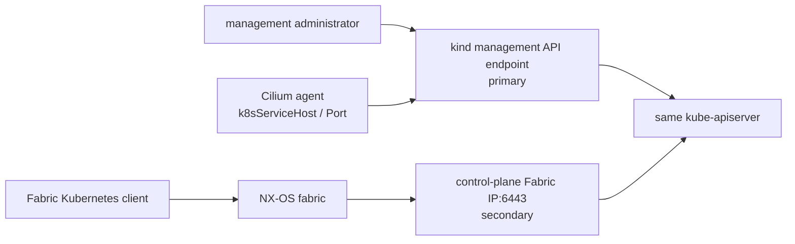

Fabric IPv4/IPv6または安定したDNS名を初回作成時からAPI server証明書SANへ含める。Fabric用
kubeconfigは認証情報とCAを管理用kubeconfigから引き継ぎ、`server`だけをsecondary endpointへ
向ける。管理用kubeconfigは変更しない。

API serverのlisten address、TCP 6443、Fabric側往復route、host firewall/ACL、reverse path
filterを個別に確認する。`advertise-address`やCilium agentのbootstrap先は、Fabric公開のためだけに
変更しない。

### 5.5 Fabric側CLI client

一般通信試験用network-multitoolをFabric側Kubernetes clientとして兼用する。独自Docker imageや
toolbox sidecarは追加せず、kubectl、Cilium CLI、Hubble CLIの公式release binaryとkubeconfigを
既存serverへread-only mountする。

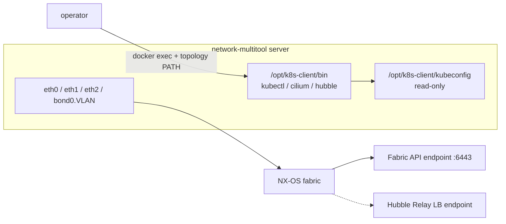

single-siteとmulti-siteはそれぞれ`k8s_kind/client/tool-versions.env`とGit管理外`runtime/`を持つ。
download/checksum検証ロジックだけを`nxos_fabric/scripts/k8s-client/prepare-tools.sh`で共通化する。
詳細は[Fabric側Kubernetes clientとCLI準備](client-tools.md)を参照する。

CLIは実行元network-multitoolのsource IPとrouteをそのまま使用する。single-siteでは
`adc-t1sv0101`、multi-siteではADCの`adc-t1sv0101`とBDCの`bdc-t1sv0104`を対象にし、site別の
到達経路を分ける。Container側はtopologyの`env.PATH`、Containerlab実行host側はsite別の作業shellで
runtimeの`bin`をPATHの先頭へ追加する。

実行中labのtopology YAMLは変更しない。API SANとrouteを確定してbind追記案をレビューした後、
承認された保守時間に対象network-multitool containerを再作成して反映する。

## 6. コンポーネント配置

| Component | Kubernetes workload | Scope |
|---|---|---|
| Cilium agent | DaemonSet | 全control-plane/worker node |
| Cilium operator | Deployment | cluster単位。可能なら2 replicasを評価 |
| Envoy | embeddedまたはDaemonSet | L7 policy/Gateway APIフェーズで選択 |
| Hubble server | Cilium agent内 | node単位 |
| Hubble Relay | Deployment | cluster単位 |
| Hubble UI | Deployment | optional |
| Tetragon agent | DaemonSet | 全node。初期はobserve-only |
| Tetragon operator | Deployment | 使用するchart構成に合わせて確認 |
| Cluster Mesh API | Deployment + Service | cluster単位。multisiteフェーズ |

Tetragon の kind 向け公式手順では、Node へ host `/proc` を `/procHost` として mount し、Helm 側の
`tetragon.hostProcPath` を合わせる例が示されている。k02 の site 別 Kind 設定では全 Node に
`/procHost` の read-only mount を追加済みであり、Stage 1 の再作成後に mount source と可視性を確認する。
