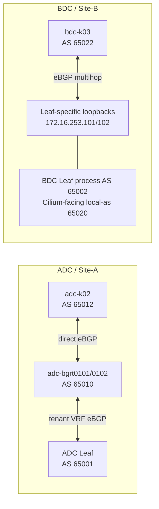

# BGP 終端設計と既存設定の変更案

## 0. 文書の位置付け

この文書は、Cilium BGP Control Plane を `adc-k02` と `bdc-k03` へ導入するための
As-designed 設計と、lab へ反映した As-built 状態を同じ設計単位で管理する。
[パラメータ・アドレス割り当て台帳](parameter-and-address-allocation.md)を正とし、コードブロックは
確定値の説明または未適用範囲の論理 candidate として扱う。

| 範囲 | 設計状態 | 実装状態 | 残作業 |
|---|---|---|---|
| Single-site ADC／k02 | `Ready` | `Applied` | LoadBalancer workload、EVPN Type-5、datapath の受入試験 |
| Multisite ADC config source | `Ready` | `File-ready` | multisite lab への投入と受入確認 |
| BDC／k03 | `Ready` | `Candidate-required` | device 別 candidate、parser 確認、投入と受入確認 |
| DCI | `Ready` | `Candidate-required` | 現行 policy と sequence を統合した device 別 candidate |

Single-site ADC では設定元ファイル、投入 candidate、稼働機器、k01 MetalLB、k02 Cilium BGP resource を
反映済みである。稼働機器の parser、BGP session、既存 k01 VIP route を確認し、BGP 変更対象の Leaf 2 台と
BGR 2 台は startup-config へ保存済みである。`adc-lfsw0104 Ethernet1/6` の description は running-config と
設定元ファイルを修正し、startup-config へ保存済みである。

## 1. 設計結論

| 項目 | ADC | BDC |
|---|---|---|
| Fabric ASN | `65001` | `65002` |
| BGP 終端 | `adc-bgrt0101/0102` | `bdc-lfsw0101/0102` の tenant VRF 専用 loopback |
| Network 側 ASN | ADC BGR の実 ASN `65010` | Cilium neighbor にだけ見せる `local-as 65020` |
| Cilium ASN | k02 `65012` | k03 `65022` |
| Node segment | `172.16.4.0/24`、`fd21:0:0:4::/64` | `172.16.5.0/24`、`fd21:0:0:5::/64` |
| BGP endpoint | `172.16.4.4/24`、`172.16.4.5/24` と対応する IPv6 `/64` | `172.16.253.101/32`、`172.16.253.102/32` と対応する IPv6 `/128` |
| Peering | 同一 subnet の eBGP | Leaf 固有 loopback への eBGP multihop |
| Transport | IPv4／IPv6 を別 session | IPv4／IPv6 を別 session |
| Timer | Keepalive `10`、Hold `30` | Keepalive `10`、Hold `30` |
| Maximum prefix／paths | AF ごとに `64`／eBGP `4` | AF ごとに `64`／eBGP `4` |
| BFD | disabled | disabled |

BDC Leaf の BGP process は `router bgp 65002` を維持する。`65020` へ変更せず、Cilium neighbor に
`local-as 65020 no-prepend replace-as` を設定して、Fabric ASN と論理 BGR ASN を分離する。



## 2. 変更前 baseline との差分

| ID | 変更前 baseline | 変更内容 | 理由 |
|---|---|---|---|
| G-01 | ADC BGR は `router bgp 65535` | `65010` へ変更 | `65535` は IANA Reserved であり、Private Use ASN ではない |
| G-02 | ADC Leaf の BGR neighbor は `remote-as 65535` | `remote-as 65010` へ変更 | ADC BGR の ASN 変更と一致させる |
| G-03 | k01 MetalLB の `peerASN` は `65535` | `65010` へ変更 | 既存 k01 peering を ADC BGR ASN 変更後も維持する |
| G-04 | ADC BGR は VLAN `103` のみ Node-facing trunk で許可 | VLAN `104` と BGR 固有 address を追加 | k02 Cilium を ADC BGR で直接終端する |
| G-05 | k02 配下の旧 MetalLB manifest は削除済み | Cilium LB IPAM／BGP resource だけを Stage 2A で追加する | k02 では MetalLB を導入しない |
| G-06 | k03 route と BDC Anycast Gateway は IPv4 next-hop `172.16.5.1` で一致 | 変更不要、実測済み | IPv4 `.1` と IPv6 `::1` で host 部を統一する |
| G-07 | BDC Leaf に Cilium peer endpoint がない | tenant VRF 専用 loopback を Leaf ごとに追加 | Anycast Gateway との BGP peering を避ける |
| G-08 | BDC Leaf の tenant VRF に Cilium neighbor がない | k03 Node と `65022`↔`65020` で peer を追加 | 専用 BGR を追加せず Leaf へ機能を重畳する |
| G-09 | BDC tenant VRF は `maximum-paths ibgp 4` のみ | eBGP multipath と EVPN Type-5 export を追加 | 複数 Node から受信する VIP route を ECMP で利用する |
| G-10 | Cilium 専用 inbound filter がない | site aggregate と LB pool 内の `/32`、`/128` だけを許可 | Cilium 集約、`externalTrafficPolicy: Local`、rollback exact route を許可しつつ、Pod route、default route、pool 外 route の流入を防止する |
| G-11 | k02 Node-facing port-channel／member の MTU は稼働環境で `1500` | MTU を `9216` とし、trunk all は維持する | Node Fabric MTU `9100` と Cilium／Pod MTU `9000` を収容する |

Single-site ADC では G-01～G-05、G-10、G-11 を反映済みである。G-05 の Cilium BGP resource は
適用済みだが、対象 LoadBalancer Service を作成して行う aggregate／exact route と datapath の受入試験は
未実施である。G-06～G-09 は BDC／k03 の状態を示す。

## 3. ASN と address の予約

### 3.1 ASN

```text
65001  ADC Fabric
65002  BDC Fabric

65010  ADC BGR
65011  k01 MetalLB
65012  k02 Cilium

65020  BDC logical BGR role on Leaf local-as
65021  reserved
65022  k03 Cilium
```

### 3.2 BGR／BGP endpoint pool

```text
172.16.254.0/24       ADC BGR / Leaf routed transit
172.16.253.0/24       BDC BGR / Leaf-overlaid BGP infrastructure
172.16.252.0/24       reserved for a future site or role

172.16.253.101/32     bdc-lfsw0101 Cilium-facing loopback
172.16.253.102/32     bdc-lfsw0102 Cilium-facing loopback

fd21:0:0:253::101/128 bdc-lfsw0101 Cilium-facing loopback
fd21:0:0:253::102/128 bdc-lfsw0102 Cilium-facing loopback
```

`172.16.253.0/24` と `fd21:0:0:253::/64` は Cilium LB IPAM pool から除外する。BDC BGP endpoint は
DCI へ無条件に公開せず、まず BDC site-local reachability に限定する。

## 4. 変更対象ファイル案

| 対象 | 変更内容 | 備考 |
|---|---|---|
| `nxos_singlesite/configs/singlesite/cisco_n9kv/adc-bgrt0101_run.txt` | ASN `65010`、VLAN `104`、k02 neighbor、filter | final source、running／startup config へ反映し、runtime parser を確認済み |
| `nxos_singlesite/configs/singlesite/cisco_n9kv/adc-bgrt0102_run.txt` | 同上 | BGR 固有 address は `.5`／`::5`。running／startup config へ反映済み |
| `nxos_singlesite/configs/singlesite/cisco_n9kv/adc-lfsw0101_run.txt` | BGR neighbor の `remote-as 65010`、BGR-facing trunk へ VLAN `104` を追加、k02 Node-facing port-channel／member の MTU を `9216` へ変更 | running／startup config へ反映済み。Leaf–BGR transit address と Node-facing trunk all は維持 |
| `nxos_singlesite/configs/singlesite/cisco_n9kv/adc-lfsw0102_run.txt` | 同上 | running／startup config へ反映済み |
| `nxos_singlesite/configs/singlesite/cisco_n9kv/adc-lfsw0103_run.txt` | k02 Node-facing port-channel／member の MTU を `9216` へ変更し、description を接続先と一致させる | running-config で MTU と description を確認済み。Node-facing trunk all は維持 |
| `nxos_singlesite/configs/singlesite/cisco_n9kv/adc-lfsw0104_run.txt` | 同上 | `Ethernet1/6` の接続先 description を `adc-k02-worker eth2` に統一し、running／startup config へ反映済み |
| `nxos_singlesite/nxos-fabric-singlesite.clab.yaml` | k02 Node Fabric MTU を `9100` へ変更 | topology と稼働中 3 Node の MTU へ反映済み |
| `nxos_singlesite/k8s_kind/k01/manifest/20-metallb-bgppeer.yaml` | `peerASN: 65010` | final source へ反映済み。k01 の local ASN `65011` は維持 |
| `nxos_multisite/configs/as-equals/cisco_n9kv/adc-bgrt0101_run.txt` | single-site と同じ ADC BGR 変更 | `as-equals` へ反映済み。正規スクリプトで `as-changes` も再生成済み |
| `nxos_multisite/configs/as-equals/cisco_n9kv/adc-bgrt0102_run.txt` | 同上 | 同上 |
| `nxos_multisite/configs/as-equals/cisco_n9kv/adc-lfsw0101_run.txt` | BGR neighbor の `remote-as 65010`、BGR-facing trunk へ VLAN `104` を追加、k02 Node-facing port-channel／member の MTU を `9216` へ変更 | `as-equals` へ反映済み。Node-facing trunk all は維持し、`as-changes` も再生成済み |
| `nxos_multisite/configs/as-equals/cisco_n9kv/adc-lfsw0102_run.txt` | 同上 | 同上 |
| `nxos_multisite/configs/as-equals/cisco_n9kv/adc-lfsw0103_run.txt` | k02 Node-facing port-channel／member の MTU を `9216` へ変更し、description を接続先と一致させる | `as-equals` を正規の変更元とし、Node-facing trunk all は維持 |
| `nxos_multisite/configs/as-equals/cisco_n9kv/adc-lfsw0104_run.txt` | 同上 | 同上 |
| `nxos_multisite/k8s_kind/k01/manifest/20-metallb-bgppeer.yaml` | `peerASN: 65010` | multisite の k01 用。反映済み |
| `nxos_multisite/configs/as-equals/cisco_n9kv/bdc-lfsw0101_run.txt` | loopback、Cilium neighbor、policy、Type-5 | Fabric ASN は維持 |
| `nxos_multisite/configs/as-equals/cisco_n9kv/bdc-lfsw0102_run.txt` | 同上 | Leaf 固有 loopback を使用 |
| `nxos_multisite/nxos-fabric-multisite.clab.yaml` | k03 IPv4 route next-hop を `.1` へ修正し、k02 Node Fabric MTU を `9100` へ変更 | 起動中 container には自動反映されない |
| k02 の Cilium resource directory | BGP v2 normal／planned-shut profile、確定済み LB pool、advertisement | `adc-k02` へ適用済み。LoadBalancer workload、BGP／RIB／EVPN、基本 datapath を確認済み。Forwarding／ECMP は `TI-002` を継続 |
| k03 の Cilium resource directory | BGP v2 normal／planned-shut profile、確定済み LB pool、advertisement | 実ファイルと Kustomize inventory を作成済み。`bdc-k03` へは未適用 |

`nxos_multisite/configs/as-changes/` は直接編集せず、`as-equals` の変更後に
`nxos_multisite/scripts/generate_as_changes.py` で再生成し、公開サニタイズを再実行する。

## 5. ADC の変更案

single-site の device 別投入 candidate、1 系／2 系の実行順、k01 MetalLB の段階的 ASN 更新、受入条件は
[ADC Stage 2A BGP 変更手順](../../nxos_singlesite/configs/changes/cilium-stage2a/README.md)を正規の実行手順とする。
candidate と single-site startup source は同じ最終値へ反映済みである。running device の parser 確認、
k01／k02 BGP session と k01 VIP route の受入確認後、対象 4 台で
`copy running-config startup-config` を実行済みである。

### 5.1 ADC BGR ASN

`adc-bgrt0101/0102` の BGP process を次のように変更する。

```text
router bgp 65010
```

同じ maintenance 単位で、ADC Leaf の Leaf–BGR neighbor を次のように変更する。

```text
router bgp 65001
  vrf tenant1-vpc1
    neighbor <ADC-BGR-TRANSIT-IP>
      remote-as 65010
```

k01 MetalLB の 4 個の IPv4／IPv6 BGPPeer は、peer address を維持して `peerASN` だけを変更する。

```yaml
spec:
  myASN: 65011
  peerASN: 65010
```

ASN 変更中は k01 の BGP session と Service VIP route が一時的に withdraw される。BGR、Leaf、
MetalLB を別日に片側ずつ変更せず、同じ maintenance 手順と rollback 判定に含める。

### 5.2 ADC BGR の k02 segment

| Device | IPv4 | IPv6 |
|---|---|---|
| `adc-bgrt0101` | `172.16.4.4/24` | `fd21:0:0:4::4/64` |
| `adc-bgrt0102` | `172.16.4.5/24` | `fd21:0:0:4::5/64` |

両 BGR で VLAN `104` を作成し、BGR と対向 ADC Leaf の両側で port-channel `149` の allowed VLAN を
`103,104` とする。

```text
vlan 104
  name tenant1-vpc1-k02-cluster-seg1

interface Vlan104
  no shutdown
  mtu 9216
  vrf member tenant1-vpc1
  no ip redirects
  ip address <BGR-SPECIFIC-IPV4>/24
  ipv6 address <BGR-SPECIFIC-IPV6>/64
  ipv6 nd suppress-ra
  no ipv6 redirects

interface port-channel149
  switchport trunk allowed vlan 103,104
```

BGR の k02 neighbor は k01 と分離した peer policy とし、site aggregate `/26`／`/112` と、
`externalTrafficPolicy: Local` または rollback が生成する LB pool 内の `/32`／`/128` だけを受信する。
IPv4 の任意 range は prefix-list へ CIDR 分解し、pool 外の exact route は許可しない。

```text
ip prefix-list CILIUM_K02_AGG_V4 seq 10 permit 172.16.14.0/26
ipv6 prefix-list CILIUM_K02_AGG_V6 seq 10 permit fd21:0:0:14:0:0:1:0/112

ip prefix-list CILIUM_K02_LB_V4 seq 10 permit 172.16.14.10/31 eq 32
ip prefix-list CILIUM_K02_LB_V4 seq 20 permit 172.16.14.12/30 eq 32
ip prefix-list CILIUM_K02_LB_V4 seq 30 permit 172.16.14.16/28 eq 32
ip prefix-list CILIUM_K02_LB_V4 seq 40 permit 172.16.14.32/28 eq 32
ip prefix-list CILIUM_K02_LB_V4 seq 50 permit 172.16.14.48/31 eq 32
ip prefix-list CILIUM_K02_LB_V4 seq 60 permit 172.16.14.50/32
ipv6 prefix-list CILIUM_K02_LB_V6 seq 10 permit fd21:0:0:14:0:0:1:0/112 eq 128

route-map CILIUM_K02_IN_V4 permit 10
  match ip address prefix-list CILIUM_K02_AGG_V4
route-map CILIUM_K02_IN_V4 permit 20
  match ip address prefix-list CILIUM_K02_LB_V4
route-map CILIUM_K02_IN_V6 permit 10
  match ipv6 address prefix-list CILIUM_K02_AGG_V6
route-map CILIUM_K02_IN_V6 permit 20
  match ipv6 address prefix-list CILIUM_K02_LB_V6

router bgp 65010
  vrf tenant1-vpc1
    neighbor 172.16.4.0/24
      remote-as 65012
      timers 10 30
      address-family ipv4 unicast
        route-map CILIUM_K02_IN_V4 in
        maximum-prefix 64 restart 30
    neighbor fd21:0:0:4::/64
      remote-as 65012
      timers 10 30
      address-family ipv6 unicast
        route-map CILIUM_K02_IN_V6 in
        maximum-prefix 64 restart 30
```

NX-OS `10.5(4)` の dynamic neighbor、`maximum-prefix`、route-map の配置は、投入用 snippet を作る際に
`show running-config bgp` と command parser で確認する。Cilium Native BGP Control Plane に BFD 設定がなく、
Nexus 9000v でも BFD を試験対象にできないため無効とする。Keepalive `10`、Hold `30` で
Cilium Agent／Node 障害時の収束を測定し、`3/9` は後続の timer 比較 profile とする。

## 6. BDC の変更案

### 6.1 k03 Node の集約 route

k03 の 3 Node にはすでに IPv4 `/16` と IPv6 `/48` の集約 route があるため、peer ごとの `/32`、
`/128` route は追加しない。IPv4／IPv6 next-hop は BDC Anycast Gateway と一致しているため変更しない。

```text
ROUTES4="172.16.0.0/16 via 172.16.5.1"
ROUTES6="fd21:0:0::/48 via fd21:0:0:5::1"
```

`SET_DEFAULT_ROUTE=false` を維持し、management default route は `eth0` に残す。この topology 変更は
不要である。2026-08-23 に、全 k03 Node の route が `bond0.105` と上記 next-hop を使用することを
実測した。

### 6.2 BDC Leaf 固有 loopback

`Vlan105` の Anycast Gateway address は両 Leaf で共通のまま維持する。

```text
172.16.5.1/24
fd21:0:0:5::1/64
```

これとは別に、`tenant1-vpc1` へ Leaf 固有 loopback を追加する。

`bdc-lfsw0101`:

```text
interface loopback105
  description Cilium k03 BGP endpoint
  vrf member tenant1-vpc1
  ip address 172.16.253.101/32
  ipv6 address fd21:0:0:253::101/128
```

`bdc-lfsw0102`:

```text
interface loopback105
  description Cilium k03 BGP endpoint
  vrf member tenant1-vpc1
  ip address 172.16.253.102/32
  ipv6 address fd21:0:0:253::102/128
```

Anycast Gateway は k03 Node からこれらの loopback へ到達する next-hop として使用し、BGP peer
address には使用しない。vPC Fabric Peering 環境で packet が反対側 Leaf に到着しても Leaf 固有
loopback へ到達できるよう、EVPN Type-5 と `advertise-pip` の動作を確認する。

### 6.3 BDC Leaf の Cilium neighbor

k03 Node address は次の割り当てを使用する。

| Node | IPv4 | IPv6 |
|---|---|---|
| worker | `172.16.5.21` | `fd21:0:0:5::2:1` |
| worker2 | `172.16.5.22` | `fd21:0:0:5::2:2` |

control-plane `172.16.5.11`／`fd21:0:0:5::1:1` は Node 通信と Kubernetes API に使用するが、
BGP speaker にはしない。各 Leaf で worker 2 Node の IPv4／IPv6 neighbor を定義する。以下は
1 worker 分の形を示し、2 worker 分へ展開する。

```text
ip prefix-list CILIUM_K03_AGG_V4 seq 10 permit 172.16.15.0/26
ipv6 prefix-list CILIUM_K03_AGG_V6 seq 10 permit fd21:0:0:15:0:0:1:0/112

ip prefix-list CILIUM_K03_LB_V4 seq 10 permit 172.16.15.10/31 eq 32
ip prefix-list CILIUM_K03_LB_V4 seq 20 permit 172.16.15.12/30 eq 32
ip prefix-list CILIUM_K03_LB_V4 seq 30 permit 172.16.15.16/28 eq 32
ip prefix-list CILIUM_K03_LB_V4 seq 40 permit 172.16.15.32/28 eq 32
ip prefix-list CILIUM_K03_LB_V4 seq 50 permit 172.16.15.48/31 eq 32
ip prefix-list CILIUM_K03_LB_V4 seq 60 permit 172.16.15.50/32
ipv6 prefix-list CILIUM_K03_LB_V6 seq 10 permit fd21:0:0:15:0:0:1:0/112 eq 128

route-map CILIUM_K03_IN_V4 permit 10
  match ip address prefix-list CILIUM_K03_AGG_V4
route-map CILIUM_K03_IN_V4 permit 20
  match ip address prefix-list CILIUM_K03_LB_V4
route-map CILIUM_K03_IN_V6 permit 10
  match ipv6 address prefix-list CILIUM_K03_AGG_V6
route-map CILIUM_K03_IN_V6 permit 20
  match ipv6 address prefix-list CILIUM_K03_LB_V6

router bgp 65002
  address-family l2vpn evpn
    advertise-pip
  vrf tenant1-vpc1
    address-family ipv4 unicast
      advertise l2vpn evpn
      maximum-paths 4
      maximum-paths ibgp 4
    address-family ipv6 unicast
      advertise l2vpn evpn
      maximum-paths 4
      maximum-paths ibgp 4
    neighbor <K03-NODE-IPV4>
      remote-as 65022
      local-as 65020 no-prepend replace-as
      update-source loopback105
      ebgp-multihop 5
      timers 10 30
      address-family ipv4 unicast
        route-map CILIUM_K03_IN_V4 in
        maximum-prefix 64 restart 30
    neighbor <K03-NODE-IPV6>
      remote-as 65022
      local-as 65020 no-prepend replace-as
      update-source loopback105
      ebgp-multihop 5
      timers 10 30
      address-family ipv6 unicast
        route-map CILIUM_K03_IN_V6 in
        maximum-prefix 64 restart 30
```

初期構成は `maximum-paths 4`、Neighbor／AF ごとの `maximum-prefix 64` とする。BGP speaker は
worker 2 Node だけとし、`maximum-paths 4` は将来の worker 追加余裕として残す。IPv4／IPv6 の
LoadBalancer VIP 数に余裕を持たせつつ、誤 advertisement を制限する。N9Kv の resource
使用量と expected prefix 数は scale 試験で再確認する。既存の `IPv4_REDISTRIBUTE_ALL`／
`IPv6_REDISTRIBUTE_ALL` は Cilium inbound filter の代替にしない。

## 7. Cilium BGP resource 案

Cilium 側は BGP Control Plane v2 resource を使用し、site ごとに local ASN と peer を分ける。
Default Gateway auto-discovery は multi-homing で address family ごとに 1 session しか選択しないため、
両 peer address を手動指定する。

Node 数に依存しない normal／planned-shut の 2 組の `CiliumBGPClusterConfig`、`CiliumBGPPeerConfig`、
`CiliumBGPAdvertisement` を site ごとに作成する。prefix なしの `bgp-speaker=true` を role label とし、
control-plane を設定レベルで除外する。初期構築時に `configure-cilium-node-labels.sh` で worker 2 Node だけへ
speaker label を付与する。

```yaml
# normal profile
nodeSelector:
  matchLabels:
    bgp-speaker: "true"
  matchExpressions:
    - key: bgp-maintenance
      operator: DoesNotExist
---
# planned-shut profile
nodeSelector:
  matchLabels:
    bgp-speaker: "true"
    bgp-maintenance: planned-shut
```

planned-shut 用 advertisement は通常用と同じ Service selector、aggregate、site community を保持し、
`wellKnown: [planned-shut]` を追加する。通常用と planned-shut 用を同じ peer から同時に選択しない。

計画停止では workload drain 後に target worker を `bgp-maintenance=planned-shut` へ移し、session uptime を
維持したまま target route が backup になったことを確認する。その後 `bgp-maintenance=withdrawn` へ移して
切り離す。復旧は `withdrawn → planned-shut → normal` とし、最後に workload を `uncordon` する。詳細は
[Cilium BGP 経路退避とメンテナンス設計](bgp-maintenance-and-route-drain.md)を正本とする。

| Cluster | BGP instance | local ASN | peer ASN | peer address |
|---|---|---:|---:|---|
| k02 | `k02-65012` | `65012` | `65010` | ADC BGR の IPv4／IPv6 address |
| k03 | `k03-65022` | `65022` | `65020` | `172.16.253.101/102` と `fd21:0:0:253::101/102` |

k03 では `CiliumBGPPeerConfig.spec.ebgpMultihop` を設定し、
`CiliumBGPNodeConfigOverride.spec.bgpInstances[].peers[].localAddress` で各 Node の `bond0.105`
address を明示する。k02 は同一 subnet peer のため、初期値では eBGP multihop を使用しない。
両 cluster の `CiliumBGPPeerConfig` は Keepalive `10`、Hold `30` とし、IPv4／IPv6 peer を分ける。

初期 advertisement は Cilium が割り当てた LoadBalancer IP に限定する。Pod CIDR と interface address
の advertisement は別 profile とし、Stage 2A へ混在させない。

### 7.1 DCI hybrid filter の採用案

この節から 7.6 までは、初期採用する `hybrid-clustermesh-only` の論理 candidate である。local Fabric では
Cilium の `/26`／`/112` aggregate と `externalTrafficPolicy: Local` の exact route を利用できる状態を維持し、
DCI では Cluster Mesh API の exact `/32`／`/128` と site community が両方一致した route だけを許可する。
device 別 candidate は現行 route-map の sequence と NX-OS parser を確認してから生成し、この文書の
placeholder をそのまま稼働機器へ適用しない。

DCI filter は Cilium と local BGP termination の間ではなく、ADC／BDC BGW の
`address-family l2vpn evpn` neighbor へ設定する。local site では Cilium LB pool の全 VIP を利用できる状態を
維持し、DCI 境界だけで Cluster Mesh API VIP を選別する。

| Route | Local Fabric | DCI |
|---|---|---|
| Cluster Mesh API VIP | 許可 | exact `/32`／`/128` と site community の両方が一致した場合だけ許可 |
| Cilium application／その他 infra VIP | 許可 | 拒否 |
| k02／k03 Node segment | 許可 | Cluster Mesh VXLAN／health 用に許可 |
| BDC Cilium BGP endpoint loopback | 許可 | 拒否 |
| Pod／Service CIDR | 初期 VXLAN profile では広告しない | 広告しない |
| Cilium 以外の既存 EVPN route | 現行動作を維持 | 最終 permit sequence で現行動作を維持 |

DCI neighbor の全 EVPN Route Type 5 を拒否すると Node segment や既存 tenant route を壊す可能性があるため、
採用しない。Cilium LB pool と BDC BGP endpoint だけを明示的に deny し、最後に既存 route を permit する。

Cluster Mesh API Service は local Fabric へ `/32`／`/128` の host route として取り込まれる。VNI／route-target は
同じ tenant に属する route 全体の import／export 単位であり、Node segment、Cluster Mesh API VIP、application
VIP の用途までは識別しない。LB segment の `/24`／`/64` 全体を許可すると、未使用 address と将来追加する
site-local VIP も DCI 公開対象になり得るため、初期設定では host route と site community の両方を照合する。

Cluster Mesh 用 VIP が複数へ増えた場合は、専用の小さな infra pool を割り当て、その pool prefix を許可する
方式へ緩和できる。現在の 1 VIP／site では exact host route が最小権限であり、変更時の影響範囲も明確になる。

community が BGW まで保持されることが前提となる。ADC は Cilium → ADC BGR → ADC Leaf → EVPN RR → BGW、
BDC は Cilium → BDC Leaf → EVPN RR → BGW の各 hop で standard community を送信する。ADC BGR と Leaf の
tenant VRF neighbor には、IPv4／IPv6 とも `send-community` を追加する。NX-OS `10.5(4)` N9Kv の runtime parser は
`advertise l2vpn evpn` を deprecated／no effect と表示するため single-site の明示設定から除外し、Cilium Service
VIP が EVPN Route Type 5 に変換されることを workload 適用後の実 route で受入判定する。別 version へ展開する
場合は、その version の parser と EVPN external connectivity の仕様を再確認する。

### 7.2 Prefix-list／community-list 候補

以下は BGW 共通の候補である。既存の Cilium inbound filter と同じ LB pool 境界を使用する。

```text
ip prefix-list CILIUM_K02_CM_V4 seq 10 permit 172.16.14.10/32
ipv6 prefix-list CILIUM_K02_CM_V6 seq 10 permit fd21:0:0:14:0:0:1:10/128
ip community-list standard CILIUM_K02_CM_COMM seq 10 permit 65012:510

ip prefix-list CILIUM_K02_AGG_V4 seq 10 permit 172.16.14.0/26
ipv6 prefix-list CILIUM_K02_AGG_V6 seq 10 permit fd21:0:0:14:0:0:1:0/112
ip prefix-list CILIUM_K02_LB_V4 seq 10 permit 172.16.14.10/31 eq 32
ip prefix-list CILIUM_K02_LB_V4 seq 20 permit 172.16.14.12/30 eq 32
ip prefix-list CILIUM_K02_LB_V4 seq 30 permit 172.16.14.16/28 eq 32
ip prefix-list CILIUM_K02_LB_V4 seq 40 permit 172.16.14.32/28 eq 32
ip prefix-list CILIUM_K02_LB_V4 seq 50 permit 172.16.14.48/31 eq 32
ip prefix-list CILIUM_K02_LB_V4 seq 60 permit 172.16.14.50/32
ipv6 prefix-list CILIUM_K02_LB_V6 seq 10 permit fd21:0:0:14:0:0:1:0/112 eq 128

ip prefix-list CILIUM_K03_CM_V4 seq 10 permit 172.16.15.10/32
ipv6 prefix-list CILIUM_K03_CM_V6 seq 10 permit fd21:0:0:15:0:0:1:10/128
ip community-list standard CILIUM_K03_CM_COMM seq 10 permit 65022:510

ip prefix-list CILIUM_K03_AGG_V4 seq 10 permit 172.16.15.0/26
ipv6 prefix-list CILIUM_K03_AGG_V6 seq 10 permit fd21:0:0:15:0:0:1:0/112
ip prefix-list CILIUM_K03_LB_V4 seq 10 permit 172.16.15.10/31 eq 32
ip prefix-list CILIUM_K03_LB_V4 seq 20 permit 172.16.15.12/30 eq 32
ip prefix-list CILIUM_K03_LB_V4 seq 30 permit 172.16.15.16/28 eq 32
ip prefix-list CILIUM_K03_LB_V4 seq 40 permit 172.16.15.32/28 eq 32
ip prefix-list CILIUM_K03_LB_V4 seq 50 permit 172.16.15.48/31 eq 32
ip prefix-list CILIUM_K03_LB_V4 seq 60 permit 172.16.15.50/32
ipv6 prefix-list CILIUM_K03_LB_V6 seq 10 permit fd21:0:0:15:0:0:1:0/112 eq 128

ip prefix-list CILIUM_K03_BGP_ENDPOINT_V4 seq 10 permit 172.16.253.101/32
ip prefix-list CILIUM_K03_BGP_ENDPOINT_V4 seq 20 permit 172.16.253.102/32
ipv6 prefix-list CILIUM_K03_BGP_ENDPOINT_V6 seq 10 permit fd21:0:0:253::101/128
ipv6 prefix-list CILIUM_K03_BGP_ENDPOINT_V6 seq 20 permit fd21:0:0:253::102/128
```

### 7.3 ADC BGW route-map 候補

ADC outbound は local k02 Cluster Mesh API VIP だけを Cilium LB pool から通し、ADC inbound は remote k03
VIP に同じ条件を適用する。最後の `permit 1000` は Node segment、既存 L2／L3 VNI route、Cilium 以外の
tenant route を維持するために必須である。

```text
route-map CILIUM_DCI_ADC_OUT permit 10
  match ip address prefix-list CILIUM_K02_CM_V4
  match community CILIUM_K02_CM_COMM
route-map CILIUM_DCI_ADC_OUT permit 20
  match ipv6 address prefix-list CILIUM_K02_CM_V6
  match community CILIUM_K02_CM_COMM
route-map CILIUM_DCI_ADC_OUT deny 100
  match ip address prefix-list CILIUM_K02_AGG_V4
route-map CILIUM_DCI_ADC_OUT deny 110
  match ipv6 address prefix-list CILIUM_K02_AGG_V6
route-map CILIUM_DCI_ADC_OUT deny 120
  match ip address prefix-list CILIUM_K02_LB_V4
route-map CILIUM_DCI_ADC_OUT deny 130
  match ipv6 address prefix-list CILIUM_K02_LB_V6
route-map CILIUM_DCI_ADC_OUT permit 1000

route-map CILIUM_DCI_ADC_IN permit 10
  match ip address prefix-list CILIUM_K03_CM_V4
  match community CILIUM_K03_CM_COMM
route-map CILIUM_DCI_ADC_IN permit 20
  match ipv6 address prefix-list CILIUM_K03_CM_V6
  match community CILIUM_K03_CM_COMM
route-map CILIUM_DCI_ADC_IN deny 100
  match ip address prefix-list CILIUM_K03_AGG_V4
route-map CILIUM_DCI_ADC_IN deny 110
  match ipv6 address prefix-list CILIUM_K03_AGG_V6
route-map CILIUM_DCI_ADC_IN deny 120
  match ip address prefix-list CILIUM_K03_LB_V4
route-map CILIUM_DCI_ADC_IN deny 130
  match ipv6 address prefix-list CILIUM_K03_LB_V6
route-map CILIUM_DCI_ADC_IN deny 140
  match ip address prefix-list CILIUM_K03_BGP_ENDPOINT_V4
route-map CILIUM_DCI_ADC_IN deny 150
  match ipv6 address prefix-list CILIUM_K03_BGP_ENDPOINT_V6
route-map CILIUM_DCI_ADC_IN permit 1000
```

### 7.4 BDC BGW route-map 候補

BDC は ADC と direction を反転する。BDC outbound では local BGP endpoint loopback も明示的に拒否する。

```text
route-map CILIUM_DCI_BDC_OUT permit 10
  match ip address prefix-list CILIUM_K03_CM_V4
  match community CILIUM_K03_CM_COMM
route-map CILIUM_DCI_BDC_OUT permit 20
  match ipv6 address prefix-list CILIUM_K03_CM_V6
  match community CILIUM_K03_CM_COMM
route-map CILIUM_DCI_BDC_OUT deny 100
  match ip address prefix-list CILIUM_K03_AGG_V4
route-map CILIUM_DCI_BDC_OUT deny 110
  match ipv6 address prefix-list CILIUM_K03_AGG_V6
route-map CILIUM_DCI_BDC_OUT deny 120
  match ip address prefix-list CILIUM_K03_LB_V4
route-map CILIUM_DCI_BDC_OUT deny 130
  match ipv6 address prefix-list CILIUM_K03_LB_V6
route-map CILIUM_DCI_BDC_OUT deny 140
  match ip address prefix-list CILIUM_K03_BGP_ENDPOINT_V4
route-map CILIUM_DCI_BDC_OUT deny 150
  match ipv6 address prefix-list CILIUM_K03_BGP_ENDPOINT_V6
route-map CILIUM_DCI_BDC_OUT permit 1000

route-map CILIUM_DCI_BDC_IN permit 10
  match ip address prefix-list CILIUM_K02_CM_V4
  match community CILIUM_K02_CM_COMM
route-map CILIUM_DCI_BDC_IN permit 20
  match ipv6 address prefix-list CILIUM_K02_CM_V6
  match community CILIUM_K02_CM_COMM
route-map CILIUM_DCI_BDC_IN deny 100
  match ip address prefix-list CILIUM_K02_AGG_V4
route-map CILIUM_DCI_BDC_IN deny 110
  match ipv6 address prefix-list CILIUM_K02_AGG_V6
route-map CILIUM_DCI_BDC_IN deny 120
  match ip address prefix-list CILIUM_K02_LB_V4
route-map CILIUM_DCI_BDC_IN deny 130
  match ipv6 address prefix-list CILIUM_K02_LB_V6
route-map CILIUM_DCI_BDC_IN permit 1000
```

### 7.5 DCI neighbor への適用候補

ADC BGW pair と BDC BGW pair の `fabric-external` neighbor 4 本へ、それぞれ site 用 route-map を設定する。
同じ DCI peer へ既存 route-map がないことを事前確認し、存在する場合は置換せず sequence を統合する。

```text
router bgp <SITE-FABRIC-ASN>
  neighbor <DCI-PEER-IP>
    address-family l2vpn evpn
      route-map <CILIUM_DCI_SITE_IN> in
      route-map <CILIUM_DCI_SITE_OUT> out
```

本 topology の対象 DCI peer は `10.255.0.101`、`10.255.0.102`、`10.255.0.111`、
`10.255.0.112` である。candidate は `adc-bgw0101/0102` と `bdc-bgw0101/0102` の NX-OS `10.5(4)`
command parser で、EVPN Route Type 5 に対する IPv4／IPv6 prefix-list と standard community の match を
確認してから投入用 config にする。この文書更新では running device と `as-equals` config を変更しない。

### 7.6 受入確認と rollback

```text
show route-map CILIUM_DCI_ADC_OUT
show route-map CILIUM_DCI_ADC_IN
show route-map CILIUM_DCI_BDC_OUT
show route-map CILIUM_DCI_BDC_IN
show bgp l2vpn evpn route-type 5 | include 172.16.14.10
show bgp l2vpn evpn route-type 5 | include 172.16.15.10
show bgp l2vpn evpn route-type 5
show bgp l2vpn evpn neighbors <DCI-PEER-IP> advertised-routes
show bgp l2vpn evpn neighbors <DCI-PEER-IP> routes
```

合格条件は次のとおりである。

1. remote site で `.14.10`／`.15.10` と対応する IPv6 `/128` だけが Cilium LB pool から見える。
2. Cluster Mesh API route が `65012:510`／`65022:510` を保持する。
3. application／その他 infra VIP と BDC BGP endpoint が remote site に存在しない。
4. k02／k03 Node segment の remote reachability と既存 EVPN Route Type 2／3／5 に regression がない。
5. route-map counter が expected Test ID の permit／deny sequence で増加する。

rollback は DCI neighbor から route-map を先に外し、現行 route の復旧を確認してから route-map、community-list、
prefix-list を削除する。prefix-list を先に削除して implicit deny を発生させない。

## 8. 実装順序案

### 8.1 Offline 準備

1. [パラメータ・アドレス割り当て台帳](parameter-and-address-allocation.md)と prefix filter の render 結果を照合する。
2. NX-OS candidate config を device ごとに render する。
3. Cilium resource を render し、CRD schema と採用 version で検証する。
4. Containerlab topology の k03 route next-hop 修正差分を作る。
5. `as-equals` から `as-changes` を再生成する。
6. 公開サニタイズと全差分レビューを行う。

### 8.2 ADC maintenance

1. 現行 k01 BGP peer と VIP route の記録: 完了。
2. ADC BGR、ADC Leaf、k01 MetalLB の ASN 変更: 完了。
3. k01 の session と VIP route の復旧確認: 完了。
4. ADC BGR の VLAN `104` と k02 neighbor policy の追加: 完了。
5. k02 Cilium BGP resource の追加と 8 transport session の確認: 完了。
6. k02 LoadBalancer VIP route、EVPN Type-5、基本 datapath の確認: 完了。Forwarding／ECMP 冗長性は
   `TI-001`／`TI-002` として継続。

### 8.3 BDC maintenance

1. k03 Node の集約 route next-hop が `172.16.5.1`、`fd21:0:0:5::1` と一致することを確認する。
2. BDC Leaf の専用 loopback と Leaf 間 reachability を構築する。
3. prefix filter、BGP neighbor、eBGP multipath、EVPN Type-5 を追加する。
4. loopback address への IPv4／IPv6 到達性を Node ごとに確認する。
5. k03 Cilium BGP resource を追加し、session、VIP route、ECMP を確認する。
6. DCI へ意図しない BGP endpoint／VIP が広告されていないことを確認する。

Single-site ADC の device 接続と config 投入は完了している。BGP 変更対象 4 台の startup-config 保存は完了し、
`adc-lfsw0104` の description も startup-config へ保存済みである。BDC／DCI への投入、multisite
container の再作成は、この時点では実施しない。

## 9. 受入確認案

### 9.1 k02／Single-site ADC

```sh
cilium bgp peers --context kind-adc-k02
kubectl --context kind-adc-k02 get ciliumbgpnodeconfigs -o yaml
kubectl --context kind-adc-k02 get service -A \
  -l bgp-advertise=true -o wide
```

次を受入条件とする。

- `adc-k02-worker` と `adc-k02-worker2` だけが BGP speaker である。
- 各 worker から BGR 2 台へ IPv4／IPv6 の計 8 transport session が `Established` である。
- workload 適用前は advertised prefix が `0` でもよい。
- `bgp-advertise=true` の LoadBalancer Service 作成後、IPv4 `/26` と IPv6 `/112` が広告される。
- `externalTrafficPolicy: Local` の試験では endpoint を持つ Node だけが exact `/32`／`/128` を広告する。

ADC BGR／Leaf では次を確認する。

```text
show bgp vrf tenant1-vpc1 ipv4 unicast summary
show bgp vrf tenant1-vpc1 ipv6 unicast summary
show interface Vlan104
show interface port-channel149 trunk
show bgp l2vpn evpn route-type 5 | include <K02-SERVICE-VIP>
show forwarding route <K02-SERVICE-VIP> vrf tenant1-vpc1
```

NX-OS `10.5(4)` では `show bgp l2vpn evpn route-type 5 <PREFIX>` が構文エラーになるため、
route-type 5 の一覧を `include` で絞り込む。

### 9.2 k03／Multisite

```sh
ip route get 172.16.253.101
ip route get 172.16.253.102
ip -6 route get fd21:0:0:253::101
ip -6 route get fd21:0:0:253::102
cilium bgp peers
kubectl get ciliumbgpnodeconfigs -o yaml
```

期待する IPv4 egress は `bond0.105`、next-hop は `172.16.5.1` である。Cilium status では k03 の
local AS が `65022`、peer AS が `65020` と表示されることを確認する。

### 9.3 BDC NX-OS

```text
show ip route 172.16.253.101 vrf tenant1-vpc1
show ip route 172.16.253.102 vrf tenant1-vpc1
show bgp vrf tenant1-vpc1 ipv4 unicast summary
show bgp vrf tenant1-vpc1 ipv6 unicast summary
show bgp l2vpn evpn route-type 5
show forwarding route <SERVICE-VIP> vrf tenant1-vpc1
```

次を受入条件とする。

- BDC Leaf の global BGP ASN は `65002` のままである。
- k03 neighbor には local AS `65020`、remote AS `65022` が表示される。
- Service VIP 以外の想定外 prefix を Cilium neighbor から受信していない。
- 同一 VIP に対して期待した数の Cilium Node next-hop が存在する。
- Leaf 片系停止、Node 停止、Cilium Agent 再起動時に route が収束する。
- k01 MetalLB は ADC BGR ASN 変更後も `65011`↔`65010` で動作する。

## 10. Rollback 境界

| 変更 | Rollback 単位 |
|---|---|
| ADC ASN | BGR process ASN、Leaf remote AS、k01 MetalLB peer ASN をセットで旧値へ戻す |
| ADC k02 peering | k02 Cilium resource を削除し、BGR の k02 neighbor、VLAN `104` 追加を戻す |
| BDC k03 peering | k03 Cilium resource を削除し、Leaf の neighbor と Cilium 専用 policy を戻す |
| BDC loopback | neighbor と EVPN reachability を除去した後に loopback を戻す |
| k03 route | topology の next-hop を変更前へ戻す。ただし変更前 `.1` の正当性が確認できない場合は rollback 値として採用しない |

ADC ASN の旧値 `65535` は Reserved であるため、長期的な rollback 完了状態にはしない。障害時に一時的に
戻した場合も、原因を切り分けた後に Private Use ASN へ再移行する。

## 11. 残る検証事項

- Single-site k02 で LoadBalancer workload を適用し、Cilium LB IPAM、`/26`／`/112` aggregate、
  `externalTrafficPolicy: Local` の exact route、EVPN Type-5、外部 datapath を確認する。
- BDC Leaf loopback と Service VIP の EVPN Type-5 export を NX-OS `10.5(4)` parser と実 route で確認する。
- DCI scope と集約地点の選定後、必要な場合だけ 7.2～7.5 の prefix-list、community-list、route-map を
  device 別 candidate に変換し、既存 DCI policy と sequence を統合する。
- `exact-clustermesh-only` または hybrid を選ぶ場合は、Cilium から BGW まで standard community が保持され、
  Cluster Mesh API VIP の exact `/32`／`/128` だけが remote site へ到達することを確認する。
- Cilium Graceful Restart と BGP timer の比較 profile を作成する。BFD は対象外とする。

## 12. 参照 URL

- [Cilium BGP Control Plane Resources](https://docs.cilium.io/en/stable/network/bgp-control-plane/bgp-control-plane-configuration/)
- [Cisco Nexus 9000 NX-OS 10.5(x): Configuring Layer 4 - Layer 7 Services](https://www.cisco.com/c/en/us/td/docs/dcn/nx-os/nexus9000/105x/configuration/vxlan/cisco-nexus-9000-series-nx-os-vxlan-configuration-guide-release-105x/m_configuring_layer_4-layer_7_network_services_integration.html)
- [Cisco Nexus 9000 NX-OS 10.5(x): Unicast Routing Configuration Guide](https://www.cisco.com/c/en/us/td/docs/dcn/nx-os/nexus9000/105x/unicast-routing-configuration/cisco-nexus-9000-series-nx-os-unicast-routing-configuration-guide.pdf)
- [IANA Autonomous System Numbers](https://www.iana.org/assignments/as-numbers)
