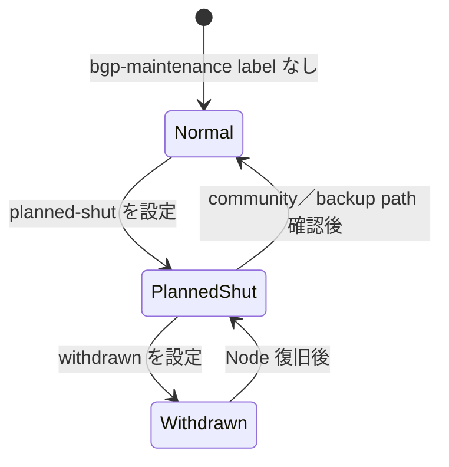
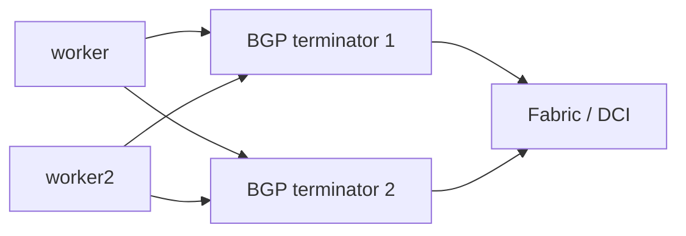

# Cilium BGP 経路退避とメンテナンス設計

## 1. 目的と初期方針

この文書は、Cilium BGP speaker が動作する worker Node、k02 の ADC BGR、および k03 で BGP 終端を
重畳する BDC Leaf を計画停止するときに、Service VIP traffic を残存経路へ退避する方法を定義する。

初期方針は次のとおりとする。

- worker Node は `normal → planned-shut → withdrawn` の 3 状態で管理する
- `planned-shut` では BGP session と route を維持し、well-known community `65535:0` により backup path へ
  変更する
- 残存 worker への切替と通信継続を確認してから `withdrawn` へ移し、BGP session と route を切り離す
- Node 数に依存しない通常用／planned-shut 用の 2 profile を site ごとに用意する
- Cilium Graceful Restart は初期状態では無効とし、Node 本体の停止手段には使わない
- router／Leaf は NX-OS Graceful Shutdown または GIR で soft drain した後、必要な neighbor を停止する
- 初期運用では 1 回に 1 maintenance unit だけを退避し、worker と BGP 終端装置の作業を重ねない

実 manifest への反映と稼働環境への適用は、この文書の設計・静的検証後に別変更として行う。

## 2. label と profile

### 2.1 label 規則

Cilium BGP 公式文書の `rack: rack0`、`advertise: bgp` の例と同様に、BGP 検証用 label は prefix なしの
短い名前を使用する。Cilium の予約 label ではなく、本ラボ固有の label である。

| Object | Label | 意味 |
|---|---|---|
| Node | `bgp-speaker=true` | BGP speaker role を持つ worker |
| Node | label なし | 通常状態 |
| Node | `bgp-maintenance=planned-shut` | route を残した soft drain 状態 |
| Node | `bgp-maintenance=withdrawn` | どの BGP profile にも選択されない切り離し状態 |
| `CiliumBGPAdvertisement` | `advertise=k02-normal` 等 | `CiliumBGPPeerConfig` から参照する advertisement profile |
| Service | `bgp-advertise=true` | Cilium BGP 広告対象 Service |
| Service | `dci-export=clustermesh` | Cluster Mesh API の DCI 公開対象 |

`bgp-speaker=true` は role label として維持し、maintenance 中にも削除しない。通常復帰は
`bgp-maintenance` だけを削除する。

### 2.2 状態遷移



| State | matching profile | BGP session | route | traffic |
|---|---|---|---|---|
| `normal` | normal | `established` | 通常 attribute、ECMP 対象 | 通常転送 |
| `planned-shut` | planned-shut | `established` を維持 | `planned-shut` community 付き backup | 原則として他方 worker |
| `withdrawn` | なし | down | target worker route なし | 他方 worker だけ |

### 2.3 通常用 `CiliumBGPClusterConfig`

```yaml
spec:
  nodeSelector:
    matchLabels:
      bgp-speaker: "true"
    matchExpressions:
      - key: bgp-maintenance
        operator: DoesNotExist
```

### 2.4 planned-shut 用 `CiliumBGPClusterConfig`

```yaml
spec:
  nodeSelector:
    matchLabels:
      bgp-speaker: "true"
      bgp-maintenance: planned-shut
```

2 つの selector は排他的にする。`bgp-maintenance=withdrawn` はどちらにも一致しない。複数の
`CiliumBGPClusterConfig` が同じ Node を選択すると `cilium.io/ConflictingClusterConfig` になるため、selector の
排他性を適用前後に確認する。

### 2.5 planned-shut 用 advertisement

`CiliumBGPAdvertisement` は Node label を直接参照しない。Node label で planned-shut 用
`CiliumBGPClusterConfig` を選び、その ClusterConfig が参照する `CiliumBGPPeerConfig` から planned-shut 用
Advertisement を選択する。

planned-shut profile は通常 profile と同じ Service selector、aggregation length、site community を保持し、
`planned-shut` だけを追加する。

```yaml
# CiliumBGPPeerConfig の address family selector
families:
  - afi: ipv4
    safi: unicast
    advertisements:
      matchLabels:
        advertise: k02-planned-shut
  - afi: ipv6
    safi: unicast
    advertisements:
      matchLabels:
        advertise: k02-planned-shut
---
# CiliumBGPAdvertisement
metadata:
  name: k02-loadbalancer-planned-shut
  labels:
    advertise: k02-planned-shut
spec:
  advertisements:
    - advertisementType: Service
      service:
        addresses:
          - LoadBalancerIP
        aggregationLengthIPv4: 26
        aggregationLengthIPv6: 112
      selector:
        matchLabels:
          bgp-advertise: "true"
      attributes:
        communities:
          wellKnown:
            - planned-shut
    - advertisementType: Service
      service:
        addresses:
          - LoadBalancerIP
      selector:
        matchLabels:
          dci-export: clustermesh
      attributes:
        communities:
          standard:
            - "65012:510"
          wellKnown:
            - planned-shut
```

Cluster Mesh API route に k02 `65012:510`／k03 `65022:510` を付ける場合は、その standard community も
planned-shut profile で維持する。通常用と planned-shut 用 advertisement を同一 peer から同時に選択しては
ならない。同じ aggregate に異なる path attribute を持つ advertisement が重複する Cilium の undefined 動作を
避ける。

### 2.6 Node 数に依存しない resource 構成

| Site | Profile | ClusterConfig | PeerConfig | Advertisement |
|---|---|---|---|---|
| k02 | normal | `k02-workers-normal` | `k02-direct-normal` | `k02-loadbalancer-normal` |
| k02 | planned-shut | `k02-workers-planned-shut` | `k02-direct-planned-shut` | `k02-loadbalancer-planned-shut` |
| k03 | normal | `k03-workers-normal` | `k03-multihop-normal` | `k03-loadbalancer-normal` |
| k03 | planned-shut | `k03-workers-planned-shut` | `k03-multihop-planned-shut` | `k03-loadbalancer-planned-shut` |

この 2 profile は worker 数が増えても追加しない。新しい worker は `bgp-speaker=true` だけで normal profile に
入る。ただし、現在の複数 NIC 設計では正しい router ID と source address を保証するため、Node 固有の
`CiliumBGPNodeConfigOverride` は引き続き必要である。Node address から生成する script の対象とし、maintenance
resource の手動複製にはしない。

通常／planned-shut 間で peer 定義、timer、multihop、aggregation、Service selector が drift しないよう、実装時は
site 別 Kustomize base と planned-shut attribute patch から生成する。

## 3. 可用性モデル

各 site は worker 2 Node と BGP 終端 2 台の全組み合わせで session を形成する。



| Site | Cilium speaker | BGP 終端 | 計画停止中に必須の残存状態 |
|---|---|---|---|
| k02 | `adc-k02-worker`、`adc-k02-worker2` | `adc-bgrt0101`、`adc-bgrt0102` | 1 worker 以上かつ 1 ADC BGR 以上 |
| k03 | `bdc-k03-worker`、`bdc-k03-worker2` | `bdc-lfsw0101`、`bdc-lfsw0102` | 1 worker 以上かつ 1 BDC Leaf 以上 |

「BGP session が残る」だけでは合格にしない。残存 worker の aggregate blackhole route、Cilium advertised
route、BGP 終端での best path、EVPN Type-5 route、FIB、実際の VIP traffic が一つの end-to-end path として
成立することを確認する。

worker 1 台と BGP 終端 1 台を同時に停止しても論理上は対角の 1 path が残るが、冗長性がなくなる。単独試験に
合格するまでは同時 maintenance を許可しない。

### 3.1 Cluster Mesh API の追加 gate

Cluster Mesh 有効化後は、Service VIP の通常確認に加えて次を maintenance 開始条件とする。

1. `clustermesh-apiserver` が worker 2 Node に 1 Pod ずつ配置され、`2/2 Ready` である。
2. PDB `minAvailable: 1` と Service `sessionAffinity: ClientIP` が有効である。
3. Cluster Mesh API exact route が local Fabric と remote site の両方に存在する。
4. 両 cluster の remote readiness と Global Service probe が正常である。
5. 10 分未満で作業を完了できるか、`cacheTTL: 10m` を超える場合の影響を承認済みである。

```bash
kubectl --context kind-adc-k02 -n kube-system get pod \
  -l k8s-app=clustermesh-apiserver -o wide
kubectl --context kind-adc-k02 -n kube-system get pdb clustermesh-apiserver
cilium clustermesh status --context kind-adc-k02 --wait
cilium clustermesh status --context kind-bdc-k03 --wait
```

`planned-shut` 設定後は、API VIP route の path 数、remote API reconnect、full resync、
`cilium_clustermesh_remote_cluster_cache_revocations`、Global Service の応答 cluster を同じ時刻軸で記録する。
planned maintenance 中の API VIP 全 withdraw と cache revocation は不合格とする。障害面ごとの判断と Test ID は
[Cluster Mesh 基本設計、Fabric／DCI 境界、合否基準](clustermesh-fabric-dci-and-acceptance.md)を参照する。

## 4. Graceful Restart、Graceful Shutdown、planned-shut

| 機能 | 主な対象 | route の扱い | 本ラボでの位置付け |
|---|---|---|---|
| `planned-shut` community | worker の計画停止 | session と route を維持して低優先度化 | worker soft drain に採用 |
| Node selector 非一致 | worker の計画停止 | session を閉じて route を withdraw | soft drain 後の hard withdraw |
| Cilium Graceful Restart | Cilium Agent の短時間再起動 | peer が stale route を一定時間保持 | 初期無効、Agent-only 比較 |
| NX-OS Graceful Shutdown | router／Leaf の計画停止 | route を残して最低優先度化 | 機器 soft drain に採用候補 |
| NX-OS GIR | Leaf 全体の計画停止 | BGP、IGP、vPC 等を順序付きで isolate | BDC Leaf 全体の比較候補 |
| BGP Hold Timer | 非計画停止 | timeout 後に withdraw | fallback。計画停止では待たない |
| BFD | failure detection | Cilium BGP Control Plane は未対応 | 対象外 |

Cilium Graceful Restart は Agent 再起動中も datapath が動作する場合に有効である。一方、Node 本体が停止すると
datapath も停止する。初期 `CiliumBGPPeerConfig` は `gracefulRestart.enabled: false` を維持する。Node 本体の
計画停止では本節の soft drain／hard withdraw を使用する。

## 5. worker Node の試験手順

### 5.1 site 別変数

実行 shell で topology、target、prefix を明示する。次は single-site k02 の例である。

```bash
export TOPOLOGY_PROFILE=nxos_singlesite
export REPO_ROOT="$(git rev-parse --show-toplevel)"
export K8S_CLIENT_RUNTIME="${REPO_ROOT}/nxos_fabric/${TOPOLOGY_PROFILE}/k8s_kind/client/runtime"
export PATH="${K8S_CLIENT_RUNTIME}/bin:${PATH}"
hash -r
command -v helm kubectl cilium hubble

export CLUSTER_NAME=adc-k02
export CLUSTER_ID="${CLUSTER_NAME##*-}"
export CLABNAME=nxos-fabric-singlesite
export KUBECONFIG="${REPO_ROOT}/nxos_fabric/${TOPOLOGY_PROFILE}/clab-${CLABNAME}/${CLUSTER_NAME}/k8s_kind/${CLUSTER_ID}/kubeconfig-${CLUSTER_ID}"
test -r "${KUBECONFIG}"
kubectl config get-contexts

export TARGET=adc-k02-worker
export OTHER=adc-k02-worker2
export V4_PREFIX=172.16.14.0/26
export V6_PREFIX=fd21:0:0:14:0:0:1:0/112
```

k02／k03 を multi-site で試験する場合は `TOPOLOGY_PROFILE=nxos_multisite`、
`CLABNAME=nxos-fabric-multisite` とする。k03 は
`CLUSTER_NAME=bdc-k03`、`TARGET=bdc-k03-worker`、`OTHER=bdc-k03-worker2`、`V4_PREFIX=172.16.15.0/26`、
`V6_PREFIX=fd21:0:0:15:0:0:1:0/112` とする。worker2 を target にする試験では `TARGET`／`OTHER` を入れ替える。
いずれかの CLI が表示されない場合は、[クライアントツール準備手順](client-tools.md)を先に実行する。

### 5.2 baseline と事前 gate

次をすべて満たさない場合は開始しない。

1. target／other worker が `Ready` で、IPv4／IPv6 の全 peer が `established` である。
2. BGP 終端 2 台が各 aggregate を target／other worker の両方から受信している。
3. Cilium route の best-path 選択点で NX-OS `graceful-shutdown aware` が有効である。
4. worker 2 Node に site aggregate の blackhole route がある。
5. Cilium Operator が `Ready` である。
6. PodDisruptionBudget、backend 数、other worker の空き resource が drain を許容する。
7. IPv4／IPv6 の短時間 HTTP probe と長時間 TCP flow を開始している。

```bash
date -u '+%Y-%m-%dT%H:%M:%SZ'
kubectl get nodes -L bgp-speaker,bgp-maintenance
kubectl get node "${TARGET}" --show-labels
kubectl -n kube-system get pods -o wide
kubectl get pdb -A
kubectl get ciliumbgpclusterconfigs -o wide
kubectl get ciliumbgpclusterconfigs -o yaml
cilium bgp peers
cilium bgp peers --node "${TARGET}"
cilium bgp routes advertised ipv4 unicast
cilium bgp routes advertised ipv6 unicast
cilium bgp routes advertised ipv4 unicast --node "${TARGET}"
cilium bgp routes advertised ipv6 unicast --node "${TARGET}"
```

target の session state と Established 時刻を保存する。

```bash
kubectl get ciliumbgpnodeconfig "${TARGET}" -o jsonpath='{range .status.bgpInstances[*].peers[*]}{.name}{"\t"}{.peerAddress}{"\t"}{.peeringState}{"\t"}{.establishedTime}{"\n"}{end}'
kubectl get ciliumbgpnodeconfig "${TARGET}" -o jsonpath='{.metadata.uid}{"\t"}{.metadata.ownerReferences[0].name}{"\t"}{.metadata.resourceVersion}{"\n"}'
```

`cilium bgp peers` の `Uptime` と、`CiliumBGPNodeConfig.status` の `establishedTime` を両方保存する。route の
`Age` は attribute update でリセットされ得るため、session reset の判定には使わない。metadata の UID、owner、
resource version は profile 切替時に resource が更新または再生成されたかを判別する補助情報とし、session 維持の
最終判定には `establishedTime` と NX-OS neighbor uptime を使用する。

label 操作の前に別 terminal で次を開始し、`Ctrl-C` で停止する。runtime log は Git 管理外の `/tmp` に保存する。
1 秒精度では境界値を判定できない場合、次回試験で poll 間隔または metrics 収集方法を見直す。

```bash
while true; do
  date -u '+%Y-%m-%dT%H:%M:%SZ'
  kubectl get ciliumbgpnodeconfig "${TARGET}" -o jsonpath='{range .status.bgpInstances[*].peers[*]}{.name}{"\t"}{.peerAddress}{"\t"}{.peeringState}{"\t"}{.establishedTime}{"\n"}{end}'
  sleep 1
done | tee "/tmp/${TARGET}-bgp-peer-transition.log"
```

advertised route の attribute は別 terminal で記録する。

```bash
while true; do
  date -u '+%Y-%m-%dT%H:%M:%SZ'
  cilium bgp routes advertised ipv4 unicast --node "${TARGET}"
  cilium bgp routes advertised ipv6 unicast --node "${TARGET}"
  sleep 1
done | tee "/tmp/${TARGET}-bgp-route-transition.log"
```

各 BGP 終端装置でも baseline を取得する。`<worker-address>` と `<service-prefix>` を address family ごとに
置き換える。

```text
show bgp vrf tenant1-vpc1 ipv4 unicast summary
show bgp vrf tenant1-vpc1 ipv6 unicast summary
show bgp vrf tenant1-vpc1 ipv4 unicast neighbors <worker-address>
show bgp vrf tenant1-vpc1 ipv6 unicast neighbors <worker-address>
show bgp vrf tenant1-vpc1 ipv4 unicast <service-prefix>
show bgp vrf tenant1-vpc1 ipv6 unicast <service-prefix>
show ip route vrf tenant1-vpc1 <service-prefix>
show ipv6 route vrf tenant1-vpc1 <service-prefix>
show bgp l2vpn evpn route-type 5
show running-config bgp | include graceful-shutdown
```

NX-OS neighbor の `up for`／Up/Down、target／other next-hop、best path、community、FIB next-hop 数を保存する。
`graceful-shutdown aware` が未設定の場合は試験を開始しない。NX-OS `9.3(1)` 以降では、この設定により
`65535:0` を持つ受信 route を暗黙の inbound policy で低優先度化できる。本ラボでは次を明示する。

```text
router bgp <asn>
  graceful-shutdown aware
```

### 5.3 workload drain

Cilium 公式の Node shutdown 順序に合わせ、workload endpoint を先に退避する。Cilium DaemonSet は残す。

```bash
kubectl drain "${TARGET}" --ignore-daemonsets --timeout=10m
kubectl get pods -A -o wide --field-selector "spec.nodeName=${TARGET}"
kubectl get endpointslices -A -o wide
```

`externalTrafficPolicy: Local` の Service route は local endpoint 消失により変化し得るため、aggregate 対象の
`Cluster` Service と分けて記録する。

### 5.4 `normal → planned-shut`

操作直前と API 更新直後の時刻を記録する。

```bash
date -u '+%Y-%m-%dT%H:%M:%SZ'
kubectl label node "${TARGET}" bgp-maintenance=planned-shut --overwrite
date -u '+%Y-%m-%dT%H:%M:%SZ'
kubectl get node "${TARGET}" -L bgp-speaker,bgp-maintenance
```

次を確認する。

```bash
kubectl get ciliumbgpclusterconfigs -o yaml
kubectl get ciliumbgpnodeconfig "${TARGET}" -o yaml
kubectl get ciliumbgpnodeconfig "${TARGET}" -o jsonpath='{.metadata.uid}{"\t"}{.metadata.ownerReferences[0].name}{"\t"}{.metadata.resourceVersion}{"\n"}'
kubectl get events -A --sort-by=.metadata.creationTimestamp
cilium bgp peers
cilium bgp peers --node "${TARGET}"
cilium bgp routes advertised ipv4 unicast
cilium bgp routes advertised ipv6 unicast
cilium bgp routes advertised ipv4 unicast --node "${TARGET}"
cilium bgp routes advertised ipv6 unicast --node "${TARGET}"
```

合格条件は次のとおりである。

- target が planned-shut profile だけに一致し、`ConflictingClusterConfig` がない
- target の全 IPv4／IPv6 session が `established` のままである
- baseline の `establishedTime` が変わらず、`cilium bgp peers` の `Uptime` が継続している
- target の `/26`／`/112` route と Local Service の `/32`／`/128` route が意図せず withdraw されず、
  `planned-shut` または `65535:0` が付いている
- other worker の route には `planned-shut` が付いていない
- NX-OS BGP RIB では target route が有効な backup として残り、other worker が best path である
- FIB／EVPN Type-5 は other worker を使用し、IPv4／IPv6 VIP traffic が継続する

NX-OS では次を再実行し、community、best path、neighbor uptime を baseline と比較する。

```text
show bgp vrf tenant1-vpc1 ipv4 unicast neighbors <target-worker-ipv4>
show bgp vrf tenant1-vpc1 ipv6 unicast neighbors <target-worker-ipv6>
show bgp vrf tenant1-vpc1 ipv4 unicast <service-prefix>
show bgp vrf tenant1-vpc1 ipv6 unicast <service-prefix>
show ip bgp community-list graceful-shutdown
show ip route vrf tenant1-vpc1 <service-prefix>
show ipv6 route vrf tenant1-vpc1 <service-prefix>
show bgp l2vpn evpn route-type 5
```

`show ip bgp community-list graceful-shutdown` の表示有無だけでは合格にしない。VRF の route 詳細で
`65535:0`、best path、next-hop を確認し、RIB／FIB が other worker を選択したことを正とする。

label 更新から Cilium route attribute 反映、NX-OS best-path 変更、FIB 変更までの時刻を別々に記録する。

| Measurement | 起点 | 終点 | 初期合格値 |
|---|---|---|---:|
| `T-ATTR` | label 更新 | Cilium advertised route に `planned-shut` | k02 `3` 秒以内、k03 `5` 秒以内 |
| `T-BEST` | label 更新 | NX-OS best path が other worker | k02 `3` 秒以内、k03 `5` 秒以内 |
| `T-FIB` | label 更新 | FIB／EVPN が other worker | k02 `3` 秒以内、k03 `5` 秒以内 |

この値は公式保証値ではなく、本ラボの初期 SLO である。N9Kv の実測分布から見直す。

### 5.5 継続通信

Fabric 側 client から IPv4／IPv6 を別に試す。

```bash
for i in $(seq 1 100); do
  curl --fail --silent --show-error --max-time 2 "http://<ipv4-vip>/healthz" || break
done

for i in $(seq 1 100); do
  curl --fail --silent --show-error --max-time 2 "http://[<ipv6-vip>]/healthz" || break
done
```

短時間 request は各 address family `100/100` 成功を合格とする。長時間 TCP flow は reset 数と時刻を記録する。
BGP soft drain は per-flow connection draining ではないため、ECMP rehash による既存 flow reset は新規
connection の失敗と分けて評価する。

Hubble では soft drain 前後の drop reason を確認する。BGP route の制御時間は Hubble では判定せず、NX-OS
RIB／FIB と Cilium BGP status を正とする。

```bash
hubble observe --since 5m --verdict DROPPED
```

### 5.6 `planned-shut → withdrawn`

soft drain の全条件に合格してから実行する。

```bash
date -u '+%Y-%m-%dT%H:%M:%SZ'
kubectl label node "${TARGET}" bgp-maintenance=withdrawn --overwrite
date -u '+%Y-%m-%dT%H:%M:%SZ'
kubectl get node "${TARGET}" -L bgp-speaker,bgp-maintenance
cilium bgp peers
kubectl get ciliumbgpnodeconfigs
```

次を確認してから Node／container を停止する。

- target は通常／planned-shut のどちらにも選択されない
- target の BGP session と advertised route が消える
- target next-hop が両 BGP 終端装置から消える
- other worker の route、EVPN Type-5、FIB、VIP traffic が残る
- route 数は想定した target 1 Node 分だけ減り、`0` にならない

`T-WITHDRAW` は label 更新から target next-hop が FIB／EVPN から消えるまでとし、k02 `3` 秒以内、k03 `5` 秒
以内を初期合格値とする。固定の `sleep` だけでは合格にせず、upstream route を確認する。

### 5.7 復旧

Node は cordon と `bgp-maintenance=withdrawn` を維持したまま起動する。Fabric address、static route、MTU、
site aggregate blackhole route、Cilium Agent を確認してから backup path として戻す。

```bash
date -u '+%Y-%m-%dT%H:%M:%SZ'
kubectl label node "${TARGET}" bgp-maintenance=planned-shut --overwrite
date -u '+%Y-%m-%dT%H:%M:%SZ'
cilium bgp peers
kubectl get ciliumbgpnodeconfig "${TARGET}" -o yaml
```

全 peer の `established`、新しい `establishedTime`、`planned-shut` community、backup path、VIP traffic を
確認する。`T-REESTABLISH` は label 更新から全 IPv4／IPv6 peer が `established` になるまでとし、初期合格値は
k02 `15` 秒以内、k03 `20` 秒以内とする。

backup path が安定した後に normal へ戻す。

```bash
date -u '+%Y-%m-%dT%H:%M:%SZ'
kubectl label node "${TARGET}" bgp-maintenance-
date -u '+%Y-%m-%dT%H:%M:%SZ'
cilium bgp peers
cilium bgp routes advertised ipv4 unicast
cilium bgp routes advertised ipv6 unicast
```

この切替では `establishedTime` が変わらず、community だけが消え、baseline と同じ ECMP next-hop 数へ戻ることを
確認する。最後に workload scheduling を戻す。

```bash
kubectl uncordon "${TARGET}"
kubectl get nodes -L bgp-speaker,bgp-maintenance
```

## 6. label-based soft drain の採否

通常用／planned-shut 用 `CiliumBGPClusterConfig` の切替時に session が維持されることは、公式文書で無停止保証
されていない。このため、次のいずれかが発生した場合は label-based soft drain を不合格とする。

- `normal → planned-shut` または `planned-shut → normal` で `establishedTime` が変わる
- BGP session が一度でも `idle`／`active` になる
- `planned-shut` attribute が付く前に target route が withdraw される
- `ConflictingClusterConfig`、`NoMatchingNode` 以外の予期しない condition、Operator reconcile error が出る
- target route が backup として残らない、または other worker が best path にならない
- 短時間 request が `100/100` 成功しない

不合格の場合は、通常 `CiliumBGPClusterConfig` 1 つと hard withdraw label の設計へ戻し、soft drain は
ADC BGR／BDC Leaf の target worker neighbor に対する NX-OS inbound policy で行う。Cilium resource の
Node ごとの複製には移行しない。

Operator／Agent log も判定材料にする。

```bash
kubectl -n kube-system logs deploy/cilium-operator --since=10m | grep bgp
TARGET_POD=$(kubectl -n kube-system get pods \
  -l k8s-app=cilium --field-selector "spec.nodeName=${TARGET}" -o name)
kubectl -n kube-system logs "${TARGET_POD}" -c cilium-agent --since=10m | grep bgp-control-plane
```

## 7. BGP 終端 router／Leaf の計画停止

### 7.1 共通方針

router／Leaf は次の二段階とする。

1. **Soft drain**: Fabric-facing BGP で NX-OS Graceful Shutdown を有効化し、代替終端装置を best path にする。
2. **Hard withdraw**: target 上の Cilium-facing IPv4／IPv6 neighbor を shutdown し、Service route を消す。

Graceful Shutdown は代替 route がある場合だけ効果がある。送信側の address family で `send-community`、
受信して best-path を選択する側で `graceful-shutdown aware` が必要である。通常の outbound route-map が
Graceful Shutdown 用 route-map より優先されるため、既存 policy と community の伝搬を NX-OS `10.5(4)`／N9Kv
で確認する。

```text
router bgp <asn>
  graceful-shutdown aware
  neighbor <fabric-peer>
    graceful-shutdown activate
    address-family <ipv4|ipv6|l2vpn> <unicast|evpn>
      send-community
```

soft drain が EVPN Type-5 で期待どおり動作しない場合は、target BGP 終端装置を停止せず変更を戻す。hard
withdraw は soft drain 合格後の最終切り離しとする。

### 7.2 k02 ADC BGR

`adc-bgrt0101` または `adc-bgrt0102` を 1 台ずつ対象にする。target ADC BGR から ADC Leaf へ送られる Cilium
Service route を低優先度化し、Fabric が他方の ADC BGR を best path とした後に target の Cilium-facing
neighbor を停止する。

### 7.3 k03 BDC Leaf 重畳

`bdc-lfsw0101` または `bdc-lfsw0102` を 1 台ずつ対象にする。Leaf 全体の Graceful Shutdown／GIR は Cilium
Service route 以外の EVPN route にも影響するため、vPC、NVE、underlay、Anycast Gateway を含む Fabric
メンテナンスとして判定する。Cilium route が他方の Leaf 経由になっただけでは、Leaf 全体の停止準備完了とは
みなさない。

### 7.4 復旧順序

1. target router／Leaf と Fabric adjacency を復旧する。
2. Graceful Shutdown を残したまま Cilium-facing neighbor を `no shutdown` にする。
3. session uptime、受信 aggregate、backup route、EVPN Type-5、FIB、VIP traffic を確認する。
4. `no graceful-shutdown activate` で通常 path／ECMP へ戻す。
5. baseline と同じ next-hop 数に戻ったことを確認する。

## 8. Test ID と合否基準

| Test ID | 操作 | 合格条件 |
|---|---|---|
| `MNT-00` | baseline | session、Established 時刻、route age、next-hop、community、FIB、traffic を保存できる |
| `MNT-01` | `normal → planned-shut` | session uptime を維持し、target route が `65535:0` 付き backup になる |
| `MNT-02` | `planned-shut → withdrawn` | other worker の traffic を維持して target route だけを消せる |
| `MNT-03` | `withdrawn → planned-shut` | target session が合格時間内に再確立し、backup route として戻る |
| `MNT-04` | `planned-shut → normal` | session reset なしで community が消え、baseline の ECMP へ戻る |
| `MNT-05` | Agent-only restart | GR 無効時の route churn を測定し、後続 GR profile と比較できる |
| `MNT-06` | ADC BGR 退避 | Graceful Shutdown 後に他方 BGR が best path となり、hard withdraw 後も通信できる |
| `MNT-07` | BDC Leaf 退避 | 他方 Leaf 経由へ収束し、vPC／NVE／Node bond の残存 path が正常である |
| `MNT-08` | abort／rollback | 不合格時に target を停止せず、直前の安定状態へ戻せる |
| `MNT-09` | worker 追加 | maintenance resource を増やさず、speaker label と生成した Node override だけで参加できる |

## 9. 中止条件

次のいずれかに該当した場合は target を停止しない。

- 残存 worker または BGP 終端装置の IPv4／IPv6 session が一つでも未確立である
- PodDisruptionBudget を満たせず drain が完了しない
- Cilium Operator が不在または reconcile error である
- `planned-shut` への切替で session reset／route withdraw が起きる
- target route が backup にならない、または残存 next-hop まで消える
- EVPN Type-5、FIB、VIP traffic が消失する
- soft drain 後も target が best path のままである

## 10. 実装状態と残る実測

| 項目 | 状態 |
|---|---|
| normal／planned-shut profile | site 別 `20-bgp.yaml`／`21-bgp-planned-shut.yaml` として作成済み |
| BGP label | `bgp-speaker`、`bgp-maintenance`、`advertise`、`bgp-advertise`、`dci-export` へ統一済み |
| profile の drift 確認 | Kustomize inventory と offline render を作成済み。CRD 導入後の server-side dry-run は未実施 |
| Node override | k02／k03 の worker 2 Node 分を実ファイル化済み。Node address 変更時は再生成が必要 |
| maintenance workload | `lab-smoke` に `PodDisruptionBudget minAvailable: 1` を追加済み |
| `MNT-01`～`MNT-04` | running cluster で profile 切替時の session 維持、route、community、traffic を実測する |
| NX-OS | device 別 candidate 作成後、`65535:0`、best path、EVPN Type-5、FIB を実測する |

短時間 flow は 1 request、長時間 flow は connection を維持した request と、新規 connection を一定間隔で
作る request を分ける。外部 network-multitool の `curl` から VIP へ送信し、開始時刻、HTTP code、接続時間を
記録するため、Kubernetes 内の常駐 generator は追加しない。

## 11. 公式参照

- [Cilium BGP Control Plane Operation Guide](https://docs.cilium.io/en/stable/network/bgp-control-plane/bgp-control-plane-operation/)
- [Cilium BGP Control Plane Resources](https://docs.cilium.io/en/stable/network/bgp-control-plane/bgp-control-plane-configuration/)
- [Cilium BGP Control Plane Troubleshooting](https://docs.cilium.io/en/stable/network/bgp-control-plane/bgp-control-plane-troubleshooting/)
- [Kubernetes: Labels and Selectors](https://kubernetes.io/docs/concepts/overview/working-with-objects/labels/)
- [Kubernetes: Safely Drain a Node](https://kubernetes.io/docs/tasks/administer-cluster/safely-drain-node/)
- [Cisco NX-OS `10.5(x)`: Configuring Advanced BGP](https://www.cisco.com/c/en/us/td/docs/dcn/nx-os/nexus9000/105x/unicast-routing-configuration/cisco-nexus-9000-series-nx-os-unicast-routing-configuration-guide/m-n9k-configuring-advanced-bgp-102x.html)
- [Cisco NX-OS `10.5(x)`: Graceful Insertion and Removal](https://www.cisco.com/c/en/us/td/docs/switches/datacenter/nexus9000/sw/105x/config-guides/sys-mgmt/cisco-nexus-9000-series-nx-os-system-management-configuration-guide-release-105x/m-configuring-gir.html)
