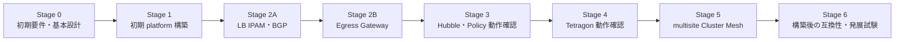

# 段階的な構築計画

## 1. 方針

試験を独立した後工程にはせず、動作可能な構成を一段ずつ積み上げる。各段階で要件と設計を
必要な範囲まで具体化し、設定作成、構築、受入確認、As-built更新までを完結させる。



各 Stage は前段の As-built 構成を出発点とする。k02 は初回から kube-proxy-free Cilium で作成し、
LB IPAM／BGP feature、single-site Egress Gateway feature、Hubble、Tetragon を初期 platform 構築に含める。
依存順序は維持し、Cilium Ready 後に LB／BGP resource と Tetragon release を導入する。Stage 2～4 は
基盤を後付けする段階ではなく、試験アプリ／policy を追加して機能ごとの合否を確定する確認段階とする。
未解決事象を残したまま、原因を増やす主要機能を追加しない。互換性比較や破壊的変更が必要な
発展機能だけを別profileとして扱う。

## 2. 各Stageの進め方


1. [要件・設計台帳](requirements-and-design.md)から対象項目を選び、採用理由、設定値、依存関係、
   受入条件を確定する。
2. [パラメータ・アドレス割り当て台帳](parameter-and-address-allocation.md)と
   [構成設計と構成図](architecture.md)を更新し、Kubernetes 内外の経路と責務を確認する。
3. [検証ワークロード設計](test-workloads.md)から対象workloadとTest IDを選び、kind設定、Helm values、
   Kubernetes manifest、確認コマンドを作成する。
4. schema、render結果、差分、アドレス重複、秘密情報の有無を静的に検証する。
5. ユーザーが対象と操作を明示した後にlabへ構築する。
6. 疎通だけでなく、状態、経路、可観測性、障害時動作を段階内で受入確認する。
7. 実測値をAs-builtへ反映し、台帳を`Validated`または課題付き`Open`へ更新する。

## 3. 共通の構築記録

各Stageで最低限次を記録する。runtime出力やsystem dumpはGit管理対象外へ保存する。

- 実施日時、担当、lab名、Git commitまたはworktree状態
- kind、Kubernetes、kubectl、Cilium、Cilium CLI、Hubble CLI、Helm、Tetragonのversion
- 要件・設計台帳の対象IDと、確認済み公式URL
- 使用したkind設定、Helm values、manifest
- 構築前後の変更点とrollback方法
- `kubectl get nodes -o wide`、Pod配置、各componentのstatus
- 期待状態、実測状態、判定、残課題
- NX-OS側BGP、route、counterの確認結果
- 失敗時のsystem dump保存先。dumpそのものはcommitしない

### 3.1 single-site の実施状況と残課題（2026-09-06 時点）

**次回は [TI-007：Po11〜16 の MTU 9100 統一](test-issue-register.md#ti-007-mtu-9100) から再開する（2026-09-06 時点の残課題）。**

- [ ] `system jumbomtu` と全対象ポートへの影響を確認し、Node／他サーバ向け Po11〜16 の MTU `9100` を config と稼働環境へ反映する（multisite は config のみ）
- [ ] IPv4／IPv6、gw-a／gw-b／通常経路で IP 全長 `9000` byte までを確認し、`8999`／`9000`／`9001` の境界、低レート TCP／UDP、API／BGP／LB 回帰を記録する

以下の `9216` 適用済みチェックは過去の実施範囲を表す。今回決めた `9100` への変更と `9000` byte の試験は未実施。

日付を固定した結果・適用状態・残課題は [2026-09-06 検証ステータス](validation-status-2026-09-06.md) を参照する。

Stage 1～4 のチェックは `nxos_singlesite/adc-k02` の保存済み結果に基づく。
`[x]` は記載した範囲で確認済み、`[ ]` は未実施・一部確認・設計照合待ちを表し、理由を併記する。注記のない未チェック項目も、保存証跡だけでは完了を確定できていない。
Stage 0 のチェックは設計・準備の確定であり、Stage 5～6 の multisite 実測完了を意味しない。
過去の失敗は証跡に保持し、後続結果で確認できた範囲だけを更新する。

| Stage | 現状 | 残りの中心 |
|---|---|---|
| 1 基盤 | 基本疎通と限定回帰は成功。全体試験は未合格 | 最新 lab CLI／回避策での全体回帰、InternalIP 設計照合、API 経路切替、MTU |
| 2A LB／BGP | 基本疎通と checksum 回避策下の Node 間 IPv6 LB は成功 | 未割当 VIP、経路退避・障害・広告変化の受入 |
| 2B Egress | 基本機能、新規 Pod、実経路、計画切替の既存接続を確認。大きい TCP／UDP は未合格 | TI-004 の高レート UDP 損失・一時 TCP／LB エラー、SNAT port 枯渇。Node 障害系は保留 |
| 3 Hubble／Policy | NP-00〜NP-07 の既存合格を継承。Relay と後続の限定回帰も成功 | UI 接続経路、追加 resource 評価。今回全 NP を再実行したわけではない |
| 4 Tetragon | TG-00～TG-08 の記録した観測・短時間負荷・停止復旧は合格 | 一部原本の転送元ハッシュ照合。accept 観測や長期負荷は確認範囲外 |
| 5～6 multisite／発展 | single-site の結果をもってチェックしない | 停止中の multisite は実測未実施 |

今回の実施対象から kernel 更新、kind worker／実行ホスト／containerlab の停止・再起動を除外する。
これらを必要とする受入項目は保留し、Cilium Pod 再作成の成功で代替しない。
checksum は暫定回避策の `off` を維持し、恒久修正済みとは扱わない。

## 4. Stage 0: 初期要件・基本設計

### 構築する状態

まだlabへ変更を加えず、Stage 1を安全に作成できる設計baselineを作る。後段の全設定を完全に
決めるのではなく、kind基盤とkube-proxy-free Ciliumに必要な値を確定し、後段の未決事項を明示する。

### 設計・作成項目

- [x] Containerlab `v0.78.2` 内蔵 kind library `v0.31.0` と Kubernetes `v1.35.5` Node image の組み合わせ、digest、`kind load` の制約を確定する
- [x] Cilium `v1.20.1`、Cilium CLI `v0.19.7`、Hubble CLI `v1.19.4`、Helm chart の version を固定する
- [ ] kubectl、Cilium CLI、Hubble CLIをsite別version fileで固定し、共通準備scriptの`--check`を合格させる
- [x] Tetragon `v1.7.0` と chart version の対応を確認する
- [x] host kernel、eBPF config、BTF、cgroup v2 の preflight を作成して実行する
- [x] bpffs、tracefs、host `/proc` mount の設計方針を決める
- [x] k02／k03 の Pod、Service、LoadBalancer CIDR と Node PodCIDR mask を割り当てる
- [x] ADC BGR `65010`、k02 `65012`、BDC 論理 BGR `65020`、k03 `65022` の ASN 台帳と変更境界を確定する
- [x] BDC BGP endpoint pool `172.16.253.0/24`、`fd21:0:0:253::/64` と Leaf 固有 address を予約する
- [x] k03 Node の `172.16.0.0/16` route next-hop と BDC Anycast Gateway が `172.16.5.1` で一致することを実測する
- [x] Node ごとの `eth0`、`eth1`／`eth2`、bond、VLAN、IP、MTU、route を As-designed 表にする
- [x] k02 の local VLAN `14`／`104` が VNI `10104` で `Up` となり、local port-channel／remote `nve1` で MAC 学習することを実測する
- [x] k02 Node-facing trunk は VLAN `1-4094` の許可を維持し、port-channel／member MTU `9216` の公開 config を準備する
- [x] k02 Leaf の対象 port-channel／member MTU `9216` を running-config へ適用し、LACP と trunk all を確認する
- [x] ADC Leaf 4 台の k02 Node-facing MTU／description 修正を startup-config へ保存する
- [x] k02 Node MTU `9100` を適用し、Fabric API の IPv4／IPv6 `/livez` HTTP `200` を確認する
- [ ] Cilium／Pod MTU `9000` の導入後に PMTUD、fragment、path MTU boundary を確認する
- [x] k03 の全 Node が `bond0.105`、Leaf 側が VLAN `105`／VNI `10105` であることを確認する
- [x] API は `eth0`、Node InternalIP は Fabric IP とする役割分担と bootstrap 順序を決める
- [x] 管理 API を primary、control-plane Fabric IP の TCP `6443` を secondary とし、証明書 SAN へ含める
- [ ] 対象network-multitoolの既存VLAN、IPv4/IPv6、gateway、leaf接続portを確認する
- [ ] 対象network-multitoolへのCLI/kubeconfig bind追記案を作成し、container再作成単位を決める
- [x] Containerlab 実行 host の site 別 PATH／KUBECONFIG と version 確認手順を準備する（[実行環境](execution-environment-singlesite-k02.md)）
- [ ] VIP利用clientを含むfabric側prefixの戻りrouteを確定する
- [x] Egress Gateway の single-site 専用 overlay、worker 2 Node、`bond0.104`、Gateway ごとの Egress IP、外部試験 server を割り当てる
- [x] Stage ごとの設定ファイル配置と rollback 単位を決める
- [ ] `lab-smoke`、`egress-probe`、`starwars`、`clustermesh-demo`のimage、digest、namespace、manifest境界を確定する
- [x] 段階構築と同じ設定部品を使う `singlesite-final`、`multisite-final` profile と適用順序を設計する

### Stage 1 と multisite 展開前に作成済みの設定

2026-08-24 時点で次の設定を静的に作成した。稼働中の k02／k03 には未適用であり、Kind Node の再作成と
Cilium Helm release の作成は後続作業とする。

| 成果物 | single-site | multisite | 状態 |
|---|---|---|---|
| Kind config | `nxos_singlesite/k8s_kind/k02/k02.kind.yaml` | `nxos_multisite/k8s_kind/k02/k02.kind.yaml` | 同一内容。Node image は各 topology の kind 共通値で Kubernetes `v1.35.5` digest 固定 |
| k03 Kind config | 対象外 | `nxos_multisite/k8s_kind/k03/k03.kind.yaml` | k03 固有 Pod／Service CIDR、API SAN、Node PodCIDR mask、mount を設定 |
| Containerlab post-link | `nxos_singlesite/nxos-fabric-singlesite.clab.yaml` | `nxos_multisite/nxos-fabric-multisite.clab.yaml` | bond／VLAN 作成後に k02／k03 の kubelet Node IP を更新 |
| Cilium base values | `nxos_singlesite/k8s_kind/k02/cilium/values/00-base.yaml` | `nxos_multisite/k8s_kind/k02/cilium/values/00-base.yaml` | Helm `v4.2.4`／chart `v1.20.1` で render に合格 |
| Cilium 初期 overlay | observability／single-site Egress | observability／Cluster Mesh | Hubble を初期導入し、site profile ごとの差分を分離 |
| Cilium LB IPAM／BGP resource | k02 pool／worker peer | k02／k03 pool／worker peer | worker 2 Node だけを speaker にする実ファイルを作成済み |
| Cluster Mesh API Service | 対象外 | k02／k03 の外部管理 Service | chart template にない `RequireDualStack` と固定 VIP を実ファイルで指定 |
| Tetragon values | k02 observe-only | k02／k03 observe-only | Cilium Ready 後に同じ初期構築手順で導入する |
| k03 Cilium base values | 対象外 | `nxos_multisite/k8s_kind/k03/cilium/values/00-base.yaml` | cluster ID `3`、k03 Fabric NodePort CIDR を設定し、chart `v1.20.1` で render に合格 |
| Cilium runtime values | `nxos_singlesite/k8s_kind/k02/cilium/runtime/10-k8s-api.yaml` | `nxos_multisite/k8s_kind/k02/cilium/runtime/10-k8s-api.yaml` | クラスタ作成後に生成、Git 管理外 |
| k03 Cilium runtime values | 対象外 | `nxos_multisite/k8s_kind/k03/cilium/runtime/10-k8s-api.yaml` | クラスタ作成後に生成、Git 管理外 |
| CoreDNS runtime parameter | `nxos_singlesite/k8s_kind/k02/cilium/runtime/20-coredns-upstream.env` | k02／k03 の site 別 `cilium/runtime/20-coredns-upstream.env` | Pod から到達確認した resolver を実行時選定し、Git 管理外で記録 |
| 共通スクリプト | `scripts/cilium-lab/configure-kubelet-node-ip.sh` | 同左 | local address 検証、kubelet restart を冪等化 |
| 共通スクリプト | `scripts/cilium-lab/render-k8s-api-values.sh` | 同左 | 全 Node から API `/livez` を確認後に出力 |
| 共通スクリプト | `scripts/cilium-lab/configure-coredns-upstream.sh` | 同左 | resolver 自動検出／明示指定、direct／Cluster DNS test、失敗時 rollback |
| Egress address スクリプト | `scripts/cilium-lab/configure-egress-gateway-addresses.sh` | 実験 profile だけで使用 | Gateway ごとの `egress0` と `/32`／`/128` を冪等設定する。実ファイル作成済み。適用・撤去の実測は実際の試験環境の記録を参照 |

両 Kind config には `disableDefaultCNI: true`、`kubeProxyMode: none`、dual-stack Pod／Service CIDR、
API Fabric address の certificate SAN、Node PodCIDR mask、Tetragon 用 `/procHost` mount を含めた。
Cilium base values には Kubernetes IPAM、VXLAN、kube-proxy replacement、MTU `9000`、
`devices: "eth0,bond0.+"`、Fabric NodePort CIDR、BGP Control Plane を含める。初期 overlay で Hubble と
site profile を重ね、Cilium Ready 後に LB IPAM／BGP resource と Tetragon を同じ構築手順内で導入する。
試験アプリ、Egress policy、Network Policy、TracingPolicy は初期構築から分離する。

確定した値は [パラメータ・アドレス割り当て台帳](parameter-and-address-allocation.md)を正本とする。
`[x]` は設計値の確定を示し、lab への適用や実測完了を示さない。

### 完了状態

- 使用versionとdigest、アドレス、interface、MTUのbaselineが文書化されている。
- site別CLI cacheがlocal checksumと報告versionの検証に合格している。
- NX-OSを通るnode間経路を構成図で説明できる。
- Stage 1とStage 2の対象項目が`Ready`である。
- 未決事項が後段のどのStageで判断されるか明示されている。

## 5. Stage 1: single-site kind + kube-proxy-free Cilium基盤

### 構築する状態

`nxos_singlesite/adc-k02` を最初から default CNI と kube-proxy なしで作成し、直後に Cilium を
kube-proxy replacement 有効で導入する。初期構築では Hubble、LB IPAM／BGP resource、
Egress Gateway feature gate、observe-only の Tetragon まで導入する。試験アプリと各種 policy は
リソース判定が合格するまで適用しない。

導入前に [kernel 判定と IPv6 checksum 対応方針](kernel-compatibility-policy.md) を確認し、
基本要件に加えて採用する通信方式に必要な helper capability を判定する。
互換設定が必要な場合は導入前に方針を決め、Cilium Ready 後の interface 生成時に適用する。
LB 利用開始前に、別 Node の backend を通る IPv6 通信を受入条件へ含める。
現状の preflight による数値判定だけで、この追加確認まで完了したとは扱わない。
検証済み互換設定の [登録・再適用・監視手順](checksum-compat-operations.md) と、
[kernel 恒久候補の評価](kernel-checksum-candidates.md) を併せて参照する。

### 設計・作成項目

- kind node imageをdigest固定する
- `disableDefaultCNI: true`、`kubeProxyMode: none`、dual-stack Pod/Service CIDRを明示する
- node role、extra mount、kubeadm patchを明示する
- Tetragonを後付けしてもnodeを再作成せずに済むよう、host `/proc`を`/procHost`へ初回からmountする
- Node `InternalIP`、default route、NX-OS向けrouteの選択方法を設定する
- control-plane `eth0` IPv4 を自動取得して全 Node から到達確認し、`k8sServiceHost` と
  `k8sServicePort: 6443` へ渡す
- API server証明書SANへFabric側IPv4/IPv6を追加し、管理endpointとFabric endpointを同時に維持する
- kubeletのdual-stack `node-ip`を各nodeの`bond0.<VLAN>` addressへ固定する
- CiliumはVXLAN、Kubernetes IPAM、`kubeProxyReplacement: true`で導入する
- Cilium／Pod MTU `9000`、Node Fabric interface MTU `9100` を明示する
- Ciliumの`devices`に管理用`eth0`とfabric側`bond0.<VLAN>`を含める
- `nodePort.addresses`をk02のfabric側IPv4/IPv6 CIDRへ限定する
- `bgpControlPlane.enabled: true`と`defaultLBServiceIPAM: none`を初回valuesへ含める
- Cilium Helm values、install／status、rollback 手順を作成する
- worker 2 Node だけへ BGP speaker label を付け、LB IPAM／BGP resource を適用する
- Hubble と observe-only の Tetragon を初期構築し、試験アプリを適用しない状態でリソースを測定する
- リソース判定後に [検証ワークロード設計](test-workloads.md)の `lab-smoke` を使い、dual-stack ClusterIP／NodePort を確認する

### 受入確認

根拠：[2026-09-05 限定通信](../../nxos_singlesite/operations/cilium-lab/2026-09-05/adc-k02/connectivity-result.md)、[全体結果](../../nxos_singlesite/operations/cilium-lab/2026-09-06/adc-k02/connectivity-full-result.md)、[回避策適用後の限定回帰](../../nxos_singlesite/operations/cilium-lab/2026-09-06/adc-k02/offload-regression-result.md)、[現在状態の保存](../../nxos_singlesite/operations/cilium-lab/2026-09-06/adc-k02/raw/egress-cidr-outside-8oPoHTOX/plan-audit/)。

- [x] kube-proxy Pod が存在せず、Cilium agent／operator と全 Node が Ready になる（2026-09-06 状態再確認）
- [ ] CoreDNS の A／AAAA 名前解決を両方照合する（外部 FQDN の成功だけでは両 family の完了としない）
- [ ] 通常管理kubectlとCilium agentが`eth0`側primary endpoint経由でAPI serverへ到達する
- [ ] Fabric側network-multitoolでtopology設定済みPATHのkubectlがcontrol-plane Fabric IP:6443経由で同じAPI serverへ到達する
- [ ] primary/secondaryの一方を試験的に遮断しても、もう一方の経路と役割を説明できる
- [ ] Node `InternalIP` と設計を照合する（実測は IPv4 `172.18.0.2`／`172.18.0.3`／`172.18.0.6`、IPv6 `fc00:f853:ccd:e793::2`／`fc00:f853:ccd:e793::3`／`fc00:f853:ccd:e793::6`。本節の Fabric IP 指定とは不一致。設計・稼働値の扱いを要整理）
- [x] Cilium の `devices=eth0,bond0.+` と Fabric 限定の `nodeport-addresses` を確認し、Fabric 側 NodePort の IPv4／IPv6 通信に成功する
- [x] 同一 Node・異なる Node の Pod 間 IPv4／IPv6 が成功する（2026-09-05 の限定自動試験）
- [x] ClusterIP、Fabric 側 NodePort、Pod から外部への通信が成功する（2026-09-06 限定回帰・Egress 結果）
- [ ] Cilium connectivity test の全体受入を完了する（全体は 82 tests 中 4 tests 失敗。後続 lab CLI の限定 114 actions は成功、最新版での全体再実行は未実施）
- [ ] VXLAN UDP 8472とnode間trafficがNX-OS側pathを通る
- [ ] VLAN 14/104間をVNI 10104経由でARP/NDPとIPv4/IPv6通信が通る
- [ ] Docker 管理 network への意図しない迂回がないことを対象通信ごとに確認する（InternalIP は管理側。LB の成功だけで VXLAN underlay 全体を判定しない）
- [ ] `/procHost`、cgroup、bpffs、tracefsが設計どおり見える
- [ ] path MTU boundary／PMTUD の全体受入（server 側 Leaf の MTU は修正済み。Egress 外部宛の 1,400〜8,900 byte は全 180 packet 成功。全経路の最大 MTU・ICMP による PMTUD 回復・fragment の受入は未完了）
- [ ] kind worker 再起動後の復旧を確認する（今回の実施対象から除外）
- [ ] 同じ設定からクラスタを再作成できる（再作成試験は今回の実施対象から除外）

## 6. Stage 2: 外部接続

外部接続をinboundとoutboundに分ける。Stage 2Aで外部clientからService VIPへのinboundを確立し、
そのAs-built構成を維持したままStage 2BでPodから外部serverへのoutboundを追加する。同じStage内でも
設定、manifest、受入結果、rollbackは別の変更単位として記録する。

### 6.1 Stage 2A: Cilium LB IPAM と BGP Control Plane

#### 構築・試験手順

- [Stage 2A lab-smoke 実行手順](../../nxos_singlesite/k8s_kind/k02/cilium/manifests/validation/lab-smoke/README.md)：LB IPAM、BGP、ClusterIP／NodePort／LoadBalancer の確認と証跡保存。
- [ADC Stage 2A BGP 変更手順](../../nxos_singlesite/configs/changes/cilium-stage2a/README.md)：NX-OS 側の変更が必要な場合の投入順序と復旧。
- [BGP 計画停止・経路退避手順](bgp-maintenance-and-route-drain.md)：基本通信確認後の冗長性・保守試験。

基本通信の再確認は最初のリンクから開始する。既に適用済みの NX-OS 設定を再投入する必要はない。
既知の `TI-001`／`TI-002` は [試験課題台帳](test-issue-register.md) と対応付けて判定する。

#### 構築する状態

Stage 1 の初期構築で適用済みの `CiliumLoadBalancerIPPool` と BGP Control Plane v2 resource を使い、
LoadBalancer VIP の割り当てと経路広告を試験する。MetalLB は導入しない。初期 advertisement は
LoadBalancer VIP だけとし、Pod CIDR 広告は分離する。

#### 設計・作成項目

- `k02-infra`／`k02-app`、`k03-infra`／`k03-app` の dual-stack LB IPAM pool と、k01 MetalLB pool の非重複
- IPv4／IPv6 を別 session とする BGP peer、ASN、AFI／SAFI、advertisement selector
- ADC は `adc-bgrt0101/0102`、BDC は `bdc-lfsw0101/0102` の専用 loopback で終端する site 別 peer 設計
- BDC Leaf の `local-as 65020 no-prepend replace-as`、eBGP multihop、EVPN Type-5、prefix filter、multipath
- Keepalive `10`、Hold `30`、k03 multihop TTL `5`、`maximum-prefix 64`、`maximum-paths 4`。BFD は無効
- `defaultLBServiceIPAM: none`と`loadBalancerClass: io.cilium/bgp-control-plane`
- IPv4/IPv6を必須にする`ipFamilyPolicy: RequireDualStack`
- 初回から使用する Cilium `/26`／`/112` 集約と、不合格時の直接 BGP 終端／DCI BGW 集約への rollback
- advertisement 前に worker 2 Node へ設定する site aggregate blackhole route と冪等 script
- Cilium 集約時の未割り当て VIP、重複 path attribute、`externalTrafficPolicy: Local`、withdraw、rollback
- worker の normal／planned-shut profile、`bgp-maintenance` 状態遷移、ADC BGR／BDC Leaf の route 退避、復旧順序
- `lab-smoke`の同一backendを使う`externalTrafficPolicy: Cluster/Local`のService分離
- `externalTrafficPolicy`、SNAT/DSR、Maglevの切替方法
- resource削除時のVIP withdrawとrollback手順

#### 受入確認

根拠：[LB 回帰と経路確認](../../nxos_singlesite/operations/cilium-lab/2026-09-06/adc-k02/offload-regression-result.md)、[経路方針の適用結果](../../nxos_singlesite/operations/cilium-lab/2026-09-06/adc-k02/egress-range-unification-result.md)。

- [x] 希望 pool から IPv4／IPv6 VIP を割り当て、Cluster／Local の既存 2 Service で確認する
- [ ] BGP resource 適用前に worker 2 Node の `/26`／`/112` route type が `blackhole` である
- [x] NX-OS peer との BGP 8 セッションと Cilium LB `/26`／`/112` aggregate を確認する（初期適用前の blackhole 確認は別項目）
- [ ] 未割り当て VIP を試験し、Node 内で破棄されて routing loop がないことを判断できる
- [ ] DCI 公開 scope と集約ポイントを比較表の最終選定規則に従って確定できる
- [ ] BGP sessionとVIP trafficの送受信interfaceが`bond0.<VLAN>`である
- [x] k02 から見える peer ASN が `65010` である
- [ ] k03 から見える peer ASN が `65020` である（multisite 稼働時に確認）
- [ ] k03 の peer address が Leaf 固有 loopback であり、Anycast Gateway と peering していない
- [ ] external clientからVIP、node、PodまでをCiliumとNX-OSで追跡できる
- [ ] ECMPと`externalTrafficPolicy: Cluster/Local`の差を説明できる
- [x] worker の Cilium Pod 再作成後に BGP 8 Established と LB 通信、checksum off 設定の維持を確認する（[再作成試験](../../nxos_singlesite/operations/cilium-lab/2026-09-06/adc-k02/checksum-pod-restart-result.md)）
- [ ] Agent 再作成中の広告変化・収束時間を測定する（前後の正常確認とは別）
- [ ] Node 停止時の広告変化を確認する（今回の実施対象から除外）
- [ ] 全 backend 消失時の広告変化を確認する（未実施）
- [ ] worker を `planned-shut` へ移して session uptime を維持したまま target route を backup にし、`withdrawn` 後も残存 path で VIP traffic が継続する
- [ ] normal／planned-shut profile 切替時の Established 時刻、community、best path、FIB、収束時間を測定し、label-based soft drain の採否を判断できる
- [ ] ADC BGR、BDC Leaf を 1 台ずつ Graceful Shutdown／GIR で計画退避し、残存 path で VIP traffic が継続する
- [ ] BGP path を workload scheduling より先に戻し、baseline と同じ next-hop 数へ復旧できる
- [x] MetalLB なしで Cilium による VIP 割当、経路広告、外部到達が成立する（IPv6 Cluster は checksum 回避策あり）

### 6.2 Stage 2B: Cilium Egress Gateway

#### 構築・試験手順

[single-site k02 Egress Gateway 構築・試験手順](egress-gateway-test-plan.md)を実行手順の正本とする。
初回は同手順の「2. 端末 A／B の環境設定」と「3. 事前確認」から開始し、Policy 未適用 baseline、
`gw-a` の選択・SNAT、対象外・除外通信、`gw-b` 切替、撤去の順に進む。
試験 ID と設計上の期待値は [egress-probe の試験設計](test-workloads.md#6-egress-probe-egress-gateway) を参照する。

Egress Gateway の開始条件は、この機能に必要な health、外向き通信、アドレス・経路の確認で判断する。
全体 connectivity test の合否とは分けて記録する。今回の実行ホスト、配置パス、転送運用と実施順は
[実際の試験環境](execution-environment-singlesite-k02.md) にまとめる。

#### 構築する状態

Stage 1 で Egress Gateway feature gate と BPF masquerade を有効化済みの single-site k02 へ、
NX-OS の常設受信許可・集約を確認し、専用 IP、試験用 BGP advertisement、`CiliumEgressGatewayPolicy` と試験アプリを追加する。クラスタ再作成や Cilium の Helm upgrade は
行わない。Cluster Mesh へ展開する共通 values には feature gate を含めず、single-site 専用 overlay として
管理する。

#### 設計・作成項目

- `egressGateway.enabled: true`、`bpf.masquerade: true`、`kubeProxyReplacement: true`
- `identityAllocationMode: crd`を維持し、`ciliumEndpointSlice.enabled: false`を確認する
- 初期構築済み Egress Gateway overlay の status 確認と、policy の apply／delete 手順
- `adc-k02-worker`／`adc-k02-worker2` の `gw-a`／`gw-b` 排他的 profile と、namespace `egress-probe`／Pod label で対象を選ぶ selector
- `172.16.0.0/24`、`fd21:0:0:1::/64` と `adc-t1sv0101` を除外する `destinationCIDRs`／`excludedCIDRs`
- Gateway Node A の `egress0` 上の `172.16.24.1/32`、`fd21:0:0:24::1/128` と外部からの戻り経路
- Gateway Node B の `egress0` 上の `172.16.24.2/32`、`fd21:0:0:24::2/128` と外部からの戻り経路
- Cilium は Egress IP を Node へ動的に追加しないため、重複確認後に専用 Node script で `egress0` に `/32`／`/128` を設定する
- IPv4／IPv6 を別々の `CiliumEgressGatewayPolicy` とし、選択中 profile の単一 `egressGateway` と `egressIP` を指定する
- Policy では `egressIP` または `interface` のどちらか一方だけを指定する
- Cilium `devices`が選択したfabric interfaceを含むことを確認する
- 既存`adc-t1sv0102`を第一候補とする外部試験serverのaccess log、packet capture、NX-OS counterで送信元変換と経路を確認する
- [検証ワークロード設計](test-workloads.md)の`egress-probe`を使い、policy未適用、selector対象外、
  selector対象、invalid gateway/egress IPを分離する
- 新規Pod作成直後のpolicy反映遅延と、期待しないsource IPで外へ出る時間の測定
- gateway node再起動、policy再適用、既存connection切断、SNAT port枯渇の確認方法
- `gw-a` → `gw-b` の明示的 Policy 切替と Node hard stop を分け、既存 connection 切断、新規 connection の手動復旧時間を測定する
- IPv4とIPv6を別々に確認し、IPv6 BPF masqueradingはbetaとして結果を分離する

Egress IP の割当・広報・戻り経路は [専用 IP・BGP 経路設計](egress-gateway-routed-design.md) に従う。
k02 は `172.16.24.0/24`／`fd21:0:0:24::/64`、k03 は `172.16.25.0/24`／`fd21:0:0:25::/64` を予約し、
各 Node の `.1`／`.2`、`::1`／`::2` を `/32`／`/128` で広報する。LB 集約に含めない。
[single-site NX-OS 差分](../../nxos_singlesite/configs/changes/cilium-stage2b/README.md)は BGP 個別経路を受信するための追加で、
Node NIC の L2 や kubelet Node IP は変更しない。基本 config は Egress の `/24`／`/64` 集約も生成するが、
現段階では個別経路を抑止せず併存させる。試験後も NX-OS 常設設定は維持する。

#### 受入確認

2026-09-06 に基本試験を実施した。結果・撤去後の状態は [実際の試験環境](execution-environment-singlesite-k02.md#latest-egress-results) を参照する。
その後、両 worker の VXLAN TX checksum 回避策を適用し、[回帰試験](../../nxos_singlesite/operations/cilium-lab/2026-09-06/adc-k02/offload-regression-result.md) で
Egress の 46 HTTP、既存 LB の 42 HTTP、Service／NodePort 等の 114 actions が成功した。
LB IPv6 は回避策ありの条件付き合格。監視による設定ずれ修復と Cilium Pod 再作成後の維持確認は完了した。
恒久修正は未完了。Node／ホスト再起動は今回の対象外とする。
2026-09-06～07 の [残項目の試験結果](../../nxos_singlesite/operations/cilium-lab/2026-09-06/adc-k02/egress-remaining-result.md) では、
新規 Pod 240 HTTP、経路照合、既存接続の reset と新規接続の復旧を確認した。
大きい TCP／UDP は 48 条件を比較したが未合格。通常経路でも失敗し、SNAT port 枯渇は保留した。
追加の [MTU 境界測定](../../nxos_singlesite/operations/cilium-lab/2026-09-06/adc-k02/egress-mtu-result.md) で、両 family と全 3 経路の 1,500 byte 境界、server 側 Leaf port-channel／member の MTU 1500 を確認した。その後、[MTU 修正と再試験](../../nxos_singlesite/operations/cilium-lab/2026-09-06/adc-k02/egress-mtu-fix-result.md) で Po11／member を 9216 とし、1,400〜8,900 byte の 180 packet と低レート 18 条件が成功した。
低レート UDP のサイズ比較と TCP MSS 1200 の対照は [TI-004](test-issue-register.md#ti-004-large-packets) に記録する。
[CIDR 外の追加試験](../../nxos_singlesite/operations/cilium-lab/2026-09-06/adc-k02/egress-cidr-outside-result.md) では、Policy を変更せず別ネットワーク宛の通常送信元を確認した。
未チェック項目も含め、Stage 2B 全体を完了とはしない。


- [x] Egress 個別経路の所有者・next-hop・撤回を確認し、LB 集約と独立している
- [x] Egress policy 適用前後で通常 Pod egress と Stage 2A の LB／BGP に regression がない（2026-09-06、上記回避策を適用した確認範囲）
- [x] selector 対象 Pod の Gateway 選択を map と外部 SNAT で確認し、対象外 Pod は baseline の送信元を維持する
- [x] 外部試験 server が接続元を指定 Egress IPv4／IPv6 として観測する
- [x] source Node と Gateway Node が異なる場合も指定 Egress IP で SNAT される
- [x] `ip route get`、`cilium-dbg bpf egress list`、Node capture、NX-OS counter を照合し、実際の転送経路を記録する（管理側 VXLAN → Gateway → Fabric NIC を確認）
- [ ] Node 間転送の Fabric 側設計との適合を確認する（実際は管理側 InternalIP／eth0。今回是正せず）
- [x] 宛先 CIDR 外および `excludedCIDRs` の通信は通常の送信元を維持する（gw-a／gw-b、selected／unselected、IPv4／IPv6 を比較）
- [x] Gateway selector 不一致と利用不能 Egress IP の両方で対象通信の drop・対象外通信の継続・正常復旧を確認する（[W-EGRESS-12A／12B の結果](../../nxos_singlesite/operations/cilium-lab/2026-09-06/adc-k02/egress-invalid-result.md)。IPv4／IPv6 各 3 接続を理由 194／204 と照合）
- [x] 新規 Pod の Policy 反映待ちと送信元を記録する（先行 240/240、手順検証 239/240。初回 IPv4 timeout 1 件を TI-006 に記録し、後続安定を確認）
- [x] `gw-a` → `gw-b` の Policy 計画切替後、新規接続が指定 Egress IP で成功する
- [x] 計画切替時の既存長時間接続の挙動を記録する（IPv4／IPv6 とも reset。新規接続は切替先 Egress IP で成功）
- [ ] Gateway Node 停止・復旧と障害後の手動切替を確認する（W-EGRESS-07／10／11。Node 停止は今回の対象外）
- [x] Policy 削除後に通常 egress へ戻り、LB／BGP が継続する（Egress 撤去後の回帰成功）
- [x] single-site の server 側 Leaf Po11／member の実 MTU 9216 を確認し、single-site・multisite 両 AS 方式の 6 config へ反映する
- [x] MTU・パケットサイズ境界を切り分け、Leaf サーバ向け MTU 不一致と実測を保存する（2026-09-06 の記録。Po11 MTU 9216 への修正後、全 180 packet と低レート 18 条件も成功）
- [ ] 大きい TCP／UDP の性能受入（MTU 修正後に 48 条件を再比較。サイズ依存の失敗は解消したが高レート UDP の損失・一時 TCP／LB エラーが残り、TI-004 を継続）
- [ ] SNAT port 枯渇と停止後の回復を確認する（未実施。通常経路の失敗が解消するまで保留）

## 7. Stage 3: Hubble と Network Policy

### 構築する状態

初期 platform 構築済みの Hubble Agent／Relay／UI／dynamic metrics を使用し、基本 policy を
段階的に適用する。この Stage では Hubble component を追加せず、試験アプリと policy を追加する。

### 設計・作成項目

- Hubble Relayの公開範囲、mTLS、CLI接続方法
- `hubble status -P`のAPI port-forward経路と、`--server`によるFabric Relay直接経路を分離する
- Hubble UIは通常ClusterIPとport-forwardで管理し、fabric確認用LoadBalancer Serviceは分離する
- fabric公開時のアクセス元制限、終了後のService削除手順
- baseline 記録後、test namespace だけに default-deny ingress／egress、DNS allow、L3/L4 allow を順に追加する
- [検証ワークロード設計](test-workloads.md)の `starwars` を使う identity／Service Account、DNS／FQDN、HTTP L7 policy
- Clusterwide policy は local namespaced policy 合格後へ延期する
- test 終了時に全 Policy を削除して baseline へ戻す rollback
- UI、metrics、flow exportの採否条件

具体的な適用順、Test ID、判断 command、rollback は
[Network Policy／Tetragon 検証計画](network-policy-and-tetragon-test-plan.md)を正本とする。

### 受入確認

根拠：[Relay／flow 確認](../../nxos_singlesite/operations/cilium-lab/2026-09-05/adc-k02/connectivity-result.md)、[CLI の判定基準と限定回帰](../../nxos_singlesite/operations/cilium-lab/2026-09-06/adc-k02/connectivity-cli-fix-result.md)。

- [x] Relay が全 3 Node を認識し、FORWARDED／DROPPED を取得できる（Relay 接続確認と許可・拒否の限定回帰）
- [ ] site 別 runtime の Hubble CLI を照合する（version／Relay 接続は確認済み。CLI と Relay の version 差警告あり、配布物 checksum の受入証跡は別途照合）
- [ ] port-forward した Hubble UI へ `eth0` 管理経路から到達できる（UI 画像あり。接続経路までの証跡照合は未完了）
- [ ] 一時的な Hubble UI LoadBalancer VIP を使う場合は Fabric 経路で到達し、確認後に公開を解除できる（任意試験・未実施）
- [x] DNS、HTTP、Service frontend／backend を flow で関連付けられる（lab CLI の限定 114 actions。自己宛 Service の socket event は変換後 backend の直接証拠とは区別）
- [x] 手動計画の default-deny と各 allow Policy 一式を確認する（[2026-08-30 の結果](validation-status-2026-08-30.md#34-network-policy) と保存済み evidence index で NP-00〜NP-07 合格を照合。2026-09-06 は選定した CLI 回帰のみで、全 NP の再実行ではない）
- [x] 実施した Policy の許可・拒否を curl と対応 flow の verdict で説明できる（限定回帰の範囲）
- [ ] L7 proxy と observability 追加による resource 影響を評価する（選定した通信は成功。追加前後の CPU／RAM 比較は未完了）

## 8. Stage 4: Tetragon observe-only

### 構築する状態

初期 platform 構築済みの Tetragon を observe-only のまま使用し、限定的な TracingPolicy と
試験 event を追加する。enforcement は有効化しない。

### 設計・作成項目

- kind nodeの`/procHost` mountと`tetragon.hostProcPath`
- process、file、network、privilege event 用の限定的 TracingPolicy。公式 policy library／例を採用 version で review して使用する
- `starwars`の`xwing`を再利用し、不足するeventだけ非privilegedな`TetragonProbe`で発生させる
- file event は `/tmp/tetragon-lab-write`、network event は test Pod の `tcp_connect`／`tcp_close`、privilege event は lab 専用 Pod の `cap_capable` に限定する
- event保存先、filter、retentionと秘密情報を記録しない運用
- Tetragon削除とCilium通信継続を確認するrollback手順

具体的な適用順、Test ID、判断 command、rollback は
[Network Policy／Tetragon 検証計画](network-policy-and-tetragon-test-plan.md)を正本とする。

### 受入確認

根拠：[TG-00](../../nxos_singlesite/operations/cilium-lab/2026-09-05/adc-k02/README.md)、[TG-02／03](../../nxos_singlesite/operations/cilium-lab/2026-09-05/adc-k02/tg02-tg03-result.md)、[TG-04](../../nxos_singlesite/operations/cilium-lab/2026-09-05/adc-k02/tg04-result.md)、[TG-05](../../nxos_singlesite/operations/cilium-lab/2026-09-05/adc-k02/tg05-result.md)、[TG-06](../../nxos_singlesite/operations/cilium-lab/2026-09-05/adc-k02/tg06-result.md)、[TG-07](../../nxos_singlesite/operations/cilium-lab/2026-09-05/adc-k02/tg07-result.md)、[TG-08](../../nxos_singlesite/operations/cilium-lab/2026-09-05/adc-k02/tg08-result.md)。
機能の合格と原本の転送元ハッシュ照合は別管理とする。TG-01／04／05 等の証跡制約は各結果に記載し、一括して完全性確認済みとはしない。

- [x] Tetragon DaemonSet が全 3 Node で Ready になる（TG-07 復旧、2026-09-06 状態再確認）
- [x] process exec を Pod、namespace、parent／child 情報と関連付けられる（TG-00／01）
- [x] 対象を限定した file read／write、tcp_connect／tcp_close、privilege event を取得できる（TG-02～05）
- [ ] accept event を取得する（現行 TG-04 は connect／close が対象。accept は追加試験として未実施）
- [x] network event と Hubble flow を時刻・Pod・port で突き合わせられる（TG-04 再試験）
- [x] idle／負荷／回復時の CPU／RAM と event loss を確認する（TG-06 再試験：1 観測接続・50 回の短時間負荷。長期安定性は範囲外）
- [x] Tetragon 停止・復旧を含む期間の IPv4 ClusterIP／LB 通信と観測再開を確認する（TG-07。サンプリング間隔内の無瞬断保証や IPv6 停止試験は含まない）
- [x] 試験用 TracingPolicy と残存待受を撤去し、baseline 観測・通信を確認する（TG-08）

## 9. Stage 5: multisite Cluster Mesh

### 構築する状態

single-site で `Validated` になった構成を `nxos_multisite/adc-k02` と `bdc-k03` へ展開し、
Cluster Mesh を追加する。各 cluster の LoadBalancer／BGP は site 単位で独立させる。この Stage では
Egress Gateway を同時に有効化せず、Cluster Mesh 単独の基準状態を先に確立する。

### 設計・作成項目

- cluster name／ID `adc-k02/2`、`bdc-k03/3`、Pod／Service CIDR、Node address の一意性
- 両 cluster の Kubernetes domain `cluster.local`、MCS domain `clusterset.local`、Cluster Mesh domain `mesh.cilium.io`
- DCI 経由の Node reachability、MTU、必要 port
- Cluster Mesh API 用固定 LoadBalancer VIP `.14.10`／`.15.10`、BGP advertisement、証明書
- `defaultGlobalNamespace: false`、`policyDefaultLocalCluster: true`、共有 CA、`authMode: cluster`
- 初期から API 2 replica、worker 間 required anti-affinity、PDB、ClientIP affinity とし、この状態で resource を測定する
- ADC BGR 終端と BDC Leaf 重畳終端の差異、site-local BGP endpoint、DCI export policy
- Global Service と MCS API の採用範囲
- 両 cluster へ同一 name／namespace で配置する `clustermesh-demo` と cluster 識別可能な backend 応答
- cluster 間 policy、Hubble CA、障害分離と復旧手順

### 受入確認

- [ ] k02／k03 が同一 Cilium version と datapath mode で動作する
- [ ] Cluster Mesh control plane と remote identity 同期が正常である
- [ ] Cluster Mesh API が worker 2 Node に分散し、1 Pod／1 BGP path の停止中も API VIP が到達可能である
- [ ] k02 と k03 の Pod 間通信が IPv4／IPv6 で成功する
- [ ] Global Service または MCS API の名前解決と backend 選択が動作する
- [ ] cross-cluster policy と Hubble の cluster 識別が動作する
- [ ] API `2379/TCP` 断、Node 間 VXLAN `8472/UDP` 断、DCI 全断、片 cluster 停止を区別して確認できる
- [ ] partition 中も cluster-local workload が継続し、復旧後に再同期する

## 10. Stage 6: 構築後の互換性・発展試験

Stage 5 までの通常構築を合格させた後、機能ごとに独立 profile を作り、一度に複数の主要機能を
追加しない。

### 10.1 Egress Gateway／Cluster Mesh 同時有効化試験

Cilium `1.20.1` の公式文書は両機能を「not compatible」とするが、Helm chart と Egress Gateway manager は
同時有効化を明示的に拒否していない。これを通常構築の前提にはせず、Stage 5 の As-built を基準に
`experimental-egress-clustermesh` を追加する構築後試験として扱う。

- k02 と k03 に別々の `CiliumEgressGatewayPolicy`、local Gateway Node、Egress IP を構成する
- 各 Policy は同じ cluster の Pod と Gateway だけを選択する
- Egress の `destinationCIDRs` は外部試験 server に限定し、両 cluster の Pod／Service／Node CIDR を
  `excludedCIDRs` に明示する
- local Pod → local Gateway → 外部 server の SNAT を cluster ごとに確認する
- remote Pod や remote Gateway が local Policy に取り込まれないことを BPF map で確認する
- cross-cluster Pod 通信、Global Service／MCS API、remote identity、Hubble の非干渉を確認する
- DCI／Cluster Mesh API の障害と local Egress の障害を分離して確認する
- 実験 overlay と Policy を削除し、Stage 5 の基準状態へ戻せることを確認する

具体的な前提、適用境界、Test ID、証拠、停止条件、rollback は
[Egress Gateway／Cluster Mesh 同時有効化試験](egress-clustermesh-coexistence-test.md)を正本とする。
試験に合格しても、公式サポート状態が変わるまでは `multisite-final` に取り込まない。

### 10.2 その他の発展試験

1. Gateway API + Envoy + Cilium LoadBalancer
2. WireGuard と MTU／throughput 比較
3. native routing + Pod CIDR BGP 広告
4. Host Firewall audit mode
5. Bandwidth Manager／BBR
6. Tetragon enforcement

## 11. 最終状態への一括収束

段階構築で各機能が合格した後は、空の対象クラスタを採用済みの最終状態へ収束させる。
これは`manifest/`を再帰的に一括適用する手順にはしない。CiliumとTetragonはversion固定したHelm release、
LB IPAM、BGP、Egress Gateway、Network Policy、試験workloadは依存順を持つKubernetes resource layerとして扱う。

段階構築と最終収束で設定を複製せず、同じbase、Helm values overlay、resource layerを共有する。
段階構築では1 layerずつ適用して受入確認し、新規クラスタの最終収束では互換性のあるCilium valuesを
初回install用に重ね合わせてから、合格済みresource layerを順に適用する。これにより、最終状態を作るためだけの
不要なHelm upgradeを繰り返さない。

### 11.1 final profile

| Profile | 対象 | 含める主要機能 | 含めない機能 |
|---|---|---|---|
| `singlesite-final` | `nxos_singlesite/adc-k02` | Cilium 基盤、LB IPAM／BGP、Hubble、Egress Gateway feature gate、Tetragon | Cluster Mesh、validation workload／Policy |
| `multisite-final` | `nxos_multisite/adc-k02`、`bdc-k03` | Cilium 基盤、site-local LB IPAM／BGP、Hubble、Cluster Mesh、Tetragon | Egress Gateway、validation workload／Policy |
| `experimental-egress-clustermesh` | Stage 5 合格後の `nxos_multisite/adc-k02`、`bdc-k03` | `multisite-final` に local Egress Gateway を一時追加 | 通常構築、再現用 final profile、自動収束の対象外 |

Cilium `1.20.1` の公式文書は Egress Gateway と Cluster Mesh を「not compatible」としているため、
通常の final profile は境界を分ける。同時指定は Helm chart に拒否されないが、公式サポート対象とは
確認できない。local Pod → local Gateway の同時有効化は `experimental-egress-clustermesh` でのみ試験し、
final profile へ自動的に取り込まない。将来互換性が変わった場合も、採用 Cilium version の公式文書と
実測を再確認してから profile を変更する。

### 11.2 収束処理の責務と順序

共通 driver `scripts/cilium-lab/converge-cilium-lab.sh` は、次の処理を明示的な順序と wait 条件付きで実行する。

1. version、checksum、host前提、kubeconfig、cluster名、CIDR重複を事前確認する。
2. 対象profileのHelm valuesとKustomize layerをrenderし、schemaと差分を確認する。
3. Ciliumを`helm upgrade --install`で導入し、Ciliumと全nodeのReadyを待つ。
4. LB IP pool、BGP peer/config/advertisement、Service、policyを依存順に`kubectl apply -k`で適用する。
5. multisiteでは両clusterの基盤合格後にCluster Meshを接続し、remote cluster同期を待つ。
6. TetragonをHelmで導入し、DaemonSet rolloutとevent取得を確認する。
7. platformのReady後にvalidation profileのworkloadを適用し、profile固有の受入確認を実行する。
8. 使用version、render結果、判定と残存workloadを記録し、不要なvalidation profileを削除する。

driverは中断後も再実行できる収束型とし、Containerlab/kindの作成・再作成、destroy、rollbackは暗黙に
実行しない。外側のlab起動と内側のKubernetes収束を別操作にすることで、破壊的操作の対象を明確にする。
secret、kubeconfig、生成されたCluster Mesh credential、実測logはGit管理対象外とする。

### 11.3 ファイル境界

次の責務分離を維持する。

```text
nxos_fabric/
├── scripts/cilium-lab/              # site共通preflight/converge/verify
├── nxos_singlesite/k8s_kind/k02/
│   ├── cilium/values/               # baseとsingle-site overlay
│   ├── cilium/manifests/            # 順序付きKustomize layer
│   ├── cilium/profiles/             # singlesite-final の構成要素一覧
│   └── tetragon/                    # Helm values
└── nxos_multisite/k8s_kind/
    ├── k02/                         # site固有values/resource
    ├── k03/                         # site固有values/resource
    └── profiles/                    # multisite-final の構成要素一覧
```

既存のk01 MetalLB試験用`manifest/`はprofileの入力に含めない。profile定義は「使用するvalues、
resource layer、対象cluster、順序」を列挙するinventoryとし、独自templating engineは導入しない。
profile は作成済みである。実行前は `helm template` と `kubectl kustomize` の offline render を必須とし、
CRD 導入後は `kubectl diff` または server-side dry-run でも確認する。

```bash
nxos_fabric/scripts/cilium-lab/converge-cilium-lab.sh \
  --profile singlesite-final \
  --output-dir /tmp/singlesite-final-render
```

既定は check-only であり、cluster／Node state を変更しない。対象 cluster への変更を明示した作業でだけ
`--apply` を追加する。driver は試験 application、Network Policy、TracingPolicy、Egress policy を適用しない。

## 12. 構築・受入記録テンプレート

```markdown
### Build ID

- Date:
- Stage / Environment:
- Requirement IDs:
- Versions:
- Design decision:
- Files changed:
- Expected state:
- Actual state:
- Acceptance result: ACCEPTED / REJECTED / BLOCKED
- Rollback result:
- Evidence location:
- As-built updates:
- Follow-up:
- References and checked date:
```
