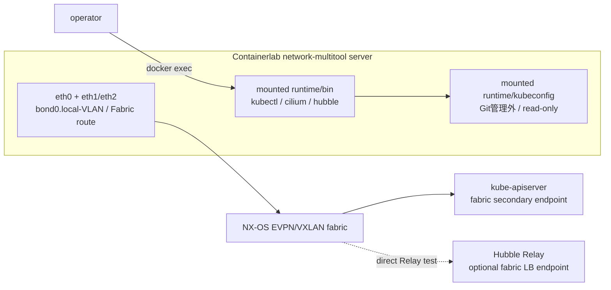

# Fabric側Kubernetes clientとCLI準備

## 1. 目的

NX-OS fabric側からKubernetes API、Cilium、Hubbleを確認するclientを、独自Docker imageを
保守せずに用意する。一般通信試験用の既存`network-multitool`へ、公式release binaryと
kubeconfigをread-only bindし、同じcontainerからネットワーク試験とKubernetes操作を行う。

CLIバイナリやkubeconfigはGitへ含めない。version、公式取得元、checksum検証方法、配置規則だけを
Gitで管理する。

## 2. 構成



`network-multitool`自身がeth1/eth2、bond、VLAN、Fabric IP、routeに加え、CLI実行環境も担当する。
sidecarは追加せず、single-siteでは`adc-t1sv0101`、multi-siteでは`adc-t1sv0101`と
`bdc-t1sv0104`だけをKubernetes操作対象にする。他の一般通信試験serverへ認証情報を展開しない。

役割は次のように固定する。ADC の `adc-t1sv0101` は single-site と multisite の CLI source、BDC の
`bdc-t1sv0104` は remote site 側 CLI source とする。`adc-t1sv0102` は Egress Gateway の送信元変換を
Kubernetes 外から観測する server とし、kubeconfig を mount しない。CLI 操作元と Egress 観測先を分ける
ことで、試験 traffic の source／destination と権限境界を明確にする。

kubectl、Cilium CLI、Hubble CLIはいずれも公式release binaryを使用する。現在準備している
Linux binaryはstatic executableであり、Alpineベースの`network-multitool`から実行できることを
適用前preflightで再確認する。

## 3. Git管理境界

共通の取得・検証ロジックだけを`nxos_fabric/scripts/`へ置き、versionとruntimeは環境ごとに
分離する。

```text
nxos_fabric/
├── scripts/k8s-client/prepare-tools.sh
├── nxos_singlesite/k8s_kind/client/
│   ├── tool-versions.env
│   ├── README.md
│   └── runtime/                    # Git管理外
│       ├── bin/
│       └── kubeconfig/
└── nxos_multisite/k8s_kind/client/
    ├── tool-versions.env
    ├── README.md
    └── runtime/                    # Git管理外
        ├── bin/
        └── kubeconfig/
```

single-siteとmulti-siteで同じversionから開始しても、lockファイルとruntimeを共有しない。一方の
cache更新や削除が他方へ影響しないことを優先する。Cluster Mesh構築前にはk02/k03のCilium関連
versionが一致することを別途preflightで確認する。

## 4. CLI準備

single-siteは次を実行する。

```bash
cd nxos_fabric/nxos_singlesite
../scripts/k8s-client/prepare-tools.sh --profile k8s_kind/client
../scripts/k8s-client/prepare-tools.sh --profile k8s_kind/client --check
```

multi-siteは次を実行する。

```bash
cd nxos_fabric/nxos_multisite
../scripts/k8s-client/prepare-tools.sh --profile k8s_kind/client
../scripts/k8s-client/prepare-tools.sh --profile k8s_kind/client --check
```

スクリプトは`amd64`/`arm64`を判定し、kubectl、Cilium CLI、Hubble CLIを公式release URLから
一時directoryへ取得する。公式SHA256の検証に合格したbinaryだけを`runtime/bin/`へ配置し、
local binary用の`SHA256SUMS.local`を生成する。正しいversionがcache済みなら再downloadしない。

| Option | 動作 |
|---|---|
| なし | 不足またはversion不一致のCLIだけ取得する |
| `--check` | downloadせず、local checksumと報告versionを確認する |
| `--force` | 全CLIを再取得して検証する |

`stable.txt`は調査時に確認するが、実行時に最新版を自動採用しない。採用versionは各環境の
`tool-versions.env`で固定する。

### 4.1 Containerlab実行hostでのPATH設定

Containerlabを実行するhostでも、site別runtimeの同じkubectl、Cilium CLI、Hubble CLIを使用する。
system-wide PATHや`.bashrc`へ恒久追加せず、対象siteへ移動した作業shell内だけでPATHとKUBECONFIGを
設定する。runtime側をPATHの先頭へ置くことで、hostへ別versionのkubectlがinstall済みでも
version lockしたbinaryを優先する。

single-siteは次のように設定する。

```bash
cd nxos_fabric/nxos_singlesite
K8S_CLIENT_RUNTIME="$(pwd -P)/k8s_kind/client/runtime"
export PATH="${K8S_CLIENT_RUNTIME}/bin:${PATH}"
export KUBECONFIG="${K8S_CLIENT_RUNTIME}/kubeconfig/config"
hash -r
```

multi-siteもsite directoryだけを変更し、同じ手順を使用する。

```bash
cd nxos_fabric/nxos_multisite
K8S_CLIENT_RUNTIME="$(pwd -P)/k8s_kind/client/runtime"
export PATH="${K8S_CLIENT_RUNTIME}/bin:${PATH}"
export KUBECONFIG="${K8S_CLIENT_RUNTIME}/kubeconfig/config"
hash -r
```

有効化後はbinaryの解決先とversionを確認する。

```bash
command -v kubectl cilium hubble
kubectl version --client
cilium version --client
hubble version
```

新しいshellでは再度設定する。single-siteとmulti-siteのPATHを同じshellへ同時に追加しない。

## 5. kubeconfig

`runtime/kubeconfig/`はCLI準備時に空directoryとして作成し、directory単位でread-only mountする。
kind作成後にhost側へ`config`を生成すれば、Containerlab serverから参照できる。

- 管理endpoint用kubeconfigは既存経路を維持する。
- Fabric用kubeconfigはAPI server証明書SANへ登録したFabric IP/DNS名を`server`へ指定する。
- Cilium agentのbootstrap先は管理endpointに残し、Fabric API公開へ依存させない。
- multi-siteではk02/k03を別contextとして1つのruntime kubeconfigへ整理する。
- kubeconfig、client certificate、private keyはGitへ含めない。
- host 側 `runtime/kubeconfig/` は mode `0700`、`config` は `0600` とし、container 内では read-only とする。

## 6. Containerlab topology YAMLへの追記案

稼働中topology YAMLはまだ書き換えない。保守時間前に、対象`network-multitool` nodeの既存`env`と
`binds`へ次の項目を追記する。`/usr/local/bin`全体へのmountはimage内の既存commandを隠すため、
専用directoryの`/opt/k8s-client/bin`を使用する。

single-siteの`adc-t1sv0101`への追記内容は次のとおりとする。

```yaml
    adc-t1sv0101:
      kind: linux
      env:
        # 既存のVLAN_ID、IP_CIDR、DEF_GWなどは維持する
        PATH: "/opt/k8s-client/bin:/usr/local/sbin:/usr/local/bin:/usr/sbin:/usr/bin:/sbin:/bin"
        KUBECONFIG: "/opt/k8s-client/kubeconfig/config"
      binds:
        - scripts/linux:/scripts:ro
        - k8s_kind/client/runtime/bin:/opt/k8s-client/bin:ro
        - k8s_kind/client/runtime/kubeconfig:/opt/k8s-client/kubeconfig:ro
      # 既存のexecとgroupは維持する
```

multi-siteでは同じ追記を`adc-t1sv0101`と`bdc-t1sv0104`へ行う。両serverは同じmulti-site
profileをmountするが、送信元Fabric IPとrouteは各server自身の設定を使用する。

Container側はtopologyの`env.PATH`へ固定し、mountしたCLIを常に優先する。既存の標準PATHも後ろへ
明示的に残すため、`network-multitool`の既存commandを引き続き利用できる。

```bash
docker exec -it <network-multitool-container> sh

command -v kubectl cilium hubble
kubectl version --client
cilium version --client
hubble version
```

反映後のcontainer名による実行例は次のとおりとする。

```bash
# single-site / ADC
docker exec -it clab-nxos-fabric-singlesite-adc-t1sv0101 sh

# multi-site / ADC
docker exec -it clab-nxos-fabric-multisite-adc-t1sv0101 sh

# multi-site / BDC
docker exec -it clab-nxos-fabric-multisite-bdc-t1sv0104 sh
```

これらのmountはまだrunning containerに存在しないため、現在のlabでは以下のCLI実行手順を試さない。
topologyへbindを追記して対象containerを再作成した後の受入手順として使用する。

1 commandだけ実行する場合も、topologyで設定されたPATHとKUBECONFIGを使用する。

```bash
docker exec <network-multitool-container> kubectl get nodes -o wide
```

問題切り分け時はCLIの絶対pathを指定する方法も使用できる。

```bash
/opt/k8s-client/bin/kubectl get nodes
/opt/k8s-client/bin/cilium status
/opt/k8s-client/bin/hubble status
```

directory単位のbindであるため、初回mount反映後はhost側の`prepare-tools.sh`で検証済みbinaryを
更新できる。ただし試験開始時には必ず`--check`とcontainer内のversion確認を行う。

### 6.1 受入確認

各 client で CLI の存在だけでなく、Fabric 側 source と API endpoint の到達性を確認する。

```bash
ip -br address
ip route get <control-plane-fabric-ip>
kubectl --request-timeout=10s get --raw='/readyz'
kubectl get nodes -o wide
cilium status --wait
hubble status -P
```

合格条件は、`ip route get` が Fabric interface／gateway を示し、`readyz` が `ok`、Node の InternalIP が
site 固有 Fabric IP、Cilium が Ready、Hubble Relay が利用可能であることである。multi-site では ADC と
BDC の両 client から local／remote Cluster Mesh API VIP への `ip route get` と TCP `2379` の到達性も
確認する。

## 7. CLI利用時の制約

| 制約 | 影響と対策 |
|---|---|
| serverのIP、interface、routeを使用 | ADC/BDCの送信元を分ける場合は各siteの対象serverから実行する |
| kubeconfigをnetwork test containerへmount | 対象serverを限定し、read-onlyかつ必要最小権限のkubeconfigを使う |
| localhostとlisten portを共有 | Hubble Relay/UIのport-forward portをclusterごとに分ける |
| CLIはimageの構成要素ではない | ContainerはYAML、hostは作業shellでPATHを設定し、versionとchecksum準備状態を確認する |
| bind追加はrunning containerへ反映されない | topology変更後、承認された保守時間に対象containerを再作成する |

Hubbleの`-P`はKubernetes API経由のport-forwardを作るため、Fabric API endpointの試験になる。
Hubble Relay自体をFabricへ公開した試験では、`--server <Relay-LB-VIP>:<port>`と必要なTLS設定を
使い、2つの経路を区別する。

## 8. 実行中Containerlabへの変更方針

topology YAMLはDocker/Containerlabのdesired stateであり、ファイルを編集しただけでは実行中
containerへ反映されない。ただし次回のdeploy系commandが変更を適用するため、稼働中は変更内容と
適用時期を明示する。

| 変更 | 実行中labへの即時影響 | 方針 |
|---|---|---|
| Markdown、version file、共通script | なし | 稼働中でも更新可能 |
| Git管理外runtimeへのCLI download | なし | Containerlab起動前preflightとして実行可能 |
| topology YAMLの編集だけ | なし | 差分を確認し、適用commandを実行しない |
| 対象serverへのbind追加 | 実行中containerには反映されない | YAML追記だけ先行せず、保守時間まで待つ |
| `redeploy`またはdestroy/deploy | container停止・再作成を伴う | 対象と保守時間の明示承認後だけ実行 |

現在稼働しているlabのtopology YAMLとcontainerは変更しない。先に以下を完了する。

1. siteごとのCLI cacheを`--check`で合格させる。
2. 対象network-multitool serverと、そのFabric VLAN、IPv4/IPv6、routeを確認する。
3. API server Fabric endpoint、証明書SAN、ACL、往復routeを確定する。
4. topology差分を静的レビューする。
5. 保守時間にbindを含むtopologyを反映し、対象containerを再作成する。
6. `ip route get`、`kubectl get --raw=/readyz`、`cilium status`、`hubble status`で受入確認する。

実行中containerへ`docker cp`などでCLIやkubeconfigを一時投入する方法は、checksum管理、認証情報の
回収、再現性が不明確になるため採用しない。現在のlabではdocsとruntime準備だけを進め、bindの
追加は保守時間まで待つ。
