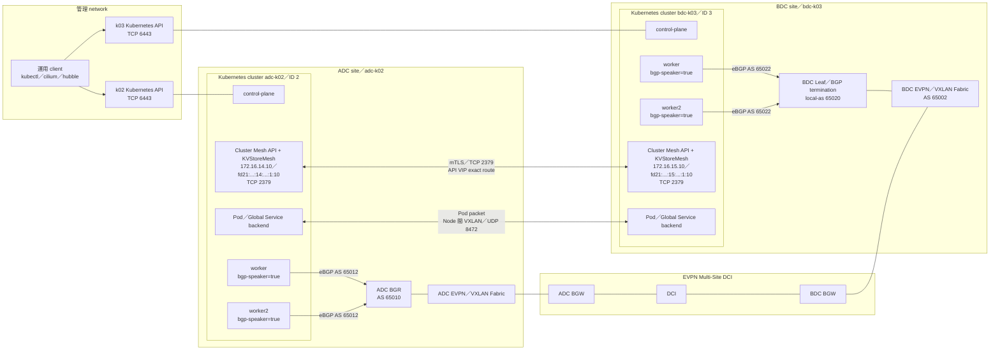
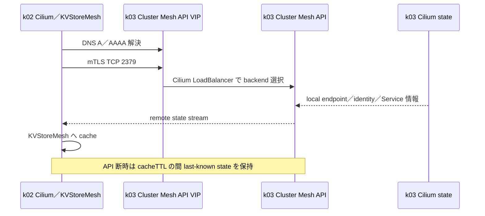
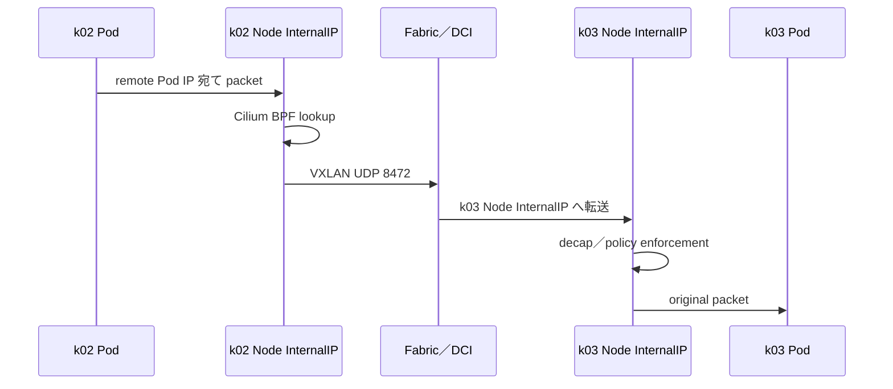
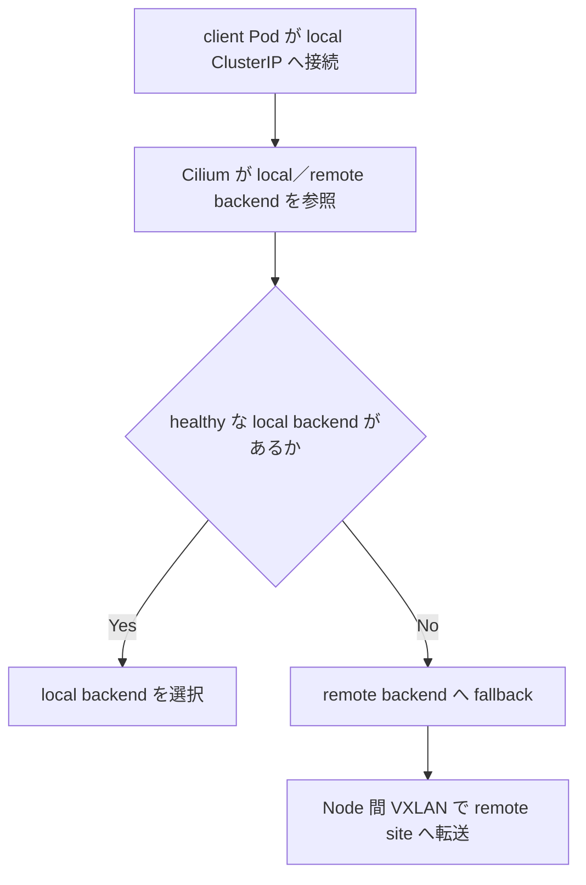
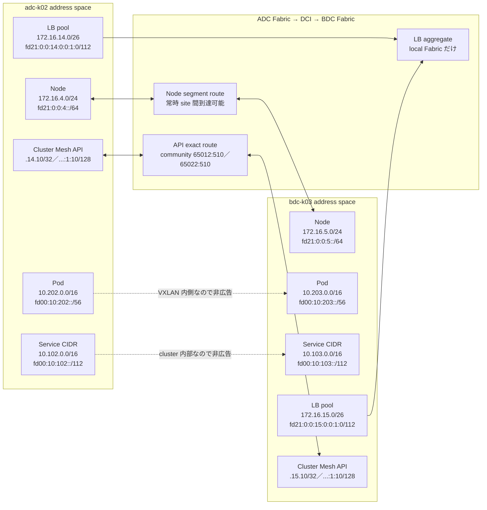

# Cluster Mesh 基本設計、Fabric／DCI 境界、合否基準

## 1. 目的と読み方

本書は、`adc-k02` と `bdc-k03` を Cilium Cluster Mesh で接続するための基本設計である。
Cluster Mesh を初めて扱う場合でも、次の順に読めば通信経路と障害範囲を判断できる構成とする。

1. Cluster Mesh が共有する情報と、共有しない情報を理解する。
2. control plane、dataplane、Service、運用管理の 4 系統を分ける。
3. 各通信が Node、Fabric、DCI のどこを通るかを確認する。
4. 本ラボの初期設定値と、障害時の動作を確認する。
5. 構築後に Test ID と判断コマンドで合否を記録する。

対象は Cilium `1.20.1`、Kubernetes `v1.35.5`、Cilium VXLAN datapath、dual-stack である。
本書の初期設定値を k02／k03 の Helm values と Kubernetes resource の正本とする。変更時は本書と実ファイルを
同じ変更単位で更新し、Helm render、server-side dry-run、diff の順に検証してから running cluster へ適用する。

### 1.1 受入確認前の CLI runtime

構築後の判断コマンドは repository 内の任意の作業 directory から実行できる。新しい shell ごとに multi-site 用の
client runtime を `PATH` の先頭へ追加する。

```bash
export TOPOLOGY_PROFILE=nxos_multisite
export REPO_ROOT="$(git rev-parse --show-toplevel)"
export K8S_CLIENT_RUNTIME="${REPO_ROOT}/nxos_fabric/${TOPOLOGY_PROFILE}/k8s_kind/client/runtime"
export PATH="${K8S_CLIENT_RUNTIME}/bin:${PATH}"
hash -r
command -v helm kubectl cilium hubble

export CLABNAME=nxos-fabric-multisite
export K02_KUBECONFIG="${REPO_ROOT}/nxos_fabric/${TOPOLOGY_PROFILE}/clab-${CLABNAME}/adc-k02/k8s_kind/k02/kubeconfig-k02"
export K03_KUBECONFIG="${REPO_ROOT}/nxos_fabric/${TOPOLOGY_PROFILE}/clab-${CLABNAME}/bdc-k03/k8s_kind/k03/kubeconfig-k03"
export KUBECONFIG="${K02_KUBECONFIG}:${K03_KUBECONFIG}"
test -r "${K02_KUBECONFIG}"
test -r "${K03_KUBECONFIG}"
kubectl config get-contexts
```

いずれかの CLI が表示されない場合は、[クライアントツール準備手順](client-tools.md)を先に実行する。

## 2. Cluster Mesh の基本概念

### 2.1 Cluster Mesh が行うこと

公式ソース: [Cilium Multi-Cluster（Cluster Mesh）](https://docs.cilium.io/en/stable/network/clustermesh/intro/)

Cluster Mesh は、独立した Kubernetes cluster の Cilium 同士を接続し、次を可能にする機能である。

- remote cluster の Pod identity、Pod IP、Node、Service backend 情報を各 cluster へ同期する。
- 重複しない Pod CIDR と相互到達可能な Node InternalIP を使い、cluster 間 Pod 通信を提供する。
- 同名・同 namespace の Service を Global Service として扱い、remote backend を選択できるようにする。
- remote cluster／identity を条件にした Network Policy を適用できるようにする。

### 2.2 Cluster Mesh が行わないこと

公式ソース: [Cilium Cluster Mesh Architecture](https://docs.cilium.io/en/stable/network/clustermesh/intro/#architecture)、
[Cilium Cluster Mesh Network Policy](https://docs.cilium.io/en/stable/network/clustermesh/policy/)

Cluster Mesh は Kubernetes control plane を一つに統合しない。次の要素は cluster ごとに独立したままである。

- Kubernetes API Server、etcd、scheduler、controller-manager
- namespace、Deployment、Secret、ConfigMap などの Kubernetes resource
- Service の作成操作と application の rollout
- Node lifecycle、Cilium installation、LB IPAM pool、BGP session
- `kubectl` context、RBAC、監査 log

したがって、Global Service を利用する場合でも、必要な Service と workload は両 cluster へ個別に作成する。
Cluster Mesh API は Kubernetes API の代替ではなく、Cilium が必要とする remote state の交換口である。

### 2.3 主なコンポーネント

公式ソース: [Cilium Cluster Mesh Architecture](https://docs.cilium.io/en/stable/network/clustermesh/intro/#architecture)

| コンポーネント | 配置 | 役割 |
|---|---|---|
| [Cilium Agent](https://docs.cilium.io/en/stable/overview/component-overview/) | 全 Node | local／remote endpoint、identity、Service backend を保持し、BPF datapath を制御する |
| [Cilium Operator](https://docs.cilium.io/en/stable/overview/component-overview/) | cluster ごと | Cilium resource の controller と Cluster Mesh 関連処理を実行する |
| [Cluster Mesh API Server](https://docs.cilium.io/en/stable/network/clustermesh/intro/#architecture) | cluster ごと | remote cluster に local Cilium state を mTLS で公開する |
| [KVStoreMesh](https://docs.cilium.io/en/stable/network/clustermesh/intro/#architecture) | Cluster Mesh API Server Pod 内 | remote state を local に cache し、Agent から remote API への直接依存を減らす |
| [Cilium BGP Control Plane](https://docs.cilium.io/en/stable/network/bgp-control-plane/bgp-control-plane/) | speaker 対象 Node | Cluster Mesh API の LoadBalancer VIP を local Fabric と DCI へ広告する |
| [CoreDNS／MCS API](https://docs.cilium.io/en/stable/network/clustermesh/mcsapi/) | cluster ごと | 通常の `cluster.local` を解決する。MCS API 有効化後は `clusterset.local` も扱う |

### 2.4 4 つの通信面

公式ソース: [Cilium Cluster Mesh Setup](https://docs.cilium.io/en/stable/network/clustermesh/setup/)、
[Cilium Firewall Rules](https://docs.cilium.io/en/stable/operations/system_requirements/#firewall-rules)

| 通信面 | 主な通信 | 障害時に失うもの |
|---|---|---|
| Kubernetes 管理面 | client → Kubernetes API `6443/TCP` | `kubectl` 操作。既存の Cluster Mesh datapath は直ちには停止しない |
| Cluster Mesh control plane | Cilium／KVStoreMesh → remote API VIP `2379/TCP` | remote state の更新。cache 保持中は last-known state を利用する |
| Cilium dataplane | Node InternalIP 間 `8472/UDP`、health `4240/TCP` | cluster 間の実 packet 通信。control plane が正常でも通信できない |
| Service／BGP 公開面 | client → Service VIP、Cilium → BGP peer | Cluster Mesh API や application VIP への外部到達性 |

重要なのは、`2379/TCP` が正常でも Node 間 VXLAN が切れていれば Pod 通信は失敗することである。
逆に `2379/TCP` だけが切れた場合は、`cacheTTL` の範囲で既知の remote endpoint を使った通信が継続する可能性がある。

## 3. 全体構成図

### 3.1 論理構成



図中の Cluster Mesh API 接続と Pod packet は、どちらも物理的には site Fabric と DCI を通るが、
使用する address と障害判定が異なる。管理 network の `eth0` は Kubernetes API への操作経路であり、
Cluster Mesh datapath には使用しない。

### 3.2 Control plane の state 同期



### 3.3 Pod 間 packet



Fabric／DCI が認識する外側の到達先は Node InternalIP である。初期 VXLAN profile では Pod CIDR を Fabric BGP へ
広告しない。Pod CIDR は cluster 間で重複しない必要があるが、DCI の route table へ載せる必要はない。

### 3.4 Global Service の backend 選択

公式ソース: [Cilium Global Services](https://docs.cilium.io/en/stable/network/clustermesh/global-services/)、
[Cilium Service Affinity](https://docs.cilium.io/en/stable/network/clustermesh/affinity/)



この動作は `service.cilium.io/affinity: local` を設定した場合である。`local` は local backend への固定ではなく、
healthy な local backend が一つもない場合に remote backend を利用する優先指定である。

## 4. Address と route の設計

### 4.1 通信要件

公式ソース: [Cilium Cluster Addressing Requirements](https://docs.cilium.io/en/stable/network/clustermesh/setup/#cluster-addressing-requirements)、
[Cilium Firewall Rules](https://docs.cilium.io/en/stable/operations/system_requirements/#firewall-rules)

| Source | Destination | Protocol／port | DCI 通過 | 用途 |
|---|---|---|---|---|
| k02 全 Node InternalIP | k03 全 Node InternalIP | `8472/UDP` | 必須 | Cilium VXLAN dataplane |
| k02 全 Node InternalIP | k03 全 Node InternalIP | `4240/TCP`、ICMP／ICMPv6 | 必須 | Cilium health |
| k02 Cilium／KVStoreMesh | k03 Cluster Mesh API VIP | `2379/TCP` | 必須 | remote state の mTLS 同期 |
| k03 Cilium／KVStoreMesh | k02 Cluster Mesh API VIP | `2379/TCP` | 必須 | remote state の mTLS 同期 |
| Cilium speaker worker | site 内 BGP peer | `179/TCP`。k02 は BFD、k03 は BGP timer を初期基準 | 不要 | Service VIP route の広告 |
| 運用 client | 各 Kubernetes API | `6443/TCP` | 初期は不要 | `kubectl`／Cilium CLI。管理経路を優先する |
| Hubble CLI | 各 Hubble Relay | `4245/TCP` | 初期は不要 | site 単位の flow 参照 |
| Hubble Relay | 同 cluster の Hubble Agent | `4244/TCP` | 不要 | flow aggregation |

Node 間は一部の代表 Node だけでなく、k02／k03 の全 Node 組み合わせを許可する。Network Policy で許可する
application port と、Fabric／DCI firewall で許可する VXLAN／health／API port は別の制御面である。

### 4.2 Address 一覧

公式ソース: [Cilium Cluster Addressing Requirements](https://docs.cilium.io/en/stable/network/clustermesh/setup/#cluster-addressing-requirements)

| 用途 | `adc-k02` | `bdc-k03` | cluster 間で重複 | Fabric／DCI route |
|---|---|---|---|---|
| Node IPv4 segment | `172.16.4.0/24` | `172.16.5.0/24` | 不可 | 必須。Node 間 VXLAN／health 用 |
| Node IPv6 segment | `fd21:0:0:4::/64` | `fd21:0:0:5::/64` | 不可 | 必須。Node 間 dual-stack 通信用 |
| Pod IPv4 CIDR | `10.202.0.0/16` | `10.203.0.0/16` | 不可 | 初期 VXLAN profile では不要 |
| Pod IPv6 CIDR | `fd00:10:202::/56` | `fd00:10:203::/56` | 不可 | 初期 VXLAN profile では不要 |
| Service IPv4 CIDR | `10.102.0.0/16` | `10.103.0.0/16` | 不可を推奨 | Kubernetes 内部のみ |
| Service IPv6 CIDR | `fd00:10:102::/112` | `fd00:10:103::/112` | 不可を推奨 | Kubernetes 内部のみ |
| LB IPv4 pool | `172.16.14.10-50` | `172.16.15.10-50` | 不可 | local Fabric へ cluster aggregate を広告 |
| LB IPv6 pool | `fd21:0:0:14:0:0:1:0/112` | `fd21:0:0:15:0:0:1:0/112` | 不可 | local Fabric へ cluster aggregate を広告 |
| Cluster Mesh API IPv4 | `172.16.14.10/32` | `172.16.15.10/32` | 不可 | DCI へ exact route を広告 |
| Cluster Mesh API IPv6 | `fd21:0:0:14:0:0:1:10/128` | `fd21:0:0:15:0:0:1:10/128` | 不可 | DCI へ exact route を広告 |
| Kubernetes API | cluster ごとの control-plane endpoint | cluster ごとの control-plane endpoint | 不可 | Cluster Mesh 自体には不要 |

### 4.3 Address と DCI の関係



### 4.4 Route の責任分界

公式ソース: [Cilium BGP Control Plane Resources](https://docs.cilium.io/en/stable/network/bgp-control-plane/bgp-control-plane-configuration/)

| 境界 | 責任 | 本ラボの設計 |
|---|---|---|
| Cilium → BGP termination | Service 選択、prefix、community | worker 2 Node が local aggregate と Cluster Mesh API exact route を広告する |
| BGP termination → site Fabric | Cilium route の受信、ECMP、上限値 | k02 は ADC BGR、k03 は BDC Leaf 重畳で終端する |
| site Fabric → DCI | site 間 export／import | Node segment と Cluster Mesh API exact route だけを許可する |
| DCI → remote Fabric | remote prefix の保持 | site community を維持し、application LB aggregate は拒否する |
| remote Fabric → Node | VIP／Node segment の転送 | remote Cluster Mesh API と remote Node InternalIP へ到達可能にする |

本ラボの初期採用は `hybrid-clustermesh-only` とする。local Fabric では cluster 単位の LB aggregate を利用し、
DCI では Cluster Mesh API の `/32`／`/128` exact route と Node segment だけを通す。これにより、一般 application
VIP を site-local に保ちながら、Cluster Mesh に必要な route を明示できる。

### 4.5 BGP community と route filter

| Cluster | Cilium AS | BGP termination | Cluster Mesh API community |
|---|---:|---|---|
| `adc-k02` | `65012` | ADC BGR AS `65010` | `65012:510` |
| `bdc-k03` | `65022` | BDC Leaf `local-as 65020`／Fabric AS `65002` | `65022:510` |

DCI export policy は prefix と community の両方を照合する。EVPN Multi-Site で付加される Site-of-Origin
community `65535:0` などが共存できるよう、community list の完全一致を要求しない。Cilium が付けた site community
を保持したまま、BGW が Cluster Mesh API exact route と Node segment のみを export する。

## 5. 本ラボの初期設定値と動作

公式ソース: [Cilium Helm Reference](https://docs.cilium.io/en/stable/helm-values/)、
[Cilium Cluster Mesh Setup](https://docs.cilium.io/en/stable/network/clustermesh/setup/)

「本ラボでの初期設定」は、k02／k03 の Cluster Mesh 構築開始時から使用する設計値である。API の可用性も
初期状態から確認できるよう、Cluster Mesh API は `2` replica で開始する。resource 測定は縮小構成ではなく、
この設計状態に対して実施する。

| Parameter | Cilium `1.20.1` 既定値 | 本ラボでの初期設定 | 動作／選定理由 | 後からの変更 |
|---|---|---|---|---|
| `cluster.name` | `default` | k02 `adc-k02`、k03 `bdc-k03` | remote identity と cluster を識別する | workload 再起動を伴うため原則再作成 |
| `cluster.id` | `0` | k02 `2`、k03 `3` | identity の cluster 部分を一意にする | 稼働中は変更しない |
| `clustermesh.maxConnectedClusters` | `255` | `255` を明示 | cluster-local identity 上限 `65535` を維持する | 初回導入後は変更不可 |
| `clustermesh.useAPIServer` | `false` | `true` | embedded etcd／KVStoreMesh API を利用する | Helm upgrade 可能 |
| `clustermesh.config.enabled` | `false` | `true` | remote cluster map を Helm で管理する | Helm upgrade 可能 |
| `clustermesh.config.domain` | `mesh.cilium.io` | `mesh.cilium.io` を明示 | FQDN と certificate SAN の共通 suffix | DNS／SAN／remote config を同時変更 |
| `clustermesh.defaultGlobalNamespace` | `true` | `false` | 明示 annotation を付けた namespace だけを global scope にする | Helm upgrade 後に namespace を再確認 |
| `clustermesh.policyDefaultLocalCluster` | `true` | `true` を明示 | policy の cluster 指定漏れで remote endpoint へ意図せず広げない | Helm upgrade 可能 |
| `clustermesh.cacheTTL` | `0s` | `10m` | control plane 断時に last-known state を 10 分保持後に破棄する | Helm upgrade と partition 再試験 |
| `clustermesh.apiserver.replicas` | `1` | `2` | 単一 API Pod 障害と worker maintenance に備える | Helm upgrade 可能。Kind 再作成不要 |
| API Pod anti-affinity | hostname の preferred | hostname の required | 2 replica を別 worker に強制配置する | Helm upgrade 可能 |
| API Pod `nodeSelector` | `kubernetes.io/os: linux` | 既定値 + `bgp-speaker: "true"` | API backend を worker 2 Node に限定する | label と Helm upgrade で変更 |
| API Pod PDB | disabled、`maxUnavailable: 1` | enabled、`minAvailable: 1` | planned drain で 2 replica 同時停止を防ぐ | Helm upgrade 可能 |
| API Service type | `NodePort` | 外部管理 `LoadBalancer` | 安定した dual-stack VIP を site 間へ公開する | Service と route を同時変更 |
| `service.externallyCreated` | `false` | `true` | chart template 外の dual-stack field と固定 VIP を管理する | Helm と Service の整合が必要 |
| API VIP | 自動 | k02 `.14.10`、k03 `.15.10` | infra LB pool の固定先頭 address | DNS／SAN／route filter を同時変更 |
| `externalTrafficPolicy` | `Cluster` | `Cluster` を明示 | Service endpoint のない speaker でも VIP を到達可能にする | `Local` 化は BGP 集約と保守を再設計 |
| API Service session affinity | Helm は `HAOnly` | 外部 Service で `ClientIP` | replica 切替時の full resync 頻度を抑える | 外部管理 Service を更新 |
| KVStoreMesh | `true` | `true` | remote state を site 内で cache する | 無効化時は接続方式を再設計 |
| API auth mode | `migration` | `cluster` | 新規 lab で共有 CA を最初から使用し、移行互換 mode を不要にする | 共有 CA と全 cluster の同時確認が必要 |
| TLS auto method | `helm` | `cronJob` | 4 か月ごとの自動再生成を行う | Helm upgrade 可能 |
| Certificate validity／schedule | `365` 日／schedule 既定あり | `365` 日／`0 0 1 */4 *` | 失効前に定期再生成する | CronJob と監視を同時変更 |
| API／KVStoreMesh／etcd metrics | すべて `true` | すべて `true` | 接続、同期、cache revoke を障害試験で計測する | Helm upgrade 可能 |
| API／KVStoreMesh resource | request／limit なし | 指定せず実測 | 初回から根拠のない limit で再起動させない | 実測後に Helm upgrade 可能 |
| EndpointSlice synchronization | `false` | `false` | 基本 Cluster Mesh と原因を分離する | 基本合格後に有効化可能 |
| MCS API | `false` | `false` | Cilium Global Service を先に検証する | Global Service 合格後に有効化可能 |

### 5.1 Namespace と policy の scope

公式ソース: [Cilium Helm Reference: `clustermesh.defaultGlobalNamespace`](https://docs.cilium.io/en/stable/helm-values/)、
[Cilium Cluster Mesh Network Policy](https://docs.cilium.io/en/stable/network/clustermesh/policy/)、
[Cilium Global Services](https://docs.cilium.io/en/stable/network/clustermesh/global-services/)

`clustermesh.defaultGlobalNamespace: false` を採用し、試験用 namespace だけに次の annotation を付与する。

```yaml
apiVersion: v1
kind: Namespace
metadata:
  name: cilium-test
  annotations:
    clustermesh.cilium.io/global: "true"
```

これにより、同名 namespace が偶然両 cluster に存在しても自動的に global scope として扱わない。
`clustermesh.policyDefaultLocalCluster: true` も明示し、remote cluster を許可する policy は cluster／namespace／identity
selector を意図的に追加する。

Global Service を使用する application は、両 cluster の `cilium-test` namespace に同名 Service を作り、次の
annotation を明示する。`shared: "true"` は local backend を remote cluster にも公開し、`affinity: "local"` は
healthy な local backend を優先する。

```yaml
apiVersion: v1
kind: Service
metadata:
  name: clustermesh-demo
  namespace: cilium-test
  annotations:
    service.cilium.io/global: "true"
    service.cilium.io/shared: "true"
    service.cilium.io/affinity: "local"
spec:
  selector:
    app: clustermesh-demo
  ports:
    - name: http
      port: 80
      targetPort: 8080
```

同じ ClusterIP を cluster 間で共有する設計ではない。client は自 cluster の ClusterIP へ接続し、Cilium がその
frontend に local／remote backend を関連付ける。Service が片方だけ `global`、namespace が片方だけ local、
Service port／protocol が不一致という状態は構成誤りとして受入前に検出する。

### 5.2 API replica と可用性

公式ソース: [Cilium Helm Reference: Cluster Mesh API Server](https://docs.cilium.io/en/stable/helm-values/)

初期設定から `replicas: 2`、worker 強制分散、PDB `minAvailable: 1`、Service `ClientIP` affinity を使用する。
resource 測定もこの状態で行い、実運用する設計値の memory／CPU 使用量を評価する。resource gate を満たさない場合は
暗黙に `1` replica へ縮小せず、Cluster Mesh API HA を満たさない例外として設計台帳へ記録してから変更する。

各 API replica は共通の replicated etcd cluster ではなく、個別の local state を持つ。client が別 replica へ
切り替わると remote state の full resync が発生し得る。このため、2 replica は接続先の消失を避ける可用性策であり、
session affinity は不要な backend 切替と full resync を減らすために使用する。

### 5.3 `externalTrafficPolicy: Cluster` の理由

`Cluster` の場合、VIP route を広告する worker と API Pod の配置を分離できる。API Pod を drain しても、残る speaker
から別 worker 上の endpoint へ転送できる。`Local` は source IP 保持には有効だが、endpoint がない Node の route
withdraw、Cilium aggregate、planned-shut の順序を一体で再設計する必要があるため、初期採用しない。

### 5.4 `cacheTTL: 10m` の意味

公式ソース: [Cilium Global Services: Handling Unreachable Clusters](https://docs.cilium.io/en/stable/network/clustermesh/global-services/#handling-unreachable-clusters)

`cacheTTL` の timer は remote Cluster Mesh API との control plane 接続を失ったときに作用する。last-known remote
state は 10 分間保持され、その後 stale entry が破棄される。DCI の dataplane だけが切れ、API 接続が別経路で
維持されている場合は、この timer だけでは障害を検出できない。したがって control plane 断と Node dataplane 断を
別 Test ID で確認する。

## 6. 初期 Helm values／Service 設計例

公式ソース: [Cilium Cluster Mesh Setup with Helm](https://docs.cilium.io/en/stable/network/clustermesh/setup/#configure-cluster-mesh-with-helm)、
[Cilium Helm Reference](https://docs.cilium.io/en/stable/helm-values/)

次は本ラボで初回から使用する設計値の抜粋である。cluster 固有の `name`、`id`、FQDN、VIP は site overlay で分ける。

```yaml
cluster:
  name: adc-k02
  id: 2

clustermesh:
  maxConnectedClusters: 255
  useAPIServer: true
  defaultGlobalNamespace: false
  policyDefaultLocalCluster: true
  cacheTTL: 10m
  config:
    enabled: true
    domain: mesh.cilium.io
  apiserver:
    replicas: 2
    nodeSelector:
      kubernetes.io/os: linux
      bgp-speaker: "true"
    affinity:
      podAntiAffinity:
        requiredDuringSchedulingIgnoredDuringExecution:
          - labelSelector:
              matchLabels:
                k8s-app: clustermesh-apiserver
            topologyKey: kubernetes.io/hostname
    podDisruptionBudget:
      enabled: true
      minAvailable: 1
      maxUnavailable: null
    service:
      type: LoadBalancer
      externallyCreated: true
      externalTrafficPolicy: Cluster
      enableSessionAffinity: Always
    metrics:
      enabled: true
      kvstoremesh:
        enabled: true
      etcd:
        enabled: true
    tls:
      authMode: cluster
      auto:
        enabled: true
        method: cronJob
        certValidityDuration: 365
        schedule: "0 0 1 */4 *"
        server:
          extraDnsNames:
            - adc-k02.mesh.cilium.io
```

`enableSessionAffinity` は chart 管理 Service へ反映する値である。本ラボは Service を外部管理するため、実際の
source of truth は次の Service resource の `sessionAffinity` とする。

```yaml
apiVersion: v1
kind: Service
metadata:
  name: clustermesh-apiserver
  namespace: kube-system
  labels:
    k8s-app: clustermesh-apiserver
    app.kubernetes.io/part-of: cilium
    app.kubernetes.io/name: clustermesh-apiserver
    lb-pool: infra
    bgp-advertise: "true"
    dci-export: clustermesh
  annotations:
    lbipam.cilium.io/ips: "172.16.14.10,fd21:0:0:14:0:0:1:10"
spec:
  type: LoadBalancer
  loadBalancerClass: io.cilium/bgp-control-plane
  externalTrafficPolicy: Cluster
  internalTrafficPolicy: Cluster
  ipFamilyPolicy: RequireDualStack
  ipFamilies:
    - IPv4
    - IPv6
  sessionAffinity: ClientIP
  sessionAffinityConfig:
    clientIP:
      timeoutSeconds: 10800
  ports:
    - name: etcd-client
      port: 2379
      protocol: TCP
      targetPort: 2379
  selector:
    k8s-app: clustermesh-apiserver
```

k03 は cluster 名／ID、FQDN、VIP を `bdc-k03`、`3`、`bdc-k03.mesh.cilium.io`、`.15.10`／IPv6
`.15:...:1:10` へ置換する。実際の Service field 名は適用前に Cilium `1.20.1` CRD／chart template と
`kubectl apply --dry-run=server` で再確認する。

## 7. DNS、TLS、認証

公式ソース: [Cilium Cluster Mesh TLS certificates](https://docs.cilium.io/en/stable/network/clustermesh/setup/#configure-tls-certificates)

| Cluster | FQDN | IPv4 VIP | IPv6 VIP | DCI community |
|---|---|---|---|---|
| `adc-k02` | `adc-k02.mesh.cilium.io` | `172.16.14.10/32` | `fd21:0:0:14:0:0:1:10/128` | `65012:510` |
| `bdc-k03` | `bdc-k03.mesh.cilium.io` | `172.16.15.10/32` | `fd21:0:0:15:0:0:1:10/128` | `65022:510` |

両 site から A／AAAA の両方が解決できるようにする。Cluster Mesh は mTLS を使用するため、全 cluster が共通 root
CA を信頼する。Git には CA private key、certificate Secret、remote config、kubeconfig を保存しない。

初期構築順は次のとおりとする。

1. k02 へ Cilium を導入し、`cilium-ca` を生成する。
2. k03 で Cluster Mesh certificate を生成する前に、k02 の `cilium-ca` を pipe でコピーする。
3. k03 へ Cilium／Cluster Mesh API を導入する。
4. 両 cluster の CA fingerprint、server certificate SAN、有効期限を確認する。
5. `authMode: cluster` で相互接続し、remote cluster name が certificate と一致することを確認する。

```bash
kubectl --context kind-adc-k02 get secret -n kube-system cilium-ca -o yaml | \
  kubectl --context kind-bdc-k03 create -f -
```

既存 `cilium-ca` が k03 にある場合は上書きしない。fingerprint が異なる場合は、Cluster Mesh を接続する前に
certificate 設計と再生成手順へ戻る。

## 8. 障害、冗長化、保守

公式ソース: [Cilium Cluster Mesh Troubleshooting](https://docs.cilium.io/en/stable/operations/troubleshooting/#cluster-mesh-troubleshooting)、
[Cilium Global Services: Handling Unreachable Clusters](https://docs.cilium.io/en/stable/network/clustermesh/global-services/#handling-unreachable-clusters)

### 8.1 障害ごとの影響

| 障害 | Control plane state | Pod dataplane | Global Service | 主な判断点 |
|---|---|---|---|---|
| Cluster Mesh API Pod 1 台停止 | 2 replica なら別 backend へ再接続 | 既知経路は継続 | full resync 中の変化を観測 | Service endpoint、reconnect、resync 時間 |
| API VIP BGP path 1 本 withdraw | 残る ECMP path で継続 | 影響なしを期待 | 影響なしを期待 | BGP convergence、TCP reconnect の有無 |
| remote API `2379/TCP` だけ遮断 | `cacheTTL` まで last-known state | 既知 endpoint は継続可能 | stale backend の扱いを確認 | readiness、cache revocation、10 分境界 |
| Node 間 `8472/UDP` だけ遮断 | API は connected のまま | cluster 間通信失敗 | remote backend 通信失敗 | control／dataplane の状態差 |
| DCI 全断 | API と dataplane を喪失 | cluster 間通信失敗 | local backend だけ利用 | route、API status、Hubble drop |
| worker 1 台 drain | PDB で API 1 台を維持 | 残る worker へ収束 | local／remote backend 再選択 | planned-shut、Pod 再配置、API readiness |
| BGP termination 1 台停止 | 冗長 peer があれば API route 継続 | Node segment route 次第 | remote access 継続 | BFD／BGP timer、ECMP next-hop |
| site 全停止 | remote state は stale 化 | remote site へ通信不可 | local affinity なら local backend を継続 | cacheTTL、backend removal、復旧後 resync |

### 8.2 Planned maintenance の順序

1. Cluster Mesh API が `2/2 Ready`、PDB が `minAvailable: 1` であることを確認する。
2. 両方向の remote cluster readiness と Global Service probe を記録する。
3. 対象 worker に `bgp-maintenance=planned-shut` を設定し、community による soft drain を行う。
4. API VIP と application VIP が別 worker へ迂回したことを確認する。
5. 対象 worker を drain し、API Pod と application Pod の再配置を待つ。
6. remote cluster readiness、API TCP session、Global Service probe を再確認する。
7. BGP session を停止して作業し、復旧後に session、route、Pod を戻す。
8. `bgp-maintenance` label を解除し、両 path が復帰したことを確認する。

詳細は [BGP maintenance と route drain](bgp-maintenance-and-route-drain.md)を参照する。

### 8.3 初期の合否目標

| 指標 | 初期合否値 | 補足 |
|---|---:|---|
| Cluster Mesh API route の計画保守中 withdraw | `0` 回 | worker 1 台の保守中も少なくとも 1 path を維持する |
| k02 BGP path 切替 | `3` 秒以内 | BFD 有効な single-site 終端で測定する |
| k03 BGP path 切替 | `5` 秒以内 | NX-OS 9000v／Leaf 重畳の実測で判定する |
| remote API reconnect | `30` 秒以内 | backend／route 切替後の readiness 回復 |
| full resync | `60` 秒以内 | endpoint 数の少ない初期 lab での目標 |
| API partition 後の cache revoke | `10m` 設定値と一致 | `cacheTTL` の許容差を実測記録する |
| 10 分未満の planned maintenance 中 cache revoke | `0` 回 | maintenance が TTL を超えないこと |
| Global Service local backend 無停止時の remote 選択 | `0` 回 | `affinity: local` の確認 |
| local backend 全停止後の remote fallback | 成功 | fallback 時間と既存 connection の切断を記録する |

これらは本番 SLO ではなく、仮想 lab の初期 acceptance threshold である。初回結果を記録後、環境性能に合わせて
閾値を更新する。

## 9. 構築後の判断コマンド

公式ソース: [Cilium Cluster Mesh validation](https://docs.cilium.io/en/stable/network/clustermesh/setup/#validate-cluster-mesh)、
[Cilium Cluster Mesh Troubleshooting](https://docs.cilium.io/en/stable/operations/troubleshooting/#cluster-mesh-troubleshooting)

### 9.1 Address、DNS、certificate

```bash
getent ahosts adc-k02.mesh.cilium.io
getent ahosts bdc-k03.mesh.cilium.io

kubectl --context kind-adc-k02 -n kube-system get service clustermesh-apiserver -o wide
kubectl --context kind-bdc-k03 -n kube-system get service clustermesh-apiserver -o wide

kubectl --context kind-adc-k02 -n kube-system get service clustermesh-apiserver \
  -o jsonpath='{.spec.ipFamilyPolicy}{" "}{.spec.ipFamilies}{" "}{.metadata.annotations.lbipam\.cilium\.io/ips}{" "}{.spec.sessionAffinity}{"\n"}'
kubectl --context kind-bdc-k03 -n kube-system get service clustermesh-apiserver \
  -o jsonpath='{.spec.ipFamilyPolicy}{" "}{.spec.ipFamilies}{" "}{.metadata.annotations.lbipam\.cilium\.io/ips}{" "}{.spec.sessionAffinity}{"\n"}'

kubectl --context kind-adc-k02 -n kube-system get secret cilium-ca \
  -o jsonpath='{.data.ca\.crt}' | base64 -d | openssl x509 -noout -fingerprint -sha256
kubectl --context kind-bdc-k03 -n kube-system get secret cilium-ca \
  -o jsonpath='{.data.ca\.crt}' | base64 -d | openssl x509 -noout -fingerprint -sha256
```

### 9.2 API replica、配置、PDB

```bash
kubectl --context kind-adc-k02 -n kube-system get pod \
  -l k8s-app=clustermesh-apiserver -o wide
kubectl --context kind-bdc-k03 -n kube-system get pod \
  -l k8s-app=clustermesh-apiserver -o wide

kubectl --context kind-adc-k02 -n kube-system get pdb clustermesh-apiserver
kubectl --context kind-bdc-k03 -n kube-system get pdb clustermesh-apiserver

kubectl --context kind-adc-k02 get nodes \
  -L node-role.kubernetes.io/control-plane,bgp-speaker,bgp-maintenance
kubectl --context kind-bdc-k03 get nodes \
  -L node-role.kubernetes.io/control-plane,bgp-speaker,bgp-maintenance
```

### 9.3 Cluster Mesh state

```bash
cilium status --context kind-adc-k02 --wait
cilium status --context kind-bdc-k03 --wait
cilium clustermesh status --context kind-adc-k02 --wait
cilium clustermesh status --context kind-bdc-k03 --wait

for pod in $(kubectl --context kind-adc-k02 -n kube-system get pod \
  -l k8s-app=cilium -o name); do
  kubectl --context kind-adc-k02 -n kube-system exec "${pod}" -- \
    cilium-dbg status --all-clusters
done

kubectl --context kind-adc-k02 -n kube-system exec deploy/clustermesh-apiserver \
  -c kvstoremesh -- kvstoremesh-dbg status --verbose
kubectl --context kind-bdc-k03 -n kube-system exec deploy/clustermesh-apiserver \
  -c kvstoremesh -- kvstoremesh-dbg status --verbose
```

問題がある場合は `cilium-dbg troubleshoot clustermesh` と Agent／KVStoreMesh log を同じ時刻帯で確認する。

### 9.4 Multi-cluster connectivity と Service

```bash
cilium connectivity test \
  --context kind-adc-k02 \
  --multi-cluster kind-bdc-k03

kubectl --context kind-adc-k02 -n cilium-test get service,endpointslice -o wide
kubectl --context kind-bdc-k03 -n cilium-test get service,endpointslice -o wide

kubectl --context kind-adc-k02 -n kube-system exec ds/cilium -- \
  cilium-dbg service list --clustermesh-affinity
kubectl --context kind-bdc-k03 -n kube-system exec ds/cilium -- \
  cilium-dbg service list --clustermesh-affinity
```

### 9.5 Metric

公式ソース: [Cilium Cluster Mesh API Server Metrics](https://docs.cilium.io/en/stable/observability/metrics/#cluster-mesh-api-server-metrics)、
[Cilium Cluster Mesh Metrics Reference](https://docs.cilium.io/en/stable/observability/metrics/#clustermesh)

| Metric | 用途 |
|---|---|
| `cilium_clustermesh_remote_clusters` | 接続対象 cluster 数 |
| `cilium_clustermesh_remote_cluster_readiness_status` | remote cluster readiness |
| `cilium_clustermesh_remote_cluster_failures` | 接続失敗回数 |
| `cilium_clustermesh_remote_cluster_last_failure_ts` | 最終失敗時刻 |
| `cilium_clustermesh_remote_cluster_cache_revocations` | TTL 到達による cache 破棄回数 |
| `cilium_kvstoremesh_remote_cluster_readiness_status` | KVStoreMesh 側の remote readiness |
| `cilium_kvstoremesh_remote_cluster_failures` | KVStoreMesh 接続失敗回数 |

### 9.6 Fabric／DCI route

```text
show bgp vrf tenant1-vpc1 ipv4 unicast 172.16.14.10/32
show bgp vrf tenant1-vpc1 ipv4 unicast 172.16.15.10/32
show bgp vrf tenant1-vpc1 ipv6 unicast fd21:0:0:14:0:0:1:10/128
show bgp vrf tenant1-vpc1 ipv6 unicast fd21:0:0:15:0:0:1:10/128
show bgp l2vpn evpn route-type 5
```

合格条件は、local site で API VIP が worker 2 Node の ECMP path を持ち、remote site で DCI 経由の exact route を
持つことである。k02 route は `65012:510`、k03 route は `65022:510` を保持する。application pool と BGP endpoint
loopback は DCI へ export せず、Node segment の双方向到達性は維持する。

## 10. Test ID

| Test ID | 確認内容 | 合格条件 |
|---|---|---|
| `CM-00` | cluster name／ID／CIDR preflight | name、ID、Pod CIDR、Node CIDR が一意である |
| `CM-01` | Node InternalIP dual-stack 到達性 | 全 Node 組み合わせで IPv4／IPv6 が到達可能である |
| `CM-02` | DNS／API VIP | 両 site で A／AAAA が固定 VIP と一致する |
| `CM-03` | TLS／auth | CA fingerprint が一致し、FQDN が SAN に含まれる |
| `CM-04` | remote state | 全 Cilium Agent と KVStoreMesh で remote cluster が Ready である |
| `CM-05` | Pod-to-Pod | IPv4／IPv6、TCP／UDP／ICMP が双方向で成功する |
| `CM-06` | Global Service | local backend を優先し、local 全停止時に remote へ fallback する |
| `CM-07` | Network Policy | local／remote cluster selector の allow／deny が期待どおりである |
| `CM-08` | API Pod 障害 | 1 replica 停止時に API route を維持し、30 秒以内に Ready へ戻る |
| `CM-09` | API control plane partition | 10 分まで last-known state、TTL 後の cache revoke を確認する |
| `CM-10` | Node dataplane partition | API Ready のまま VXLAN 通信だけが失敗することを識別できる |
| `CM-11` | DCI 全断／復旧 | site-local 通信を維持し、復旧後 60 秒以内に resync する |
| `CM-12` | worker planned maintenance | soft drain／drain 中に API route が全 withdraw しない |
| `CM-13` | site failure | local affinity Service が local backend を継続し、stale remote state を破棄する |
| `CM-14` | Hubble 観測 | cluster 名、source／destination identity、drop point を区別できる |

## 11. 構築順

1. CIDR、cluster name／ID、Node InternalIP、DCI route、firewall を preflight する。
2. k02／k03 の Cilium 基盤と site-local BGP を個別に合格させる。
3. k02 の CA を k03 へ共有し、両 site の 2 replica Cluster Mesh API Service と certificate を作成する。
4. API VIP exact route と Node segment を DCI へ許可する。
5. remote cluster map を適用し、`CM-00` から `CM-05` までを確認する。
6. Global Service と policy を適用し、`CM-06`／`CM-07` を確認する。
7. `CM-08` から `CM-14` までの障害／保守受入を実施する。
8. 基本 Cluster Mesh 合格後に MCS API、Egress Gateway 同時有効化を別試験として扱う。

## 12. 参照 URL

- [Cilium Cluster Mesh Setup](https://docs.cilium.io/en/stable/network/clustermesh/setup/)
- [Cilium Cluster Mesh Architecture](https://docs.cilium.io/en/stable/network/clustermesh/intro/#architecture)
- [Cilium Cluster Mesh Network Policy](https://docs.cilium.io/en/stable/network/clustermesh/policy/)
- [Cilium Cluster Mesh Global Services](https://docs.cilium.io/en/stable/network/clustermesh/global-services/)
- [Cilium Cluster Mesh Load-balancing and Service Discovery](https://docs.cilium.io/en/stable/network/clustermesh/services/)
- [Cilium Cluster Mesh Service Affinity](https://docs.cilium.io/en/stable/network/clustermesh/affinity/)
- [Cilium Cluster Mesh Troubleshooting](https://docs.cilium.io/en/stable/operations/troubleshooting/#cluster-mesh-troubleshooting)
- [Cilium Helm Reference](https://docs.cilium.io/en/stable/helm-values/)
- [Cilium Metrics](https://docs.cilium.io/en/stable/observability/metrics/)
- [Cilium BGP Control Plane Resources](https://docs.cilium.io/en/stable/network/bgp-control-plane/bgp-control-plane-configuration/)
- [Cilium Firewall Rules](https://docs.cilium.io/en/stable/operations/system_requirements/#firewall-rules)
