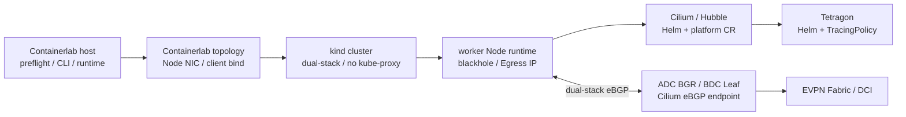

# 現環境から Cilium ラボ初期構築までの変更計画

## 1. 目的と適用境界

この文書は、現在の Containerlab／NX-OS／kind 環境から、Cilium、Hubble、Tetragon の
初期構築に必要な差分を一か所で管理する変更計画である。設計値の詳細は各設計書を正とし、
この文書では「何を、いつ、どこへ反映するか」を扱う。

ファイルの編集、静的 render、check command の実行は稼働中ラボを変更しない。一方、次の操作は
稼働状態を変更するため、対象と保守時間を確認して別作業として実行する。

- Containerlab topology の再 deploy、kind cluster の再作成
- kind Node への address／route／label の追加
- Helm release と Kubernetes resource の apply
- NX-OS candidate config の投入、BGP neighbor の有効化、`write memory`
- DNS record の追加

本ラボは検証環境であり、この文書は本番環境向けの設定手順ではない。



## 2. 変更状態の凡例

| 状態 | 意味 |
|---|---|
| `File-ready` | Git 管理対象ファイルへ反映済み。稼働環境へは未適用 |
| `Runtime-ready` | 明示的な `--apply`／`--action apply` を持つ補助スクリプトを作成済み |
| `Candidate-required` | 現行 running-config と parser を確認して device 別 candidate を作る必要がある |
| `Maintenance-required` | 再作成、通信断、route 変更を伴うため保守時間が必要 |
| `Measurement-required` | single-site の実測後に閾値を確定する |

## 3. 初期構築前の必須変更一覧

| ID | 対象 | 変更内容 | 状態 | 反映契機 |
|---|---|---|---|---|
| CHG-01 | 実行 host | kernel、BTF、cgroup v2、mount、module、sysctl、memory、port を preflight する | `Runtime-ready` | kind 再作成前 |
| CHG-02 | 実行 host | Cilium／Hubble／kubectl／Helm CLI と chart を checksum／version 固定で準備する | `Runtime-ready` | offline render 前 |
| CHG-03 | Containerlab | kind Node image を全 cluster 共通の Kubernetes `v1.35.5` digest へ固定する | `File-ready` | Containerlab 再 deploy 時 |
| CHG-04 | kind | k02／k03 を dual-stack、既定 CNI 無効、kube-proxy 無効、3 Node で作成する | `File-ready` | kind 再作成時 |
| CHG-05 | kind | Pod／Service CIDR、API Fabric SAN、`/procHost`、Node script mount を設定する | `File-ready` | kind 再作成時 |
| CHG-06 | kind Node | bond／VLAN 作成後に kubelet dual-stack `--node-ip` を Fabric address へ設定する | `Runtime-ready` | Containerlab の Node attach 時 |
| CHG-07 | worker Node | Cilium aggregate `/26`／`/112` の blackhole route を 2 worker へ設定する | `Runtime-ready` | BGP resource apply 前 |
| CHG-08 | k02 worker | Egress profile 使用前に `.31`／`::3:1` と `.32`／`::3:2` を secondary address として設定する | `Runtime-ready` | Stage 2B 前 |
| CHG-09 | Kubernetes | worker 2 Node だけへ `bgp-speaker=true` label を設定する | `Runtime-ready` | Cilium BGP resource apply 前 |
| CHG-10 | Kubernetes | Cilium、Hubble、LB IPAM、BGP、Tetragon を依存順に導入する | `File-ready` | Stage 1／2／4 |
| CHG-11 | Cluster Mesh | 共通 Cilium CA、site 別 API VIP／DNS、API 2 replica、PDB を構成する | `Runtime-ready` | Stage 5 |
| CHG-12 | ADC NX-OS | ADC BGR ASN、k01 peer ASN、VLAN 104、k02 Cilium peer／policy を追加する | `File-ready` | Stage 2A 前の保守時間 |
| CHG-13 | BDC NX-OS | Leaf 固有 loopback、`local-as 65020`、k03 multihop peer／policy を追加する | `Candidate-required` | Stage 5 前の保守時間 |
| CHG-14 | DCI NX-OS | Cluster Mesh API exact route と Node segment だけを DCI export／import する | `Candidate-required` | Stage 5 前の保守時間 |
| CHG-15 | DNS | `adc-k02.mesh.cilium.io` と `bdc-k03.mesh.cilium.io` の A／AAAA record を追加する | `Candidate-required` | Cluster Mesh 接続前 |
| CHG-16 | resource sizing | single-site k02 で増分を測り、memory gate と SNAT capacity を判定する | `Measurement-required` | multisite 展開前 |

## 4. Containerlab topology の変更

### 4.1 反映済み

- `k8s-kind` の共通 image は `kindest/node:v1.35.5` の digest 固定とする。
- k02／k03 Node の Fabric MTU は `9100`、Node-facing NX-OS interface は `9216` とする。
- k03 Node は `bond0.105` を使用し、IPv4 gateway `.1`、IPv6 gateway `::1` に統一する。
- `ext-container` の `/scripts` bind は使用しない。既存 container へ bind mount は追加できないため、
  `kind.yaml` の `extraMounts` を正とする。

### 4.2 保守時間に反映する変更

Fabric CLI client には、独自 image を作らず公式 binary を read-only bind する。topology の変更案は次のとおりである。
相対 path は topology file の directory を基準に review し、`containerlab inspect` と
`docker inspect` で実 mount を確認してから採用する。

```yaml
adc-t1sv0101:
  binds:
    - scripts/linux:/scripts:ro
    - k8s_kind/client/runtime/bin:/opt/cilium-lab/bin:ro
    - k8s_kind/k02/kubeconfig-k02:/opt/cilium-lab/kubeconfig-k02:ro
  env:
    PATH: /opt/cilium-lab/bin:/usr/local/sbin:/usr/local/bin:/usr/sbin:/usr/bin:/sbin:/bin
    KUBECONFIG: /opt/cilium-lab/kubeconfig-k02
```

multisite の `bdc-t1sv0104` は同じ binary directory と
`k8s_kind/k03/kubeconfig-k03` を mount する。起動中 container へ topology file の編集だけでは
bind／environment は追加されない。保守時間に対象 client container または lab を再作成する。

実行 host では site directory ごとに次を使用し、system-wide `PATH` は変更しない。

```bash
export PATH="$PWD/k8s_kind/client/runtime/bin:$PATH"
```

## 5. Kind／Kubernetes の変更

### 5.1 Kind 作成時にだけ反映できる項目

次の項目は `k02.kind.yaml`／`k03.kind.yaml` へ反映済みであり、既存 cluster への in-place 変更は行わない。

- `ipFamily: dual`
- `disableDefaultCNI: true`
- `kubeProxyMode: none`
- site 別 Pod／Service CIDR
- API server の Fabric IPv4／IPv6 SAN
- controller-manager の Node CIDR mask
- `/scripts`、`/cilium-lab-scripts`、`/procHost` の `extraMounts`

これらを有効にするには対象 kind cluster の再作成が必要である。Containerlab 全体を破棄せず、
対象 cluster と ext-container attach の安全な再作成手順を maintenance runbook で確定する。

### 5.2 Node attach 後の runtime 設定

Node の bond／VLAN／address を作成した後、`configure-kubelet-node-ip.sh` が kubelet の
`--node-ip` を dual-stack Fabric address に更新する。次の状態を gate とする。

```bash
kubectl get nodes -o wide
kubectl get node adc-k02-worker -o jsonpath='{.status.addresses}'
docker exec adc-k02-worker ip route get 172.16.4.1
docker exec adc-k02-worker ip -6 route get fd21:0:0:4::1
```

control-plane は BGP speaker から除外し、worker 2 Node だけへ label を設定する。

```bash
nxos_fabric/scripts/cilium-lab/configure-cilium-node-labels.sh \
  --context kind-adc-k02 --apply
kubectl --context kind-adc-k02 get nodes -L bgp-speaker,bgp-maintenance
```

selector は `bgp-speaker=true` と `bgp-maintenance DoesNotExist` の両方を要求するため、
control-plane は設定レベルでも BGP neighbor の対象にならない。

### 5.3 BGP aggregate blackhole

Cilium が worker ごとに `/26`／`/112` を広告する前に、両 worker へ同じ aggregate blackhole route を設定する。
未割り当て VIP の再帰／loop を防止し、実際に割り当てた Service VIP の local route が longest match で優先されることを確認する。

```bash
nxos_fabric/scripts/cilium-lab/configure-bgp-aggregate-blackhole.sh \
  --cluster adc-k02 --action check
nxos_fabric/scripts/cilium-lab/configure-bgp-aggregate-blackhole.sh \
  --cluster adc-k02 --action apply
```

multisite では `--cluster bdc-k03` を使用する。スクリプトは既存の非 blackhole route を上書き／削除しない。

### 5.4 Egress Gateway secondary address

Egress IP は Cilium LB IPAM から割り当てず、Cilium Agent も Node interface へ動的に追加しない。
Stage 2B の Policy 適用前に次を実行する。

```bash
nxos_fabric/scripts/cilium-lab/configure-egress-gateway-addresses.sh \
  --cluster adc-k02 --action check
nxos_fabric/scripts/cilium-lab/configure-egress-gateway-addresses.sh \
  --cluster adc-k02 --action apply
```

初期 profile は `gw-a` とし、`gw-b` は手動切替用である。自動 active-active／自動 failover は前提にしない。

## 6. Helm／Kubernetes resource の変更

初期構築では試験 application を除外し、Cilium、Hubble、Tetragon まで導入する。platform と validation の
境界は次のとおりである。

| 区分 | 初期構築へ含める | 初期構築へ含めない |
|---|---|---|
| Cilium Helm | base、observability、single-site Egress または multisite Cluster Mesh values | 発展比較 values |
| platform CR | LB IPAM、normal BGP、planned-shut BGP、Cluster Mesh API Service | test Service／Pod |
| Tetragon Helm | observe-only values | enforcement policy |
| validation | なし | smoke workload、Network Policy、TracingPolicy、Egress probe、Cluster Mesh demo |

依存順は次のとおりとする。

1. host／Node preflight
2. API endpoint runtime values の生成
3. Cilium Helm install／upgrade と Ready 待機
4. worker label と aggregate blackhole route
5. LB IPAM、normal／planned-shut BGP resource
6. Hubble health／Relay Ready の確認
7. Tetragon Helm install／upgrade と DaemonSet Ready の確認
8. baseline の resource／connectivity 記録
9. Stage ごとの validation layer を個別 apply

offline render は次の driver で実施し、cluster へ接続しない。

```bash
nxos_fabric/scripts/cilium-lab/render-cilium-lab.sh --profile singlesite-final
nxos_fabric/scripts/cilium-lab/render-cilium-lab.sh --profile multisite-final
```

## 7. NX-OS の変更

### 7.1 ADC

ADC では次を一つの maintenance design として扱う。

- `adc-bgrt0101/0102` の ASN を `65010` にする。
- k01 MetalLB の peer ASN と ADC Leaf の対向 ASN を `65010` に合わせる。
- BGR へ VLAN `104` と固有 IPv4／IPv6 address を追加する。
- k02 worker の AS `65012` から受ける `/26`／`/112` aggregate、Cluster Mesh API exact route、
  LB pool 内の Local Service exact route だけを許可する。
- graceful-shutdown community を経路選択点で low preference として扱う。
- Node-facing trunk は VLAN `1-4094` を維持する。

ASN 変更は既存 k01 の BGP session／VIP route を一時的に withdraw するため、device 別 candidate、
投入順、rollback を現行 running-config と統合してから実施する。

### 7.2 BDC

BDC では `bdc-lfsw0101/0102` の Fabric ASN `65002` を維持し、Cilium neighbor にだけ
`local-as 65020 no-prepend replace-as` を使用する。

- Leaf 固有 endpoint: `172.16.253.101/32`、`.102/32` と対応する IPv6 `/128`
- k03 Cilium ASN: `65022`
- eBGP multihop TTL: `5`
- inbound: site aggregate と LB pool 内の Local Service exact route だけを許可
- Node から endpoint への経路: 既存の `172.16.0.0/16`、`fd21:0:0::/48` を使用
- BDC Anycast Gateway と BGP endpoint は分離

### 7.3 DCI export／import

初期方式は `hybrid-clustermesh-only` とする。site 内では application pool aggregate を利用できるが、
DCI へは次だけを明示的に export／import する。

| Prefix class | Site 内 | DCI | 理由 |
|---|---:|---:|---|
| Cluster Mesh API `/32`／`/128` | 許可 | 許可 | remote cluster の control plane 接続 |
| Node segment `/24`／`/64` | 許可 | 許可 | cross-cluster Node／VXLAN 到達性 |
| application VIP `/26`／`/112` | 許可 | 初期は拒否 | site-local application scope |
| BGP endpoint infrastructure | 許可 | 拒否 | site 内の peer transport に限定 |
| Pod／Service CIDR | Cilium datapath 内 | 拒否 | 初期 VXLAN 設計では Fabric route 不要 |

最終 route-map は現行 BGW の export／import policy、route-target、sequence number、NX-OS `10.5(4)` parser を
確認して device 別 candidate として生成する。候補の論理条件は
[Cluster Mesh Fabric／DCI 境界設計](clustermesh-fabric-dci-and-acceptance.md)を正とする。

## 8. Cluster Mesh の準備変更

Cluster Mesh では Kubernetes cluster 間を直接 L2 接続するのではなく、次の 2 種類の経路を分けて確認する。

1. Node dataplane: k02／k03 の Fabric Node address 間で VXLAN `8472/UDP`
2. Cluster Mesh control plane: remote API VIP／DNS へ `2379/TCP`

初期値は k02 `adc-k02/2`、k03 `bdc-k03/3`、共通 domain `cluster.local`、Cluster Mesh API domain
`mesh.cilium.io` とする。k02 の `cilium-ca` を k03 へ共有してから、k03 の Cilium chart を導入する。

```bash
nxos_fabric/scripts/cilium-lab/prepare-clustermesh-shared-ca.sh \
  --source-context kind-adc-k02 \
  --target-context kind-bdc-k03
```

target Secret が存在しない場合だけ、context と影響を確認して `--apply` を付ける。既存 CA が異なる場合、
`--apply` は安全のため停止する。稼働済み k03 の証明書再発行を伴う可能性があるため、通常の収束 driver では
置換せず、専用保守作業でだけ `--replace-existing` を検討する。

DNS の候補は次のとおりである。A／AAAA の両方を Node、Pod、Fabric CLI client から確認する。

```text
adc-k02.mesh.cilium.io  A     172.16.14.10
adc-k02.mesh.cilium.io  AAAA  fd21:0:0:14:0:0:1:10
bdc-k03.mesh.cilium.io  A     172.16.15.10
bdc-k03.mesh.cilium.io  AAAA  fd21:0:0:15:0:0:1:10
```

## 9. 実行前 gate と判断 command

### 9.1 Host／Kind gate

```bash
nxos_fabric/scripts/cilium-lab/preflight-host-and-kind.sh \
  --host-only

nxos_fabric/scripts/cilium-lab/preflight-host-and-kind.sh \
  --cluster adc-k02 --kube-context kind-adc-k02
```

合格条件は error `0`、初期構築前 `MemAvailable >= 8192 MiB` とする。memory gate は別 host 上の
single-site k02 実測後に再評価し、個別 host address は文書へ記載しない。

### 9.2 Cilium／Hubble／Tetragon gate

```bash
cilium status --context kind-adc-k02 --wait
cilium connectivity test --context kind-adc-k02 --test-concurrency 1
hubble status --context kind-adc-k02
kubectl --context kind-adc-k02 -n kube-system rollout status daemonset/tetragon
kubectl --context kind-adc-k02 top pods -n kube-system --containers
```

全 DaemonSet／Deployment が Ready、connectivity test の failure `0`、BGP session が全 peer／AF で
Established、想定 prefix／next-hop 数が一致することを Stage の合格条件とする。

### 9.3 BGP／Cluster Mesh gate

```bash
cilium bgp peers --context kind-adc-k02
cilium bgp routes available ipv4 unicast --context kind-adc-k02
cilium bgp routes advertised ipv4 unicast --context kind-adc-k02
cilium clustermesh status --context kind-adc-k02 --wait
cilium clustermesh status --context kind-bdc-k03 --wait
```

NX-OS では peer state、uptime、best path、ECMP next-hop、community、DCI export prefix を同時刻で記録する。

## 10. Rollback 境界

- Kind-only 設定は cluster 再作成前の configuration file へ戻し、in-place で kube-proxy／CIDR を戻さない。
- Egress address と aggregate blackhole は各 script の `--action remove` を使用する。スクリプトが管理対象と
  判定できない address／route は削除しない。
- Kubernetes CR は validation layer から逆順に削除し、platform CR と Helm release は最後に扱う。
- BGP maintenance は planned-shut で traffic を退避してから neighbor を停止する。
- NX-OS は device 別 checkpoint／rollback 条件と k01 の影響を candidate runbook に含める。
- Containerlab topology 変更は起動中 container へ部分的に見せかけて反映せず、再作成単位を明示する。

## 11. 2026-08-30 時点の完了状態と未完了事項

| 項目 | 現時点の扱い | 完了条件 |
|---|---|---|
| single-site resource 実測 | 条件付き合格 | k02 の pre／post 値を記録済み。swap、CPU p95、host 全体の memory 差分を継続観測する |
| ADC device 別 candidate | 適用済み | single-site の ADC BGR／Leaf へ適用し、startup-config へ保存済み |
| BDC device 別 candidate | 未適用 | multisite の現行 running-config と parser を確認し、投入／rollback snippet を確定する |
| DCI device 別 route-map | 未作成 | BGW の現行 export／import 点と route-target を特定して candidate を生成する |
| Cluster Mesh DNS | 未適用 | A／AAAA record の owner／適用先を決め、Node／Pod／client から解決を確認する |
| single-site server-side validation | 実施済み | Cilium CRD 導入後の `kubectl diff`／apply と Kustomize layer の実適用を確認済み |
| multisite server-side validation | 未実施 | k02／k03 の対象 CRD 導入後に `kubectl diff` または server-side dry-run が成功する |

single-site の実測結果、既知課題、次回再開点は
[2026-08-30 検証スナップショット](validation-status-2026-08-30.md)を参照する。

SNAT capacity、永続 observability export、MCS、Clusterwide policy、Tetragon enforcement、
Egress Gateway／Cluster Mesh 同時有効化は初期構築を止めない後続項目である。
