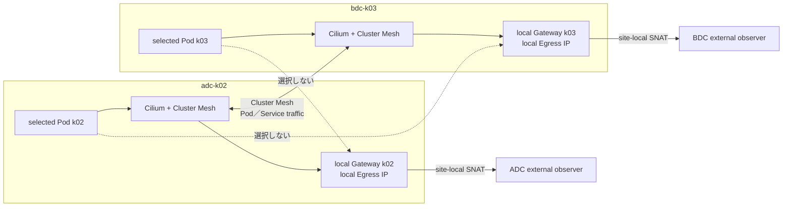

# Egress Gateway／Cluster Mesh 同時有効化試験

## 1. 目的と位置付け

この文書は、`nxos_multisite` の `adc-k02` と `bdc-k03` で Cluster Mesh の基本構築が合格した後、
Egress Gateway を追加して両機能が同時に有効な状態を検証する構築後試験を定義する。

Cilium `1.20.1` の公式文書は Egress Gateway と Cluster Mesh を「not compatible」と記載する一方、
Gateway は selected Pod と同じ cluster に存在する必要があるとも記載する。Helm chart と Egress Gateway
manager は同時有効化を明示的に拒否していないため、本ラボでは次を区別する。

| 判断 | 本ラボでの扱い |
|---|---|
| 機能 flag の同時有効化 | 実装上の可否を構築後試験で確認する |
| local Pod → 同じ cluster の local Gateway | k02／k03 で個別に試験する |
| remote Pod または remote Gateway を跨ぐ Policy | 対象外。選択されないことを確認する |
| 公式 support status | 試験結果にかかわらず Cilium `1.20.1` ではサポート外として扱う |
| 通常構築への採用 | `multisite-final` へ含めず、実験 profile だけで一時的に構築する |

この試験の合格は「本ラボの特定 version／構成で観測した動作」を意味し、Cilium の公式サポートを
示すものではない。

### 1.1 実行前の CLI runtime

コマンドは repository 内の任意の作業 directory から実行できる。新しい shell ごとに multi-site 用の client runtime を
`PATH` の先頭へ追加する。

```bash
export TOPOLOGY_PROFILE=nxos_multisite
export REPO_ROOT="$(git rev-parse --show-toplevel)"
export K8S_CLIENT_RUNTIME="${REPO_ROOT}/nxos_fabric/${TOPOLOGY_PROFILE}/k8s_kind/client/runtime"
export PATH="${K8S_CLIENT_RUNTIME}/bin:${PATH}"
hash -r
command -v helm kubectl cilium hubble

export CLABNAME=nxos-fabric-multisite
export K02_KUBECONFIG="${REPO_ROOT}/nxos_fabric/${TOPOLOGY_PROFILE}/clab-${CLABNAME}/adc-k02/k8s_kind/k02/kubeconfig-k02"
export K03_KUBECONFIG="${REPO_ROOT}/nxos_fabric/${TOPOLOGY_PROFILE}/clab-${CLABNAME}/bdc-k03/k8s_kind/k03/kubeconfig-k03"
export KUBECONFIG="${K02_KUBECONFIG}:${K03_KUBECONFIG}"
test -r "${K02_KUBECONFIG}"
test -r "${K03_KUBECONFIG}"
kubectl config get-contexts
```

いずれかの CLI が表示されない場合は、[クライアントツール準備手順](client-tools.md)を先に実行する。

## 2. 試験範囲

### 2.1 対象

- k02 local Pod → k02 local Gateway → cluster 外部 server
- k03 local Pod → k03 local Gateway → cluster 外部 server
- k02 の Policy が k03 Pod／Gateway を選択しないこと
- k03 の Policy が k02 Pod／Gateway を選択しないこと
- Egress Gateway 有効化後の cross-cluster Pod 通信
- Global Service／MCS API、remote identity、Hubble の回帰
- Cluster Mesh control plane 障害と local Egress の障害分離
- 実験 profile 削除後の Stage 5 基準状態への復帰

### 2.2 対象外

- k02 Pod の通信を k03 Gateway から Egress させる構成
- 1 つの `CiliumEgressGatewayPolicy` を Cluster Mesh 全体へ配布する構成
- remote Pod を local cluster の Policy selector で制御する構成
- 公式サポート構成への昇格判断
- single-site Stage 2B で確認する複数 Egress Gateway の HA／割り当てを、この同時有効化試験では再試験しない

## 3. 論理構成



Policy は Kubernetes cluster-scoped CR だが、Cluster Mesh 全体で共有される resource ではない。
k02 と k03 の各 Kubernetes API へ別々に apply し、Node selector と Egress IP も site-local にする。

## 4. 開始条件

次をすべて満たしてから試験を開始する。

- [ ] [Stage 5](build-plan.md#9-stage-5-multisite-cluster-mesh) が合格している
- [ ] k02／k03 の Cilium version、Helm values、Cilium status を記録している
- [ ] `cilium clustermesh status` で両 cluster が接続済みである
- [ ] cross-cluster Pod、Global Service または MCS API の基準試験が合格している
- [ ] `ciliumEndpointSlice.enabled: false` である
- [ ] `identityAllocationMode: crd`、`kubeProxyReplacement: true` である
- [ ] k02 の Egress Gateway 単独試験が Stage 2B で合格している
- [ ] k03 の local Gateway Node、Fabric interface、Egress IPv4／IPv6 を割り当てている
- [ ] k03 から DCI に依存せず確認できる外部 observation server、または DCI 依存を明記した代替 server を決めている
- [ ] Egress IP が Gateway Node の interface に実在し、重複、ARP／NDP、戻り経路に問題がない
- [ ] 実験 values、Policy、Node label の rollback 手順を render／diff 済みである

k03 の Egress IP と外部 observation server は現時点で未割り当てである。
[パラメータ・アドレス割り当て台帳](parameter-and-address-allocation.md)を更新してから試験 manifest を確定する。

## 5. 実験 profile

通常の `multisite-clustermesh` に、試験専用の `experimental-egress-clustermesh` を最後に重ねる。
初回 install 用 values や `multisite-final` へは統合しない。

```text
cilium/values/00-base.yaml
cilium/values/10-observability.yaml
cilium/values/20-multisite-clustermesh.yaml
cilium/values/30-experimental-egress-clustermesh.yaml
cilium/runtime/10-k8s-api.yaml
```

試験 overlay には少なくとも次を指定する。

```yaml
egressGateway:
  enabled: true

bpf:
  masquerade: true

kubeProxyReplacement: true
identityAllocationMode: crd

ciliumEndpointSlice:
  enabled: false
```

`devices`、IPv4／IPv6 masquerade、rollout 設定は採用済みの完全な values set から引き継ぎ、
実験 overlay で無関係な値を再定義しない。`helm upgrade --reuse-values` は使用しない。

## 6. Policy の境界

各 cluster に同じ構造の Policy を作るが、Node label と Egress IP は site 固有値にする。
次は構造例であり、`<...>` は実装前に割り当て台帳から置換する。

```yaml
apiVersion: cilium.io/v2
kind: CiliumEgressGatewayPolicy
metadata:
  name: local-egress-coexistence-test
spec:
  selectors:
    - podSelector:
        matchLabels:
          lab.cilium.io/egress-policy: coexistence-selected
  destinationCIDRs:
    - "<external-observer-ipv4>/32"
  egressGateway:
    nodeSelector:
      matchLabels:
        lab.cilium.io/egress-gateway: coexistence-local
    egressIP: "<site-local-egress-ip>"
```

この例は IPv4 用である。IPv6 で異なる Egress IP を明示する場合は、採用 Cilium version の CRD schema と
公式例を再確認し、IPv6 destination `/128` を持つ別 Policy に分ける。`egressIP` と `interface` は同じ
Gateway 定義へ同時に指定しない。

初回試験では `destinationCIDRs` を外部 observation server の `/32`／`/128` に限定する。
`0.0.0.0/0`／`::/0` は、Cluster Mesh 制御通信や想定外の外部通信を巻き込むため使用しない。
広域 CIDR と `excludedCIDRs` の相互作用は、local Egress が合格した後の別サブテストとして扱う。

## 7. 適用順序

1. Stage 5 の基準状態、Helm values、Cilium／Cluster Mesh status、BPF Egress map を保存する。
2. k03 の Gateway Node、Egress IP、外部 observation server を割り当て、Node と NX-OS の経路を確認する。
3. k02 だけへ実験 overlay を適用し、Agent／Operator rollout と Cluster Mesh 接続を確認する。
4. k02 で local Egress の smoke test を実行する。
5. k03 へ実験 overlay を適用し、Agent／Operator rollout と Cluster Mesh 接続を確認する。
6. k02／k03 へ site-local Node label、Policy、`egress-probe` を個別に適用する。
7. Test ID `COEX-01` から順に実行し、各 cluster の結果を別々に記録する。
8. Policy、probe、Node label、実験 overlay の順で戻し、Stage 5 の基準試験を再実行する。

一度に両 cluster の Helm release を変更しない。片 cluster ごとに rollout と Cluster Mesh 再接続を
確認することで、障害の発生点を特定できるようにする。

## 8. 試験項目

| Test ID | 条件／通信 | 期待結果 | 主な証拠 |
|---|---|---|---|
| `COEX-00` | 変更前の Stage 5 基準状態 | Egress Gateway は無効で、Egress map は空または未作成。Cluster Mesh と Global Service が正常 | status、BPF map、Hubble |
| `COEX-01` | k02 だけ Egress 有効 | k02 Agent／Operator が Ready に戻り、k02↔k03 の Cluster Mesh 接続を維持する | Helm values、rollout、Cluster Mesh status |
| `COEX-02` | k02 selected Pod → k02 外部 server | k02 local Gateway を通り、k02 Egress IP で SNAT される | 外部 log、BPF map、Hubble、Node／NX-OS capture |
| `COEX-03` | k03 も Egress 有効 | 両 cluster が Egress + Cluster Mesh 有効で Ready になる | 両 context の config／status |
| `COEX-04` | k03 selected Pod → k03 外部 server | k03 local Gateway を通り、k03 Egress IP で SNAT される | 外部 log、BPF map、Hubble、Node／NX-OS capture |
| `COEX-05` | 各 cluster の control Pod → 外部 server | Policy 対象外であり、Egress IP へ変換されない | 外部 log、Hubble |
| `COEX-06` | local Policy と remote cluster の同一 label Pod | local Egress map に remote Pod IP が登録されない | 両 cluster の BPF Egress map |
| `COEX-07` | k02 Pod ↔ k03 Pod | IPv4／IPv6 の Cluster Mesh 通信が基準状態と同じく成功する | curl／ping、Hubble、capture |
| `COEX-08` | Global Service／MCS API | local／remote backend、DNS、site affinity が基準状態と同じである | backend 応答、Service／Endpoint、Hubble |
| `COEX-09` | Cluster Mesh API を一時停止 | remote 同期の障害を観測しつつ、site 内で完結する local Egress は継続する | Cluster Mesh status、外部 log、BPF map |
| `COEX-10` | 片方の local Gateway を停止 | 障害は該当 cluster の selected traffic に限定され、対向 cluster の local Egress と Mesh 基盤を壊さない | drop reason、外部 log、status |
| `COEX-11` | Policy と実験 overlay を rollback | Egress map が消え、Stage 5 の Cluster Mesh／Service 基準試験が再合格する | Helm diff、BPF map、回帰結果 |

`COEX-09` は DCI 自体を停止せず、Cluster Mesh control plane だけを対象にする。DCI を停止すると外部
observation server への経路も失われる可能性があるため、別の障害試験として依存関係を明記する。

## 9. 確認コマンドの骨格

実際の context 名、Pod 名、宛先 IP は構築記録で確定する。

```bash
cilium status --context <k02-context>
cilium status --context <k03-context>
cilium clustermesh status --context <k02-context>
cilium clustermesh status --context <k03-context>

kubectl --context <k02-context> -n kube-system exec ds/cilium -- \
  cilium-dbg bpf egress list
kubectl --context <k03-context> -n kube-system exec ds/cilium -- \
  cilium-dbg bpf egress list

kubectl --context <k02-context> get ciliumegressgatewaypolicies
kubectl --context <k03-context> get ciliumegressgatewaypolicies
```

BPF map は少なくとも次を照合する。

- Source IP がその cluster の selected Pod IP である
- Gateway IP がその cluster の local Gateway Node IP である
- Egress IP がその cluster の割り当て済み Egress IP である
- 対向 cluster の selected Pod IP が登録されていない

## 10. 停止条件

次のいずれかを確認した場合は後続試験へ進まず、直前に変更した cluster を rollback する。

- Cilium Agent または Operator が Ready に戻らない
- Cluster Mesh 接続または remote identity 同期が回復しない
- remote Pod IP が local Egress map へ登録される
- cross-cluster Pod／Service 通信が Egress Gateway へ redirect される
- Kubernetes API、Cluster Mesh API、Hubble 制御通信が Egress Policy の対象になる
- control Pod の通信が Egress IP へ変換される
- Egress IP の重複、ARP／NDP 異常、予期しない BGP advertisement が発生する

## 11. Rollback

rollback は次の順序で行う。

1. `CiliumEgressGatewayPolicy` と `egress-probe` を両 cluster から削除する。
2. 実験用 Node label と Egress secondary address を試験前の状態へ戻す。試験前から存在した address は削除しない。
3. `30-experimental-egress-clustermesh.yaml` を指定しない完全な values set で Helm upgrade する。
4. Cilium Agent／Operator の rollout と Cluster Mesh 再接続を待つ。
5. Egress Gateway が無効で、BPF Egress map が空または未作成であることを確認する。
6. `COEX-00` と同じ Stage 5 基準試験を再実行する。

Node の Egress secondary address 削除は、Policy 削除と BPF map 消去を確認した後に行う。
Containerlab／Kind の再作成や lab destroy は、この試験の暗黙の rollback に含めない。

## 12. 判定と記録

| 判定 | 条件 |
|---|---|
| `Pass (unsupported)` | 全 Test ID が期待どおりで、rollback 後も Stage 5 基準状態へ戻る |
| `Partial` | local Egress は動作するが、family、片 cluster、障害試験、回帰試験の一部に問題がある |
| `Fail` | local Egress が動作しない、remote resource を誤選択する、または Cluster Mesh 基盤へ影響する |

構築記録には Cilium／Kubernetes version、完全な Helm values、Policy、Node／Pod 配置、Egress IP、
外部 server の観測、BPF map、Hubble flow、NX-OS 経路、rollback 結果を残す。実測 log、packet capture、
sysdump、credential は Git 管理対象外とする。

## 13. 参照 URL

- [Cilium Egress Gateway](https://docs.cilium.io/en/stable/network/egress-gateway/egress-gateway/)
- [Cilium v1.20.1 Egress Gateway manager](https://github.com/cilium/cilium/blob/v1.20.1/pkg/egressgateway/manager.go)
- [Cilium v1.20.1 Egress Gateway policy](https://github.com/cilium/cilium/blob/v1.20.1/pkg/egressgateway/policy.go)
- [Cilium Cluster Mesh](https://docs.cilium.io/en/stable/network/clustermesh/)
- [Cilium Cluster Mesh Setup](https://docs.cilium.io/en/stable/network/clustermesh/setup/)
