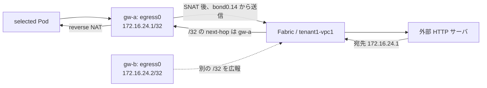

# Egress Gateway の専用 IP・BGP 経路設計

## 1. 目的と採用方式

Egress IP を Node NIC の L2 サブネットと LB IPAM の集約範囲から分離する。
Node 上の専用 dummy interface `egress0` に IPv4 `/32`・IPv6 `/128` を割り当て、
Cilium BGP Control Plane の `Interface` advertisement で所有 Node から個別経路を広報する。
割当範囲の `/24`・`/64` に VLAN／SVI は作らない。Node は個別経路を広報し、NX-OS の BGP 終端で集約経路も生成する。
現在の基本 config は `summary-only` を付けず、個別経路と集約を併存させる。経路数の削減はまだ行わない。

個別経路方式の single-site 基本試験は実施済み。常設 config と集約併存方式へ更新し、multisite は保存 config の検証までとする。
single-site k02 を先に試験し、k03 は multisite 実験の開始条件を満たした後に使用する。

## 2. アドレスと役割

| Cluster | 専用割当範囲 IPv4／IPv6 | Gateway | Egress IPv4／IPv6 |
|---|---|---|---|
| k02 | `172.16.24.0/24`／`fd21:0:0:24::/64` | `adc-k02-worker` | `172.16.24.1/32`／`fd21:0:0:24::1/128` |
| k02 | 同上 | `adc-k02-worker2` | `172.16.24.2/32`／`fd21:0:0:24::2/128` |
| k03 | `172.16.25.0/24`／`fd21:0:0:25::/64` | `bdc-k03-worker` | `172.16.25.1/32`／`fd21:0:0:25::1/128` |
| k03 | 同上 | `bdc-k03-worker2` | `172.16.25.2/32`／`fd21:0:0:25::2/128` |

- アドレス保持先は全 Gateway 共通で `egress0`。IP の追加・再作成は運用者の専用 script が担当する。
- 実際の送受信先は k02 worker の `bond0.14`、worker2 の `bond0.104`、k03 の `bond0.105`。
- Cilium `devices` は実際の Fabric 側 NIC を含む。`egress0` を送信 NIC として Policy に指定しない。
- Policy は `egressIP` を明示し、`interface` は省略する。IPv4／IPv6 は別 Policy とする。
- LB 用 `172.16.14.0/26`／`172.16.15.0/26` と IPv6 `/112` の集約を維持し、Egress を混ぜない。
- single-site と multisite の k02 は同一設計の別ラボ。両者を同じ routing domain へ同時接続する場合は IP の再割当が必要。

## 3. 広報と戻り経路

`CiliumBGPAdvertisement` は通常用と `planned-shut` 用を用意し、既存 PeerConfig の
`advertise: k02`／`k02-planned-shut`、または k03 の対応 label と一致させる。
既存 BGP session を共用し、新しい BGP process、Service、LB pool を追加しない。
`Interface` 広報は `egress0` 上の対象アドレスを広報するため、同 interface に別用途の IP を追加しない。

Gateway ごとに異なる IP を保持する。両 Gateway が存在する間は両方の個別経路を広報し、
Policy の `gw-a` → `gw-b` 切替で SNAT IP が `.1` → `.2` に変わる。
同じ Egress IP を両 Node から等コストで広報しない。複数 BGR 経由であっても、最終到達 Node は IP 所有者に一致させる。
BGP の広報・撤回は IP／interface／session の状態に基づき、Egress Policy の有無や NAT の健全性とは自動連動しない。

NX-OS の inbound route-map に permit 30 を常設し、割当済み IP ごとの列挙を範囲単位の許可に統合する。

| Cluster | IPv4 受信許可 | IPv6 受信許可 |
|---|---|---|
| k02 | `172.16.24.0/24 le 32` | `fd21:0:0:24::/64 le 128` |
| k03 | `172.16.25.0/24 le 32` | `fd21:0:0:25::/64 le 128` |

各 prefix-list は sequence 5 の 1 行とする。受信許可の拡大は Node への IP 自動割当や自動広報を意味しない。
`CILIUM_K02_IN_V4/V6` と `CILIUM_K03_IN_V4/V6` は同名ごとにまとめ、permit 10（LB 集約）、20（LB 個別）、30（Egress）の順で記載する。

既存 permit 10／20、LB 集約、Node IP、BGP source address は変更しない。
同名 prefix-list や permit 30 が既存用途に使われている場合は上書きせず、差分を解決してから実施する。
外部サーバと同じ `tenant1-vpc1` の RIB／FIB に経路が届くことを確認する。
両 family の controller VRF import は既存 policy に従い、Egress の `/24`・`/64` 集約も確認対象とする。
別 VRF／DCI を通る試験では、その import／export filter を含む経路確認を別途必須とする。

### 3.1 常設 config と集約併存

| Cluster | 集約機器 | 追加する集約 |
|---|---|---|
| k02 | `adc-bgrt0101/0102` | `172.16.24.0/24`、`fd21:0:0:24::/64` |
| k03 | `bdc-lfsw0101/0102` | `172.16.25.0/24`、`fd21:0:0:25::/64` |

基本 config に受信 prefix-list／permit 30 と `aggregate-address` を含める。`configs/changes/cilium-stage2b/` は
旧環境の移行差分として保持する。試験終了時に消すのは Policy、Node IP、Cilium advertisement であり、常設 config は削除しない。

`summary-only` は全 more-specific の広報を抑止するため、現在は指定しない。両終端から集約だけを出すと、
片側が一方の Node 経路を失った際に、その終端へ届いた戻り通信が discard される可能性がある。
まず個別経路を維持し、片系 peer 断・Node 停止・全 contributor 消失・復旧を実測してから、抑止条件を別変更で決める。
NX-OS の集約 discard route と、最後の contributor 消失後に集約が消えることも確認する。
BGP 経路の存在は NAT の健全性を保証しない。

### 3.2 VRF／site の公開範囲

`CILIUM_EGRESS_SCOPE_V4/V6` と `IPv4_IMPORT_MAP_controller-vpc1`／`IPv6_IMPORT_MAP_controller-vpc1` の deny 5 は削除する。
既存 import permit 10／20 を維持し、IPv4・IPv6 とも既存の VRF 間経路制御に従う。
Egress 集約を controller VRF でも照会し、取り込まれる場合は全 contributor 撤回後に消えることを確認する。
Leaf に Egress 専用の受信・import policy は追加しない。

Egress IP の経路広報は LoadBalancer IP と同じ扱いとし、Egress 専用の `no-export` は付けない。
ADC Leaf の BGR 向け `CILIUM_EGRESS_SITE_ONLY_V4/V6` と neighbor の参照を削除し、
BDC Leaf は Egress 受信時の community 付与と集約の attribute-map を削除する。
既存の VRF／EVPN／DCI policy に従って広報する。multisite 起動後は LB 経路と比較し、DCI advertised-routes と
対向 site の tenant RIB に Egress 経路が届くことを確認する。DCI に prefix 許可リストを導入する場合は LB と Egress の両範囲を含める。

site 間の広報と VRF 間 import は別の設定で管理する。
Leaf の BGR peer は k01／k02 共用のため、受信許可リストを導入する場合は k01 LB も含めて別途整理する。

k03 の基本 config は `loopback105`、worker 2 台 × 2 family の eBGP multihop、`local-as 65020`、LB／Egress の
受信 filter、ECMP を含む。Fabric process ASN は `65002` を維持する。Leaf 固有 loopback も direct redistribution の
専用 route-map で `no-export` を付ける。Cluster Mesh と Egress の機能 flag はこの NX-OS config では変更しない。

参考：[Cisco NX-OS BGP 集約・discard・summary-only](https://www.cisco.com/c/en/us/td/docs/dcn/nx-os/nexus9000/105x/unicast-routing-configuration/cisco-nexus-9000-series-nx-os-unicast-routing-configuration-guide/configuring-bgp.html)。

## 4. 重複確認と切替上の注意

2026-09-06 の IPv4 確認では、ローカルの single-site／multisite 定義と clab01 の稼働中 Linux Node／server、
k02 の Kubernetes 割当に重複はなかった。k03 の稼働環境と NX-OS running config はこの確認の対象外。
IPv6 の専用範囲はリポジトリ定義と照合し、重複なし。両 family とも実施直前の IP／pool／RIB 確認を行う。
広い `172.16.0.0/16` の forwarding route に包含されることは IP 割当の重複とは区別する。

専用 dummy interface は L2 セグメントを共有しないため、`arping` や IPv6 DAD だけでは他 Node との重複を
検出できない。割当台帳、全 Gateway／control-plane の address、LB pool、NX-OS RIB を突き合わせる。
script は同一 cluster の稼働 Kind Node にある誤配置・重複と、`egress0` の所有 marker・type・想定外 IP を検査する。
稼働中の `tentative`／`dadfailed` は成功にしないが、DAD の成功をクラスタ全体の未使用証明にはしない。

旧設計の `172.16.4.31/24`・`172.16.4.32/24`、`fd21:0:0:4::3:1/64`・`fd21:0:0:4::3:2/64` を
使った試験が残っている場合は、旧 Policy を削除し、BPF map と通信の baseline 復旧を確認する。
旧 IP は今回の新 script では削除しない。用途を確認した上で旧設計の記録に従い撤去し、新旧 Policy を併存させない。

## 5. 適用・復旧の順序と試験

1. 既存 IP／Policy／BGP advertisement／NX-OS filter・経路と LB 通信の baseline を保存する。
2. NX-OS の常設受信許可・集約・公開範囲の設定を確認する。旧 config の場合だけ移行差分を適用する。BGP session の hard clear はしない。
3. 所有 marker 付き `egress0` と個別 IP を作り、外部宛 route lookup が Fabric NIC を向くことを確認する。
4. 試験専用 BGP advertisement を適用し、各 `/32`・`/128` の所有者・next-hop・外部までの戻り経路を確認する。
5. Egress Policy を適用し、対象／対象外／除外宛先と Gateway 切替を実測する。
6. Policy を削除し、baseline を確認する。その後 BGP advertisement を削除し、個別経路の撤回を確認する。
7. 今回作成した `egress0` を撤去する。NX-OS の常設設定は残し、個別経路と集約経路の撤回、LB／BGP を再確認する。

基本試験に `W-EGRESS-13`（個別経路と所有者）、`W-EGRESS-14`（撤回と LB 非干渉）を追加する。
個別経路を抑止する集約、同じ IP の Node 間移動、自動 HA／NAT 状態同期は今回の範囲に含めない。
k03 は専用 IP と BGP 設定を予約・準備するが、Cluster Mesh 同時有効化の開始条件を省略しない。

## 6. 設定・手順と参照

- [single-site 構築・試験手順](egress-gateway-test-plan.md)
- [single-site NX-OS 差分と復旧](../../nxos_singlesite/configs/changes/cilium-stage2b/README.md)
- [multisite NX-OS 差分と復旧](../../nxos_multisite/configs/changes/cilium-stage2b/README.md)
- [アドレス台帳](parameter-and-address-allocation.md#5-egress-gateway)
- [Cluster Mesh 同時有効化試験](egress-clustermesh-coexistence-test.md)
- [Cilium Interface 広報](https://docs.cilium.io/en/stable/network/bgp-control-plane/bgp-control-plane-configuration/#interface-ips)
- [Cilium Egress IP 選択](https://docs.cilium.io/en/stable/network/egress-gateway/egress-gateway/#selection-of-the-egress-network-interface)
- [Cilium v1.20.1 Policy 実装](https://github.com/cilium/cilium/blob/v1.20.1/pkg/egressgateway/policy.go)
