# single-site k02 Egress Gateway 構築・試験手順

## 1. 目的・変更範囲・進め方

この試験では、**選択した Pod の外向き通信だけが Gateway Node を経由し、外部サーバから指定の
Egress IP に見えるか**を確認する。HTTP 成功だけでは SNAT の合格にせず、外部サーバの
`remote`（接続元 IP）と Cilium の Egress map を対応付ける。

本手順はリポジトリの `nxos_singlesite` / `adc-k02` 用 manifest を使用する。
既存の Egress Gateway feature を使い、試験 Pod、専用 dummy 上の IP、BGP 個別広報、Egress Policy、外部 HTTP 待受を追加する。
クラスタ再作成、Helm upgrade、kubelet の Node IP 変更はこの手順に含めない。
全体 connectivity test と、この機能試験の合否は分けて記録する。

設計の正本は [Egress 専用 IP・BGP 経路設計](egress-gateway-routed-design.md)。LB 集約から独立した `/32`／`/128` を使う。

### 試験構成の概要

初期状態は `gw-a` を選択し、worker2 の Pod から別 Node の Gateway を経由する通信を確認する。
図の破線は `gw-b` へ手動切替した後の経路を表す。両 Gateway を同時に使用する構成や自動切替を表すものではない。

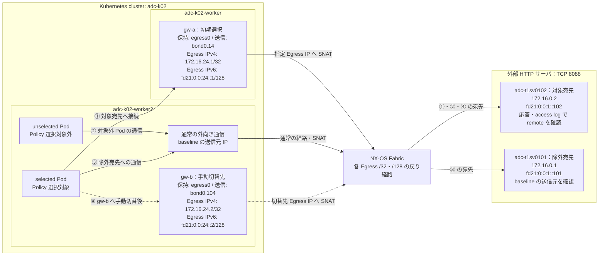

| 図の通信 | 外部サーバで確認すること | 対応する試験 |
|---|---|---|
| ① `selected` → 対象宛先 | HTTP が成功し、`remote` が `gw-a` の Egress IP になる。source Node と Gateway Node は異なる。 | `W-EGRESS-02`／`05` |
| ② `unselected` → 対象宛先 | HTTP が成功し、送信元は Policy 未適用時の baseline と同じ。 | `W-EGRESS-03` |
| ③ `selected` → 除外宛先 | Pod は選択対象でも、宛先の除外条件により baseline の送信元を維持する。 | `W-EGRESS-04` |
| ④ 切替後の `selected` → 対象宛先 | 新しい接続の `remote` が `gw-b` の Egress IP になる。 | `W-EGRESS-09` |

図は通信の役割と経路を示す概要で、Fabric 内の個々の機器・リンクは省略している。
試験前に両 Pod の baseline を記録し、Policy 撤去後もそこへ戻ることを確認する。
端末 A／B は操作・観測用で、このデータ通信経路には含めない。

| 手順 | Test ID | 操作・確認内容 |
|---|---|---|
| 2～5 | 準備 | 環境・証跡、feature、外部 HTTP サーバ、Pod 配置を確認する。 |
| 6 | `W-EGRESS-01` | Policy がない状態で送信元 IP と到達性を記録する。 |
| 7～8 | `W-EGRESS-13`、`02`／`03`／`05` | `gw-a` の Egress IP を準備し、選択対象だけが別 Node の Gateway で SNAT されることを確認する。 |
| 9 | `W-EGRESS-04` | 除外宛先と対象 CIDR 外では baseline が維持されることを確認する。 |
| 10 | `W-EGRESS-09` | `gw-b` へ明示的に切り替え、新規接続の送信元変化を確認する。 |
| 11 | `W-EGRESS-08`／`14` | Policy を撤去し、通信・BGP の復旧と後片付けを確認する。 |
| 12.1～12.4 | `W-EGRESS-12A`／`12B` | Gateway／Egress IP 選択不能時の拒否と復旧。 |
| 12.5～12.8 | `W-EGRESS-06`／`09` 追加・経路・負荷 | 新規 Pod、経路照合、既存接続、TCP／UDP、SNAT port 上限。 |
| 12 の Node 障害系 | `W-EGRESS-07`／`10`／`11` | 今回は保留・スキップ。 |

端末 A は外部サーバの準備・ログ確認、端末 B は Kubernetes／Node の設定と通信発生を担当する。
両端末は同じ実行ホスト上で開き、同じ証跡ディレクトリを使用する。実行ホストから対象クラスタの
`kubectl` とラボコンテナの `docker` を操作でき、必要なファイルが配置されていることを前提とする。
接続先、配置パス、ファイル同期方法、ログ転送先は [実際の試験環境](execution-environment-singlesite-k02.md) にまとめる。

既知課題は [試験課題台帳](test-issue-register.md) を確認する。
`TI-001` の外部 → IPv6 NodePort は今回の Pod → 外部と方向が異なる。
`TI-002` の Forwarding／ECMP 冗長性も、この基本 SNAT 試験では合格にしない。
baseline 自体が失敗する場合は Policy を追加せず、その経路を先に切り分ける。

<a id="egress-session"></a>

## 2. 端末 A／B の環境設定と証跡

最初に各端末で、実行環境に合わせて次の変数を設定する。
記録日を固定する場合は、環境別設定で `TEST_DATE` を先に指定する。ログ内の実時刻は変更しない。
今回の設定コマンドは [実際の試験環境の「環境変数」](execution-environment-singlesite-k02.md#environment-variables) を参照する。
別環境ではこの設定を置き換える。以降のコマンドに個人のホームディレクトリを直接書き込まない。

| 変数 | 内容 |
|---|---|
| `REPO_ROOT` | 実行ホスト上のリポジトリ配置先の絶対パス |
| `KUBE_CONTEXT` | 対象クラスタの context。使用する manifest と一致させる |
| `KUBECONFIG` | 上記 context を含む kubeconfig ファイルの絶対パス |

Node 名、宛先 CIDR、Egress IP は本手順と manifest に対応するラボ設計値である。
異なるトポロジーへ流用する場合は、パスの変更に加えてそれらの設計値も合わせる。

**端末 B：新しい試験セッションを 1 回作る。** 同時に別の Egress 試験を行わない。
`EG_DIR` は今回の全証跡の保存先である。以下の設定ファイルには shell 変数だけを保存し、認証情報は保存しない。

```bash
(
  set -euo pipefail
  : "${REPO_ROOT:?環境別設定で REPO_ROOT を設定してください}" "${KUBE_CONTEXT:?}" "${KUBECONFIG:?}"
  FABRIC_ROOT="${REPO_ROOT}/nxos_fabric/nxos_singlesite"
  TEST_DATE="${TEST_DATE:-$(date +%F)}"
  EVIDENCE_DIR="${FABRIC_ROOT}/operations/cilium-lab/${TEST_DATE}/adc-k02"
  mkdir -p "${EVIDENCE_DIR}/raw"
  EG_DIR="$(mktemp -d "${EVIDENCE_DIR}/raw/egress-stage2b-XXXXXXXX")"
  EG_RUN_ID="$(basename "${EG_DIR}")"
  EG_ROOT="${FABRIC_ROOT}/k8s_kind/k02/cilium/manifests/validation/egress"
  K8S_CLIENT_RUNTIME="${FABRIC_ROOT}/k8s_kind/client/runtime"
  EG_SERVER_DIR="/tmp/${EG_RUN_ID}"
  test -r "${KUBECONFIG}"
  test -d "${EG_ROOT}/gw-a"
  for name in REPO_ROOT FABRIC_ROOT TEST_DATE EVIDENCE_DIR EG_DIR EG_RUN_ID EG_ROOT KUBE_CONTEXT KUBECONFIG K8S_CLIENT_RUNTIME EG_SERVER_DIR; do
    printf 'export %s=%q\n' "$name" "${!name}"
  done > "${EG_DIR}/session.env"
  cp "${EG_DIR}/session.env" "${FABRIC_ROOT}/operations/cilium-lab/egress-stage2b-current.env"
  printf 'session=%s\n' "${EG_DIR}"
)
```

**端末 A／B：それぞれ以下を実行する。** 新しい端末で再開した場合も、このブロックから始める。
`source` 先は上で生成した自分のセッションファイルに限定する。

```bash
egress_load_session() {
  : "${REPO_ROOT:?環境別設定で REPO_ROOT を設定してください}"
  source "${REPO_ROOT}/nxos_fabric/nxos_singlesite/operations/cilium-lab/egress-stage2b-current.env" || return
  export PATH="${K8S_CLIENT_RUNTIME}/bin:${PATH}"
  hash -r
  printf 'context=%s session=%s\n' "${KUBE_CONTEXT}" "${EG_DIR}"
  command -v kubectl cilium docker jq python3
}
egress_load_session
```

両端末の `context` と `session` が同じことを確認する。以降の shell ブロックはサブシェル内で失敗を止める。
`kubectl diff` の終了コード `1` は差分あり、`2` 以上はエラーとして扱う。

## 3. 端末 B：既存 feature と経路の事前確認

目的は「Policy を追加できる基盤が既にあるか」を確認すること。ConfigMap だけでなく稼働 Agent も確認する。

```bash
(
  set -euo pipefail
  : "${KUBE_CONTEXT:?}" "${EG_DIR:?}"
  cilium status --context "${KUBE_CONTEXT}" > "${EG_DIR}/cilium-before.log"
  cilium bgp peers --context "${KUBE_CONTEXT}" > "${EG_DIR}/bgp-before.log"
  kubectl --context "${KUBE_CONTEXT}" get nodes -o json > "${EG_DIR}/nodes-before.json"
  kubectl --context "${KUBE_CONTEXT}" -n kube-system get pods -l k8s-app=cilium -o json > "${EG_DIR}/agents-before.json"
  kubectl --context "${KUBE_CONTEXT}" -n kube-system get configmap cilium-config -o json > "${EG_DIR}/config-before.json"
  jq '.data | with_entries(select(.key | test("egress|masquerade|kube-proxy|identity-allocation|endpoint-slice|devices")))' "${EG_DIR}/config-before.json"
  kubectl --context "${KUBE_CONTEXT}" get ciliumegressgatewaypolicies -o yaml > "${EG_DIR}/egress-policies-before.yaml"
  kubectl --context "${KUBE_CONTEXT}" get ciliumclusterwidenetworkpolicies -o yaml > "${EG_DIR}/ccnp-before.yaml"
  for agent in $(jq -r '.items[].metadata.name' "${EG_DIR}/agents-before.json"); do
    kubectl --context "${KUBE_CONTEXT}" -n kube-system exec "$agent" -c cilium-agent -- cilium-dbg status --verbose > "${EG_DIR}/${agent}-status-before.log"
    kubectl --context "${KUBE_CONTEXT}" -n kube-system exec "$agent" -c cilium-agent -- cilium-dbg bpf egress list > "${EG_DIR}/${agent}-egress-before.log"
    kubectl --context "${KUBE_CONTEXT}" -n kube-system exec "$agent" -c cilium-agent -- cilium-dbg bpf metrics list > "${EG_DIR}/${agent}-metrics-before.log"
  done
  for node in adc-k02-worker adc-k02-worker2; do
    docker exec "$node" ip -br addr > "${EG_DIR}/${node}-addresses-before.log"
    docker exec "$node" ip route get 172.16.0.2 > "${EG_DIR}/${node}-route4-before.log"
    docker exec "$node" ip -6 route get fd21:0:0:1::102 > "${EG_DIR}/${node}-route6-before.log"
  done
  cat "${EG_DIR}/cilium-before.log" "${EG_DIR}/bgp-before.log"
)
```

進む条件は以下のとおり。

- Cilium は正常、3 Node は Ready、既存 BGP session は baseline と同じ Established。
- `enable-egress-gateway`、`enable-bpf-masquerade`、`kube-proxy-replacement` が `true`。
- dual-stack の試験では `enable-ipv4-masquerade`／`enable-ipv6-masquerade` を確認する。
- identity allocation は `crd`、CES は無効、通常の single-site で Cluster Mesh は使わない。
- `devices` に `bond0.+` が含まれ、外部サーバへの経路が worker の fabric interface を使う。
- `egress-probe-ipv4`／`egress-probe-ipv6` が既存用途で使われていない。他の Egress Policy／CCNP が今回の Pod に重複しない。

既存の同名 Policy や `egress-probe` がある場合は、今回作成するものと断定して上書き・削除しない。
設定が不足していても、この手順から Helm upgrade／Agent 再起動を実行せず、初期構築との差分を整理する。

**端末 B：LB 通信の変更前 baseline を保存する。** Stage 2A の既存 `lab-smoke` Service 2 個を対象に、
外部サーバから IPv4／IPv6 の VIP に接続する。Egress の変更が LB 通信を壊していないか、撤去後に同じ宛先と比較するためである。

```bash
(
  set -euo pipefail
  phase="before"
  kubectl --context "${KUBE_CONTEXT}" -n cilium-lab-smoke get service \
    lab-smoke-lb-cluster lab-smoke-lb-local -o json > "${EG_DIR}/lb-${phase}.json"
  jq -e '[.items[] | ([.status.loadBalancer.ingress[]?.ip] | length)] | length == 2 and all(. == 2)' \
    "${EG_DIR}/lb-${phase}.json"
  log="${EG_DIR}/lb-${phase}-http.log"
  while IFS=$'\t' read -r service vip; do
    dest="$vip"
    [[ "$vip" != *:* ]] || dest="[$vip]"
    printf '\nservice=%s vip=%s\n' "$service" "$vip"
    docker exec clab-nxos-fabric-singlesite-adc-t1sv0102 \
      curl --noproxy '*' -gfsS --connect-timeout 3 --max-time 5 \
      -w 'http_code=%{http_code}\n' "http://${dest}:80/"
  done < <(jq -r '.items[] | .metadata.name as $name | .status.loadBalancer.ingress[] | [$name, .ip] | @tsv' \
    "${EG_DIR}/lb-${phase}.json") > "$log" 2>&1
  cat "$log"
)
```

期待値は 2 Service × 2 family の 4 件が HTTP 200。Service／VIP が未準備なら Stage 2A の準備を確認する。
変更前から失敗する通信は既知課題として記録し、Egress 変更による新規障害と区別する。
その場合、正常通信を前提とする LB 回帰項目は合格にしない。

### 3.1 外部サーバ向け Leaf MTU の修正・確認

**以下は 2026-09-06 に実施した `9216` への修正コマンドと出力の記録。次回はこの投入を繰り返さず、
[TI-007](test-issue-register.md#ti-007-mtu-9100) の Po11〜16 MTU `9100` の影響確認・変更手順の確定から始める。**
今回は課題登録のみで、`9100` の投入手順は実機の `system jumbomtu` 依存と変更範囲を確定後に作成する。

**目的：** jumbo を送る Node／外部サーバに対し、Leaf のサーバ向けリンクだけ MTU 1500 になる不整合を解消する。
2026-09-06 の試験記録として `adc-lfsw0103`／`0104` の `port-channel11` を 9216 に変更した。
`Ethernet1/1` の実 MTU も 9216 へ追従した。稼働中の Port-Channel メンバーへ `mtu` を直接入力すると、この NX-OS では拒否される。

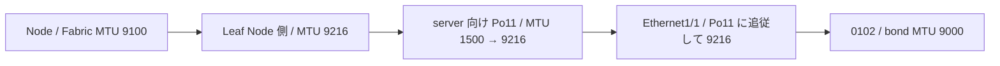

**端末 B：対象 Leaf へ順にログインし、出力を保存する。** 既に 9216 なら確認だけでよい。
以下は今回の修正対象だけに限定した操作で、他の interface や Node は変更しない。

```bash
(
  set -euo pipefail
  : "${EG_DIR:?}"
  read -r -p 'NX-OS ログインユーザー名: ' NXOS_USER
  for leaf in adc-lfsw0103 adc-lfsw0104; do
    leaf_ip="$(docker inspect "clab-nxos-fabric-singlesite-$leaf" | jq -er '[.[0].NetworkSettings.Networks[].IPAddress | select(length>0)] | if length==1 then .[0] else error("管理 IP が一意ではありません") end')"
    printf -v login_cmd 'ssh -F /dev/null -l %q %q' "$NXOS_USER" "$leaf_ip"
    script -q -e -c "$login_cmd" "$EG_DIR/$leaf-mtu-fix.log"
  done
)
```

**接続先の NX-OS CLI：** 両 Leaf に同じ操作を行う。変更前の interface と vPC を確認してから Port-Channel 側を変更する。

```text
terminal length 0
show interface port-channel11
show interface ethernet1/1
show port-channel summary
show vpc brief
configure terminal
interface port-channel11
mtu 9216
end
show interface port-channel11
show interface ethernet1/1
show running-config interface port-channel11
show running-config interface ethernet1/1
show port-channel summary
show vpc brief
show vpc consistency-parameters interface port-channel11
exit
```

両 Leaf とも Po11／Ethernet1/1 が `MTU 9216 bytes`、Po11 が `SU`、member が `P`、vPC の整合性と稼働が正常なことを確認する。
MTU 不整合は vPC pair の片側だけで判断せず、両側の変更後に確認する。
今回の running-config 反映と保存 config の修正は完了している。`copy running-config startup-config` は本手順では実行していない。

保存 config は single-site と multisite の `as-equals`／`as-changes` の ADC Leaf0103／0104、計 6 ファイル。
初期投入用 config には Po11 と物理メンバー双方へ `mtu 9216` を記載し、物理側では `channel-group 11 mode active` より前に置く。
既存の channel-group に参加したまま config 全体を流す方法と、初期投入の順序を区別する。
multisite の `as-changes` は正規 generator から生成し、停止中の multisite には投入していない。

[修正・再試験結果とコマンド](../../nxos_singlesite/operations/cilium-lab/2026-09-06/adc-k02/egress-mtu-fix-result.md) に変更前後を保存する。
設定に問題があれば、この 2 台の Po11 を変更前の `mtu 1500` に戻し、vPC／Port-Channel／LB を再確認する。Node／kernel の再起動で対処しない。

## 4. 端末 A：外部 HTTP サーバを準備する

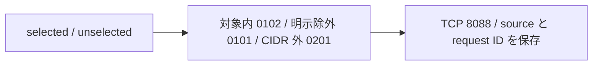

`adc-t1sv0102` は対象 CIDR 内の宛先、`adc-t1sv0101` は `excludedCIDRs`、`adc-t1sv0201` は CIDR 外の宛先である。
既存の HTTP 待受を前提にせず、専用の TCP `8088` を使い、
レスポンスと access log に**外部サーバが観測した送信元**と試験 ID を出す。

```bash
(
  set -euo pipefail
  : "${EG_DIR:?}" "${EG_SERVER_DIR:?}"
  for server in adc-t1sv0102 adc-t1sv0101 adc-t1sv0201; do
    container="clab-nxos-fabric-singlesite-${server}"
    docker exec "$container" sh -c 'command -v nginx; command -v curl; ip -br addr; ss -lntp' > "${EG_DIR}/${server}-precheck.log"
    cat "${EG_DIR}/${server}-precheck.log"
    if docker exec "$container" ss -H -lnt | awk '$4 ~ /:8088$/ {found=1} END {exit !found}'; then
      echo "$container TCP 8088 は使用中です。先へ進みません。" >&2
      exit 1
    fi
    docker exec -i "$container" sh -eu -s -- "${EG_SERVER_DIR}" <<'SH'
root="$1"
mkdir -p "$root"
cat > "$root/nginx.conf" <<NGINX
worker_processes 1;
pid $root/nginx.pid;
error_log $root/error.log;
events { worker_connections 128; }
http {
  log_format egress '\$time_iso8601 remote=\$remote_addr:\$remote_port status=\$status test_id="\$http_x_lab_test_id"';
  access_log $root/access.log egress;
  server {
    listen 0.0.0.0:8088;
    listen [::]:8088 ipv6only=on;
    location / {
      default_type text/plain;
      return 200 "remote=\$remote_addr test_id=\$http_x_lab_test_id\n";
    }
  }
}
NGINX
nginx -t -c "$root/nginx.conf"
nginx -c "$root/nginx.conf"
SH
    docker exec "$container" curl --noproxy '*' -fsS --max-time 5 http://127.0.0.1:8088/
    docker exec "$container" curl --noproxy '*' -gfsS --max-time 5 'http://[::1]:8088/'
  done
)
```

ローカル IPv4／IPv6 で `remote=127.0.0.1`／`remote=::1` が返れば待受確認は成功。
Pod からの到達性・戻り経路は次の baseline で別に確認する。
wildcard listen は今回だけの一時待受で、試験後にこの設定の nginx だけを終了する。

## 5. 端末 B：試験 Pod を配置する

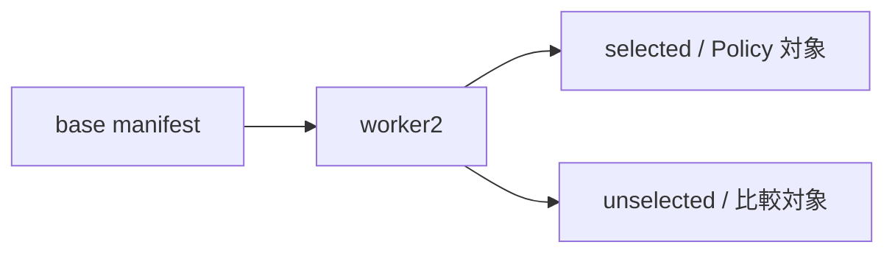

manifest の実際の Pod 名は `selected` と `unselected`。
両 Pod を `adc-k02-worker2` に置き、最初の `gw-a=adc-k02-worker` と異なる Node からの redirect を確認する。
`gw-b=adc-k02-worker2` へ切り替えた場合は同一 Node の Gateway になる。

```bash
(
  set -euo pipefail
  : "${EG_ROOT:?}" "${EG_DIR:?}" "${KUBE_CONTEXT:?}"
  kubectl kustomize "${EG_ROOT}/base" > "${EG_DIR}/base-rendered.yaml"
  kubectl kustomize "${EG_ROOT}/gw-a" > "${EG_DIR}/gw-a-rendered.yaml"
  kubectl kustomize "${EG_ROOT}/gw-b" > "${EG_DIR}/gw-b-rendered.yaml"
  cat "${EG_DIR}/base-rendered.yaml"
)
```

**端末 B：専用 Namespace を先に作成する。** Namespace が存在しない段階の server dry-run／`kubectl diff`
では、その Namespace 内の Pod が `NotFound` になる。上の render で `egress-probe` と 2 Pod だけであることを
確認し、初回は Namespace を作成してから Pod の server dry-run と diff を行う。

```bash
(
  set -euo pipefail
  existing="$(kubectl --context "${KUBE_CONTEXT}" get namespace egress-probe --ignore-not-found -o name)"
  test -z "$existing" || { echo "既存 Namespace です。前回試験の再開か用途を確認してください。" >&2; exit 1; }
  kubectl --context "${KUBE_CONTEXT}" create namespace egress-probe -o json > "${EG_DIR}/namespace-created.json"
  kubectl --context "${KUBE_CONTEXT}" apply --dry-run=server -k "${EG_ROOT}/base" > "${EG_DIR}/base-dry-run.log"
  kubectl --context "${KUBE_CONTEXT}" diff -k "${EG_ROOT}/base" > "${EG_DIR}/base.diff" || test "$?" -eq 1
  cat "${EG_DIR}/base.diff"
)
```

このセッションで作成した Namespace を再利用する場合は、`namespace-created.json` の UID と現在の UID を照合し、
作成を繰り返さず server dry-run／diff から再開する。
差分は作成済み Namespace の apply 管理情報と上記 2 Pod の追加。既存 Pod に対する配置変更は immutable field エラーになるため、
既存用途を確認してから試験 Pod の再作成を計画する。差分を確認した後、以下で適用する。

```bash
(
  set -euo pipefail
  kubectl --context "${KUBE_CONTEXT}" apply -k "${EG_ROOT}/base"
  kubectl --context "${KUBE_CONTEXT}" -n egress-probe wait --for=condition=Ready pod/selected pod/unselected --timeout=120s
  kubectl --context "${KUBE_CONTEXT}" -n egress-probe get pods -o wide --show-labels | tee "${EG_DIR}/probe-placement.log"
  kubectl --context "${KUBE_CONTEXT}" -n egress-probe get networkpolicies,ciliumnetworkpolicies -o yaml > "${EG_DIR}/probe-policies.yaml"
)
```

`selected` だけが `lab.cilium.io/egress-policy=selected`、両 Pod が worker2、Ready であることを確認する。
Pod が Ready でも Egress Policy 反映完了とは限らない。適用後は map と外部の送信元を確認する。

## 6. 端末 B → A：Policy 未適用 baseline（W-EGRESS-01）

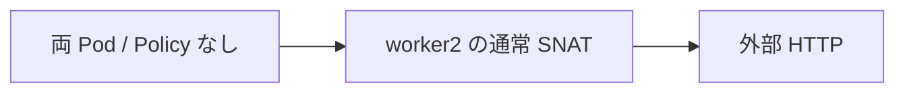

**端末 B：** 両 Pod から対象内・明示除外・CIDR 外の宛先へ IPv4／IPv6 の HTTP を送る。
各リクエストに固有 ID を付け、終了コード、HTTP code、外部が見た送信元を保存する。

```bash
(
  set -euo pipefail
  : "${EG_DIR:?}" "${KUBE_CONTEXT:?}"
  log="$(mktemp "${EG_DIR}/baseline-XXXXXXXX.log")"
  for pod in selected unselected; do
    for dest in 172.16.0.2 '[fd21:0:0:1::102]' 172.16.0.1 '[fd21:0:0:1::101]' 172.16.1.1 '[fd21:0:0:2::101]'; do
      id="${EG_RUN_ID}-baseline-${pod}-$(date +%s%N)"
      printf '\nid=%s pod=%s dest=%s\n' "$id" "$pod" "$dest"
      rc=0
      kubectl --context "${KUBE_CONTEXT}" -n egress-probe exec "$pod" -c client -- \
        curl --noproxy '*' -gfsS --connect-timeout 3 --max-time 5 \
        -H "X-Lab-Test-ID: $id" -w 'http_code=%{http_code}\n' "http://${dest}:8088/" || rc=$?
      printf 'request_exit=%s\n' "$rc"
      test "$rc" -eq 0 || exit "$rc"
    done
  done > "$log" 2>&1
  cat "$log"
)
```

全 12 件が `http_code=200`／`request_exit=0`。`remote` は **実測した通常 SNAT の IP** として記録し、
Pod IP や Node の管理 IP だと決めつけない。これが比較基準となる。
1 件でも失敗したら、Policy を追加せず HTTP 待受、fabric 経路、戻り経路を切り分ける。

**端末 A：外部ログを有限取得する。** 待受コマンドを残さず、以降の各通信試験後もこのブロックを実行する。

```bash
(
  set -euo pipefail
  for server in adc-t1sv0102 adc-t1sv0101 adc-t1sv0201; do
    log="$(mktemp "${EG_DIR}/${server}-access-XXXXXXXX.log")"
    docker exec "clab-nxos-fabric-singlesite-${server}" cat "${EG_SERVER_DIR}/access.log" > "$log"
    cat "$log"
  done
)
```

端末 B の ID と access log の `test_id` が一致し、`status=200`、`remote` がレスポンスと同じなら対応付け成功。

<a id="egress-routed-setup"></a>

## 7. 端末 B→A：Egress IP と BGP 個別経路を準備する

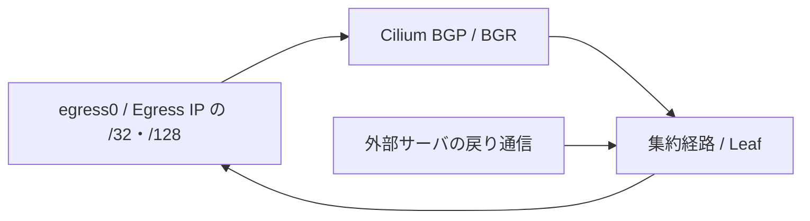

目的は、SNAT に使う IP と、その IP への戻り経路を **Policy 適用前** に準備すること。
`W-EGRESS-13` では、アドレス保持、広報、受信経路、所有 Node が対応するかを確認する。
[専用 IP・BGP 設計](egress-gateway-routed-design.md) と [NX-OS 差分](../../nxos_singlesite/configs/changes/cilium-stage2b/README.md) が設定の対応表となる。

| Profile | Gateway | 保持先 | 送受信 NIC | Egress IPv4 | Egress IPv6 |
|---|---|---|---|---|---|
| `gw-a` | `adc-k02-worker` | `egress0` | `bond0.14` | `172.16.24.1/32` | `fd21:0:0:24::1/128` |
| `gw-b` | `adc-k02-worker2` | `egress0` | `bond0.104` | `172.16.24.2/32` | `fd21:0:0:24::2/128` |

**端末 B：1. 重複と既存設定を確認する。** `egress0` は共有 L2 上の NIC ではないため、
`arping` や DAD の成功だけでは他 Node との重複を否定できない。全 Node の IP、pool、台帳、次の端末 A の RIB を照合する。

```bash
(
  set -euo pipefail
  : "${KUBE_CONTEXT:?}" "${EG_DIR:?}"
  kubectl --context "${KUBE_CONTEXT}" get ciliumloadbalancerippools -o json > "${EG_DIR}/lb-pools-before.json"
  kubectl --context "${KUBE_CONTEXT}" get ciliumpodippools -o json > "${EG_DIR}/pod-pools-before.json"
  kubectl --context "${KUBE_CONTEXT}" get services -A -o json > "${EG_DIR}/services-before.json"
  kubectl --context "${KUBE_CONTEXT}" get ciliumbgpadvertisements -o json > "${EG_DIR}/advertisements-before.json"
  jq -e '[.items[] | select(.metadata.name == "k02-egress" or .metadata.name == "k02-egress-planned-shut")] | length == 0' \
    "${EG_DIR}/advertisements-before.json"
  for node in adc-k02-control-plane adc-k02-worker adc-k02-worker2; do
    docker exec "$node" ip -j addr show > "${EG_DIR}/${node}-all-addresses-before.json"
    docker exec "$node" ip -j -d link show > "${EG_DIR}/${node}-all-links-before.json"
    docker exec "$node" ip -4 route show table all > "${EG_DIR}/${node}-all-routes4-before.log"
    docker exec "$node" ip -6 route show table all > "${EG_DIR}/${node}-all-routes6-before.log"
    jq -e '[.[] | select(.ifname == "egress0")] | length == 0' "${EG_DIR}/${node}-all-links-before.json"
    jq '[.[] | {ifname, addresses: [.addr_info[]? | {local, prefixlen}]}]' "${EG_DIR}/${node}-all-addresses-before.json"
  done
)
```

この初回手順では同名 advertisement と `egress0` がないことを条件にする。存在した場合は出力した証跡を確認し、
前回試験の再開なのか別用途なのかを整理する。既存所有物を今回作成と扱って後で削除しない。
同じ専用範囲の pool・Service IP・他 Node の IP があれば追加せず解決する。

**端末 A：2. NX-OS の常設設定を確認する。** 両 BGR の受信許可・集約設定と ADC Leaf 4 台の IPv4／IPv6 Egress 専用 import 除外撤去、
Leaf 0101/0102 に Egress 専用の no-export 付与が残っていないことを [移行・確認手順](../../nxos_singlesite/configs/changes/cilium-stage2b/README.md)で確認する。
新しい基本 config では追加済みである。未移行の場合だけ同手順の差分を適用し、試験ごとの追加・削除には含めない。
既存 BGP session と LB 経路が維持されていることを記録する。

両 BGR での主な確認コマンド：

```text
show route-map CILIUM_K02_IN_V4
show route-map CILIUM_K02_IN_V6
show ip prefix-list CILIUM_K02_EGRESS_V4
show ipv6 prefix-list CILIUM_K02_EGRESS_V6
show running-config | include aggregate-address
```

permit 30 が IPv4 は `172.16.24.0/24 le 32`、IPv6 は `fd21:0:0:24::/64 le 128` を許可し、`aggregate-address 172.16.24.0/24` と
`aggregate-address fd21:0:0:24::/64` があること。現在は `summary-only` を付けない。

**端末 B：3. 専用 IP を作成する。** script はホストの `python3` と `docker` を使い、両 Node の Fabric IP、
`egress0` の所有 marker・type、IP の誤配置を事前検査する。IPv6 の `tentative`／`dadfailed` は成功にしない。

```bash
(
  set -euo pipefail
  command -v python3 docker
  bash "${REPO_ROOT}/nxos_fabric/scripts/cilium-lab/configure-egress-gateway-addresses.sh" \
    --cluster adc-k02 --action apply > "${EG_DIR}/egress-address-apply.log" 2>&1
  bash "${REPO_ROOT}/nxos_fabric/scripts/cilium-lab/configure-egress-gateway-addresses.sh" \
    --cluster adc-k02 --action check > "${EG_DIR}/egress-address-check.log" 2>&1
  cat "${EG_DIR}/egress-address-apply.log" "${EG_DIR}/egress-address-check.log"
  {
    docker exec adc-k02-worker ip route get 172.16.0.2 from 172.16.24.1
    docker exec adc-k02-worker ip -6 route get fd21:0:0:1::102 from fd21:0:0:24::1
    docker exec adc-k02-worker2 ip route get 172.16.0.2 from 172.16.24.2
    docker exec adc-k02-worker2 ip -6 route get fd21:0:0:1::102 from fd21:0:0:24::2
  } > "${EG_DIR}/egress-source-routes.log" 2>&1
  cat "${EG_DIR}/egress-source-routes.log"
)
```

期待する script 出力（実測前の例）：

```text
adc-k02-worker egress0 IPv4=true IPv6=true ownership=OK
adc-k02-worker2 egress0 IPv4=true IPv6=true ownership=OK
```

`IPv4=true IPv6=true` は指定 prefix の IP が使用可能で、`ownership=OK` は script 管理の dummy であることを表す。
route lookup は worker で `bond0.14`、worker2 で `bond0.104` を指すこと。`egress0` や管理側 `eth0` が
外部宛の送信先になった場合は、Policy を適用せず経路を確認する。

**端末 B：4. 広報設定を確認・適用する。** `bgp/` は通常用と planned-shut 用の advertisement 2 個だけを追加する。
既存の PeerConfig、LB advertisement、BGP session は更新しない。`egress0` だけを選択する差分であることを確認する。

```bash
(
  set -euo pipefail
  kubectl --context "${KUBE_CONTEXT}" kustomize "${EG_ROOT}/bgp" > "${EG_DIR}/egress-bgp-rendered.yaml"
  kubectl --context "${KUBE_CONTEXT}" apply --dry-run=server -k "${EG_ROOT}/bgp" > "${EG_DIR}/egress-bgp-dry-run.log"
  kubectl --context "${KUBE_CONTEXT}" diff -k "${EG_ROOT}/bgp" > "${EG_DIR}/egress-bgp.diff" || test "$?" -eq 1
  cat "${EG_DIR}/egress-bgp-rendered.yaml" "${EG_DIR}/egress-bgp.diff"
)
```

CRD が `Interface` を受理しない、または想定外の既存 resource 更新がある場合は適用しない。
確認後に次を実行する。

```bash
(
  set -euo pipefail
  kubectl --context "${KUBE_CONTEXT}" apply -k "${EG_ROOT}/bgp"
  cilium bgp peers --context "${KUBE_CONTEXT}" > "${EG_DIR}/egress-bgp-peers.log"
  cilium bgp routes advertised ipv4 unicast --context "${KUBE_CONTEXT}" > "${EG_DIR}/egress-advertised4.log"
  cilium bgp routes advertised ipv6 unicast --context "${KUBE_CONTEXT}" > "${EG_DIR}/egress-advertised6.log"
  cat "${EG_DIR}/egress-advertised4.log" "${EG_DIR}/egress-advertised6.log"
)
```

各 peer への行が複数出ることは正常。worker は `172.16.24.1/32`／`fd21:0:0:24::1/128`、
worker2 は `.2/32`／`::2/128` を広報する。Cilium Node 自身は `172.16.24.0/24` や `fd21:0:0:24::/64` を広報しない。集約は NX-OS で生成する。
既存 LB 集約の行が引き続き存在することも確認する。

**端末 A：5. 戻り経路を確認する。** 両 BGR と外部サーバ収容 Leaf で次を実行し、ログを保存する。

```text
show ip route 172.16.24.1/32 vrf tenant1-vpc1
show ip route 172.16.24.2/32 vrf tenant1-vpc1
show ipv6 route fd21:0:0:24::1/128 vrf tenant1-vpc1
show ipv6 route fd21:0:0:24::2/128 vrf tenant1-vpc1
```

BGR の `.1`／`::1` の next-hop は worker、`.2`／`::2` は worker2 を指すこと。
Leaf は Fabric 内の BGR／VTEP 経由でもよいが、経路を辿った最終到達 Node が所有者と一致する必要がある。
4 個の個別経路が揃い、意図した転送先になって初めて `W-EGRESS-13` を合格にする。
さらに両 BGR／Leaf で次を確認し、集約と個別経路が併存することを記録する。

```text
show ip route 172.16.24.0/24 vrf tenant1-vpc1
show ipv6 route fd21:0:0:24::/64 vrf tenant1-vpc1
```

Leaf では上記 prefix を `vrf controller-vpc1` でも照会し、既存 import 条件による IPv4／IPv6 集約の取り込みを確認する。
全 contributor の撤回後は、tenant／controller 両 VRF で集約が消えることを確認する。
`show bgp vrf tenant1-vpc1 ipv4 unicast 172.16.24.0/24` と IPv6 の対応する照会では、Egress 専用の `no-export` が付いていないことを確認する。

BGP session が Established でも個別経路がない場合は、filter、advertisement selector、interface 状態を切り分け、
SNAT 試験へ進まない。外部 HTTP と実際の reverse NAT の確認は次の手順 8 で行う。

## 8. 端末 B → A：gw-a の選択・SNAT（W-EGRESS-02／03／05）

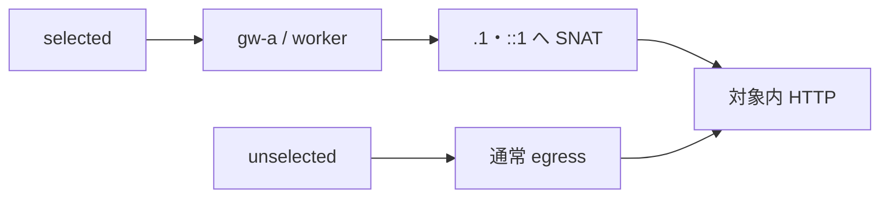

**端末 B：変更内容を確認して適用する。** cluster-scoped の Policy 2 個で、対象を
`egress-probe` 内の selected label に絞り、IPv4／IPv6 ごとに `gw-a` と対応する Egress IP を指定する。
`gw-a` と `gw-b` は同じ Policy 名の別 profile であり、両方を続けて apply しない。

```bash
(
  set -euo pipefail
  kubectl --context "${KUBE_CONTEXT}" apply --dry-run=server -k "${EG_ROOT}/gw-a"
  kubectl --context "${KUBE_CONTEXT}" diff -k "${EG_ROOT}/gw-a" > "${EG_DIR}/gw-a.diff" || test "$?" -eq 1
  cat "${EG_DIR}/gw-a.diff"
)
```

差分を確認した後、適用する。

```bash
(
  set -euo pipefail
  kubectl --context "${KUBE_CONTEXT}" apply -k "${EG_ROOT}/gw-a"
  kubectl --context "${KUBE_CONTEXT}" get ciliumegressgatewaypolicies egress-probe-ipv4 egress-probe-ipv6 -o yaml > "${EG_DIR}/gw-a-applied.yaml"
  for agent in $(kubectl --context "${KUBE_CONTEXT}" -n kube-system get pods -l k8s-app=cilium -o jsonpath='{.items[*].metadata.name}'); do
    kubectl --context "${KUBE_CONTEXT}" -n kube-system exec "$agent" -c cilium-agent -- cilium-dbg bpf egress list > "${EG_DIR}/${agent}-gw-a-map.log"
    cat "${EG_DIR}/${agent}-gw-a-map.log"
  done
  kubectl --context "${KUBE_CONTEXT}" -n egress-probe get pods -o wide
)
```

選択された Gateway の agent で、map の source が `selected` の Pod IP、destination が対象 CIDR、
Gateway が worker、Egress IP が `172.16.24.1`／`fd21:0:0:24::1` に対応することを確認する。

2026-09-06 の `gw-a` 上の実測例。取得コマンドと出力を続けて示す（Pod 名・Pod IP は作成ごとに変わる）。

```bash
# Gateway worker 上の Cilium Agent を選び、その Agent の map を表示する。
GATEWAY_AGENT="$(kubectl --context "${KUBE_CONTEXT}" -n kube-system get pods \
  -l k8s-app=cilium --field-selector spec.nodeName=adc-k02-worker \
  -o jsonpath='{.items[0].metadata.name}')"
: "${GATEWAY_AGENT:?Gateway 上の Cilium Pod が見つかりません}"
kubectl --context "${KUBE_CONTEXT}" -n kube-system \
  exec "${GATEWAY_AGENT}" -c cilium-agent -- cilium-dbg bpf egress list
```

上記コマンドの出力例：

```text
Source IP             Destination CIDR      Egress IP        Gateway IP      Egress Ifindex
10.202.2.232          172.16.0.1/32         172.16.24.1      Excluded CIDR   0
10.202.2.232          172.16.0.0/24         172.16.24.1      172.18.0.2      0
fd00:10:202:2::2c92   fd21:0:0:1::101/128   fd21:0:0:24::1   Excluded CIDR   0
fd00:10:202:2::2c92   fd21:0:0:1::/64       fd21:0:0:24::1   172.18.0.2      0
```

`172.18.0.2` はこの環境の worker の Node InternalIP、`Egress IP` は外部で観測する SNAT 後の IP。
`Excluded CIDR` は通常 egress を使う除外宛先を表す。今回、Gateway 以外の agent では `Egress IP` が
`0.0.0.0`／`::` だったが、Gateway 欄は同じ worker を指し、外部通信は指定 Egress IP で成功した。
全 agent に同じ `Egress IP` が表示されることを合格条件にせず、Gateway 上の map と外部ログを照合する。
Pod／Policy の反映には遅延がある。該当 entry がまだないときは再取得し、entry 未確認のまま試験合格にしない。

```bash
(
  set -euo pipefail
  log="$(mktemp "${EG_DIR}/gw-a-requests-XXXXXXXX.log")"
  for pod in selected unselected; do
    for dest in 172.16.0.2 '[fd21:0:0:1::102]'; do
      id="${EG_RUN_ID}-gw-a-${pod}-$(date +%s%N)"
      printf '\nid=%s pod=%s dest=%s\n' "$id" "$pod" "$dest"
      kubectl --context "${KUBE_CONTEXT}" -n egress-probe exec "$pod" -c client -- \
        curl --noproxy '*' -gfsS --connect-timeout 3 --max-time 5 \
        -H "X-Lab-Test-ID: $id" -w 'http_code=%{http_code}\n' "http://${dest}:8088/"
    done
  done > "$log" 2>&1
  cat "$log"
)
```

**端末 A：外部サーバの記録を取得し、ID を照合する。**

```bash
(
  set -euo pipefail
  log="$(mktemp "${EG_DIR}/gw-a-access-XXXXXXXX.log")"
  docker exec clab-nxos-fabric-singlesite-adc-t1sv0102 cat "${EG_SERVER_DIR}/access.log" > "$log"
  cat "$log"
)
```

以下は 2026-09-06 の実測ログからの抜粋。試験 ID を HTTP 応答と access log で照合する。

```text
# selected → 対象サーバ IPv4
remote=172.16.24.1 test_id=egress-stage2b-xtu86wy1-gateway-a-selected-1788677294512478321
http_code=200
# selected → 対象サーバ IPv6
remote=fd21:0:0:24::1 test_id=egress-stage2b-xtu86wy1-gateway-a-selected-1788677294965202187
http_code=200
```

IPv6 の圧縮表記は違っても同じアドレスになり得るため、文字列だけで不一致としない。
`selected` だけ指定 Egress IP となり、`unselected` は手順 6 の baseline source を維持すれば
`W-EGRESS-02`／`03` は合格。source Node が worker2、Gateway が worker であることを map・配置・外部ログと
合わせて確認し、`W-EGRESS-05` を判定する。HTTP 200 でも `selected` の送信元が通常 Node IP のままなら不合格。
物理 interface／NX-OS path の厳密な確認は追加の packet capture・counter 測定として分ける。

## 9. 端末 B → A：除外宛先・CIDR 外の確認範囲（W-EGRESS-04）

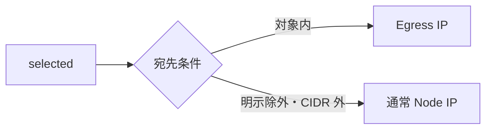

選択対象の Pod でも `adc-t1sv0101` は `excludedCIDRs` に含まれるため通常 egress を使う。
対象外 Pod だけを試験しても除外条件の確認にはならない。

```bash
(
  set -euo pipefail
  log="$(mktemp "${EG_DIR}/excluded-requests-XXXXXXXX.log")"
  for dest in 172.16.0.1 '[fd21:0:0:1::101]'; do
    id="${EG_RUN_ID}-excluded-$(date +%s%N)"
    printf '\nid=%s dest=%s\n' "$id" "$dest"
    kubectl --context "${KUBE_CONTEXT}" -n egress-probe exec selected -c client -- \
      curl --noproxy '*' -gfsS --connect-timeout 3 --max-time 5 \
      -H "X-Lab-Test-ID: $id" -w 'http_code=%{http_code}\n' "http://${dest}:8088/"
  done > "$log" 2>&1
  cat "$log"
)
```

**端末 A：除外宛先の記録を取得する。**

```bash
(
  set -euo pipefail
  log="$(mktemp "${EG_DIR}/excluded-access-XXXXXXXX.log")"
  docker exec clab-nxos-fabric-singlesite-adc-t1sv0101 cat "${EG_SERVER_DIR}/access.log" > "$log"
  cat "$log"
)
```

ID を照合し、HTTP 200、送信元が baseline と同じであれば合格。
**端末 B：CIDR 外の別サーバへ送信する。** `172.16.1.1`／`fd21:0:0:2::101` は対象 CIDR 外であり、
手順 4 で起動した `adc-t1sv0201` を使う。selected／unselected とも通常の worker2 送信元で成功することを確認する。
Policy 未適用の手順 6、gw-b の手順 10、Policy 撤去後の手順 11 にも、同じ宛先の比較コマンドをその場に記載している。ここでは gw-a で実行する。

```bash
(
  set -euo pipefail
  log="$(mktemp "${EG_DIR}/outside-XXXXXXXX.log")"
  for pod in selected unselected; do
    for dest in 172.16.1.1 '[fd21:0:0:2::101]'; do
      id="${EG_RUN_ID}-outside-$(date +%s%N)"
      printf 'pod=%s dest=%s id=%s\n' "$pod" "$dest" "$id"
      kubectl --context "${KUBE_CONTEXT}" -n egress-probe exec "$pod" -c client -- \
        curl --noproxy '*' -gfsS --connect-timeout 3 --max-time 5 \
        -H "X-Lab-Test-ID: $id" -w 'http_code=%{http_code}\n' "http://${dest}:8088/"
    done
  done > "$log" 2>&1
  cat "$log"
  docker exec clab-nxos-fabric-singlesite-adc-t1sv0201 cat "${EG_SERVER_DIR}/access.log" > "$log.access"
  cat "$log.access"
)
```

HTTP 200、同じ ID の access log、通常送信元を照合する。IPv4 は `172.16.4.22`、IPv6 は `fd21::4:0:0:2:2`。
[2026-09-06 の CIDR 外の実測](../../nxos_singlesite/operations/cilium-lab/2026-09-06/adc-k02/egress-cidr-outside-result.md) もこの比較条件で判定した。

## 10. 端末 B → A：gw-b へ計画切替（W-EGRESS-09）

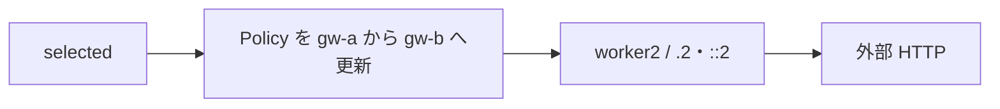

変更は Policy 2 個の `nodeSelector` と `egressIP`。worker2 の `172.16.24.2`／`fd21:0:0:24::2` へ切り替える。
自動 HA 試験ではなく、明示的な profile 更新後の新規接続を確認する。IPv4／IPv6 の 2 resource の更新は原子的ではない。

```bash
(
  set -euo pipefail
  kubectl --context "${KUBE_CONTEXT}" diff -k "${EG_ROOT}/gw-b" > "${EG_DIR}/gw-b.diff" || test "$?" -eq 1
  cat "${EG_DIR}/gw-b.diff"
)
```

差分確認後、切替時刻を記録して apply する。

```bash
(
  set -euo pipefail
  date -u +'%Y-%m-%dT%H:%M:%SZ' > "${EG_DIR}/gw-b-switch.time"
  kubectl --context "${KUBE_CONTEXT}" apply -k "${EG_ROOT}/gw-b"
  for agent in $(kubectl --context "${KUBE_CONTEXT}" -n kube-system get pods -l k8s-app=cilium -o jsonpath='{.items[*].metadata.name}'); do
    kubectl --context "${KUBE_CONTEXT}" -n kube-system exec "$agent" -c cilium-agent -- cilium-dbg bpf egress list > "${EG_DIR}/${agent}-gw-b-map.log"
    cat "${EG_DIR}/${agent}-gw-b-map.log"
  done
  log="$(mktemp "${EG_DIR}/gw-b-requests-XXXXXXXX.log")"
  for pod in selected unselected; do
    for dest in 172.16.0.2 '[fd21:0:0:1::102]' 172.16.0.1 '[fd21:0:0:1::101]' 172.16.1.1 '[fd21:0:0:2::101]'; do
      id="${EG_RUN_ID}-gw-b-${pod}-$(date +%s%N)"
      printf '\nid=%s pod=%s dest=%s\n' "$id" "$pod" "$dest"
      kubectl --context "${KUBE_CONTEXT}" -n egress-probe exec "$pod" -c client -- \
        curl --noproxy '*' -gfsS --connect-timeout 3 --max-time 5 \
        -H "X-Lab-Test-ID: $id" -w 'http_code=%{http_code}\n' "http://${dest}:8088/"
    done
  done > "$log" 2>&1
  cat "$log"
)
```

**端末 A：切替後の外部ログを取得する。**

```bash
(
  set -euo pipefail
  log="$(mktemp "${EG_DIR}/gw-b-access-XXXXXXXX.log")"
  for server in adc-t1sv0102 adc-t1sv0101 adc-t1sv0201; do
    docker exec "clab-nxos-fabric-singlesite-$server" cat "${EG_SERVER_DIR}/access.log"
  done > "$log"
  cat "$log"
)
```

全 12 件の ID を照合し、対象内の selected は `172.16.24.2`／`fd21:0:0:24::2`、明示除外・CIDR 外と unselected は baseline、いずれも HTTP 200 を確認する。
切替直後の未反映を含め、最初に新 Egress IP で成功した時刻を保存する。
この短い HTTP 試験で確認できるのは新規接続。既存の長時間接続が維持された、無停止で切り替わったとは判定しない。

## 11. Policy・BGP 広報の撤去と証跡の確定（W-EGRESS-08／14）

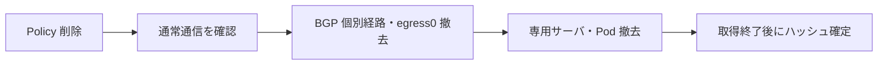

**端末 B：今回の Policy 2 個だけを削除する。** `gw-a`／`gw-b` で名前が同じなので削除は 1 回。
Namespace や Cilium 自体はこの段階では削除しない。

```bash
(
  set -euo pipefail
  kubectl --context "${KUBE_CONTEXT}" delete ciliumegressgatewaypolicy \
    egress-probe-ipv4 egress-probe-ipv6 --ignore-not-found
  kubectl --context "${KUBE_CONTEXT}" get ciliumegressgatewaypolicies -o yaml > "${EG_DIR}/egress-policies-after.yaml"
  sleep 6
  log="$(mktemp "${EG_DIR}/rollback-requests-XXXXXXXX.log")"
  for pod in selected unselected; do
    for dest in 172.16.0.2 '[fd21:0:0:1::102]' 172.16.0.1 '[fd21:0:0:1::101]' 172.16.1.1 '[fd21:0:0:2::101]'; do
      id="${EG_RUN_ID}-rollback-${pod}-$(date +%s%N)"
      printf '\nid=%s pod=%s dest=%s\n' "$id" "$pod" "$dest"
      kubectl --context "${KUBE_CONTEXT}" -n egress-probe exec "$pod" -c client -- \
        curl --noproxy '*' -gfsS --connect-timeout 3 --max-time 5 \
        -H "X-Lab-Test-ID: $id" -w 'http_code=%{http_code}\n' "http://${dest}:8088/"
    done
  done > "$log" 2>&1
  cat "$log"
  cilium status --context "${KUBE_CONTEXT}" > "${EG_DIR}/cilium-after.log"
  cilium bgp peers --context "${KUBE_CONTEXT}" > "${EG_DIR}/bgp-after.log"
  kubectl --context "${KUBE_CONTEXT}" -n kube-system get configmap cilium-config -o json > "${EG_DIR}/config-after.json"
  kubectl --context "${KUBE_CONTEXT}" -n kube-system get pods -l k8s-app=cilium -o json > "${EG_DIR}/agents-after.json"
  for agent in $(jq -r '.items[].metadata.name' "${EG_DIR}/agents-after.json"); do
    kubectl --context "${KUBE_CONTEXT}" -n kube-system exec "$agent" -c cilium-agent -- cilium-dbg bpf egress list > "${EG_DIR}/${agent}-egress-after.log"
    kubectl --context "${KUBE_CONTEXT}" -n kube-system exec "$agent" -c cilium-agent -- cilium-dbg bpf metrics list > "${EG_DIR}/${agent}-metrics-after.log"
  done
)
```

両 Pod の HTTP と source が baseline に戻ること、今回の map entry がなくなること、BGP session と
Cilium health が維持されることを確認する。再起動数と drop は前後差分で比較する。
LB／BGP の外部通信回帰は [Stage 2A 手順](../../nxos_singlesite/k8s_kind/k02/cilium/manifests/validation/lab-smoke/README.md)
の既存 Service を使って別途確認し、BGP session 確認だけで VIP 通信まで合格としない。

**端末 A：ログを保存して専用 nginx を終了する。** 他用途の nginx やサーバコンテナは停止しない。

```bash
(
  set -euo pipefail
  for server in adc-t1sv0102 adc-t1sv0101 adc-t1sv0201; do
    container="clab-nxos-fabric-singlesite-${server}"
    docker exec "$container" cat "${EG_SERVER_DIR}/access.log" > "${EG_DIR}/${server}-access-final.log"
    docker exec "$container" cat "${EG_SERVER_DIR}/nginx.conf" > "${EG_DIR}/${server}-nginx.conf"
    docker exec "$container" nginx -c "${EG_SERVER_DIR}/nginx.conf" -s quit
    sleep 1
    docker exec "$container" ss -lntp > "${EG_DIR}/${server}-listeners-after.log"
    cat "${EG_DIR}/${server}-listeners-after.log"
  done
)
```

TCP `8088` の待受がなくなったことを確認する。

**端末 B：BGP 個別広報を停止する。** 手順 7 の事前記録で今回新規に作成した 2 resource であることを確認して削除する。
Policy の削除だけでは個別経路は消えない。広報を止めてから IP を撤去する。

```bash
(
  set -euo pipefail
  kubectl --context "${KUBE_CONTEXT}" delete -k "${EG_ROOT}/bgp"
  cilium bgp routes advertised ipv4 unicast --context "${KUBE_CONTEXT}" > "${EG_DIR}/withdraw-advertised4.log"
  cilium bgp routes advertised ipv6 unicast --context "${KUBE_CONTEXT}" > "${EG_DIR}/withdraw-advertised6.log"
  cat "${EG_DIR}/withdraw-advertised4.log" "${EG_DIR}/withdraw-advertised6.log"
)
```

**端末 A：経路撤回を確認する。** 両 BGR と外部サーバ収容 Leaf で実行し、結果を保存する。

```text
show ip route 172.16.24.1/32 vrf tenant1-vpc1
show ip route 172.16.24.2/32 vrf tenant1-vpc1
show ipv6 route fd21:0:0:24::1/128 vrf tenant1-vpc1
show ipv6 route fd21:0:0:24::2/128 vrf tenant1-vpc1
show ip route 172.16.14.0/26 vrf tenant1-vpc1
show ipv6 route fd21:0:0:14:0:0:1:0/112 vrf tenant1-vpc1
```

Egress の個別経路と `/24`・`/64` 集約は消え、既存 LB 集約が維持されること。集約は手順 7 と同じ route コマンドで確認する。経路の反映に時間がかかる場合は同じコマンドを再実行し、
撤回を確認した時刻を記録する。default／summary route が表示される場合も、その prefix を見て個別経路と区別する。

**端末 B：今回作成した dummy interface を撤去する。** script は `egress0` の所有 marker と IP を再確認して削除する。
事前から存在した interface はこの一括撤去の対象にしない。

```bash
(
  set -euo pipefail
  bash "${REPO_ROOT}/nxos_fabric/scripts/cilium-lab/configure-egress-gateway-addresses.sh" \
    --cluster adc-k02 --action remove > "${EG_DIR}/egress-address-remove.log" 2>&1
  cat "${EG_DIR}/egress-address-remove.log"
  kubectl --context "${KUBE_CONTEXT}" -n egress-probe delete pod selected unselected --ignore-not-found
  cilium status --context "${KUBE_CONTEXT}" > "${EG_DIR}/cilium-final.log"
  cilium bgp peers --context "${KUBE_CONTEXT}" > "${EG_DIR}/bgp-final.log"
)
```

期待値は両 Node の `egress0 absent=true`。既存の Fabric IP と interface は維持する。
端末 A は NX-OS の常設設定を残し、BGP と LB の経路を再確認する。`-rollback.cfg` は基盤設定そのものを撤去する場合専用で、通常の試験後片付けでは使わない。

**端末 B：同じ LB VIP の HTTP を再確認する。** 手順 3 と同じ外部サーバから実施する。

```bash
(
  set -euo pipefail
  phase="after"
  kubectl --context "${KUBE_CONTEXT}" -n cilium-lab-smoke get service \
    lab-smoke-lb-cluster lab-smoke-lb-local -o json > "${EG_DIR}/lb-${phase}.json"
  jq -e '[.items[] | ([.status.loadBalancer.ingress[]?.ip] | length)] | length == 2 and all(. == 2)' \
    "${EG_DIR}/lb-${phase}.json"
  log="${EG_DIR}/lb-${phase}-http.log"
  while IFS=$'\t' read -r service vip; do
    dest="$vip"
    [[ "$vip" != *:* ]] || dest="[$vip]"
    printf '\nservice=%s vip=%s\n' "$service" "$vip"
    docker exec clab-nxos-fabric-singlesite-adc-t1sv0102 \
      curl --noproxy '*' -gfsS --connect-timeout 3 --max-time 5 \
      -w 'http_code=%{http_code}\n' "http://${dest}:80/"
  done < <(jq -r '.items[] | .metadata.name as $name | .status.loadBalancer.ingress[] | [$name, .ip] | @tsv' \
    "${EG_DIR}/lb-${phase}.json") > "$log" 2>&1
  cat "$log"
)
```

```bash
(
  set -euo pipefail
  for phase in before after; do
    jq -S '[.items[] | {name: .metadata.name, ips: ([.status.loadBalancer.ingress[]?.ip] | sort)}] | sort_by(.name)' \
      "${EG_DIR}/lb-${phase}.json" > "${EG_DIR}/lb-${phase}-destinations.json"
  done
  diff -u "${EG_DIR}/lb-before-destinations.json" "${EG_DIR}/lb-after-destinations.json"
)
```

VIP の比較に差分がなく、HTTP 4 件が成功し、Egress 個別経路の撤回・LB 経路維持も確認できれば `W-EGRESS-14` は合格。
VIP が変わった場合は同一宛先の回帰確認にならないため、変更理由を調べて再確認する。

**端末 B：今回の Namespace を削除する。** 12.1 は専用 Namespace がない状態から始めるため、基本試験のものを保持しない。
UID を照合し、今回の Pod 撤去後に resource が残っていれば用途を確認してから進む。

```bash
(
  set -euo pipefail
  current="$(kubectl --context "$KUBE_CONTEXT" get ns egress-probe -o jsonpath='{.metadata.uid}')"
  test "$current" = "$(jq -r '.metadata.uid' "$EG_DIR/namespace-created.json")"
  kubectl --context "$KUBE_CONTEXT" -n egress-probe get all -o json > "$EG_DIR/namespace-final-resources.json"
  jq -e '.items | length == 0' "$EG_DIR/namespace-final-resources.json"
  kubectl --context "$KUBE_CONTEXT" delete ns egress-probe --timeout=120s
)
```

最後に端末 A のログ保存まで終わってから、**端末 B** でハッシュを確定する。

```bash
(
  set -euo pipefail
  cd "${EG_DIR}"
  find . -type f ! -name SHA256SUMS -print0 | sort -z | xargs -0 sha256sum > SHA256SUMS
  sha256sum -c SHA256SUMS
)
printf 'evidence=%s\n' "${EG_DIR}"
```

`SHA256SUMS` はこのディレクトリを基準とする相対パス。ローカルへの転送後も同じディレクトリで
`sha256sum -c SHA256SUMS` を実行する。ログ追加・更新後は再確定する。

## 12. 追加試験の実施条件と残す判定

次の項目は基本試験と分離する。12.1〜12.4 は異常系、12.5〜12.10 は新規 Pod・計画切替・MTU 境界の独立した試験枠である。Node 障害・復旧は今回スキップする。

| Test ID | 実施前に具体化する内容 | 記録する結果 |
|---|---|---|
| `W-EGRESS-06` | Policy 適用中に新しい selected Pod を作成し、コンテナ開始直後から時刻付き HTTP を繰り返す。Ready 待ち後の curl だけでは初期遅延を測れない。 | Pod 起動時刻、最初の通信、初めて指定 Egress IP になった時刻、反映前の source。 |
| `W-EGRESS-07`／`10` | active Gateway を worker に戻し、送信 Pod は worker2 に保持。対象 Node の停止・起動操作を明示して実施する。両 Node を同時停止しない。 | 既存の長時間接続、新規接続、blackhole／drop、障害検知時刻。 |
| `W-EGRESS-11` | Gateway 停止後に生存中の `gw-b` を明示選択する。復旧後は Node Ready、Egress IP、BGP を確認する。 | 手動切替時刻と新 Egress IP で最初に成功した時刻。 |
| `W-EGRESS-12` | 通常の Node label を変更せず、試験 Policy の nodeSelector だけを存在しない Gateway label に変える。元の Policy を即復旧できるよう保存する。 | 対象通信の drop 理由、対象外 Pod の継続、元 profile 復元後の成功。 |

停止試験用の連続通信・packet capture と復旧コマンドは、停止する Node と実施枠を確定してから追加する。
Node 停止は、対象と操作を明示した実施枠で行う。
複数 Gateway の自動選択機能の可否と、本ラボで選んだ `gw-a`／`gw-b` 手動切替は別の設計事項である。

### 12.1 異常系 2 ケースの共通準備

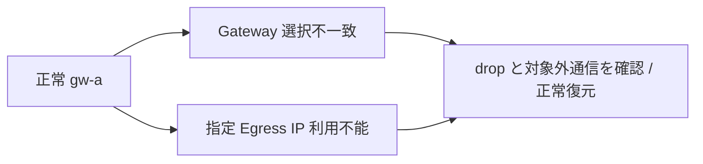

`W-EGRESS-12A` は Gateway 選択不一致、`W-EGRESS-12B` は選択した Gateway 上での Egress IP 利用不能を確認する。
従来の `W-EGRESS-12` を詳しく分けた lab 内の Test ID である。
2026-09-06 の実機結果は両ケース合格。以下の出力例はその実測に基づく。Node の停止や NIC の IP 削除は行わず、試験 Policy だけを変更する。

[公式の Gateway 選択・IP 設定仕様](https://docs.cilium.io/en/stable/network/egress-gateway/egress-gateway/#selecting-and-configuring-the-gateway-node) は、Gateway 選択不能時の drop と、指定 IP が Gateway に存在しない場合の `No Egress IP configured` を説明している。
正常 → 異常 → 正常へ戻す順に実施し、異常な Policy を残して次の試験へ進まない。

**前提となる正常構成：** `egress-probe` の selected／unselected は worker2、Gateway は worker。
両 worker の専用 IP／BGP 広報と、外部 3 台の TCP `8088` の今回専用 nginx を準備する。
一時リソースを撤去済みの場合は再準備が必要。実際の single-site の構成と一括実行記録は [異常系試験結果](../../nxos_singlesite/operations/cilium-lab/2026-09-06/adc-k02/egress-invalid-result.md) に保存する。

**端末 B：保存先と正常構成を準備する。** `REPO_ROOT`／`KUBE_CONTEXT`／`EVIDENCE_DIR` は実行環境の値を設定済みとする。
以下は既存の試験 resource を流用・上書きせず、新しい試験枠として始める場合のコマンド。

```bash
(
  set -euo pipefail
  : "${REPO_ROOT:?}" "${KUBE_CONTEXT:?}" "${EVIDENCE_DIR:?}"
  EG_ROOT="${REPO_ROOT}/nxos_fabric/nxos_singlesite/k8s_kind/k02/cilium/manifests/validation/egress"
  mkdir -p "${EVIDENCE_DIR}/raw"
  FAILURE_DIR="$(mktemp -d "${EVIDENCE_DIR}/raw/egress-invalid-XXXXXXXX")"
  printf 'FAILURE_DIR=%s\n' "${FAILURE_DIR}"
  printf 'export FAILURE_DIR=%q\n' "$FAILURE_DIR" > "$FABRIC_ROOT/operations/cilium-lab/egress-invalid-current.env"
  kubectl --context "${KUBE_CONTEXT}" get ciliumegressgatewaypolicies -o json > "${FAILURE_DIR}/policies-before.json"
  jq -e '.items | length == 0' "${FAILURE_DIR}/policies-before.json"
  test -z "$(kubectl --context "${KUBE_CONTEXT}" get ns egress-probe --ignore-not-found -o name)"
  kubectl --context "${KUBE_CONTEXT}" get ciliumbgpadvertisements -o json > "${FAILURE_DIR}/ads-before.json"
  jq -e '[.items[] | select(.metadata.name | startswith("k02-egress"))] | length == 0' "${FAILURE_DIR}/ads-before.json"
  for node in adc-k02-worker adc-k02-worker2; do
    docker exec "$node" ip -j addr > "${FAILURE_DIR}/${node}-addresses.json"
    jq -e 'all(.[]; .ifname != "egress0")' "${FAILURE_DIR}/${node}-addresses.json"
  done
  for part in base bgp gw-a; do
    kubectl --context "${KUBE_CONTEXT}" kustomize "${EG_ROOT}/${part}" > "${FAILURE_DIR}/${part}.yaml"
  done
  kubectl --context "${KUBE_CONTEXT}" apply -k "${EG_ROOT}/base"
  kubectl --context "${KUBE_CONTEXT}" -n egress-probe wait --for=condition=Ready pod --all --timeout=120s
  bash "${REPO_ROOT}/nxos_fabric/scripts/cilium-lab/configure-egress-gateway-addresses.sh" --cluster adc-k02 --action apply
  kubectl --context "${KUBE_CONTEXT}" apply -k "${EG_ROOT}/bgp"
  kubectl --context "${KUBE_CONTEXT}" apply -k "${EG_ROOT}/gw-a"
)
```

以降は **両端末で**、表示された同じ保存先を設定する。`mktemp` を端末 A で再実行しない。

```bash
source "${FABRIC_ROOT}/operations/cilium-lab/egress-invalid-current.env"
: "${KUBE_CONTEXT:?}" "${FAILURE_DIR:?}"
test -d "${FAILURE_DIR}"
```

**端末 B：比較用 HTTP サーバを起動する。** 同じ tenant の対象内・明示除外・CIDR 外で、送信元と request ID を記録する。
既存 TCP `8088` があれば、そのサーバを停止せず準備を中断する。下記は各サーバの Fabric IP だけに待ち受ける。

```bash
(
  set -euo pipefail
  : "${FAILURE_DIR:?}"
  session="$(basename "${FAILURE_DIR}")"
  for server in adc-t1sv0102 adc-t1sv0101 adc-t1sv0201; do
    container="clab-nxos-fabric-singlesite-${server}"
    docker exec "$container" ss -lntp > "${FAILURE_DIR}/${server}-listen-before.log"
    if grep -q ':8088 ' "${FAILURE_DIR}/${server}-listen-before.log"; then
      echo "${server}: TCP 8088 は使用中です" >&2; exit 1
    fi
  done
  while read -r server ip4 ip6; do
    config="${FAILURE_DIR}/${server}-nginx.conf"
    cat > "$config" <<EOF
worker_processes 1;
pid /tmp/${session}/nginx.pid;
error_log /tmp/${session}/error.log;
events { worker_connections 128; }
http {
 log_format lab '\$time_iso8601 remote=\$remote_addr status=\$status test_id=\$http_x_lab_test_id';
 access_log /tmp/${session}/access.log lab;
 server { listen ${ip4}:8088; listen [${ip6}]:8088;
 location / { default_type text/plain; return 200 "remote=\$remote_addr test_id=\$http_x_lab_test_id\\n"; }
 }
}
EOF
    container="clab-nxos-fabric-singlesite-${server}"
    docker exec "$container" mkdir -p "/tmp/${session}"
    docker exec -i "$container" sh -c 'cat > "$1"' sh "/tmp/${session}/nginx.conf" < "$config"
    docker exec "$container" nginx -t -c "/tmp/${session}/nginx.conf"
    docker exec "$container" nginx -c "/tmp/${session}/nginx.conf"
  done <<'SERVERS'
adc-t1sv0102 172.16.0.2 fd21:0:0:1::102
adc-t1sv0101 172.16.0.1 fd21:0:0:1::101
adc-t1sv0201 172.16.1.1 fd21:0:0:2::101
SERVERS
)
```

**端末 B：正常 Policy を保存し、比較用通信コマンドを作る。** `requests.sh` は毎回、新しい curl 接続と固有 ID を使う。
成功／失敗をそのまま保存し、curl の非 0 終了を試験スクリプト全体の成功に読み替えない。
source port も固定・記録し、Hubble と同じ接続を照合する。同じ CASE の即時再実行では port 再利用が失敗することがあるため、失敗理由を確認して新しい未使用範囲へ変更する。

```bash
(
  set -euo pipefail
  : "${KUBE_CONTEXT:?}" "${FAILURE_DIR:?}"
  for family in ipv4 ipv6; do
    kubectl --context "${KUBE_CONTEXT}" get ciliumegressgatewaypolicy "egress-probe-${family}" -o json > "${FAILURE_DIR}/normal-${family}.json"
  done
  cat > "${FAILURE_DIR}/requests.sh" <<'SH'
#!/usr/bin/env bash
set -u
: "${KUBE_CONTEXT:?}" "${FAILURE_DIR:?}" "${CASE:?}"
mkdir -p "${FAILURE_DIR}/${CASE}"
date -u +'%Y-%m-%dT%H:%M:%SZ' > "${FAILURE_DIR}/${CASE}/start.time"
case "$CASE" in
  normal) port=49100 ;; no-gateway) port=49300 ;;
  no-egress-ip) port=49400 ;; restored-gateway) port=49500 ;;
  restored-ip) port=49600 ;; removed) port=49700 ;;
  *) echo "未知の CASE: $CASE" >&2; exit 1 ;;
esac
for pod in selected unselected; do
  for dest in 172.16.0.2 '[fd21:0:0:1::102]' 172.16.0.1 '[fd21:0:0:1::101]' 172.16.1.1 '[fd21:0:0:2::101]'; do
    id="${CASE}-${pod}-$(date +%s%N)"
    (
      printf 'id=%s pod=%s destination=%s source_port=%s\n' "$id" "$pod" "$dest" "$port"
      kubectl --context "${KUBE_CONTEXT}" -n egress-probe exec "$pod" -c client -- \
        curl --noproxy '*' -gfsS --connect-timeout 3 --max-time 5 --local-port "$port" \
        -H "X-Lab-Test-ID: ${id}" -w 'http_code=%{http_code}\n' "http://${dest}:8088/"
      printf 'request_exit=%s\n' "$?"
    ) > "${FAILURE_DIR}/${CASE}/${id}.log" 2>&1
    port=$((port + 1))
  done
done
cat "${FAILURE_DIR}/${CASE}"/*.log
SH
)
export CASE=normal
bash "${FAILURE_DIR}/requests.sh"
```

正常時は 12 件すべて HTTP 200。selected → 対象内だけが `172.16.24.1`／`fd21:0:0:24::1`、その他は worker2 の通常送信元である。
**ここで失敗している場合は異常系へ進まない。** Policy の反映を map と実通信で確認する。

**端末 A：Hubble の取得経路を用意する。** この port-forward は端末 A 内でのみ PID を管理する。使い終わったら終了する。

```bash
: "${KUBE_CONTEXT:?}" "${FAILURE_DIR:?}"
kubectl --context "${KUBE_CONTEXT}" -n kube-system port-forward \
  --address 127.0.0.1 service/hubble-relay 19445:80 \
  > "${FAILURE_DIR}/relay.log" 2>&1 &
export FAILURE_PF_PID=$!
sleep 2
kill -0 "${FAILURE_PF_PID}" && hubble status --server 127.0.0.1:19445
```

### 12.2 W-EGRESS-12A：Gateway 選択不一致

**目的：** 一致する Gateway がない場合、selected の対象内通信が通常 egress へ逃げずに拒否されることを確認する。
変更するのは Policy の Gateway 用 `nodeSelector` だけ。Pod selector、宛先、除外条件、Egress IP、Node label は維持する。

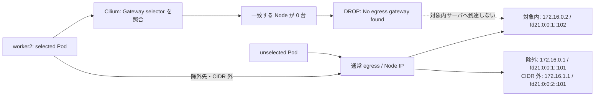

**端末 B：選択不一致に変更する。** 毎回生成する hostname 値に一致する Node が 0 台であることを先に確認する。

```bash
(
  set -euo pipefail
  : "${KUBE_CONTEXT:?}" "${FAILURE_DIR:?}"
  missing="egress-invalid-$(basename "${FAILURE_DIR}")"
  kubectl --context "${KUBE_CONTEXT}" get nodes -l "kubernetes.io/hostname=${missing}" -o json > "${FAILURE_DIR}/unmatched-nodes.json"
  jq -e '.items | length == 0' "${FAILURE_DIR}/unmatched-nodes.json"
  jq -n --arg value "$missing" '[{op:"replace",path:"/spec/egressGateway/nodeSelector",value:{matchLabels:{"kubernetes.io/hostname":$value}}}]' > "${FAILURE_DIR}/no-gateway-patch.json"
  cat "${FAILURE_DIR}/no-gateway-patch.json"
  for family in ipv4 ipv6; do
    kubectl --context "${KUBE_CONTEXT}" patch ciliumegressgatewaypolicy "egress-probe-${family}" \
      --type=json --patch-file "${FAILURE_DIR}/no-gateway-patch.json" --dry-run=server
    kubectl --context "${KUBE_CONTEXT}" patch ciliumegressgatewaypolicy "egress-probe-${family}" \
      --type=json --patch-file "${FAILURE_DIR}/no-gateway-patch.json"
  done
)
sleep 8
export CASE=no-gateway
bash "${FAILURE_DIR}/requests.sh"
```

**端末 A：対象通信の drop と非到達を確認する。** 端末 B の通信が終わった直後に実施し、Hubble の保存期間内に取得する。

```bash
export CASE=no-gateway
: "${KUBE_CONTEXT:?}" "${FAILURE_DIR:?}"
kubectl --context "${KUBE_CONTEXT}" -n egress-probe get pods -o wide | tee "${FAILURE_DIR}/${CASE}/pods.log"
kubectl --context "${KUBE_CONTEXT}" -n kube-system get pods -l k8s-app=cilium -o json > "${FAILURE_DIR}/${CASE}/agents.json"
for agent in $(jq -r '.items[].metadata.name' "${FAILURE_DIR}/${CASE}/agents.json"); do
  kubectl --context "${KUBE_CONTEXT}" -n kube-system exec "$agent" -c cilium-agent --     cilium-dbg bpf egress list > "${FAILURE_DIR}/${CASE}/${agent}-map.log"
done
hubble observe --server 127.0.0.1:19445 \
  --since "$(cat "${FAILURE_DIR}/${CASE}/start.time")" -o json \
  > "${FAILURE_DIR}/${CASE}/flows.jsonl" 2> "${FAILURE_DIR}/${CASE}/flows.stderr.log"
jq -c '(.flow // .) | select(.verdict == "DROPPED") |
  {time, node_name, source: .IP.source, destination: .IP.destination,
   tcp: .l4.TCP, reason: .drop_reason, description: .drop_reason_desc}' \
  "${FAILURE_DIR}/${CASE}/flows.jsonl"
for server in adc-t1sv0102 adc-t1sv0101 adc-t1sv0201; do
  docker exec "clab-nxos-fabric-singlesite-${server}" \
    cat "/tmp/$(basename "${FAILURE_DIR}")/access.log" > "${FAILURE_DIR}/${CASE}/${server}-access.log"
done
```

実測出力例（2026-09-06、上の jq と同じ項目の抜粋）：

```json
{"time":"2026-09-06T14:16:10.440717912Z","node_name":"adc-k02/adc-k02-worker2","source":"10.202.2.172","destination":"172.16.0.2","tcp":{"source_port":49300,"destination_port":8088,"flags":{"SYN":true}},"reason":194,"description":"NO_EGRESS_GATEWAY"}
```

source Pod のある worker2 で、対象サーバへ向かう TCP SYN が Gateway 選択不能により drop されたことを表す。
同じ接続に前段の `FORWARDED` も記録される場合があるが、後段の drop があるため外部への到達成功とは判断しない。
Pod IP と source port は実行ごとに変わるため、表示例の値を固定の判定条件にしない。

判定は次の 4 点をそろえる。背景通信の drop だけを根拠にしない。

- selected → 対象内の IPv4／IPv6 が失敗し、HTTP 応答を受けていない。
- 同じ時刻・source Pod IP・宛先 IP／port の drop があり、理由が `No egress gateway found`（数値 `194`）に対応する。
- 対象内サーバにそのリクエストの ID がない。**access log がないだけでは drop の証明にしない。**
- unselected → 対象内、selected → 除外先／CIDR 外は HTTP 200 で、baseline の送信元を維持する。

**端末 B：正常 Gateway に戻し、新しい接続で復旧を確認する。** 次の IP 利用不能試験の前に必ず成功を確認する。

```bash
(
  set -euo pipefail
  for family in ipv4 ipv6; do
    jq '[{op:"replace",path:"/spec/egressGateway",value:.spec.egressGateway}]' \
      "${FAILURE_DIR}/normal-${family}.json" > "${FAILURE_DIR}/restore-${family}.json"
    kubectl --context "${KUBE_CONTEXT}" patch ciliumegressgatewaypolicy "egress-probe-${family}" \
      --type=json --patch-file "${FAILURE_DIR}/restore-${family}.json"
  done
)
sleep 6
export CASE=restored-gateway
bash "${FAILURE_DIR}/requests.sh"
```

正常時と同じ送信元で 12 件成功すれば復旧確認が完了する。

### 12.3 W-EGRESS-12B：Gateway 上で Egress IP が利用不能

**目的：** Gateway は選べるが指定 SNAT IP がその Node に存在しない場合、対象通信が拒否されることを確認する。
Gateway は worker のまま、`egressIP` だけを未割当の `172.16.24.254`／`fd21:0:0:24::fe` に変更する。
これらを NIC に追加したり BGP 広報したりしない。正常な `.1`／`::1` の割当と広報は維持する。

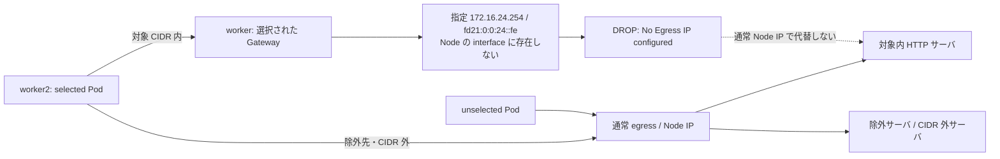

**端末 B：IP 未割当を確認して、Policy だけ変更する。** 別環境ではアドレス台帳も照合する。

```bash
(
  set -euo pipefail
  for node in adc-k02-control-plane adc-k02-worker adc-k02-worker2; do
    docker exec "$node" ip -j addr > "${FAILURE_DIR}/${node}-invalid-ip-check.json"
    jq -e '[.[].addr_info[].local | select(. == "172.16.24.254" or . == "fd21:0:0:24::fe")] | length == 0' \
      "${FAILURE_DIR}/${node}-invalid-ip-check.json"
  done
  for family in ipv4 ipv6; do
    ip=172.16.24.254
    [ "$family" = ipv4 ] || ip=fd21:0:0:24::fe
    jq -n --arg ip "$ip" '[{op:"replace",path:"/spec/egressGateway/egressIP",value:$ip}]' > "${FAILURE_DIR}/invalid-ip-${family}.json"
    kubectl --context "${KUBE_CONTEXT}" patch ciliumegressgatewaypolicy "egress-probe-${family}" \
      --type=json --patch-file "${FAILURE_DIR}/invalid-ip-${family}.json" --dry-run=server
    kubectl --context "${KUBE_CONTEXT}" patch ciliumegressgatewaypolicy "egress-probe-${family}" \
      --type=json --patch-file "${FAILURE_DIR}/invalid-ip-${family}.json"
  done
)
sleep 8
export CASE=no-egress-ip
bash "${FAILURE_DIR}/requests.sh"
```

**端末 A：Gateway 側の drop を確認する。** source Node での選択不一致と区別して、観測 Node も読む。

```bash
export CASE=no-egress-ip
: "${KUBE_CONTEXT:?}" "${FAILURE_DIR:?}"
kubectl --context "${KUBE_CONTEXT}" -n egress-probe get pods -o wide | tee "${FAILURE_DIR}/${CASE}/pods.log"
kubectl --context "${KUBE_CONTEXT}" -n kube-system get pods -l k8s-app=cilium -o json > "${FAILURE_DIR}/${CASE}/agents.json"
for agent in $(jq -r '.items[].metadata.name' "${FAILURE_DIR}/${CASE}/agents.json"); do
  kubectl --context "${KUBE_CONTEXT}" -n kube-system exec "$agent" -c cilium-agent --     cilium-dbg bpf egress list > "${FAILURE_DIR}/${CASE}/${agent}-map.log"
done
hubble observe --server 127.0.0.1:19445 \
  --since "$(cat "${FAILURE_DIR}/${CASE}/start.time")" -o json \
  > "${FAILURE_DIR}/${CASE}/flows.jsonl" 2> "${FAILURE_DIR}/${CASE}/flows.stderr.log"
jq -c '(.flow // .) | select(.verdict == "DROPPED") |
  {time, node_name, source: .IP.source, destination: .IP.destination,
   tcp: .l4.TCP, reason: .drop_reason, description: .drop_reason_desc}' \
  "${FAILURE_DIR}/${CASE}/flows.jsonl"
for server in adc-t1sv0102 adc-t1sv0101 adc-t1sv0201; do
  docker exec "clab-nxos-fabric-singlesite-${server}" \
    cat "/tmp/$(basename "${FAILURE_DIR}")/access.log" > "${FAILURE_DIR}/${CASE}/${server}-access.log"
done
```

実測出力例（2026-09-06）：

```json
{"time":"2026-09-06T14:17:01.425530363Z","node_name":"adc-k02/adc-k02-worker","source":"10.202.2.172","destination":"172.16.0.2","tcp":{"source_port":49400,"destination_port":8088,"flags":{"SYN":true}},"reason":204,"description":"DROP_NO_EGRESS_IP"}
```

今回は selected Pod のある worker2 ではなく、Gateway として選択された worker で drop している。
Gateway の選択までは成立したが、指定 IP を SNAT に使えないことを示す。IPv6 でも同じ理由を確認した。

selected → 対象内の失敗に対応する `No Egress IP configured`（数値 `204`）と、サーバ非到達を確認する。
対象外 Pod・除外先・CIDR 外の通信は成功する。curl の失敗だけ、または agent の設定警告だけでは合格にしない。

**端末 B：正常 IP へ復旧し、比較通信をやり直す。** 正常 Policy の Gateway 設定を丸ごと復元するので、selector の取り残しも防ぐ。

```bash
(
  set -euo pipefail
  for family in ipv4 ipv6; do
    jq '[{op:"replace",path:"/spec/egressGateway",value:.spec.egressGateway}]' \
      "${FAILURE_DIR}/normal-${family}.json" > "${FAILURE_DIR}/restore-${family}.json"
    kubectl --context "${KUBE_CONTEXT}" patch ciliumegressgatewaypolicy "egress-probe-${family}" \
      --type=json --patch-file "${FAILURE_DIR}/restore-${family}.json"
  done
)
sleep 6
export CASE=restored-ip
bash "${FAILURE_DIR}/requests.sh"
```

12 件成功と正常時の指定送信元を確認する。稼働中 NIC の IP を消した場合の追従性や Node 障害は、この試験には含めない。

### 12.4 異常系試験後の撤去・証跡確定

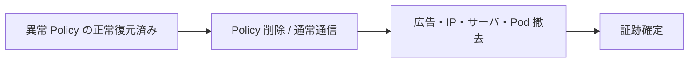

**端末 B：今回準備した Policy を削除し、通常通信への復帰を確認する。**

```bash
(
  set -euo pipefail
  for family in ipv4 ipv6; do
    current="$(kubectl --context "${KUBE_CONTEXT}" get ciliumegressgatewaypolicy "egress-probe-${family}" -o jsonpath='{.metadata.uid}')"
    test "$current" = "$(jq -r '.metadata.uid' "${FAILURE_DIR}/normal-${family}.json")"
    kubectl --context "${KUBE_CONTEXT}" delete ciliumegressgatewaypolicy "egress-probe-${family}" --wait=true
  done
)
sleep 6
export CASE=removed
bash "${FAILURE_DIR}/requests.sh"
```

全件が通常送信元へ戻った後、今回専用の advertisement・IP・サーバを撤去する。

```bash
(
  set -euo pipefail
  kubectl --context "${KUBE_CONTEXT}" delete ciliumbgpadvertisement k02-egress k02-egress-planned-shut
  sleep 12
  cilium bgp routes advertised ipv4 unicast --context "${KUBE_CONTEXT}" > "${FAILURE_DIR}/routes-after-ipv4.log"
  cilium bgp routes advertised ipv6 unicast --context "${KUBE_CONTEXT}" > "${FAILURE_DIR}/routes-after-ipv6.log"
  bash "${REPO_ROOT}/nxos_fabric/scripts/cilium-lab/configure-egress-gateway-addresses.sh" --cluster adc-k02 --action remove
  for server in adc-t1sv0102 adc-t1sv0101 adc-t1sv0201; do
    container="clab-nxos-fabric-singlesite-${server}"
    docker exec "$container" cat "/tmp/$(basename "${FAILURE_DIR}")/access.log" > "${FAILURE_DIR}/${server}-access-final.log"
    docker exec "$container" nginx -c "/tmp/$(basename "${FAILURE_DIR}")/nginx.conf" -s quit
    docker exec "$container" ss -lntp > "${FAILURE_DIR}/${server}-listen-after.log"
  done
  kubectl --context "${KUBE_CONTEXT}" delete ns egress-probe --timeout=120s
  cilium status --context "${KUBE_CONTEXT}" > "${FAILURE_DIR}/status-after.log"
  cilium bgp peers --context "${KUBE_CONTEXT}" > "${FAILURE_DIR}/bgp-after.log"
  for dest in 172.16.14.20 172.16.14.21 '[fd21::14:0:0:1:100]' '[fd21::14:0:0:1:101]'; do
    docker exec clab-nxos-fabric-singlesite-adc-t1sv0102 \
      curl --noproxy '*' -gfsS --connect-timeout 3 --max-time 5 \
      -w 'http_code=%{http_code}\n' "http://${dest}/"
  done | tee "${FAILURE_DIR}/lb-after.log"
)
```

**端末 A：観測経路を終了する。**

```bash
if [ -n "${FAILURE_PF_PID:-}" ] && kill -0 "${FAILURE_PF_PID}" 2>/dev/null; then
  kill "${FAILURE_PF_PID}"
  wait "${FAILURE_PF_PID}" 2>/dev/null || true
fi
```

**端末 B：全取得終了後にハッシュを確定する。** NX-OS 常設設定と checksum の回避策は維持する。

```bash
(
  set -euo pipefail
  cd "${FAILURE_DIR}"
  find . -type f ! -name SHA256SUMS -print0 | sort -z | xargs -0 sha256sum > SHA256SUMS
  sha256sum -c SHA256SUMS
)
```

<a id="egress-pod-delay"></a>

### 12.5 W-EGRESS-06：新規 Pod と追加測定の共通準備

**目的：** 12.4 で撤去した試験環境を再作成し、新規 Pod、実経路、既存 TCP、MTU 境界を順に確認する。
12.5〜12.10 は 1 セッションとして実施する。Node 障害系はスキップする。
12.8 の高負荷・SNAT port 枯渇は TI-004 が未解決の間は実施せず、12.9 の低レート MTU 切り分けへ進む。

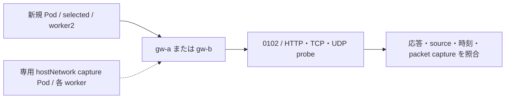

**端末 B：測定プログラムを確認する。** [egress-probe.go](../../scripts/cilium-lab/egress-probe.go) は標準ライブラリだけでビルドする。
`server` は最大 3,600 秒、`boundary` は各条件最大 5 packet。HTTP `19090`、TCP echo `19091`、UDP echo `19092`／`19093` を使う。
コンパイラのない実行ホストには、[実環境の配布手順](execution-environment-singlesite-k02.md#egress-probe-build) でソースと照合済みのバイナリを事前配置する。
Go のある実行ホストで作成する場合のコマンドは以下。既に配布済みならこのビルドだけ省略し、次の `test -x` と `help` で確認する。

```bash
(
  set -euo pipefail
  : "${REPO_ROOT:?}"
  command -v go
  probe_bin="$REPO_ROOT/nxos_fabric/nxos_singlesite/k8s_kind/client/runtime/bin/egress-probe"
  CGO_ENABLED=0 GOOS=linux GOARCH=amd64 GO111MODULE=off go build -o "$probe_bin" \
    "$REPO_ROOT/nxos_fabric/scripts/cilium-lab/egress-probe.go"
  "$probe_bin" help
)
```

**端末 B：新しい証跡先、Pod、専用サーバを準備する。** 既存 Policy／namespace／Egress IP／待受があると中断する。
上書きせず、その時点の証跡を確認する。サーバは 1 時間で終了するため、期限を超えたら新しい試験枠としてやり直す。

```bash
(
  set -euo pipefail
  : "${REPO_ROOT:?}" "${KUBE_CONTEXT:?}" "${KUBECONFIG:?}" "${EVIDENCE_DIR:?}"
  EG_ROOT="$REPO_ROOT/nxos_fabric/nxos_singlesite/k8s_kind/k02/cilium/manifests/validation/egress"
  EXT_BIN="$REPO_ROOT/nxos_fabric/nxos_singlesite/k8s_kind/client/runtime/bin/egress-probe"
  test -x "$EXT_BIN"
  "$EXT_BIN" help
  mkdir -p "$EVIDENCE_DIR/raw"
  EXT_DIR="$(mktemp -d "$EVIDENCE_DIR/raw/egress-extended-XXXXXXXX")"
  EXT_ID="$(basename "$EXT_DIR")"
  EXT_SERVER=clab-nxos-fabric-singlesite-adc-t1sv0102
  EXT_REMOTE="/tmp/$EXT_ID"
  for name in REPO_ROOT KUBE_CONTEXT KUBECONFIG EVIDENCE_DIR EG_ROOT EXT_BIN EXT_DIR EXT_ID EXT_SERVER EXT_REMOTE; do
    printf 'export %s=%q\n' "$name" "${!name}"
  done > "$EXT_DIR/session.env"
  cp "$EXT_DIR/session.env" "$REPO_ROOT/nxos_fabric/nxos_singlesite/operations/cilium-lab/egress-extended-current.env"
  kubectl --context "$KUBE_CONTEXT" get nodes -o json > "$EXT_DIR/nodes-before.json"
  kubectl --context "$KUBE_CONTEXT" -n kube-system get pods -l k8s-app=cilium -o json > "$EXT_DIR/agents-before.json"
  kubectl --context "$KUBE_CONTEXT" get ciliumegressgatewaypolicies -o json > "$EXT_DIR/policies-before.json"
  jq -e '.items | length == 0' "$EXT_DIR/policies-before.json"
  test -z "$(kubectl --context "$KUBE_CONTEXT" get ns egress-probe --ignore-not-found -o name)"
  kubectl --context "$KUBE_CONTEXT" get ciliumbgpadvertisements -o json > "$EXT_DIR/ads-before.json"
  jq -e '[.items[] | select(.metadata.name | startswith("k02-egress"))] | length == 0' "$EXT_DIR/ads-before.json"
  for node in adc-k02-worker adc-k02-worker2; do
    docker exec "$node" ip -j addr > "$EXT_DIR/$node-before.json"
    jq -e 'all(.[]; .ifname != "egress0")' "$EXT_DIR/$node-before.json"
  done
  docker exec "$EXT_SERVER" ss -lntup > "$EXT_DIR/server-listen-before.log"
  if grep -Eq ':1909[0-3][[:space:]]' "$EXT_DIR/server-listen-before.log"; then
    echo '試験ポートは使用中です。既存サービスを停止せず中断します。' >&2; exit 1
  fi
  cp "$REPO_ROOT/nxos_fabric/scripts/cilium-lab/egress-probe.go" "$EXT_DIR/"
  cp "$EXT_BIN" "$EXT_DIR/egress-probe"
  for part in base bgp gw-a gw-b; do
    kubectl --context "$KUBE_CONTEXT" kustomize "$EG_ROOT/$part" > "$EXT_DIR/$part.yaml"
  done
  kubectl --context "$KUBE_CONTEXT" apply -k "$EG_ROOT/base"
  kubectl --context "$KUBE_CONTEXT" -n egress-probe wait --for=condition=Ready pod --all --timeout=120s
  kubectl --context "$KUBE_CONTEXT" get ns egress-probe -o jsonpath='{.metadata.uid}' > "$EXT_DIR/namespace.uid"
  for container in "$EXT_SERVER" adc-k02-worker2; do
    docker exec "$container" mkdir -p "$EXT_REMOTE"
    docker exec -i "$container" sh -c 'cat > "$1" && chmod 755 "$1"' sh "$EXT_REMOTE/egress-probe" < "$EXT_BIN"
  done
  kubectl --context "$KUBE_CONTEXT" -n egress-probe exec -i selected -c client -- \
    sh -c 'cat > /tmp/egress-probe && chmod 755 /tmp/egress-probe' < "$EXT_BIN"
  docker exec "$EXT_SERVER" sh -c \
    'nohup "$1/egress-probe" server 3600 > "$1/server.log" 2>&1 & echo $! > "$1/server.pid"' sh "$EXT_REMOTE"
  sleep 2
  docker exec "$EXT_SERVER" curl --noproxy '*' -fsS http://127.0.0.1:19090/source
  printf 'session=%s\n' "$EXT_DIR"
)
```

**端末 B：共通関数を保存する。** 以下の関数にある実コマンドを、各試験で条件と保存名を指定して使う。
`eg_source` は送信元まで照合、`eg_profile` は Policy と BPF map と実通信を照合、`eg_lb` は既存 LB の 4 宛先を確認する。
`eg_capture` は両 worker・外部、MTU 試験では Leaf の入出力も同時に取得する。55 秒で自動終了し、空の取得を成功にしない。

```bash
source "${REPO_ROOT}/nxos_fabric/nxos_singlesite/operations/cilium-lab/egress-extended-current.env"
cat > "$EXT_DIR/functions.sh" <<'FUNCTIONS'
# 両端末で source する関数。変数は EXT_DIR/session.env から取得する。
eg_k() { kubectl --context "$KUBE_CONTEXT" --request-timeout=30s "$@"; }
eg_source() (
  set -euo pipefail
  phase="$1"; expected4="$2"; expected6="$3"
  mkdir -p "$EXT_DIR/$phase"
  for family in 4 6; do
    if [ "$family" = 4 ]; then dest=172.16.0.2; expected="$expected4";
    else dest='[fd21:0:0:1::102]'; expected="$expected6"; fi
    eg_k -n egress-probe exec selected -c client -- \
      curl --noproxy '*' -gfsS --connect-timeout 3 --max-time 5 \
      -H "X-Lab-Test-ID: ${EXT_ID}-${phase}-${family}" \
      "http://${dest}:19090/source" | tee "$EXT_DIR/$phase/source-$family.log"
    python3 - "$expected" "$EXT_DIR/$phase/source-$family.log" <<'PY'
import ipaddress,sys
source=open(sys.argv[2]).read().split('remote=',1)[1].split()[0]
assert ipaddress.ip_address(source)==ipaddress.ip_address(sys.argv[1]), source
PY
  done
)
eg_maps() (
  set -euo pipefail
  mkdir -p "$EXT_DIR/$1"
  for node in adc-k02-worker adc-k02-worker2; do
    agent="$(eg_k -n kube-system get pods -l k8s-app=cilium --field-selector "spec.nodeName=$node" -o jsonpath='{.items[0].metadata.name}')"
    test -n "$agent"
    eg_k -n kube-system exec "$agent" -c cilium-agent -- cilium-dbg bpf egress list | tee "$EXT_DIR/$1/$node-map.log"
  done
)
eg_profile() (
  set -euo pipefail
  profile="$1"
  if [ "$profile" = normal ]; then
    eg_k delete ciliumegressgatewaypolicy egress-probe-ipv4 egress-probe-ipv6 --ignore-not-found
    expected4=172.16.4.22; expected6=fd21::4:0:0:2:2
  else
    eg_k apply -k "$EG_ROOT/$profile"
    if [ "$profile" = gw-a ]; then suffix=1; else test "$profile" = gw-b; suffix=2; fi
    expected4="172.16.24.$suffix"; expected6="fd21:0:0:24::$suffix"
  fi
  sleep 6
  phase="profile-${profile}-$(date +%s%N)"
  eg_maps "$phase"
  eg_source "$phase" "$expected4" "$expected6"
)
eg_lb() (
  set -euo pipefail
  for dest in 172.16.14.20 172.16.14.21 '[fd21::14:0:0:1:100]' '[fd21::14:0:0:1:101]'; do
    docker exec "$EXT_SERVER" curl --noproxy '*' -gfsS --connect-timeout 3 --max-time 5 \
      -w 'http_code=%{http_code}\n' "http://${dest}/"
  done | tee "$EXT_DIR/lb-$1.log"
)
# 端末 A の取得を最大 55 秒に制限する。Ctrl+C だけに終了を依存させない。
eg_capture() (
  set -euo pipefail
  mode="$1"; phase="$2"
  cap="$EXT_DIR/$phase"; mkdir "$cap"
  if [ "$mode" = mtu ]; then filter='udp port 19092 or icmp or icmp6';
  else test "$mode" = route; filter='tcp port 19090 or udp port 8472'; fi
  pids=()
  for node in adc-k02-worker adc-k02-worker2; do
    pod="capture-${node}"
    eg_k -n egress-probe exec "$pod" -c capture -- \
      timeout -s INT 55 tcpdump -i any -nn -tttt -vv -l -s 180 "$filter" \
      > "$cap/$node.log" 2>&1 &
    pids+=("$!")
  done
  docker exec "$EXT_SERVER" timeout -s INT 55 \
    tcpdump -i bond0.10 -nn -tttt -vv -l -s 180 "$filter" > "$cap/server.log" 2>&1 &
  pids+=("$!")
  if [ "$mode" = mtu ]; then
    for leaf in adc-lfsw0103 adc-lfsw0104; do
      for nic in eth6 tap6 tap1 eth1; do
        docker exec "clab-nxos-fabric-singlesite-$leaf" timeout -s INT 55 \
          tcpdump -i "$nic" -nn -e -tttt -vv -l -s 180 \
          'udp port 19092 or icmp or icmp6 or (vlan and (udp port 19092 or icmp or icmp6))' \
          > "$cap/$leaf-$nic.log" 2>&1 &
        pids+=("$!")
      done
    done
  fi
  sleep 3
  for file in "$cap"/*.log; do
    grep -q 'listening on' "$file" || { cat "$file"; echo "取得未開始: $file" >&2; exit 1; }
  done
  printf '端末 B で送信してください。保存先=%s\n' "$cap"
  for pid in "${pids[@]}"; do
    rc=0; wait "$pid" || rc=$?
    case "$rc" in 0|124|130) ;; *) echo "capture_exit=$rc" >&2; exit 1;; esac
  done
  grep 'packets dropped by kernel' "$cap"/*.log
)
FUNCTIONS
```

**端末 A／B：両方で同じセッションと関数を読み込む。** 新しい端末でも必ず実行する。

```bash
source "${REPO_ROOT}/nxos_fabric/nxos_singlesite/operations/cilium-lab/egress-extended-current.env"
source "$EXT_DIR/functions.sh"
printf 'context=%s session=%s\n' "$KUBE_CONTEXT" "$EXT_DIR"
```

**端末 B：通常送信元 → Egress IP を比較し、観測用 Pod を用意する。** 過去の connectivity test の Pod を前提にしない。
今回専用の hostNetwork Pod 2 個だけに capture 用 capability を付け、12.10 で削除する。

```bash
(
  set -euo pipefail
  eg_source normal-before 172.16.4.22 fd21::4:0:0:2:2
  eg_lb before
  bash "$REPO_ROOT/nxos_fabric/scripts/cilium-lab/configure-egress-gateway-addresses.sh" --cluster adc-k02 --action apply
  eg_k apply -k "$EG_ROOT/bgp"
  sleep 12
  cilium bgp routes advertised ipv4 unicast --context "$KUBE_CONTEXT" > "$EXT_DIR/advertised-ipv4.log"
  cilium bgp routes advertised ipv6 unicast --context "$KUBE_CONTEXT" > "$EXT_DIR/advertised-ipv6.log"
  eg_profile gw-a
  for node in adc-k02-worker adc-k02-worker2; do
    cat > "$EXT_DIR/capture-$node.yaml" <<YAML
apiVersion: v1
kind: Pod
metadata:
  name: capture-${node}
  namespace: egress-probe
spec:
  nodeName: ${node}
  hostNetwork: true
  tolerations:
    - operator: Exists
  containers:
    - name: capture
      image: quay.io/cilium/alpine-curl:v1.10.0@sha256:913e8c9f3d960dde03882defa0edd3a919d529c2eb167caa7f54194528bde364
      command: ["sh", "-c", "sleep 3600"]
      securityContext:
        runAsUser: 0
        capabilities:
          add: ["NET_RAW", "NET_ADMIN"]
YAML
    eg_k apply -f "$EXT_DIR/capture-$node.yaml"
    eg_k -n egress-probe wait --for=condition=Ready "pod/capture-$node" --timeout=120s
    eg_k -n egress-probe exec "capture-$node" -c capture -- sh -c 'command -v tcpdump; command -v timeout'
  done
  eg_k -n egress-probe get pods -o wide | tee "$EXT_DIR/pods-ready.log"
)
```

正常時は `normal-before` が worker2 の通常送信元、`gw-a` が `.1`／`::1`。異なる場合は次へ進まない。

**端末 B：新規 Pod を 3 回作り、起動直後の送信元を記録する。** Ready 待ち後の手動 curl ではなく、
測定プログラムを最初のプロセスとして起動する。各 Pod が IPv4／IPv6 を各 40 回送信する。

```bash
(
  set -euo pipefail
  image="$(eg_k -n egress-probe get pod selected -o jsonpath='{.spec.containers[0].image}')"
  mkdir "$EXT_DIR/newborn"
  for i in 1 2 3; do
    cat > "$EXT_DIR/newborn/$i.yaml" <<YAML
apiVersion: v1
kind: Pod
metadata:
  name: newborn-${i}
  namespace: egress-probe
  labels:
    app: egress-probe
    lab.cilium.io/egress-policy: selected
spec:
  nodeName: adc-k02-worker2
  restartPolicy: Never
  activeDeadlineSeconds: 120
  containers:
    - name: client
      image: ${image}
      command: ["/probe/egress-probe", "newborn", "http://172.16.0.2:19090/source", "http://[fd21:0:0:1::102]:19090/source"]
      volumeMounts:
        - name: probe
          mountPath: /probe
          readOnly: true
  volumes:
    - name: probe
      hostPath:
        path: ${EXT_REMOTE}
        type: Directory
YAML
    eg_k apply -f "$EXT_DIR/newborn/$i.yaml"
    eg_k -n egress-probe wait --for=jsonpath='{.status.phase}'=Succeeded "pod/newborn-$i" --timeout=140s
    eg_k -n egress-probe logs "newborn-$i" > "$EXT_DIR/newborn/$i.jsonl"
    eg_k -n egress-probe get pod "newborn-$i" -o json > "$EXT_DIR/newborn/$i-pod.json"
    jq -s '{requests: (map(select(.event=="request"))|length), errors: (map(select(.event=="request" and .status!=200))|length), first: (map(select(.event=="request"))|first)}' "$EXT_DIR/newborn/$i.jsonl"
    eg_k -n egress-probe delete pod "newborn-$i"
  done
)
```

**見方：** 各 Pod の `requests=80` と `errors` の件数を保存し、成功した全 `body` の `remote=` とサーバの ID を照合する。
プログラムの終了コード 0 は全通信成功を意味しない。初期失敗があれば最初の成功時刻までを別記し、各 family の最後の 5 回が指定 Egress IP で安定成功することを確認する。
初回から指定 Egress IP なら「反映前の通信を観測しなかった」。`elapsed_ms` はプログラム開始から応答までであり、Policy 反映遅延そのものではない。
先行試験では 240 件すべて指定 Egress IP、初回応答は 121〜276 ms だった。
今回の手順検証では 239/240 件成功、新規 Pod 1 の最初の IPv4 だけ 400 ms の接続期限で timeout。その後は全件成功した。
[TI-006](test-issue-register.md#ti-006-newborn-first-request) として記録し、Policy 反映遅延が原因とは断定しない。
[公式の新規 Pod への反映遅延の説明](https://docs.cilium.io/en/stable/network/egress-gateway/egress-gateway/#delay-for-enforcement-of-egress-policies-on-new-pods) と、今回実測した timeout は区別する。

**端末 B：初期失敗と最終安定状態を分けて集計する。** 全送信元の確認と最後の 5 回の確認を自動化する。

```bash
python3 - "$EXT_DIR" <<'PYTEST'
import json,ipaddress,sys
from pathlib import Path
for f in sorted((Path(sys.argv[1])/'newborn').glob('*.jsonl')):
    rows=[json.loads(line) for line in f.read_text().splitlines()]
    rows=[r for r in rows if r['event']=='request']
    assert len(rows)==80
    for family in [4,6]:
        rs=[r for r in rows if ('[' in r['url'])==(family==6)]
        expected='172.16.24.1' if family==4 else 'fd21:0:0:24::1'
        good=[r for r in rs if r['status']==200]
        assert len(rs)==40
        assert all(ipaddress.ip_address(r['body'].split('remote=',1)[1].split()[0])==ipaddress.ip_address(expected) for r in good)
        assert all(r['status']==200 for r in rs[-5:]), 'last five not stable'
        print(f.name,family,'success',len(good),'failed',40-len(good),'first_success',good[0]['elapsed_ms'])
PYTEST
```


### 12.6 経路照合：Pod → Gateway → 外部サーバ

**目的：** BPF map の Gateway IP と実パケットの通過 NIC を照合する。`ip route get` だけで BPF の転送を断定しない。

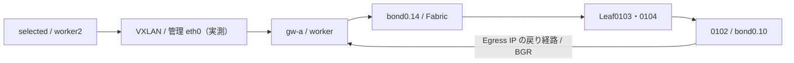

**端末 A：取得を開始する。** `端末 B で送信してください` の表示を待つ。

```bash
eg_capture route route-capture
```

**端末 B：同じ接続を追えるよう source port と ID を指定する。** BPF map と Node の通常 route も保存する。

```bash
(
  set -euo pipefail
  eg_maps route-map
  for node in adc-k02-worker adc-k02-worker2; do
    docker exec "$node" ip -4 route get 172.16.0.2 > "$EXT_DIR/route-map/$node-ipv4.log"
    docker exec "$node" ip -6 route get fd21:0:0:1::102 > "$EXT_DIR/route-map/$node-ipv6.log"
    docker exec "$node" ip -br addr > "$EXT_DIR/route-map/$node-addresses.log"
  done
  for family in 4 6; do
    if [ "$family" = 4 ]; then dest=172.16.0.2; else dest='[fd21:0:0:1::102]'; fi
    eg_k -n egress-probe exec selected -c client -- \
      curl --noproxy '*' -gfsS --connect-timeout 3 --max-time 5 --local-port "5010$family" \
      -H "X-Lab-Test-ID: $EXT_ID-route-$family" "http://$dest:19090/source" \
      | tee "$EXT_DIR/route-map/request-$family.log"
  done
)
```

**端末 A：55 秒で終了後、出力を確認する。** `any` では同じ packet が複数行に出る。行数を packet 数と解釈しない。

```bash
cat "$EXT_DIR/route-capture"/*.log
```

IP、source port、TCP sequence、時刻を照合する。現在の実測は Node 間の外側が `172.18.0.6 → 172.18.0.2`／`eth0`、
Gateway → 外部が `bond0.14`。Fabric NIC を VXLAN underlay に使う設計とは異なるため、疎通成功と設計適合は別に記録する。

### 12.7 W-EGRESS-09 追加：計画切替中の既存 TCP 接続

**目的：** `gw-a → gw-b` の切替で、既存 TCP と新規 HTTP がどう変わるかを分けて観測する。Node は停止しない。

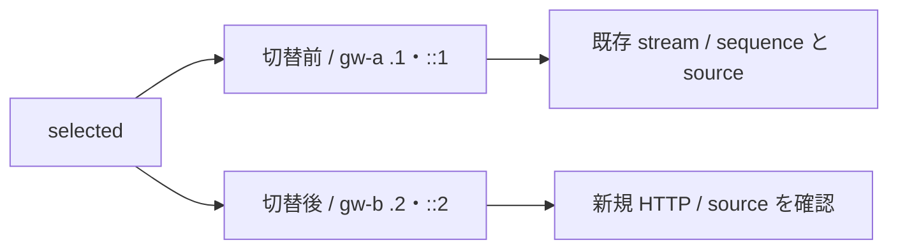

**端末 A：IPv4／IPv6 の stream を 45 秒間観測する。** サーバの送信時刻に加え、クライアントの受信時刻も JSON に保存する。

```bash
(
  set -u
  mkdir "$EXT_DIR/switch"
  pids=()
  for family in 4 6; do
    if [ "$family" = 4 ]; then dest=172.16.0.2; else dest='[fd21:0:0:1::102]'; fi
    eg_k -n egress-probe exec selected -c client -- /tmp/egress-probe stream \
      "http://${dest}:19090/stream?id=${EXT_ID}-stream-${family}" 45 \
      > "$EXT_DIR/switch/stream-$family.jsonl" 2> "$EXT_DIR/switch/stream-$family.stderr.log" &
    pids+=("$!")
  done
  echo '端末 B で切り替えてください。'
  for pid in "${pids[@]}"; do wait "$pid"; done
  cat "$EXT_DIR/switch"/stream-*.jsonl
)
```

**端末 B：開始から 8 秒後に Policy を切り替え、新規接続を繰り返す。**

```bash
(
  set -euo pipefail
  # 端末 A の stream 開始を確認してから実行する。
  test -d "$EXT_DIR/switch"
  sleep 8
  date -u +'%Y-%m-%dT%H:%M:%S.%NZ' > "$EXT_DIR/switch/change.time"
  eg_k apply -k "$EG_ROOT/gw-b" | tee "$EXT_DIR/switch/apply.log"
  eg_k -n egress-probe exec selected -c client -- /tmp/egress-probe newborn \
    http://172.16.0.2:19090/source 'http://[fd21:0:0:1::102]:19090/source' \
    > "$EXT_DIR/switch/new-connections.jsonl"
  eg_source switch-confirmed 172.16.24.2 fd21:0:0:24::2
)
```

**端末 A の終了後、端末 B：元の Gateway を復元する。**

```bash
eg_profile gw-a
```

**見方：** `stream-*.jsonl` の最後の sequence／受信時刻と `change.time`、`new-connections.jsonl` の最初の `.2`／`::2` を照合する。
45 秒の上限到達と接続 reset は区別する。2026-09-06 の測定では既存接続が切れ、新規接続が新 Egress IP で成功した。

### 12.8 追加負荷：TCP／UDP 比較と SNAT port 上限

**目的：** 大容量転送と多数の同時変換を確認する。**MTU 修正後の比較は実施済みだが、高レート UDP の損失が残る。通常の手順再開では下のスイッチを `no` とし、12.9 の低レート比較から確認する。性能比較の実施枠では `RUN_BULK_TESTS=yes` にする。今回の再試験は yes に相当する全 48 条件を実行した。**
小さい HTTP 成功を大容量通信・性能の合格へ拡張しない。再開時は MTU 修正後の通常 MSS での成功を先に確認する。

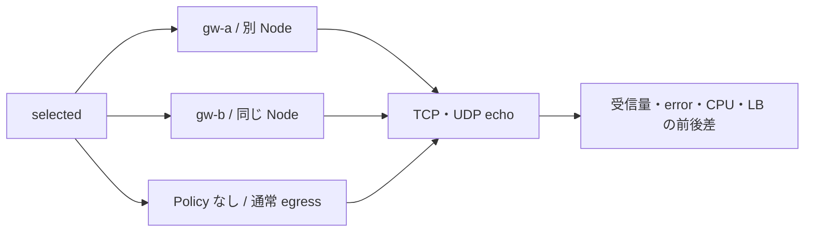

**端末 B：保留または上限付き比較を実行する。** 実施時は 3 経路 × 2 family × 2 回 × TCP 1／4 接続・UDP 2 サイズの 48 条件。
TCP は 256 KiB block／合計 100 Mbps、UDP は 1,200／8,000 byte payload／20 Mbps、各 5 秒。
プログラムは送信量を制限し、応答 timeout も記録する。TCP の完全な echo block 数を IP packet 損失率と解釈しない。

```bash
(
  set -euo pipefail
  RUN_BULK_TESTS=no
  if [ "$RUN_BULK_TESTS" != yes ]; then
    printf 'SKIP: TI-004 unresolved; MTU boundary first\n' > "$EXT_DIR/bulk-skipped.log"
    exit 0
  fi
  mkdir "$EXT_DIR/bulk"
  for profile in gw-a gw-b normal; do
    eg_profile "$profile"
    eg_lb "bulk-$profile-before"
    for family in 4 6; do
      if [ "$family" = 4 ]; then host=172.16.0.2; else host='[fd21:0:0:1::102]'; fi
      for repeat in 1 2; do
        for spec in 'tcp 1 262144 100 19091' 'tcp 4 262144 100 19091' 'udp 1 1200 20 19092' 'udp 1 8000 20 19092'; do
          read -r proto streams size rate port <<< "$spec"
          key="$profile-v$family-$repeat-$proto-$streams-$size"
          docker stats --no-stream adc-k02-worker adc-k02-worker2 > "$EXT_DIR/bulk/$key-before.log"
          eg_k -n egress-probe exec selected -c client -- /tmp/egress-probe load \
            "$proto$family" "$host:$port" 5 "$streams" "$size" "$rate" > "$EXT_DIR/bulk/$key.json"
          docker stats --no-stream adc-k02-worker adc-k02-worker2 > "$EXT_DIR/bulk/$key-after.log"
        done
      done
    done
    eg_lb "bulk-$profile-after"
  done
  eg_profile gw-a
)
```

**SNAT port 枯渇は別判定で保留する。** baseline 損失を説明できるまで `exhaust` を実行しない。
再開時の bounded command は次のとおり。最大 40,000 socket、30 秒保持、1 family ずつ。ローカル socket 上限と NAT 割当失敗は分けて記録する。

```bash
(
  set -euo pipefail
  RUN_PORT_LIMIT=no
  if [ "$RUN_PORT_LIMIT" != yes ]; then
    printf 'SKIP: normal path and load baseline unresolved\n' > "$EXT_DIR/port-limit-skipped.log"
    exit 0
  fi
  eg_profile gw-a
  agent="$(eg_k -n kube-system get pods -l k8s-app=cilium --field-selector spec.nodeName=adc-k02-worker -o jsonpath='{.items[0].metadata.name}')"
  mkdir "$EXT_DIR/port-limit"
  for family in 4 6; do
    if [ "$family" = 4 ]; then host=172.16.0.2; else host='[fd21:0:0:1::102]'; fi
    for command in 'bpf nat retries' 'metrics list -o json'; do
      read -ra args <<< "$command"
      eg_k -n kube-system exec "$agent" -c cilium-agent -- cilium-dbg "${args[@]}" > "$EXT_DIR/port-limit/v$family-before-${args[0]}.log"
    done
    eg_k -n egress-probe exec selected -c client -- /tmp/egress-probe exhaust \
      "udp$family" "$host:19093" 40000 30 > "$EXT_DIR/port-limit/v$family.jsonl"
    for command in 'bpf nat retries' 'metrics list -o json'; do
      read -ra args <<< "$command"
      eg_k -n kube-system exec "$agent" -c cilium-agent -- cilium-dbg "${args[@]}" > "$EXT_DIR/port-limit/v$family-after-${args[0]}.log"
    done
    eg_lb "port-limit-v$family-after"
  done
)
```

この保留ブロックは将来の準備であり、今回の実施・合格には含めない。負荷中の別 source／別宛先の対照と復旧待ち条件も、再開前に実施枠に合わせて確定する。

<a id="egress-mtu-boundary"></a>

### 12.9 MTU・パケットサイズ境界の切り分け

**次回の追加範囲：** [TI-007](test-issue-register.md#ti-007-mtu-9100) の設定修正後、下記の既存サイズに
IP 全長 `8999`／`9000`／`9001` byte を加える。以下の実施済み結果とコマンドの範囲は `8900` byte まで。
`9000` byte は未検証で、`9001` byte は MTU 超過時の挙動を確認する対照条件とする。

**目的：** 送出レートを抑え、IP packet のサイズだけを変えて失敗境界と失われる区間を特定する。
UDP payload は IPv4 で全長 − 28、IPv6 で全長 − 48 byte。IPv4 は DF、IPv6 は送信元 fragmentation を抑止する。
`write` 成功と `read` timeout、`message too long`、ICMP 応答を区別する。MTU 設定の変更は含まない。

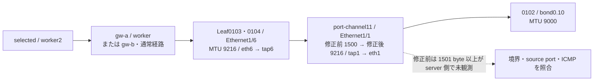

図の Leaf port は gw-a の経路。gw-b／通常経路は source Node 側 Leaf が変わるが、宛先サーバ側は同じ Leaf0103・0104。

**端末 B：3 経路 × 2 family × 10 サイズを測定する。** 各条件 3 packet の低レートで、最大サイズは 8,900 byte。

```bash
(
  set -euo pipefail
  mkdir "$EXT_DIR/boundary"
  for profile in gw-a gw-b normal; do
    eg_profile "$profile"
    for family in 4 6; do
      if [ "$family" = 4 ]; then dest=172.16.0.2:19092; else dest='[fd21:0:0:1::102]:19092'; fi
      for size in 1400 1499 1500 1501 1600 2000 2048 4000 8000 8900; do
        eg_k -n egress-probe exec selected -c client -- /tmp/egress-probe boundary \
          "udp$family" "$dest" "$size" 3 | tee "$EXT_DIR/boundary/$profile-v$family-$size.json"
      done
    done
    eg_lb "boundary-$profile"
  done
  eg_profile gw-a
  jq -s 'map({network,total_ip_bytes,payload,sent,acked,errors})' "$EXT_DIR/boundary"/*.json > "$EXT_DIR/boundary-summary.json"
)
```

**端末 A：境界周辺を同時取得する。** gw-a に復元済みの状態で開始する。全 capture の `listening on` を確認してから端末 B へ進む。

```bash
eg_capture mtu mtu-capture
```

**端末 B：1,500／1,501／1,600 byte を再送する。** この 6 条件は約 15 秒で終わり、55 秒の capture 内に収まる。

```bash
(
  set -euo pipefail
  mkdir "$EXT_DIR/mtu-requests"
  for family in 4 6; do
    if [ "$family" = 4 ]; then dest=172.16.0.2:19092; else dest='[fd21:0:0:1::102]:19092'; fi
    for size in 1500 1501 1600; do
      eg_k -n egress-probe exec selected -c client -- /tmp/egress-probe boundary \
        "udp$family" "$dest" "$size" 3 | tee "$EXT_DIR/mtu-requests/v$family-$size.json"
    done
  done
)
```

**端末 A：取得終了後、サイズ・source port と ICMP を確認する。**

```bash
cat "$EXT_DIR/mtu-requests"/*.json
grep -E 'length 1500|length 1501|length 1600|19092|too big|unreachable|frag needed|dropped by kernel' "$EXT_DIR/mtu-capture"/*.log
```

IPv6 の `payload length` は IPv6 header の 40 byte を含まない。IPv4 と同じ表示値だけで比べない。
`0 packets dropped by kernel` は capture 自体の取りこぼしについての値であり、経路全体の損失ゼロという意味ではない。

**端末 B：Leaf の実 MTU を確認する。** Linux の eth／tap の MTU と NX-OS の interface MTU は別に記録する。
環境別のログイン先は [実環境](execution-environment-singlesite-k02.md) に記載する。Leaf0103、Leaf0104 の **NX-OS CLI** で次を実行し、
次の Linux shell コマンドで接続と端末出力保存を行う。接続中に下の NX-OS コマンドを入力する。
1 台目で `exit` すると 2 台目へ接続する。認証情報は入力表示・ファイル保存しない。

```bash
(
  set -euo pipefail
  read -r -p 'NX-OS ログインユーザー名: ' NXOS_USER
  for leaf in adc-lfsw0103 adc-lfsw0104; do
    leaf_ip="$(docker inspect "clab-nxos-fabric-singlesite-$leaf" | jq -er '[.[0].NetworkSettings.Networks[].IPAddress | select(length>0)] | if length==1 then .[0] else error("管理 IP を一意に選択できません") end')"
    printf -v login_cmd 'ssh -F /dev/null -l %q %q' "$NXOS_USER" "$leaf_ip"
    script -q -e -c "$login_cmd" "$EXT_DIR/$leaf-mtu.log"
  done
)
```

```text
terminal length 0
show interface ethernet1/6
show interface ethernet1/1
show interface port-channel11
show interface vlan14
show interface vlan10
show running-config interface port-channel11
show running-config interface ethernet1/1
show running-config interface ethernet1/6
show running-config all | include jumbomtu
exit
```

**修正前の実測例（2026-09-06 の試験結果として保存）：**

```bash
kubectl --context "${KUBE_CONTEXT}" -n egress-probe exec selected -c client -- \
  /tmp/egress-probe boundary udp4 172.16.0.2:19092 1500 3
# 抜粋: {"total_ip_bytes":1500,"payload":1472,"sent":3,"acked":3,"errors":[]}
kubectl --context "${KUBE_CONTEXT}" -n egress-probe exec selected -c client -- \
  /tmp/egress-probe boundary udp4 172.16.0.2:19092 1501 3
# 抜粋: {"total_ip_bytes":1501,"payload":1473,"sent":3,"acked":0,"errors":["read: ... i/o timeout", ...]}
```

上記は JSON の読み方を示す抜粋で、元の取得ではバイナリ名が `egress-boundary`。ソースと全コマンドは証跡に残す。
修正前は全 3 経路・両 family で **1,500 byte まで 3/3、1,501 byte 以上 0/3**。
大きい packet は Leaf の Node 側で見えるが、サーバ向け tap／eth とサーバで見えなかった。
両 Leaf の `port-channel11`／`Ethernet1/1` が 1500、Node 側 `Ethernet1/6` は 9216。取得範囲で ICMP PTB／fragmentation needed は見つからなかった。
[MTU 結果と全コマンド](../../nxos_singlesite/operations/cilium-lab/2026-09-06/adc-k02/egress-mtu-result.md)、[TI-004](test-issue-register.md#ti-004-large-packets) に記録する。
**修正後の期待値と実測：** 3.1 の Po11 MTU 修正後は、同じ 60 条件すべてで `sent=3, acked=3`。
IP 全長 1,400〜8,900 byte、IPv4／IPv6、gw-a／gw-b／通常経路の計 180 packet が成功した。
MTU の失敗境界は解消したが、高負荷性能は別に判定する。最新は [修正後の結果](../../nxos_singlesite/operations/cilium-lab/2026-09-06/adc-k02/egress-mtu-fix-result.md) を参照する。

**端末 B：通常 MSS の大きい TCP と低レート UDP を比較する。** 各 3 秒、3 経路 × 2 family。
TCP は 256 KiB／10 Mbps 上限、UDP は 1,200／8,000 byte payload／0.1 Mbps。全量回収と error 0 を先に確認する。

```bash
(
  set -euo pipefail
  mkdir "$EXT_DIR/lowrate"
  for profile in gw-a gw-b normal; do
    eg_profile "$profile"
    for family in 4 6; do
      if [ "$family" = 4 ]; then host=172.16.0.2; else host='[fd21:0:0:1::102]'; fi
      for spec in 'tcp 262144 10 19091' 'udp 1200 0.1 19092' 'udp 8000 0.1 19092'; do
        read -r proto size rate port <<< "$spec"
        file="$EXT_DIR/lowrate/$profile-$proto$family-$size.json"
        eg_k -n egress-probe exec selected -c client -- /tmp/egress-probe load \
          "$proto$family" "$host:$port" 3 1 "$size" "$rate" | tee "$file"
        jq -e '.sent_bytes > 0 and .sent_bytes == .received_bytes and .errors == 0' "$file"
      done
    done
    eg_lb "lowrate-$profile"
  done
  eg_profile gw-a
)
```

失敗があれば高負荷へ進まず、packet capture と error を確認する。性能比較を再開する場合は 12.8 の実行ブロックを同じセッションで使用し、実施スイッチの変更と実行条件を記録する。

### 12.10 追加試験の撤去と証跡確定

**目的：** Policy なしで通常通信に戻ることを確認した後、一時 IP／広報／サーバ／Pod だけを撤去する。
Node／kernel／containerlab を再起動せず、checksum 回避策と既存監視を維持する。

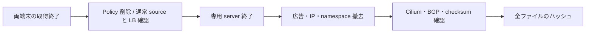

**端末 A：** stream／capture が時間制限で終了し、プロンプトが戻っていることを確認する。
**端末 B：** 次のブロックで通常通信・撤去・復帰を確認する。正常終了しなければハッシュを確定せず、失敗箇所を調べる。

```bash
(
  set -euo pipefail
  # 他セッションの namespace を消さない。終了前に今回の UID と照合する。
  test "$(eg_k get ns egress-probe -o jsonpath='{.metadata.uid}')" = "$(cat "$EXT_DIR/namespace.uid")"
  eg_profile normal
  eg_lb after
  docker exec "$EXT_SERVER" curl --noproxy '*' -fsS http://127.0.0.1:19090/stats > "$EXT_DIR/server-stats.json"
  docker exec "$EXT_SERVER" sh -c '
    pid=$(cat "$1/server.pid") || exit 1
    if [ -r "/proc/$pid/cmdline" ]; then
      cmd=$(tr "\000" " " < "/proc/$pid/cmdline")
      [ "$cmd" = "$1/egress-probe server 3600 " ] || exit 1
      kill -TERM "$pid" || exit 1
    fi
  ' sh "$EXT_REMOTE"
  sleep 2
  docker exec "$EXT_SERVER" cat "$EXT_REMOTE/server.log" > "$EXT_DIR/server-final.jsonl"
  docker exec "$EXT_SERVER" ss -lntup > "$EXT_DIR/server-listen-after.log"
  if grep -Eq ':1909[0-3][[:space:]]' "$EXT_DIR/server-listen-after.log"; then
    echo '待受が残っています。ハッシュ作成前に確認してください。' >&2; exit 1
  fi
  eg_k delete ciliumbgpadvertisement k02-egress k02-egress-planned-shut
  sleep 12
  cilium bgp routes advertised ipv4 unicast --context "$KUBE_CONTEXT" > "$EXT_DIR/withdrawn-ipv4.log"
  cilium bgp routes advertised ipv6 unicast --context "$KUBE_CONTEXT" > "$EXT_DIR/withdrawn-ipv6.log"
  bash "$REPO_ROOT/nxos_fabric/scripts/cilium-lab/configure-egress-gateway-addresses.sh" --cluster adc-k02 --action remove
  eg_k delete ns egress-probe --timeout=120s
  for container in "$EXT_SERVER" adc-k02-worker2; do
    docker exec "$container" rm -f "$EXT_REMOTE/egress-probe"
  done
  eg_k get nodes -o json > "$EXT_DIR/nodes-after.json"
  eg_k -n kube-system get pods -l k8s-app=cilium -o json > "$EXT_DIR/agents-after.json"
  cilium status --context "$KUBE_CONTEXT" > "$EXT_DIR/status-after.log"
  cilium bgp peers --context "$KUBE_CONTEXT" > "$EXT_DIR/peers-after.log"
  for node in adc-k02-worker adc-k02-worker2; do
    docker exec "$node" ethtool -k cilium_vxlan | tee "$EXT_DIR/$node-checksum-after.log"
  done
  python3 - "$EXT_DIR" <<'PY'
import json,sys
from pathlib import Path
p=Path(sys.argv[1])
for kind in ['nodes','agents']:
    def state(phase):
        items=json.loads((p/f'{kind}-{phase}.json').read_text())['items']
        return sorted((x['metadata']['uid'], [(c['name'],c['restartCount']) for c in x.get('status',{}).get('containerStatuses',[])]) for x in items)
    assert state('before')==state('after'),kind
print('Node UID / Cilium Pod UID / restartCount unchanged')
PY
  date -u +'%Y-%m-%dT%H:%M:%SZ' > "$EXT_DIR/finished.time"
)
```

**端末 B：全取得終了後にハッシュを作成する。** 保存先を変えても検証できるよう相対パスを使う。

```bash
(
  set -euo pipefail
  cd "$EXT_DIR"
  find . -type f ! -name SHA256SUMS -print0 | sort -z | xargs -0 sha256sum > SHA256SUMS
  sha256sum -c SHA256SUMS
)
printf 'evidence=%s\n' "$EXT_DIR"
```

## 13. 実施前レビューと参照

2026-09-06 の結果整理に合わせた見直しで、追加測定の準備・実行・撤去、端末間の変数共有、各項目の構成図を追記した。
従来の 2026-09-06 の見直しで、手順リンク不足、Pod 名と配置、端末間の変数共有、外部での source 確認、
Policy の排他的切替、専用 dummy と IP、BGP 広報・戻り経路・撤回、証跡の確定順を補った。
2026-09-06 に専用レンジの `/32`／`/128` 設計へ変更し、基本試験・checksum 回避策適用後の回帰・CIDR 外の追加試験を実施した。
完了・未実施の区別は [Stage 2B の受入確認](build-plan.md#62-stage-2b-cilium-egress-gateway) に記載する。
実行前に、この手順と整合する base manifest・IP 設定スクリプトが実行ホストへ配置されていることを確認する。
今回の配置・転送方法と準備状況は [実際の試験環境](execution-environment-singlesite-k02.md) を参照する。

- [Cilium Egress Gateway 公式文書](https://docs.cilium.io/en/stable/network/egress-gateway/egress-gateway/)：参照時 `1.20.1`。必要 feature、Egress IP の事前設定、反映遅延、Gateway 変更時の接続断。
- [Cilium v1.20.1 の Policy 実装](https://github.com/cilium/cilium/blob/v1.20.1/pkg/egressgateway/policy.go)：IPv4／IPv6 の Egress IP 選択と interface 解決。
- [試験 workload 設計](test-workloads.md#6-egress-probe-egress-gateway)、[Stage 2B 計画](build-plan.md#62-stage-2b-cilium-egress-gateway)。
- [Egress IP 設定スクリプト](../../scripts/cilium-lab/configure-egress-gateway-addresses.sh)、[試験 manifest](../../nxos_singlesite/k8s_kind/k02/cilium/manifests/validation/egress/)。
