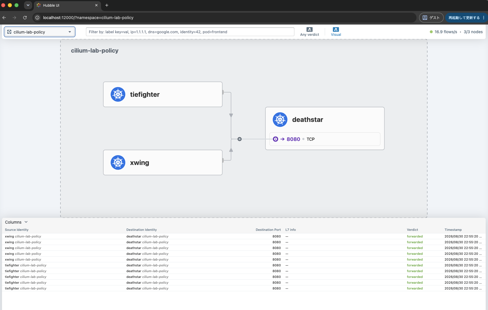
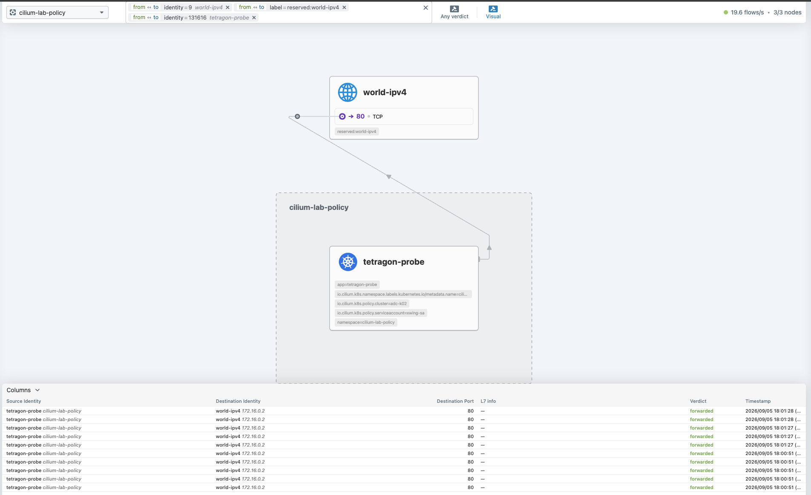

# Network Policy／Tetragon 検証計画

## 1. 目的

`adc-k02` の single-site 構築後に、Cilium Network Policy、Hubble、Tetragon を同じ workload で確認する。
通信可否だけでなく、Cilium policy status、Hubble verdict、Tetragon runtime event、resource 使用量を
Test ID で対応付ける。

初期検証は次の境界を守る。

- Policy は `cilium-lab-policy` namespace だけに適用する。
- Clusterwide policy、Host Firewall、Tetragon enforcement は使用しない。
- Tetragon は observe-only とし、host filesystem と credential を観測対象にしない。
- 実行 log、JSON event、packet capture、sysdump は Git 管理外へ保存する。
- manifest は採用 version を固定して review し、remote URL から直接 apply しない。

## 2. 前提条件と試験内 gate

開始前に満たす platform 条件と、4.5 で workload を作成した後に確認する条件を分離する。

| 確認時点 | 項目 | 合格条件 |
|---|---|---|
| 4.5 開始前 | Cilium | 全 Agent／Operator が Ready で、`cilium status --wait` が成功する |
| 4.5 開始前 | Hubble | Relay が Ready で、`hubble status -P` が成功する |
| 4.5 開始前 | Tetragon | DaemonSet が全 Node で Ready である |
| 4.5 開始前 | Resource | 構築後 `MemAvailable` gate を満たし、host と Kind Node container の CPU／memory baseline を記録している |
| base 適用後 | Workload | `deathstar`、`tiefighter`、`xwing`、`tetragon-probe` が Ready になる |
| `NP-00` | Baseline | Policy なしで `tiefighter`／`xwing` から `deathstar` へ到達できる |

開始前の基本確認 command を示す。4.5.1 で対象環境の変数を設定してから実行する。この時点では
`cilium-lab-policy` Namespace は未作成でもよい。

```bash
cilium status --context "${KUBE_CONTEXT}" --wait
hubble status --kube-context "${KUBE_CONTEXT}" -P
kubectl --context "${KUBE_CONTEXT}" -n kube-system rollout status daemonset/tetragon
```

## 3. Manifest 境界

次の Kustomize layer を作成済みである。各 layer は単独で render／diff／apply／rollback できる。

```text
${VALIDATION_ROOT}/
├── network-policy/
│   ├── base/
│   ├── 10-default-deny/
│   ├── 20-dns/
│   ├── 30-l3l4/
│   ├── 40-identity-service-account/
│   ├── 50-fqdn/
│   └── 60-http-l7/
└── tetragon/
    ├── 10-process/
    ├── 20-file/
    ├── 30-network/
    └── 40-privilege/
```

各 layer は `kubectl kustomize`、`kubectl diff -k`、`kubectl apply -k` の順で扱う。複数の Policy layer を
一度に追加せず、各 Test ID の合否と rollback を確認してから次へ進む。

single-site で合格した manifest だけを multi-site の k02／k03 に同期する。現時点では single-site の実 manifest と
runbook を作成済みであり、multi-site 側への同期と running cluster への apply は未実施である。multi-site を選択した
場合は、4.5 の directory 確認を通過するまで apply へ進まない。

## 4. Network Policy 検証

### 4.1 適用順

1. Policy なしの baseline を記録する。
2. Kubernetes NetworkPolicy で default-deny ingress／egress を適用する。
3. kube-dns への DNS 通信だけを許可する。
4. 必要な L3/L4 通信だけを許可する。
5. CiliumNetworkPolicy で identity／Service Account selector を確認する。
6. FQDN policy を追加する。
7. HTTP L7 policy を追加する。
8. Policy を逆順に削除し、baseline へ戻す。

default-deny egress を適用する前に DNS allow を render しておく。ただし挙動を証明するため、`NP-01` では
default-deny 単体による DNS／通信失敗を短時間だけ確認し、直後に `NP-02` を適用する。

### 4.2 Test matrix

| Test ID | Policy state | Traffic | Expected |
|---|---|---|---|
| `NP-00` | Policy なし | `tiefighter`／`xwing` → `deathstar` | 両方成功し、Hubble で `FORWARDED` |
| `NP-01` | namespace default-deny ingress／egress | 同上と DNS | 新規 connection と DNS が deny され、他 namespace は影響を受けない |
| `NP-02` | DNS allow | kube-dns UDP／TCP `53` | DNS だけ復旧し、application 通信は deny のまま |
| `NP-03` | L3/L4 allow | `tiefighter` → `deathstar` | 指定 port だけ成功し、`xwing` は `DROPPED` |
| `NP-04` | identity／Service Account | selector 一致／不一致 client | 一致する identity だけ成功する |
| `NP-05` | FQDN allow | 許可 FQDN／非許可 FQDN | 許可名だけ成功し、DNS query と policy verdict を照合できる |
| `NP-06` | HTTP L7 allow | 許可 `POST`／path、拒否 `PUT`／path | 許可 request だけ成功し、method／path と L7 verdict を取得できる |
| `NP-07` | 全 Policy 削除 | baseline traffic | `NP-00` と同じ状態へ戻る |

### 4.3 判断 command

```bash
kubectl --context "${KUBE_CONTEXT}" -n "${POLICY_NS}" \
  get networkpolicy,ciliumnetworkpolicy
kubectl --context "${KUBE_CONTEXT}" -n "${POLICY_NS}" \
  describe networkpolicy
kubectl --context "${KUBE_CONTEXT}" -n "${POLICY_NS}" \
  describe ciliumnetworkpolicy

hubble observe --kube-context "${KUBE_CONTEXT}" -P \
  --namespace "${POLICY_NS}" --since 5m
hubble observe --kube-context "${KUBE_CONTEXT}" -P \
  --namespace "${POLICY_NS}" --verdict DROPPED --since 5m
```

各通信は新規 TCP connection で実行する。Policy 適用前から存在する connection は conntrack により継続する
可能性があるため、新規 connection の結果と分けて記録する。

### 4.4 合格条件

- default-deny の影響が `cilium-lab-policy` namespace 外へ波及しない。
- DNS allow を application allow より先に分離して確認できる。
- Kubernetes NetworkPolicy と CiliumNetworkPolicy の責務差を説明できる。
- Hubble で source、destination、port、verdict、DNS、HTTP method／path を Test ID と対応付けられる。
- Policy 削除後に baseline へ戻り、Cilium LoadBalancer／BGP に regression がない。

### 4.5 具体的な実行手順

#### 4.5.1 対象環境と CLI の選択

repository 内の任意の作業 directory で実行対象を選択する。`TOPOLOGY_PROFILE` と `CLUSTER_NAME` の組み合わせは
次を使用する。

| 実行対象 | `TOPOLOGY_PROFILE` | `CLUSTER_NAME` | `EXTERNAL_TEST_URL` | `CLABNAME` |
|---|---|---|---|---|
| single-site k02 | `nxos_singlesite` | `adc-k02` | `http://172.16.0.2/` | `nxos-fabric-singlesite` |
| multi-site k02 | `nxos_multisite` | `adc-k02` | `http://172.16.0.2/` | `nxos-fabric-multisite` |
| multi-site k03 | `nxos_multisite` | `bdc-k03` | `http://172.16.0.4/` | `nxos-fabric-multisite` |

最初は single-site k02 を選択する。multi-site では先頭の 4 変数だけを上表の値へ変更し、残りは共通で導出する。

```bash
export TOPOLOGY_PROFILE=nxos_singlesite
export CLUSTER_NAME=adc-k02
export EXTERNAL_TEST_URL=http://172.16.0.2/
export CLABNAME=nxos-fabric-singlesite

export REPO_ROOT="$(git rev-parse --show-toplevel)"
export K8S_CLIENT_RUNTIME="${REPO_ROOT}/nxos_fabric/${TOPOLOGY_PROFILE}/k8s_kind/client/runtime"
export PATH="${K8S_CLIENT_RUNTIME}/bin:${PATH}"
hash -r
command -v helm kubectl cilium hubble

export CLUSTER_ID="${CLUSTER_NAME##*-}"
export KUBECONFIG="${REPO_ROOT}/nxos_fabric/${TOPOLOGY_PROFILE}/clab-${CLABNAME}/${CLUSTER_NAME}/k8s_kind/${CLUSTER_ID}/kubeconfig-${CLUSTER_ID}"
export KUBE_CONTEXT="kind-${CLUSTER_NAME}"
export POLICY_NS=cilium-lab-policy
export VALIDATION_ROOT="${REPO_ROOT}/nxos_fabric/${TOPOLOGY_PROFILE}/k8s_kind/${CLUSTER_ID}/cilium/manifests/validation"

test -r "${KUBECONFIG}"
test -d "${VALIDATION_ROOT}/network-policy"
test -d "${VALIDATION_ROOT}/tetragon"
printf 'kubeconfig=%s\ncontext=%s\nvalidation=%s\n' \
  "${KUBECONFIG}" "${KUBE_CONTEXT}" "${VALIDATION_ROOT}"
kubectl config get-contexts
kubectl --context "${KUBE_CONTEXT}" get nodes
```

`command -v` でいずれかが表示されない場合は、試験を開始する前に
[クライアントツール準備手順](client-tools.md)で binary cache を準備する。`PATH` の変更は shell ごとの設定なので、
新しい terminal で Hubble を起動する場合も、上記の `PATH` 設定を実行する。

single-site k02 の初期構築、`lab-smoke`、Hubble UI、resource health は確認済みであるため、現在の試験はこの節から
開始できる。multi-site では、対象 cluster の Cilium／Hubble／Tetragon と Cluster Mesh の基本 health を確認してから
同じ手順を実行する。

```bash
cilium status --context "${KUBE_CONTEXT}" --wait
hubble status --kube-context "${KUBE_CONTEXT}" -P
kubectl --context "${KUBE_CONTEXT}" -n kube-system \
  rollout status daemonset/tetragon --timeout=120s
```

#### 4.5.2 base workload の適用

操作用 terminal で base workload を render、client dry-run、差分確認、適用する。base が Namespace と試験
Pod／Service を作成する。初回は Namespace がまだ存在しないため、namespaced resource を含む `kubectl diff -k` は
`NotFound` になる。この場合は静的 render と client dry-run を確認し、初回の server diff だけを省略する。

```bash
kubectl kustomize "${VALIDATION_ROOT}/network-policy/base"
kubectl --context "${KUBE_CONTEXT}" apply \
  --dry-run=client \
  -k "${VALIDATION_ROOT}/network-policy/base"

if kubectl --context "${KUBE_CONTEXT}" get namespace "${POLICY_NS}" \
  >/dev/null 2>&1
then
  kubectl --context "${KUBE_CONTEXT}" diff \
    -k "${VALIDATION_ROOT}/network-policy/base" || {
      rc=$?
      test "${rc}" -eq 1
    }
else
  printf 'INFO: %s is absent; skip the first server diff\n' "${POLICY_NS}"
fi

kubectl --context "${KUBE_CONTEXT}" apply \
  -k "${VALIDATION_ROOT}/network-policy/base"
kubectl --context "${KUBE_CONTEXT}" -n "${POLICY_NS}" wait \
  --for=condition=Ready pod --all --timeout=120s
kubectl --context "${KUBE_CONTEXT}" -n "${POLICY_NS}" get pods -o wide
kubectl --context "${KUBE_CONTEXT}" -n "${POLICY_NS}" \
  get networkpolicy,ciliumnetworkpolicy
```

ここで Namespace または Pod が `NotFound`、Pod が `Ready` でない、または Policy resource が残っている場合は
`NP-00` へ進まない。初回の Policy resource は `No resources found` が期待値である。

#### 4.5.3 Hubble CLI と UI の開始

監視用 terminal を開き、4.5.1 の環境変数、`PATH`、`KUBECONFIG` の設定 block を再実行してから Hubble を起動する。
この terminal は以降の Test ID が完了するまで維持する。

```bash
hubble observe --kube-context "${KUBE_CONTEXT}" -P \
  --namespace "${POLICY_NS}" --follow
```

Cilium `1.20.1` の Hubble Relay に対して Hubble CLI `1.19.4` を使用すると、CLI が Relay より古いという warning が
表示される。2026-08-30 時点で [Hubble CLI `v1.19.4`](https://github.com/cilium/hubble/releases/tag/v1.19.4) が
公式最新 release であり、`v1.20.1` の Hubble CLI release は存在しないため、本ラボの固定値は `v1.19.4` を維持する。
warning 自体は不合格にせず、Relay health、flow decode、filter、CLI／UI の一致を確認する。RPC error、未知 field、
filter 不整合が生じた場合は後続試験を止め、利用可能な新しい Hubble CLI release を再確認する。

別の監視用 terminal でも 4.5.1 の設定 block を再実行し、Hubble UI の port-forward を開始する。
試験 server 上で browser を起動せず、local TCP `12000` で待ち受ける。

```bash
cilium hubble ui \
  --context "${KUBE_CONTEXT}" \
  --port-forward 12000 \
  --open-browser=false
```

browser を同じ host で使用する場合は `http://localhost:12000/` を開く。VS Code Remote SSH を使用する場合は、
試験 server の TCP `12000` を local TCP `12000` へ forward してから同じ URL を開く。local port が使用中なら、
コマンドと VS Code の転送先をともに `12001` などへ変更する。

UI で Namespace `cilium-lab-policy` を選択する。flow はこの時点から発生させ、次を Test ID と対応付けて確認する。

| Test ID | UI で確認する内容 |
|---|---|
| `NP-00` | `tiefighter`／`xwing` から `deathstar` への `forwarded` flow と service map |
| `NP-01`～`NP-03` | default-deny の `dropped` と、DNS／L3-L4 allow 後の `forwarded` |
| `NP-04` | Service Account selector の一致／不一致による verdict 差 |
| `NP-06` | HTTP method／path と L7 verdict |
| `NP-07` | rollback 後に baseline の service map と `forwarded` が復旧すること |

UI が空の場合は障害と即断せず、4.5.4 以降の通信を再実行し、画面右上の flow rate と接続 Node 数、CLI の
`hubble observe` を照合する。操作方法と表示項目は
[Cilium 公式 Hubble UI](https://docs.cilium.io/en/stable/observability/hubble/hubble-ui/)を参照する。

#### 4.5.4 `NP-00` Policy なし baseline

操作用 terminal に戻り、`tiefighter` と `xwing` の両方で HTTP status を記録する。

```bash
kubectl --context "${KUBE_CONTEXT}" -n "${POLICY_NS}" exec pod/tiefighter -- \
  curl -sS -o /dev/null -w '%{http_code}\n' --connect-timeout 3 \
  -X POST http://deathstar/v1/request-landing
kubectl --context "${KUBE_CONTEXT}" -n "${POLICY_NS}" exec pod/xwing -- \
  curl -sS -o /dev/null -w '%{http_code}\n' --connect-timeout 3 \
  -X POST http://deathstar/v1/request-landing
```

両方が HTTP `200` で、Hubble が `FORWARDED` を記録した場合にだけ次へ進む。

2026-08-30 の single-site k02 初回結果は次のとおりである。

- Policy resource は `No resources found` であり、Policy なしの状態を確認した。
- `tiefighter` と `xwing` はともに HTTP `200` を返した。
- Hubble CLI で両 client の DNS query と `deathstar:8080/TCP` が `FORWARDED` であることを確認した。
- Hubble UI は `3/3 nodes`、両 client から `deathstar` への service map、TCP `8080`、`forwarded` を表示した。



*図 4-1: Policy なしで `tiefighter`／`xwing` から `deathstar` へ到達した `NP-00` の出力例*

#### 4.5.5 Policy layer の逐次適用

次に各 layer を 1 つずつ `kubectl diff -k`、`kubectl apply -k` し、表の Test ID を実行する。`NP-01` の適用前に
Service ClusterIP を保存し、DNS 拒否と application 通信拒否を別々に確認する。

##### 4.5.5.1 `NP-01` default-deny

```bash
export DEATHSTAR_CLUSTER_IP="$(kubectl --context "${KUBE_CONTEXT}" \
  -n "${POLICY_NS}" get service deathstar \
  -o jsonpath='{.spec.clusterIP}')"
printf 'deathstar ClusterIP=%s\n' "${DEATHSTAR_CLUSTER_IP}"

kubectl --context "${KUBE_CONTEXT}" diff \
  -k "${VALIDATION_ROOT}/network-policy/10-default-deny"
kubectl --context "${KUBE_CONTEXT}" apply \
  -k "${VALIDATION_ROOT}/network-policy/10-default-deny"
kubectl --context "${KUBE_CONTEXT}" -n "${POLICY_NS}" \
  get networkpolicy

if kubectl --context "${KUBE_CONTEXT}" -n "${POLICY_NS}" \
  exec pod/tiefighter -- getent hosts deathstar
then
  echo 'FAIL: NP-01 expected DNS lookup to be denied'
else
  echo 'PASS: NP-01 DNS lookup was denied'
fi

if kubectl --context "${KUBE_CONTEXT}" -n "${POLICY_NS}" \
  exec pod/tiefighter -- \
  curl -sS -o /dev/null -w '%{http_code}\n' \
    --connect-timeout 3 --max-time 5 \
    -X POST "http://${DEATHSTAR_CLUSTER_IP}/v1/request-landing"
then
  echo 'FAIL: NP-01 expected application traffic to be denied'
else
  echo 'PASS: NP-01 application traffic was denied'
fi
```

2026-08-30 の single-site k02 初回結果は次のとおりで、`NP-01` は合格とした。

- `default-deny-ingress-egress` を作成し、Namespace 内の全 Pod に ingress／egress default-deny を適用した。
- `tiefighter` の DNS lookup は終了 code `2` で拒否された。
- `deathstar` ClusterIP への TCP 接続は HTTP `000`、終了 code `28` で timeout した。
- Hubble は `tiefighter` から CoreDNS `53/UDP` と `deathstar:8080/TCP` の両方を `Policy denied DROPPED` と記録した。

##### 4.5.5.2 `NP-02` DNS allow

`NP-01` の deny を確認した直後に `20-dns` を適用し、DNS だけが復旧して application 通信は拒否されたままに
なることを確認する。

```bash
kubectl --context "${KUBE_CONTEXT}" diff \
  -k "${VALIDATION_ROOT}/network-policy/20-dns"
kubectl --context "${KUBE_CONTEXT}" apply \
  -k "${VALIDATION_ROOT}/network-policy/20-dns"
kubectl --context "${KUBE_CONTEXT}" -n "${POLICY_NS}" \
  get networkpolicy

if kubectl --context "${KUBE_CONTEXT}" -n "${POLICY_NS}" \
  exec pod/tiefighter -- getent hosts deathstar
then
  echo 'PASS: NP-02 DNS lookup recovered'
else
  echo 'FAIL: NP-02 expected DNS lookup to recover'
fi

if kubectl --context "${KUBE_CONTEXT}" -n "${POLICY_NS}" \
  exec pod/tiefighter -- \
  curl -sS -o /dev/null -w '%{http_code}\n' \
    --connect-timeout 3 --max-time 5 \
    -X POST "http://${DEATHSTAR_CLUSTER_IP}/v1/request-landing"
then
  echo 'FAIL: NP-02 application traffic must remain denied'
else
  echo 'PASS: NP-02 application traffic remains denied'
fi

hubble observe --kube-context "${KUBE_CONTEXT}" -P \
  --namespace "${POLICY_NS}" \
  --pod "${POLICY_NS}/tiefighter" \
  --since 5m
```

Hubble で CoreDNS `53/UDP` が `FORWARDED`、`deathstar:8080/TCP` が `DROPPED` である場合に `NP-02` を
合格とする。

2026-08-30 の single-site k02 初回結果は次のとおりで、`NP-02` は合格とした。

- `allow-kube-dns` と `default-deny-ingress-egress` の 2 Policy が適用された。
- `getent hosts deathstar` は Service ClusterIP を返し、DNS lookup の復旧を確認した。
- `deathstar` ClusterIP への TCP 接続は HTTP `000`、終了 code `28` の timeout を維持した。
- Hubble は CoreDNS 2 Pod への UDP `53` を `ALLOWED`／`FORWARDED`、`deathstar:8080/TCP` を
  `Policy denied DROPPED` と記録した。

##### 4.5.5.3 `NP-03` L3／L4 allow

`30-l3l4` を適用し、`tiefighter` の許可と `xwing` の拒否を個別に確認する。

```bash
kubectl --context "${KUBE_CONTEXT}" diff \
  -k "${VALIDATION_ROOT}/network-policy/30-l3l4"
kubectl --context "${KUBE_CONTEXT}" apply \
  -k "${VALIDATION_ROOT}/network-policy/30-l3l4"
kubectl --context "${KUBE_CONTEXT}" -n "${POLICY_NS}" \
  get networkpolicy

if kubectl --context "${KUBE_CONTEXT}" -n "${POLICY_NS}" \
  exec pod/tiefighter -- \
  curl -sS -o /dev/null -w '%{http_code}\n' \
    --connect-timeout 3 --max-time 5 \
    -X POST http://deathstar/v1/request-landing
then
  echo 'PASS: NP-03 tiefighter was allowed'
else
  echo 'FAIL: NP-03 expected tiefighter to be allowed'
fi

if kubectl --context "${KUBE_CONTEXT}" -n "${POLICY_NS}" \
  exec pod/xwing -- \
  curl -sS -o /dev/null -w '%{http_code}\n' \
    --connect-timeout 3 --max-time 5 \
    -X POST http://deathstar/v1/request-landing
then
  echo 'FAIL: NP-03 expected xwing to be denied'
else
  echo 'PASS: NP-03 xwing was denied'
fi

hubble observe --kube-context "${KUBE_CONTEXT}" -P \
  --namespace "${POLICY_NS}" \
  --since 5m
```

Hubble で `tiefighter` が `FORWARDED`、`xwing` が `DROPPED` である場合に `NP-03` を合格とする。

2026-08-30 の single-site k02 初回結果は次のとおりで、`NP-03` は合格とした。

- `allow-tiefighter-to-deathstar-ingress` と `allow-tiefighter-to-deathstar-egress` を適用した。
- `tiefighter` から `deathstar` への `POST /v1/request-landing` は HTTP `200` となった。
- `xwing` から同じ endpoint への接続は HTTP `000`、終了 code `28` の timeout となった。
- Hubble は `tiefighter` から `deathstar:8080/TCP` を `ALLOWED`／`FORWARDED`、`xwing` からの同じ通信を
  `Policy denied DROPPED` と記録した。
- `tiefighter` と `xwing` の CoreDNS への UDP `53` はいずれも `ALLOWED`／`FORWARDED` であり、通信結果が
  DNS 拒否によるものではないことを確認した。

##### 4.5.5.4 `NP-04` Service Account identity allow

`NP-04`～`NP-06` は、既存 allow rule との OR 条件で誤判定しないよう、直前の test 用 allow layer を削除してから
次の layer を適用する。`default-deny-ingress-egress` と `allow-kube-dns` は維持する。

`NP-04` では、送信元 Pod の任意 label ではなく Cilium が付与する
`io.cilium.k8s.policy.serviceaccount` identity label を使用する。base manifest では `tiefighter` に
`tiefighter-sa`、`xwing` に `xwing-sa` が設定済みである。まず `NP-03` の L3／L4 allow layer だけを削除し、
残存 Policy と Service Account の割り当てを確認する。

```bash
kubectl --context "${KUBE_CONTEXT}" delete \
  -k "${VALIDATION_ROOT}/network-policy/30-l3l4"

kubectl --context "${KUBE_CONTEXT}" -n "${POLICY_NS}" \
  get networkpolicy

kubectl --context "${KUBE_CONTEXT}" -n "${POLICY_NS}" \
  get pod tiefighter xwing \
  -o custom-columns='NAME:.metadata.name,SERVICE_ACCOUNT:.spec.serviceAccountName'

kubectl --context "${KUBE_CONTEXT}" diff \
  -k "${VALIDATION_ROOT}/network-policy/40-identity-service-account"
kubectl --context "${KUBE_CONTEXT}" apply \
  -k "${VALIDATION_ROOT}/network-policy/40-identity-service-account"

cilium status --context "${KUBE_CONTEXT}" --wait

kubectl --context "${KUBE_CONTEXT}" -n "${POLICY_NS}" \
  get ciliumnetworkpolicy
kubectl --context "${KUBE_CONTEXT}" -n "${POLICY_NS}" \
  describe ciliumnetworkpolicy \
  allow-tiefighter-service-account-ingress
kubectl --context "${KUBE_CONTEXT}" -n "${POLICY_NS}" \
  describe ciliumnetworkpolicy \
  allow-tiefighter-service-account-egress
```

期待する残存 Policy は次の 4 つである。

- Kubernetes NetworkPolicy: `default-deny-ingress-egress`、`allow-kube-dns`
- CiliumNetworkPolicy: `allow-tiefighter-service-account-ingress`、
  `allow-tiefighter-service-account-egress`

新規 connection で `tiefighter` の許可と `xwing` の拒否を確認する。

```bash
if kubectl --context "${KUBE_CONTEXT}" -n "${POLICY_NS}" \
  exec pod/tiefighter -- \
  curl -sS -o /dev/null -w '%{http_code}\n' \
    --connect-timeout 3 --max-time 5 \
    -X POST http://deathstar/v1/request-landing
then
  echo 'PASS: NP-04 tiefighter-sa was allowed'
else
  echo 'FAIL: NP-04 expected tiefighter-sa to be allowed'
fi

if kubectl --context "${KUBE_CONTEXT}" -n "${POLICY_NS}" \
  exec pod/xwing -- \
  curl -sS -o /dev/null -w '%{http_code}\n' \
    --connect-timeout 3 --max-time 5 \
    -X POST http://deathstar/v1/request-landing
then
  echo 'FAIL: NP-04 expected xwing-sa to be denied'
else
  echo 'PASS: NP-04 xwing-sa was denied'
fi

for POD in tiefighter xwing; do
  echo "### ${POD}"
  hubble observe --kube-context "${KUBE_CONTEXT}" -P \
    --namespace "${POLICY_NS}" \
    --pod "${POLICY_NS}/${POD}" \
    --since 5m
done
```

`tiefighter` が HTTP `200` かつ Hubble で `FORWARDED`、`xwing` が timeout かつ `DROPPED` である場合に
`NP-04` を合格とする。両 Pod の DNS が `FORWARDED` であることも確認し、名前解決の成否と Service Account
identity による application 通信制御を分けて判定する。

2026-08-30 の single-site k02 初回結果は次のとおりで、`NP-04` は合格とした。

- `tiefighter` と `xwing` に、それぞれ `tiefighter-sa` と `xwing-sa` が割り当てられていることを確認した。
- Service Account identity を選択する 2 つの CiliumNetworkPolicy は、いずれも `VALID=True` となった。
- `tiefighter-sa` から `deathstar` への `POST /v1/request-landing` は HTTP `200` となった。
- `xwing-sa` から同じ endpoint への接続は HTTP `000`、終了 code `28` の timeout となった。
- Hubble は `tiefighter` から `deathstar:8080/TCP` を `ALLOWED`／`FORWARDED`、`xwing` からの同じ通信を
  `Policy denied DROPPED` と記録した。
- 両 Pod の CoreDNS への UDP `53` は `ALLOWED`／`FORWARDED` であり、Service Account identity の不一致が
  application 通信の拒否理由であることを確認した。

##### 4.5.5.5 `NP-05` FQDN allow

`NP-04` の Service Account allow layer を削除してから FQDN layer を適用する。

```bash
kubectl --context "${KUBE_CONTEXT}" delete \
  -k "${VALIDATION_ROOT}/network-policy/40-identity-service-account"

kubectl --context "${KUBE_CONTEXT}" -n "${POLICY_NS}" \
  get networkpolicy,ciliumnetworkpolicy

kubectl --context "${KUBE_CONTEXT}" diff \
  -k "${VALIDATION_ROOT}/network-policy/50-fqdn"
kubectl --context "${KUBE_CONTEXT}" apply \
  -k "${VALIDATION_ROOT}/network-policy/50-fqdn"

cilium status --context "${KUBE_CONTEXT}" --wait

kubectl --context "${KUBE_CONTEXT}" -n "${POLICY_NS}" \
  get ciliumnetworkpolicy
kubectl --context "${KUBE_CONTEXT}" -n "${POLICY_NS}" \
  describe ciliumnetworkpolicy allow-tiefighter-example-fqdn
```

期待する残存 Policy は次の 3 つである。

- Kubernetes NetworkPolicy: `default-deny-ingress-egress`、`allow-kube-dns`
- CiliumNetworkPolicy: `allow-tiefighter-example-fqdn`

初期 manifest は次の 2 つの egress rule を持つ。

- 信頼する cluster DNS である `kube-system/kube-dns` の port `53` だけを Cilium DNS Proxy へ転送し、
  `matchPattern: "*"` で query を許可・観測する。
- 観測した DNS 応答のうち、`www.example.com` に対応する IP の TCP `80` だけを許可する。

標準 Kubernetes NetworkPolicy の L4 DNS allow だけでは、`toFQDNs` が必要とする DNS 応答の観測と IP cache への
登録を行えない。CiliumNetworkPolicy の `rules.dns` を別 rule として明示する必要がある。詳細は Cilium 公式の
[DNS Policy and IP Discovery](https://docs.cilium.io/en/stable/security/policy/layer7/#dns-policy-and-ip-discovery) と
[Locking Down External Access with DNS-Based Policies](https://docs.cilium.io/en/stable/security/dns/) を参照する。

外部 FQDN の試験前に、CoreDNS upstream が Pod から到達可能であることを確認する。resolver の優先順位は
`--upstream`、`COREDNS_UPSTREAM_DNS`、Containerlab host の `/etc/resolv.conf` にある最初の非 loopback
IPv4 nameserver の順である。環境固有値は manifest へ記載せず、site 別の Git 管理外 runtime file へ保存する。

まず check-only で選定値と CoreDNS の差分を表示する。

```bash
export COREDNS_RUNTIME="${REPO_ROOT}/nxos_fabric/${TOPOLOGY_PROFILE}/k8s_kind/${CLUSTER_ID}/cilium/runtime/20-coredns-upstream.env"

"${REPO_ROOT}/nxos_fabric/scripts/cilium-lab/configure-coredns-upstream.sh" \
  --context "${KUBE_CONTEXT}" \
  --record "${COREDNS_RUNTIME}"
```

自動検出値を利用しない環境では、実行 shell だけに resolver を指定して再確認する。

```bash
export COREDNS_UPSTREAM_DNS="<Pod から到達可能な resolver IPv4>"

"${REPO_ROOT}/nxos_fabric/scripts/cilium-lab/configure-coredns-upstream.sh" \
  --context "${KUBE_CONTEXT}" \
  --record "${COREDNS_RUNTIME}"
```

表示された resolver が対象環境の値であることを確認してから適用する。

```bash
"${REPO_ROOT}/nxos_fabric/scripts/cilium-lab/configure-coredns-upstream.sh" \
  --context "${KUBE_CONTEXT}" \
  --record "${COREDNS_RUNTIME}" \
  --apply

kubectl --context "${KUBE_CONTEXT}" -n kube-system \
  get configmap coredns -o jsonpath='{.data.Corefile}' | \
  grep 'forward \.'
```

スクリプトは採用 resolver への Pod 直達試験、CoreDNS ConfigMap patch、CoreDNS rollout、Cluster DNS
試験を順に実施する。適用後の Cluster DNS 試験に失敗した場合は元の Corefile へ rollback する。CoreDNS の
`forward` 変更は Kubernetes 公式の
[Customizing DNS Service](https://kubernetes.io/docs/tasks/administer-cluster/dns-custom-nameservers/) に基づく。
課題の診断記録は [`TI-003`](test-issue-register.md#6-ti-003-kind-上の-coredns-upstream-到達不可)を参照する。

非許可側には同じ DNS／HTTP 条件で比較できる `www.example.net` を使用する。両方の DNS 応答が得られることを先に
確認してから、IPv4 HTTP 到達性を比較する。

```bash
export FQDN_ALLOW="www.example.com"
export FQDN_DENY="www.example.net"

kubectl --context "${KUBE_CONTEXT}" -n "${POLICY_NS}" exec pod/tiefighter -- \
  getent hosts "${FQDN_ALLOW}"
kubectl --context "${KUBE_CONTEXT}" -n "${POLICY_NS}" exec pod/tiefighter -- \
  getent hosts "${FQDN_DENY}"
```

いずれかの外部 FQDN が解決できない場合は HTTP 判定へ進まず、内部 DNS と FQDN Policy の対象外 Pod を使って
障害境界を確認する。

```bash
kubectl --context "${KUBE_CONTEXT}" -n "${POLICY_NS}" \
  exec pod/tiefighter -- \
  getent hosts kubernetes.default.svc.cluster.local

kubectl --context "${KUBE_CONTEXT}" -n "${POLICY_NS}" \
  exec pod/tetragon-probe -- \
  getent hosts "${FQDN_ALLOW}"

kubectl --context "${KUBE_CONTEXT}" -n kube-system \
  logs -l k8s-app=kube-dns \
  --prefix --since=10m --tail=200
```

- 内部 DNS も失敗する場合は、Pod → CoreDNS Service の経路を切り分ける。
- 内部 DNS は成功し、`tiefighter` と `tetragon-probe` の外部 DNS がともに失敗する場合は、CoreDNS upstream を
  切り分ける。
- `tetragon-probe` は成功し、`tiefighter` だけが失敗する場合は、Cilium DNS Proxy rule、Agent log、FQDN cache を
  切り分ける。

両外部 FQDN の DNS gate を通過したら HTTP 通信を確認する。

```bash

if kubectl --context "${KUBE_CONTEXT}" -n "${POLICY_NS}" \
  exec pod/tiefighter -- \
  curl -4 -sS -o /dev/null -w '%{http_code}\n' \
    --connect-timeout 3 --max-time 10 \
    "http://${FQDN_ALLOW}/"
then
  echo 'PASS: NP-05 allowed FQDN was reachable'
else
  echo 'FAIL: NP-05 expected the allowed FQDN to be reachable'
fi

if kubectl --context "${KUBE_CONTEXT}" -n "${POLICY_NS}" \
  exec pod/tiefighter -- \
  curl -4 -sS -o /dev/null -w '%{http_code}\n' \
    --connect-timeout 3 --max-time 10 \
    "http://${FQDN_DENY}/"
then
  echo 'FAIL: NP-05 expected the non-allowed FQDN to be denied'
else
  echo 'PASS: NP-05 non-allowed FQDN was denied'
fi

hubble observe --kube-context "${KUBE_CONTEXT}" -P \
  --namespace "${POLICY_NS}" \
  --pod "${POLICY_NS}/tiefighter" \
  --since 5m

export FQDN_TEST_NODE="$(kubectl --context "${KUBE_CONTEXT}" \
  -n "${POLICY_NS}" get pod tiefighter \
  -o jsonpath='{.spec.nodeName}')"
export FQDN_CILIUM_POD="$(kubectl --context "${KUBE_CONTEXT}" \
  -n kube-system get pod -l k8s-app=cilium \
  --field-selector "spec.nodeName=${FQDN_TEST_NODE}" \
  -o jsonpath='{.items[0].metadata.name}')"

kubectl --context "${KUBE_CONTEXT}" -n kube-system \
  exec "${FQDN_CILIUM_POD}" -- \
  cilium-dbg fqdn cache list | grep -E 'www\.example\.(com|net)' || true
```

両 FQDN の名前解決が成功し、許可 FQDN の HTTP 通信だけが成功する場合に `NP-05` を合格とする。Hubble では
CoreDNS への DNS flow、許可先への `FORWARDED`、非許可先への `DROPPED` を照合し、Cilium Agent の FQDN cache に
許可 FQDN と応答 IP が登録されていることを確認する。DNS 応答が得られない場合や許可先自体が停止している場合は
Policy の合否にせず、外部到達性の前提不成立として切り分ける。FQDN cache の確認 command は Cilium 公式の
[`cilium-dbg fqdn cache list`](https://docs.cilium.io/en/stable/cmdref/cilium-dbg_fqdn_cache_list/) に基づく。

2026-08-30 の single-site k02 初回試行は、次の理由により `NP-05` を判定保留とした。

- `allow-tiefighter-example-fqdn` の validation は成功し、`VALID=True` となった。
- Pod から CoreDNS への UDP `53` は Hubble で `ALLOWED`／`FORWARDED` だった。
- 許可・非許可 FQDN の両方で `getent hosts` が終了 code `2`、`curl` が `Resolving timed out` となった。
- 非許可 FQDN の timeout も DNS 解決失敗によるため、FQDN Policy による拒否とは判定しなかった。
- 初回 manifest で不足していた Cilium DNS Proxy の `rules.dns` を追加し、CNP が `VALID=True` になることを
  確認したが、外部名の解決は復旧しなかった。
- 内部 Service DNS は成功し、Policy 対象の `tiefighter` と対象外 Pod の外部 DNS はともに失敗した。
- CoreDNS log では Node 内の Docker embedded DNS への query timeout／connection refused が観測された。
- 一時 Pod で `dnsPolicy: None` と host resolver を直接指定すると `www.example.com` の AAAA 応答が得られた。
  このため障害境界を CoreDNS upstream と判断し、上記の共通スクリプトで runtime 設定してから再試験する。
- 同日、runtime resolver の check-only と `--apply` を実行し、Pod 直達試験と Cluster DNS 試験がともに成功した。
  CoreDNS の `forward` 変更と site 別 runtime record の作成は完了し、`NP-05` の通信判定から再開できる。
- 許可対象と非許可対象の両 FQDN の名前解決が成功した状態で、許可対象は HTTP `200`、非許可対象は
  HTTP `000`／終了 code `28` の timeout となった。
- Hubble では両 FQDN の A／AAAA query と応答が `FORWARDED`、許可対象の TCP `80` が
  `ALLOWED`／`FORWARDED`、非許可対象の TCP SYN が `Policy denied DROPPED` となった。
- Pod の resolver search と `ndots` により、外部名へ cluster domain suffix を付加した中間 query は
  `Non-Existent Domain` となったが、最終的な絶対名の A／AAAA query は正常応答しており、不合格にはしない。
- `tiefighter` と同じ Node の Cilium Agent FQDN cache に、両 FQDN の A／AAAA 応答と TTL が登録された。
- DNS、通信結果、Hubble verdict、FQDN cache が期待値と一致したため、`NP-05` を合格とする。

##### 4.5.5.6 `NP-06` HTTP L7 allow

`NP-05` の FQDN layer を削除してから HTTP L7 layer を適用する。許可する `POST` と拒否する `PUT` は、
既存 connection の再利用を避けて別々の `curl` process で比較する。

```bash
kubectl --context "${KUBE_CONTEXT}" delete \
  -k "${VALIDATION_ROOT}/network-policy/50-fqdn"
kubectl --context "${KUBE_CONTEXT}" apply \
  -k "${VALIDATION_ROOT}/network-policy/60-http-l7"
kubectl --context "${KUBE_CONTEXT}" -n "${POLICY_NS}" exec pod/tiefighter -- \
  curl -sS -o /dev/null -w '%{http_code}\n' --connect-timeout 3 \
  -X POST http://deathstar/v1/request-landing
kubectl --context "${KUBE_CONTEXT}" -n "${POLICY_NS}" exec pod/tiefighter -- \
  curl -sS -o /dev/null -w '%{http_code}\n' --connect-timeout 3 \
  -X PUT http://deathstar/v1/request-landing
```

各 apply 後に `kubectl describe` と Hubble の `FORWARDED`／`DROPPED` を保存する。`NP-07` では逆順に
Policy layer を削除し、最後に `NP-00` と同じ 2 command が成功することを確認する。

2026-08-30 の single-site k02 では、2 つの CiliumNetworkPolicy がともに `VALID=True` となり、
`tiefighter` の `POST /v1/request-landing` は HTTP `200`、同じ path の `PUT` は HTTP `403` となった。
Hubble では POST request と HTTP `200` response が `FORWARDED`、PUT request が `DROPPED`、HTTP `403`
response が `FORWARDED` と記録された。非対象 `xwing` の POST は HTTP `000`／終了 code `28` の timeout となった。
method、path、source selector と Hubble L7 event が期待値に一致したため、`NP-06` を合格とする。

##### 4.5.5.7 `NP-07` Policy rollback と baseline 復旧

`NP-06` の確認後、L7、DNS、default-deny の逆順で Policy layer を削除する。削除対象を一括指定せず、各 layer の
resource が削除されたことを command 出力で確認する。

```bash
kubectl --context "${KUBE_CONTEXT}" delete \
  -k "${VALIDATION_ROOT}/network-policy/60-http-l7"

kubectl --context "${KUBE_CONTEXT}" delete \
  -k "${VALIDATION_ROOT}/network-policy/20-dns"

kubectl --context "${KUBE_CONTEXT}" delete \
  -k "${VALIDATION_ROOT}/network-policy/10-default-deny"

kubectl --context "${KUBE_CONTEXT}" -n "${POLICY_NS}" \
  get networkpolicy,ciliumnetworkpolicy
```

`No resources found` を確認してから、`NP-00` と同じ 2 client の baseline traffic を再実行する。

```bash
for POD in tiefighter xwing; do
  printf '### %s\n' "${POD}"

  kubectl --context "${KUBE_CONTEXT}" \
    -n "${POLICY_NS}" exec "pod/${POD}" -- \
    curl -sS -o /dev/null -w '%{http_code}\n' \
      --connect-timeout 3 --max-time 5 \
      -X POST http://deathstar/v1/request-landing
done
```

両方が HTTP `200` となることを合格条件とする。Policy 削除後は Envoy の HTTP L7 visibility 対象外になるため、
`hubble observe --protocol http` に新しい baseline request が表示されない場合がある。rollback 前の event と
混同しないよう、新規 request を発生させた直後に protocol filter なしで TCP flow を確認する。

```bash
for POD in tiefighter xwing; do
  kubectl --context "${KUBE_CONTEXT}" \
    -n "${POLICY_NS}" exec "pod/${POD}" -- \
    curl -sS -o /dev/null --connect-timeout 3 --max-time 5 \
      -X POST http://deathstar/v1/request-landing
done

hubble observe \
  --kube-context "${KUBE_CONTEXT}" -P \
  --namespace "${POLICY_NS}" \
  --since 1m
```

最後に Cilium と BGP Control Plane が Policy rollback の影響を受けていないことを確認する。

```bash
cilium status --context "${KUBE_CONTEXT}" --wait
cilium bgp peers --context "${KUBE_CONTEXT}"
```

2026-08-30 の single-site k02 では、全 NetworkPolicy／CiliumNetworkPolicy の削除後に `No resources found` を
確認し、`tiefighter` と `xwing` の POST はともに HTTP `200` へ復旧した。Cilium／Operator／Envoy／Hubble は
Ready、worker 2 Node から ADC BGR 2 台への IPv4／IPv6 BGP session はすべて `established` であった。
protocol filter なしの Hubble では、両 Pod の DNS flow と `deathstar:8080` の TCP handshake、request／response、
connection close がすべて `FORWARDED` となった。baseline、観測、platform health が期待値に一致したため、
`NP-07` を合格とする。

### 4.6 Single-site k02 結果一覧

| Test ID | 結果 | 主な確認内容 |
|---|---|---|
| `NP-00` | 合格 | Policy なしで `tiefighter`／`xwing` が HTTP `200` |
| `NP-01` | 合格 | default-deny で DNS と application traffic を拒否 |
| `NP-02` | 合格 | CoreDNS 通信だけ復旧し、application traffic は拒否を維持 |
| `NP-03` | 合格 | `tiefighter` の L3/L4 通信だけ許可し、`xwing` を拒否 |
| `NP-04` | 合格 | Service Account identity 一致だけ許可 |
| `NP-05` | 合格 | FQDN の DNS 観測、許可先通信、非許可先拒否、FQDN cache を確認 |
| `NP-06` | 合格 | HTTP POST を許可し、PUT を L7 で拒否、非対象 source を拒否 |
| `NP-07` | 合格 | 全 Policy を削除し、baseline traffic、Hubble、Cilium／BGP health が復旧 |

`NP-00` から `NP-07` まで全項目が合格したため、single-site k02 の Network Policy 試験系列を完了とする。

## 5. Tetragon 検証

**この章では、Tetragon の Security Observability（実行時のセキュリティ観測）を observe-only で試験する。**
Tetragon は eBPF を用いてプログラムの動作を観測し、Policy に基づいて実行時に制御する機能も持つ。
まず機能の範囲と今回の試験対象を次のように分ける。

| Tetragon の機能 | 何をする機能か | 今回の扱い |
|---|---|---|
| Security Observability：観測 | 実行中のプロセス、file 操作、TCP 通信、権限チェックなどを event として記録し、Pod 情報と関連付ける | **対象**。`TG-00`～`TG-05` で、必要な動作を取得・識別できるかを確認する |
| 観測対象の選択・限定 | namespace、Pod label、操作対象などの条件で追加観測の範囲を絞る | **対象**。`TG-01` の対象／非対象比較と、後続の限定 Policy で確認する |
| Runtime Enforcement：制御 | 対応する hook と Policy の action を使い、プロセスの強制終了や操作へのエラー返却などを行う | **対象外**。今回の TracingPolicy では、Tetragon による操作の拒否・強制終了を試験しない |

機能の位置付けは [Tetragon の公式概要](https://tetragon.io/docs/overview/)と
[Policy Enforcement](https://tetragon.io/docs/getting-started/enforcement/)を参照する（確認日: 2026-09-05）。

観測の試験で答えたい問いは、**「Pod 内で、どのプログラムが何をしたかを、取得した event から説明できるか」**である。
たとえば `curl` を実行したとき、プログラム名、実行引数、起動元、所属する Pod を確認し、
network の観測を追加した段階で通信先まで関連付ける。これに加えて `TG-06`～`TG-08` では、
観測による負荷、Tetragon の停止・再開、追加した観測設定の撤去が通信に与える影響を確認する。

`TG-05` の `chown` 失敗は、既存の OS／コンテナの権限制約によって拒否された操作を **観測する試験**であり、
Tetragon が拒否したことを確認する試験ではない。また、前章の Cilium Network Policy による通信制御は、
この章で対象外とする Tetragon の Runtime Enforcement とは別の機能である。
今回の合格は、選定した観測項目とその運用影響の確認を意味し、Tetragon の制御機能の合格を意味しない。

目的を知りたいときは **5.1 → 5.2**、実際に操作するときは **5.7 の該当 Test ID** を読む。
5.3 は event の取得・保存方法、5.4 は通信との照合方法、5.5 は負荷・通信の比較方法、5.6 は全体の合格条件である。
節番号を順に実行するのではなく、`TG-00` → `TG-01` → … の順に進み、必要な説明を参照する。

### 5.1 目的と適用順

最初に標準の観測機能を確認し、その後に観測対象を少しずつ追加する。
ここでいう event は Tetragon が記録した動作である。TracingPolicy は観測対象や action を指定する設定であり、
この章では「どの動作を観測するか」の指定に使用する。
この試験は observe-only とし、TracingPolicy によるプロセス停止や通信拒否は行わない。

| 段階 | 確認したいこと | なぜこの順で行うか |
|---|---|---|
| `TG-00`：標準の process 観測 | プログラムの実行・終了と Pod を結び付けられるか | 追加設定の前に、観測と証跡保存の基本動作を確認する |
| `TG-01`：観測対象の限定 | 指定した namespace／Pod だけを追加観測できるか | file や通信の観測を増やす前に、無関係な workload を対象にしないことを確かめる |
| `TG-02`～`TG-05`：観測内容の追加 | file 操作、TCP 通信、権限チェックを記録できるか | 一種類ずつ追加し、設定と取得した event の対応を確認する |
| `TG-06`／`TG-07`：運用時の影響 | 負荷が増えたときや Tetragon を停止したときに何が起きるか | 通常時に観測できることを確認してから、負荷と停止時の挙動を比較する |
| `TG-08`：観測設定の撤去 | 追加した観測だけを終了して、基本動作を維持できるか | 試験前の観測状態に戻せることまで確認する |

`TG-00` の `process_exec`／`process_exit` は標準で取得する event である。
`TG-01` 以降の custom event は TracingPolicy で追加する。この 2 つを区別し、
**非対象 Pod の標準 event が見えることを、Policy の対象限定に失敗した証拠にしない。**
判定には対象の Policy 名と event 種別を使用する。

実装上は `10-process` → `20-file` → `30-network` → `40-privilege` の順で Policy を追加する。
現在の `10-process` は namespace と Pod label で対象を選び、exec syscall を観測する設定であり、
binary selector による選択は含まない。file Policy の対象は `/tmp/tetragon-lab-write` に限定する。

TracingPolicy の hook（観測する kernel の処理位置）、argument index、selector は低水準の kernel ABI に依存する。
採用する Tetragon version の公式 policy library／例を取得し、hook と argument の意味を review してから
local manifest として保存する。独自の推測だけで `kprobe`／`tracepoint` policy を作成しない。

### 5.2 各試験の目的・操作・期待結果

| Test ID | 確認する目的 | 動作を発生させる操作 | 合格の判断に使う観測結果 |
|---|---|---|---|
| `TG-00` | 誰が何を起動したか追跡できること | `xwing` 内で shell から `curl` を実行 | `process_exec`／`process_exit`、binary、arguments、parent、Pod metadata が対応する |
| `TG-01` | 追加観測を指定した namespace／Pod に限定できること | 対象と非対象 namespace の Pod で同じ process を実行 | 対象 Pod に process Policy の custom event が出て、非対象 Pod には出ない。非対象側も標準 event で操作を確認する |
| `TG-02` | どの Pod が対象 file に書いたか分かること | 専用 Pod の `emptyDir` 内の `/tmp/tetragon-lab-write` へ write | 対象 path の write event と Pod metadata を取得し、他 path の event を抑制する |
| `TG-03` | 書き込みと読み取りを区別できること | 同じ file を read | 対象 path の read event と Pod metadata を取得する |
| `TG-04` | プロセスの通信とネットワーク側の観測を結び付けること | 専用 Pod から外部 HTTP server へ request を送る | `tcp_connect`／`tcp_close` と Hubble flow の時刻、Pod、送信元・宛先 IP／port、protocol が対応する |
| `TG-05` | 権限が必要な操作の試行を観測できること | 専用 Pod で権限不足になる `chown` を実行 | `Operation not permitted` と対応する `cap_capable` event を確認する。Tetragon による拒否の試験ではない |
| `TG-06` | 観測量を増やした場合の負荷と取りこぼしを把握すること | 回数・時間を決めて短時間の event load を発生 | 通常時との CPU、memory、event drop の差を記録し、5.5／5.6 の条件で評価する |
| `TG-07` | 観測機能の停止がアプリケーション通信を止めないこと | 承認された範囲で Tetragon DaemonSet を停止・再開 | 停止前・中・復旧後で Cilium CNI、ClusterIP、LoadBalancer の通信を比較する |
| `TG-08` | 追加観測を撤去して元の状態に戻せること | TracingPolicy を削除して同じ操作を再実行 | custom event が停止し、標準 event と Cilium 通信が継続する |

たとえば `TG-00` の `curl http://deathstar/` は、観測するプロセスを発生させるための操作である。
この試験の主眼は HTTP server の性能や全経路の通信品質ではなく、`curl` の実行から終了までを
Pod と関連付けて記録することである。HTTP 応答や基盤全体の通信は、それぞれの通信試験として別に判定する。

`TG-04` では、Tetragon の「どのプロセスが接続したか」と Hubble の「どの通信が流れ、どう扱われたか」を照合する。
request ID は外部 server log との対応付けに使い、Tetragon の TCP event 自体に HTTP header が含まれるとは前提にしない。

### 5.3 Event 取得

端末を 2 つ使用する。端末 A は event の待受、端末 B は試験操作に使用する。
**両端末で 4.5.1 の環境変数と CLI の準備を行い、同じ cluster と namespace を選択する。**
別端末には `KUBECONFIG`、`KUBE_CONTEXT`、`POLICY_NS` などの変数は自動では引き継がれない。

#### 1. 端末 A：観測する Tetragon Pod を選ぶ

3 Node 環境では、観測対象 workload と同じ Node 上の Tetragon Pod を選ぶ。
DaemonSet 名を直接指定すると別 Node が選択される可能性があるため、Pod 名を指定する。

```bash
export TARGET_POD=xwing
export TARGET_NODE="$(kubectl --context "${KUBE_CONTEXT}" -n "${POLICY_NS}" \
  get pod "${TARGET_POD}" -o jsonpath='{.spec.nodeName}')"
export TETRAGON_POD="$(kubectl --context "${KUBE_CONTEXT}" -n kube-system \
  get pods -l app.kubernetes.io/name=tetragon \
  --field-selector "spec.nodeName=${TARGET_NODE}" \
  -o jsonpath='{.items[0].metadata.name}')"

printf 'context=%s\nnamespace=%s\ntarget=%s\nnode=%s\ntetragon=%s\n' \
  "${KUBE_CONTEXT}" "${POLICY_NS}" "${TARGET_POD}" "${TARGET_NODE}" "${TETRAGON_POD}"
```

取得エラーがないことと、表示された対象が意図どおりで `node`／`tetragon` が空でないことを確認してから進む。
`test -n` は空文字かどうかを終了コードで判定するだけで、成功時も失敗時も何も表示しないため、ここでは値を表示する。

#### 2. 端末 A：compact 表示で待ち受ける

```bash
kubectl --context "${KUBE_CONTEXT}" -n kube-system exec \
  "${TETRAGON_POD}" -c tetragon -- \
  tetra getevents -o compact --pods "${TARGET_POD}"
```

**何も表示されず、プロンプトに戻らない状態は event 待ちとして正常である。**
このコマンドを起動したまま端末 B へ移る。終了するまで同じ端末で後続コマンドは実行できない。

#### 3. 端末 B：`TG-00` の event を発生させる

```bash
date -u +'%Y-%m-%dT%H:%M:%SZ'
kubectl --context "${KUBE_CONTEXT}" -n "${POLICY_NS}" exec pod/xwing -- \
  sh -c 'curl -sS --connect-timeout 3 http://deathstar/ >/dev/null'
```

端末 B では成功時の HTTP 応答本文を表示しない。端末 A に `process`／`exit`、
`cilium-lab-policy/xwing`、`curl` とその引数が表示されることを確認する。
`curl` の終了コード `0` は正常終了を示すが、このコマンドだけでは HTTP `200` と判定しない。
確認後、端末 A で `Ctrl+C` を押して待受を終了する。

#### 4. 端末 A：JSON の試験証跡を保存する

`-o compact` を外し、JSON を画面に表示しながら Git 管理外へ保存する。
保存先は既存の証跡と同じ `operations/cilium-lab/<試験日>/<cluster>/raw/` とする。
site／cluster は 4.5.1 の選択値、試験日は実行ホストのローカル日付を使用する。
日付をまたいで同じ試験を続ける場合は `TEST_DATE` を試験開始日に指定する。
毎回一意なファイル名を生成し、既存の証跡を上書きしない。
**次の保存準備と待受コマンドは端末 A だけで実行する。端末 B では `mktemp` を実行しない。**
`mktemp` を再実行すると別の空ファイルが作られ、端末 A の証跡とは対応しなくなる。

```bash
export TEST_DATE="$(date +%F)"
export EVIDENCE_DIR="${REPO_ROOT}/nxos_fabric/${TOPOLOGY_PROFILE}/operations/cilium-lab/${TEST_DATE}/${CLUSTER_NAME}"
mkdir -p "${EVIDENCE_DIR}/raw"
export EVENT_FILE="$(mktemp "${EVIDENCE_DIR}/raw/tg00-XXXXXXXX.jsonl")"
export EVENT_STEM="$(basename "${EVENT_FILE}" .jsonl)"

kubectl --context "${KUBE_CONTEXT}" -n kube-system exec \
  "${TETRAGON_POD}" -c tetragon -- \
  tetra getevents --pods "${TARGET_POD}" \
  2>"${EVIDENCE_DIR}/raw/${EVENT_STEM}.stderr.log" | \
  tee "${EVENT_FILE}"
```

**端末 B：待受開始後、次の試験操作だけを実行する。**

```bash
date -u +'%Y-%m-%dT%H:%M:%SZ'
kubectl --context "${KUBE_CONTEXT}" -n "${POLICY_NS}" exec pod/xwing -- \
  sh -c 'curl -sS --connect-timeout 3 http://deathstar/ >/dev/null'
```

compact 表示で取得した過去の出力を JSON に変換する操作ではなく、新しく event を発生させる。

**端末 A：JSON が表示されたら `Ctrl+C` で待受を終了し、同じ端末 A で次を実行する。**
保存準備の `export`／`mktemp` は再実行せず、待受開始時の変数をそのまま使用する。

```bash
(
  cd "${EVIDENCE_DIR}" || exit 1
  if [ ! -s "raw/${EVENT_STEM}.jsonl" ] || [ ! -f "raw/${EVENT_STEM}.stderr.log" ]; then
    echo 'JSON が空、または stderr がありません。端末 A の保存先と取得結果を確認してください。' >&2
    exit 1
  fi
  sha256sum "raw/${EVENT_STEM}.jsonl" "raw/${EVENT_STEM}.stderr.log" \
    > "${EVENT_STEM}.SHA256SUMS" && sha256sum -c "${EVENT_STEM}.SHA256SUMS"
)
printf 'evidence=%s\nevents=%s\n' "${EVIDENCE_DIR}" "${EVENT_FILE}"
```

JSON と stderr は `raw/` に保存し、実行ごとの SHA256 ファイルはその親に保存する。
既存の `SHA256SUMS` は保持する。たとえば single-site `adc-k02` の試験日が `2026-09-05` なら、
保存先は `nxos_fabric/nxos_singlesite/operations/cilium-lab/2026-09-05/adc-k02/raw/` となる。

`TG-00` では `process_exec`／`process_exit`、binary、arguments、Pod metadata、
`process_exec.parent` を確認する。`curl` の `parent_exec_id` と shell の `exec_id` の一致も確認する。
取得した JSON と試験日時、対象、判定を Git 管理外で保存し、生ログを Git へ追加しない。
argument に token、password、kubeconfig、Secret の内容を渡さない。

#### 5. event が表示されない場合

端末 B のコマンドが成功しているか、両端末の context／namespace が同じかを確認する。
対象 Pod が再配置されている場合は、端末 A の手順 1 からやり直す。
待受がすぐ終了した場合は直後の終了コードとエラーを確認する。保存時は stderr のログも確認する。

待受を `Ctrl+C` で終了してから、必要に応じて次の状態と対象 Node のログを確認する。

```bash
kubectl --context "${KUBE_CONTEXT}" get \
  tracingpolicies.cilium.io,tracingpoliciesnamespaced.cilium.io --all-namespaces
kubectl --context "${KUBE_CONTEXT}" -n kube-system logs \
  "${TETRAGON_POD}" -c tetragon --since=10m
```

### 5.4 Hubble との照合

`TG-04` では Tetragon event と Hubble flow を次の項目で照合する。

| Field | Tetragon | Hubble |
|---|---|---|
| Workload | namespace、Pod、container | namespace、Pod、identity |
| Process | binary、arguments、parent | 原則対象外 |
| Network | source／destination address、port | source／destination、port、verdict |
| Time | event timestamp | flow timestamp |

同じ HTTP request に固有の request ID を header へ付け、外部 server log も同じ Test ID へ対応付ける。

### 5.5 Resource／failure safety

ここでは Tetragon 試験前のリソースと通信状態を記録し、負荷試験や停止／再開時の結果と比較する。
`free`／`docker stats` はその時点の使用量、`cilium status` は各 component の稼働状態を確認する。

`cilium connectivity test` は、試験用の Pod、Service、Network Policy などを cluster に作成し、
Pod 間、Service 経由、DNS、外部宛て通信、Policy による許可／拒否などを自動で確認するコマンドである。
試験用 namespace は `cilium-test-1` などとなる。試験用リソースの作成と通信を伴うため、実行中は
追加の Policy 適用や構成変更を並行して行わない。Tetragon の event 確認である `TG-00` とは別に判定する。
試験数と所要時間は CLI version、有効機能、外部通信や timeout の状況によって変わる。

```bash
free -m
docker stats --no-stream \
  "${CLUSTER_NAME}-control-plane" \
  "${CLUSTER_NAME}-worker" \
  "${CLUSTER_NAME}-worker2"
cilium status --context "${KUBE_CONTEXT}" --wait
cilium connectivity test --context "${KUBE_CONTEXT}"
echo "connectivity_exit=$?"
```

結果は途中の表示だけで合格とせず、最終サマリー、終了コード、失敗した Test／Scenario／Action を保存する。
`Skipping` は未実施であり、失敗や合格とは分けて記録する。外部宛て通信や Node の管理アドレスを使用する
試験が失敗した場合は、その経路とラボの設計を照合して切り分ける。既知課題と同じ原因とは即断しない。

Hubble Relay に接続できず `disabling Hubble telescope and flow validation` と表示された場合、
通信試験が継続しても Hubble flow の検証は行われない。Relay Pod が Ready であることと、実行端末から
Relay API に接続できることは別の確認である。flow 検証は未実施として記録し、必要な再試験の前に
実行端末から Relay への接続を準備する。進行中の試験は最終結果を取得してから再試験の要否を判断する。

試験後や中断後は試験用 namespace／resource の残存を確認し、後続の idle resource 測定と区別する。
上の `echo` は試験終了直後の終了コードを取得するため、間に別のコマンドを挟まない。

参照: [Cilium connectivity test の公式説明](https://docs.cilium.io/en/stable/operations/troubleshooting/)、
[Cilium CLI command reference](https://docs.cilium.io/en/stable/cmdref/cilium_connectivity_test/)（確認日: 2026-09-05）。

Metrics Server を別途導入した場合だけ、補助情報として
`kubectl --context "${KUBE_CONTEXT}" top pods -n kube-system --containers` を使用する。初期構築の resource
判定を Metrics Server の存在へ依存させない。

`TG-07` の DaemonSet 停止／再開は cluster state を変更するため、対象 cluster と実施操作についてユーザー承認を
得てから行う。5.7.7.2 ではまず既存 workload の IPv4 ClusterIP／LoadBalancer 通信を停止前・中・復旧後で比較する。
全体の connectivity test と dual-stack `lab-smoke` の同条件比較は拡張試験として分け、未実施の範囲を明記する。

#### 5.5.1 single-site k02 の適用条件と切り分け結果

2026-09-05 の確認では、**Cilium の公開範囲を変更せず、試験の宛先と判定範囲を構成に合わせる**。
`k02/cilium/values/00-base.yaml` の `nodePort.addresses` と実環境の `nodeport-addresses` は
`172.16.4.0/24,fd21:0:0:4::/64` に限定されている。管理側 CIDR を追加公開する変更は行わない。

| 項目 | 確認結果と扱い |
|---|---|
| 管理側 IP の HostPort | 元試験の宛先は公開対象外。worker2 の管理側 IP で SYN 受信と RST 送出を確認した。 |
| VLAN 側 IP の HostPort | 公開対象の TCP `4000` から echo Pod の TCP `8080` へ、両方向・IPv4／IPv6 で HTTP `200`。 |
| FIB drop | 定常観測・限定再試験とも worker の `48 packets / 75192 bytes` は増加なし。過去の発生原因は未特定。 |
| Hubble UI | 直近ログの再発なし。今回の試験時間内に限定した自動ログ検査も成功。 |
| Hubble Relay | 明示的な port-forward で IPv4／IPv6 API 接続と実通信に対応する flow 取得が成功。前回接続できなかった時点の転送状態は未確定。 |
| 限定自動再試験 | `no-policies/pod-to-pod` と `check-log-errors` の 2 tests／40 actions が成功。130 tests／7 scenarios はスキップ。 |

`devices` に `eth0` が含まれることや、`service list` に wildcard HostPort が表示されることだけで、
管理側 IP も公開されているとは判断しない。BPF マップでは VLAN 側に具体的な frontend があり、
wildcard には `non-routable` が付いていた。公開先と異なる宛先での失敗を直すためだけに公開範囲を広げない。

元の全体試験の 3 tests failed／50 skipped は保持する。限定再試験の成功で全体を合格へ変更しない。
過去の FIB drop は「現在の確認範囲で増加なし、原因未特定」として残し、再発時に時刻・通信・drop を照合する。
CLI と Relay のバージョン差、および monitor aggregation による一部 flow 検証の省略も判定範囲に含める。

#### 5.5.2 Hubble を有効にした限定再試験（再実施が必要な場合）

2026-09-05 の限定再試験と転送元ハッシュ照合は完了している。**今すぐ再実行する必要はない**。
以下は構成変更後や問題再発時に使う手順で、試験用リソースの確認・作成と通信を伴う。
既存の `cilium-test-1` を使い、別の Policy 試験を並行しない。

**端末 A：Relay API への接続経路を維持する。**
この端末でも対象クラスタの `KUBE_CONTEXT` を設定してから実行する。環境変数は別端末から引き継がれない。
`Forwarding from 127.0.0.1:4245` が表示されたら端末 B へ進み、終了まで待受を維持する。
ポート使用中のエラーが出た場合は転送先を確認してから進む。

```bash
(
  : "${KUBE_CONTEXT:?対象クラスタの context を設定してください}"
  kubectl --context "${KUBE_CONTEXT}" -n kube-system \
    port-forward service/hubble-relay 4245:80
)
```

**端末 B：Pod 間の自動 flow 検証と今回のログ検査を実行する。**
この端末で `KUBE_CONTEXT` と試験日の `EVIDENCE_DIR` を設定する。既存の証跡を上書きせず新しい保存先を作る。
`strict` は flow 検証の失敗も試験失敗として扱い、`--log-check-only-test-time` は過去のログを判定対象から外す。
FIB は累積値を消さず、試験前後の差分と Pod の再起動状況を比較する。

```bash
(
  set -o pipefail
  : "${KUBE_CONTEXT:?}" "${EVIDENCE_DIR:?試験日の証跡保存先を設定してください}"
  mkdir -p "${EVIDENCE_DIR}/raw" || exit 1
  retest_dir="$(mktemp -d "${EVIDENCE_DIR}/raw/connectivity-retest-XXXXXXXX")" || exit 1
  printf 'retest_dir=%s\n' "${retest_dir}"

  hubble status --server 127.0.0.1:4245 \
    > "${retest_dir}/hubble-status.log" 2>&1 || {
      cat "${retest_dir}/hubble-status.log"
      exit 1
    }

  agent="$(kubectl --context "${KUBE_CONTEXT}" -n kube-system \
    get pods -l k8s-app=cilium \
    --field-selector spec.nodeName=adc-k02-worker \
    -o jsonpath='{.items[0].metadata.name}')" || exit 1
  [ -n "${agent}" ] || exit 1

  snapshot() {
    phase="$1"
    date -u +'%Y-%m-%dT%H:%M:%SZ' > "${retest_dir}/${phase}.time"
    kubectl --context "${KUBE_CONTEXT}" -n kube-system \
      get pod "${agent}" -o json > "${retest_dir}/${phase}-pod.json" || return 1
    kubectl --context "${KUBE_CONTEXT}" -n kube-system \
      exec "${agent}" -c cilium-agent -- cilium-dbg bpf metrics list \
      > "${retest_dir}/${phase}-metrics.log" 2>&1
  }

  snapshot before || exit 1
  cilium connectivity test \
    --context "${KUBE_CONTEXT}" \
    --test '^no-policies/pod-to-pod$' \
    --test '^check-log-errors/' \
    --ip-families ipv4,ipv6 \
    --hubble --hubble-server 127.0.0.1:4245 \
    --flow-validation strict --log-check-only-test-time \
    --print-flows --timestamp --timeout 15m \
    --junit-file "${retest_dir}/junit.xml" \
    2>&1 | tee "${retest_dir}/test.log"
  test_exit=${PIPESTATUS[0]}
  printf 'connectivity_exit=%s\n' "${test_exit}" | tee "${retest_dir}/test-exit.log"
  snapshot after || exit 1

  awk '/FIB lookup failed/ {print FILENAME, $0}' \
    "${retest_dir}/before-metrics.log" "${retest_dir}/after-metrics.log"
  (
    cd "${retest_dir}" || exit 1
    find . -type f ! -name SHA256SUMS -print0 |
      sort -z | xargs -0 sha256sum > SHA256SUMS
    sha256sum -c SHA256SUMS
  )
  printf 'retest_dir=%s\n' "${retest_dir}"
)
```

**端末 B：実行範囲と結果を確認する。** 2026-09-05 の実行例は次のとおり。

```text
Hubble is OK, flows: 12285/12285, connected nodes: 3, unavailable nodes 0
All 2 tests (40 actions) successful, 130 tests skipped, 7 scenarios skipped.
connectivity_exit=0
```

対象の実行と action 数が 0 でないこと、Hubble が無効化されていないこと、終了コードと JUnit を確認する。
`--test` は `Test/Scenario` の連結名に一致させる。`^no-policies$/^pod-to-pod$` や
`^check-log-errors$` は今回全件スキップを招いた誤指定であり使用しない。
`All 0 tests (0 actions) successful` は未実施であって合格ではない。

**端末 A：再試験終了後に `Ctrl+C` で転送を終了する。**
端末 B で表示されたディレクトリを `SHA256SUMS` とともに転送し、転送先の同ディレクトリで
`sha256sum -c SHA256SUMS` を実行する。設定変更・全体試験の合格・試験用 workload の削除は、この限定再試験に含めない。

#### 5.5.3 全体試験に向けた課題整理と対応方針

全体再試験前の到達点は「原因の一部を特定し、限定範囲で再試験合格」である。
**引数を追加しない全体試験が成功する見込みを確認した状態ではない**。
前節の「今すぐ再実行する必要はない」は、完了済みの限定試験を繰り返す必要がないという意味であり、
全体の品質確認まで完了したという意味ではない。
同日夜に実施した標準範囲の再試験と追加調査の結果は 5.5.4 に記載する。

設計根拠は [architecture.md の管理・fabric 分離](architecture.md#5-複数nicと管理fabric分離) と
single-site k02 の `cilium/values/00-base.yaml`。管理側の `eth0` と Service 公開先の責務を維持する。

| 課題 | 確定事項 | 残る不確実性 | 推奨対応と完了条件 |
|---|---|---|---|
| HostPort | 公開 CIDR 外の管理側 IP で失敗し、公開 CIDR 内では両方向 IPv4／IPv6 成功。設定・BPF 登録・パケット取得が整合。 | 他の Service 経路を含む全体再試験は未実施。 | 公開範囲を維持。元試験の対象外宛先を既知の適用条件として記録し、fabric 側の代替試験結果を対応付ける。 |
| Relay 接続 | port-forward 維持時は IPv4／IPv6 API と flow 取得が成功。限定自動試験も接続成功。 | 初回接続失敗時に転送が存在しなかったか、途中終了したかは未特定。 | 転送開始・事前 status・試験中の接続維持を手順化。無効化された検証を合格にしない。 |
| 過去のログエラー | 初回は過去の日付のログを検出。直近確認と試験時間内の自動ログ検査は成功。 | 過去のエラー発生原因と、長時間の UI 利用時の再発は未確認。 | 原本保持。再試験は `--log-check-only-test-time` を付け、新規エラーを判定する。過去のものと同じ文字列でも新規発生なら調査する。 |
| FIB drop | worker の定常観測と限定試験で 48 packets／75192 bytes は不変。Pod とコンテナの同一性も確認。 | 過去 48 件の発生条件、全体試験での再発、他 Node の試験負荷時の増分は未確認。 | 未解決課題として保持。次回は全 Cilium Node の前後差分と発生時刻・通信を照合。増加したらシナリオを絞る。 |
| CLI／Relay の差 | 手動 CLI のバージョン警告はあるが、確認した API・表示と限定自動試験は成功。 | 全 API の互換性は未確認。 | 警告だけを理由に更新しない。RPC／decode エラー等の実害が出た場合に、該当バージョンの修正内容と更新範囲を調査する。 |
| 検証範囲 | 限定再試験は 2 tests／40 actions 成功。 | 130 tests／7 scenarios のスキップと、monitor aggregation による一部検証省略が残る。 | 全体再試験の結果と分離。省略した範囲を網羅確認済みとしない。 |

**設定変更案の比較。**

| 案 | 効果・影響 | 判断 |
|---|---|---|
| 現設定を維持し、試験条件と判定を整える | fabric 公開の設計を維持しながら、新規障害と適用条件の不一致を区別できる。 | 推奨。 |
| 管理側 CIDR を `nodePort.addresses` に追加する | HostPort 以外の NodePort の公開先にも影響する。素の試験の宛先に合わせるための変更となる。 | 管理側での Service 公開が新しい要件になった場合だけ設計変更として検討する。 |
| Node の InternalIP を fabric 側に変更する | 試験だけでなく Node／クラスタの経路設計にも影響する。 | 今回の切り分けのためには実施しない。 |
| 再起動・カウンター消去で既存 drop をなくす | 過去の証跡を失い、再発条件の把握を難しくする。 | 合格表示を得る目的では実施しない。 |
| 問題のある検査をまとめて除外する | 新規 drop／エラーを見逃す可能性がある。 | 包括的な除外は採用しない。限定試験の成功は限定結果としてのみ扱う。 |

**全体再試験の実施方針（実施結果は 5.5.4）。**

1. 転送元の実行ログ・JUnit・設定とバージョンを保存し、再試験前の基準を確定する。
   全 Cilium Pod の UID／containerID／restartCount と BPF metrics を取得する。
2. Relay の port-forward を維持し、API の到達性と接続 Node 数を確認する。
3. 標準範囲の connectivity test を、`--hubble-server 127.0.0.1:4245`、`--flow-validation strict`、
   `--log-check-only-test-time` と結果保存を付けて再試験する。初回は既知の HostPort も含め、
   全体の失敗内訳を改めて取得する。危険な試験を追加有効化するオプションや `--exit-zero-on-failure` は付けない。
4. 試験中は対象シナリオと時刻を保存し、可能な範囲で drop を時間制限付きで観測する。
   試験後に全 Node の metrics と Pod 情報を再取得する。カウンター減少・コンテナ変更がある場合は単純差分を使わない。
5. 既知の管理側 HostPort 失敗、新しい通信／flow／ログエラー、過去 drop の再検出を分ける。
   FIB の新規増加があれば、該当期間のシナリオに絞り、drop／経路／宛先と MTU 等を証拠に基づいて調査する。
   再現条件がない段階で MTU やルーティング設定を推測で変更しない。

`no-unexpected-packet-drops` の表示だけで、その値を今回の増分とみなさない。
実行バイナリの build info から、CLI `v0.19.7` が使用する Cilium ソースは
`2efb257c8533` と確認した。当該実装は `cilium metrics list -o json` の累積カウンターから
許容された理由を除外し、残る行があれば失敗とする。試験前後の差分を評価する実装ではない。
したがって、既存の `48` が残るだけでもこの検査は失敗し得る。CLI の失敗結果を保持したうえで、
別途取得した全 Node の前後差分とコンテナの同一性から、今回の増加の有無を判定する。
根拠: [実行バイナリが使用する drop 検査のソース](https://github.com/cilium/cilium/blob/2efb257c8533/cilium-cli/connectivity/tests/errors.go#L306-L328)。

**全体再試験の完了条件。**
対象が実行され、Relay 接続が維持されていること、公開対象の通信が成功すること、新規の想定外 drop／ログエラーが
ないことを確認する。既知の適用条件による失敗が残れば、CLI の失敗結果をそのまま保持し、
「標準試験全件合格」ではなく「記録した適用条件の範囲で確認済み」とする。
過去の FIB drop は「原因未特定・今回再発なし」として継続記録し、原因解消済みとはしない。

この節の比較表は再試験前の課題整理である。再試験後の到達点・未完了事項は次節を参照する。

参考: [Cilium Helm values](https://docs.cilium.io/en/stable/helm-values/)、
[Hubble API の接続準備](https://docs.cilium.io/en/stable/gettingstarted/hubble_setup/)、
[connectivity test のオプション](https://docs.cilium.io/en/stable/cmdref/cilium_connectivity_test/)。

#### 5.5.4 SSH による全体再試験と追加確認（2026-09-05）

**標準試験の全件合格には至っていない。** `clab01` の `kind-adc-k02` で標準範囲を開始したが、
30 分の上限に達して `connectivity_exit=1` で終了した。ログ上の
`client-egress-to-echo-service-account-port-range [31/132]` の途中まで進んだ。
`31` は一覧上の番号であり、成功した試験数ではない。未到達の試験を成功・通常の skip として扱わない。

**実施意図。** Relay 接続を確保して自動 flow 検証を有効にし、初回の失敗が再発するか、
それ以外の失敗がないかを確認した。同時に全 Cilium Node の drop と前後の metrics を保存した。
恒久設定、Service 公開 CIDR、Node のアドレス、MTU は変更していない。

- 実行条件: CLI `v0.19.7`、Cilium `1.20.1`、`--flow-validation strict`、
  `--log-check-only-test-time`。今回専用の Relay 転送先は `127.0.0.1:14245`。
- `--test` による除外は行っていない。unsafe な試験の追加有効化は行っていない。
- 試験前後とも Relay は `3/3` 接続。Cilium と Node は正常で、Agent の UID／containerID／restartCount は前後一致。
- JUnit は timeout を `connectivity test setup failed` の 1 件として出力した。
  実際には準備と多数の action が実行済みであり、この JUnit から全体の成功数を集計しない。

| 項目 | 今回の結果と見方 |
|---|---|
| 管理側 HostPort | 初回と同じ公開対象外の TCP `4000` への接続拒否を再現。公開 CIDR の限定と整合する。 |
| Service の strict 検証 | `no-policies` と `allow-all-except-world` の `pod-to-service` で DNS／SYN の照合が失敗。下記の試験実装と観測の不一致を確認した。 |
| NodePort の strict 検証 | `no-policies-extra` でも SYN 照合が失敗した。IPv6 通信時にも最初の Pod IP を使うコード経路があり、今回の Pod では IPv4 を選ぶ。失敗ログとの整合性はあるが、全失敗を同一原因として解決済みにはしない。 |
| FIB drop | worker は `48 packets / 75192 bytes` のまま。他の 2 Node は前後とも該当行なし。今回の比較期間で新規増加なし。過去の原因は未特定。 |
| その他の drop | `Invalid source ip` は全 Node 合計で `13` 増加。取得した同理由の `13` 件はすべて link-local IPv6 → `ff02::2` の Router Solicitation だった。Policy 拒否による増分と分けて記録する。 |
| ログ | 試験開始以降の Hubble UI backend ログは出力なし。取得した 3 Agent のログには `level=warn`／`level=error` なし。末尾の自動 `check-log-errors` は未到達であり、自動検査合格とはしない。 |

**Service では何が食い違ったか。** 実行バイナリが使用するソース `2efb257c8533` では、
IPv4／IPv6 を指定した Service の宛先は ClusterIP となる。そのため curl 自体は DNS 解決を必要としないが、
`pod-to-service` の照合条件は `DNSRequired: true` で DNS flow を要求する。
また、SYN の宛先に ClusterIP を要求する一方、Socket LB 後のパケット flow は backend Pod IP 宛てに観測された。
DNS サーバや Cilium の公開範囲を変えて、この期待条件に合わせる対応は行わない。

根拠: [Service の試験条件](https://github.com/cilium/cilium/blob/2efb257c8533/cilium-cli/connectivity/tests/service.go#L45-L70)、
[Pod／Service のアドレス選択](https://github.com/cilium/cilium/blob/2efb257c8533/cilium-cli/connectivity/check/peer.go)、
[flow の期待条件](https://github.com/cilium/cilium/blob/2efb257c8533/cilium-cli/connectivity/check/action.go#L640)。

**補足確認の目的と結果。** 全体試験の Policy が削除された後、両 Node の client から両 Service の
ClusterIP へ IPv4／IPv6 計 `8` 回アクセスした。すべて HTTP `200`／exit `0`。
curl が表示した送信元 IP・ポートを JSON flow と照合し、各接続で SYN と FIN を含む `FORWARDED` を確認した。
これは補足した `8` 接続の確認であり、時間切れとなった残りの Policy 試験を代替しない。

```text
client=client2-d56fbd75d-j6ssh service=echo-other-node url=http://10.102.42.162:8080/
http_code=200 local_ip=10.202.1.184 local_port=39384 remote_ip=10.102.42.162
request_exit=0
```

この出力は Service の ClusterIP へ HTTP 応答が返ったことを表す。対応する flow は backend の
`10.202.2.221:8080` と送信元ポート `39384` の組で `16` 件確認した。同一通信が両 Node で
観測されるため、flow 件数を HTTP リクエスト数として数えない。

**後片付けと証跡。** 試験終了後の `cilium-test-1` に NetworkPolicy／CiliumNetworkPolicy はなく、
cluster-wide Policy も残っていない。今回の port-forward と drop 観測プロセスは終了した。
試験用 workload は保持している。次のディレクトリを実行サーバから転送し、各 `SHA256SUMS` を照合済み。

- 標準範囲の再試験: `raw/connectivity-full-m7VqxpHA/`、ハッシュ対象 `38` ファイル。
- Service の補足確認・終了後のログ: `raw/connectivity-service-confirm-InZ06D6j/`、ハッシュ対象 `24` ファイル。
- 集計とソース確認は同日の `connectivity-result.md` および `analysis/` に保存した。

**この時点の推奨対応。** 現設定を維持し、まず CLI の Service／NodePort の期待条件を修正する版・実装を確認する。
IP family、DNS を使う条件、Socket LB 後の backend を照合できることを対象シナリオで検証してから、
残る試験を時間配分して再実施する。Hubble CLI だけの更新や、時間上限だけの延長で解決すると見込まない。
包括的な flow 検証の無効化や失敗の除外を、全件合格の代わりに用いない。

#### 5.5.5 Service／NodePort の限定確認（2026-09-05）

**目的。** 自動試験が実行する curl の宛先と、Hubble の JSON flow、CLI が要求する IP を照合し、
Service／NodePort の失敗理由を確定する。恒久設定と CLI バイナリは変更せず、次の 3 scenarios に限定した。

- `no-policies/pod-to-service`
- `no-policies-extra/pod-to-local-nodeport`
- `no-policies-extra/pod-to-remote-nodeport`

**実施内容。** `--debug --print-flows --flow-validation strict --ip-families ipv4,ipv6` で
curl のコマンドと自動判定を保存し、別の Hubble 接続で JSON flow を取得した。
限定試験用の上限は `20m`、外側は `25m`。CLI 起動前の時刻記録から終了まで約 `5` 分 `47` 秒で完了し、
時間切れではない。全体再試験用の `90m` とは実行範囲が異なる。

```text
2/2 tests failed (30/48 actions), 130 tests skipped, 7 scenarios skipped
connectivity_exit=1
```

| 対象 | IPv4 の自動判定 | IPv6 の自動判定 | 同じ宛先への HTTP 再送 |
|---|---|---|---|
| ClusterIP Service | 6 件失敗 | 6 件失敗 | 12 件すべて HTTP 200／exit 0 |
| 同一 Node の NodePort | 6 件成功 | 6 件失敗 | 12 件すべて HTTP 200／exit 0 |
| 別 Node の NodePort | 12 件成功 | 12 件失敗 | 24 件すべて HTTP 200／exit 0 |

**出力の見方：IPv6 NodePort。** 以下は詳細ログから抜粋したコマンドの宛先と、自動判定の要求。

```text
--output /dev/null http://[fc00:f853:ccd:e793::3]:31097
SYN and(ip(src=10.202.2.141),or(tcp(dstPort=31097),tcp(dstPort=8080)),tcpflags(syn)) not found
```

curl は IPv6 NodePort に接続しているが、照合条件は IPv4 の `10.202.2.141` を要求している。
同時刻の JSON flow は、実際の送信元 `fd00:10:202:2::c8b7` から backend の
`fd00:10:202:2::fc0:8080` への SYN を `FORWARDED` として記録していた。
今回の IPv6 NodePort の失敗 `18` 件すべてで、この送信元 IP family の不一致を確認した。
対応する IPv4 の `18` 件はすべて自動判定成功である。

**Service の結果。** `12` 件すべてが ClusterIP 直接指定で、SYN は backend Pod IP 宛てに観測された。
CLI の要求する ClusterIP 宛ての SYN と一致せず、`12` 件が失敗した。
さらに `11` 件で DNS flow の要求も失敗した。最初の action は取得範囲に DNS flow が含まれ、
DNS 部分だけは通過したが、IP 直接指定の通信に DNS を必須とする条件は適切ではない。

**HTTP 再送と照合。** 自動試験の終了後、Policy が残っていないことを確認して同じ
client・宛先の `48` 組を再送した。すべて HTTP `200`／exit `0` で、各接続の送信元 IP・ポートに対応する
SYN／FIN と `FORWARDED` を JSON flow で確認した。自動試験のログにも curl の失敗報告はない。
HTTP 応答コードを明示保存したのは再送側であり、自動試験の成功時 stdout と混同しない。

**証跡と留意点。** `raw/connectivity-service-nodeport-x7EGU8eD/` に実行スクリプト、
詳細ログ、JSON flow、HTTP 再送、metrics を保存し、転送元 `SHA256SUMS` の `49` ファイルを照合済み。
この限定確認は成功通信を対象としており、修正版による拒否通信の判定確認は未実施。

- `junit.xml` は同一要素に `failureMessage` 属性を重複出力し、XML parser が読み込めなかった。
  原本は保持し、今回の集計は `test.log` の最終レポートと action の照合に基づく。
- JSON 取得開始時、最初の action より前に Hubble ring buffer の lost event 通知が `1` 件あった。
  欠損ゼロとは扱わない。判定対象の全 `48` actions の backend SYN と、再送した全 `48` 接続の
  SYN／FIN は取得できており、IPv6 と IPv4 の要求不一致はこの通知とは別に確認できた。
- 全 `3` Agent の UID／containerID／restartCount と Cilium 設定は前後一致。FIB は worker の
  `48 packets / 75192 bytes` のまま、他の `2` Node は前後とも該当行なし。
  `Invalid source ip` は control-plane／worker2 で各 `1` 増加し、FIB と分けて記録した。
- 試験用 Policy と今回の port-forward／Hubble 取得プロセスは残存なし。試験用 workload は保持した。

**次の対応。** Service の DNS 要求・変換後の宛先、および NodePort の IP family を正しく扱う
CLI 版・修正案を検証する。JUnit の重複属性も修正確認の対象とする。
今回行ったのは限定確認であり、CLI の修正・更新や全体試験の再実行は行っていない。

### 5.6 合格条件

- process、file、network、privilege event を namespace／Pod metadata と関連付けられる。
- selector 対象外の event が抑制され、host process や credential を収集しない。
- network event と Hubble flow を timestamp、Pod、5-tuple で対応付けられる。
- idle と短時間 load の CPU／memory 増分、event drop を記録できる。
- Tetragon 停止／再開中も Cilium datapath と Service 通信が継続する。
- custom TracingPolicy を削除して observe-only baseline へ戻せる。

### 5.7 ハンズオン：設定・操作・観測結果を結び付ける

#### 5.7.1 端末の役割と開始条件

各試験は **目的と変更内容を読む → 設定を確認・適用する → 観測を開始する → 動作を発生させる → 出力の意味を確認する**
という順で進める。操作を終えることだけでなく、「どの設定が、どの event を生んだか」を説明できることを目指す。

このハンズオンでは次の 3 つを区別する。

| 操作 | 変更・確認するもの | 学ぶ内容 |
|---|---|---|
| 端末 B の Policy 適用 | kernel で追加観測する動作と対象 workload | Tetragon が何を記録するかを設定する方法 |
| 端末 A の観測対象切り替え | 接続する Tetragon Pod と CLI の Pod フィルター | どの Node の event を、どの Pod に絞って受け取るか |
| 端末 B の `kubectl exec` | 試験 Pod 内で実行するプログラム | 既知の動作と event を対応付ける方法 |

両端末で 4.5.1 の環境設定を行う。**端末 A は event の観測・保存、端末 B は Policy の適用と試験操作**に使用する。
端末 A が待受中でも、端末 B から操作できる。保存用の `mktemp` と SHA256 作成は端末 A だけで行う。
各 Test ID の結果を確認してから次へ進み、複数の Policy をまとめて適用しない。

`TG-00` が合格済みなら 5.7.3 へ進む。開始前に現在の Cilium／Tetragon health と対象 workload の基本通信を確認する。
5.5 の全体通信試験に既存の失敗がある場合は別課題として記録し、対象通信への影響を確認して進行可否を判断する。

#### 5.7.2 `TG-00`：built-in process event

**目的：** 追加の Policy を使う前に、プログラムの実行・終了、起動元、所属 Pod を追跡できることを確認する。

両端末で 5.7.1 の環境設定が済んでいることを前提とする。

**端末 A：1. `xwing` と同じ Node の Tetragon Pod を選ぶ。**

`TARGET_POD` は CLI で表示する対象、`TARGET_NODE` はその Pod が動く Node、`TETRAGON_POD` は
その Node で動作を観測する Agent である。この操作は接続先を選ぶもので、workload の移動や Policy の変更は行わない。

```bash
export TARGET_POD=xwing
export TARGET_NODE="$(kubectl --context "${KUBE_CONTEXT}" -n "${POLICY_NS}" \
  get pod "${TARGET_POD}" -o jsonpath='{.spec.nodeName}')"
export TETRAGON_POD="$(kubectl --context "${KUBE_CONTEXT}" -n kube-system \
  get pods -l app.kubernetes.io/name=tetragon \
  --field-selector "spec.nodeName=${TARGET_NODE}" \
  -o jsonpath='{.items[0].metadata.name}')"
printf 'context=%s\nnamespace=%s\ntarget=%s\nnode=%s\ntetragon=%s\n' \
  "${KUBE_CONTEXT}" "${POLICY_NS}" "${TARGET_POD}" "${TARGET_NODE}" "${TETRAGON_POD}"
```

取得エラーがなく、表示された対象が意図どおりで `node`／`tetragon` が空でないことを確認する。

**端末 A：2. JSON の保存先を準備して待受を開始する。**

Tetragon の event を画面に表示すると同時に JSON として保存する。保存した ID や Pod 情報を後から照合するためである。
`mktemp` は今回専用のファイルを作り、`tee` は受け取った JSON を画面とファイルの両方へ出力する。
この待受を開始しただけでは試験動作は発生しないため、次に端末 B で `curl` を実行する。

```bash
export TEST_DATE="$(date +%F)"
export EVIDENCE_DIR="${REPO_ROOT}/nxos_fabric/${TOPOLOGY_PROFILE}/operations/cilium-lab/${TEST_DATE}/${CLUSTER_NAME}"
mkdir -p "${EVIDENCE_DIR}/raw"
export EVENT_FILE="$(mktemp "${EVIDENCE_DIR}/raw/tg00-XXXXXXXX.jsonl")"
export EVENT_STEM="$(basename "${EVENT_FILE}" .jsonl)"
printf 'events=%s\n' "${EVENT_FILE}"

kubectl --context "${KUBE_CONTEXT}" -n kube-system exec \
  "${TETRAGON_POD}" -c tetragon -- \
  tetra getevents --pods "${TARGET_POD}" \
  2>"${EVIDENCE_DIR}/raw/${EVENT_STEM}.stderr.log" | \
  tee "${EVENT_FILE}"
```

**無表示のままプロンプトに戻らない状態は正常な event 待ちである。**
このまま端末 B へ移る。保存用の `export`／`mktemp` を端末 B で実行しない。

画面で compact 表示だけを確認する場合は、上の保存準備・待受の代わりに次を使用できる。
このコマンドでは JSON 証跡を保存しないため、JSON が必要な場合は上の待受を開始してから
端末 B の操作をもう一度実行する。両方の待受コマンドを同じ端末で続けて実行しない。

```bash
kubectl --context "${KUBE_CONTEXT}" -n kube-system exec \
  "${TETRAGON_POD}" -c tetragon -- \
  tetra getevents -o compact --pods "${TARGET_POD}"
```

**端末 B：3. event を発生させる。**

この操作では、`xwing` Pod 内で shell（`sh`）を起動し、その shell から `curl` を実行して
`deathstar` Service へ HTTP request を送る。**目的は、実行するプログラムと引数が分かっている動作を起こし、
Tetragon がその実行・終了を正しい Pod の event として記録できるか確認すること**である。

端末 A は `xwing` と同じ Node の Tetragon から event を受け取る。端末 B の操作に対し、
端末 A では次の対応を確認する。

| 端末 B で起こす動作 | 端末 A で確認する event／情報 | 確認できること |
|---|---|---|
| `xwing` 内で shell から `curl` を実行 | `process_exec` の binary が `/usr/bin/curl`、arguments に `http://deathstar/` が含まれる | 指定したプログラムと実行引数を観測できる |
| shell が `curl` を起動 | `curl` の parent 情報に `/bin/sh` とその引数がある | 何から起動されたかを追跡できる |
| `curl` が終了 | 対応する `process_exit` があり、`exec_id` が実行 event と一致する | 同じプログラムの実行から終了までを関連付けられる |
| 上記を `xwing` Pod 内で実施 | namespace が `cilium-lab-policy`、Pod が `xwing` | host や別 Pod の動作と区別できる |

ここで取得するのは標準の **process 実行・終了 event** である。arguments 内の URL は、
`curl` に渡した宛先を示すもので、実際にその宛先へ通信できた証拠とは別である。
TCP 接続先や通信経路を event／flow で照合するのは `TG-04` で行う。
`>/dev/null` は HTTP 応答本文を端末 B に表示しないための指定であり、端末 A の Tetragon event は表示される。

```bash
date -u +'%Y-%m-%dT%H:%M:%SZ'
kubectl --context "${KUBE_CONTEXT}" -n "${POLICY_NS}" exec pod/xwing -- \
  sh -c 'curl -sS --connect-timeout 3 http://deathstar/ >/dev/null'
```

**端末 A：4. event を確認し、待受を終了する。**

以下は 2026-09-05 に取得した `tg00-6phyXcyv.jsonl` から、確認に必要な項目だけを抜粋した表示例である。
長い ID は `<curl-exec-id>`／`<shell-exec-id>` に置き換えた。実際の出力には container 情報なども含まれる。
生ログ原本は Git 管理外に保持し、ここには読み方を説明するための抜粋だけを記載する。

**実行 event の例：**

```json
{
  "process_exec": {
    "process": {
      "exec_id": "<curl-exec-id>",
      "binary": "/usr/bin/curl",
      "arguments": "-sS --connect-timeout 3 http://deathstar/",
      "parent_exec_id": "<shell-exec-id>",
      "pod": {
        "namespace": "cilium-lab-policy",
        "name": "xwing"
      }
    },
    "parent": {
      "exec_id": "<shell-exec-id>",
      "binary": "/bin/sh"
    }
  },
  "node_name": "adc-k02-worker",
  "time": "2026-09-05T04:56:08.195424300Z"
}
```

| 出力項目 | この例での意味 |
|---|---|
| `process_exec` | プログラムが実行されたことを表す |
| `process.binary` | 実行されたプログラムは `/usr/bin/curl` |
| `process.arguments` | `curl` に `--connect-timeout 3` と `http://deathstar/` が渡された |
| `process.pod` | この動作は `cilium-lab-policy` namespace の `xwing` Pod 内で発生した |
| `parent.binary` | `curl` の起動元として `/bin/sh` を追跡できている |
| `process.parent_exec_id` と `parent.exec_id` | 同じ `<shell-exec-id>` を指し、起動元の情報と対応している。別に取得された shell の実行 event の `exec_id` とも照合する |
| `node_name`／`time` | 観測した Node と発生時刻。末尾の `Z` は UTC を示し、この例は日本時間 13:56:08 頃 |

**終了 event の例：**

```json
{
  "process_exit": {
    "process": {
      "exec_id": "<curl-exec-id>",
      "binary": "/usr/bin/curl"
    }
  },
  "node_name": "adc-k02-worker",
  "time": "2026-09-05T04:56:08.205631324Z"
}
```

`process_exit` は終了を表す。実行 event と終了 event の `process.exec_id` が同じ
`<curl-exec-id>` なので、**同じ `curl` の開始と終了を結び付けられる**。
実際の ID と時刻は実行ごとに変わるため、例の値そのものではなく対応関係を確認する。

compact 表示を選んだ場合は、前回の実行では次のように表示された。

```text
🚀 process cilium-lab-policy/xwing /usr/bin/curl -sS --connect-timeout 3 http://deathstar/
💥 exit    cilium-lab-policy/xwing /usr/bin/curl -sS --connect-timeout 3 http://deathstar/ 0
```

`process` 行が実行、`exit` 行が終了、末尾の `0` が正常終了を示す。
ただし HTTP `200` を確認したことにはならず、compact 表示だけでは parent や `exec_id` の照合はできない。

**判定：** 対象 Pod の `curl` の実行・終了、実行引数、起動元と ID の対応が確認できれば、
`TG-00` の観測項目を満たす。`/proc/self/fd/6 init` の event だけ、または別 Pod の event だけでは合格にしない。
必要な event が取得できたら端末 A で `Ctrl+C` を押す。JSON 内の ID の照合は、待受終了後に
保存したファイルを次のコマンドで表示して確認できる。

```bash
jq -c '
  select(.process_exec != null or .process_exit != null)
  | (.process_exec // .process_exit) as $e
  | {type: (if .process_exec != null then "process_exec" else "process_exit" end),
     binary: $e.process.binary, exec_id: $e.process.exec_id,
     parent_exec_id: $e.process.parent_exec_id,
     parent_binary: $e.parent.binary, parent_id: $e.parent.exec_id,
     namespace: $e.process.pod.namespace, pod: $e.process.pod.name}
' "${EVENT_FILE}"
```

shell の実行行、`curl` の実行行、`curl` の終了行を照合する。JSON の確認には実行端末の `jq` を使用する。

**端末 A：5. JSON 保存を実施した場合だけ、同じ端末で SHA256 を作成する。**

保存準備の `export`／`mktemp` は再実行しない。待受開始時の変数をそのまま使用する。

```bash
(
  cd "${EVIDENCE_DIR}" || exit 1
  if [ ! -s "raw/${EVENT_STEM}.jsonl" ] || [ ! -f "raw/${EVENT_STEM}.stderr.log" ]; then
    echo 'JSON が空、または stderr がありません。端末 A の保存先と取得結果を確認してください。' >&2
    exit 1
  fi
  sha256sum "raw/${EVENT_STEM}.jsonl" "raw/${EVENT_STEM}.stderr.log" \
    > "${EVENT_STEM}.SHA256SUMS" && sha256sum -c "${EVENT_STEM}.SHA256SUMS"
)
printf 'evidence=%s\nevents=%s\n' "${EVIDENCE_DIR}" "${EVENT_FILE}"
```

2 ファイルとも `OK` になることを確認する。ここまでが `TG-00` であり、`TG-01` は別試験である。

#### 5.7.3 `TG-01`：process Policy の選択確認

**目的：** 追加の観測を指定した namespace／Pod に限定できることを、対象・非対象の比較で確認する。標準 event の有無だけでは判定しない。

`type: syscalls` の list を `InMap` で参照する引数には `type: syscall64` が必要である。
旧設定の `uint64` では `argument type is not syscall64` により Policy が `load_error` になる。
2026-09-05 にこの型指定を修正した。`kubectl apply` の成功だけでは合格にせず、対象 Node の
Policy が有効になり、custom event を取得できることを確認する。
根拠: [Tetragon v1.7.0 Hook points](https://github.com/cilium/tetragon/blob/v1.7.0/docs/content/en/docs/concepts/tracing-policy/hooks.md)
（確認日: 2026-09-05）。

さらに、この lab の kernel では `raw_syscalls/sys_enter/format` の共通 field に
`common_preempt_lazy_count` があり、syscall 番号の `id` は 0 始まりの **index 5**（offset 16）にある。
公式例の index 4 をそのまま使用すると別 field を読むため、今回の `args[0].index` は `5` とする。
`selectors.matchArgs.index` は取得引数配列の先頭を指定するため **0 のまま**とする。
この位置は kernel 固有であり、host kernel を変更した場合は format を再確認する。
2026-09-05 の確認では Policy の cgroup ID と対象 Pod の inode は一致していた。
index 修正後の custom event 取得は再試験で判定し、修正だけでは解消済みにしない。

既存の `10-process` は namespace `cilium-lab-policy`、label `app=tetragon-probe` を対象とし、
`raw_syscalls/sys_enter` で exec syscall を観測する。`xwing` の built-in event だけではこの Policy の合格を判定できない。

**端末 B：Policy の確認・適用。**

ここでは `10-process/policy.yaml` の `TracingPolicyNamespaced` を追加し、標準の実行・終了 event に加えて、
対象 Pod が exec syscall を呼んだ時点を `process_tracepoint` として観測できるようにする。

| 設定する項目 | 今回の値 | 何を指定しているか |
|---|---|---|
| resource／名前 | `TracingPolicyNamespaced`／`tetragon-lab-process-exec` | namespace に属する追加観測の設定 |
| namespace／Pod label | `cilium-lab-policy`／`app=tetragon-probe` | この namespace 内で label が一致する Pod を観測する |
| hook | `raw_syscalls/sys_enter` | syscall に入る時点で観測する |
| 取得する引数 | `index: 5`、`type: syscall64` | 今回の kernel の format に合わせて syscall 番号を取得する |
| selector | `InMap` と `exec-syscalls` | 取得した番号が `sys_execve`／`sys_execveat` に該当する場合だけ追加 event を出す |
| action | 明示的な制御 action なし | 対象の動作を観測し、強制終了や操作拒否は行わない |

`kubectl kustomize` は適用する YAML をローカルで組み立てて表示する。
`kubectl diff` はその YAML と cluster の現在の設定との差分を表示する。
初回は上表の Policy の新規追加、修正時はその Policy 内の変更が差分に出ることを確認する。
既に同じ設定なら差分はない。別の Policy や namespace の変更が含まれる場合は内容を確認してから進む。
その後の `apply` で初めて cluster の設定を変更する。
`kubectl diff` の終了コード `1` は差分ありを意味する。取得エラーや意図しない差分があれば apply せず確認する。

```bash
export TETRAGON_ROOT="${VALIDATION_ROOT}/tetragon"
kubectl --context "${KUBE_CONTEXT}" -n "${POLICY_NS}" get pod tetragon-probe -o wide --show-labels
kubectl kustomize "${TETRAGON_ROOT}/10-process"
kubectl --context "${KUBE_CONTEXT}" diff -k "${TETRAGON_ROOT}/10-process"
```

```bash
kubectl --context "${KUBE_CONTEXT}" apply -k "${TETRAGON_ROOT}/10-process"
```

**端末 A：観測対象を `xwing` から `tetragon-probe` へ切り替える。**

`TG-00` は標準 event を `xwing` で確認したが、今回の Policy は `app=tetragon-probe` を選択している。
そのため、CLI の表示対象も `tetragon-probe` に変更する。今回取得済みの配置では `xwing` は
`adc-k02-worker`、`tetragon-probe` は `adc-k02-worker2` にあり、接続する Tetragon Pod も変わる。
配置は固定とせず、次のコマンドで現在値を取得する。

これは **CLI の接続先と表示対象の変更**であり、Pod の配置や Policy の selector を変更する操作ではない。
前の待受を `Ctrl+C` で止め、次の取得をやり直す。

```bash
export TARGET_POD=tetragon-probe
export TARGET_NODE="$(kubectl --context "${KUBE_CONTEXT}" -n "${POLICY_NS}" \
  get pod "${TARGET_POD}" -o jsonpath='{.spec.nodeName}')"
export TETRAGON_POD="$(kubectl --context "${KUBE_CONTEXT}" -n kube-system \
  get pods -l app.kubernetes.io/name=tetragon \
  --field-selector "spec.nodeName=${TARGET_NODE}" \
  -o jsonpath='{.items[0].metadata.name}')"
printf 'target=%s\nnode=%s\ntetragon=%s\n' "${TARGET_POD}" "${TARGET_NODE}" "${TETRAGON_POD}"
kubectl --context "${KUBE_CONTEXT}" -n kube-system exec "${TETRAGON_POD}" -c tetragon -- \
  tetra tracingpolicy list
```

対象値が空でないこと、対象 Node で `tetragon-lab-process-exec` が有効でエラーがないことを確認する。
**端末 A：次をそのまま実行し、`TG-01` の JSON 保存を開始する。**

```bash
export TEST_DATE="$(date +%F)"
export EVIDENCE_DIR="${REPO_ROOT}/nxos_fabric/${TOPOLOGY_PROFILE}/operations/cilium-lab/${TEST_DATE}/${CLUSTER_NAME}"
mkdir -p "${EVIDENCE_DIR}/raw"
export EVENT_FILE="$(mktemp "${EVIDENCE_DIR}/raw/tg01-XXXXXXXX.jsonl")"
export EVENT_STEM="$(basename "${EVENT_FILE}" .jsonl)"
printf 'events=%s\n' "${EVENT_FILE}"
kubectl --context "${KUBE_CONTEXT}" -n kube-system exec \
  "${TETRAGON_POD}" -c tetragon -- \
  tetra getevents --pods "${TARGET_POD}" \
  2>"${EVIDENCE_DIR}/raw/${EVENT_STEM}.stderr.log" | tee "${EVENT_FILE}"
```

無表示の待受は正常である。このまま端末 B の操作へ進む。端末 B では保存用の変数設定や `mktemp` を実行しない。


**端末 B：対象 Pod で shell → `curl` を実行する。**

`TG-00` と同様の HTTP アクセスを、今度は Policy の対象である `tetragon-probe` 内で発生させる。
shell が `curl` を実行するときの exec syscall を、端末 A で追加の `process_tracepoint` として確認する。
URL を完全な Service DNS 名にするのは、後で別 namespace の比較 Pod からも同じ宛先へアクセスするためである。

```bash
date -u +'%Y-%m-%dT%H:%M:%SZ'
kubectl --context "${KUBE_CONTEXT}" -n "${POLICY_NS}" exec pod/tetragon-probe -- \
  sh -c 'curl -sS --connect-timeout 3 http://deathstar.cilium-lab-policy.svc.cluster.local/ >/dev/null'
```

**端末 A：保存した JSON で対象側の結果を確認する。** 端末 B の操作後、event が出たら
`Ctrl+C` で待受を終了する。以下は同じ端末 A で実行する。`EVENT_FILE` は今回の `tg01-...jsonl` を指す変数を
そのまま使用し、`mktemp` は再実行しない。compact 出力ではこの JSON 確認を実行できない。
`jq` が実行端末に必要である。

```bash
printf 'events=%s\n' "${EVENT_FILE}"
command -v jq
jq -c '
  select(.process_tracepoint != null)
  | . as $e | .process_tracepoint as $t
  | {time: $e.time, node: $e.node_name,
     policy: $t.policy_name, namespace: $t.process.pod.namespace,
     pod: $t.process.pod.name, subsys: $t.subsys, event: $t.event,
     binary: $t.process.binary, args: $t.args}
' "${EVENT_FILE}"
```

この表示は他の Policy の tracepoint も含めて内容を確認するためのものである。
次のコマンドでは、今回期待する Policy・Pod・観測箇所がすべて一致する件数を表示する。

```bash
jq -s --arg ns "${POLICY_NS}" --arg pod "${TARGET_POD}" '
  [ .[] | .process_tracepoint? | select(. != null)
    | select(.policy_name == "tetragon-lab-process-exec"
      and .process.pod.namespace == $ns
      and .process.pod.name == $pod
      and .subsys == "raw_syscalls"
      and .event == "sys_enter") ]
  | {matching_tracepoint_events: length}
' "${EVENT_FILE}"
```

**対象側の出力例と見方：** 次は、2026-09-05 に型を `syscall64`、取得位置を `index: 5` へ修正した後、
実際に確認できた event を `jq` で必要項目に絞った出力である。

```json
{"policy":"tetragon-lab-process-exec","namespace":"cilium-lab-policy","pod":"tetragon-probe","subsys":"raw_syscalls","event":"sys_enter"}
```

同じ形式で表示する場合は、待受を `Ctrl+C` で終了した端末 A で次を実行する。

```bash
jq -c '
  select(.process_tracepoint != null)
  | .process_tracepoint
  | {policy: .policy_name, namespace: .process.pod.namespace,
     pod: .process.pod.name, subsys: .subsys, event: .event}
' "${EVENT_FILE}"
```

この行は、**対象 Pod の syscall 入口で、今回の Policy による追加観測が行われた**ことを表す。
`TG-00` の標準 `process_exec` が表示されただけの状態から、一段進んだ確認である。
これは操作を拒否した出力ではなく、HTTP 通信成功の証明でもない。対象側の観測は正常と判断できるが、
`TG-01` 全体の合格には後述の非対象 namespace 比較も必要である。

たとえば `{"matching_tracepoint_events": 2}` と表示され、先の一覧でも次の値と試験操作の時刻が
一致していれば、**対象 Pod に追加観測が働いたことを確認できる**。件数 `2` は説明用の例であり、固定の期待値ではない。

| 表示項目 | 期待する値 | この値から分かること |
|---|---|---|
| `policy` | `tetragon-lab-process-exec` | 今回適用した Policy による event である |
| `namespace`／`pod` | `cilium-lab-policy`／`tetragon-probe` | 観測した操作が対象 workload に属する |
| `subsys`／`event` | `raw_syscalls`／`sys_enter` | Policy に指定した syscall 入口の tracepoint を観測している |
| `time` | 端末 B の操作時刻に対応 | 今回の試験操作と関連付けられる |
| `matching_tracepoint_events` | `1` 以上 | 上記の Policy・Pod・観測箇所が一致する event が存在する |

`binary` と `args` は観測時の process と syscall 引数の補助情報である。これは syscall 入口の観測なので、
`binary` が必ず実行後の `/usr/bin/curl` になることや、event 件数が一定であることを合格条件にしない。

一覧が無表示、または一致件数が `0` なら **対象側は未確認**であり、合格にしない。
標準の `process_exec`／`process_exit` だけが出ているのか、Policy 読み込みに問題があるのかを次で確認する。
JSON parse error が出る場合は、保存ファイルの形式・取得完了を確認し、`0` 件として扱わない。

```bash
jq -r 'keys[] | select(startswith("process_"))' "${EVENT_FILE}" | sort | uniq -c
kubectl --context "${KUBE_CONTEXT}" -n kube-system exec "${TETRAGON_POD}" -c tetragon -- \
  tetra tracingpolicy list
kubectl --context "${KUBE_CONTEXT}" -n kube-system logs "${TETRAGON_POD}" -c tetragon --since=10m
```

Policy 一覧で `tetragon-lab-process-exec` が有効でエラーがないことと、観測 Pod が対象と同じ Node であることを確認する。
期待と異なる namespace／Pod にこの Policy の event が出る場合は対象限定の不一致として調べる。
**対象側の一致だけでは `TG-01` 全体は合格にならない。続けて以下の非対象 namespace 比較を実施する。**


**端末 A：証跡を確定する。** 待受終了後、同じ端末で次を実行する。
保存時の変数を使用し、`export`／`mktemp` は再実行しない。

```bash
(
  cd "${EVIDENCE_DIR}" || exit 1
  if [ ! -s "raw/${EVENT_STEM}.jsonl" ] || [ ! -f "raw/${EVENT_STEM}.stderr.log" ]; then
    echo 'JSON が空、または stderr がありません。取得結果を確認してください。' >&2
    exit 1
  fi
  sha256sum "raw/${EVENT_STEM}.jsonl" "raw/${EVENT_STEM}.stderr.log" \
    > "${EVENT_STEM}.SHA256SUMS" && sha256sum -c "${EVENT_STEM}.SHA256SUMS"
)
printf 'evidence=%s\nevents=%s\n' "${EVIDENCE_DIR}" "${EVENT_FILE}"
```

2 ファイルとも `OK` になることを確認する。これは保存ファイルの整合性確認であり、試験の合否は event の内容で判定する。


JSON field の意味は [Tetragon gRPC API の ProcessTracepoint](https://tetragon.io/docs/reference/grpc-api/#processtracepoint)
を参照する（確認日: 2026-09-05）。

**端末 B：非対象 namespace の比較 Pod を準備する。** 同じ image・label を持つ比較用 Pod を
`cilium-lab-tetragon-control` に作る。image と label を揃え、namespace が対象外である条件を比較する。
比較 namespace には今回の TracingPolicy を追加しない。同じ label があっても、namespace が異なれば
この namespaced Policy の追加観測対象にならないことを確認する。次は専用 namespace が未作成の場合の手順である。
既に存在する場合は所有用途と既存 Pod を確認し、無条件に再作成しない。

```bash
export CONTROL_NS=cilium-lab-tetragon-control
export PROBE_IMAGE="$(kubectl --context "${KUBE_CONTEXT}" -n "${POLICY_NS}" \
  get pod tetragon-probe -o jsonpath='{.spec.containers[0].image}')"
kubectl --context "${KUBE_CONTEXT}" create namespace "${CONTROL_NS}"
kubectl --context "${KUBE_CONTEXT}" -n "${CONTROL_NS}" run tetragon-probe \
  --image="${PROBE_IMAGE}" --labels=app=tetragon-probe --restart=Never \
  --command -- sh -c 'while true; do sleep 3600; done'
kubectl --context "${KUBE_CONTEXT}" -n "${CONTROL_NS}" wait \
  --for=condition=Ready pod/tetragon-probe --timeout=120s
```

**端末 A：比較 Pod と同じ Node の Tetragon Pod を選び、比較用 JSON の保存を開始する。**
`POLICY_NS` は元の値を維持する。Pod 名は同じなので、JSON 内の namespace で対象と比較用を区別する。

```bash
export TARGET_POD=tetragon-probe
export TARGET_NODE="$(kubectl --context "${KUBE_CONTEXT}" -n "cilium-lab-tetragon-control" \
  get pod "${TARGET_POD}" -o jsonpath='{.spec.nodeName}')"
export TETRAGON_POD="$(kubectl --context "${KUBE_CONTEXT}" -n kube-system \
  get pods -l app.kubernetes.io/name=tetragon \
  --field-selector "spec.nodeName=${TARGET_NODE}" \
  -o jsonpath='{.items[0].metadata.name}')"
printf 'target=%s\nnode=%s\ntetragon=%s\n' "${TARGET_POD}" "${TARGET_NODE}" "${TETRAGON_POD}"
kubectl --context "${KUBE_CONTEXT}" -n kube-system exec "${TETRAGON_POD}" -c tetragon -- \
  tetra tracingpolicy list
```

取得エラーがなく、対象値が空でないことと、今回使用する Policy が有効でエラーがないことを確認してから待受を開始する。

```bash
export TEST_DATE="$(date +%F)"
export EVIDENCE_DIR="${REPO_ROOT}/nxos_fabric/${TOPOLOGY_PROFILE}/operations/cilium-lab/${TEST_DATE}/${CLUSTER_NAME}"
mkdir -p "${EVIDENCE_DIR}/raw"
export EVENT_FILE="$(mktemp "${EVIDENCE_DIR}/raw/tg01-control-XXXXXXXX.jsonl")"
export EVENT_STEM="$(basename "${EVENT_FILE}" .jsonl)"
printf 'events=%s\n' "${EVENT_FILE}"
kubectl --context "${KUBE_CONTEXT}" -n kube-system exec \
  "${TETRAGON_POD}" -c tetragon -- \
  tetra getevents --pods "${TARGET_POD}" \
  2>"${EVIDENCE_DIR}/raw/${EVENT_STEM}.stderr.log" | tee "${EVENT_FILE}"
```

無表示の待受は正常である。このまま端末 B の操作へ進む。端末 B では保存用の変数設定や `mktemp` を実行しない。

**端末 B：比較 Pod で対象側と同じ操作を実行する。**

宛先とコマンドは同じまま、実行元だけを `cilium-lab-tetragon-control/tetragon-probe` に変える。
端末 A では標準の `curl` 実行・終了が届くことを操作の証拠とし、今回の Policy の custom event がないことを比較する。

```bash
date -u +'%Y-%m-%dT%H:%M:%SZ'
kubectl --context "${KUBE_CONTEXT}" -n cilium-lab-tetragon-control exec pod/tetragon-probe -- \
  sh -c 'curl -sS --connect-timeout 3 http://deathstar.cilium-lab-policy.svc.cluster.local/ >/dev/null'
```


**端末 A：判定。** 比較 Pod の built-in event が届いていることを確認したうえで、
比較 Pod に `tetragon-lab-process-exec` の custom event が出ないことを確認する。
何も届かない状態だけでは非対象の証拠にしない。対象側の custom event と非対象側の比較が揃って `TG-01` 合格とする。

**非対象側の確認コマンド：** event 発生後に端末 A で `Ctrl+C` を押し、同じ端末で実行する。
`EVENT_FILE` は比較用の `tg01-control-...jsonl` を指す値を維持する。

```bash
printf 'control_events=%s\n' "${EVENT_FILE}"
jq -s --arg ns "cilium-lab-tetragon-control" --arg pod "tetragon-probe" '
  def is_control:
    .process.pod.namespace == $ns and .process.pod.name == $pod;
  {
    control_curl_exec: ([.[] | .process_exec? | select(. != null)
      | select(is_control and .process.binary == "/usr/bin/curl")] | length),
    control_curl_exit: ([.[] | .process_exit? | select(. != null)
      | select(is_control and .process.binary == "/usr/bin/curl")] | length),
    control_policy_events: ([.[] | .process_tracepoint? | select(. != null)
      | select(is_control and .policy_name == "tetragon-lab-process-exec")] | length)
  }
' "${EVENT_FILE}"
```

**非対象側の期待出力例（説明用。実測結果ではない）：**

```json
{
  "control_curl_exec": 1,
  "control_curl_exit": 1,
  "control_policy_events": 0
}
```

| 表示項目 | 期待する結果 | 意味 |
|---|---|---|
| `control_curl_exec` | `1` 以上 | 比較 Pod で実際に `curl` が実行され、標準の観測経路も動いている |
| `control_curl_exit` | `1` 以上 | 比較 Pod の `curl` 終了も取得できている |
| `control_policy_events` | `0` | 非対象 namespace の Pod には、今回の Policy による追加 event が出ていない |

上の集計は入口の確認であり、複数回実行した場合は件数を固定値で判定しない。
次の一覧で今回の試験時刻と実行引数を確認し、`exec_id` が一致する実行・終了を照合する。

```bash
jq -c '
  select(.process_exec != null or .process_exit != null)
  | (.process_exec // .process_exit) as $e
  | select($e.process.pod.namespace == "cilium-lab-tetragon-control"
      and $e.process.pod.name == "tetragon-probe"
      and $e.process.binary == "/usr/bin/curl")
  | {type: (if .process_exec != null then "process_exec" else "process_exit" end),
     time: .time, exec_id: $e.process.exec_id, arguments: $e.process.arguments,
     namespace: $e.process.pod.namespace, pod: $e.process.pod.name}
' "${EVENT_FILE}"
```

**判定のまとめ：**

| 対象側／非対象側の結果 | 判定・次の確認 |
|---|---|
| 対象側に期待する custom event があり、比較側の `curl` 実行・終了が対応し、比較側の Policy event は `0` | `TG-01` 合格。対象 namespace に追加観測を限定できている |
| 比較側がすべて `0` | 未確認。操作した namespace、観測 Node、保存ファイル、取得時間を確認する |
| 比較側の `control_policy_events` が `1` 以上 | 対象限定が期待と異なる。該当 event と適用 Policy を調べる |
| 対象側に標準 event しかない | 対象側は未確認。Policy が有効か、引数の型・取得位置が実環境と合っているかを確認する |


**端末 A：証跡を確定する。** `Ctrl+C` で待受を終了してから、同じ端末で次を実行する。
保存時の変数を使用し、`export`／`mktemp` は再実行しない。

```bash
(
  cd "${EVIDENCE_DIR}" || exit 1
  if [ ! -s "raw/${EVENT_STEM}.jsonl" ] || [ ! -f "raw/${EVENT_STEM}.stderr.log" ]; then
    echo 'JSON が空、または stderr がありません。取得結果を確認してください。' >&2
    exit 1
  fi
  sha256sum "raw/${EVENT_STEM}.jsonl" "raw/${EVENT_STEM}.stderr.log" \
    > "${EVENT_STEM}.SHA256SUMS" && sha256sum -c "${EVENT_STEM}.SHA256SUMS"
)
printf 'evidence=%s\nevents=%s\n' "${EVIDENCE_DIR}" "${EVENT_FILE}"
```

2 ファイルとも `OK` になることを確認する。これは保存ファイルの整合性確認であり、試験の合否は event の内容で判定する。


namespace／Pod selector の意味は
[Tetragon の公式説明](https://tetragon.io/docs/concepts/tracing-policy/k8s-filtering/)を参照する（確認日: 2026-09-05）。

#### 5.7.4 `TG-02`／`TG-03`：file の write／read

**目的：** 対象 file をどの Pod が書き、読んだかを記録し、write と read を区別できることを確認する。

**端末 B：`tetragon-lab-file` の追加内容を確認して適用する。**

`security_file_permission` の hook で、対象 Pod の `/tmp/tetragon-lab-write` に対する
read／write の権限チェックを追加観測する。path の完全一致と read／write に対応する引数条件で絞る。
file を作る操作は後の端末 B で行うため、Policy の適用だけでは試験の write／read はまだ発生しない。
これにより、プロセスの実行だけでなく「どの file をどう扱ったか」を観測する。
対象は `cilium-lab-policy` 内の `app=tetragon-probe` のままとする。
diff では `tetragon-lab-file` の新規追加、またはその設定の修正だけが含まれることを確認してから apply する。

```bash
kubectl --context "${KUBE_CONTEXT}" diff -k "${TETRAGON_ROOT}/20-file"
```

```bash
kubectl --context "${KUBE_CONTEXT}" apply -k "${TETRAGON_ROOT}/20-file"
```

**端末 A：元の namespace の Pod を選び、`tetragon-lab-file` の状態を確認して保存を開始する。**
比較用 namespace の観測を終えたので、CLI の接続先を本来の `cilium-lab-policy/tetragon-probe` の Node に戻す。
Policy は対象 namespace に適用済みであり、ここでは接続先の選択と保存を行う。
write と read は同じファイルへ記録し、操作の時刻と引数で区別する。

```bash
export TARGET_POD=tetragon-probe
export TARGET_NODE="$(kubectl --context "${KUBE_CONTEXT}" -n "${POLICY_NS}" \
  get pod "${TARGET_POD}" -o jsonpath='{.spec.nodeName}')"
export TETRAGON_POD="$(kubectl --context "${KUBE_CONTEXT}" -n kube-system \
  get pods -l app.kubernetes.io/name=tetragon \
  --field-selector "spec.nodeName=${TARGET_NODE}" \
  -o jsonpath='{.items[0].metadata.name}')"
printf 'target=%s\nnode=%s\ntetragon=%s\n' "${TARGET_POD}" "${TARGET_NODE}" "${TETRAGON_POD}"
kubectl --context "${KUBE_CONTEXT}" -n kube-system exec "${TETRAGON_POD}" -c tetragon -- \
  tetra tracingpolicy list
```

取得エラーがなく、対象値が空でないことと、今回使用する Policy が有効でエラーがないことを確認してから待受を開始する。

```bash
export TEST_DATE="$(date +%F)"
export EVIDENCE_DIR="${REPO_ROOT}/nxos_fabric/${TOPOLOGY_PROFILE}/operations/cilium-lab/${TEST_DATE}/${CLUSTER_NAME}"
mkdir -p "${EVIDENCE_DIR}/raw"
export EVENT_FILE="$(mktemp "${EVIDENCE_DIR}/raw/tg02-tg03-XXXXXXXX.jsonl")"
export EVENT_STEM="$(basename "${EVENT_FILE}" .jsonl)"
printf 'events=%s\n' "${EVENT_FILE}"
kubectl --context "${KUBE_CONTEXT}" -n kube-system exec \
  "${TETRAGON_POD}" -c tetragon -- \
  tetra getevents --pods "${TARGET_POD}" \
  2>"${EVIDENCE_DIR}/raw/${EVENT_STEM}.stderr.log" | tee "${EVENT_FILE}"
```

無表示の待受は正常である。このまま端末 B の操作へ進む。端末 B では保存用の変数設定や `mktemp` を実行しない。


**端末 B：`TG-02` で書き込み、`TG-03` で読み取る。**

まず `printf` で既知の文字列を file に書き、次に `cat` で読み出して内容が一致するか確認する。
端末 A では同じ path に対する write と read の event を、操作の順序・引数と結び付ける。
`TG-02` の event を確認してから `TG-03` を実行し、どちらの操作による event か区別する。

```bash
# TG-02
kubectl --context "${KUBE_CONTEXT}" -n "${POLICY_NS}" exec pod/tetragon-probe -- \
  sh -c 'printf tetragon-lab > /tmp/tetragon-lab-write'
```

```bash
# TG-03
kubectl --context "${KUBE_CONTEXT}" -n "${POLICY_NS}" exec pod/tetragon-probe -- \
  sh -c 'read_value=$(cat /tmp/tetragon-lab-write) && test "${read_value}" = tetragon-lab'
```

**端末 A：** `tetragon-lab-file` の `security_file_permission` event、対象 path、read／write の引数、
Pod metadata を確認する。file は専用 Pod の `emptyDir` 内だけを使用する。

**compact の実測出力例：** 以下はユーザーが取得した `TG-03` の read 観測例である。

```text
🚀 process cilium-lab-policy/tetragon-probe /proc/self/fd/6 init
💥 exit    cilium-lab-policy/tetragon-probe /proc/self/fd/6 init 0
🚀 process cilium-lab-policy/tetragon-probe /proc/self/fd/6 init
💥 exit    cilium-lab-policy/tetragon-probe /proc/self/fd/6 init 0
☎  syscall cilium-lab-policy/tetragon-probe /bin/sh execve(const char * filename=?, const char *const * argv=?, const char *const * envp=?)
🚀 process cilium-lab-policy/tetragon-probe /bin/cat /tmp/tetragon-lab-write
📚 read    cilium-lab-policy/tetragon-probe /bin/cat /tmp/tetragon-lab-write
📚 read    cilium-lab-policy/tetragon-probe /bin/cat /tmp/tetragon-lab-write
📚 read    cilium-lab-policy/tetragon-probe /bin/cat /tmp/tetragon-lab-write
📚 read    cilium-lab-policy/tetragon-probe /bin/cat /tmp/tetragon-lab-write
💥 exit    cilium-lab-policy/tetragon-probe /bin/cat /tmp/tetragon-lab-write 0
```

| 出力 | 読み方 |
|---|---|
| `/proc/self/fd/6 init` | 前後に記録されたコンテナ実行準備の process event。file 観測の合否はこの行で判定しない |
| `syscall ... /bin/sh execve(...)` | 先に追加した process Policy の syscall 観測。file の read event とは別の観測である |
| `filename=?`／`argv=?`／`envp=?` | この表示にはそれらの引数値が含まれていない。今回の process Policy は syscall 番号を取得する設定であり、`?` を実行失敗とは判定しない |
| `process ... /bin/cat /tmp/tetragon-lab-write` | 対象 file を読む `cat` が起動した |
| `read ... /bin/cat /tmp/tetragon-lab-write` | 対象 Pod の `cat` による file 読み取りに対応する event を観測した |
| `exit ... /bin/cat ... 0` | `cat` が正常終了した |

この例では `read` が 4 行あるが、`cat` を 4 回起動したことや、file を 4 回全量読み取ったことを意味しない。
1 回の操作で複数の hook event が生じるため、行数を固定値で判定せず、process、path、操作種別を確認する。
**この compact 出力で確認できるのは read 側である。write 側の確認には write event の証跡が別途必要である。**
Policy 名や hook の引数・戻り値は JSON と照合する。今回の JSON では read の引数 `4`、戻り値 `0` を確認した。

**端末 A：証跡を確定する。** `Ctrl+C` で待受を終了してから、同じ端末で次を実行する。
保存時の変数を使用し、`export`／`mktemp` は再実行しない。

```bash
(
  cd "${EVIDENCE_DIR}" || exit 1
  if [ ! -s "raw/${EVENT_STEM}.jsonl" ] || [ ! -f "raw/${EVENT_STEM}.stderr.log" ]; then
    echo 'JSON が空、または stderr がありません。取得結果を確認してください。' >&2
    exit 1
  fi
  sha256sum "raw/${EVENT_STEM}.jsonl" "raw/${EVENT_STEM}.stderr.log" \
    > "${EVENT_STEM}.SHA256SUMS" && sha256sum -c "${EVENT_STEM}.SHA256SUMS"
)
printf 'evidence=%s\nevents=%s\n' "${EVIDENCE_DIR}" "${EVENT_FILE}"
```

2 ファイルとも `OK` になることを確認する。これは保存ファイルの整合性確認であり、試験の合否は event の内容で判定する。


**端末 A：compact を追加取得する場合の保存コマンド。** 先の JSON 待受を終了し、JSON の SHA256 を確定した後に実行する。
compact は JSON ではないので、新しい `.log` へ保存する。既存の `EVENT_FILE` を `tee` に渡すと
JSON を上書きするため、ここでは別の変数を使用する。

```bash
mkdir -p "${EVIDENCE_DIR}/raw"
export COMPACT_FILE="$(mktemp "${EVIDENCE_DIR}/raw/tg02-tg03-compact-XXXXXXXX.log")"
export COMPACT_STEM="$(basename "${COMPACT_FILE}" .log)"
kubectl --context "${KUBE_CONTEXT}" -n kube-system exec \
  "${TETRAGON_POD}" -c tetragon -- \
  tetra getevents --pods "${TARGET_POD}" -o compact \
  2>"${EVIDENCE_DIR}/raw/${COMPACT_STEM}.stderr.log" | tee "${COMPACT_FILE}"
```

**端末 B：read を発生させる。**

同じ `cilium-lab-policy/tetragon-probe` 内で `cat` を実行し、`TG-02` で書いた
`/tmp/tetragon-lab-write` を読み取る。**目的は、既に JSON で確認した file の read 観測が、
compact 表示ではどの行に対応するかを理解すること**である。Policy の変更は行わない。

`read_value=$(cat ...)` は読み取った文字列を変数へ入れ、`test` は内容が `tetragon-lab` と一致するか確認する。
成功時は端末 B に本文を表示せず終了する。端末 A では `process ... /bin/cat` →
`read ... /tmp/tetragon-lab-write` → `exit ... /bin/cat ... 0` を確認し、
「どの Pod のどのプログラムが、どの file を読んだか」を対応付ける。
`syscall ... execve` が併せて出るのは、先に適用した process Policy による追加観測である。

```bash
kubectl --context "${KUBE_CONTEXT}" -n "${POLICY_NS}" exec pod/tetragon-probe -- \
  sh -c 'read_value=$(cat /tmp/tetragon-lab-write) && test "${read_value}" = tetragon-lab'
```

**端末 A：** 出力を確認して `Ctrl+C` で終了し、compact のハッシュを別に作成する。

```bash
(
  cd "${EVIDENCE_DIR}" || exit 1
  sha256sum "raw/${COMPACT_STEM}.log" "raw/${COMPACT_STEM}.stderr.log" \
    > "${COMPACT_STEM}.SHA256SUMS" && sha256sum -c "${COMPACT_STEM}.SHA256SUMS"
)
printf 'compact=%s\n' "${COMPACT_FILE}"
```


**追加比較：対象外 path の write／read を観測しないことを確認する。**

同じ Pod・同じ file Policy のまま、操作する path だけを `/tmp/tetragon-lab-other` に変える。
目的は `tetragon-lab-file` の path 条件が働き、無関係な file 操作を追加観測しないことを確認することである。
標準の process event と、別の process Policy の event が出ることは許容する。

**端末 A：比較用 JSON の待受を開始する。** 対象は元の `cilium-lab-policy/tetragon-probe` である。

```bash
export TARGET_POD=tetragon-probe
export TARGET_NODE="$(kubectl --context "${KUBE_CONTEXT}" -n "${POLICY_NS}" get pod "${TARGET_POD}" -o jsonpath='{.spec.nodeName}')"
export TETRAGON_POD="$(kubectl --context "${KUBE_CONTEXT}" -n kube-system get pods \
  -l app.kubernetes.io/name=tetragon --field-selector "spec.nodeName=${TARGET_NODE}" \
  -o jsonpath='{.items[0].metadata.name}')"
kubectl --context "${KUBE_CONTEXT}" -n kube-system exec "${TETRAGON_POD}" -c tetragon -- tetra tracingpolicy list
```

`tetragon-lab-file` が有効であることを確認してから保存する。

```bash
export TEST_DATE="$(date +%F)"
export EVIDENCE_DIR="${REPO_ROOT}/nxos_fabric/${TOPOLOGY_PROFILE}/operations/cilium-lab/${TEST_DATE}/${CLUSTER_NAME}"
mkdir -p "${EVIDENCE_DIR}/raw"
export EVENT_FILE="$(mktemp "${EVIDENCE_DIR}/raw/tg02-path-control-XXXXXXXX.jsonl")"
export EVENT_STEM="$(basename "${EVENT_FILE}" .jsonl)"
kubectl --context "${KUBE_CONTEXT}" -n kube-system exec "${TETRAGON_POD}" -c tetragon -- \
  tetra getevents --pods "${TARGET_POD}" \
  2>"${EVIDENCE_DIR}/raw/${EVENT_STEM}.stderr.log" | tee "${EVENT_FILE}"
```

**端末 B：別 path に書いて読み戻す。** 既存の対象 file は保持する。
既知の文字列を書き、読み戻しが一致したことを終了コードで確認する。

```bash
date -u +'%Y-%m-%dT%H:%M:%SZ'
kubectl --context "${KUBE_CONTEXT}" -n "${POLICY_NS}" exec pod/tetragon-probe -- \
  sh -c 'printf tetragon-lab > /tmp/tetragon-lab-other && read_value=$(cat /tmp/tetragon-lab-other) && test "${read_value}" = tetragon-lab'
echo "path_control_exit=$?"
```

**端末 A：** event が届いたら `Ctrl+C` で終了し、比較結果を表示する。

```bash
jq -c '
  (.process_exec // .process_exit // .process_kprobe) as $e
  | select($e != null and $e.process.pod.namespace == "cilium-lab-policy"
      and $e.process.pod.name == "tetragon-probe")
  | {time: .time, type: (keys | map(select(startswith("process_")))),
     binary: $e.process.binary, arguments: $e.process.arguments,
     exec_id: $e.process.exec_id, policy: $e.policy_name, args: $e.args}
' "${EVENT_FILE}"
jq -s '
  [.[] | .process_kprobe? | select(. != null)
    | select(.policy_name == "tetragon-lab-file"
      and .process.pod.namespace == "cilium-lab-policy"
      and .process.pod.name == "tetragon-probe"
      and any(.args[]?; .file_arg.path == "/tmp/tetragon-lab-other"))]
  | {other_path_file_events: length}
' "${EVENT_FILE}"
```

期待値は端末 B の `path_control_exit=0` と、端末 A の `{"other_path_file_events":0}` である。
さらに一覧で `cat /tmp/tetragon-lab-other` の実行・終了と同じ `exec_id` を確認する。
**操作が成功し、標準 event で観測経路も確認できる一方、対象外 path の file event が 0 件**なら比較は合格となる。
標準 event もない場合は未確認、対象外 path の file event が出る場合は Policy の path 条件を調べる。
前に確認した対象 path の write／read と合わせて、対象限定まで判定する。

**端末 A：比較の証跡を確定する。**

```bash
(
  cd "${EVIDENCE_DIR}" || exit 1
  test -s "raw/${EVENT_STEM}.jsonl" || exit 1
  test -f "raw/${EVENT_STEM}.stderr.log" || exit 1
  sha256sum "raw/${EVENT_STEM}.jsonl" "raw/${EVENT_STEM}.stderr.log" \
    > "${EVENT_STEM}.SHA256SUMS" && sha256sum -c "${EVENT_STEM}.SHA256SUMS"
)
printf 'events=%s\n' "${EVENT_FILE}"
```

この比較が終わったら、次の `TG-04` で TCP 接続の観測へ進む。

#### 5.7.5 `TG-04`：network と Hubble の照合

**目的：** プロセスによる TCP 接続と、Hubble が観測した通信が同じものだと確認できるようにする。

**端末 B：外部 HTTP サーバの準備（single-site）。**

`clab01` 上で実行する。`172.16.0.2:80` に HTTP サーバが待ち受けていることが前提である。
コンテナが `Up` でも HTTP サーバの起動を意味しない。

```bash
export HTTP_SERVER_CONTAINER=clab-nxos-fabric-singlesite-adc-t1sv0102
export EXTERNAL_TEST_URL=http://172.16.0.2/
docker exec "${HTTP_SERVER_CONTAINER}" sh -c 'ip -br addr; ss -lntp'
```

`172.16.0.2` が設定済みで TCP `80` が未使用の場合、次の試験用 nginx を起動する。
`/tmp/tg04-http/` に専用設定とログを作り、`172.16.0.2:80` への GET に `TG-04 HTTP OK` を返す。
受け取った `X-Lab-Test-ID` をアクセスログに記録し、Pod の request と対応付ける。
既に TCP `80` が使用中なら、この起動操作は行わず既存サーバの応答を確認する。
nginx がない場合はコマンドが失敗するので、そこで止めて出力を確認する。

```bash
docker exec "${HTTP_SERVER_CONTAINER}" sh -c 'command -v nginx'
```

```bash
docker exec -i "${HTTP_SERVER_CONTAINER}" sh -eu <<'SH'
command -v nginx
mkdir -p /tmp/tg04-http
cat > /tmp/tg04-http/nginx.conf <<'NGINX'
worker_processes 1;
pid /tmp/tg04-http/nginx.pid;
error_log /tmp/tg04-http/error.log;
events { worker_connections 128; }
http {
    log_format tg04 '$time_iso8601 remote=$remote_addr:$remote_port request="$request" status=$status test_id="$http_x_lab_test_id"';
    access_log /tmp/tg04-http/access.log tg04;
    server {
        listen 172.16.0.2:80;
        location / {
            default_type text/plain;
            return 200 "TG-04 HTTP OK\n";
        }
    }
}
NGINX
nginx -t -c /tmp/tg04-http/nginx.conf
nginx -c /tmp/tg04-http/nginx.conf
SH
docker exec "${HTTP_SERVER_CONTAINER}" ss -lntp
docker exec "${HTTP_SERVER_CONTAINER}" \
  curl --noproxy '*' -sS -i --connect-timeout 3 --max-time 5 http://172.16.0.2/
```

`LISTEN` の `172.16.0.2:80`、`HTTP/1.1 200 OK`、本文 `TG-04 HTTP OK` が期待値である。
これはサーバ内での確認なので、Pod からの到達性は以降の request で確認する。
この設定は `172.16.0.2` だけに bind するため、`127.0.0.1:80` での成功は条件にしない。
設定の指定・検査は [nginx のコマンドライン仕様](https://nginx.org/en/docs/switches.html)を参照。

**端末 B：`tetragon-lab-network` の追加内容を確認して適用する。**

対象 Pod の `tcp_connect`／`tcp_close` を追加観測する。
process event の引数に URL が見えるだけの状態から、TCP 接続の送信元・宛先を確認する段階へ進む。
この Policy は HTTP 通信を許可するための NetworkPolicy ではなく、TCP の動作を記録する TracingPolicy である。
対象は `cilium-lab-policy` 内の `app=tetragon-probe` のままとする。
diff では `tetragon-lab-network` の新規追加、またはその設定の修正だけが含まれることを確認してから apply する。

```bash
kubectl --context "${KUBE_CONTEXT}" diff -k "${TETRAGON_ROOT}/30-network"
```

```bash
kubectl --context "${KUBE_CONTEXT}" apply -k "${TETRAGON_ROOT}/30-network"
```

**端末 A：対象 Node と `tetragon-lab-network` の状態を確認し、保存を開始する。**

```bash
export TARGET_POD=tetragon-probe
export TARGET_NODE="$(kubectl --context "${KUBE_CONTEXT}" -n "${POLICY_NS}" \
  get pod "${TARGET_POD}" -o jsonpath='{.spec.nodeName}')"
export TETRAGON_POD="$(kubectl --context "${KUBE_CONTEXT}" -n kube-system \
  get pods -l app.kubernetes.io/name=tetragon \
  --field-selector "spec.nodeName=${TARGET_NODE}" \
  -o jsonpath='{.items[0].metadata.name}')"
printf 'target=%s\nnode=%s\ntetragon=%s\n' "${TARGET_POD}" "${TARGET_NODE}" "${TETRAGON_POD}"
kubectl --context "${KUBE_CONTEXT}" -n kube-system exec "${TETRAGON_POD}" -c tetragon -- \
  tetra tracingpolicy list
```

取得エラーがなく、対象値が空でないことと、今回使用する Policy が有効でエラーがないことを確認してから待受を開始する。

```bash
export TEST_DATE="$(date +%F)"
export EVIDENCE_DIR="${REPO_ROOT}/nxos_fabric/${TOPOLOGY_PROFILE}/operations/cilium-lab/${TEST_DATE}/${CLUSTER_NAME}"
mkdir -p "${EVIDENCE_DIR}/raw"
export EVENT_FILE="$(mktemp "${EVIDENCE_DIR}/raw/tg04-XXXXXXXX.jsonl")"
export EVENT_STEM="$(basename "${EVENT_FILE}" .jsonl)"
printf 'events=%s\n' "${EVENT_FILE}"
kubectl --context "${KUBE_CONTEXT}" -n kube-system exec \
  "${TETRAGON_POD}" -c tetragon -- \
  tetra getevents --pods "${TARGET_POD}" \
  2>"${EVIDENCE_DIR}/raw/${EVENT_STEM}.stderr.log" | tee "${EVENT_FILE}"
```

無表示の待受は正常である。このまま端末 B の操作へ進む。端末 B では保存用の変数設定や `mktemp` を実行しない。


**端末 B：外部 HTTP request と Hubble flow を対応付ける。**

同じ request を Tetragon と Hubble の両方で観測する。端末 A の Tetragon では接続したプロセスと TCP 情報、
端末 B の Hubble では通信の送信元・宛先と verdict を確認する。request ID は外部 server log の検索に使う。
Hubble に接続できることを確認してから request を送信し、直後に flow を取得する。
Hubble 接続が失敗した場合は先に接続を準備する。

```bash
hubble status --kube-context "${KUBE_CONTEXT}" -P
```

```bash
export REQUEST_ID="TG-04-$(date -u +%Y%m%dT%H%M%S)-${RANDOM}"
printf 'request_id=%s\n' "${REQUEST_ID}"
kubectl --context "${KUBE_CONTEXT}" -n "${POLICY_NS}" exec pod/tetragon-probe -- \
  curl --noproxy '*' -sS -i --connect-timeout 3 --max-time 10 \
  -H "X-Lab-Test-ID: ${REQUEST_ID}" "${EXTERNAL_TEST_URL}"
echo "curl_exit=$?"
hubble observe --kube-context "${KUBE_CONTEXT}" -P \
  --namespace "${POLICY_NS}" --since 2m
```


**出力例と見方（2026-09-05 の再試験ログから抜粋）：**

```text
request_id=TG-04-20260905T085223-21192
HTTP/1.1 200 OK
Server: nginx/1.18.0
Date: Sat, 05 Sep 2026 08:52:24 GMT
Content-Type: text/plain
Content-Length: 14
Connection: keep-alive

TG-04 HTTP OK
curl_exit=0
```

`200 OK` は HTTP 処理の成功、`TG-04 HTTP OK` は試験用サーバから返った本文、
`curl_exit=0` は今回の `kubectl exec` による curl 実行が成功したことを表す。
`request_id` はこの 1 回の操作の識別子で、後の nginx ログと照合する。
時刻、request ID、送信元 port は実行ごとに変わるので、例の値と一致させる必要はない。

Hubble の出力には deathstar のヘルスチェックなども混在する。
今回見るのは `tetragon-probe:45974` と `172.16.0.2:80` の間の次の flow である。

```text
Sep  5 08:52:24.046: cilium-lab-policy/tetragon-probe:45974 (ID:131616) -> 172.16.0.2:80 (world-ipv4) to-network FORWARDED (TCP Flags: SYN)
Sep  5 08:52:24.152: cilium-lab-policy/tetragon-probe:45974 (ID:131616) -> 172.16.0.2:80 (world-ipv4) to-network FORWARDED (TCP Flags: ACK, PSH)
Sep  5 08:52:24.152: cilium-lab-policy/tetragon-probe:45974 (ID:131616) <- 172.16.0.2:80 (world-ipv4) to-endpoint FORWARDED (TCP Flags: SYN, ACK)
Sep  5 08:52:24.192: cilium-lab-policy/tetragon-probe:45974 (ID:131616) <- 172.16.0.2:80 (world-ipv4) to-endpoint FORWARDED (TCP Flags: ACK, PSH)
Sep  5 08:52:24.192: cilium-lab-policy/tetragon-probe:45974 (ID:131616) -> 172.16.0.2:80 (world-ipv4) to-network FORWARDED (TCP Flags: ACK, FIN)
Sep  5 08:52:24.267: cilium-lab-policy/tetragon-probe:45974 (ID:131616) <- 172.16.0.2:80 (world-ipv4) to-endpoint FORWARDED (TCP Flags: ACK, FIN)
```

| 出力 | 何を表すか・確認すること |
| --- | --- |
| `->` の `SYN` | Pod からサーバへ TCP 接続を開始した |
| `<-` の `SYN, ACK` | サーバ側から接続開始への応答が戻った |
| 両方向の `ACK, PSH` | 接続上でデータが流れた。HTTP 成功は curl と nginx の出力で確認する |
| 両方向の `ACK, FIN` | TCP 接続を終了する通信が流れた |
| `FORWARDED` | その観測地点で通信が転送された。これだけでは HTTP 処理の成功を意味しない |

同じ port・宛先の接続開始から切断までが確認できれば、HTTP 操作に対応する TCP 通信を追えている。
同一ミリ秒の行の表示順だけで、パケットの厳密な前後関係は判断しない。

**Hubble UI の出力例：Pod から外部サーバへの通信を図で確認する。**

CLI で確認した通信の関係を、Web 画面の service map と flow 一覧で確認する。
次の画像は `TG-04` の対象 Pod と同じ外部 HTTP サーバへの通信を表示した例である。



| 画面の場所・表示 | 何を表すか・確認すること |
| --- | --- |
| 左上の `cilium-lab-policy` | 試験対象の Namespace を選択している |
| 中央の `tetragon-probe` | 通信元の試験用 Pod。Tetragon の `pod` と対応する |
| `world-ipv4` と `→ 80 TCP` | 外部 IPv4 宛ての TCP port `80` への通信。具体的な宛先 IP は下段で確認する |
| 下段の `Source Identity` | `tetragon-probe` / `cilium-lab-policy` からの通信である |
| 下段の `Destination Identity`・`Destination Port` | 宛先が `172.16.0.2`、port が `80` であり、試験用 HTTP サーバと一致する |
| 下段の `Verdict` の `forwarded` | 表示された flow が観測地点で転送されたことを示す |
| 下段の `L7 info` の `—` | この画面には HTTP の詳細が表示されていない。HTTP 応答コードは curl と nginx ログで確認する |
| 下段の `Timestamp` | 通信の観測時刻。同じ request と照合するときは CLI 側の時刻とタイムゾーンをそろえる |

この例では `tetragon-probe → 172.16.0.2:80` の通信が転送されたことを視覚的に確認できる。
`world-ipv4` はここではプライベート IP の `172.16.0.2` を含む外部宛先の表示であり、
インターネット上のサーバへアクセスしたという意味ではない。

画像内の時刻は `2026/09/05 18:00:51`～`18:01:28` で、前掲の CLI ログの
`08:52:24 UTC`（`17:52:24 JST`）とは異なる。
この画像は同じ試験対象への別時刻の観測例として扱い、前掲の request ID と同一の通信だとは判定しない。
また、この画像だけでは `/usr/bin/curl` というプロセス名や HTTP `200` は確認できない。
プロセスは Tetragon、HTTP 処理結果は curl・nginx の出力で補い、試験の合格条件を確認する。

上記の試験用 nginx を使った場合、端末 B で次を実行する。

```bash
docker exec "${HTTP_SERVER_CONTAINER}" \
  cat /tmp/tg04-http/access.log | grep -F "test_id=\"${REQUEST_ID}\""
```

**nginx の出力例：**

```text
2026-09-05T08:52:24+00:00 remote=172.16.4.22:45974 request="GET / HTTP/1.1" status=200 test_id="TG-04-20260905T085223-21192"
```

`request` はサーバが受け取った HTTP メソッドとパス、`status=200` は応答コード、
`test_id` は受信した `X-Lab-Test-ID` である。端末 B の `request_id` と一致することを確認する。
`remote` はサーバから見た接続元である。この実行では Pod IP の `10.202.2.222` ではなく
`172.16.4.22` となっており、経路上の SNAT と整合する。変換箇所はこのログだけでは確定しない。
サーバログとの照合には request ID と時刻を使い、今回は送信元 port `45974` も対応する。

`HTTP/1.1 200 OK`、`TG-04 HTTP OK`、`curl_exit=0` と、同じ request ID の
`status=200` のログが出れば、Pod から送った HTTP request を外部サーバが処理したと確認できる。
Tetragon と Hubble の照合はこの後に行う。HTTP 成功だけで `TG-04` 全体を合格にはしない。

**端末 A：待受を終了し、保存した TCP event を確認する。**

端末 B の HTTP 操作とログ取得が終わったら、端末 A の待受を `Ctrl+C` で終了する。
次のコマンドで、今回の network Policy の event から照合に必要な項目を取り出す。
`EVENT_FILE` は取得開始時の値を使い、`mktemp` は再実行しない。

```bash
jq -c '
  select(.process_kprobe.policy_name == "tetragon-lab-network")
  | .time as $time
  | .process_kprobe
  | {time: $time, function: .function_name, policy: .policy_name,
     namespace: .process.pod.namespace, pod: .process.pod.name,
     binary: .process.binary, pid: .process.pid,
     sock: .args[0].sock_arg}
' "${EVENT_FILE}"
```

**出力例（今回の端末 A の JSON に上記の抽出を適用した結果）：**

```json
{"time":"2026-09-05T08:52:24.044624828Z","function":"tcp_connect","policy":"tetragon-lab-network","namespace":"cilium-lab-policy","pod":"tetragon-probe","binary":"/usr/bin/curl","pid":576743,"sock":{"family":"AF_INET","type":"SOCK_STREAM","protocol":"IPPROTO_TCP","saddr":"10.202.2.222","daddr":"172.16.0.2","sport":45974,"dport":80,"cookie":"18446613814167911424","state":"TCP_SYN_SENT"}}
{"time":"2026-09-05T08:52:24.192532427Z","function":"tcp_close","policy":"tetragon-lab-network","namespace":"cilium-lab-policy","pod":"tetragon-probe","binary":"/usr/bin/curl","pid":576743,"sock":{"family":"AF_INET","type":"SOCK_STREAM","protocol":"IPPROTO_TCP","saddr":"10.202.2.222","daddr":"172.16.0.2","sport":45974,"dport":80,"cookie":"18446613814167911424","state":"TCP_ESTABLISHED"}}
```

| 項目 | 見方 |
| --- | --- |
| `policy` | `tetragon-lab-network` による観測。built-in の process event と区別する |
| `namespace`・`pod`・`binary` | `cilium-lab-policy/tetragon-probe` 内の `/usr/bin/curl` が通信したことを示す |
| `pid`・`cookie` | この例では両 event で同じプロセス ID とソケット識別値が対応する |
| `saddr`・`sport`・`daddr`・`dport`・`protocol` | TCP `10.202.2.222:45974 → 172.16.0.2:80`。Hubble の対象 Pod、port、宛先と照合する |
| `tcp_connect`・`TCP_SYN_SENT` | 接続開始を観測した。これ単独では接続成功の証明にはならない |
| `tcp_close`・`TCP_ESTABLISHED` | 確立済みソケットの close 関数呼び出しを観測した。関数入口での状態なので、`TCP_ESTABLISHED` が残っていても矛盾しない |
| `time` | connect は `08:52:24.044624828Z`、close は `08:52:24.192532427Z`。Hubble の接続開始・FIN の時刻と対応する |

**この試験の合格条件：** 対象プロセスの `tcp_connect` と `tcp_close` が同じ通信として対応し、
Hubble でもその通信の開始・データ転送・切断を確認できること。
さらに curl の HTTP 成功と、同じ request ID の nginx ログを確認する。
今回の例はこれらを満たすため合格とする。Tetragon はプロセスとソケット、Hubble は通信の転送状況、
nginx は HTTP 処理結果をそれぞれ示しており、組み合わせて 1 回の操作を説明できる。

**端末 A：証跡を確定する。** `Ctrl+C` で待受を終了してから、同じ端末で次を実行する。
保存時の変数を使用し、`export`／`mktemp` は再実行しない。

```bash
(
  cd "${EVIDENCE_DIR}" || exit 1
  if [ ! -s "raw/${EVENT_STEM}.jsonl" ] || [ ! -f "raw/${EVENT_STEM}.stderr.log" ]; then
    echo 'JSON が空、または stderr がありません。取得結果を確認してください。' >&2
    exit 1
  fi
  sha256sum "raw/${EVENT_STEM}.jsonl" "raw/${EVENT_STEM}.stderr.log" \
    > "${EVENT_STEM}.SHA256SUMS" && sha256sum -c "${EVENT_STEM}.SHA256SUMS"
)
printf 'evidence=%s\nevents=%s\n' "${EVIDENCE_DIR}" "${EVENT_FILE}"
```

2 ファイルとも `OK` になることを確認する。これは保存ファイルの整合性確認であり、試験の合否は event の内容で判定する。


#### 5.7.6 `TG-05`：privilege event

**目的：** 権限不足で失敗する操作の試行を観測する。拒否は既存の権限制約によるもので、Tetragon の enforcement を試すものではない。

**端末 B：`tetragon-lab-capability` の追加内容を確認して適用する。**

対象 Pod での `cap_capable`（capability の権限チェック）とその戻り値を追加観測する。
後の `chown` 操作が既存の権限制約で失敗したとき、その試行を Pod と関連付けて確認する。
この Policy は権限を付与したり、操作を新たに拒否したりする設定ではない。
対象は `cilium-lab-policy` 内の `app=tetragon-probe` のままとする。
diff では `tetragon-lab-capability` の新規追加、またはその設定の修正だけが含まれることを確認してから apply する。

```bash
kubectl --context "${KUBE_CONTEXT}" diff -k "${TETRAGON_ROOT}/40-privilege"
```

```bash
kubectl --context "${KUBE_CONTEXT}" apply -k "${TETRAGON_ROOT}/40-privilege"
```

**端末 A：対象 Node と `tetragon-lab-capability` の状態を確認し、保存を開始する。**

```bash
export TARGET_POD=tetragon-probe
export TARGET_NODE="$(kubectl --context "${KUBE_CONTEXT}" -n "${POLICY_NS}" \
  get pod "${TARGET_POD}" -o jsonpath='{.spec.nodeName}')"
export TETRAGON_POD="$(kubectl --context "${KUBE_CONTEXT}" -n kube-system \
  get pods -l app.kubernetes.io/name=tetragon \
  --field-selector "spec.nodeName=${TARGET_NODE}" \
  -o jsonpath='{.items[0].metadata.name}')"
printf 'target=%s\nnode=%s\ntetragon=%s\n' "${TARGET_POD}" "${TARGET_NODE}" "${TETRAGON_POD}"
kubectl --context "${KUBE_CONTEXT}" -n kube-system exec "${TETRAGON_POD}" -c tetragon -- \
  tetra tracingpolicy list
```

取得エラーがなく、対象値が空でないことと、今回使用する Policy が有効でエラーがないことを確認してから待受を開始する。

```bash
export TEST_DATE="$(date +%F)"
export EVIDENCE_DIR="${REPO_ROOT}/nxos_fabric/${TOPOLOGY_PROFILE}/operations/cilium-lab/${TEST_DATE}/${CLUSTER_NAME}"
mkdir -p "${EVIDENCE_DIR}/raw"
export EVENT_FILE="$(mktemp "${EVIDENCE_DIR}/raw/tg05-XXXXXXXX.jsonl")"
export EVENT_STEM="$(basename "${EVENT_FILE}" .jsonl)"
printf 'events=%s\n' "${EVENT_FILE}"
kubectl --context "${KUBE_CONTEXT}" -n kube-system exec \
  "${TETRAGON_POD}" -c tetragon -- \
  tetra getevents --pods "${TARGET_POD}" \
  2>"${EVIDENCE_DIR}/raw/${EVENT_STEM}.stderr.log" | tee "${EVENT_FILE}"
```

無表示の待受は正常である。このまま端末 B の操作へ進む。端末 B では保存用の変数設定や `mktemp` を実行しない。


**端末 B：所有者を root に変更する操作を試みる。**

`TG-02` で作成した file に対して `chown 0:0` を実行する。権限不足による失敗を発生させ、
端末 A でその際の capability チェックを観測するための操作である。次の shell は `chown` が失敗すると `0`、
成功すると `1` を返すので、終了コードだけでなくエラーメッセージと event を合わせて確認する。

```bash
kubectl --context "${KUBE_CONTEXT}" -n "${POLICY_NS}" exec pod/tetragon-probe -- \
  sh -c 'if chown 0:0 /tmp/tetragon-lab-write; then exit 1; else exit 0; fi'
```

**端末 B の出力例（2026-09-05 の実行結果）：**

```text
chown: /tmp/tetragon-lab-write: Operation not permitted
```

所有者・グループを `0:0` に変更しようとして、権限不足で失敗したことを表す。
この試験では期待した結果である。ただし、この表示だけでは Tetragon が観測できたか分からないため、
次に event と対応付ける。`No such file or directory` など、別の理由の失敗は合格にしない。

**端末 A：待受を終了し、権限チェックの結果を確認する。**

端末 B の操作が終わったら `Ctrl+C` で待受を止め、同じ端末で次を実行する。
`EVENT_FILE` は保存開始時の値を使用し、`mktemp` は再実行しない。

```bash
jq -c '
  select(.process_kprobe.policy_name == "tetragon-lab-capability")
  | .time as $time | .process_kprobe
  | {time: $time, pod: .process.pod.name, binary: .process.binary,
     uid: .process.uid, function: .function_name,
     capability: .args[1].capability_arg.name, result: .return.int_arg}
' "${EVENT_FILE}"
```

**出力例（保存した JSON に上記の抽出を適用した結果）：**

```json
{"time":"2026-09-05T09:07:50.192327934Z","pod":"tetragon-probe","binary":"/proc/self/fd/6","uid":0,"function":"cap_capable","capability":"CAP_SYS_RESOURCE","result":0}
{"time":"2026-09-05T09:07:50.222504907Z","pod":"tetragon-probe","binary":"/bin/chown","uid":100,"function":"cap_capable","capability":"CAP_SETGID","result":-1}
{"time":"2026-09-05T09:07:50.222560741Z","pod":"tetragon-probe","binary":"/bin/chown","uid":100,"function":"cap_capable","capability":"CAP_SETUID","result":-1}
{"time":"2026-09-05T09:07:50.222877743Z","pod":"tetragon-probe","binary":"/bin/chown","uid":100,"function":"cap_capable","capability":"CAP_CHOWN","result":-1}
```

| 出力 | 何を表すか・判定で見る点 |
| --- | --- |
| `pod: tetragon-probe` | 試験対象 Pod 内の処理である |
| `binary: /bin/chown`・`uid: 100` | UID `100` のプロセスが所有者変更を試みた |
| `function: cap_capable` | カーネルの capability チェックを観測している |
| `CAP_CHOWN`・`result: -1` | 所有者変更に関する capability チェックが拒否された。端末 B のエラーと照合する中心となる event |
| `CAP_SETGID`・`CAP_SETUID`・`result: -1` | 同じ chown プロセスに関連する他の capability チェックも拒否されている。これだけで GID／UID の変更が行われたとは判断しない |
| `/proc/self/fd/6`・`CAP_SYS_RESOURCE`・`result: 0` | init プロセス側のチェック成功。chown の拒否とは別の event として区別する |

`cap_capable` の `0` はチェック成功、負の値は拒否で、今回の `-1` は `-EPERM` に対応する。
これはカーネル関数の戻り値であり、コマンドの終了コードとは別である。
[Linux の cap_capable 実装](https://github.com/torvalds/linux/blob/v5.14/security/commoncap.c)を参照。

続いて、chown の起動から権限チェック、終了までが同じ `exec_id` に対応するかを確認する。

```bash
jq -c '
  (.process_exec // .process_kprobe // .process_exit) as $e
  | select($e.process.binary == "/bin/chown")
  | {time: .time, exec_id: $e.process.exec_id,
     event: (if .process_exec then "process_exec"
             elif .process_exit then "process_exit" else "process_kprobe" end),
     arguments: $e.process.arguments, capability: $e.args[1].capability_arg.name,
     result: $e.return.int_arg, exit_status: $e.status}
' "${EVENT_FILE}"
```

今回のログでは、`0:0 /tmp/tetragon-lab-write` を引数とする `/bin/chown` の起動、
上記の 3 件の拒否、`process_exit` の `exit_status: 1` が同じ `exec_id` に対応する。
項目がない event では `null` が表示される。chown 自体は `1` で失敗終了するが、
端末 B の外側の shell はその失敗を期待値として `0` に変換するため、両者は矛盾しない。

**合格条件：** 対象 Pod の chown について、`Operation not permitted`、
対応する `CAP_CHOWN` の拒否、プロセスの失敗終了を確認できること。
今回のログはこれらを満たす。Policy は `enabled`／`monitor_only` であり、
既存の Linux 権限制約による拒否を Tetragon が観測した結果である。Tetragon による強制拒否の試験ではない。

**端末 A：証跡を確定する。** `Ctrl+C` で待受を終了してから、同じ端末で次を実行する。
保存時の変数を使用し、`export`／`mktemp` は再実行しない。

```bash
(
  cd "${EVIDENCE_DIR}" || exit 1
  if [ ! -s "raw/${EVENT_STEM}.jsonl" ] || [ ! -f "raw/${EVENT_STEM}.stderr.log" ]; then
    echo 'JSON が空、または stderr がありません。取得結果を確認してください。' >&2
    exit 1
  fi
  sha256sum "raw/${EVENT_STEM}.jsonl" "raw/${EVENT_STEM}.stderr.log" \
    > "${EVENT_STEM}.SHA256SUMS" && sha256sum -c "${EVENT_STEM}.SHA256SUMS"
)
printf 'evidence=%s\nevents=%s\n' "${EVIDENCE_DIR}" "${EVENT_FILE}"
```

2 ファイルとも `OK` になることを確認する。これは保存ファイルの整合性確認であり、試験の合否は event の内容で判定する。


#### 5.7.7 `TG-06`～`TG-08`：負荷、停止安全性、後片付け

各試験を別々に判定し、前の証跡を確定してから次へ進む。以下は single-site `adc-k02` のハンズオンである。
端末はどちらも外部サーバ `clab01` の Bash を使う。Python 3、jq、curl が必要である。
`REPO_ROOT` は実行サーバ側の checkout を指す。転送先の `my-containerlab` のパスで上書きしない。
試験日が変わる場合は開始日の `TEST_DATE` を維持する。

| 手順 | 操作対象と目的 | 次に進む条件 |
| --- | --- | --- |
| 5.7.7.1 `TG-06` | probe の短時間負荷と、同じ Node の Tetragon の負荷・欠落を比較 | 証跡と評価を保存し、負荷が終了している |
| 5.7.7.2 `TG-07` | Tetragon DaemonSet の停止前・中・復旧後の通信を比較 | Tetragon が復旧し、観測再開を確認している |
| 5.7.7.3 `TG-08` | 今回追加した 4 Policy を撤去 | custom event の停止と built-in event・基本通信の継続を確認 |

`TG-06`／`TG-07` は未実測であり、以下の期待値は実際の出力例とは区別する。
`TG-07` を実施しない場合は未実施として記録し、停止試験の合格とはせず `TG-08` へ進める。

##### 5.7.7.1 `TG-06`：短時間負荷と event loss

**目的・範囲：** `tetragon-probe` でファイルの write／read と外部 HTTP を繰り返し、
4 Policy を有効にした状態で event が増えたときの負荷を調べる。
初回は並列度 `1`、`50` 回、最大 `60` 秒とし、限界性能試験とはしない。
idle を約 `30` 秒、負荷中、終了後約 `30` 秒で比較する。
Node の `docker stats` は Tetragon 以外も含むため、Tetragon 固有の CPU・memory は metrics と併記する。

**端末 A/B：1. 両端末で対象を確認する。**

```bash
export TEST_DATE="$(date +%F)"
: "${REPO_ROOT:?環境設定が必要です}" "${TOPOLOGY_PROFILE:?}" "${CLUSTER_NAME:?}" "${KUBE_CONTEXT:?}"
export POLICY_NS=cilium-lab-policy
export EVIDENCE_DIR="${REPO_ROOT}/nxos_fabric/${TOPOLOGY_PROFILE}/operations/cilium-lab/${TEST_DATE}/${CLUSTER_NAME}"
mkdir -p "${EVIDENCE_DIR}/raw"
export TARGET_POD=tetragon-probe
export TARGET_NODE="$(kubectl --context "${KUBE_CONTEXT}" -n "${POLICY_NS}" get pod "${TARGET_POD}" -o jsonpath='{.spec.nodeName}')"
export TETRAGON_POD="$(kubectl --context "${KUBE_CONTEXT}" -n kube-system get pods -l app.kubernetes.io/name=tetragon --field-selector "spec.nodeName=${TARGET_NODE}" -o jsonpath='{.items[0].metadata.name}')"
: "${TARGET_NODE:?}" "${TETRAGON_POD:?}"
printf 'cluster=%s node=%s tetragon=%s evidence=%s\n' "${CLUSTER_NAME}" "${TARGET_NODE}" "${TETRAGON_POD}" "${EVIDENCE_DIR}"
kubectl --context "${KUBE_CONTEXT}" -n kube-system exec "${TETRAGON_POD}" -c tetragon -- tetra tracingpolicy list
kubectl --context "${KUBE_CONTEXT}" -n "${POLICY_NS}" get pod "${TARGET_POD}" -o wide
```

4 Policy が `enabled`／`monitor_only`、probe が Ready であることを確認する。
他の connectivity test や構成変更を同時に走らせない。

**端末 A：2. JSON 保存を開始する。**

```bash
export EVENT_FILE="$(mktemp "${EVIDENCE_DIR}/raw/tg06-XXXXXXXX.jsonl")"
export EVENT_STEM="$(basename "${EVENT_FILE}" .jsonl)"
printf 'events=%s\n' "${EVENT_FILE}"
kubectl --context "${KUBE_CONTEXT}" -n kube-system exec "${TETRAGON_POD}" -c tetragon --   tetra getevents --pods "${TARGET_POD}"   2>"${EVIDENCE_DIR}/raw/${EVENT_STEM}.stderr.log" | tee "${EVENT_FILE}"
```

この端末は負荷と回復後の測定が終わるまで待受を続ける。

**端末 B：3. 測定用ディレクトリと metrics 接続を準備する。**

端末 B の測定結果は専用ディレクトリに保存し、端末 A の `EVENT_FILE` は設定しない。
metrics は対象 Pod に直接 port-forward し、別 Node の値が混在しないようにする。

```bash
export TG06_DIR="$(mktemp -d "${EVIDENCE_DIR}/raw/tg06-measure-XXXXXXXX")"
kubectl --context "${KUBE_CONTEXT}" -n kube-system get pod "${TETRAGON_POD}" -o json > "${TG06_DIR}/pod-before.json"
kubectl --context "${KUBE_CONTEXT}" -n kube-system port-forward "pod/${TETRAGON_POD}" 12112:2112   >"${TG06_DIR}/port-forward.log" 2>&1 &
export TG06_PF_PID=$!
```

```bash
for i in $(seq 1 10); do
  curl --noproxy '*' -fsS --max-time 2 http://127.0.0.1:12112/metrics > "${TG06_DIR}/metrics-check.prom" && break
  sleep 1
done
kill -0 "${TG06_PF_PID}" && test -s "${TG06_DIR}/metrics-check.prom"
```

失敗時は `port-forward.log` と Pod の metrics 設定を確認し、負荷はまだ開始しない。
既定 port は `2112`。変更済み環境では実際の設定に合わせる。
[metrics 接続方法](https://tetragon.io/docs/installation/metrics/)を参照。

**端末 B：4. idle・load・recovery を測定する。**

次の関数は `5` 秒間隔を目安に `6` 回測定し、Node 使用量と metrics の原文を保存する。
処理時間が加わるため、比較には各ファイル内の実時刻を使う。

```bash
tg06_sample() {
  local phase="$1"
  for i in $(seq 1 6); do
    date -u +'%Y-%m-%dT%H:%M:%SZ' > "${TG06_DIR}/${phase}-${i}.time"
    curl --noproxy '*' -fsS --max-time 3 http://127.0.0.1:12112/metrics       > "${TG06_DIR}/${phase}-${i}.prom" || return 1
    docker stats --no-stream "${CLUSTER_NAME}-control-plane" "${CLUSTER_NAME}-worker" "${CLUSTER_NAME}-worker2"       > "${TG06_DIR}/${phase}-${i}.stats" || return 1
    sleep 5
  done
}
tg06_sample idle
```

idle の測定成功後、次を実行する。write→cat→curl を 1 セットとして最大 `50` 回行う。
各 curl は最大 `3` 秒、全体はホスト側の `timeout 60s` でも制限する。
成功した回数を `completed`、実行結果を `load_exit` に保存する。

```bash
export TG06_START="$(date -u +'%Y-%m-%dT%H:%M:%SZ')"
(
  timeout 60s kubectl --context "${KUBE_CONTEXT}" -n "${POLICY_NS}" exec pod/tetragon-probe -- sh -c '
    i=0
    deadline=$(($(date +%s) + 55))
    while [ "$i" -lt 50 ] && [ "$(date +%s)" -lt "$deadline" ]; do
      printf tetragon-lab > /tmp/tetragon-lab-write || exit 1
      value=$(cat /tmp/tetragon-lab-write) && [ "$value" = tetragon-lab ] || exit 1
      curl --noproxy "*" -fsS --connect-timeout 2 --max-time 3 http://172.16.0.2/ >/dev/null || exit 1
      i=$((i + 1))
      printf "completed=%s\n" "$i"
      sleep 0.5
    done
    [ "$i" -eq 50 ]
  '
  printf 'load_exit=%s\n' "$?"
) >"${TG06_DIR}/load.log" 2>&1 &
TG06_LOAD_PID=$!
tg06_sample load
wait "${TG06_LOAD_PID}"
tg06_sample recovery
cat "${TG06_DIR}/load.log"
kubectl --context "${KUBE_CONTEXT}" -n kube-system get pod "${TETRAGON_POD}" -o json > "${TG06_DIR}/pod-after.json"
kubectl --context "${KUBE_CONTEXT}" -n kube-system logs "${TETRAGON_POD}" -c tetragon   --since-time="${TG06_START}" > "${TG06_DIR}/tetragon.log"
kill "${TG06_PF_PID}"
wait "${TG06_PF_PID}" 2>/dev/null || true
```

期待値は `completed=50` と `load_exit=0`。timeout／通信エラー／再起動時は負荷を増やさず原因を確認する。
ホスト側の timeout だけでは Pod 内プロセスの即時終了を保証しないため、Pod 内にも期限を設けている。

**端末 B：5. metrics の差を確認する。**

```bash
python3 - "${TG06_DIR}" <<'PYMETRICS'
import pathlib, re, sys
p = pathlib.Path(sys.argv[1])
names = ['process_cpu_seconds_total', 'process_resident_memory_bytes',
 'tetragon_observer_ringbuf_events_lost_total',
 'tetragon_observer_ringbuf_queue_events_lost_total',
 'tetragon_notify_overflowed_events_total',
 'tetragon_export_ratelimit_events_dropped_total']
def read(path):
    values = {}
    for line in path.read_text().splitlines():
        m = re.match(r'^(\w+)(?:\{.*\})?\s+([0-9.eE+-]+)', line)
        if m: values[m[1]] = values.get(m[1], 0) + float(m[2])
    return values
phases = [('idle', 'idle-1', 'idle-6'), ('load', 'load-1', 'load-6'),
          ('recovery', 'recovery-1', 'recovery-6'), ('overall', 'idle-1', 'recovery-6')]
with (p / 'metrics-summary.txt').open('w') as out:
    for phase, first, last in phases:
        a, b = read(p / (first + '.prom')), read(p / (last + '.prom'))
        for name in names:
            msg = (f'{phase} {name}: start={a[name]} end={b[name]} delta={b[name]-a[name]}'
                   if name in a and name in b else f'{phase} {name}: unavailable')
            print(msg); out.write(msg + '\n')
PYMETRICS
```

`process_cpu_seconds_total` の増分を実測秒数で割ると、平均 CPU 使用量をコア数換算で比較できる。
`process_resident_memory_bytes` は使用量であり、各 snapshot と回復後の値を見る。
loss／overflow／rate-limit counter は各区間と `overall` の増分を確認し、区間境界の欠落も見落とさない。
`unavailable` は未取得であり `0` 件とは扱わない。counter の減少は再起動等を確認し、単純な差分評価をしない。
指標名・意味は [Tetragon metrics 一覧](https://tetragon.io/docs/reference/metrics/)を参照。
metrics は対象 Tetragon Pod 全体の値であり、probe 専用の値ではない。

Pod の同一性と再起動数も比較する。UID 変更、restartCount 増加、OOMKilled があれば記録する。

```bash
jq '{uid: .metadata.uid, containers: [.status.containerStatuses[] | {name, restartCount, lastState}]}' \
  "${TG06_DIR}/pod-before.json" "${TG06_DIR}/pod-after.json"
```

**端末 A：6. 待受を終了し event を集計する。**

`Ctrl+C` 後、同じ端末で実行する。

```bash
jq -s 'group_by(keys[] | select(startswith("process_")))
  | map({event: (.[0] | keys | map(select(startswith("process_"))) | first), count: length})' "${EVENT_FILE}"
(
  cd "${EVIDENCE_DIR}" || exit 1
  sha256sum "raw/${EVENT_STEM}.jsonl" "raw/${EVENT_STEM}.stderr.log" > "${EVENT_STEM}.SHA256SUMS"
  sha256sum -c "${EVENT_STEM}.SHA256SUMS"
)
```

read は 1 操作から複数 event が出るため、event 総数を `50` と比較して合否を決めない。
**判定：** 操作完走、CPU・memory の差の記録、回復後の安定、Pod 再起動なし、取得できた loss 指標の増分なしを確認する。
指標不足時は「欠落評価未完了」、loss 増加時は「この負荷で欠落あり」とする。
固定の性能上限は未設定なので、CPU の値だけで性能保証とはしない。

**端末 B：7. 測定証跡を確定する。**

```bash
(
  cd "${TG06_DIR}" || exit 1
  find . -type f ! -name SHA256SUMS -print0 | sort -z | xargs -0 sha256sum > SHA256SUMS
  sha256sum -c SHA256SUMS
)
printf 'measurements=%s\n' "${TG06_DIR}"
```

**実測例（2026-09-05、初回 `TG-06`）：**

```text
completed=50
load_exit=0
process_exec: 203
process_exit: 203
process_kprobe: 656
process_tracepoint: 201
```

上の event 件数は JSON の集計を見やすく転記したもの。curl の起動・正常終了と TCP 接続・切断は各 `50` 件、
file の write は `50` 件、read は `200` 件だった。同じ curl の `exec_id` も対応した。

| 区間 | 実測時間 | Tetragon 平均 CPU（1 コア = 100%） | RSS 開始 → 終了 | notify overflow 増分 |
| --- | --- | --- | --- | --- |
| idle | 38 秒 | 約 1.95% | 280.2 → 281.3 MiB | 2155 |
| load | 38 秒 | 約 8.74% | 281.3 → 283.2 MiB | 10025 |
| recovery | 36 秒 | 約 2.03% | 285.2 → 295.1 MiB | 2205 |

操作完走と CPU の回復は確認できたが、`tetragon_notify_overflowed_events_total` が全体で `15865` 増えたため未合格。
ringbuf lost／queue lost／export rate-limit dropped の増分は `0`、Pod 再起動も `0` だった。
RSS は回復区間でも増加しており、安定は追加観測する。これだけでメモリリークとは判断しない。

notify overflow は listener の配信バッファが満杯になった回数を示す。
対象 Pod の JSON の欠落件数と同一ではなく、どの listener が詰まったかはこの counter だけでは特定できない。
通常時にも増えているため、負荷だけの問題と決めず、残存する `getevents` 接続や export 経路を確認する。
[今回の version の配信処理](https://github.com/cilium/tetragon/blob/v1.7.0/pkg/server/server.go)を参照。
原因確認前に `TG-07` で停止・再起動すると接続状態や counter が変わるので、このケースでは切り分けを先に行う。

###### TG-06 追加切り分け：残存する待受と export 経路

**今回の切り分けは完了：2026-09-05 の再試験は合格。**
現在の試験を再開する場合は、この切り分けを繰り返さず **5.7.7.2 `TG-07`** へ進む。
以下の実行手順は、今後 notify overflow が増加した場合に使用する。

**調査で分かったこと：** 対象 Node の過去の手動待受が `18` 件残っていた。
整理前の idle は `60` 秒で overflow が `6396` 増加したが、整理後は `61` 秒で増分 `0`。
1 接続の idle、50 回の負荷、回復区間でも増分 `0` だった。
Agent の再起動なしで改善しており、残存待受の関与を強く示す。
個別にどの接続が原因だったか、終了処理が完了しなかった内部原因までは確定していない。

`export-stdout` はファイル中継であり、手動待受とは別だった。容量・inode 不足や export rate-limit は確認されなかった。
残存 `18` 件へ `SIGTERM`、終了しなかった `13` 件へ個別の `SIGKILL` を送り、再試験後の 1 件は `SIGTERM` で終了した。
当時の PID・操作ログは Git 管理外の結果記録と raw に保持し、以下の通常手順では固定 PID を使わない。

**1 接続での負荷再試験結果（2026-09-05）：**

残存待受を整理し、`tetra getevents --pods tetragon-probe` を 1 接続だけにして 50 回の負荷を再実行した。
`completed=50`、`load_exit=0`、`load_retest_sample_exit=0`、`recovery_retest_sample_exit=0` だった。

```text
one_manual-7.prom       tetragon_notify_overflowed_events_total 3.472001e+06
load_retest-1.prom      tetragon_notify_overflowed_events_total 3.472001e+06
load_retest-7.prom      tetragon_notify_overflowed_events_total 3.472001e+06
recovery_retest-7.prom  tetragon_notify_overflowed_events_total 3.472001e+06
```

パスを省略した実測例。全 snapshot で counter は同値で、他の ringbuf／queue／rate-limit 欠落指標も増分 `0`。
Agent の起動時刻も変わっていない。各 60 秒区間の平均 CPU は idle 約 `1.65%`、load 約 `4.43%`、
recovery 約 `2.37%`（1 コア = `100%`）だった。
回復区間の RSS は約 `277.8 → 278.3 MiB` で小幅な増加が残る。長期安定性は別に評価する。
この結果と、下記の再試験 JSON・最終状態の確認を合わせて再試験合格と判定した。

再試験 JSON の確認では `1262` 件（exec `203`、exit `203`、kprobe `655`、tracepoint `201`）だった。
curl の起動・正常終了、TCP 接続・切断は各 `50` 件で同じ `exec_id` が対応し、write `50` 件、read `200` 件も確認できた。
初回より kprobe が `1` 件少ないのは、初回だけに `/bin/sh` の `CAP_MAC_ADMIN` チェック成功が含まれるため。
毎回の event 総数の一致を合格条件にはしない。再試験 JSON／stderr は転送元の SHA256 と一致した。
最終確認では両コンテナの再起動 `0`、同じ Pod UID、再試験待受 PID `968` の終了を端末出力で確認した。
1 接続・50 回の短時間負荷の範囲で再試験合格とし、初回の overflow 発生は別記録として保持する。
診断ログの SHA256 照合は外部サーバで全項目成功。再転送後も `89` 件すべて一致し、
最終 Pod 状態と待受終了ログもローカルで確認できた。


**再発防止：** 観測用の手動待受は対象 Node に 1 接続とし、`Ctrl+C` 後にプロセス終了を確認する。
画面がプロンプトへ戻ったことだけで、コンテナ内クライアントも終了したと判断しない。

**再発時の手順（ここからは必要な場合だけ実行）：**

**目的：** notify overflow の増加が、手動の `getevents` 接続と関係するかを比較する。
既存状態を保存 → 手動待受を終了 → 手動待受なし → 1 接続だけの順で測定する。
この間は新しい負荷を発生させず、Policy・Tetragon 本体・export 設定を変更しない。
既存の `tg06-measure-*` や JSON は上書きしない。

**端末 B：1. 対象と待受プロセスを保存する（最初に実行するコマンド）。**

```bash
: "${KUBE_CONTEXT:?}" "${EVIDENCE_DIR:?}"
export TARGET_NODE="$(kubectl --context "${KUBE_CONTEXT}" -n cilium-lab-policy get pod tetragon-probe -o jsonpath='{.spec.nodeName}')"
export TETRAGON_POD="$(kubectl --context "${KUBE_CONTEXT}" -n kube-system get pods -l app.kubernetes.io/name=tetragon --field-selector "spec.nodeName=${TARGET_NODE}" -o jsonpath='{.items[0].metadata.name}')"
: "${TARGET_NODE:?}" "${TETRAGON_POD:?}"
export TG06_DIAG_DIR="$(mktemp -d "${EVIDENCE_DIR}/raw/tg06-diag-XXXXXXXX")"
{
  date -u +'%Y-%m-%dT%H:%M:%SZ'
  printf 'node=%s tetragon=%s\n' "${TARGET_NODE}" "${TETRAGON_POD}"
  ps -eo pid,ppid,stat,etime,comm,args | awk 'NR==1 || (($5=="kubectl" || $5=="tetra") && /getevents/)'
  kubectl --context "${KUBE_CONTEXT}" -n kube-system exec "${TETRAGON_POD}" -c tetragon -- sh -c '
    for d in /proc/[0-9]*; do
      [ -r "$d/comm" ] || continue
      IFS= read -r comm < "$d/comm" || continue
      [ "$comm" = tetra ] || continue
      printf "pid=%s command=" "${d##*/}"
      tr "\000" " " < "$d/cmdline"
      printf "\n"
    done
  '
} 2>&1 | tee "${TG06_DIAG_DIR}/clients-before.log"
printf 'diagnostics=%s\n' "${TG06_DIAG_DIR}"
```

ホスト側の `kubectl ... tetra getevents` と、Tetragon コンテナ側の `tetra getevents` を見る。
PID、経過時間、Pod 名、`--pods`、`-o compact` から過去の待受かを判断する。
何も該当しなければ、この方法で見える手動クライアントはない。内部 exporter や他ホストからの接続まで
存在しないとは言えない。プロセスが複数あるだけで、どれが overflow の原因かは確定しない。

**端末 B：2. export 設定と保存先の状態を記録する。**

```bash
kubectl --context "${KUBE_CONTEXT}" -n kube-system get pod "${TETRAGON_POD}" -o json > "${TG06_DIAG_DIR}/pod-before.json"
jq '{uid: .metadata.uid, containers: [.spec.containers[] | {name, image, command, args, volumeMounts}], volumes: .spec.volumes,
     status: [.status.containerStatuses[] | {name, restartCount, lastState}]}' \
  "${TG06_DIAG_DIR}/pod-before.json" | tee "${TG06_DIAG_DIR}/export-layout.json"
for cm in $(jq -r '.spec.volumes[] | .configMap.name // empty' "${TG06_DIAG_DIR}/pod-before.json" | sort -u); do
  kubectl --context "${KUBE_CONTEXT}" -n kube-system get configmap "$cm" -o json |
    jq '{name: .metadata.name, data: (.data // {} | with_entries(select(.key | test("export|event-queue|server-address|metrics"))))}' \
    > "${TG06_DIAG_DIR}/config-${cm}.json"
done
kubectl --context "${KUBE_CONTEXT}" -n kube-system logs "${TETRAGON_POD}" -c tetragon --since=10m \
  > "${TG06_DIAG_DIR}/agent-before.log"
kubectl --context "${KUBE_CONTEXT}" -n kube-system exec "${TETRAGON_POD}" -c tetragon -- sh -c '
  ls -ld /var/run/cilium/tetragon
  ls -l /var/run/cilium/tetragon
  df -h /var/run/cilium/tetragon
  df -i /var/run/cilium/tetragon
' > "${TG06_DIAG_DIR}/export-files-before.log" 2>&1
cat "${TG06_DIAG_DIR}/export-files-before.log"
```

既定の export ディレクトリを確認している。別パスなら `export-layout.json` と ConfigMap の実設定を確認する。
ファイル本文はここでは収集しない。`export-stdout` は通常、export ファイルを標準出力へ中継する役割であり、
名前だけから追加の手動 `getevents` と扱わない。実際の `command`／`args` を見る。
空き容量・inode 不足、書き込みエラー、再起動の有無も確認する。
設定項目は [Tetragon v1.7.0 Helm values](https://github.com/cilium/tetragon/blob/v1.7.0/install/kubernetes/tetragon/values.yaml)を参照。

**端末 B：3. 現状の idle を測定する。**

接続整理前の値を残す。新しい metrics 接続は `13112` を使う。
port が使用中なら起動エラーになるので、他の port-forward を勝手に終了しない。

```bash
kubectl --context "${KUBE_CONTEXT}" -n kube-system port-forward "pod/${TETRAGON_POD}" 13112:2112 \
  > "${TG06_DIAG_DIR}/port-forward.log" 2>&1 &
export TG06_DIAG_PF_PID=$!
for i in $(seq 1 10); do
  curl --noproxy '*' -fsS --max-time 2 http://127.0.0.1:13112/metrics > "${TG06_DIAG_DIR}/metrics-check.prom" && break
  sleep 1
done
kill -0 "${TG06_DIAG_PF_PID}" && test -s "${TG06_DIAG_DIR}/metrics-check.prom"
```

成功を確認して次を実行する。各区間は `10` 秒間隔、`7` snapshot で約 `60` 秒。

```bash
tg06_diag_sample() {
  local phase="$1"
  for i in $(seq 1 7); do
    date -u +'%Y-%m-%dT%H:%M:%SZ' > "${TG06_DIAG_DIR}/${phase}-${i}.time"
    curl --noproxy '*' -fsS --max-time 3 http://127.0.0.1:13112/metrics \
      > "${TG06_DIAG_DIR}/${phase}-${i}.prom" || return 1
    [ "$i" -eq 7 ] || sleep 10
  done
}
tg06_diag_sample existing
```

**端末 A と過去の待受端末：4. 自分が開始した不要な待受を終了する。**

`clients-before.log` と各端末の実行内容を照合し、今回の試験で残った `tetra getevents` の端末で
`Ctrl+C` を押す。取得中の JSON／compact ファイルは保持する。
`killall`／`pkill tetra` や Tetragon Pod の削除は行わない。
元の端末が不明な PID は、対象が確認できるまで終了せずログを提示する。

**`Ctrl+C` 後も残る場合：現在の対象 PID を確認して個別に終了する。**

過去の PID や Pod UID は再利用しない。`clients-before.log` と現在の一覧から、
保存が終わった自分の試験用クライアントを 1 件ずつ選ぶ。
ホスト側の PID ではなく、`kubectl exec` 内で表示された PID を使う。
次の入力には終了対象の PID を指定する。Agent／exporter の PID は指定しない。

```bash
read -r -p '終了する試験用 getevents のコンテナ内 PID: ' TG06_CLIENT_PID
export TG06_CLIENT_PID
case "${TG06_CLIENT_PID}" in ''|*[!0-9]*) echo '数値 PID が必要です';; *)
  kubectl --context "${KUBE_CONTEXT}" -n kube-system exec "${TETRAGON_POD}" -c tetragon -- \
    sh -c '
      pid=$1
      cmd=$(tr "\000" " " < "/proc/$pid/cmdline") || exit 1
      printf "pid=%s command=%s\n" "$pid" "$cmd"
      awk "/^(Name|State|PPid):/" "/proc/$pid/status"
      cat "/proc/$pid/stat"
    ' sh "${TG06_CLIENT_PID}" | tee "${TG06_DIAG_DIR}/client-${TG06_CLIENT_PID}-inspect.log"
  ;;
esac
```

表示が不要な `tetra getevents` であると確認できた場合のみ次へ進む。
終了前に Pod UID とプロセス開始時刻を記録し、後続の強制終了で同じプロセスか確認する。

```bash
export TG06_CLIENT_POD_UID="$(kubectl --context "${KUBE_CONTEXT}" -n kube-system get pod "${TETRAGON_POD}" -o jsonpath='{.metadata.uid}')"
export TG06_CLIENT_START="$(kubectl --context "${KUBE_CONTEXT}" -n kube-system exec "${TETRAGON_POD}" -c tetragon -- sh -c 'awk "{print \$22}" "/proc/$1/stat"' sh "${TG06_CLIENT_PID}")"
tg06_stop_client() {
  local signal="$1" uid
  case "$signal" in TERM|KILL) ;; *) return 1;; esac
  uid=$(kubectl --context "${KUBE_CONTEXT}" -n kube-system get pod "${TETRAGON_POD}" -o jsonpath='{.metadata.uid}') || return 1
  [ "$uid" = "${TG06_CLIENT_POD_UID}" ] || { echo 'Pod が変わっています'; return 1; }
  kubectl --context "${KUBE_CONTEXT}" -n kube-system exec "${TETRAGON_POD}" -c tetragon -- \
    sh -c '
      pid=$1; expected=$2; signal=$3
      [ -r "/proc/$pid/comm" ] || { echo "pid=$pid exited"; exit 0; }
      IFS= read -r comm < "/proc/$pid/comm" || exit 1
      [ "$comm" = tetra ] || exit 1
      start=$(awk "{print \$22}" "/proc/$pid/stat") || exit 1
      [ "$start" = "$expected" ] || { echo "PID が再利用されています"; exit 1; }
      cmd=$(tr "\000" " " < "/proc/$pid/cmdline") || exit 1
      case "$cmd" in "tetra getevents "*) ;; *) exit 1;; esac
      printf "SIG%s pid=%s command=%s\n" "$signal" "$pid" "$cmd"
      kill -"$signal" "$pid"
    ' sh "${TG06_CLIENT_PID}" "${TG06_CLIENT_START}" "$signal"
}
tg06_stop_client TERM 2>&1 | tee "${TG06_DIAG_DIR}/client-${TG06_CLIENT_PID}-term.log"
```

数秒待って状態を確認する。`State: S` は待機、`Z` は終了済みで親の回収待ち。
`wchan` は待機箇所の手掛かりであり、主スレッドの表示だけでは根本原因は分からない。

```bash
sleep 5
kubectl --context "${KUBE_CONTEXT}" -n kube-system exec "${TETRAGON_POD}" -c tetragon -- \
  sh -c '
    d=/proc/$1
    [ -r "$d/status" ] || { echo "pid=$1 exited"; exit 0; }
    awk "/^(Name|State|PPid):/" "$d/status"
    printf "wchan="; cat "$d/wchan"; printf "\n"
    ls -l "$d/fd/1" "$d/fd/2"
  ' sh "${TG06_CLIENT_PID}" 2>&1 | tee "${TG06_DIAG_DIR}/client-${TG06_CLIENT_PID}-state.log"
```

保存済みの試験用クライアントが終了せず残る場合だけ、同じ対象へ `SIGKILL` を送る。
未出力 event は失われ得るので、取得途中のクライアントには行わない。

```bash
tg06_stop_client KILL 2>&1 | tee "${TG06_DIAG_DIR}/client-${TG06_CLIENT_PID}-kill.log"
```

終了完了は次の一覧で確認する。まだ残る別の不要クライアントは、PID の確認から繰り返す。

端末 B で同じプロセス確認を再実行する。

```bash
{
  date -u +'%Y-%m-%dT%H:%M:%SZ'
  ps -eo pid,ppid,stat,etime,comm,args | awk 'NR==1 || (($5=="kubectl" || $5=="tetra") && /getevents/)'
  kubectl --context "${KUBE_CONTEXT}" -n kube-system exec "${TETRAGON_POD}" -c tetragon -- sh -c '
    for d in /proc/[0-9]*; do
      [ -r "$d/comm" ] || continue
      IFS= read -r comm < "$d/comm" || continue
      [ "$comm" = tetra ] || continue
      printf "pid=%s command=" "${d##*/}"
      tr "\000" " " < "$d/cmdline"
      printf "\n"
    done
  '
} 2>&1 | tee "${TG06_DIAG_DIR}/clients-after.log"
tg06_diag_sample no_manual
```

**端末 A：5. 手動待受を 1 接続だけ開始する。**

画面への大量出力の影響を避けるため JSON はファイルに直接保存する。
端末 B と同じ Node の Tetragon を選び、`--pods tetragon-probe` で観測する。

```bash
: "${KUBE_CONTEXT:?}" "${EVIDENCE_DIR:?}"
export TARGET_NODE="$(kubectl --context "${KUBE_CONTEXT}" -n cilium-lab-policy get pod tetragon-probe -o jsonpath='{.spec.nodeName}')"
export TETRAGON_POD="$(kubectl --context "${KUBE_CONTEXT}" -n kube-system get pods -l app.kubernetes.io/name=tetragon --field-selector "spec.nodeName=${TARGET_NODE}" -o jsonpath='{.items[0].metadata.name}')"
export TG06_SINGLE_FILE="$(mktemp "${EVIDENCE_DIR}/raw/tg06-single-client-XXXXXXXX.jsonl")"
printf 'single_client_events=%s\n' "${TG06_SINGLE_FILE}"
kubectl --context "${KUBE_CONTEXT}" -n kube-system exec "${TETRAGON_POD}" -c tetragon -- \
  tetra getevents --pods tetragon-probe > "${TG06_SINGLE_FILE}" 2>"${TG06_SINGLE_FILE}.stderr.log"
```

無表示で待受になる。今回は idle の比較なので、意図的な通信や負荷を追加しない。
端末 B で次を実行する。

```bash
tg06_diag_sample one_manual
```

1 接続の idle で loss 指標が増えていなければ、端末 A の待受を維持したまま、端末 B で 50 回の負荷を再試験する。
増加していれば負荷を追加せず、手順 6 で証跡を確定して原因確認へ戻る。

```bash
export TG06_RETEST_LOG="$(mktemp "${TG06_DIAG_DIR}/load-retest-XXXXXXXX.log")"
(
  timeout 60s kubectl --context "${KUBE_CONTEXT}" -n cilium-lab-policy exec pod/tetragon-probe -- sh -c '
    i=0; deadline=$(($(date +%s) + 55))
    while [ "$i" -lt 50 ] && [ "$(date +%s)" -lt "$deadline" ]; do
      printf tetragon-lab > /tmp/tetragon-lab-write || exit 1
      value=$(cat /tmp/tetragon-lab-write) && [ "$value" = tetragon-lab ] || exit 1
      curl --noproxy "*" -fsS --connect-timeout 2 --max-time 3 http://172.16.0.2/ >/dev/null || exit 1
      i=$((i + 1)); printf "completed=%s\n" "$i"
      sleep 0.5
    done
    [ "$i" -eq 50 ]
  '
  printf 'load_exit=%s\n' "$?"
) > "${TG06_RETEST_LOG}" 2>&1 &
TG06_RETEST_PID=$!
tg06_diag_sample load_retest
wait "${TG06_RETEST_PID}"
tg06_diag_sample recovery_retest
tail -n 3 "${TG06_RETEST_LOG}"
```

期待値は `completed=50`、`load_exit=0`。回復後まで測定したら、端末 A で `Ctrl+C` を押して保存を確定する。


```bash
sha256sum "${TG06_SINGLE_FILE}" "${TG06_SINGLE_FILE}.stderr.log" > "${TG06_SINGLE_FILE}.SHA256SUMS"
```

idle なので対象 Pod の event ファイルが空でも、直ちに障害とは判断しない。

**端末 B：6. 差分・再起動を確認し、証跡を確定する。**

```bash
python3 - "${TG06_DIAG_DIR}" <<'PYDIAG'
from pathlib import Path
import re, sys
p=Path(sys.argv[1])
names=['tetragon_notify_overflowed_events_total',
       'tetragon_observer_ringbuf_events_lost_total',
       'tetragon_observer_ringbuf_queue_events_lost_total',
       'tetragon_export_ratelimit_events_dropped_total',
       'process_cpu_seconds_total', 'process_resident_memory_bytes']
def read(f):
    out={}
    for line in f.read_text().splitlines():
        m=re.match(r'^(\w+)(?:\{.*\})?\s+([0-9.eE+-]+)',line)
        if m: out[m[1]]=out.get(m[1],0)+float(m[2])
    return out
with (p/'comparison.txt').open('w') as out:
    for phase in ['existing','no_manual','one_manual','load_retest','recovery_retest']:
        if not all((p/f'{phase}-{i}.prom').is_file() for i in [1,7]):
            print(f'{phase}: 未測定');out.write(f'{phase}: 未測定\n');continue
        a,b=read(p/f'{phase}-1.prom'),read(p/f'{phase}-7.prom')
        for name in names:
            line=(f'{phase} {name}: start={a[name]} end={b[name]} delta={b[name]-a[name]}'
                  if name in a and name in b else f'{phase} {name}: unavailable')
            print(line);out.write(line+'\n')
PYDIAG
kubectl --context "${KUBE_CONTEXT}" -n kube-system get pod "${TETRAGON_POD}" -o json > "${TG06_DIAG_DIR}/pod-after.json"
jq '{uid: .metadata.uid, containers: [.status.containerStatuses[] | {name, restartCount, lastState}]}' \
  "${TG06_DIAG_DIR}/pod-before.json" "${TG06_DIAG_DIR}/pod-after.json"
kubectl --context "${KUBE_CONTEXT}" -n kube-system exec "${TETRAGON_POD}" -c tetragon -- sh -c '
  for d in /proc/[0-9]*; do
    [ -r "$d/comm" ] || continue
    IFS= read -r comm < "$d/comm" || continue
    [ "$comm" = tetra ] || continue
    printf "pid=%s command=" "${d##*/}"
    tr "\000" " " < "$d/cmdline"
    printf "\n"
  done
' 2>&1 | tee "${TG06_DIAG_DIR}/clients-final.log"
kill "${TG06_DIAG_PF_PID}"
wait "${TG06_DIAG_PF_PID}" 2>/dev/null || true
(
  cd "${TG06_DIAG_DIR}" || exit 1
  find . -type f ! -name SHA256SUMS -print0 | sort -z | xargs -0 sha256sum > SHA256SUMS
  sha256sum -c SHA256SUMS
)
printf 'diagnostics=%s\n' "${TG06_DIAG_DIR}"
```

| 比較結果 | 判断と次の作業 |
| --- | --- |
| 手動待受の整理後に overflow 増加が止まる | 整理した接続の影響を疑う。1 接続で idle を確認後、同条件の 50 回負荷を新規証跡で再試験する |
| 手動待受なしでも増加する | 内部 exporter、他の接続、基礎負荷などを確認する。手動 CLI だけが原因とはしない |
| 1 接続だけで増加が再発する | クライアントの受信・保存経路との関係を疑う。端末の表示負荷だけとは断定しない |
| UID 変更、再起動、counter 減少 | 前後比較を無効として、再起動の理由を確認する |
| metrics が未取得 | loss が 0 と判定せず、metrics 接続を修復して再測定する |

終了確認で手動待受が残る場合は、手順 4 の対象確認・個別終了を行い、終了確認ログ保存後に SHA256SUMS を再作成する。
再試験 JSON の操作内容、loss 増分、再起動数、待受終了、ハッシュを確認して再試験の合否を決める。
初回負荷の未合格は書き換えず、再試験結果を追記する。
export 設定変更・queue サイズ変更・Agent 再起動はこの手順に含めず、採取結果に基づいて次の対処を決める。

##### 5.7.7.2 `TG-07`：Tetragon 停止・復旧時の通信

**この試験で理解すること：** Tetragon の「観測」と Cilium の「通信処理」が別の役割であることを、
観測 Agent を一時停止して確かめる。**Tetragon が停止している間もアプリケーションの通信が成功するか**が中心の確認点である。
さらに、復旧後に TracingPolicy と event の観測が戻ることを確認する。

`TG-05` までは個々の動作を観測できるか、`TG-06` は観測量を増やした際の負荷を確認した。
`TG-07` では、観測機能が利用できなくなったときに既存アプリケーションの通信へ影響するかを調べる。
停止と復旧のコマンドが成功しただけでは、この試験の合格にはならない。

| 順序と端末 | 何をするか | なぜ必要か・確認するもの |
| --- | --- | --- |
| B：1 | 元の設定を保存し、停止用・復旧用 patch を作る | 元の Node 選択条件へ確実に戻せるようにする。この段階では停止しない |
| A：2 | ClusterIP と LoadBalancer へ HTTP を繰り返す | 停止前の成功を基準にし、停止中も通信が継続するか記録する |
| B：3 | 全 Node の Tetragon Agent を一時停止する | 観測 Agent 不在の状態を作る。A の通信監視を動かしたまま行う |
| B：4 | Node 選択条件を戻し、Agent を復旧する | 全 Node の Agent と Cilium の稼働状態を確認する |
| A/B：5 | 新しい Tetragon Pod で curl の event を確認する | プロセス・TCP の観測まで復旧したことを確認する |
| A/B：判定 | 通信・稼働状態・event を照合する | 停止前・中・復旧後の通信成功と観測再開を合わせて判定する |

**端末の切替順は B1 → A2（継続）→ B3 → B4 → A/B5。A2 を開始せず B3 へ進まない。**
この節では端末 A の主な役割が、Tetragon event の待受から「アプリケーション通信の監視」に変わる。

**目的・変更範囲：** single-site `adc-k02` の `kube-system/tetragon` DaemonSet のみを一時停止する。
一致する Node のない一時 `nodeSelector` を追加し、復旧時に元の selector に戻す。
`nodeSelector` は、その DaemonSet の Pod を配置できる Node の条件である。
今回だけの条件 `cilium-lab/tg07-paused=true` を付けると、このラベルを持つ Node がないため配置対象がなくなり、
既存の Tetragon Pod も削除される。Node にラベルを追加する操作ではない。
`TARGET_NODE=adc-k02-worker2` は復旧後の event 観測先を選ぶための値で、停止範囲を worker2 に限定する値ではない。
停止対象はこの DaemonSet が管理する全 `3` Node の Agent である。
Cilium、Hubble、Operator、試験 workload は停止しない。観測停止中の event は後から補完できない。
[DaemonSet の Node 選択](https://kubernetes.io/docs/concepts/workloads/controllers/daemonset/)に基づく手順である。

リポジトリの `AGENTS.md` に従い、実際の停止は対象 cluster と停止・復旧操作が明示的に承認された場合だけ実施する。
この手順の追記は停止の実行ではない。未承認なら準備・確認までで止め、`TG-07` を未実施として扱う。

**端末 B：1. 復旧用の設定を先に保存する。**

前半の変数設定は、対象 cluster、証跡の保存先、復旧後に観測する Pod を明確にするためのもの。
後半の Python は保存した JSON を読み、条件を点検して patch ファイルを作るだけで、cluster には適用しない。

| 作るファイル | 内容・用途 |
| --- | --- |
| `ds-before.json` | 変更前の DaemonSet。元の selector と配置数を残す |
| `nodes-before.json` | Node のラベル一覧。一時条件に一致する Node がいないことを確かめる |
| `stop.json` | 一時 selector を加える変更指示。保存後に他の更新があれば `resourceVersion` の検査で止める |
| `restore.json` | 一時 selector が想定どおりであることを検査し、元の selector に戻す変更指示 |

`assert` は前提条件の検査で、失敗したら停止を始めない。
`TG07_DIR` はこの 1 回の試験の保存先。途中で `mktemp` を再実行すると復旧ファイルの参照先が変わるため維持する。


```bash
export TEST_DATE="$(date +%F)"
: "${REPO_ROOT:?環境設定が必要です}" "${TOPOLOGY_PROFILE:?}" "${CLUSTER_NAME:?}" "${KUBE_CONTEXT:?}"
export POLICY_NS=cilium-lab-policy
export EVIDENCE_DIR="${REPO_ROOT}/nxos_fabric/${TOPOLOGY_PROFILE}/operations/cilium-lab/${TEST_DATE}/${CLUSTER_NAME}"
mkdir -p "${EVIDENCE_DIR}/raw"
export TARGET_POD=tetragon-probe
export TARGET_NODE="$(kubectl --context "${KUBE_CONTEXT}" -n "${POLICY_NS}" get pod "${TARGET_POD}" -o jsonpath='{.spec.nodeName}')"
export TETRAGON_POD="$(kubectl --context "${KUBE_CONTEXT}" -n kube-system get pods -l app.kubernetes.io/name=tetragon --field-selector "spec.nodeName=${TARGET_NODE}" -o jsonpath='{.items[0].metadata.name}')"
: "${TARGET_NODE:?}" "${TETRAGON_POD:?}"
printf 'cluster=%s node=%s tetragon=%s evidence=%s\n' "${CLUSTER_NAME}" "${TARGET_NODE}" "${TETRAGON_POD}" "${EVIDENCE_DIR}"
export TG07_DIR="$(mktemp -d "${EVIDENCE_DIR}/raw/tg07-XXXXXXXX")"
kubectl --context "${KUBE_CONTEXT}" -n kube-system get ds tetragon -o json > "${TG07_DIR}/ds-before.json"
kubectl --context "${KUBE_CONTEXT}" get nodes -o json > "${TG07_DIR}/nodes-before.json"
python3 - "${TG07_DIR}" <<'PYPATCH'
import json, pathlib, sys
p=pathlib.Path(sys.argv[1]); d=json.loads((p/'ds-before.json').read_text())
key='cilium-lab/tg07-paused'
assert d['spec']['updateStrategy']['type']=='RollingUpdate', 'この手順は RollingUpdate 用です'
assert d['status']['desiredNumberScheduled']>0
assert d['status']['numberReady']==d['status']['desiredNumberScheduled'], '停止前に全 Pod Ready が必要です'
a=d['spec']['template']['spec'].get('nodeSelector', {})
assert key not in a
assert all(n['metadata'].get('labels',{}).get(key)!='true' for n in json.loads((p/'nodes-before.json').read_text())['items'])
b={**a,key:'true'}; path='/spec/template/spec/nodeSelector'
stop=[{'op':'test','path':'/metadata/resourceVersion','value':d['metadata']['resourceVersion']},
      {'op':'add','path':path,'value':b}]
restore=[{'op':'test','path':path,'value':b},
         {'op':'replace','path':path,'value':a} if 'nodeSelector' in d['spec']['template']['spec'] else {'op':'remove','path':path}]
(p/'stop.json').write_text(json.dumps(stop)); (p/'restore.json').write_text(json.dumps(restore))
print('元の selector:',a); print('停止時の selector:',b)
PYPATCH
printf 'recovery_directory=%s\n' "${TG07_DIR}"
```

**今回の出力例と意味：**

```text
元の selector: {}
停止時の selector: {'cilium-lab/tg07-paused': 'true'}
recovery_directory=.../raw/tg07-14QdZaTg
```

`{}` は追加の Node ラベル選択条件がない状態。後者は一時的に配置対象をなくす条件である。
`recovery_directory` はバックアップと patch の保存先で、復旧先 Node の名前ではない。
この出力だけでは Tetragon はまだ停止していない。
出力された復旧ディレクトリを控える。assert 失敗時は停止しない。
以降は Helm upgrade などを並行しない。停止 patch が競合したら再取得・内容確認からやり直す。
復旧 patch が競合した場合は、現行 selector と backup を比較し、他の変更を上書きしない。

**端末 A：2. 停止前から復旧後まで通信を継続取得する。**

この操作が通信継続の証跡を作る。次の異なる 2 経路へ繰り返し HTTP request を送る。

| 通信元 → 宛先 | 何を確認するか |
| --- | --- |
| `cilium-lab-smoke/lab-smoke-client` → `http://lab-smoke-clusterip/` | Pod から Service 名を使って backend へ到達できること |
| Fabric コンテナ `adc-t1sv0101` → `lab-smoke-lb-local` の IPv4 VIP | cluster 外から LoadBalancer 経由で backend へ到達できること |

`TG07_LB` は現在割り当てられている VIP、`TG07_TRAFFIC` は HTTP 応答・終了コード・時刻の保存先。
どちらも実際の値を表示して確認する。HTTP 本文には応答した backend の名前が出る。
`curl -f` は HTTP エラーも失敗扱いにし、接続待ち・応答待ちには timeout を設ける。
これは Tetragon の API へ問い合わせる操作ではなく、実際のアプリケーション通信を発生させる操作である。

```bash
export TEST_DATE="$(date +%F)"
: "${REPO_ROOT:?環境設定が必要です}" "${TOPOLOGY_PROFILE:?}" "${CLUSTER_NAME:?}" "${KUBE_CONTEXT:?}"
export POLICY_NS=cilium-lab-policy
export EVIDENCE_DIR="${REPO_ROOT}/nxos_fabric/${TOPOLOGY_PROFILE}/operations/cilium-lab/${TEST_DATE}/${CLUSTER_NAME}"
mkdir -p "${EVIDENCE_DIR}/raw"
export TARGET_POD=tetragon-probe
export TARGET_NODE="$(kubectl --context "${KUBE_CONTEXT}" -n "${POLICY_NS}" get pod "${TARGET_POD}" -o jsonpath='{.spec.nodeName}')"
export TETRAGON_POD="$(kubectl --context "${KUBE_CONTEXT}" -n kube-system get pods -l app.kubernetes.io/name=tetragon --field-selector "spec.nodeName=${TARGET_NODE}" -o jsonpath='{.items[0].metadata.name}')"
: "${TARGET_NODE:?}" "${TETRAGON_POD:?}"
printf 'cluster=%s node=%s tetragon=%s evidence=%s\n' "${CLUSTER_NAME}" "${TARGET_NODE}" "${TETRAGON_POD}" "${EVIDENCE_DIR}"
export TG07_TRAFFIC="$(mktemp "${EVIDENCE_DIR}/raw/tg07-traffic-XXXXXXXX.log")"
export TG07_LB="$(kubectl --context "${KUBE_CONTEXT}" -n cilium-lab-smoke get svc lab-smoke-lb-local -o jsonpath='{range .status.loadBalancer.ingress[*]}{.ip}{"\n"}{end}' | awk '!/:/')"
: "${TG07_LB:?LoadBalancer IPv4 が必要です}"
printf 'traffic=%s lb=%s\n' "${TG07_TRAFFIC}" "${TG07_LB}"
while true; do
  date -u +'%Y-%m-%dT%H:%M:%SZ'
  kubectl --context "${KUBE_CONTEXT}" --request-timeout=10s -n cilium-lab-smoke exec pod/lab-smoke-client --     curl --noproxy '*' -fsS --connect-timeout 2 --max-time 3 http://lab-smoke-clusterip/
  echo "clusterip_exit=$?"
  docker exec clab-nxos-fabric-singlesite-adc-t1sv0101     curl --noproxy '*' -fsS --connect-timeout 2 --max-time 3 "http://${TG07_LB}/"
  echo "loadbalancer_exit=$?"
  sleep 2
done 2>&1 | tee "${TG07_TRAFFIC}"
```

**期待する出力の形（説明用。backend 名と時刻は実行ごとに変わる）：**

```text
2026-09-05T10:44:00Z
lab-smoke-<backend-name>
clusterip_exit=0
lab-smoke-<backend-name>
loadbalancer_exit=0
```

`clusterip_exit=0` と `loadbalancer_exit=0` は各経路の HTTP request が成功したことを表す。
backend 名が変わること自体は異常ではない。非 `0` は timeout や HTTP エラーなどを含むので、直前のエラー本文と確認する。
`2` 秒の sleep に通信処理時間が加わるため、厳密な等間隔測定ではない。
両方 `exit=0` が停止前に繰り返し出ることを確認する。失敗する場合は停止しない。
このループは復旧確認後に `Ctrl+C` で止める。

**端末 B：3. 承認済みの場合だけ停止する。**

端末 A の通信ログが増え続けていることを確認してから実行する。
`stop.time` は停止操作を開始した時刻であり、全 Pod の停止完了時刻ではない。
`patch` で Node 選択条件を変更し、`wait --for=delete` で Tetragon Pod の削除を待つ。
停止中も端末 A は通信を送り続ける。

```bash
date -u +'%Y-%m-%dT%H:%M:%SZ' | tee "${TG07_DIR}/stop.time"
kubectl --context "${KUBE_CONTEXT}" -n kube-system patch ds tetragon --type=json   --patch-file="${TG07_DIR}/stop.json"
kubectl --context "${KUBE_CONTEXT}" -n kube-system wait --for=delete pod   -l app.kubernetes.io/name=tetragon --timeout=120s
kubectl --context "${KUBE_CONTEXT}" -n kube-system get ds tetragon -o json > "${TG07_DIR}/ds-stopped.json"
kubectl --context "${KUBE_CONTEXT}" -n kube-system get pods -l app.kubernetes.io/name=tetragon
```

**今回の出力例と意味：**

```text
daemonset.apps/tetragon patched
pod/tetragon-kvqfs condition met
pod/tetragon-rj6x4 condition met
pod/tetragon-tdnxp condition met
No resources found in kube-system namespace.
```

`patched` は設定変更の受付、`condition met` はここでは指定した Pod 削除条件の成立を示す。
`No resources found` はラベルで絞った Tetragon Pod がなくなったという意味で、
`kube-system` 全体の Pod がなくなった意味ではない。
Pod が残っていないことと、DS の `desiredNumberScheduled=0` を確認する。
削除完了と停止中通信を照合しやすくするため、追加で次を保存する。

```bash
jq '{desired: .status.desiredNumberScheduled, current: .status.currentNumberScheduled, ready: (.status.numberReady // 0)}' "${TG07_DIR}/ds-stopped.json"
date -u +'%Y-%m-%dT%H:%M:%SZ' | tee "${TG07_DIR}/stopped-confirmed.time"
```

期待値は `desired=0`。以降、復旧操作を始めるまでが停止確認済みの区間である。
停止できない場合や通信失敗時は、原因調査より先に次の復旧を実施する。
正常時は約 `30` 秒、端末 A の通信結果を記録して復旧する。
この短時間確認は既存 workload の IPv4 通信の停止安全性を対象とする。
新規 Pod 作成時の CNI、IPv6、全 NetworkPolicy の網羅試験とは別に判定する。

**端末 B：4. 必ず復旧する。**

`restore.json` で元の Node 選択条件へ戻すと、DaemonSet が Tetragon Pod を再作成する。
`rollout status` は再作成された Agent が利用可能になるまで待つ。
`cilium status` は通信基盤の component health を確認する補助情報であり、停止中の HTTP 成功の代わりにはならない。

復旧開始時刻も記録する。

```bash
date -u +'%Y-%m-%dT%H:%M:%SZ' | tee "${TG07_DIR}/restore-start.time"
```


```bash
kubectl --context "${KUBE_CONTEXT}" -n kube-system patch ds tetragon --type=json   --patch-file="${TG07_DIR}/restore.json"
kubectl --context "${KUBE_CONTEXT}" -n kube-system rollout status ds/tetragon --timeout=180s
date -u +'%Y-%m-%dT%H:%M:%SZ' | tee "${TG07_DIR}/restored.time"
kubectl --context "${KUBE_CONTEXT}" -n kube-system get ds tetragon -o json > "${TG07_DIR}/ds-restored.json"
cilium status --context "${KUBE_CONTEXT}" --wait > "${TG07_DIR}/cilium-restored.log" 2>&1
cat "${TG07_DIR}/cilium-restored.log"
```

**今回の出力例と意味：**

```text
Waiting for daemon set "tetragon" rollout to finish: 0 of 3 updated pods are available...
Waiting for daemon set "tetragon" rollout to finish: 1 of 3 updated pods are available...
Waiting for daemon set "tetragon" rollout to finish: 2 of 3 updated pods are available...
daemon set "tetragon" successfully rolled out
```

`0 → 1 → 2` は途中経過で、最後の `successfully rolled out` が復旧完了を示す。
今回の Cilium 出力では Cilium／Operator／Envoy／Hubble Relay が `OK` だった。
`restored.time` はこの復旧待ちの完了後に記録する時刻。
端末 B の接続が切れた場合は、控えたディレクトリを `TG07_DIR` に設定し直して、この復旧ブロックを実行する。
復旧失敗時は `TG-08` へ進まない。

**端末 A/B：5. 観測再開を確認する。**

端末 A は復旧後約 `30` 秒の通信成功を確認して `Ctrl+C`。
保存後、新しい Tetragon Pod を選び直して観測する。
停止時に前の Pod は削除されているので、旧 `TETRAGON_POD` 名を再利用しない。
4 Policy の `enabled` を見るのは設定の復旧確認、curl の event を見るのは実際の観測機能の復旧確認である。
端末 A の役割を、ここで通信監視から Tetragon event の取得へ戻す。

```bash
sha256sum "${TG07_TRAFFIC}" > "${TG07_TRAFFIC}.SHA256SUMS"
export TETRAGON_POD="$(kubectl --context "${KUBE_CONTEXT}" -n kube-system get pods -l app.kubernetes.io/name=tetragon --field-selector "spec.nodeName=${TARGET_NODE}" -o jsonpath='{.items[0].metadata.name}')"
kubectl --context "${KUBE_CONTEXT}" -n kube-system exec "${TETRAGON_POD}" -c tetragon -- tetra tracingpolicy list
export TG07_EVENTS="$(mktemp "${EVIDENCE_DIR}/raw/tg07-restored-XXXXXXXX.jsonl")"
kubectl --context "${KUBE_CONTEXT}" -n kube-system exec "${TETRAGON_POD}" -c tetragon --   tetra getevents --pods tetragon-probe 2>"${TG07_EVENTS}.stderr.log" | tee "${TG07_EVENTS}"
```

4 Policy の `enabled` を確認し、待受開始後に端末 B で次を実行する。
probe 内で curl を起動して外部 HTTP サーバへアクセスし、復旧した Tetragon に
`process_exec`／`process_exit` と `tcp_connect`／`tcp_close` を発生させる。

```bash
kubectl --context "${KUBE_CONTEXT}" -n cilium-lab-policy exec pod/tetragon-probe --   curl --noproxy '*' -fsS --connect-timeout 3 --max-time 5 http://172.16.0.2/
```

端末 A に curl の built-in event と network Policy の event が再び出たら `Ctrl+C`。

```bash
jq -c 'select(.process_kprobe.policy_name == "tetragon-lab-network") | .process_kprobe | {function: .function_name, pod: .process.pod.name}' "${TG07_EVENTS}"
sha256sum "${TG07_EVENTS}" "${TG07_EVENTS}.stderr.log" > "${TG07_EVENTS}.SHA256SUMS"
```

期待する抽出結果は次の 2 行で、復旧後の対象 Pod の接続開始・終了が観測できたことを表す。

```json
{"function":"tcp_connect","pod":"tetragon-probe"}
{"function":"tcp_close","pod":"tetragon-probe"}
```

`Ctrl+C` 後、端末 A で手動待受の残存を確認する。何も出なければ、この方法で見える tetra プロセスは残っていない。

```bash
kubectl --context "${KUBE_CONTEXT}" -n kube-system exec "${TETRAGON_POD}" -c tetragon -- sh -c '
  for d in /proc/[0-9]*; do
    [ -r "$d/comm" ] || continue
    IFS= read -r comm < "$d/comm" || continue
    [ "$comm" = tetra ] || continue
    printf "pid=%s command=" "${d##*/}"
    tr "\000" " " < "$d/cmdline"
    printf "\n"
  done
' 2>&1 | tee "${TG07_EVENTS}.clients-final.log"
sha256sum "${TG07_EVENTS}.clients-final.log" > "${TG07_EVENTS}.clients-final.log.SHA256SUMS"
```

残存する場合は現在の PID を記録し、過去の PID を流用せず対象を確認して終了する。
端末 B で停止・復旧証跡も確定する。

```bash
(
  cd "${TG07_DIR}" || exit 1
  find . -type f ! -name SHA256SUMS -print0 | sort -z | xargs -0 sha256sum > SHA256SUMS
  sha256sum -c SHA256SUMS
)
```

**今回いただいた端末 B ログの判定（2026-09-05）：**

- `10:44:14 UTC`：停止操作を開始し、3 Pod の削除を確認。
- `10:44:40 UTC`：rollout 完了後の時刻を記録。Cilium component health は正常。
- 上記は停止・復旧操作の成功。差の `26` 秒は停止操作開始から復旧確認までであり、完全停止時間ではない。
- 端末 A の `tg07-traffic-15YwWmd6.log` を追加確認。`10:43:15～10:48:33 UTC` の ClusterIP／LoadBalancer 各 `124` 回すべて成功し、停止・復旧操作の区間にも失敗はなかった。
- DS の desired／current／ready は `3 → 0 → 3`、selector も元に戻っている。約 `2～3` 秒間隔の通信サンプルであり、無瞬断を保証する測定ではない。
- 復旧後の追加ログで、4 Policy の `enabled`／`monitor_only`、curl の起動・正常終了、同じプロセスの `tcp_connect`／`tcp_close` を確認。既存 workload の IPv4 通信継続と観測再開の機能確認は合格。
- 復旧後の `tetragon-hlhgb` 内で残存した手動待受 PID `56` は、SIGTERM 後の `pid=56 exited` を保存ログで確認。停止・復旧証跡のハッシュ確定後に `TG-08` へ進む。

すでに停止・復旧を実施済みなら、まず既存の端末 A の通信ログを確認する。
通信監視を開始していなかった場合は、今回の停止中の通信継続は未確認として残す。
復旧後の成功から遡って停止中も成功したとは判断しない。

**判定：** 停止前・中・復旧後に両通信が成功し、DS が元の Node 数へ復旧、4 Policy と event 観測が再開すること。
通信ログを stop／restored の UTC 時刻で区分して失敗数を記録する。停止中に Tetragon の event が取れないことは想定内である。
この手順で確認した範囲を「既存 workload の IPv4 停止安全性」と明記する。
5.5 の全体 connectivity test／dual-stack lab-smoke の比較は拡張試験として別記録にし、未実施なら網羅確認済みとはしない。

##### 5.7.7.3 `TG-08`：追加 Policy の撤去と baseline 確認

**この試験で理解すること：** 追加の観測設定を取り除いたとき、
**追加 event だけが止まり、標準のプロセス観測とアプリケーション通信は継続するか**を確認する。
ここでいう baseline は「Tetragon 本体が動作し、今回の 4 TracingPolicy がない状態」である。
Cilium の通信 Policy を導入前へ戻す作業や、cluster 全体の撤去ではない。

**今回の進捗（2026-09-05）：機能試験は合格、手動待受の終了も完了。**
4 Policy の削除・操作再実行・比較 Namespace の削除を繰り返す必要はない。
次は末尾の「今回残っている作業」で、証跡の転送後照合を行う。
以下は試験の目的を理解し、別の実施時に使う手順である。

| 撤去する設定 | 撤去後に出なくなる追加 event | 継続すべき動作 |
| --- | --- | --- |
| `tetragon-lab-process-exec` | exec syscall の `process_tracepoint` | 標準の `process_exec`／`process_exit` |
| `tetragon-lab-file` | ファイルアクセスの `process_kprobe` | ファイルの write／read |
| `tetragon-lab-network` | `tcp_connect`／`tcp_close` の `process_kprobe` | 内部・外部宛て HTTP 通信 |
| `tetragon-lab-capability` | `cap_capable` の `process_kprobe` | 既存の Linux 権限制約。chown の拒否も継続 |

削除によって chown が成功するようにはならない。今回の TracingPolicy は観測用であり、
権限制約を設定していたものではないことも、この比較で確認する。

**実行順：A/B1 → A2（待受）→ B3・B4 → A4-A（時刻記録・待受）→ B5 → A6。**
端末 A は event を記録し、端末 B は Policy を削除してアプリケーション操作を行う。
`EVENT_FILE`／`EVENT_STEM`／`TG08_AFTER` は端末 A 専用、
`TG08_DELETE_LOG`／`TG08_ACTION_LOG` は端末 B 専用である。

**目的・開始条件：** `TG-06` の負荷が終了し、`TG-07` を実施した場合は Tetragon の復旧確認後に行う。
今回の Namespaced Policy 4 件だけを削除し、Tetragon 本体・Cilium NetworkPolicy は維持する。
他の試験の証跡を確定してから開始する。

**端末 A/B：1. 両端末の対象を確認する。**

環境変数は端末ごとに独立するため、両端末で manifest の場所を設定する。
この節の対象は `k02`。`TETRAGON_ROOT` は後の Policy 削除で参照するローカルファイルの場所であり、
設定だけでは cluster の変更は行わない。`manifest_dirs=OK` を確認してから次へ進む。

```bash
: "${KUBE_CONTEXT:?}" "${REPO_ROOT:?}" "${TOPOLOGY_PROFILE:?}" "${CLUSTER_NAME:?}"
export CLUSTER_ID=k02
export TETRAGON_ROOT="${REPO_ROOT}/nxos_fabric/${TOPOLOGY_PROFILE}/k8s_kind/${CLUSTER_ID}/cilium/manifests/validation/tetragon"
printf 'tetragon_root=%s\n' "${TETRAGON_ROOT}"
(
  for policy_dir in 10-process 20-file 30-network 40-privilege; do
    test -d "${TETRAGON_ROOT}/${policy_dir}" || { echo "見つかりません: ${TETRAGON_ROOT}/${policy_dir}"; exit 1; }
  done
  echo 'manifest_dirs=OK'
)
export POLICY_NS=cilium-lab-policy
export TEST_DATE="$(date +%F)"
export EVIDENCE_DIR="${REPO_ROOT}/nxos_fabric/${TOPOLOGY_PROFILE}/operations/cilium-lab/${TEST_DATE}/${CLUSTER_NAME}"
mkdir -p "${EVIDENCE_DIR}/raw"
kubectl --context "${KUBE_CONTEXT}" -n "${POLICY_NS}" get tracingpoliciesnamespaced.cilium.io
```

対象が `tetragon-lab-process-exec`、`tetragon-lab-file`、`tetragon-lab-network`、
`tetragon-lab-capability` の 4 件であることを確認する。

**端末 A：2. 撤去確認用の JSON 保存を開始する。**

probe と同じ Node の Agent を選び、削除前は 4 Policy が有効であることを確認する。
JSON は設定削除前後を説明する証跡になる。待受開始だけではアプリケーション操作は発生しない。


```bash
export TARGET_POD=tetragon-probe
export TARGET_NODE="$(kubectl --context "${KUBE_CONTEXT}" -n "${POLICY_NS}" \
  get pod "${TARGET_POD}" -o jsonpath='{.spec.nodeName}')"
export TETRAGON_POD="$(kubectl --context "${KUBE_CONTEXT}" -n kube-system \
  get pods -l app.kubernetes.io/name=tetragon \
  --field-selector "spec.nodeName=${TARGET_NODE}" \
  -o jsonpath='{.items[0].metadata.name}')"
printf 'target=%s\nnode=%s\ntetragon=%s\n' "${TARGET_POD}" "${TARGET_NODE}" "${TETRAGON_POD}"
kubectl --context "${KUBE_CONTEXT}" -n kube-system exec "${TETRAGON_POD}" -c tetragon -- \
  tetra tracingpolicy list
```

取得エラーがなく、対象値が空でないことと、今回使用する Policy が有効でエラーがないことを確認してから待受を開始する。

```bash
export TEST_DATE="$(date +%F)"
export EVIDENCE_DIR="${REPO_ROOT}/nxos_fabric/${TOPOLOGY_PROFILE}/operations/cilium-lab/${TEST_DATE}/${CLUSTER_NAME}"
mkdir -p "${EVIDENCE_DIR}/raw"
export EVENT_FILE="$(mktemp "${EVIDENCE_DIR}/raw/tg08-XXXXXXXX.jsonl")"
export EVENT_STEM="$(basename "${EVENT_FILE}" .jsonl)"
printf 'events=%s\n' "${EVENT_FILE}"
kubectl --context "${KUBE_CONTEXT}" -n kube-system exec \
  "${TETRAGON_POD}" -c tetragon -- \
  tetra getevents --pods "${TARGET_POD}" \
  2>"${EVIDENCE_DIR}/raw/${EVENT_STEM}.stderr.log" | tee "${EVENT_FILE}"
```

無表示の待受は正常である。このまま端末 B の操作へ進む。端末 B では端末 A 専用の `EVENT_FILE`／`EVENT_STEM` や event 保存用 `mktemp` を実行しない。
端末 B の削除確認・操作ログ用 `mktemp` は、後の各手順で実行する。

**端末 B：3. 追加した 4 つの観測 Policy を逆順に削除する。**

capability → network → file → process の順で、今回追加した観測設定を取り除く。
Tetragon 本体と標準 event の観測は維持する。削除後に同じ操作を繰り返すことで、追加 event だけが止まり、
アプリケーションの基本通信は継続することを確認する。

```bash
kubectl --context "${KUBE_CONTEXT}" delete -k "${TETRAGON_ROOT}/40-privilege"
kubectl --context "${KUBE_CONTEXT}" delete -k "${TETRAGON_ROOT}/30-network"
kubectl --context "${KUBE_CONTEXT}" delete -k "${TETRAGON_ROOT}/20-file"
kubectl --context "${KUBE_CONTEXT}" delete -k "${TETRAGON_ROOT}/10-process"
```

**端末 B：4. 各 Node で Policy の撤去を確認する。**

API オブジェクトの削除だけでなく、各 Tetragon の Policy 一覧からも消えたことを確認する。
API の `deleted` は削除受付の確認、Agent の一覧は観測設定が各 Node から撤去されたことの確認である。
今回の期待値は 3 Pod とも表のヘッダーだけになること。他の Policy がある環境では、今回の 4 件だけが消えればよい。

```bash
export TG08_DELETE_LOG="$(mktemp "${EVIDENCE_DIR}/raw/tg08-delete-XXXXXXXX.log")"
for pod in $(kubectl --context "${KUBE_CONTEXT}" -n kube-system get pods -l app.kubernetes.io/name=tetragon -o jsonpath='{.items[*].metadata.name}'); do
  printf 'pod=%s\n' "$pod"
  kubectl --context "${KUBE_CONTEXT}" -n kube-system exec "$pod" -c tetragon -- tetra tracingpolicy list
 done 2>&1 | tee "${TG08_DELETE_LOG}"
```

4 件が残る場合は削除反映を待ち、失敗時は log を確認する。他の Policy が存在する場合は維持する。
**ここで端末 B の操作を止め、端末 A に切り替える。**

**端末 A：4-A. 削除確認時刻を記録し、撤去後の観測を開始する。**

`TG08_AFTER` は「削除が反映された後に実行した操作」だけを後で集計するための境界時刻である。
これを記録してから端末 B で操作することで、削除前の event を誤って失敗扱いすることを避ける。
4 件の撤去確認後、端末 A で次の時刻を記録してから端末 B の再実行へ進む。
端末 A は一度 `Ctrl+C` で前の待受を止め、追記モードで再開する。
次のブロックは端末 A 専用。端末 B の `EVENT_FILE` は過去の試験のファイルを指している可能性があるため使わない。
貼付時に `^[[200~` などが混入したらその行は失敗している。修正後、時刻とファイル名を確認する。

```bash
: "${EVENT_FILE:?端末 A の TG-08 ファイルが必要です}" "${EVENT_STEM:?}"
printf 'events=%s\n' "${EVENT_FILE}"
export TG08_AFTER="$(date -u +'%Y-%m-%dT%H:%M:%SZ')"
printf '%s\n' "${TG08_AFTER}" > "${EVENT_FILE}.after-delete.time"
kubectl --context "${KUBE_CONTEXT}" -n kube-system exec "${TETRAGON_POD}" -c tetragon -- \
  tetra getevents --pods "${TARGET_POD}" \
  2>>"${EVIDENCE_DIR}/raw/${EVENT_STEM}.stderr.log" | tee -a "${EVENT_FILE}"
```

**端末 B：5. 同じ操作を再実行し、health を確認する。**

削除前と同じ操作を行うことが重要である。何も操作せず event が出ないだけでは、削除の効果を判定できない。

| 操作 | 実行する理由 | 期待する結果 |
| --- | --- | --- |
| `printf` と `cat` | ファイル操作を行っても file Policy の event が出ないことを確かめる | ファイル内容を読み出せる。cat の built-in event は残る |
| `curl http://deathstar/` | cluster 内 Service への基本通信を確認する | 本文 `deathstar`、`file_service_exit=0` |
| `curl http://172.16.0.2/` | 外部 HTTP 通信が維持されるか確認する | 本文 `TG-04 HTTP OK`、`external_http_exit=0` |
| `cilium status` | 通信基盤の component health を確認する | 各 component が正常 |
| `chown 0:0`（次のブロック） | 観測設定撤去後も既存の権限制約が残ることを確認する | `Operation not permitted`、外側の shell は期待する失敗を `0` に変換 |

`printf` は改行を付けないので、今回の出力 `tetragon-labdeathstar` はファイル内容と HTTP 本文が連続したもの。
エラーではない。判定には本文と各終了コードを使う。


```bash
export TG08_ACTION_LOG="$(mktemp "${EVIDENCE_DIR}/raw/tg08-actions-XXXXXXXX.log")"
{
kubectl --context "${KUBE_CONTEXT}" -n "${POLICY_NS}" exec pod/tetragon-probe -- \
  sh -c 'printf tetragon-lab > /tmp/tetragon-lab-write && cat /tmp/tetragon-lab-write && curl --noproxy "*" -fsS --connect-timeout 3 --max-time 5 http://deathstar/'
echo "file_service_exit=$?"
kubectl --context "${KUBE_CONTEXT}" -n "${POLICY_NS}" exec pod/tetragon-probe -- \
  curl --noproxy '*' -fsS --connect-timeout 3 --max-time 5 http://172.16.0.2/
echo "external_http_exit=$?"
cilium status --context "${KUBE_CONTEXT}" --wait
} 2>&1 | tee "${TG08_ACTION_LOG}"
```

端末 B で process／file／network に加えて capability の操作も再実行する。

```bash
{
kubectl --context "${KUBE_CONTEXT}" -n "${POLICY_NS}" exec pod/tetragon-probe -- \
  sh -c 'if chown 0:0 /tmp/tetragon-lab-write; then exit 1; else exit 0; fi'
echo "expected_denial_exit=$?"
} 2>&1 | tee -a "${TG08_ACTION_LOG}"
sha256sum "${TG08_DELETE_LOG}" "${TG08_ACTION_LOG}" > "${TG08_ACTION_LOG}.SHA256SUMS"
```

期待値は file／HTTP の成功、chown の `Operation not permitted` と外側の shell の `0`。
Policy 撤去後も権限制約が残ることを確認する。

**端末 A：6. custom event の停止と built-in event の継続を判定する。**

操作終了後、event の到着を数秒待って `Ctrl+C`。削除確認時刻以降だけを集計する。
`removed_policy_events=0` と `builtin_exec`／`builtin_exit` の存在を組み合わせて、
「観測全体が止まったのではなく、追加設定の観測だけが止まった」と判断する。
各操作の成功・失敗は端末 B の結果とも照合する。

```bash
jq -s --arg since "${TG08_AFTER}" '
  map(select(.time[0:19] >= $since[0:19])
      | select((.process_exec.process.pod.namespace // .process_exit.process.pod.namespace // .process_kprobe.process.pod.namespace // .process_tracepoint.process.pod.namespace) == "cilium-lab-policy"))
  | {builtin_exec: (map(select(.process_exec != null)) | length),
     builtin_exit: (map(select(.process_exit != null)) | length),
     removed_policy_events: (map(select(
       ((.process_kprobe.policy_name // .process_tracepoint.policy_name // "")
        | test("^tetragon-lab-(process-exec|file|network|capability)$")))) | length)}
' "${EVENT_FILE}"
```

**今回の出力例（添付ログで確認）：**

```json
{"builtin_exec":9,"builtin_exit":8,"removed_policy_events":0}
```

追加 Policy の event は出なくなり、標準のプロセス起動・終了は引き続き取得できている。
cat と内部／外部宛て curl は正常終了、chown は拒否されて失敗終了していた。
exec と exit の総数一致はこの試験の合格条件ではない。対象操作と対応する event の内容で判断する。
今回の 1 件の差は file→curl を実行した shell の exit が取得ログにないことで、理由はこのログだけでは断定しない。
最終確認では残存した手動待受 4 件が SIGTERM で終了し、誤って端末 B が参照した旧ファイルも空であることを確認した。
4 Policy の撤去、baseline 観測・通信継続、待受の後片付けは完了した。

期待値は `builtin_exec > 0`、`builtin_exit > 0`、`removed_policy_events = 0`。
無表示だけを合格にせず、同じ操作の built-in event が取得できていることを確認する。
撤去前の event がファイルに残っていても削除失敗とはしない。対象 4 Policy が全 Node で消え、
基本通信が成功、custom event のみ停止していれば合格である。

```bash
sha256sum "${EVENT_FILE}.after-delete.time" > "${EVENT_FILE}.after-delete.time.SHA256SUMS"
```


**端末 A：7. 証跡を確定する。** 待受終了後、同じ端末で次を実行する。
ここではファイルの内容をハッシュで固定し、転送後にも同じ内容か確認できるようにする。
保存時の変数を使用し、`export`／`mktemp` は再実行しない。

```bash
(
  cd "${EVIDENCE_DIR}" || exit 1
  if [ ! -s "raw/${EVENT_STEM}.jsonl" ] || [ ! -f "raw/${EVENT_STEM}.stderr.log" ]; then
    echo 'JSON が空、または stderr がありません。取得結果を確認してください。' >&2
    exit 1
  fi
  sha256sum "raw/${EVENT_STEM}.jsonl" "raw/${EVENT_STEM}.stderr.log" \
    > "${EVENT_STEM}.SHA256SUMS" && sha256sum -c "${EVENT_STEM}.SHA256SUMS"
)
printf 'evidence=%s\nevents=%s\n' "${EVIDENCE_DIR}" "${EVENT_FILE}"
```

2 ファイルとも `OK` になることを確認する。これは保存ファイルの整合性確認であり、試験の合否は event の内容で判定する。

**端末 B：8. 比較用 Namespace の後片付け（今回実施済み）。**

`cilium-lab-tetragon-control` は Namespace の対象外比較に使った補助 workload の置き場所。
追加 Policy の撤去確認とは別に、不要になった比較用 Pod を Namespace ごと削除する。
今回の試験専用に作成した場合だけ実施する。対象の `cilium-lab-policy` はこのコマンドでは削除しない。

```bash
kubectl --context "${KUBE_CONTEXT}" delete namespace cilium-lab-tetragon-control
```

**端末 B：試験専用 HTTP サーバの終了（後続試験で使わない場合）。**

今回 `/tmp/tg04-http/nginx.conf` で起動した nginx だけを終了する。
後続試験で `172.16.0.2:80` を使う場合は維持し、終了未実施と記録する。
先にアクセスログを保存する。

```bash
export TG08_HTTP_LOG="$(mktemp "${EVIDENCE_DIR}/raw/tg08-http-access-XXXXXXXX.log")"
docker exec clab-nxos-fabric-singlesite-adc-t1sv0102 cat /tmp/tg04-http/access.log > "${TG08_HTTP_LOG}" && \
  sha256sum "${TG08_HTTP_LOG}" > "${TG08_HTTP_LOG}.SHA256SUMS"
```

保存成功後に終了する。

```bash
docker exec clab-nxos-fabric-singlesite-adc-t1sv0102 nginx -c /tmp/tg04-http/nginx.conf -s quit
docker exec clab-nxos-fabric-singlesite-adc-t1sv0102 ss -lntp
```

これは Tetragon の撤去確認後に行う追加の後片付けである。Namespace や試験ファイルの一括削除は行わない。
`TG-06`／`TG-07`／`TG-08` の合否、未実施範囲、証跡パスを結果記録へ残す。

**今回残っている作業：証跡転送後の照合と、任意の HTTP サーバ終了。**

- 機能試験、待受 4 件の終了、比較 Namespace の削除は完了。
- 外部サーバの JSON と後片付けログのハッシュ確定も完了。転送先では次の一覧を照合する。
- 試験用 nginx の終了は未確認。後続試験で使用するなら維持し、終了は不要と記録する。
  使用しない場合だけ、直前の HTTP サーバ終了手順を実施する。これは合格済み試験の再実行ではない。

次の照合は **転送先のローカル checkout** で、関連ファイルを再転送した後に実行する。

```bash
(
  cd /home/suzuyu/my-containerlab/nxos_fabric/nxos_singlesite/operations/cilium-lab/2026-09-05/adc-k02 || exit 1
  sha256sum -c tg08-Z49sJePa.SHA256SUMS
  sha256sum -c tg08-cleanup.SHA256SUMS
)
```

すべて `OK`（日本語環境では `完了`）なら転送後の整合性確認も完了。
不足ファイルを埋めるために再試験したり、転送先で元の SHA256SUMS を作り直したりしない。

## 6. Evidence と rollback

Evidence は topology、日付、cluster ごとに次の Git 管理外 directory へ保存する。

```text
nxos_fabric/<topology>/operations/cilium-lab/<YYYY-MM-DD>/<cluster-name>/
├── README.md
├── SHA256SUMS
└── raw/
```

`README.md` には Test ID／課題 ID、合否、raw file、取得元、未取得証跡を対応付ける。raw file は編集せず、
保存直後に SHA256 を記録する。NX-OS の管理 IP、packet capture、sysdump、JSON event などを含むため、
`operations/` 配下は Git へ追加しない。

2026-08-30 の single-site k02 evidence は、local の
`nxos_fabric/nxos_singlesite/operations/cilium-lab/2026-08-30/adc-k02/` に保存した。

各 Test ID で次を記録する。

- 適用した manifest の render 結果と checksum
- 実行 command、開始／終了時刻、exit code
- workload の応答または timeout
- Hubble flow／verdict
- Tetragon compact／JSON event
- Cilium／Tetragon resource 使用量
- rollback 後の baseline 結果

rollback は次の順序とする。

1. HTTP L7、FQDN、identity、L3/L4、DNS、default-deny の逆順で Policy を削除する。
2. custom TracingPolicy を削除する。
3. validation workload を削除する。
4. `cilium status`、Hubble、`lab-smoke`、LoadBalancer／BGP を再確認する。

## 7. 参照 URL

- [Cilium Network Policy](https://docs.cilium.io/en/stable/security/policy/)
- [Cilium Layer 7 Policy](https://docs.cilium.io/en/stable/security/policy/layer7/)
- [Cilium Star Wars Demo](https://docs.cilium.io/en/stable/gettingstarted/demo/)
- [Hubble Observability](https://docs.cilium.io/en/stable/observability/hubble/)
- [Tetragon Execution Monitoring](https://tetragon.io/docs/getting-started/execution/)
- [Tetragon TracingPolicy](https://tetragon.io/docs/concepts/tracing-policy/)
- [Tetragon Kubernetes filtering](https://tetragon.io/docs/concepts/tracing-policy/k8s-filtering/)
- [Tetragon TracingPolicy reference](https://tetragon.io/docs/reference/tracing-policy/)
