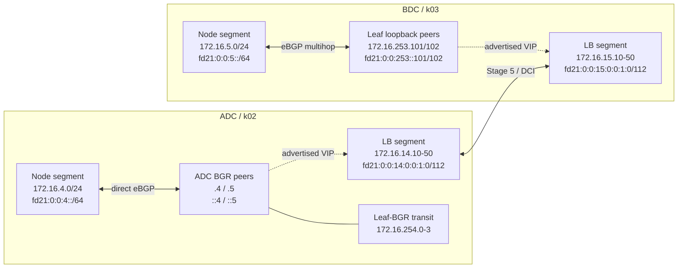

# Cilium ラボ パラメータ・アドレス割り当て台帳

## 0. 目的と状態

この文書は、`adc-k02` と `bdc-k03` の Cilium、Hubble、Tetragon、Cluster Mesh 構築で使用する
固定パラメータ、実行時取得値、予約アドレスを一元管理する As-designed 台帳である。

2026-08-23 時点では文書上の割り当てであり、稼働中の Containerlab、kind Node、NX-OS には
未反映の値を含む。実装後は実測値を確認し、状態を `Validated` へ更新する。

| 状態 | 意味 |
|---|---|
| `Existing` | 現行 topology または公開 config に存在する値 |
| `Assigned` | 設計値として割り当て済みだが、未適用の場合がある値 |
| `Reserved` | 将来用途のため確保し、初期構築では使用しない値 |
| `Runtime` | クラスタ作成後に自動取得し、Git へ固定値を保存しない値 |
| `Deferred` | 後続 Stage で用途または値を決める項目 |
| `Validated` | lab へ適用し、実測済みの値 |

## 1. Version と共通識別子

### 1.1 Version baseline

| Parameter | Assigned value | 状態 | 補足 |
|---|---|---|---|
| Containerlab | `v0.78.2` | `Validated` | 起動 host の実効 version。kind library `v0.31.0` を内蔵する |
| Containerlab 内蔵 kind library | `v0.31.0` | `Assigned` | 外部 kind CLI ではなく Containerlab binary が直接使用する |
| Kubernetes | `v1.35.5` | `Assigned` | kind Node image と `kubectl` の minor を合わせる |
| kind Node image | `kindest/node:v1.35.5@sha256:ce977ae6d65918d0b58a5f8b5e940429c2ce42fa3a5619ec2bbc60b949c0ac95` | `Assigned` | topology の kind 共通値として tag と digest を固定する |
| `kubectl` | `v1.35.5` | `Assigned` | 公式 archive と SHA256 を使用する |
| Cilium Helm chart | `1.20.1` | `Assigned` | render 後に component image digest も記録する |
| Cilium CLI | `v0.19.7` | `Assigned` | 公式 archive と SHA256 を使用する |
| Hubble CLI | `v1.19.4` | `Assigned` | 2026-08-30 時点の公式 latest。Relay `1.20.1` との version warning を記録した上で、healthcheck、3 Node 接続、flow 取得を確認する |
| Tetragon Helm chart | `1.7.0` | `Assigned` | image digest は Stage 4 の render 時に記録する |

### 1.2 Cluster と DNS

| Parameter | `adc-k02` | `bdc-k03` | 状態 |
|---|---|---|---|
| Cilium cluster name | `adc-k02` | `bdc-k03` | `Assigned` |
| Cilium cluster ID | `2` | `3` | `Assigned` |
| Kubernetes cluster domain | `cluster.local` | `cluster.local` | `Assigned` |
| MCS clusterset domain | `clusterset.local` | `clusterset.local` | `Assigned` |
| Cilium Cluster Mesh domain | `mesh.cilium.io` | `mesh.cilium.io` | `Assigned` |
| Maximum connected clusters | `255` | `255` | `Assigned` |
| Cluster Mesh API FQDN | `adc-k02.mesh.cilium.io` | `bdc-k03.mesh.cilium.io` | `Assigned` |
| Cluster Mesh cache TTL | `10m` | `10m` | `Assigned` |

Kubernetes cluster domain はクラスタごとの CoreDNS が管理するため、両クラスタで同じ
`cluster.local` を使用する。Cluster Mesh の一意性は cluster name、cluster ID、Pod CIDR、Node IP で
確保する。MCS API を使用する Service は `clusterset.local` で公開する。

## 2. Kubernetes と Cilium 基盤

### 2.1 Cluster CIDR

| Parameter | `adc-k02` | `bdc-k03` | 状態 |
|---|---|---|---|
| Pod CIDR IPv4 | `10.202.0.0/16` | `10.203.0.0/16` | `Assigned` |
| Node PodCIDR mask IPv4 | `/24` | `/24` | `Assigned` |
| Service CIDR IPv4 | `10.102.0.0/16` | `10.103.0.0/16` | `Assigned` |
| Pod CIDR IPv6 | `fd00:10:202::/56` | `fd00:10:203::/56` | `Assigned` |
| Node PodCIDR mask IPv6 | `/64` | `/64` | `Assigned` |
| Service CIDR IPv6 | `fd00:10:102::/112` | `fd00:10:103::/112` | `Assigned` |
| IPAM mode | `kubernetes` | `kubernetes` | `Assigned` |
| IP family | dual-stack | dual-stack | `Assigned` |

Pod CIDR と Service CIDR は Kubernetes が管理する。固定 Pod IP や個別 Service ClusterIP をこの台帳で
手動割り当てせず、実測結果だけを As-built として記録する。

### 2.2 Datapath と MTU

| Parameter | Assigned value | 状態 |
|---|---|---|
| kind default CNI | disabled | `Assigned` |
| kube-proxy mode | `none` | `Assigned` |
| Cilium kube-proxy replacement | enabled | `Assigned` |
| Routing mode | tunnel | `Assigned` |
| Tunnel protocol | VXLAN | `Assigned` |
| Tunnel underlay | IPv4 | `Assigned` |
| Cilium／Pod MTU | `9000` | `Assigned` |
| kind Node Fabric interface MTU | `9100` | `Assigned` |
| NX-OS underlay／SVI MTU | `9216` | `Existing` |
| NX-OS Node-facing port-channel／member MTU | `9216` | `Assigned` |
| cEOS Fabric MTU | `9214` または既存値 `9216` | `Existing` |
| XDP acceleration | disabled | `Assigned` |

Node の `eth1`、`eth2`、`bond0`、`bond0.<local-VLAN>` は `9100` とする。Cilium Helm values では
自動検出に依存せず `MTU: 9000` を明示する。IPv4 VXLAN の 50 byte overhead と、外側の
EVPN/VXLAN encapsulation を含む Fabric path が `9214`／`9216` に収まることを受入確認する。

2026-08-23 の k02 実測では、Node Fabric interface は `9000`、ADC Leaf の Node-facing
port-channel／member は `1500` だった。VLAN `14`／`104` と VNI `10104` の MAC 学習は成立したが、
Fabric API は TCP 接続後の TLS handshake で timeout した。同日に ADC Leaf 4 台の対象
port-channel へ MTU `9216` を running-config として適用し、member への自動反映、LACP `(P)`、trunk
allowed VLAN `1-4094` の維持を確認した。続けて k02 の全 Node で `eth1`、`eth2`、`bond0`、
`bond0.14`／`bond0.104` を MTU `9100` へ変更し、error／drop が `0` であることを確認した。worker と
worker2 から Fabric API の IPv4／IPv6 `/livez` が HTTP `200` を返し、TLS timeout は解消した。
2026-08-24 に ADC Leaf 4 台で running-config を startup-config へ保存した。path MTU boundary の
試験は Cilium／Pod MTU `9000` の導入後に実施する。

### 2.3 Kubernetes API endpoint

| 用途 | `adc-k02` | `bdc-k03` | 状態 |
|---|---|---|---|
| Cilium bootstrap host | control-plane `eth0` IPv4 を自動取得 | control-plane `eth0` IPv4 を自動取得 | `Runtime` |
| Cilium bootstrap port | `6443` | `6443` | `Assigned` |
| Containerlab host の `kubectl` | kind kubeconfig の `127.0.0.1:<port>` | kind kubeconfig の `127.0.0.1:<port>` | `Runtime` |
| Fabric API IPv4 | `172.16.4.11:6443` | `172.16.5.11:6443` | `Assigned` |
| Fabric API IPv6 | `[fd21:0:0:4::1:1]:6443` | `[fd21:0:0:5::1:1]:6443` | `Assigned` |

Kubernetes API は Cilium LB IPAM pool から割り当てない。Cilium の bootstrap endpoint を Cilium が
提供する LoadBalancer VIP に依存させないため、control-plane の直接 endpoint を使用する。
Fabric API address は kind 作成時から API server 証明書 SAN へ追加する。

kind Node の `eth0` は kind の Docker network が管理するため固定せず、構築 driver が
control-plane IPv4 を取得し、全 Node から TCP `6443` へ到達できることを確認してから生成済み
Helm values の `k8sServiceHost` へ渡す。取得値は Git 管理対象外とする。

## 3. ASN と BGP parameter

### 3.1 ASN

| Role | ASN | 状態 |
|---|---:|---|
| ADC Fabric | `65001` | `Existing` |
| BDC Fabric | `65002` | `Existing` |
| ADC BGR | `65010` | `Assigned` |
| k01 MetalLB | `65011` | `Existing` |
| k02 Cilium | `65012` | `Assigned` |
| BDC logical BGR role on Leaf | `65020` | `Assigned` |
| BDC reserved | `65021` | `Reserved` |
| k03 Cilium | `65022` | `Assigned` |

BDC Leaf の BGP process ASN は `65002` を維持し、Cilium neighbor にだけ
`local-as 65020 no-prepend replace-as` を適用する。

### 3.2 BGP session parameter

| Parameter | k02 | k03 | 状態 |
|---|---|---|---|
| Network-side peer | `adc-bgrt0101/0102` | `bdc-lfsw0101/0102` | `Assigned` |
| Cluster Node 数 | `3` | `3` | `Assigned` |
| BGP speaker | worker 2 Node | worker 2 Node | `Assigned` |
| Control-plane BGP | label 不在で除外 | label 不在で除外 | `Assigned` |
| Transport | IPv4／IPv6 を別 session | IPv4／IPv6 を別 session | `Assigned` |
| Keepalive | `10` 秒 | `10` 秒 | `Assigned` |
| Hold time | `30` 秒 | `30` 秒 | `Assigned` |
| eBGP multihop | disabled | TTL `5` | `Assigned` |
| Maximum prefix | Neighbor／AF ごとに `64` | Neighbor／AF ごとに `64` | `Assigned` |
| eBGP maximum paths | `4` | `4` | `Assigned` |
| BFD | disabled | disabled | `Assigned` |
| MD5 authentication | disabled | disabled | `Assigned` |
| Graceful Restart | 初期構築では disabled | 初期構築では disabled | `Assigned` |
| Initial advertisement | LoadBalancer IP のみ | LoadBalancer IP のみ | `Assigned` |
| Pod CIDR advertisement | native routing profile まで無効 | native routing profile まで無効 | `Deferred` |

BGP Router ID と local address は追加アドレスを割り当てず、各 Node の Fabric IPv4／IPv6 を使用する。
通常用／planned-shut 用 `CiliumBGPClusterConfig` は `bgp-speaker=true` の Node だけを選択し、
`bgp-maintenance` の値で排他的に profile を切り替える。

## 4. LoadBalancer IPAM

### 4.1 Pool

| Cluster | Pool | IPv4 range | IPv6 range | Selector | 状態 |
|---|---|---|---|---|---|
| k02 | `k02-infra` | `172.16.14.10-172.16.14.19` | `fd21:0:0:14:0:0:1:0-fd21:0:0:14:0:0:1:ff` | `lb-pool=infra` | `Assigned` |
| k02 | `k02-app` | `172.16.14.20-172.16.14.50` | `fd21:0:0:14:0:0:1:100-fd21:0:0:14:0:0:1:ffff` | `lb-pool=app` | `Assigned` |
| k03 | `k03-infra` | `172.16.15.10-172.16.15.19` | `fd21:0:0:15:0:0:1:0-fd21:0:0:15:0:0:1:ff` | `lb-pool=infra` | `Assigned` |
| k03 | `k03-app` | `172.16.15.20-172.16.15.50` | `fd21:0:0:15:0:0:1:100-fd21:0:0:15:0:0:1:ffff` | `lb-pool=app` | `Assigned` |

Pool は重複させない。`defaultLBServiceIPAM: none` と
`loadBalancerClass: io.cilium/bgp-control-plane` を使用し、Cilium が管理する Service を明示する。
k02 の旧 MetalLB manifest は誤適用防止のため削除済みである。既存 k01 MetalLB pool の
`172.16.13.0/24`、`fd21:0:0:13::/64` と Cilium pool を分離する。

### 4.2 BGP 集約候補

| Cluster | IPv4 aggregate | IPv4 の未割り当て範囲 | IPv6 aggregate | 状態 |
|---|---|---|---|---|
| k02 | `172.16.14.0/26` | `.0-.9`、`.51-.63` | `fd21:0:0:14:0:0:1:0/112` | `Assigned` |
| k03 | `172.16.15.0/26` | `.0-.9`、`.51-.63` | `fd21:0:0:15:0:0:1:0/112` | `Assigned` |

IPv6 aggregate は pool range と一致するが、range 内の全 address が常時 Service に割り当てられるわけではない。
Cilium 公式文書には aggregate 内の未割り当て VIP への traffic が routing loop になる既知の問題があるため、
BGP resource 適用前に worker 2 Node へ上表の aggregate blackhole route を設定する。初回から Cilium 集約を
広告し、[Cilium Service VIP 経路集約の比較設計](bgp-route-aggregation-design.md)の合否試験で安全性を確認する。

### 4.3 固定 VIP

| Purpose | k02 IPv4 | k02 IPv6 | k03 IPv4 | k03 IPv6 | 状態 |
|---|---|---|---|---|---|
| Cluster Mesh API | `172.16.14.10` | `fd21:0:0:14:0:0:1:10` | `172.16.15.10` | `fd21:0:0:15:0:0:1:10` | `Reserved` |
| Hubble UI 一時公開 | `172.16.14.11` | `fd21:0:0:14:0:0:1:11` | `172.16.15.11` | `fd21:0:0:15:0:0:1:11` | `Reserved` |
| Gateway API | `172.16.14.12` | `fd21:0:0:14:0:0:1:12` | `172.16.15.12` | `fd21:0:0:15:0:0:1:12` | `Reserved` |
| Infra reserve | `172.16.14.13-172.16.14.19` | `fd21:0:0:14:0:0:1:13-fd21:0:0:14:0:0:1:ff` | `172.16.15.13-172.16.15.19` | `fd21:0:0:15:0:0:1:13-fd21:0:0:15:0:0:1:ff` | `Reserved` |
| Application | `172.16.14.20-172.16.14.50` | `fd21:0:0:14:0:0:1:100-fd21:0:0:14:0:0:1:ffff` | `172.16.15.20-172.16.15.50` | `fd21:0:0:15:0:0:1:100-fd21:0:0:15:0:0:1:ffff` | 動的割り当て |

固定 VIP を要求する Service は、Pool selector に一致する label と
`lbipam.cilium.io/ips` annotation の両方を指定する。
`infra` pool に一致する Service は動的割り当てを使用せず、必ず固定 VIP annotation を指定する。
IPv6 infra pool の `:0-:f` は初期用途なしの管理予約とする。

## 5. Egress Gateway

| Parameter | Assigned value | 状態 |
|---|---|---|
| Initial cluster | `adc-k02` | `Assigned` |
| Gateway Node A | `adc-k02-worker` | `Assigned` |
| Gateway Node A profile | `egress/gw-a`、初期選択 | `Assigned` |
| Gateway Node A IPv4／IPv6 | `172.16.4.31/24`／`fd21:0:0:4::3:1/64` | `Assigned` |
| Gateway Node B | `adc-k02-worker2` | `Assigned` |
| Gateway Node B profile | `egress/gw-b`、手動切替先 | `Assigned` |
| Gateway Node B IPv4／IPv6 | `172.16.4.32/24`／`fd21:0:0:4::3:2/64` | `Assigned` |
| Egress interface | Gateway A は `bond0.14`、Gateway B は `bond0.104` | `Assigned` |
| Policy field | IPv4／IPv6 の別 Policy で単一 `egressGateway` と Gateway 固有 `egressIP` を使用し、`interface` は指定しない | `Assigned` |
| Address owner | 運用者が Policy 適用前に Node へ設定する。Cilium による動的割り当ては行わない | `Assigned` |
| Selected namespace | `egress-probe` | `Assigned` |
| Selected Pod label | `lab.cilium.io/egress-policy=selected` | `Assigned` |
| Destination IPv4 | `172.16.0.0/24` | `Assigned` |
| Destination IPv6 | `fd21:0:0:1::/64` | `Assigned` |
| Excluded IPv4 | `172.16.0.1/32` | `Assigned` |
| Excluded IPv6 | `fd21:0:0:1::101/128` | `Assigned` |
| Expected observation server | `adc-t1sv0102`、`172.16.0.2`、`fd21:0:0:1::102` | `Existing` |

Egress IP は LoadBalancer pool から割り当てず、2 台の Gateway Node の Fabric interface に別々の secondary
address として事前設定する。Cilium は Node interface へ Egress IP を動的に追加しない。Node 再作成時にも
再現できる専用の idempotent script を実装し、Stage 2B の Policy 適用前に address の実在、IPv4 の ARP、
IPv6 の NDP、return route を Gateway ごとに確認する。

`gw-a`／`gw-b` は同時 active にせず、同名 Policy の排他的 profile として管理する。切替は明示的な apply が必要で、
既存 connection は切断される。外部側は IPv4／IPv6 とも 2 つの Egress IP を正当な送信元として扱う。

## 6. Segment 別ホスト割り当て

図の実線は BGP endpoint への接続、点線は Cilium から広告する LoadBalancer VIP を示す。
Stage 5 で DCI へ公開するのは、初期状態では Cluster Mesh API の固定 VIP だけとする。

### 6.1 k02 Node segment

#### `172.16.4.0/24`

| IPv4 | Prefix | Owner／Purpose | Interface | 状態 |
|---|---:|---|---|---|
| `172.16.4.1` | `/24` | ADC Leaf Anycast Gateway | `Vlan104` または同一 VNI の local SVI | `Existing` |
| `172.16.4.4` | `/24` | `adc-bgrt0101` Cilium peer | `Vlan104` | `Assigned` |
| `172.16.4.5` | `/24` | `adc-bgrt0102` Cilium peer | `Vlan104` | `Assigned` |
| `172.16.4.11` | `/24` | `adc-k02-control-plane` Node／Fabric API | `bond0.14` | `Existing` |
| `172.16.4.21` | `/24` | `adc-k02-worker` Node | `bond0.14` | `Existing` |
| `172.16.4.22` | `/24` | `adc-k02-worker2` Node | `bond0.104` | `Existing` |
| `172.16.4.31` | `/24` | k02 Egress Gateway A | `adc-k02-worker` の `bond0.14` secondary | `Assigned` |
| `172.16.4.32` | `/24` | k02 Egress Gateway B | `adc-k02-worker2` の `bond0.104` secondary | `Assigned` |

#### `fd21:0:0:4::/64`

| IPv6 | Prefix | Owner／Purpose | Interface | 状態 |
|---|---:|---|---|---|
| `fd21:0:0:4::1` | `/64` | ADC Leaf Anycast Gateway | `Vlan104` または同一 VNI の local SVI | `Existing` |
| `fd21:0:0:4::4` | `/64` | `adc-bgrt0101` Cilium peer | `Vlan104` | `Assigned` |
| `fd21:0:0:4::5` | `/64` | `adc-bgrt0102` Cilium peer | `Vlan104` | `Assigned` |
| `fd21:0:0:4::1:1` | `/64` | `adc-k02-control-plane` Node／Fabric API | `bond0.14` | `Existing` |
| `fd21:0:0:4::2:1` | `/64` | `adc-k02-worker` Node | `bond0.14` | `Existing` |
| `fd21:0:0:4::2:2` | `/64` | `adc-k02-worker2` Node | `bond0.104` | `Existing` |
| `fd21:0:0:4::3:1` | `/64` | k02 Egress Gateway A | `adc-k02-worker` の `bond0.14` secondary | `Assigned` |
| `fd21:0:0:4::3:2` | `/64` | k02 Egress Gateway B | `adc-k02-worker2` の `bond0.104` secondary | `Assigned` |

### 6.2 k03 Node segment

#### `172.16.5.0/24`

| IPv4 | Prefix | Owner／Purpose | Interface | 状態 |
|---|---:|---|---|---|
| `172.16.5.1` | `/24` | BDC Leaf Anycast Gateway | `Vlan105` | `Validated` |
| `172.16.5.11` | `/24` | `bdc-k03-control-plane` Node／Fabric API | `bond0.105` | `Existing` |
| `172.16.5.21` | `/24` | `bdc-k03-worker` Node | `bond0.105` | `Existing` |
| `172.16.5.22` | `/24` | `bdc-k03-worker2` Node | `bond0.105` | `Existing` |

#### `fd21:0:0:5::/64`

| IPv6 | Prefix | Owner／Purpose | Interface | 状態 |
|---|---:|---|---|---|
| `fd21:0:0:5::1` | `/64` | BDC Leaf Anycast Gateway | `Vlan105` | `Validated` |
| `fd21:0:0:5::1:1` | `/64` | `bdc-k03-control-plane` Node／Fabric API | `bond0.105` | `Existing` |
| `fd21:0:0:5::2:1` | `/64` | `bdc-k03-worker` Node | `bond0.105` | `Existing` |
| `fd21:0:0:5::2:2` | `/64` | `bdc-k03-worker2` Node | `bond0.105` | `Existing` |

k03 の IPv4 集約 route next-hop は `172.16.5.1`、IPv6 next-hop は `fd21:0:0:5::1` とする。
2026-08-23 に、全 k03 Node の route と両 BDC Leaf の `Vlan105` running／startup config が
この割り当てに一致することを確認した。

### 6.3 k02 LoadBalancer segment

#### `172.16.14.0/24`

| IPv4／Range | Owner／Purpose | 状態 |
|---|---|---|
| `172.16.14.0-172.16.14.9` | Pool 外 | 未割り当て |
| `172.16.14.10` | Cluster Mesh API | `Reserved` |
| `172.16.14.11` | Hubble UI 一時公開 | `Reserved` |
| `172.16.14.12` | Gateway API | `Reserved` |
| `172.16.14.13-172.16.14.19` | Infra VIP reserve | `Reserved` |
| `172.16.14.20-172.16.14.50` | Application VIP | 動的割り当て |
| `172.16.14.51-172.16.14.254` | Pool 外 | 未割り当て |

#### `fd21:0:0:14:0:0:1:0/112`

| IPv6／Range | Owner／Purpose | 状態 |
|---|---|---|
| `fd21:0:0:14:0:0:1:0-fd21:0:0:14:0:0:1:f` | Infra VIP low reserve | `Reserved` |
| `fd21:0:0:14:0:0:1:10` | Cluster Mesh API | `Reserved` |
| `fd21:0:0:14:0:0:1:11` | Hubble UI 一時公開 | `Reserved` |
| `fd21:0:0:14:0:0:1:12` | Gateway API | `Reserved` |
| `fd21:0:0:14:0:0:1:13-fd21:0:0:14:0:0:1:ff` | Infra VIP reserve | `Reserved` |
| `fd21:0:0:14:0:0:1:100-fd21:0:0:14:0:0:1:ffff` | Application VIP | 動的割り当て |

### 6.4 k03 LoadBalancer segment

#### `172.16.15.0/24`

| IPv4／Range | Owner／Purpose | 状態 |
|---|---|---|
| `172.16.15.0-172.16.15.9` | Pool 外 | 未割り当て |
| `172.16.15.10` | Cluster Mesh API | `Reserved` |
| `172.16.15.11` | Hubble UI 一時公開 | `Reserved` |
| `172.16.15.12` | Gateway API | `Reserved` |
| `172.16.15.13-172.16.15.19` | Infra VIP reserve | `Reserved` |
| `172.16.15.20-172.16.15.50` | Application VIP | 動的割り当て |
| `172.16.15.51-172.16.15.254` | Pool 外 | 未割り当て |

#### `fd21:0:0:15:0:0:1:0/112`

| IPv6／Range | Owner／Purpose | 状態 |
|---|---|---|
| `fd21:0:0:15:0:0:1:0-fd21:0:0:15:0:0:1:f` | Infra VIP low reserve | `Reserved` |
| `fd21:0:0:15:0:0:1:10` | Cluster Mesh API | `Reserved` |
| `fd21:0:0:15:0:0:1:11` | Hubble UI 一時公開 | `Reserved` |
| `fd21:0:0:15:0:0:1:12` | Gateway API | `Reserved` |
| `fd21:0:0:15:0:0:1:13-fd21:0:0:15:0:0:1:ff` | Infra VIP reserve | `Reserved` |
| `fd21:0:0:15:0:0:1:100-fd21:0:0:15:0:0:1:ffff` | Application VIP | 動的割り当て |

### 6.5 BDC BGP endpoint segment

#### `172.16.253.0/24`

| IPv4 | Prefix | Owner／Purpose | Interface | 状態 |
|---|---:|---|---|---|
| `172.16.253.0-172.16.253.100` | `/32` pool | BDC BGP infrastructure の未割り当て範囲 | 未割り当て | `Reserved` |
| `172.16.253.101` | `/32` | `bdc-lfsw0101` Cilium-facing endpoint | `loopback105`、VRF `tenant1-vpc1` | `Assigned` |
| `172.16.253.102` | `/32` | `bdc-lfsw0102` Cilium-facing endpoint | `loopback105`、VRF `tenant1-vpc1` | `Assigned` |
| `172.16.253.103-172.16.253.254` | `/32` pool | 将来の BDC BGP infrastructure | 未割り当て | `Reserved` |

#### `fd21:0:0:253::/64`

| IPv6 | Prefix | Owner／Purpose | Interface | 状態 |
|---|---:|---|---|---|
| `fd21:0:0:253::-fd21:0:0:253::100` | `/128` pool | BDC BGP infrastructure の未割り当て範囲 | 未割り当て | `Reserved` |
| `fd21:0:0:253::101` | `/128` | `bdc-lfsw0101` Cilium-facing endpoint | `loopback105`、VRF `tenant1-vpc1` | `Assigned` |
| `fd21:0:0:253::102` | `/128` | `bdc-lfsw0102` Cilium-facing endpoint | `loopback105`、VRF `tenant1-vpc1` | `Assigned` |
| `fd21:0:0:253::103-fd21:0:0:253::ffff` | `/128` pool | 将来の BDC BGP infrastructure | 未割り当て | `Reserved` |

### 6.6 ADC Leaf–BGR routed transit

#### `172.16.254.0/24`

| IPv4 | Prefix | Owner／Purpose | Interface | 状態 |
|---|---:|---|---|---|
| `172.16.254.0` | `/31` | `adc-bgrt0101` | Leaf–BGR routed link | `Existing` |
| `172.16.254.1` | `/31` | `adc-lfsw0101` | Leaf–BGR routed link | `Existing` |
| `172.16.254.2` | `/31` | `adc-bgrt0102` | Leaf–BGR routed link | `Existing` |
| `172.16.254.3` | `/31` | `adc-lfsw0102` | Leaf–BGR routed link | `Existing` |
| `172.16.254.4-172.16.254.254` | - | ADC BGR infrastructure reserve | 未割り当て |

この segment は既存の IPv4 routed transit 専用とし、Cilium LB IPAM pool または Egress IP を
割り当てない。対応する IPv6 transit は現行公開 config に存在しない。

## 7. 後続 Stage で割り当てる parameter

| Parameter | 決定時期 | 状態 |
|---|---|---|
| Application VIP の site-local route-map 詳細 | Stage 5 | `Deferred` |
| k03 local Egress Gateway Node／Egress IPv4／IPv6 | Stage 5 合格後の同時有効化試験前 | `Deferred` |
| k03 local Egress 外部 observation server | Stage 5 合格後の同時有効化試験前 | `Deferred` |
| Gateway API `.12` VIP の実使用 | Stage 6 | `Deferred` |
| Native routing の Pod CIDR advertisement | Stage 6 | `Deferred` |

Cluster Mesh API の DCI community は k02 `65012:510`、k03 `65022:510` に割り当て済みである。
Local Preference は既定 `100`、MED は未設定で開始する。Cluster Mesh／Hubble は共通 `cilium-ca` を使用し、
certificate は `cronJob` で 365 日、有効期限前の 4 か月周期で再生成する。詳細は
[Cluster Mesh Fabric／DCI 境界設計](clustermesh-fabric-dci-and-acceptance.md)を参照する。

## 8. 実装前チェック

1. `Existing` の値を topology と公開 config で再照合する。
2. `Assigned` の host address に対して、Node では ARP／NDP、NX-OS では route／ARP／ND の競合を確認する。
3. k02 の旧 MetalLB manifest が削除済みで、k01 の MetalLB manifest だけが残ることを確認する。
4. kind 作成前に Pod CIDR、Service CIDR、cluster name／ID、API certificate SAN を render する。
5. Node Fabric MTU `9100` と Fabric underlay MTU `9214`／`9216` の end-to-end path を確認する。
6. Helm chart と workload manifest を render し、使用 image tag／digest をこの台帳または version lock へ記録する。
7. 構築後に `Runtime` 値と実測 Node address を Git 管理外の実施記録へ保存し、設計台帳を更新する。

## 9. 参照 URL

- [Cilium LoadBalancer IPAM](https://docs.cilium.io/en/stable/network/lb-ipam/)
- [Cilium BGP Control Plane Resources](https://docs.cilium.io/en/stable/network/bgp-control-plane/bgp-control-plane-configuration/)
- [Cilium Egress Gateway](https://docs.cilium.io/en/stable/network/egress-gateway/egress-gateway/)
- [Cilium Routing](https://docs.cilium.io/en/stable/network/concepts/routing/)
- [Cilium Helm Reference](https://docs.cilium.io/en/stable/helm-values/)
- [Cilium Cluster Mesh Setup](https://docs.cilium.io/en/stable/network/clustermesh/clustermesh/)
- [Cilium Global Services](https://docs.cilium.io/en/stable/network/clustermesh/services/)
- [Cilium MCS API](https://docs.cilium.io/en/stable/network/clustermesh/mcsapi/)
- [Kubernetes DNS for Services](https://kubernetes.io/docs/concepts/services-networking/dns-pod-service/)
- [Containerlab k8s-kind](https://containerlab.dev/manual/kinds/k8s-kind/)
- [Containerlab Management Network](https://containerlab.dev/manual/network/)
