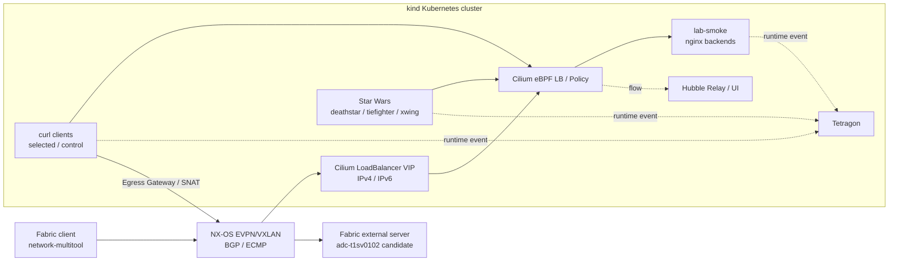
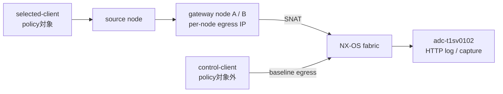
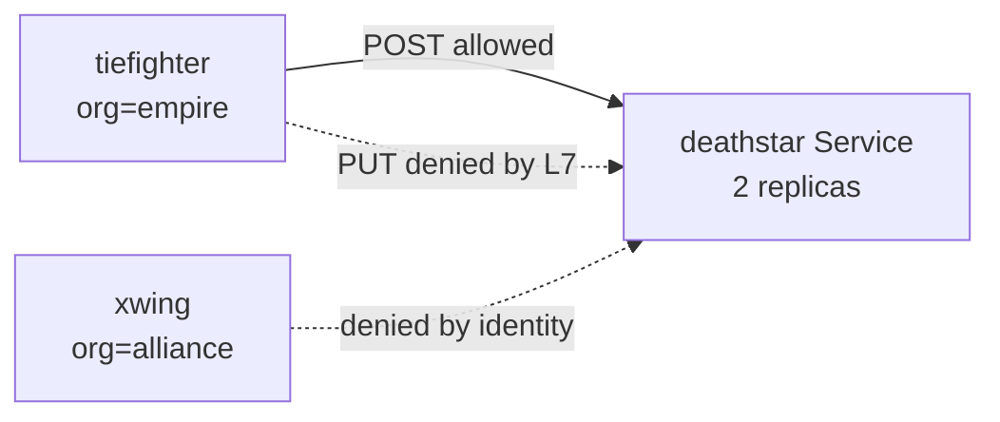
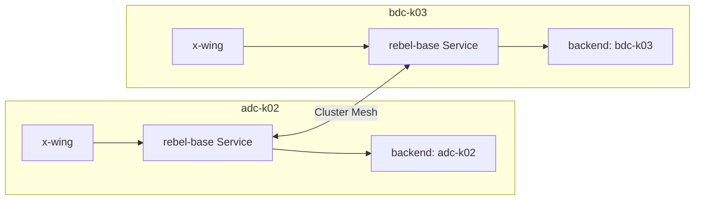

# Ciliumラボ検証ワークロード設計

## 1. 目的

この文書は、`nxos_fabric`上のkindクラスタでCilium、Hubble、Tetragonを確認するために、
どのworkloadを使い、どの通信を発生させ、何を証拠として合否判定するかを定義する。

[要件・設計台帳](requirements-and-design.md)が「何を満たすか」、
[構成設計と構成図](architecture.md)が「どの経路とcomponentで実現するか」、
[段階的な構築計画](build-plan.md)が「いつ構築するか」を扱うのに対し、この文書は
「どのworkloadで再現し、どの結果を期待するか」を扱う。

対象は次の2環境とする。

- single-site: `nxos_singlesite/adc-k02`
- multisite: `nxos_multisite/adc-k02`と`nxos_multisite/bdc-k03`

## 2. 基本方針

- 独自container imageは作成せず、Kubernetes、Cilium、Tetragonの公式例または公式試験imageを優先する。
- imageはtagだけに依存せず、採用version決定時にdigestを記録して固定する。
- IPv4とIPv6は一括して「dual-stack成功」とせず、familyごとに通信結果と経路を判定する。
- 正常系だけでなく、非選択Pod、deny、backend停止、node停止、経路断を比較対象にする。
- workloadの応答だけで合格とせず、Cilium/Hubble、node、NX-OS、外部serverの観測を対応付ける。
- 公式manifestを実行時にremote URLから直接適用せず、採用versionの内容をsite別directoryへ保存してレビューする。
- 試験workloadはplatformのfinal profileと分離し、必要な試験時に適用して削除できるlayerとする。
- runtime log、packet capture、Cilium sysdump、Tetragon eventはGit管理対象外へ保存する。

## 3. Workload suite

| Workload | 主用途 | 適用範囲 | ライフサイクル |
|---|---|---|---|
| `lab-smoke` | CNI、DNS、ClusterIP、NodePort、LoadBalancer | single-site / multisite各cluster | Stage中は保持可能 |
| `starwars` | CiliumNetworkPolicy、Hubble L3/L4/L7 | single-siteを先行し、必要時multisite | 試験時だけ適用 |
| `egress-probe` | Egress Gateway の選択、SNAT、障害 | single-site。Stage 5 合格後は multisite の同時有効化試験でも cluster ごとに使用 | Stage 2B または実験 profile だけ適用 |
| `tetragon-probe` | process、file、network event | single-siteを先行 | Stage 4だけ適用 |
| `clustermesh-demo` | Global Service、MCS API、partition | multisiteのみ | Stage 5だけ適用 |
| `cilium connectivity test` | 標準回帰、Hubble flow validation | 各Stageの完了時 | CLIが作成・削除 |

`starwars`の`xwing`でTetragonに必要なeventを十分発生できる場合、`tetragon-probe`は追加しない。
専用probeはfile accessやcapabilityなど、既存workloadでは安全に再現できない項目だけに使用する。

## 4. 全体構成



物理interface、VLAN/VNI、API endpoint、BGP peer、Hubble UI公開経路は
[構成設計と構成図](architecture.md)を正とする。この図ではworkloadと試験trafficだけを示す。

## 5. `lab-smoke`: 基礎疎通と Service LoadBalancer

### 5.1 構成

backend は digest 固定の `docker.io/library/nginx:1.29.4-alpine` を使用し、応答 body に Pod の hostname を
返して backend を識別する。client は他の validation workload と共通の digest 固定
`docker.io/curlimages/curl:8.17.0` を使用する。

| Resource | 設計 |
|---|---|
| Namespace | `cilium-lab-smoke` |
| Backend Deployment | `2 replicas`。`bgp-speaker=true` の worker 2 Node へ required anti-affinity で 1 Pod ずつ配置する |
| Backend protocol | 初期試験は HTTP／TCP。UDP と SCTP は別試験とする |
| Client Pod | 手動確認用。常時 traffic は生成せず、idle process だけを維持する |
| Service | ClusterIP、NodePort、`Cluster` LoadBalancer、`Local` LoadBalancer を別 resource にする |
| Labels | `app.kubernetes.io/name`、`app.kubernetes.io/component`、`cilium-lab/role` を固定する |

LoadBalancer 試験では、nginx の `$hostname` を返して新規 connection ごとの backend 選択を識別する。

### 5.2 Service 構成

| Service | IP family | Traffic policy | 目的 |
|---|---|---|---|
| `lab-smoke-clusterip` | `RequireDualStack` | cluster 内部 | ClusterIP と Service translation |
| `lab-smoke-nodeport` | `RequireDualStack` | `Cluster` | Fabric 側 NodePort と BPF NodePort |
| `lab-smoke-lb-cluster` | `RequireDualStack` | `Cluster` | LB IPAM、BGP、全 backend |
| `lab-smoke-lb-local` | `RequireDualStack` | `Local` | source IP 保持、local backend、広告差 |

LoadBalancer Service には、Cilium による割り当てを明示するため次を使用する。

- `loadBalancerClass: io.cilium/bgp-control-plane`
- `ipFamilyPolicy: RequireDualStack`
- `ipFamilies: [IPv4, IPv6]`

`lab-smoke-lb-cluster` と `lab-smoke-lb-local` は `lb-pool=app` で `k02-app` または
`k03-app` を選び、VIP は動的に割り当てる。固定 VIP の `lbipam.cilium.io/ips` annotation は
infra Service だけに使用する。同じ backend を選ぶ 2 つの LoadBalancer Service を使い、
`externalTrafficPolicy: Cluster` と `Local` の差だけを比較できるようにする。

### 5.3 通信と受入項目

| Test ID | Source | Destination | Expected |
|---|---|---|---|
| `W-SMOKE-01` | backend Pod | 同一node Pod IP | IPv4/IPv6とも成功 |
| `W-SMOKE-02` | backend Pod | 異なるnode Pod IP | IPv4/IPv6とも成功し、fabric側VXLANを確認できる |
| `W-SMOKE-03` | curl client | ClusterIP DNS名 | A/AAAA解決とHTTP成功 |
| `W-SMOKE-04` | Fabric client | NodePort | fabric interfaceで受信し、backendへ到達する |
| `W-SMOKE-05` | Fabric client | LB VIP | IPv4/IPv6 VIPがBGP経由で到達する |
| `W-SMOKE-06` | Fabric client | `Cluster`/`Local` VIP | backend、source IP、広告nodeの差を説明できる |
| `W-SMOKE-07` | Fabric client | LB VIP | 複数connectionで複数backendを確認できる |
| `W-SMOKE-08` | Fabric client | LB VIP | backend/node停止時の収束とBGP変化を確認できる |

LB確認ではHTTP keep-aliveにより同じconnectionが同じbackendへ継続することを考慮する。
分散確認では新規TCP connectionを複数作り、応答hostname、NX-OS next-hop、Hubble flowを対応付ける。

## 6. `egress-probe`: Egress Gateway

### 6.1 構成



| Resource | 設計 |
|---|---|
| Namespace | `egress-probe` |
| `selected-client` | `CiliumEgressGatewayPolicy`のPod selectorに一致する |
| `control-client` | 同じnamespaceだがselectorに一致しない |
| External server | 既存の `adc-t1sv0102` を使用する |
| Traffic | HTTPを基本とし、IPv4/IPv6を`curl -4`/`curl -6`で分ける |

Gateway Node は `adc-k02-worker`／`adc-k02-worker2` とし、`gw-a` を初期 profile、`gw-b` を手動切替先とする。
Egress IP は Gateway ごとに
`172.16.4.31`／`fd21:0:0:4::3:1` と `172.16.4.32`／`fd21:0:0:4::3:2`、selected Pod の label は
`lab.cilium.io/egress-policy=selected` とする。destination は `172.16.0.0/24`、
`fd21:0:0:1::/64`、除外対象は `adc-t1sv0101` の `172.16.0.1/32`、
`fd21:0:0:1::101/128` とする。

Cilium は Egress IP を Node へ動的に割り当てない。Policy 適用前に worker の `bond0.14` と worker2 の
`bond0.104` へ IPv4／IPv6 の secondary address を設定して重複、ARP／NDP、return route を確認する。IPv4 Policy と
IPv6 Policy に分割し、選択中 profile の `egressGateway` に 1 Node と対応する `egressIP` を指定する。

外部serverはKubernetes ServiceやIngressを経由させず、実際にcluster外のFabric networkへ置く。
access logまたはpacket captureでremote addressを記録し、Cilium Egress Gatewayによるsource変換を
外部側から確認する。

### 6.2 通信と受入項目

| Test ID | Condition | Expected |
|---|---|---|
| `W-EGRESS-01` | policy適用前 | selected/controlともbaseline sourceで到達する |
| `W-EGRESS-02` | selected Pod→対象CIDR | 指定gatewayを通り、egress IPで観測される |
| `W-EGRESS-03` | control Pod→対象CIDR | Egress Gateway policyが適用されない |
| `W-EGRESS-04` | selected Pod→除外CIDR | `excludedCIDRs`によりbaseline経路を使う |
| `W-EGRESS-05` | source nodeとgateway nodeが異なる | gateway nodeまでredirectされてSNATされる |
| `W-EGRESS-06` | 新規Pod作成直後 | policy反映までの時間とsource IPを記録する |
| `W-EGRESS-07` | gateway node停止 | 新規/既存connectionとfail-closed動作を記録する |
| `W-EGRESS-08` | policy削除/Helm rollback | baseline egressへ戻り、LB/BGPにregressionがない |
| `W-EGRESS-09` | `gw-a` から `gw-b` profile へ計画切替 | 既存 connection は切断を許容し、新規 connection が `.32`／`::3:2` で復旧する |
| `W-EGRESS-10` | `gw-a` Node を hard stop | 自動切替を前提にせず、blackhole／fail-closed と障害検知時間を記録する |
| `W-EGRESS-11` | 障害検知後に `gw-b` profile を適用 | 新規 connection が切替先 Gateway から成功し、手動復旧時間を記録できる |
| `W-EGRESS-12` | 両 Gateway が選択不能 | 対象 traffic が fail-closed で drop される |

通常の Cluster Mesh profile と `multisite-final` には、この workload と Egress Gateway 用 resource を
含めない。Stage 5 合格後の同時有効化試験では、k02／k03 に別々の namespace、Policy、local Gateway を
適用し、[専用試験文書](egress-clustermesh-coexistence-test.md)の Test ID と判定基準を使用する。

## 7. `starwars`: Network PolicyとHubble

Cilium v1.20.1公式例の`deathstar`、`tiefighter`、`xwing`を基に、namespaceを
`cilium-lab-policy`へ分離したmanifestを作成する。



| Test ID | Policy state | Traffic | Expected |
|---|---|---|---|
| `W-POLICY-01` | Policy なし | xwing／tiefighter → deathstar | 両方成功し、baseline の `FORWARDED` を保存する |
| `W-POLICY-02` | namespace default-deny ingress／egress | xwing／tiefighter → deathstar | 新規 connection が deny され、namespace 外へ影響しない |
| `W-POLICY-03` | DNS と L3/L4 allow | tiefighter → deathstar | DNS 解決と通信が成功し、`FORWARDED` になる |
| `W-POLICY-04` | identity／Service Account allow | xwing → deathstar | selector 不一致で timeout／drop、`DROPPED` になる |
| `W-POLICY-05` | FQDN CNP | 許可 FQDN／非許可 FQDN | 許可名だけ成功し、DNS query と policy verdict を関連付けられる |
| `W-POLICY-06` | HTTP L7 CNP | tiefighter の許可 `POST`／path | 成功し method／path を観測できる |
| `W-POLICY-07` | HTTP L7 CNP | tiefighter の拒否 `PUT`／path | deny と L7 verdict を観測できる |
| `W-POLICY-08` | Policy rollback | xwing／tiefighter → deathstar | 全 Policy 削除後に baseline へ戻る |

このworkloadはHubble Relay、Hubble CLI、Hubble UIで同じ通信を確認する。UIにtrafficを表示するための
連続実行は、明示的に開始・停止できるJobまたは短時間のscriptとし、無期限loopのDeploymentは初期状態に
含めない。

公式例のimageが可変tagを使う場合はそのまま採用せず、取得可能性、architecture、既知脆弱性を確認した
上でdigestを固定する。外部公開せず、検証namespaceに限定する。

## 8. Tetragon用event

Tetragon公式のexecution monitoring例と同様に、最初は`xwing`内で`bash`から`curl`を起動し、
process、parent/child、arguments、Pod/namespace/labelを取得する。

| Test ID | Action | Expected event |
|---|---|---|
| `W-TETRA-01` | `xwing` 内で shell → curl | `process_exec` と `process_exit`、parent／child、Pod metadata |
| `W-TETRA-02` | `emptyDir` の `/tmp/tetragon-lab-write` への write | 対象 path に限定した file access event と Pod metadata |
| `W-TETRA-03` | 同じ `/tmp/tetragon-lab-write` の read | read event と Pod metadata |
| `W-TETRA-04` | test Pod から外部 HTTP 接続 | `tcp_connect`／`tcp_close` event を同時刻の Hubble flow と対応付ける |
| `W-TETRA-05` | lab 専用 Pod で失敗する `chown` を実行 | `cap_capable` event を observe-only で取得し、host process は対象外になる |
| `W-TETRA-06` | 非対象 namespace で同操作 | filter 対象外となり、不要 event が抑制される |
| `W-TETRA-07` | Policy なし／限定 Policy／event load | CPU、memory、event drop の増分を比較できる |
| `W-TETRA-08` | Tetragon 停止／再開 | Cilium CNI、ClusterIP、LoadBalancer 通信が継続する |

file 試験では host filesystem や credential を対象にしない。専用 `TetragonProbe` を追加する場合は
`emptyDir` を mount した non-privileged Pod を基本とし、privilege event だけを専用 Pod と Service Account に
分離する。TracingPolicy は namespace、label、binary、path で限定する。低水準 hook の引数を独自に推測せず、
採用 version の公式 policy library／例を review してから manifest 化する。enforcement action はこの文書の
初期 suite に含めない。

Network Policy と Tetragon の適用順、追加 Test ID、判断 command、合否条件、rollback は
[Network Policy／Tetragon 検証計画](network-policy-and-tetragon-test-plan.md)を正本とする。

## 9. `clustermesh-demo`: Global ServiceとMCS API

Cilium v1.20.1公式例の`rebel-base`と`x-wing`を基に、同一name/namespaceのresourceを
`adc-k02`と`bdc-k03`へ配置する。各backendの応答からclusterを判別できる状態にする。



最初にCilium固有のGlobal Serviceを確認し、その後MCS APIを別resource名で確認する。両方式を同じ
Serviceへ重ねず、どちらの機構でbackendが同期されたか判別できるようにする。

| Test ID | Feature/condition | Expected |
|---|---|---|
| `W-MESH-01` | Global Serviceを両clusterで共有 | local/remote両backendから応答する |
| `W-MESH-02` | `service.cilium.io/shared: "false"` | 対向clusterへの共有差を確認できる |
| `W-MESH-03` | local affinity | local backendを優先し、消失時のremote動作を記録する |
| `W-MESH-04` | MCS `ServiceExport` | `ServiceImport`とderived Serviceが生成される |
| `W-MESH-05` | `clusterset.local` DNS | 両clusterから名前解決・接続できる |
| `W-MESH-06` | remote backend停止 | local serviceを維持し、backend同期が更新される |
| `W-MESH-07` | DCIまたはCluster Mesh API断 | data/control planeの失敗を区別できる |
| `W-MESH-08` | partition復旧 | identity、service/backendが再同期する |

Global Serviceのremote cluster cacheは設定によってlast-known backendを保持し得るため、障害試験では
即時にendpointが消えることを前提にせず、採用する`clustermesh.cacheTTL`と実測時間を記録する。

## 10. `cilium connectivity test`

手作りworkloadだけでCiliumの標準試験を代替しない。各Stage完了時にCilium CLIの
`cilium connectivity test`を実行し、`lab-smoke`の経路固有試験と組み合わせる。

| 実施時点 | 主な範囲 |
|---|---|
| Stage 1 | Pod、Service、DNS、policy、IPv4/IPv6のbaseline |
| Stage 2A | `--service-type LoadBalancer`を含むService経路。利用可能なoptionは採用CLIで再確認する |
| Stage 2B | Egress Gateway用testを採用versionで確認し、外部server実測を別に行う |
| Stage 3 | Hubble flow validationとpolicy verdict |
| Stage 4 | 試験中のTetragon負荷とevent dropも併記する |
| Stage 5 | `--multi-cluster <context>`でk02/k03間を確認する |
| Stage 6 同時有効化試験 | Cluster ごとの Egress Gateway 試験と multi-cluster 回帰を別々に実行する |

実行前に採用したCilium CLIの`cilium connectivity test --help`を保存し、使用imageは
`--print-image-artifacts`または同versionのsourceから記録する。既知のkind制約によりskipするtestは、
test名、理由、代替確認を構築記録へ残す。失敗時に取得したsysdumpはGitへ含めない。

## 11. Stage対応と適用順

| Stage | 適用するworkload | 削除/保持 |
|---|---|---|
| Stage 0 | manifest設計とimage/digest確認のみ | 適用しない |
| Stage 1 | `lab-smoke` | 次Stageへ保持可能 |
| Stage 2A | `lab-smoke`のLoadBalancer Service layer | Stage 2Bでも保持 |
| Stage 2B | `egress-probe` | Egress確認後に削除可能 |
| Stage 3 | `starwars` | Policy/Hubble確認後に削除可能 |
| Stage 4 | `starwars`再利用、必要時`TetragonProbe` | 確認後に削除 |
| Stage 5 | 両clusterの`lab-smoke`と`clustermesh-demo` | 確認後にdemoを削除可能 |
| Stage 6 同時有効化試験 | 両 cluster の `egress-probe` と既存 `clustermesh-demo` | 実験 overlay／Policy／probe を削除し、Stage 5 基準状態へ戻す |

各Stageでは次の順序を守る。

1. image pull可否、digest、manifest render、namespace、CIDR/VIP競合を事前確認する。
2. policyなしのbaseline workloadを適用して通信を確認する。
3. Service、Cilium CR、policyを1 layerずつ適用する。
4. 期待結果とHubble/Tetragon/NX-OSの観測を記録する。
5. failure条件を1つずつ加え、復旧後にbaselineを再確認する。
6. test resourceを削除または保持し、As-builtと残存resourceを記録する。

## 12. Manifest配置方針

single-siteとmultisiteはそれぞれ単独で起動できる状態を維持するため、実行に必要なmanifestを
site側directoryへ置く。共通化するのはdownload、render、verifyなどのscriptロジックに限定する。

```text
nxos_fabric/
├── scripts/cilium-lab/                     # 共通preflight/verify処理
├── nxos_singlesite/k8s_kind/k02/
│   └── cilium/manifests/workloads/
│       ├── lab-smoke/
│       ├── egress-probe/
│       ├── starwars/
│       └── tetragon-probe/                 # 必要時だけ
└── nxos_multisite/k8s_kind/
    ├── k02/cilium/manifests/workloads/
    │   ├── lab-smoke/
    │   ├── starwars/
    │   └── clustermesh-demo/
    └── k03/cilium/manifests/workloads/
        ├── lab-smoke/
        ├── starwars/
        └── clustermesh-demo/
```

このdirectoryは現時点の設計境界であり、Containerlab稼働中のtopology YAMLやcontainerには影響しない。
manifest作成後も、ユーザーが対象clusterと適用操作を明示するまで`kubectl apply`は実行しない。

## 13. Final profileとの境界

`singlesite-final`と`multisite-final`はplatform componentを収束させるprofileであり、試験demoを
常駐させるprofileではない。将来の収束driverは次を分けて扱う。

1. platform profileを適用する。
2. platformのReadyを待つ。
3. 選択したvalidation profileを適用する。
4. 受入確認を実行する。
5. validation profileを削除するか、`lab-smoke`だけ明示的に保持する。

| Profile | Workload方針 |
|---|---|
| `singlesite-final` | workloadを必須要素にしない。検証時に`lab-smoke`、`egress-probe`、`starwars`を選択する |
| `multisite-final` | workloadを必須要素にしない。両clusterへ`lab-smoke`、必要時`clustermesh-demo`を選択する |

これにより、空のclusterから最終状態へ一度に収束する場合も、段階構築と同じworkloadと受入条件を
再利用しつつ、検証用アプリを常時稼働させずに済む。

## 14. Versionと参照資料

- kind、Kubernetes、Cilium、Cilium CLI、Tetragonの採用versionは
  [参照URL台帳](references.md)のbaselineに従う。
- Cilium公式例は採用Cilium releaseのversion付きURLまたはGit tagから取得する。
- `stable`、`latest`、`master`は調査時の入口としてのみ使用し、manifestの実行元やimage指定には使用しない。
- image digest、manifest取得元commit/tag、取得日、変更点をsite別version lockまたはmanifest隣接READMEへ残す。
- 参照URLは各Stageの設計確定前と構築実施前に再確認する。
