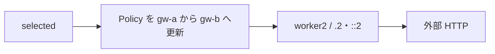
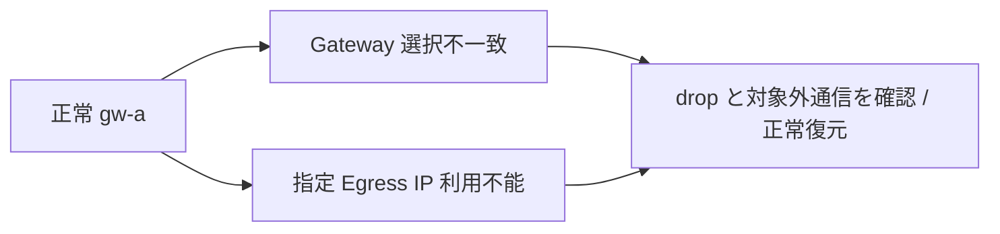
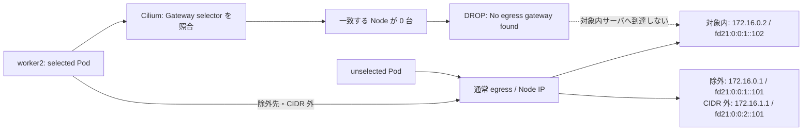
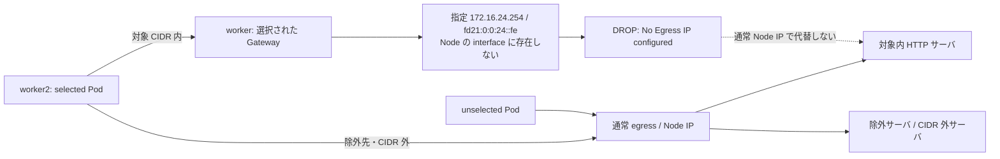
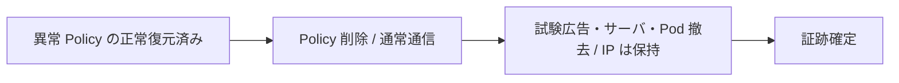
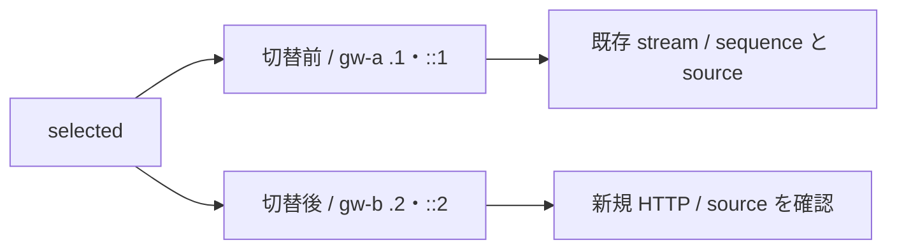

# Egress Gateway 計画切替・異常系試験

[共通の準備・撤去](egress-gateway-test-plan.md) と [実行環境](../runbooks/execution-environment-singlesite-k02.md) を確認する。
節番号・Test ID は分割前の番号を維持する。各節の開始条件に従い、必要な試験だけを実施する。
追加測定の変数・probe・capture の準備は [12.5 の共通準備](egress-gateway-functional-tests.md#egress-pod-delay) を参照する。

## 10. 端末 B → A：gw-b へ計画切替（W-EGRESS-09）



変更は Policy 2 個の `nodeSelector` と `egressIP`。worker2 の `172.16.24.2`／`fd21:0:0:24::2` へ切り替える。
自動 HA 試験ではなく、明示的な profile 更新後の新規接続を確認する。IPv4／IPv6 の 2 resource の更新は原子的ではない。

```bash
(
  set -euo pipefail
  kubectl --context "${KUBE_CONTEXT}" diff -k "${EG_ROOT}/gw-b" > "${EG_DIR}/gw-b.diff" || test "$?" -eq 1
  cat "${EG_DIR}/gw-b.diff"
)
```

差分確認後、切替時刻を記録して apply する。

```bash
(
  set -euo pipefail
  date -u +'%Y-%m-%dT%H:%M:%SZ' > "${EG_DIR}/gw-b-switch.time"
  kubectl --context "${KUBE_CONTEXT}" apply -k "${EG_ROOT}/gw-b"
  for agent in $(kubectl --context "${KUBE_CONTEXT}" -n kube-system get pods -l k8s-app=cilium -o jsonpath='{.items[*].metadata.name}'); do
    kubectl --context "${KUBE_CONTEXT}" -n kube-system exec "$agent" -c cilium-agent -- cilium-dbg bpf egress list > "${EG_DIR}/${agent}-gw-b-map.log"
    cat "${EG_DIR}/${agent}-gw-b-map.log"
  done
  log="$(mktemp "${EG_DIR}/gw-b-requests-XXXXXXXX.log")"
  for pod in selected unselected; do
    for dest in 172.16.0.2 '[fd21:0:0:1::102]' 172.16.0.1 '[fd21:0:0:1::101]' 172.16.1.1 '[fd21:0:0:2::101]'; do
      id="${EG_RUN_ID}-gw-b-${pod}-$(date +%s%N)"
      printf '\nid=%s pod=%s dest=%s\n' "$id" "$pod" "$dest"
      kubectl --context "${KUBE_CONTEXT}" -n egress-probe exec "$pod" -c client -- \
        curl --noproxy '*' -gfsS --connect-timeout 3 --max-time 5 \
        -H "X-Lab-Test-ID: $id" -w 'http_code=%{http_code}\n' "http://${dest}:8088/"
    done
  done > "$log" 2>&1
  cat "$log"
)
```

**端末 A：切替後の外部ログを取得する。**

```bash
(
  set -euo pipefail
  log="$(mktemp "${EG_DIR}/gw-b-access-XXXXXXXX.log")"
  for server in adc-t1sv0102 adc-t1sv0101 adc-t1sv0201; do
    docker exec "clab-nxos-fabric-singlesite-$server" cat "${EG_SERVER_DIR}/access.log"
  done > "$log"
  cat "$log"
)
```

全 12 件の ID を照合し、対象内の selected は `172.16.24.2`／`fd21:0:0:24::2`、明示除外・CIDR 外と unselected は baseline、いずれも HTTP 200 を確認する。
切替直後の未反映を含め、最初に新 Egress IP で成功した時刻を保存する。
この短い HTTP 試験で確認できるのは新規接続。既存の長時間接続が維持された、無停止で切り替わったとは判定しない。

### 12.1 異常系 2 ケースの共通準備



`W-EGRESS-12A` は Gateway 選択不一致、`W-EGRESS-12B` は選択した Gateway 上での Egress IP 利用不能を確認する。
従来の `W-EGRESS-12` を詳しく分けた lab 内の Test ID である。
2026-09-06 の実機結果は両ケース合格。以下の出力例はその実測に基づく。Node の停止や NIC の IP 削除は行わず、試験 Policy だけを変更する。

[公式の Gateway 選択・IP 設定仕様](https://docs.cilium.io/en/stable/network/egress-gateway/egress-gateway/#selecting-and-configuring-the-gateway-node) は、Gateway 選択不能時の drop と、指定 IP が Gateway に存在しない場合の `No Egress IP configured` を説明している。
正常 → 異常 → 正常へ戻す順に実施し、異常な Policy を残して次の試験へ進まない。

**前提となる正常構成：** `egress-probe` の selected／unselected は worker2、Gateway は worker。
両 worker の専用 IP／BGP 広報と、外部 3 台の TCP `8088` の今回専用 nginx を準備する。
一時リソースを撤去済みの場合は再準備が必要。実際の single-site の構成と一括実行記録は [異常系試験結果](../../../nxos_singlesite/operations/cilium-lab/2026-09-06/adc-k02/egress-invalid-result.md) に保存する。

**端末 B：保存先と正常構成を準備する。** `REPO_ROOT`／`KUBE_CONTEXT`／`EVIDENCE_DIR` は実行環境の値を設定済みとする。
以下は既存の試験 resource を流用・上書きせず、新しい試験枠として始める場合のコマンド。

```bash
(
  set -euo pipefail
  : "${REPO_ROOT:?}" "${KUBE_CONTEXT:?}" "${EVIDENCE_DIR:?}"
  EG_ROOT="${REPO_ROOT}/nxos_fabric/nxos_singlesite/k8s_kind/k02/cilium/manifests/validation/egress"
  mkdir -p "${EVIDENCE_DIR}/raw"
  FAILURE_DIR="$(mktemp -d "${EVIDENCE_DIR}/raw/egress-invalid-XXXXXXXX")"
  printf 'FAILURE_DIR=%s\n' "${FAILURE_DIR}"
  printf 'export FAILURE_DIR=%q\n' "$FAILURE_DIR" > "$FABRIC_ROOT/operations/cilium-lab/egress-invalid-current.env"
  kubectl --context "${KUBE_CONTEXT}" get ciliumegressgatewaypolicies -o json > "${FAILURE_DIR}/policies-before.json"
  jq -e '.items | length == 0' "${FAILURE_DIR}/policies-before.json"
  test -z "$(kubectl --context "${KUBE_CONTEXT}" get ns egress-probe --ignore-not-found -o name)"
  kubectl --context "${KUBE_CONTEXT}" get ciliumbgpadvertisements -o json > "${FAILURE_DIR}/ads-before.json"
  jq -e '[.items[] | select(.metadata.name | startswith("k02-egress"))] | length == 0' "${FAILURE_DIR}/ads-before.json"
  for node in adc-k02-worker adc-k02-worker2; do
    docker exec "$node" ip -j addr > "${FAILURE_DIR}/${node}-addresses.json"
  done
  for part in base bgp gw-a; do
    kubectl --context "${KUBE_CONTEXT}" kustomize "${EG_ROOT}/${part}" > "${FAILURE_DIR}/${part}.yaml"
  done
  kubectl --context "${KUBE_CONTEXT}" apply -k "${EG_ROOT}/base"
  kubectl --context "${KUBE_CONTEXT}" -n egress-probe wait --for=condition=Ready pod --all --timeout=120s
  bash "${REPO_ROOT}/nxos_fabric/scripts/cilium-lab/configure-egress-interface-init.sh" --context "${KUBE_CONTEXT}" --action apply
  kubectl --context "${KUBE_CONTEXT}" apply -k "${EG_ROOT}/bgp"
  kubectl --context "${KUBE_CONTEXT}" apply -k "${EG_ROOT}/gw-a"
)
```

以降は **両端末で**、表示された同じ保存先を設定する。`mktemp` を端末 A で再実行しない。

```bash
source "${FABRIC_ROOT}/operations/cilium-lab/egress-invalid-current.env"
: "${KUBE_CONTEXT:?}" "${FAILURE_DIR:?}"
test -d "${FAILURE_DIR}"
```

**端末 B：比較用 HTTP サーバを起動する。** 同じ tenant の対象内・明示除外・CIDR 外で、送信元と request ID を記録する。
既存 TCP `8088` があれば、そのサーバを停止せず準備を中断する。下記は各サーバの Fabric IP だけに待ち受ける。

```bash
(
  set -euo pipefail
  : "${FAILURE_DIR:?}"
  session="$(basename "${FAILURE_DIR}")"
  for server in adc-t1sv0102 adc-t1sv0101 adc-t1sv0201; do
    container="clab-nxos-fabric-singlesite-${server}"
    docker exec "$container" ss -lntp > "${FAILURE_DIR}/${server}-listen-before.log"
    if grep -q ':8088 ' "${FAILURE_DIR}/${server}-listen-before.log"; then
      echo "${server}: TCP 8088 は使用中です" >&2; exit 1
    fi
  done
  while read -r server ip4 ip6; do
    config="${FAILURE_DIR}/${server}-nginx.conf"
    cat > "$config" <<EOF
worker_processes 1;
pid /tmp/${session}/nginx.pid;
error_log /tmp/${session}/error.log;
events { worker_connections 128; }
http {
 log_format lab '\$time_iso8601 remote=\$remote_addr status=\$status test_id=\$http_x_lab_test_id';
 access_log /tmp/${session}/access.log lab;
 server { listen ${ip4}:8088; listen [${ip6}]:8088;
 location / { default_type text/plain; return 200 "remote=\$remote_addr test_id=\$http_x_lab_test_id\\n"; }
 }
}
EOF
    container="clab-nxos-fabric-singlesite-${server}"
    docker exec "$container" mkdir -p "/tmp/${session}"
    docker exec -i "$container" sh -c 'cat > "$1"' sh "/tmp/${session}/nginx.conf" < "$config"
    docker exec "$container" nginx -t -c "/tmp/${session}/nginx.conf"
    docker exec "$container" nginx -c "/tmp/${session}/nginx.conf"
  done <<'SERVERS'
adc-t1sv0102 172.16.0.2 fd21:0:0:1::102
adc-t1sv0101 172.16.0.1 fd21:0:0:1::101
adc-t1sv0201 172.16.1.1 fd21:0:0:2::101
SERVERS
)
```

**端末 B：正常 Policy を保存し、比較用通信コマンドを作る。** `requests.sh` は毎回、新しい curl 接続と固有 ID を使う。
成功／失敗をそのまま保存し、curl の非 0 終了を試験スクリプト全体の成功に読み替えない。
source port も固定・記録し、Hubble と同じ接続を照合する。同じ CASE の即時再実行では port 再利用が失敗することがあるため、失敗理由を確認して新しい未使用範囲へ変更する。

```bash
(
  set -euo pipefail
  : "${KUBE_CONTEXT:?}" "${FAILURE_DIR:?}"
  for family in ipv4 ipv6; do
    kubectl --context "${KUBE_CONTEXT}" get ciliumegressgatewaypolicy "egress-probe-${family}" -o json > "${FAILURE_DIR}/normal-${family}.json"
  done
  cat > "${FAILURE_DIR}/requests.sh" <<'SH'
#!/usr/bin/env bash
set -u
: "${KUBE_CONTEXT:?}" "${FAILURE_DIR:?}" "${CASE:?}"
mkdir -p "${FAILURE_DIR}/${CASE}"
date -u +'%Y-%m-%dT%H:%M:%SZ' > "${FAILURE_DIR}/${CASE}/start.time"
case "$CASE" in
  normal) port=49100 ;; no-gateway) port=49300 ;;
  no-egress-ip) port=49400 ;; restored-gateway) port=49500 ;;
  restored-ip) port=49600 ;; removed) port=49700 ;;
  *) echo "未知の CASE: $CASE" >&2; exit 1 ;;
esac
for pod in selected unselected; do
  for dest in 172.16.0.2 '[fd21:0:0:1::102]' 172.16.0.1 '[fd21:0:0:1::101]' 172.16.1.1 '[fd21:0:0:2::101]'; do
    id="${CASE}-${pod}-$(date +%s%N)"
    (
      printf 'id=%s pod=%s destination=%s source_port=%s\n' "$id" "$pod" "$dest" "$port"
      kubectl --context "${KUBE_CONTEXT}" -n egress-probe exec "$pod" -c client -- \
        curl --noproxy '*' -gfsS --connect-timeout 3 --max-time 5 --local-port "$port" \
        -H "X-Lab-Test-ID: ${id}" -w 'http_code=%{http_code}\n' "http://${dest}:8088/"
      printf 'request_exit=%s\n' "$?"
    ) > "${FAILURE_DIR}/${CASE}/${id}.log" 2>&1
    port=$((port + 1))
  done
done
cat "${FAILURE_DIR}/${CASE}"/*.log
SH
)
export CASE=normal
bash "${FAILURE_DIR}/requests.sh"
```

正常時は 12 件すべて HTTP 200。selected → 対象内だけが `172.16.24.1`／`fd21:0:0:24::1`、その他は worker2 の通常送信元である。
**ここで失敗している場合は異常系へ進まない。** Policy の反映を map と実通信で確認する。

**端末 A：Hubble の取得経路を用意する。** この port-forward は端末 A 内でのみ PID を管理する。使い終わったら終了する。

```bash
: "${KUBE_CONTEXT:?}" "${FAILURE_DIR:?}"
kubectl --context "${KUBE_CONTEXT}" -n kube-system port-forward \
  --address 127.0.0.1 service/hubble-relay 19445:80 \
  > "${FAILURE_DIR}/relay.log" 2>&1 &
export FAILURE_PF_PID=$!
sleep 2
kill -0 "${FAILURE_PF_PID}" && hubble status --server 127.0.0.1:19445
```

### 12.2 W-EGRESS-12A：Gateway 選択不一致

**目的：** 一致する Gateway がない場合、selected の対象内通信が通常 egress へ逃げずに拒否されることを確認する。
変更するのは Policy の Gateway 用 `nodeSelector` だけ。Pod selector、宛先、除外条件、Egress IP、Node label は維持する。



**端末 B：選択不一致に変更する。** 毎回生成する hostname 値に一致する Node が 0 台であることを先に確認する。

```bash
(
  set -euo pipefail
  : "${KUBE_CONTEXT:?}" "${FAILURE_DIR:?}"
  missing="egress-invalid-$(basename "${FAILURE_DIR}")"
  kubectl --context "${KUBE_CONTEXT}" get nodes -l "kubernetes.io/hostname=${missing}" -o json > "${FAILURE_DIR}/unmatched-nodes.json"
  jq -e '.items | length == 0' "${FAILURE_DIR}/unmatched-nodes.json"
  jq -n --arg value "$missing" '[{op:"replace",path:"/spec/egressGateway/nodeSelector",value:{matchLabels:{"kubernetes.io/hostname":$value}}}]' > "${FAILURE_DIR}/no-gateway-patch.json"
  cat "${FAILURE_DIR}/no-gateway-patch.json"
  for family in ipv4 ipv6; do
    kubectl --context "${KUBE_CONTEXT}" patch ciliumegressgatewaypolicy "egress-probe-${family}" \
      --type=json --patch-file "${FAILURE_DIR}/no-gateway-patch.json" --dry-run=server
    kubectl --context "${KUBE_CONTEXT}" patch ciliumegressgatewaypolicy "egress-probe-${family}" \
      --type=json --patch-file "${FAILURE_DIR}/no-gateway-patch.json"
  done
)
sleep 8
export CASE=no-gateway
bash "${FAILURE_DIR}/requests.sh"
```

**端末 A：対象通信の drop と非到達を確認する。** 端末 B の通信が終わった直後に実施し、Hubble の保存期間内に取得する。

```bash
export CASE=no-gateway
: "${KUBE_CONTEXT:?}" "${FAILURE_DIR:?}"
kubectl --context "${KUBE_CONTEXT}" -n egress-probe get pods -o wide | tee "${FAILURE_DIR}/${CASE}/pods.log"
kubectl --context "${KUBE_CONTEXT}" -n kube-system get pods -l k8s-app=cilium -o json > "${FAILURE_DIR}/${CASE}/agents.json"
for agent in $(jq -r '.items[].metadata.name' "${FAILURE_DIR}/${CASE}/agents.json"); do
  kubectl --context "${KUBE_CONTEXT}" -n kube-system exec "$agent" -c cilium-agent --     cilium-dbg bpf egress list > "${FAILURE_DIR}/${CASE}/${agent}-map.log"
done
hubble observe --server 127.0.0.1:19445 \
  --since "$(cat "${FAILURE_DIR}/${CASE}/start.time")" -o json \
  > "${FAILURE_DIR}/${CASE}/flows.jsonl" 2> "${FAILURE_DIR}/${CASE}/flows.stderr.log"
jq -c '(.flow // .) | select(.verdict == "DROPPED") |
  {time, node_name, source: .IP.source, destination: .IP.destination,
   tcp: .l4.TCP, reason: .drop_reason, description: .drop_reason_desc}' \
  "${FAILURE_DIR}/${CASE}/flows.jsonl"
for server in adc-t1sv0102 adc-t1sv0101 adc-t1sv0201; do
  docker exec "clab-nxos-fabric-singlesite-${server}" \
    cat "/tmp/$(basename "${FAILURE_DIR}")/access.log" > "${FAILURE_DIR}/${CASE}/${server}-access.log"
done
```

実測出力例（2026-09-06、上の jq と同じ項目の抜粋）：

```json
{"time":"2026-09-06T14:16:10.440717912Z","node_name":"adc-k02/adc-k02-worker2","source":"10.202.2.172","destination":"172.16.0.2","tcp":{"source_port":49300,"destination_port":8088,"flags":{"SYN":true}},"reason":194,"description":"NO_EGRESS_GATEWAY"}
```

source Pod のある worker2 で、対象サーバへ向かう TCP SYN が Gateway 選択不能により drop されたことを表す。
同じ接続に前段の `FORWARDED` も記録される場合があるが、後段の drop があるため外部への到達成功とは判断しない。
Pod IP と source port は実行ごとに変わるため、表示例の値を固定の判定条件にしない。

判定は次の 4 点をそろえる。背景通信の drop だけを根拠にしない。

- selected → 対象内の IPv4／IPv6 が失敗し、HTTP 応答を受けていない。
- 同じ時刻・source Pod IP・宛先 IP／port の drop があり、理由が `No egress gateway found`（数値 `194`）に対応する。
- 対象内サーバにそのリクエストの ID がない。**access log がないだけでは drop の証明にしない。**
- unselected → 対象内、selected → 除外先／CIDR 外は HTTP 200 で、baseline の送信元を維持する。

**端末 B：正常 Gateway に戻し、新しい接続で復旧を確認する。** 次の IP 利用不能試験の前に必ず成功を確認する。

```bash
(
  set -euo pipefail
  for family in ipv4 ipv6; do
    jq '[{op:"replace",path:"/spec/egressGateway",value:.spec.egressGateway}]' \
      "${FAILURE_DIR}/normal-${family}.json" > "${FAILURE_DIR}/restore-${family}.json"
    kubectl --context "${KUBE_CONTEXT}" patch ciliumegressgatewaypolicy "egress-probe-${family}" \
      --type=json --patch-file "${FAILURE_DIR}/restore-${family}.json"
  done
)
sleep 6
export CASE=restored-gateway
bash "${FAILURE_DIR}/requests.sh"
```

正常時と同じ送信元で 12 件成功すれば復旧確認が完了する。

### 12.3 W-EGRESS-12B：Gateway 上で Egress IP が利用不能

**目的：** Gateway は選べるが指定 SNAT IP がその Node に存在しない場合、対象通信が拒否されることを確認する。
Gateway は worker のまま、`egressIP` だけを未割当の `172.16.24.254`／`fd21:0:0:24::fe` に変更する。
これらを NIC に追加したり BGP 広報したりしない。正常な `.1`／`::1` の割当と広報は維持する。



**端末 B：IP 未割当を確認して、Policy だけ変更する。** 別環境ではアドレス台帳も照合する。

```bash
(
  set -euo pipefail
  for node in adc-k02-control-plane adc-k02-worker adc-k02-worker2; do
    docker exec "$node" ip -j addr > "${FAILURE_DIR}/${node}-invalid-ip-check.json"
    jq -e '[.[].addr_info[].local | select(. == "172.16.24.254" or . == "fd21:0:0:24::fe")] | length == 0' \
      "${FAILURE_DIR}/${node}-invalid-ip-check.json"
  done
  for family in ipv4 ipv6; do
    ip=172.16.24.254
    [ "$family" = ipv4 ] || ip=fd21:0:0:24::fe
    jq -n --arg ip "$ip" '[{op:"replace",path:"/spec/egressGateway/egressIP",value:$ip}]' > "${FAILURE_DIR}/invalid-ip-${family}.json"
    kubectl --context "${KUBE_CONTEXT}" patch ciliumegressgatewaypolicy "egress-probe-${family}" \
      --type=json --patch-file "${FAILURE_DIR}/invalid-ip-${family}.json" --dry-run=server
    kubectl --context "${KUBE_CONTEXT}" patch ciliumegressgatewaypolicy "egress-probe-${family}" \
      --type=json --patch-file "${FAILURE_DIR}/invalid-ip-${family}.json"
  done
)
sleep 8
export CASE=no-egress-ip
bash "${FAILURE_DIR}/requests.sh"
```

**端末 A：Gateway 側の drop を確認する。** source Node での選択不一致と区別して、観測 Node も読む。

```bash
export CASE=no-egress-ip
: "${KUBE_CONTEXT:?}" "${FAILURE_DIR:?}"
kubectl --context "${KUBE_CONTEXT}" -n egress-probe get pods -o wide | tee "${FAILURE_DIR}/${CASE}/pods.log"
kubectl --context "${KUBE_CONTEXT}" -n kube-system get pods -l k8s-app=cilium -o json > "${FAILURE_DIR}/${CASE}/agents.json"
for agent in $(jq -r '.items[].metadata.name' "${FAILURE_DIR}/${CASE}/agents.json"); do
  kubectl --context "${KUBE_CONTEXT}" -n kube-system exec "$agent" -c cilium-agent --     cilium-dbg bpf egress list > "${FAILURE_DIR}/${CASE}/${agent}-map.log"
done
hubble observe --server 127.0.0.1:19445 \
  --since "$(cat "${FAILURE_DIR}/${CASE}/start.time")" -o json \
  > "${FAILURE_DIR}/${CASE}/flows.jsonl" 2> "${FAILURE_DIR}/${CASE}/flows.stderr.log"
jq -c '(.flow // .) | select(.verdict == "DROPPED") |
  {time, node_name, source: .IP.source, destination: .IP.destination,
   tcp: .l4.TCP, reason: .drop_reason, description: .drop_reason_desc}' \
  "${FAILURE_DIR}/${CASE}/flows.jsonl"
for server in adc-t1sv0102 adc-t1sv0101 adc-t1sv0201; do
  docker exec "clab-nxos-fabric-singlesite-${server}" \
    cat "/tmp/$(basename "${FAILURE_DIR}")/access.log" > "${FAILURE_DIR}/${CASE}/${server}-access.log"
done
```

実測出力例（2026-09-06）：

```json
{"time":"2026-09-06T14:17:01.425530363Z","node_name":"adc-k02/adc-k02-worker","source":"10.202.2.172","destination":"172.16.0.2","tcp":{"source_port":49400,"destination_port":8088,"flags":{"SYN":true}},"reason":204,"description":"DROP_NO_EGRESS_IP"}
```

今回は selected Pod のある worker2 ではなく、Gateway として選択された worker で drop している。
Gateway の選択までは成立したが、指定 IP を SNAT に使えないことを示す。IPv6 でも同じ理由を確認した。

selected → 対象内の失敗に対応する `No Egress IP configured`（数値 `204`）と、サーバ非到達を確認する。
対象外 Pod・除外先・CIDR 外の通信は成功する。curl の失敗だけ、または agent の設定警告だけでは合格にしない。

**端末 B：正常 IP へ復旧し、比較通信をやり直す。** 正常 Policy の Gateway 設定を丸ごと復元するので、selector の取り残しも防ぐ。

```bash
(
  set -euo pipefail
  for family in ipv4 ipv6; do
    jq '[{op:"replace",path:"/spec/egressGateway",value:.spec.egressGateway}]' \
      "${FAILURE_DIR}/normal-${family}.json" > "${FAILURE_DIR}/restore-${family}.json"
    kubectl --context "${KUBE_CONTEXT}" patch ciliumegressgatewaypolicy "egress-probe-${family}" \
      --type=json --patch-file "${FAILURE_DIR}/restore-${family}.json"
  done
)
sleep 6
export CASE=restored-ip
bash "${FAILURE_DIR}/requests.sh"
```

12 件成功と正常時の指定送信元を確認する。稼働中 NIC の IP を消した場合の追従性や Node 障害は、この試験には含めない。

### 12.4 異常系試験後の撤去・証跡確定



**端末 B：今回準備した Policy を削除し、通常通信への復帰を確認する。**

```bash
(
  set -euo pipefail
  for family in ipv4 ipv6; do
    current="$(kubectl --context "${KUBE_CONTEXT}" get ciliumegressgatewaypolicy "egress-probe-${family}" -o jsonpath='{.metadata.uid}')"
    test "$current" = "$(jq -r '.metadata.uid' "${FAILURE_DIR}/normal-${family}.json")"
    kubectl --context "${KUBE_CONTEXT}" delete ciliumegressgatewaypolicy "egress-probe-${family}" --wait=true
  done
)
sleep 6
export CASE=removed
bash "${FAILURE_DIR}/requests.sh"
```

全件が通常送信元へ戻った後、今回専用の advertisement・サーバを撤去する。初期化 DaemonSet と IP は保持する。

```bash
(
  set -euo pipefail
  kubectl --context "${KUBE_CONTEXT}" delete ciliumbgpadvertisement k02-egress k02-egress-planned-shut
  sleep 12
  cilium bgp routes advertised ipv4 unicast --context "${KUBE_CONTEXT}" > "${FAILURE_DIR}/routes-after-ipv4.log"
  cilium bgp routes advertised ipv6 unicast --context "${KUBE_CONTEXT}" > "${FAILURE_DIR}/routes-after-ipv6.log"
  bash "${REPO_ROOT}/nxos_fabric/scripts/cilium-lab/configure-egress-interface-init.sh" --context "${KUBE_CONTEXT}" --action check
  for server in adc-t1sv0102 adc-t1sv0101 adc-t1sv0201; do
    container="clab-nxos-fabric-singlesite-${server}"
    docker exec "$container" cat "/tmp/$(basename "${FAILURE_DIR}")/access.log" > "${FAILURE_DIR}/${server}-access-final.log"
    docker exec "$container" nginx -c "/tmp/$(basename "${FAILURE_DIR}")/nginx.conf" -s quit
    docker exec "$container" ss -lntp > "${FAILURE_DIR}/${server}-listen-after.log"
  done
  kubectl --context "${KUBE_CONTEXT}" delete ns egress-probe --timeout=120s
  cilium status --context "${KUBE_CONTEXT}" > "${FAILURE_DIR}/status-after.log"
  cilium bgp peers --context "${KUBE_CONTEXT}" > "${FAILURE_DIR}/bgp-after.log"
  for dest in 172.16.14.20 172.16.14.21 '[fd21::14:0:0:1:100]' '[fd21::14:0:0:1:101]'; do
    docker exec clab-nxos-fabric-singlesite-adc-t1sv0102 \
      curl --noproxy '*' -gfsS --connect-timeout 3 --max-time 5 \
      -w 'http_code=%{http_code}\n' "http://${dest}/"
  done | tee "${FAILURE_DIR}/lb-after.log"
)
```

**端末 A：観測経路を終了する。**

```bash
if [ -n "${FAILURE_PF_PID:-}" ] && kill -0 "${FAILURE_PF_PID}" 2>/dev/null; then
  kill "${FAILURE_PF_PID}"
  wait "${FAILURE_PF_PID}" 2>/dev/null || true
fi
```

**端末 B：全取得終了後にハッシュを確定する。** NX-OS 常設設定と checksum の回避策は維持する。

```bash
(
  set -euo pipefail
  cd "${FAILURE_DIR}"
  find . -type f ! -name SHA256SUMS -print0 | sort -z | xargs -0 sha256sum > SHA256SUMS
  sha256sum -c SHA256SUMS
)
```

### 12.7 W-EGRESS-09 追加：計画切替中の既存 TCP 接続

**目的：** `gw-a → gw-b` の切替で、既存 TCP と新規 HTTP がどう変わるかを分けて観測する。Node は停止しない。



**端末 A：IPv4／IPv6 の stream を 45 秒間観測する。** サーバの送信時刻に加え、クライアントの受信時刻も JSON に保存する。

```bash
(
  set -u
  mkdir "$EXT_DIR/switch"
  pids=()
  for family in 4 6; do
    if [ "$family" = 4 ]; then dest=172.16.0.2; else dest='[fd21:0:0:1::102]'; fi
    eg_k -n egress-probe exec selected -c client -- /tmp/egress-probe stream \
      "http://${dest}:19090/stream?id=${EXT_ID}-stream-${family}" 45 \
      > "$EXT_DIR/switch/stream-$family.jsonl" 2> "$EXT_DIR/switch/stream-$family.stderr.log" &
    pids+=("$!")
  done
  echo '端末 B で切り替えてください。'
  for pid in "${pids[@]}"; do wait "$pid"; done
  cat "$EXT_DIR/switch"/stream-*.jsonl
)
```

**端末 B：開始から 8 秒後に Policy を切り替え、新規接続を繰り返す。**

```bash
(
  set -euo pipefail
  # 端末 A の stream 開始を確認してから実行する。
  test -d "$EXT_DIR/switch"
  sleep 8
  date -u +'%Y-%m-%dT%H:%M:%S.%NZ' > "$EXT_DIR/switch/change.time"
  eg_k apply -k "$EG_ROOT/gw-b" | tee "$EXT_DIR/switch/apply.log"
  eg_k -n egress-probe exec selected -c client -- /tmp/egress-probe newborn \
    http://172.16.0.2:19090/source 'http://[fd21:0:0:1::102]:19090/source' \
    > "$EXT_DIR/switch/new-connections.jsonl"
  eg_source switch-confirmed 172.16.24.2 fd21:0:0:24::2
)
```

**端末 A の終了後、端末 B：元の Gateway を復元する。**

```bash
eg_profile gw-a
```

**見方：** `stream-*.jsonl` の最後の sequence／受信時刻と `change.time`、`new-connections.jsonl` の最初の `.2`／`::2` を照合する。
45 秒の上限到達と接続 reset は区別する。2026-09-06 の測定では既存接続が切れ、新規接続が新 Egress IP で成功した。
