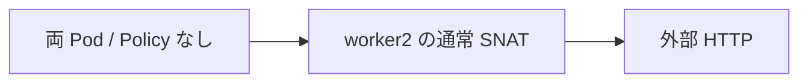
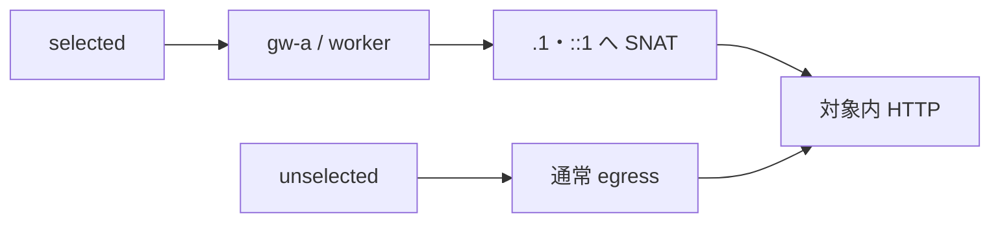
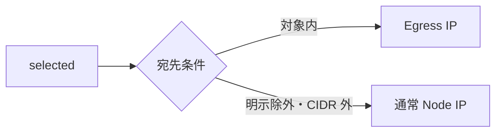
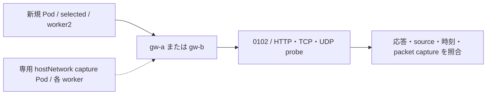
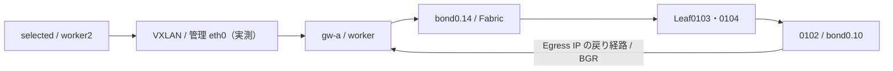

# Egress Gateway 基本機能・新規 Pod・経路試験

[共通の準備・撤去](egress-gateway-test-plan.md) と [実行環境](../runbooks/execution-environment-singlesite-k02.md) を確認する。
節番号・Test ID は分割前の番号を維持する。各節の開始条件に従い、必要な試験だけを実施する。

## 6. 端末 B → A：Policy 未適用 baseline（W-EGRESS-01）



**端末 B：** 両 Pod から対象内・明示除外・CIDR 外の宛先へ IPv4／IPv6 の HTTP を送る。
各リクエストに固有 ID を付け、終了コード、HTTP code、外部が見た送信元を保存する。

```bash
(
  set -euo pipefail
  : "${EG_DIR:?}" "${KUBE_CONTEXT:?}"
  log="$(mktemp "${EG_DIR}/baseline-XXXXXXXX.log")"
  for pod in selected unselected; do
    for dest in 172.16.0.2 '[fd21:0:0:1::102]' 172.16.0.1 '[fd21:0:0:1::101]' 172.16.1.1 '[fd21:0:0:2::101]'; do
      id="${EG_RUN_ID}-baseline-${pod}-$(date +%s%N)"
      printf '\nid=%s pod=%s dest=%s\n' "$id" "$pod" "$dest"
      rc=0
      kubectl --context "${KUBE_CONTEXT}" -n egress-probe exec "$pod" -c client -- \
        curl --noproxy '*' -gfsS --connect-timeout 3 --max-time 5 \
        -H "X-Lab-Test-ID: $id" -w 'http_code=%{http_code}\n' "http://${dest}:8088/" || rc=$?
      printf 'request_exit=%s\n' "$rc"
      test "$rc" -eq 0 || exit "$rc"
    done
  done > "$log" 2>&1
  cat "$log"
)
```

全 12 件が `http_code=200`／`request_exit=0`。`remote` は **実測した通常 SNAT の IP** として記録し、
Pod IP や Node の管理 IP だと決めつけない。これが比較基準となる。
1 件でも失敗したら、Policy を追加せず HTTP 待受、fabric 経路、戻り経路を切り分ける。

**端末 A：外部ログを有限取得する。** 待受コマンドを残さず、以降の各通信試験後もこのブロックを実行する。

```bash
(
  set -euo pipefail
  for server in adc-t1sv0102 adc-t1sv0101 adc-t1sv0201; do
    log="$(mktemp "${EG_DIR}/${server}-access-XXXXXXXX.log")"
    docker exec "clab-nxos-fabric-singlesite-${server}" cat "${EG_SERVER_DIR}/access.log" > "$log"
    cat "$log"
  done
)
```

端末 B の ID と access log の `test_id` が一致し、`status=200`、`remote` がレスポンスと同じなら対応付け成功。

## 8. 端末 B → A：gw-a の選択・SNAT（W-EGRESS-02／03／05）



**端末 B：変更内容を確認して適用する。** cluster-scoped の Policy 2 個で、対象を
`egress-probe` 内の selected label に絞り、IPv4／IPv6 ごとに `gw-a` と対応する Egress IP を指定する。
`gw-a` と `gw-b` は同じ Policy 名の別 profile であり、両方を続けて apply しない。

```bash
(
  set -euo pipefail
  kubectl --context "${KUBE_CONTEXT}" apply --dry-run=server -k "${EG_ROOT}/gw-a"
  kubectl --context "${KUBE_CONTEXT}" diff -k "${EG_ROOT}/gw-a" > "${EG_DIR}/gw-a.diff" || test "$?" -eq 1
  cat "${EG_DIR}/gw-a.diff"
)
```

差分を確認した後、適用する。

```bash
(
  set -euo pipefail
  kubectl --context "${KUBE_CONTEXT}" apply -k "${EG_ROOT}/gw-a"
  kubectl --context "${KUBE_CONTEXT}" get ciliumegressgatewaypolicies egress-probe-ipv4 egress-probe-ipv6 -o yaml > "${EG_DIR}/gw-a-applied.yaml"
  for agent in $(kubectl --context "${KUBE_CONTEXT}" -n kube-system get pods -l k8s-app=cilium -o jsonpath='{.items[*].metadata.name}'); do
    kubectl --context "${KUBE_CONTEXT}" -n kube-system exec "$agent" -c cilium-agent -- cilium-dbg bpf egress list > "${EG_DIR}/${agent}-gw-a-map.log"
    cat "${EG_DIR}/${agent}-gw-a-map.log"
  done
  kubectl --context "${KUBE_CONTEXT}" -n egress-probe get pods -o wide
)
```

選択された Gateway の agent で、map の source が `selected` の Pod IP、destination が対象 CIDR、
Gateway が worker、Egress IP が `172.16.24.1`／`fd21:0:0:24::1` に対応することを確認する。

2026-09-06 の `gw-a` 上の実測例。取得コマンドと出力を続けて示す（Pod 名・Pod IP は作成ごとに変わる）。

```bash
# Gateway worker 上の Cilium Agent を選び、その Agent の map を表示する。
GATEWAY_AGENT="$(kubectl --context "${KUBE_CONTEXT}" -n kube-system get pods \
  -l k8s-app=cilium --field-selector spec.nodeName=adc-k02-worker \
  -o jsonpath='{.items[0].metadata.name}')"
: "${GATEWAY_AGENT:?Gateway 上の Cilium Pod が見つかりません}"
kubectl --context "${KUBE_CONTEXT}" -n kube-system \
  exec "${GATEWAY_AGENT}" -c cilium-agent -- cilium-dbg bpf egress list
```

上記コマンドの出力例：

```text
Source IP             Destination CIDR      Egress IP        Gateway IP      Egress Ifindex
10.202.2.232          172.16.0.1/32         172.16.24.1      Excluded CIDR   0
10.202.2.232          172.16.0.0/24         172.16.24.1      172.18.0.2      0
fd00:10:202:2::2c92   fd21:0:0:1::101/128   fd21:0:0:24::1   Excluded CIDR   0
fd00:10:202:2::2c92   fd21:0:0:1::/64       fd21:0:0:24::1   172.18.0.2      0
```

`172.18.0.2` はこの環境の worker の Node InternalIP、`Egress IP` は外部で観測する SNAT 後の IP。
`Excluded CIDR` は通常 egress を使う除外宛先を表す。今回、Gateway 以外の agent では `Egress IP` が
`0.0.0.0`／`::` だったが、Gateway 欄は同じ worker を指し、外部通信は指定 Egress IP で成功した。
全 agent に同じ `Egress IP` が表示されることを合格条件にせず、Gateway 上の map と外部ログを照合する。
Pod／Policy の反映には遅延がある。該当 entry がまだないときは再取得し、entry 未確認のまま試験合格にしない。

```bash
(
  set -euo pipefail
  log="$(mktemp "${EG_DIR}/gw-a-requests-XXXXXXXX.log")"
  for pod in selected unselected; do
    for dest in 172.16.0.2 '[fd21:0:0:1::102]'; do
      id="${EG_RUN_ID}-gw-a-${pod}-$(date +%s%N)"
      printf '\nid=%s pod=%s dest=%s\n' "$id" "$pod" "$dest"
      kubectl --context "${KUBE_CONTEXT}" -n egress-probe exec "$pod" -c client -- \
        curl --noproxy '*' -gfsS --connect-timeout 3 --max-time 5 \
        -H "X-Lab-Test-ID: $id" -w 'http_code=%{http_code}\n' "http://${dest}:8088/"
    done
  done > "$log" 2>&1
  cat "$log"
)
```

**端末 A：外部サーバの記録を取得し、ID を照合する。**

```bash
(
  set -euo pipefail
  log="$(mktemp "${EG_DIR}/gw-a-access-XXXXXXXX.log")"
  docker exec clab-nxos-fabric-singlesite-adc-t1sv0102 cat "${EG_SERVER_DIR}/access.log" > "$log"
  cat "$log"
)
```

以下は 2026-09-06 の実測ログからの抜粋。試験 ID を HTTP 応答と access log で照合する。

```text
# selected → 対象サーバ IPv4
remote=172.16.24.1 test_id=egress-stage2b-xtu86wy1-gateway-a-selected-1788677294512478321
http_code=200
# selected → 対象サーバ IPv6
remote=fd21:0:0:24::1 test_id=egress-stage2b-xtu86wy1-gateway-a-selected-1788677294965202187
http_code=200
```

IPv6 の圧縮表記は違っても同じアドレスになり得るため、文字列だけで不一致としない。
`selected` だけ指定 Egress IP となり、`unselected` は手順 6 の baseline source を維持すれば
`W-EGRESS-02`／`03` は合格。source Node が worker2、Gateway が worker であることを map・配置・外部ログと
合わせて確認し、`W-EGRESS-05` を判定する。HTTP 200 でも `selected` の送信元が通常 Node IP のままなら不合格。
物理 interface／NX-OS path の厳密な確認は追加の packet capture・counter 測定として分ける。

## 9. 端末 B → A：除外宛先・CIDR 外の確認範囲（W-EGRESS-04）



選択対象の Pod でも `adc-t1sv0101` は `excludedCIDRs` に含まれるため通常 egress を使う。
対象外 Pod だけを試験しても除外条件の確認にはならない。

```bash
(
  set -euo pipefail
  log="$(mktemp "${EG_DIR}/excluded-requests-XXXXXXXX.log")"
  for dest in 172.16.0.1 '[fd21:0:0:1::101]'; do
    id="${EG_RUN_ID}-excluded-$(date +%s%N)"
    printf '\nid=%s dest=%s\n' "$id" "$dest"
    kubectl --context "${KUBE_CONTEXT}" -n egress-probe exec selected -c client -- \
      curl --noproxy '*' -gfsS --connect-timeout 3 --max-time 5 \
      -H "X-Lab-Test-ID: $id" -w 'http_code=%{http_code}\n' "http://${dest}:8088/"
  done > "$log" 2>&1
  cat "$log"
)
```

**端末 A：除外宛先の記録を取得する。**

```bash
(
  set -euo pipefail
  log="$(mktemp "${EG_DIR}/excluded-access-XXXXXXXX.log")"
  docker exec clab-nxos-fabric-singlesite-adc-t1sv0101 cat "${EG_SERVER_DIR}/access.log" > "$log"
  cat "$log"
)
```

ID を照合し、HTTP 200、送信元が baseline と同じであれば合格。
**端末 B：CIDR 外の別サーバへ送信する。** `172.16.1.1`／`fd21:0:0:2::101` は対象 CIDR 外であり、
手順 4 で起動した `adc-t1sv0201` を使う。selected／unselected とも通常の worker2 送信元で成功することを確認する。
Policy 未適用の手順 6、gw-b の手順 10、Policy 撤去後の手順 11 にも、同じ宛先の比較コマンドをその場に記載している。ここでは gw-a で実行する。

```bash
(
  set -euo pipefail
  log="$(mktemp "${EG_DIR}/outside-XXXXXXXX.log")"
  for pod in selected unselected; do
    for dest in 172.16.1.1 '[fd21:0:0:2::101]'; do
      id="${EG_RUN_ID}-outside-$(date +%s%N)"
      printf 'pod=%s dest=%s id=%s\n' "$pod" "$dest" "$id"
      kubectl --context "${KUBE_CONTEXT}" -n egress-probe exec "$pod" -c client -- \
        curl --noproxy '*' -gfsS --connect-timeout 3 --max-time 5 \
        -H "X-Lab-Test-ID: $id" -w 'http_code=%{http_code}\n' "http://${dest}:8088/"
    done
  done > "$log" 2>&1
  cat "$log"
  docker exec clab-nxos-fabric-singlesite-adc-t1sv0201 cat "${EG_SERVER_DIR}/access.log" > "$log.access"
  cat "$log.access"
)
```

HTTP 200、同じ ID の access log、通常送信元を照合する。IPv4 は `172.16.4.22`、IPv6 は `fd21::4:0:0:2:2`。
[2026-09-06 の CIDR 外の実測](../../../nxos_singlesite/operations/cilium-lab/2026-09-06/adc-k02/egress-cidr-outside-result.md) もこの比較条件で判定した。

<a id="egress-pod-delay"></a>

### 12.5 W-EGRESS-06：新規 Pod と追加測定の共通準備

**目的：** 12.4 で撤去した試験環境を再作成し、新規 Pod、実経路、既存 TCP、MTU 境界を順に確認する。
12.5〜12.10 は 1 セッションとして実施する。Node 障害系はスキップする。
12.8 の高負荷・SNAT port 枯渇は TI-004 が未解決の間は実施せず、12.9 の低レート MTU 切り分けへ進む。



**端末 B：測定プログラムを確認する。** [egress-probe.go](../../../scripts/cilium-lab/egress-probe.go) は標準ライブラリだけでビルドする。
`server` は最大 3,600 秒、`boundary` は各条件最大 5 packet。HTTP `19090`、TCP echo `19091`、UDP echo `19092`／`19093` を使う。
`boundary` の `socket_initial`／`socket_final`／`attempts` は、送信前後の socket の経路 MTU と PMTU 設定を記録する。
`load` の `socket_samples` は接続成立直後と終了直前の値で、TCP の MSS・再送累計も含む。
これらは読み取りのみで、MSS や断片化設定を変更しない。Pod interface の MTU だけで判定せず、経路 MTU、送受信数、エラー、capture を照合する。
コンパイラのない実行ホストには、[実環境の配布手順](../runbooks/execution-environment-singlesite-k02.md#egress-probe-build) でソースと照合済みのバイナリを事前配置する。
Go のある実行ホストで作成する場合のコマンドは以下。既に配布済みならこのビルドだけ省略し、次の `test -x` と `help` で確認する。

```bash
(
  set -euo pipefail
  : "${REPO_ROOT:?}"
  command -v go
  probe_bin="$REPO_ROOT/nxos_fabric/nxos_singlesite/k8s_kind/client/runtime/bin/egress-probe"
  CGO_ENABLED=0 GOOS=linux GOARCH=amd64 GO111MODULE=off go build -o "$probe_bin" \
    "$REPO_ROOT/nxos_fabric/scripts/cilium-lab/egress-probe.go"
  "$probe_bin" help
)
```

**端末 B：新しい証跡先、Pod、専用サーバを準備する。** 既存 Policy／namespace／試験用待受があると中断する。
上書きせず、その時点の証跡を確認する。サーバは 1 時間で終了するため、期限を超えたら新しい試験枠としてやり直す。

```bash
(
  set -euo pipefail
  : "${REPO_ROOT:?}" "${KUBE_CONTEXT:?}" "${KUBECONFIG:?}" "${EVIDENCE_DIR:?}"
  EG_ROOT="$REPO_ROOT/nxos_fabric/nxos_singlesite/k8s_kind/k02/cilium/manifests/validation/egress"
  EXT_BIN="$REPO_ROOT/nxos_fabric/nxos_singlesite/k8s_kind/client/runtime/bin/egress-probe"
  test -x "$EXT_BIN"
  "$EXT_BIN" help
  mkdir -p "$EVIDENCE_DIR/raw"
  EXT_DIR="$(mktemp -d "$EVIDENCE_DIR/raw/egress-extended-XXXXXXXX")"
  EXT_ID="$(basename "$EXT_DIR")"
  EXT_SERVER=clab-nxos-fabric-singlesite-adc-t1sv0102
  EXT_REMOTE="/tmp/$EXT_ID"
  for name in REPO_ROOT KUBE_CONTEXT KUBECONFIG EVIDENCE_DIR EG_ROOT EXT_BIN EXT_DIR EXT_ID EXT_SERVER EXT_REMOTE; do
    printf 'export %s=%q\n' "$name" "${!name}"
  done > "$EXT_DIR/session.env"
  cp "$EXT_DIR/session.env" "$REPO_ROOT/nxos_fabric/nxos_singlesite/operations/cilium-lab/egress-extended-current.env"
  kubectl --context "$KUBE_CONTEXT" get nodes -o json > "$EXT_DIR/nodes-before.json"
  kubectl --context "$KUBE_CONTEXT" -n kube-system get pods -l k8s-app=cilium -o json > "$EXT_DIR/agents-before.json"
  kubectl --context "$KUBE_CONTEXT" get ciliumegressgatewaypolicies -o json > "$EXT_DIR/policies-before.json"
  jq -e '.items | length == 0' "$EXT_DIR/policies-before.json"
  test -z "$(kubectl --context "$KUBE_CONTEXT" get ns egress-probe --ignore-not-found -o name)"
  kubectl --context "$KUBE_CONTEXT" get ciliumbgpadvertisements -o json > "$EXT_DIR/ads-before.json"
  jq -e '[.items[] | select(.metadata.name | startswith("k02-egress"))] | length == 0' "$EXT_DIR/ads-before.json"
  for node in adc-k02-worker adc-k02-worker2; do
    docker exec "$node" ip -j addr > "$EXT_DIR/$node-before.json"
  done
  docker exec "$EXT_SERVER" ss -lntup > "$EXT_DIR/server-listen-before.log"
  if grep -Eq ':1909[0-3][[:space:]]' "$EXT_DIR/server-listen-before.log"; then
    echo '試験ポートは使用中です。既存サービスを停止せず中断します。' >&2; exit 1
  fi
  cp "$REPO_ROOT/nxos_fabric/scripts/cilium-lab/egress-probe.go" "$EXT_DIR/"
  cp "$EXT_BIN" "$EXT_DIR/egress-probe"
  for part in base bgp gw-a gw-b; do
    kubectl --context "$KUBE_CONTEXT" kustomize "$EG_ROOT/$part" > "$EXT_DIR/$part.yaml"
  done
  kubectl --context "$KUBE_CONTEXT" apply -k "$EG_ROOT/base"
  kubectl --context "$KUBE_CONTEXT" -n egress-probe wait --for=condition=Ready pod --all --timeout=120s
  kubectl --context "$KUBE_CONTEXT" get ns egress-probe -o jsonpath='{.metadata.uid}' > "$EXT_DIR/namespace.uid"
  for container in "$EXT_SERVER" adc-k02-worker2; do
    docker exec "$container" mkdir -p "$EXT_REMOTE"
    docker exec -i "$container" sh -c 'cat > "$1" && chmod 755 "$1"' sh "$EXT_REMOTE/egress-probe" < "$EXT_BIN"
  done
  kubectl --context "$KUBE_CONTEXT" -n egress-probe exec -i selected -c client -- \
    sh -c 'cat > /tmp/egress-probe && chmod 755 /tmp/egress-probe' < "$EXT_BIN"
  docker exec "$EXT_SERVER" sh -c \
    'nohup "$1/egress-probe" server 3600 > "$1/server.log" 2>&1 & echo $! > "$1/server.pid"' sh "$EXT_REMOTE"
  sleep 2
  docker exec "$EXT_SERVER" curl --noproxy '*' -fsS http://127.0.0.1:19090/source
  printf 'session=%s\n' "$EXT_DIR"
)
```

**端末 B：共通関数を保存する。** 以下の関数にある実コマンドを、各試験で条件と保存名を指定して使う。
`eg_source` は送信元まで照合、`eg_profile` は Policy と BPF map と実通信を照合、`eg_lb` は既存 LB の 4 宛先を確認する。
`eg_capture` は両 worker・外部、MTU 試験では Leaf の入出力も同時に取得する。55 秒で自動終了し、空の取得を成功にしない。

```bash
source "${REPO_ROOT}/nxos_fabric/nxos_singlesite/operations/cilium-lab/egress-extended-current.env"
cat > "$EXT_DIR/functions.sh" <<'FUNCTIONS'
# 両端末で source する関数。変数は EXT_DIR/session.env から取得する。
eg_k() { kubectl --context "$KUBE_CONTEXT" --request-timeout=30s "$@"; }
eg_source() (
  set -euo pipefail
  phase="$1"; expected4="$2"; expected6="$3"
  mkdir -p "$EXT_DIR/$phase"
  for family in 4 6; do
    if [ "$family" = 4 ]; then dest=172.16.0.2; expected="$expected4";
    else dest='[fd21:0:0:1::102]'; expected="$expected6"; fi
    eg_k -n egress-probe exec selected -c client -- \
      curl --noproxy '*' -gfsS --connect-timeout 3 --max-time 5 \
      -H "X-Lab-Test-ID: ${EXT_ID}-${phase}-${family}" \
      "http://${dest}:19090/source" | tee "$EXT_DIR/$phase/source-$family.log"
    python3 - "$expected" "$EXT_DIR/$phase/source-$family.log" <<'PY'
import ipaddress,sys
source=open(sys.argv[2]).read().split('remote=',1)[1].split()[0]
assert ipaddress.ip_address(source)==ipaddress.ip_address(sys.argv[1]), source
PY
  done
)
eg_maps() (
  set -euo pipefail
  mkdir -p "$EXT_DIR/$1"
  for node in adc-k02-worker adc-k02-worker2; do
    agent="$(eg_k -n kube-system get pods -l k8s-app=cilium --field-selector "spec.nodeName=$node" -o jsonpath='{.items[0].metadata.name}')"
    test -n "$agent"
    eg_k -n kube-system exec "$agent" -c cilium-agent -- cilium-dbg bpf egress list | tee "$EXT_DIR/$1/$node-map.log"
  done
)
eg_profile() (
  set -euo pipefail
  profile="$1"
  if [ "$profile" = normal ]; then
    eg_k delete ciliumegressgatewaypolicy egress-probe-ipv4 egress-probe-ipv6 --ignore-not-found
    expected4=172.16.4.22; expected6=fd21::4:0:0:2:2
  else
    eg_k apply -k "$EG_ROOT/$profile"
    if [ "$profile" = gw-a ]; then suffix=1; else test "$profile" = gw-b; suffix=2; fi
    expected4="172.16.24.$suffix"; expected6="fd21:0:0:24::$suffix"
  fi
  sleep 6
  phase="profile-${profile}-$(date +%s%N)"
  eg_maps "$phase"
  eg_source "$phase" "$expected4" "$expected6"
)
eg_lb() (
  set -euo pipefail
  for dest in 172.16.14.20 172.16.14.21 '[fd21::14:0:0:1:100]' '[fd21::14:0:0:1:101]'; do
    docker exec "$EXT_SERVER" curl --noproxy '*' -gfsS --connect-timeout 3 --max-time 5 \
      -w 'http_code=%{http_code}\n' "http://${dest}/"
  done | tee "$EXT_DIR/lb-$1.log"
)
# 端末 A の取得を最大 55 秒に制限する。Ctrl+C だけに終了を依存させない。
eg_capture() (
  set -euo pipefail
  mode="$1"; phase="$2"
  cap="$EXT_DIR/$phase"; mkdir "$cap"
  if [ "$mode" = mtu ]; then filter='udp port 19092 or icmp or icmp6';
  else test "$mode" = route; filter='tcp port 19090 or udp port 8472'; fi
  pids=()
  for node in adc-k02-worker adc-k02-worker2; do
    pod="capture-${node}"
    eg_k -n egress-probe exec "$pod" -c capture -- \
      timeout -s INT 55 tcpdump -i any -nn -tttt -vv -l -s 180 "$filter" \
      > "$cap/$node.log" 2>&1 &
    pids+=("$!")
  done
  docker exec "$EXT_SERVER" timeout -s INT 55 \
    tcpdump -i bond0.10 -nn -tttt -vv -l -s 180 "$filter" > "$cap/server.log" 2>&1 &
  pids+=("$!")
  if [ "$mode" = mtu ]; then
    for leaf in adc-lfsw0103 adc-lfsw0104; do
      for nic in eth6 tap6 tap1 eth1; do
        docker exec "clab-nxos-fabric-singlesite-$leaf" timeout -s INT 55 \
          tcpdump -i "$nic" -nn -e -tttt -vv -l -s 180 \
          'udp port 19092 or icmp or icmp6 or (vlan and (udp port 19092 or icmp or icmp6))' \
          > "$cap/$leaf-$nic.log" 2>&1 &
        pids+=("$!")
      done
    done
  fi
  sleep 3
  for file in "$cap"/*.log; do
    grep -q 'listening on' "$file" || { cat "$file"; echo "取得未開始: $file" >&2; exit 1; }
  done
  printf '端末 B で送信してください。保存先=%s\n' "$cap"
  for pid in "${pids[@]}"; do
    rc=0; wait "$pid" || rc=$?
    case "$rc" in 0|124|130) ;; *) echo "capture_exit=$rc" >&2; exit 1;; esac
  done
  grep 'packets dropped by kernel' "$cap"/*.log
)
FUNCTIONS
```

**端末 A／B：両方で同じセッションと関数を読み込む。** 新しい端末でも必ず実行する。

```bash
source "${REPO_ROOT}/nxos_fabric/nxos_singlesite/operations/cilium-lab/egress-extended-current.env"
source "$EXT_DIR/functions.sh"
printf 'context=%s session=%s\n' "$KUBE_CONTEXT" "$EXT_DIR"
```

**端末 B：通常送信元 → Egress IP を比較し、観測用 Pod を用意する。** 過去の connectivity test の Pod を前提にしない。
今回専用の hostNetwork Pod 2 個だけに capture 用 capability を付け、12.10 で削除する。

```bash
(
  set -euo pipefail
  eg_source normal-before 172.16.4.22 fd21::4:0:0:2:2
  eg_lb before
  bash "$REPO_ROOT/nxos_fabric/scripts/cilium-lab/configure-egress-interface-init.sh" --context "$KUBE_CONTEXT" --action apply
  eg_k apply -k "$EG_ROOT/bgp"
  sleep 12
  cilium bgp routes advertised ipv4 unicast --context "$KUBE_CONTEXT" > "$EXT_DIR/advertised-ipv4.log"
  cilium bgp routes advertised ipv6 unicast --context "$KUBE_CONTEXT" > "$EXT_DIR/advertised-ipv6.log"
  eg_profile gw-a
  for node in adc-k02-worker adc-k02-worker2; do
    cat > "$EXT_DIR/capture-$node.yaml" <<YAML
apiVersion: v1
kind: Pod
metadata:
  name: capture-${node}
  namespace: egress-probe
spec:
  nodeName: ${node}
  hostNetwork: true
  tolerations:
    - operator: Exists
  containers:
    - name: capture
      image: quay.io/cilium/alpine-curl:v1.10.0@sha256:913e8c9f3d960dde03882defa0edd3a919d529c2eb167caa7f54194528bde364
      command: ["sh", "-c", "sleep 3600"]
      securityContext:
        runAsUser: 0
        capabilities:
          add: ["NET_RAW", "NET_ADMIN"]
YAML
    eg_k apply -f "$EXT_DIR/capture-$node.yaml"
    eg_k -n egress-probe wait --for=condition=Ready "pod/capture-$node" --timeout=120s
    eg_k -n egress-probe exec "capture-$node" -c capture -- sh -c 'command -v tcpdump; command -v timeout'
  done
  eg_k -n egress-probe get pods -o wide | tee "$EXT_DIR/pods-ready.log"
)
```

正常時は `normal-before` が worker2 の通常送信元、`gw-a` が `.1`／`::1`。異なる場合は次へ進まない。

**端末 B：新規 Pod を 3 回作り、起動直後の送信元を記録する。** Ready 待ち後の手動 curl ではなく、
測定プログラムを最初のプロセスとして起動する。各 Pod が IPv4／IPv6 を各 40 回送信する。

```bash
(
  set -euo pipefail
  image="$(eg_k -n egress-probe get pod selected -o jsonpath='{.spec.containers[0].image}')"
  mkdir "$EXT_DIR/newborn"
  for i in 1 2 3; do
    cat > "$EXT_DIR/newborn/$i.yaml" <<YAML
apiVersion: v1
kind: Pod
metadata:
  name: newborn-${i}
  namespace: egress-probe
  labels:
    app: egress-probe
    lab.cilium.io/egress-policy: selected
spec:
  nodeName: adc-k02-worker2
  restartPolicy: Never
  activeDeadlineSeconds: 120
  containers:
    - name: client
      image: ${image}
      command: ["/probe/egress-probe", "newborn", "http://172.16.0.2:19090/source", "http://[fd21:0:0:1::102]:19090/source"]
      volumeMounts:
        - name: probe
          mountPath: /probe
          readOnly: true
  volumes:
    - name: probe
      hostPath:
        path: ${EXT_REMOTE}
        type: Directory
YAML
    eg_k apply -f "$EXT_DIR/newborn/$i.yaml"
    eg_k -n egress-probe wait --for=jsonpath='{.status.phase}'=Succeeded "pod/newborn-$i" --timeout=140s
    eg_k -n egress-probe logs "newborn-$i" > "$EXT_DIR/newborn/$i.jsonl"
    eg_k -n egress-probe get pod "newborn-$i" -o json > "$EXT_DIR/newborn/$i-pod.json"
    jq -s '{requests: (map(select(.event=="request"))|length), errors: (map(select(.event=="request" and .status!=200))|length), first: (map(select(.event=="request"))|first)}' "$EXT_DIR/newborn/$i.jsonl"
    eg_k -n egress-probe delete pod "newborn-$i"
  done
)
```

**見方：** 各 Pod の `requests=80` と `errors` の件数を保存し、成功した全 `body` の `remote=` とサーバの ID を照合する。
プログラムの終了コード 0 は全通信成功を意味しない。初期失敗があれば最初の成功時刻までを別記し、各 family の最後の 5 回が指定 Egress IP で安定成功することを確認する。
初回から指定 Egress IP なら「反映前の通信を観測しなかった」。`elapsed_ms` はプログラム開始から応答までであり、Policy 反映遅延そのものではない。
先行試験では 240 件すべて指定 Egress IP、初回応答は 121〜276 ms だった。
今回の手順検証では 239/240 件成功、新規 Pod 1 の最初の IPv4 だけ 400 ms の接続期限で timeout。その後は全件成功した。
[TI-006](../test-issue-register.md#ti-006-newborn-first-request) として記録し、Policy 反映遅延が原因とは断定しない。
[公式の新規 Pod への反映遅延の説明](https://docs.cilium.io/en/stable/network/egress-gateway/egress-gateway/#delay-for-enforcement-of-egress-policies-on-new-pods) と、今回実測した timeout は区別する。

**端末 B：初期失敗と最終安定状態を分けて集計する。** 全送信元の確認と最後の 5 回の確認を自動化する。

```bash
python3 - "$EXT_DIR" <<'PYTEST'
import json,ipaddress,sys
from pathlib import Path
for f in sorted((Path(sys.argv[1])/'newborn').glob('*.jsonl')):
    rows=[json.loads(line) for line in f.read_text().splitlines()]
    rows=[r for r in rows if r['event']=='request']
    assert len(rows)==80
    for family in [4,6]:
        rs=[r for r in rows if ('[' in r['url'])==(family==6)]
        expected='172.16.24.1' if family==4 else 'fd21:0:0:24::1'
        good=[r for r in rs if r['status']==200]
        assert len(rs)==40
        assert all(ipaddress.ip_address(r['body'].split('remote=',1)[1].split()[0])==ipaddress.ip_address(expected) for r in good)
        assert all(r['status']==200 for r in rs[-5:]), 'last five not stable'
        print(f.name,family,'success',len(good),'failed',40-len(good),'first_success',good[0]['elapsed_ms'])
PYTEST
```


### 12.6 経路照合：Pod → Gateway → 外部サーバ

**目的：** BPF map の Gateway IP と実パケットの通過 NIC を照合する。`ip route get` だけで BPF の転送を断定しない。



**端末 A：取得を開始する。** `端末 B で送信してください` の表示を待つ。

```bash
eg_capture route route-capture
```

**端末 B：同じ接続を追えるよう source port と ID を指定する。** BPF map と Node の通常 route も保存する。

```bash
(
  set -euo pipefail
  eg_maps route-map
  for node in adc-k02-worker adc-k02-worker2; do
    docker exec "$node" ip -4 route get 172.16.0.2 > "$EXT_DIR/route-map/$node-ipv4.log"
    docker exec "$node" ip -6 route get fd21:0:0:1::102 > "$EXT_DIR/route-map/$node-ipv6.log"
    docker exec "$node" ip -br addr > "$EXT_DIR/route-map/$node-addresses.log"
  done
  for family in 4 6; do
    if [ "$family" = 4 ]; then dest=172.16.0.2; else dest='[fd21:0:0:1::102]'; fi
    eg_k -n egress-probe exec selected -c client -- \
      curl --noproxy '*' -gfsS --connect-timeout 3 --max-time 5 --local-port "5010$family" \
      -H "X-Lab-Test-ID: $EXT_ID-route-$family" "http://$dest:19090/source" \
      | tee "$EXT_DIR/route-map/request-$family.log"
  done
)
```

**端末 A：55 秒で終了後、出力を確認する。** `any` では同じ packet が複数行に出る。行数を packet 数と解釈しない。

```bash
cat "$EXT_DIR/route-capture"/*.log
```

IP、source port、TCP sequence、時刻を照合する。現在の実測は Node 間の外側が `172.18.0.6 → 172.18.0.2`／`eth0`、
Gateway → 外部が `bond0.14`。Fabric NIC を VXLAN underlay に使う設計とは異なるため、疎通成功と設計適合は別に記録する。
