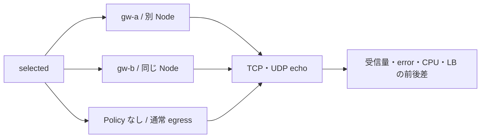
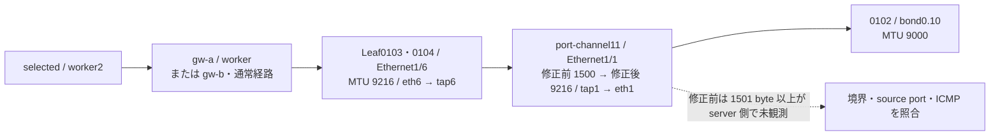

# Egress Gateway MTU・性能試験

[共通の準備・撤去](egress-gateway-test-plan.md) と [実行環境](../runbooks/execution-environment-singlesite-k02.md) を確認する。
節番号・Test ID は分割前の番号を維持する。各節の開始条件に従い、必要な試験だけを実施する。
追加測定の変数・probe・capture の準備は [12.5 の共通準備](egress-gateway-functional-tests.md#egress-pod-delay) を参照する。

### 12.8 追加負荷：TCP／UDP 比較と SNAT port 上限

**目的：** 大容量転送と多数の同時変換を確認する。**MTU 修正後の比較は実施済みだが、高レート UDP の損失が残る。通常の手順再開では下のスイッチを `no` とし、12.9 の低レート比較から確認する。性能比較の実施枠では `RUN_BULK_TESTS=yes` にする。今回の再試験は yes に相当する全 48 条件を実行した。**
小さい HTTP 成功を大容量通信・性能の合格へ拡張しない。再開時は MTU 修正後の通常 MSS での成功を先に確認する。



**端末 B：保留または上限付き比較を実行する。** 実施時は 3 経路 × 2 family × 2 回 × TCP 1／4 接続・UDP 2 サイズの 48 条件。
TCP は 256 KiB block／合計 100 Mbps、UDP は 1,200／8,000 byte payload／20 Mbps、各 5 秒。
プログラムは送信量を制限し、応答 timeout も記録する。TCP の完全な echo block 数を IP packet 損失率と解釈しない。

```bash
(
  set -euo pipefail
  RUN_BULK_TESTS=no
  if [ "$RUN_BULK_TESTS" != yes ]; then
    printf 'SKIP: TI-004 unresolved; MTU boundary first\n' > "$EXT_DIR/bulk-skipped.log"
    exit 0
  fi
  mkdir "$EXT_DIR/bulk"
  for profile in gw-a gw-b normal; do
    eg_profile "$profile"
    eg_lb "bulk-$profile-before"
    for family in 4 6; do
      if [ "$family" = 4 ]; then host=172.16.0.2; else host='[fd21:0:0:1::102]'; fi
      for repeat in 1 2; do
        for spec in 'tcp 1 262144 100 19091' 'tcp 4 262144 100 19091' 'udp 1 1200 20 19092' 'udp 1 8000 20 19092'; do
          read -r proto streams size rate port <<< "$spec"
          key="$profile-v$family-$repeat-$proto-$streams-$size"
          docker stats --no-stream adc-k02-worker adc-k02-worker2 > "$EXT_DIR/bulk/$key-before.log"
          eg_k -n egress-probe exec selected -c client -- /tmp/egress-probe load \
            "$proto$family" "$host:$port" 5 "$streams" "$size" "$rate" > "$EXT_DIR/bulk/$key.json"
          docker stats --no-stream adc-k02-worker adc-k02-worker2 > "$EXT_DIR/bulk/$key-after.log"
        done
      done
    done
    eg_lb "bulk-$profile-after"
  done
  eg_profile gw-a
)
```

**SNAT port 枯渇は別判定で保留する。** baseline 損失を説明できるまで `exhaust` を実行しない。
再開時の bounded command は次のとおり。最大 40,000 socket、30 秒保持、1 family ずつ。ローカル socket 上限と NAT 割当失敗は分けて記録する。

```bash
(
  set -euo pipefail
  RUN_PORT_LIMIT=no
  if [ "$RUN_PORT_LIMIT" != yes ]; then
    printf 'SKIP: normal path and load baseline unresolved\n' > "$EXT_DIR/port-limit-skipped.log"
    exit 0
  fi
  eg_profile gw-a
  agent="$(eg_k -n kube-system get pods -l k8s-app=cilium --field-selector spec.nodeName=adc-k02-worker -o jsonpath='{.items[0].metadata.name}')"
  mkdir "$EXT_DIR/port-limit"
  for family in 4 6; do
    if [ "$family" = 4 ]; then host=172.16.0.2; else host='[fd21:0:0:1::102]'; fi
    for command in 'bpf nat retries' 'metrics list -o json'; do
      read -ra args <<< "$command"
      eg_k -n kube-system exec "$agent" -c cilium-agent -- cilium-dbg "${args[@]}" > "$EXT_DIR/port-limit/v$family-before-${args[0]}.log"
    done
    eg_k -n egress-probe exec selected -c client -- /tmp/egress-probe exhaust \
      "udp$family" "$host:19093" 40000 30 > "$EXT_DIR/port-limit/v$family.jsonl"
    for command in 'bpf nat retries' 'metrics list -o json'; do
      read -ra args <<< "$command"
      eg_k -n kube-system exec "$agent" -c cilium-agent -- cilium-dbg "${args[@]}" > "$EXT_DIR/port-limit/v$family-after-${args[0]}.log"
    done
    eg_lb "port-limit-v$family-after"
  done
)
```

この保留ブロックは将来の準備であり、今回の実施・合格には含めない。負荷中の別 source／別宛先の対照と復旧待ち条件も、再開前に実施枠に合わせて確定する。

<a id="egress-mtu-boundary"></a>

### 12.9 MTU・パケットサイズ境界の切り分け

**次回の追加範囲：** [TI-007](../test-issue-register.md#ti-007-mtu-9100) の設定修正後、下記の既存サイズに
IP 全長 `8999`／`9000`／`9001` byte を加える。以下の実施済み結果とコマンドの範囲は `8900` byte まで。
`9000` byte は未検証で、`9001` byte は MTU 超過時の挙動を確認する対照条件とする。

**目的：** 送出レートを抑え、IP packet のサイズだけを変えて失敗境界と失われる区間を特定する。
UDP payload は IPv4 で全長 − 28、IPv6 で全長 − 48 byte。IPv4 は DF、IPv6 は送信元 fragmentation を抑止する。
`write` 成功と `read` timeout、`message too long`、ICMP 応答を区別する。MTU 設定の変更は含まない。



図の Leaf port は gw-a の経路。gw-b／通常経路は source Node 側 Leaf が変わるが、宛先サーバ側は同じ Leaf0103・0104。

**端末 B：3 経路 × 2 family × 10 サイズを測定する。** 各条件 3 packet の低レートで、最大サイズは 8,900 byte。

```bash
(
  set -euo pipefail
  mkdir "$EXT_DIR/boundary"
  for profile in gw-a gw-b normal; do
    eg_profile "$profile"
    for family in 4 6; do
      if [ "$family" = 4 ]; then dest=172.16.0.2:19092; else dest='[fd21:0:0:1::102]:19092'; fi
      for size in 1400 1499 1500 1501 1600 2000 2048 4000 8000 8900; do
        eg_k -n egress-probe exec selected -c client -- /tmp/egress-probe boundary \
          "udp$family" "$dest" "$size" 3 | tee "$EXT_DIR/boundary/$profile-v$family-$size.json"
      done
    done
    eg_lb "boundary-$profile"
  done
  eg_profile gw-a
  jq -s 'map({network,total_ip_bytes,payload,sent,acked,errors})' "$EXT_DIR/boundary"/*.json > "$EXT_DIR/boundary-summary.json"
)
```

**端末 A：境界周辺を同時取得する。** gw-a に復元済みの状態で開始する。全 capture の `listening on` を確認してから端末 B へ進む。

```bash
eg_capture mtu mtu-capture
```

**端末 B：1,500／1,501／1,600 byte を再送する。** この 6 条件は約 15 秒で終わり、55 秒の capture 内に収まる。

```bash
(
  set -euo pipefail
  mkdir "$EXT_DIR/mtu-requests"
  for family in 4 6; do
    if [ "$family" = 4 ]; then dest=172.16.0.2:19092; else dest='[fd21:0:0:1::102]:19092'; fi
    for size in 1500 1501 1600; do
      eg_k -n egress-probe exec selected -c client -- /tmp/egress-probe boundary \
        "udp$family" "$dest" "$size" 3 | tee "$EXT_DIR/mtu-requests/v$family-$size.json"
    done
  done
)
```

**端末 A：取得終了後、サイズ・source port と ICMP を確認する。**

```bash
cat "$EXT_DIR/mtu-requests"/*.json
grep -E 'length 1500|length 1501|length 1600|19092|too big|unreachable|frag needed|dropped by kernel' "$EXT_DIR/mtu-capture"/*.log
```

IPv6 の `payload length` は IPv6 header の 40 byte を含まない。IPv4 と同じ表示値だけで比べない。
`0 packets dropped by kernel` は capture 自体の取りこぼしについての値であり、経路全体の損失ゼロという意味ではない。

**端末 B：Leaf の実 MTU を確認する。** Linux の eth／tap の MTU と NX-OS の interface MTU は別に記録する。
環境別のログイン先は [実環境](../runbooks/execution-environment-singlesite-k02.md) に記載する。Leaf0103、Leaf0104 の **NX-OS CLI** で次を実行し、
次の Linux shell コマンドで接続と端末出力保存を行う。接続中に下の NX-OS コマンドを入力する。
1 台目で `exit` すると 2 台目へ接続する。認証情報は入力表示・ファイル保存しない。

```bash
(
  set -euo pipefail
  read -r -p 'NX-OS ログインユーザー名: ' NXOS_USER
  for leaf in adc-lfsw0103 adc-lfsw0104; do
    leaf_ip="$(docker inspect "clab-nxos-fabric-singlesite-$leaf" | jq -er '[.[0].NetworkSettings.Networks[].IPAddress | select(length>0)] | if length==1 then .[0] else error("管理 IP を一意に選択できません") end')"
    printf -v login_cmd 'ssh -F /dev/null -l %q %q' "$NXOS_USER" "$leaf_ip"
    script -q -e -c "$login_cmd" "$EXT_DIR/$leaf-mtu.log"
  done
)
```

```text
terminal length 0
show interface ethernet1/6
show interface ethernet1/1
show interface port-channel11
show interface vlan14
show interface vlan10
show running-config interface port-channel11
show running-config interface ethernet1/1
show running-config interface ethernet1/6
show running-config all | include jumbomtu
exit
```

**修正前の実測例（2026-09-06 の試験結果として保存）：**

```bash
kubectl --context "${KUBE_CONTEXT}" -n egress-probe exec selected -c client -- \
  /tmp/egress-probe boundary udp4 172.16.0.2:19092 1500 3
# 抜粋: {"total_ip_bytes":1500,"payload":1472,"sent":3,"acked":3,"errors":[]}
kubectl --context "${KUBE_CONTEXT}" -n egress-probe exec selected -c client -- \
  /tmp/egress-probe boundary udp4 172.16.0.2:19092 1501 3
# 抜粋: {"total_ip_bytes":1501,"payload":1473,"sent":3,"acked":0,"errors":["read: ... i/o timeout", ...]}
```

上記は JSON の読み方を示す抜粋で、元の取得ではバイナリ名が `egress-boundary`。ソースと全コマンドは証跡に残す。
修正前は全 3 経路・両 family で **1,500 byte まで 3/3、1,501 byte 以上 0/3**。
大きい packet は Leaf の Node 側で見えるが、サーバ向け tap／eth とサーバで見えなかった。
両 Leaf の `port-channel11`／`Ethernet1/1` が 1500、Node 側 `Ethernet1/6` は 9216。取得範囲で ICMP PTB／fragmentation needed は見つからなかった。
[MTU 結果と全コマンド](../../../nxos_singlesite/operations/cilium-lab/2026-09-06/adc-k02/egress-mtu-result.md)、[TI-004](../test-issue-register.md#ti-004-large-packets) に記録する。
**修正後の期待値と実測：** 3.1 の Po11 MTU 修正後は、同じ 60 条件すべてで `sent=3, acked=3`。
IP 全長 1,400〜8,900 byte、IPv4／IPv6、gw-a／gw-b／通常経路の計 180 packet が成功した。
MTU の失敗境界は解消したが、高負荷性能は別に判定する。最新は [修正後の結果](../../../nxos_singlesite/operations/cilium-lab/2026-09-06/adc-k02/egress-mtu-fix-result.md) を参照する。

**端末 B：通常 MSS の大きい TCP と低レート UDP を比較する。** 各 3 秒、3 経路 × 2 family。
TCP は 256 KiB／10 Mbps 上限、UDP は 1,200／8,000 byte payload／0.1 Mbps。全量回収と error 0 を先に確認する。

```bash
(
  set -euo pipefail
  mkdir "$EXT_DIR/lowrate"
  for profile in gw-a gw-b normal; do
    eg_profile "$profile"
    for family in 4 6; do
      if [ "$family" = 4 ]; then host=172.16.0.2; else host='[fd21:0:0:1::102]'; fi
      for spec in 'tcp 262144 10 19091' 'udp 1200 0.1 19092' 'udp 8000 0.1 19092'; do
        read -r proto size rate port <<< "$spec"
        file="$EXT_DIR/lowrate/$profile-$proto$family-$size.json"
        eg_k -n egress-probe exec selected -c client -- /tmp/egress-probe load \
          "$proto$family" "$host:$port" 3 1 "$size" "$rate" | tee "$file"
        jq -e '.sent_bytes > 0 and .sent_bytes == .received_bytes and .errors == 0' "$file"
      done
    done
    eg_lb "lowrate-$profile"
  done
  eg_profile gw-a
)
```

失敗があれば高負荷へ進まず、packet capture と error を確認する。性能比較を再開する場合は 12.8 の実行ブロックを同じセッションで使用し、実施スイッチの変更と実行条件を記録する。
