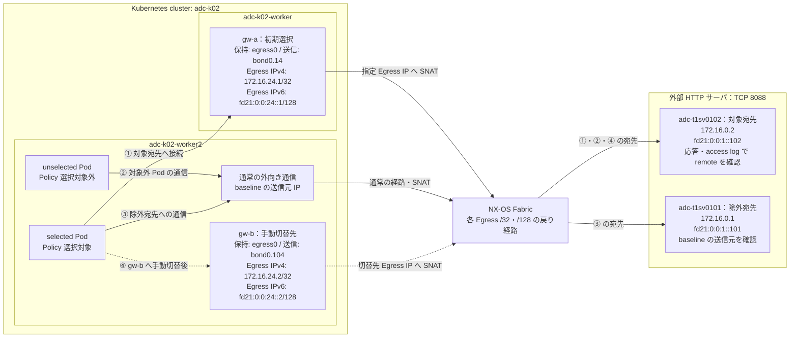
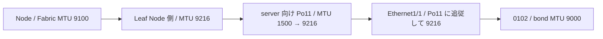
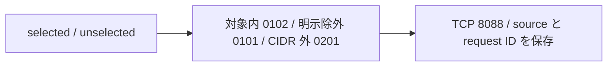
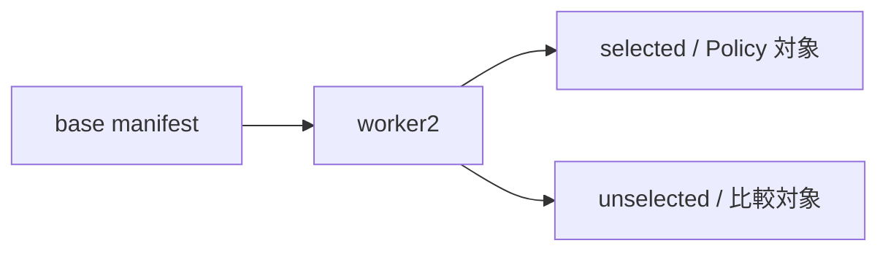
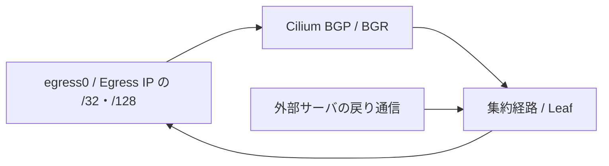
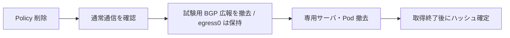
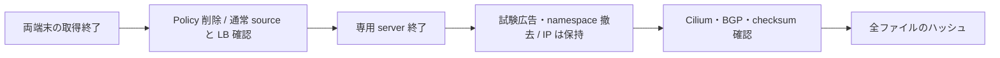

# single-site k02 Egress Gateway 構築・試験手順

この文書は共通の準備・撤去を扱う。節番号・Test ID は分割前の番号を維持する。
基本試験は「本書 2〜5 → [基本機能 6](egress-gateway-functional-tests.md) → 本書 7 →
[基本機能 8〜9](egress-gateway-functional-tests.md) → [計画切替 10](egress-gateway-failure-tests.md) → 本書 11」の順に読む。

| 目的 | 個別手順 | 準備・撤去 |
|---|---|---|
| baseline、SNAT、除外、新規 Pod、経路照合 | [基本機能](egress-gateway-functional-tests.md) | 基本試験は本書 2〜5・7／11。追加測定は個別手順 12.5／本書 12.10 |
| 計画切替、選択不能、既存 TCP 接続 | [計画切替・異常系](egress-gateway-failure-tests.md) | 異常系は 12.1〜12.4 で準備から撤去まで。既存 TCP は基本機能 12.5 の準備を共有 |
| TCP／UDP 負荷、SNAT port 上限、MTU 境界 | [MTU・性能](egress-gateway-performance-tests.md) | 基本機能 12.5 の準備を共有し、本書 12.10 で撤去 |

追加試験は本書 12 の実施条件を確認し、各節の開始状態を満たしてから実施する。

## 1. 目的・変更範囲・進め方

この試験では、**選択した Pod の外向き通信だけが Gateway Node を経由し、外部サーバから指定の
Egress IP に見えるか**を確認する。HTTP 成功だけでは SNAT の合格にせず、外部サーバの
`remote`（接続元 IP）と Cilium の Egress map を対応付ける。

本手順はリポジトリの `nxos_singlesite` / `adc-k02` 用 manifest を使用する。
既存の Egress Gateway feature を使い、試験 Pod、専用 dummy 上の IP、BGP 個別広報、Egress Policy、外部 HTTP 待受を追加する。
クラスタ再作成、Helm upgrade、kubelet の Node IP 変更はこの手順に含めない。
全体 connectivity test と、この機能試験の合否は分けて記録する。

設計の正本は [Egress 専用 IP・BGP 経路設計](../design/egress-gateway-routed-design.md)。LB 集約から独立した `/32`／`/128` を使う。

### 試験構成の概要

初期状態は `gw-a` を選択し、worker2 の Pod から別 Node の Gateway を経由する通信を確認する。
図の破線は `gw-b` へ手動切替した後の経路を表す。両 Gateway を同時に使用する構成や自動切替を表すものではない。



| 図の通信 | 外部サーバで確認すること | 対応する試験 |
|---|---|---|
| ① `selected` → 対象宛先 | HTTP が成功し、`remote` が `gw-a` の Egress IP になる。source Node と Gateway Node は異なる。 | `W-EGRESS-02`／`05` |
| ② `unselected` → 対象宛先 | HTTP が成功し、送信元は Policy 未適用時の baseline と同じ。 | `W-EGRESS-03` |
| ③ `selected` → 除外宛先 | Pod は選択対象でも、宛先の除外条件により baseline の送信元を維持する。 | `W-EGRESS-04` |
| ④ 切替後の `selected` → 対象宛先 | 新しい接続の `remote` が `gw-b` の Egress IP になる。 | `W-EGRESS-09` |

図は通信の役割と経路を示す概要で、Fabric 内の個々の機器・リンクは省略している。
試験前に両 Pod の baseline を記録し、Policy 撤去後もそこへ戻ることを確認する。
端末 A／B は操作・観測用で、このデータ通信経路には含めない。

| 手順 | Test ID | 操作・確認内容 |
|---|---|---|
| 2～5 | 準備 | 環境・証跡、feature、外部 HTTP サーバ、Pod 配置を確認する。 |
| 6 | `W-EGRESS-01` | Policy がない状態で送信元 IP と到達性を記録する。 |
| 7～8 | `W-EGRESS-13`、`02`／`03`／`05` | `gw-a` の Egress IP を準備し、選択対象だけが別 Node の Gateway で SNAT されることを確認する。 |
| 9 | `W-EGRESS-04` | 除外宛先と対象 CIDR 外では baseline が維持されることを確認する。 |
| 10 | `W-EGRESS-09` | `gw-b` へ明示的に切り替え、新規接続の送信元変化を確認する。 |
| 11 | `W-EGRESS-08`／`14` | Policy を撤去し、通信・BGP の復旧と後片付けを確認する。 |
| 12.1～12.4 | `W-EGRESS-12A`／`12B` | Gateway／Egress IP 選択不能時の拒否と復旧。 |
| 12.5～12.8 | `W-EGRESS-06`／`09` 追加・経路・負荷 | 新規 Pod、経路照合、既存接続、TCP／UDP、SNAT port 上限。 |
| 12 の Node 障害系 | `W-EGRESS-07`／`10`／`11` | 今回は保留・スキップ。 |

端末 A は外部サーバの準備・ログ確認、端末 B は Kubernetes／Node の設定と通信発生を担当する。
両端末は同じ実行ホスト上で開き、同じ証跡ディレクトリを使用する。実行ホストから対象クラスタの
`kubectl` とラボコンテナの `docker` を操作でき、必要なファイルが配置されていることを前提とする。
接続先、配置パス、ファイル同期方法、ログ転送先は [実際の試験環境](../runbooks/execution-environment-singlesite-k02.md) にまとめる。

既知課題は [試験課題台帳](../test-issue-register.md) を確認する。
`TI-001` の外部 → IPv6 NodePort は今回の Pod → 外部と方向が異なる。
`TI-002` の Forwarding／ECMP 冗長性も、この基本 SNAT 試験では合格にしない。
baseline 自体が失敗する場合は Policy を追加せず、その経路を先に切り分ける。

<a id="egress-session"></a>

## 2. 端末 A／B の環境設定と証跡

最初に各端末で、実行環境に合わせて次の変数を設定する。
記録日を固定する場合は、環境別設定で `TEST_DATE` を先に指定する。ログ内の実時刻は変更しない。
今回の設定コマンドは [実際の試験環境の「環境変数」](../runbooks/execution-environment-singlesite-k02.md#environment-variables) を参照する。
別環境ではこの設定を置き換える。以降のコマンドに個人のホームディレクトリを直接書き込まない。

| 変数 | 内容 |
|---|---|
| `REPO_ROOT` | 実行ホスト上のリポジトリ配置先の絶対パス |
| `KUBE_CONTEXT` | 対象クラスタの context。使用する manifest と一致させる |
| `KUBECONFIG` | 上記 context を含む kubeconfig ファイルの絶対パス |

Node 名、宛先 CIDR、Egress IP は本手順と manifest に対応するラボ設計値である。
異なるトポロジーへ流用する場合は、パスの変更に加えてそれらの設計値も合わせる。

**端末 B：新しい試験セッションを 1 回作る。** 同時に別の Egress 試験を行わない。
`EG_DIR` は今回の全証跡の保存先である。以下の設定ファイルには shell 変数だけを保存し、認証情報は保存しない。

```bash
(
  set -euo pipefail
  : "${REPO_ROOT:?環境別設定で REPO_ROOT を設定してください}" "${KUBE_CONTEXT:?}" "${KUBECONFIG:?}"
  FABRIC_ROOT="${REPO_ROOT}/nxos_fabric/nxos_singlesite"
  TEST_DATE="${TEST_DATE:-$(date +%F)}"
  EVIDENCE_DIR="${FABRIC_ROOT}/operations/cilium-lab/${TEST_DATE}/adc-k02"
  mkdir -p "${EVIDENCE_DIR}/raw"
  EG_DIR="$(mktemp -d "${EVIDENCE_DIR}/raw/egress-stage2b-XXXXXXXX")"
  EG_RUN_ID="$(basename "${EG_DIR}")"
  EG_ROOT="${FABRIC_ROOT}/k8s_kind/k02/cilium/manifests/validation/egress"
  K8S_CLIENT_RUNTIME="${FABRIC_ROOT}/k8s_kind/client/runtime"
  EG_SERVER_DIR="/tmp/${EG_RUN_ID}"
  test -r "${KUBECONFIG}"
  test -d "${EG_ROOT}/gw-a"
  for name in REPO_ROOT FABRIC_ROOT TEST_DATE EVIDENCE_DIR EG_DIR EG_RUN_ID EG_ROOT KUBE_CONTEXT KUBECONFIG K8S_CLIENT_RUNTIME EG_SERVER_DIR; do
    printf 'export %s=%q\n' "$name" "${!name}"
  done > "${EG_DIR}/session.env"
  cp "${EG_DIR}/session.env" "${FABRIC_ROOT}/operations/cilium-lab/egress-stage2b-current.env"
  printf 'session=%s\n' "${EG_DIR}"
)
```

**端末 A／B：それぞれ以下を実行する。** 新しい端末で再開した場合も、このブロックから始める。
`source` 先は上で生成した自分のセッションファイルに限定する。

```bash
egress_load_session() {
  : "${REPO_ROOT:?環境別設定で REPO_ROOT を設定してください}"
  source "${REPO_ROOT}/nxos_fabric/nxos_singlesite/operations/cilium-lab/egress-stage2b-current.env" || return
  export PATH="${K8S_CLIENT_RUNTIME}/bin:${PATH}"
  hash -r
  printf 'context=%s session=%s\n' "${KUBE_CONTEXT}" "${EG_DIR}"
  command -v kubectl cilium docker jq python3
}
egress_load_session
```

両端末の `context` と `session` が同じことを確認する。以降の shell ブロックはサブシェル内で失敗を止める。
`kubectl diff` の終了コード `1` は差分あり、`2` 以上はエラーとして扱う。

## 3. 端末 B：既存 feature と経路の事前確認

目的は「Policy を追加できる基盤が既にあるか」を確認すること。ConfigMap だけでなく稼働 Agent も確認する。

```bash
(
  set -euo pipefail
  : "${KUBE_CONTEXT:?}" "${EG_DIR:?}"
  cilium status --context "${KUBE_CONTEXT}" > "${EG_DIR}/cilium-before.log"
  cilium bgp peers --context "${KUBE_CONTEXT}" > "${EG_DIR}/bgp-before.log"
  kubectl --context "${KUBE_CONTEXT}" get nodes -o json > "${EG_DIR}/nodes-before.json"
  kubectl --context "${KUBE_CONTEXT}" -n kube-system get pods -l k8s-app=cilium -o json > "${EG_DIR}/agents-before.json"
  kubectl --context "${KUBE_CONTEXT}" -n kube-system get configmap cilium-config -o json > "${EG_DIR}/config-before.json"
  jq '.data | with_entries(select(.key | test("egress|masquerade|kube-proxy|identity-allocation|endpoint-slice|devices")))' "${EG_DIR}/config-before.json"
  kubectl --context "${KUBE_CONTEXT}" get ciliumegressgatewaypolicies -o yaml > "${EG_DIR}/egress-policies-before.yaml"
  kubectl --context "${KUBE_CONTEXT}" get ciliumclusterwidenetworkpolicies -o yaml > "${EG_DIR}/ccnp-before.yaml"
  for agent in $(jq -r '.items[].metadata.name' "${EG_DIR}/agents-before.json"); do
    kubectl --context "${KUBE_CONTEXT}" -n kube-system exec "$agent" -c cilium-agent -- cilium-dbg status --verbose > "${EG_DIR}/${agent}-status-before.log"
    kubectl --context "${KUBE_CONTEXT}" -n kube-system exec "$agent" -c cilium-agent -- cilium-dbg bpf egress list > "${EG_DIR}/${agent}-egress-before.log"
    kubectl --context "${KUBE_CONTEXT}" -n kube-system exec "$agent" -c cilium-agent -- cilium-dbg bpf metrics list > "${EG_DIR}/${agent}-metrics-before.log"
  done
  for node in adc-k02-worker adc-k02-worker2; do
    docker exec "$node" ip -br addr > "${EG_DIR}/${node}-addresses-before.log"
    docker exec "$node" ip route get 172.16.0.2 > "${EG_DIR}/${node}-route4-before.log"
    docker exec "$node" ip -6 route get fd21:0:0:1::102 > "${EG_DIR}/${node}-route6-before.log"
  done
  cat "${EG_DIR}/cilium-before.log" "${EG_DIR}/bgp-before.log"
)
```

進む条件は以下のとおり。

- Cilium は正常、3 Node は Ready、既存 BGP session は baseline と同じ Established。
- `enable-egress-gateway`、`enable-bpf-masquerade`、`kube-proxy-replacement` が `true`。
- dual-stack の試験では `enable-ipv4-masquerade`／`enable-ipv6-masquerade` を確認する。
- identity allocation は `crd`、CES は無効、通常の single-site で Cluster Mesh は使わない。
- `devices` に `bond0.+` が含まれ、外部サーバへの経路が worker の fabric interface を使う。
- `egress-probe-ipv4`／`egress-probe-ipv6` が既存用途で使われていない。他の Egress Policy／CCNP が今回の Pod に重複しない。

既存の同名 Policy や `egress-probe` がある場合は、今回作成するものと断定して上書き・削除しない。
設定が不足していても、この手順から Helm upgrade／Agent 再起動を実行せず、初期構築との差分を整理する。

**端末 B：LB 通信の変更前 baseline を保存する。** Stage 2A の既存 `lab-smoke` Service 2 個を対象に、
外部サーバから IPv4／IPv6 の VIP に接続する。Egress の変更が LB 通信を壊していないか、撤去後に同じ宛先と比較するためである。

```bash
(
  set -euo pipefail
  phase="before"
  kubectl --context "${KUBE_CONTEXT}" -n cilium-lab-smoke get service \
    lab-smoke-lb-cluster lab-smoke-lb-local -o json > "${EG_DIR}/lb-${phase}.json"
  jq -e '[.items[] | ([.status.loadBalancer.ingress[]?.ip] | length)] | length == 2 and all(. == 2)' \
    "${EG_DIR}/lb-${phase}.json"
  log="${EG_DIR}/lb-${phase}-http.log"
  while IFS=$'\t' read -r service vip; do
    dest="$vip"
    [[ "$vip" != *:* ]] || dest="[$vip]"
    printf '\nservice=%s vip=%s\n' "$service" "$vip"
    docker exec clab-nxos-fabric-singlesite-adc-t1sv0102 \
      curl --noproxy '*' -gfsS --connect-timeout 3 --max-time 5 \
      -w 'http_code=%{http_code}\n' "http://${dest}:80/"
  done < <(jq -r '.items[] | .metadata.name as $name | .status.loadBalancer.ingress[] | [$name, .ip] | @tsv' \
    "${EG_DIR}/lb-${phase}.json") > "$log" 2>&1
  cat "$log"
)
```

期待値は 2 Service × 2 family の 4 件が HTTP 200。Service／VIP が未準備なら Stage 2A の準備を確認する。
変更前から失敗する通信は既知課題として記録し、Egress 変更による新規障害と区別する。
その場合、正常通信を前提とする LB 回帰項目は合格にしない。

### 3.1 外部サーバ向け Leaf MTU の修正・確認

**以下は 2026-09-06 の修正履歴。投入を繰り返さない。** 最新設計は Leaf `9216`、Node Fabric `9150`、
Cilium 基準値 `9050`、Pod 経路 MTU `9000`。[TI-007](../test-issue-register.md#ti-007-mtu-9100) は解決済みで、
次回は保存値・稼働値の照合と回帰試験を行う。

**目的：** jumbo を送る Node／外部サーバに対し、Leaf のサーバ向けリンクだけ MTU 1500 になる不整合を解消する。
2026-09-06 の試験記録として `adc-lfsw0103`／`0104` の `port-channel11` を 9216 に変更した。
`Ethernet1/1` の実 MTU も 9216 へ追従した。稼働中の Port-Channel メンバーへ `mtu` を直接入力すると、この NX-OS では拒否される。



**端末 B：対象 Leaf へ順にログインし、出力を保存する。** 既に 9216 なら確認だけでよい。
以下は今回の修正対象だけに限定した操作で、他の interface や Node は変更しない。

```bash
(
  set -euo pipefail
  : "${EG_DIR:?}"
  read -r -p 'NX-OS ログインユーザー名: ' NXOS_USER
  for leaf in adc-lfsw0103 adc-lfsw0104; do
    leaf_ip="$(docker inspect "clab-nxos-fabric-singlesite-$leaf" | jq -er '[.[0].NetworkSettings.Networks[].IPAddress | select(length>0)] | if length==1 then .[0] else error("管理 IP が一意ではありません") end')"
    printf -v login_cmd 'ssh -F /dev/null -l %q %q' "$NXOS_USER" "$leaf_ip"
    script -q -e -c "$login_cmd" "$EG_DIR/$leaf-mtu-fix.log"
  done
)
```

**接続先の NX-OS CLI：** 両 Leaf に同じ操作を行う。変更前の interface と vPC を確認してから Port-Channel 側を変更する。

```text
terminal length 0
show interface port-channel11
show interface ethernet1/1
show port-channel summary
show vpc brief
configure terminal
interface port-channel11
mtu 9216
end
show interface port-channel11
show interface ethernet1/1
show running-config interface port-channel11
show running-config interface ethernet1/1
show port-channel summary
show vpc brief
show vpc consistency-parameters interface port-channel11
exit
```

両 Leaf とも Po11／Ethernet1/1 が `MTU 9216 bytes`、Po11 が `SU`、member が `P`、vPC の整合性と稼働が正常なことを確認する。
MTU 不整合は vPC pair の片側だけで判断せず、両側の変更後に確認する。
今回の running-config 反映と保存 config の修正は完了している。`copy running-config startup-config` は本手順では実行していない。

保存 config は single-site と multisite の `as-equals`／`as-changes` の ADC Leaf0103／0104、計 6 ファイル。
初期投入用 config には Po11 と物理メンバー双方へ `mtu 9216` を記載し、物理側では `channel-group 11 mode active` より前に置く。
既存の channel-group に参加したまま config 全体を流す方法と、初期投入の順序を区別する。
multisite の `as-changes` は正規 generator から生成し、停止中の multisite には投入していない。

[修正・再試験結果とコマンド](../../../nxos_singlesite/operations/cilium-lab/2026-09-06/adc-k02/egress-mtu-fix-result.md) に変更前後を保存する。
設定に問題があれば、この 2 台の Po11 を変更前の `mtu 1500` に戻し、vPC／Port-Channel／LB を再確認する。Node／kernel の再起動で対処しない。

## 4. 端末 A：外部 HTTP サーバを準備する



`adc-t1sv0102` は対象 CIDR 内の宛先、`adc-t1sv0101` は `excludedCIDRs`、`adc-t1sv0201` は CIDR 外の宛先である。
既存の HTTP 待受を前提にせず、専用の TCP `8088` を使い、
レスポンスと access log に**外部サーバが観測した送信元**と試験 ID を出す。

```bash
(
  set -euo pipefail
  : "${EG_DIR:?}" "${EG_SERVER_DIR:?}"
  for server in adc-t1sv0102 adc-t1sv0101 adc-t1sv0201; do
    container="clab-nxos-fabric-singlesite-${server}"
    docker exec "$container" sh -c 'command -v nginx; command -v curl; ip -br addr; ss -lntp' > "${EG_DIR}/${server}-precheck.log"
    cat "${EG_DIR}/${server}-precheck.log"
    if docker exec "$container" ss -H -lnt | awk '$4 ~ /:8088$/ {found=1} END {exit !found}'; then
      echo "$container TCP 8088 は使用中です。先へ進みません。" >&2
      exit 1
    fi
    docker exec -i "$container" sh -eu -s -- "${EG_SERVER_DIR}" <<'SH'
root="$1"
mkdir -p "$root"
cat > "$root/nginx.conf" <<NGINX
worker_processes 1;
pid $root/nginx.pid;
error_log $root/error.log;
events { worker_connections 128; }
http {
  log_format egress '\$time_iso8601 remote=\$remote_addr:\$remote_port status=\$status test_id="\$http_x_lab_test_id"';
  access_log $root/access.log egress;
  server {
    listen 0.0.0.0:8088;
    listen [::]:8088 ipv6only=on;
    location / {
      default_type text/plain;
      return 200 "remote=\$remote_addr test_id=\$http_x_lab_test_id\n";
    }
  }
}
NGINX
nginx -t -c "$root/nginx.conf"
nginx -c "$root/nginx.conf"
SH
    docker exec "$container" curl --noproxy '*' -fsS --max-time 5 http://127.0.0.1:8088/
    docker exec "$container" curl --noproxy '*' -gfsS --max-time 5 'http://[::1]:8088/'
  done
)
```

ローカル IPv4／IPv6 で `remote=127.0.0.1`／`remote=::1` が返れば待受確認は成功。
Pod からの到達性・戻り経路は次の baseline で別に確認する。
wildcard listen は今回だけの一時待受で、試験後にこの設定の nginx だけを終了する。

## 5. 端末 B：試験 Pod を配置する



manifest の実際の Pod 名は `selected` と `unselected`。
両 Pod を `adc-k02-worker2` に置き、最初の `gw-a=adc-k02-worker` と異なる Node からの redirect を確認する。
`gw-b=adc-k02-worker2` へ切り替えた場合は同一 Node の Gateway になる。

```bash
(
  set -euo pipefail
  : "${EG_ROOT:?}" "${EG_DIR:?}" "${KUBE_CONTEXT:?}"
  kubectl kustomize "${EG_ROOT}/base" > "${EG_DIR}/base-rendered.yaml"
  kubectl kustomize "${EG_ROOT}/gw-a" > "${EG_DIR}/gw-a-rendered.yaml"
  kubectl kustomize "${EG_ROOT}/gw-b" > "${EG_DIR}/gw-b-rendered.yaml"
  cat "${EG_DIR}/base-rendered.yaml"
)
```

**端末 B：専用 Namespace を先に作成する。** Namespace が存在しない段階の server dry-run／`kubectl diff`
では、その Namespace 内の Pod が `NotFound` になる。上の render で `egress-probe` と 2 Pod だけであることを
確認し、初回は Namespace を作成してから Pod の server dry-run と diff を行う。

```bash
(
  set -euo pipefail
  existing="$(kubectl --context "${KUBE_CONTEXT}" get namespace egress-probe --ignore-not-found -o name)"
  test -z "$existing" || { echo "既存 Namespace です。前回試験の再開か用途を確認してください。" >&2; exit 1; }
  kubectl --context "${KUBE_CONTEXT}" create namespace egress-probe -o json > "${EG_DIR}/namespace-created.json"
  kubectl --context "${KUBE_CONTEXT}" apply --dry-run=server -k "${EG_ROOT}/base" > "${EG_DIR}/base-dry-run.log"
  kubectl --context "${KUBE_CONTEXT}" diff -k "${EG_ROOT}/base" > "${EG_DIR}/base.diff" || test "$?" -eq 1
  cat "${EG_DIR}/base.diff"
)
```

このセッションで作成した Namespace を再利用する場合は、`namespace-created.json` の UID と現在の UID を照合し、
作成を繰り返さず server dry-run／diff から再開する。
差分は作成済み Namespace の apply 管理情報と上記 2 Pod の追加。既存 Pod に対する配置変更は immutable field エラーになるため、
既存用途を確認してから試験 Pod の再作成を計画する。差分を確認した後、以下で適用する。

```bash
(
  set -euo pipefail
  kubectl --context "${KUBE_CONTEXT}" apply -k "${EG_ROOT}/base"
  kubectl --context "${KUBE_CONTEXT}" -n egress-probe wait --for=condition=Ready pod/selected pod/unselected --timeout=120s
  kubectl --context "${KUBE_CONTEXT}" -n egress-probe get pods -o wide --show-labels | tee "${EG_DIR}/probe-placement.log"
  kubectl --context "${KUBE_CONTEXT}" -n egress-probe get networkpolicies,ciliumnetworkpolicies -o yaml > "${EG_DIR}/probe-policies.yaml"
)
```

`selected` だけが `lab.cilium.io/egress-policy=selected`、両 Pod が worker2、Ready であることを確認する。
Pod が Ready でも Egress Policy 反映完了とは限らない。適用後は map と外部の送信元を確認する。

<a id="egress-routed-setup"></a>

## 7. 端末 B→A：Egress IP と BGP 個別経路を準備する



目的は、SNAT に使う IP と、その IP への戻り経路を **Policy 適用前** に準備すること。
`W-EGRESS-13` では、アドレス保持、広報、受信経路、所有 Node が対応するかを確認する。
[専用 IP・BGP 設計](../design/egress-gateway-routed-design.md) と [NX-OS 差分](../../../nxos_singlesite/configs/changes/cilium-stage2b/README.md) が設定の対応表となる。

| Profile | Gateway | 保持先 | 送受信 NIC | Egress IPv4 | Egress IPv6 |
|---|---|---|---|---|---|
| `gw-a` | `adc-k02-worker` | `egress0` | `bond0.14` | `172.16.24.1/32` | `fd21:0:0:24::1/128` |
| `gw-b` | `adc-k02-worker2` | `egress0` | `bond0.104` | `172.16.24.2/32` | `fd21:0:0:24::2/128` |

**端末 B：1. 重複と既存設定を確認する。** `egress0` は共有 L2 上の NIC ではないため、
`arping` や DAD の成功だけでは他 Node との重複を否定できない。全 Node の IP、pool、台帳、次の端末 A の RIB を照合する。

```bash
(
  set -euo pipefail
  : "${KUBE_CONTEXT:?}" "${EG_DIR:?}"
  kubectl --context "${KUBE_CONTEXT}" get ciliumloadbalancerippools -o json > "${EG_DIR}/lb-pools-before.json"
  kubectl --context "${KUBE_CONTEXT}" get ciliumpodippools -o json > "${EG_DIR}/pod-pools-before.json"
  kubectl --context "${KUBE_CONTEXT}" get services -A -o json > "${EG_DIR}/services-before.json"
  kubectl --context "${KUBE_CONTEXT}" get ciliumbgpadvertisements -o json > "${EG_DIR}/advertisements-before.json"
  jq -e '[.items[] | select(.metadata.name == "k02-egress" or .metadata.name == "k02-egress-planned-shut")] | length == 0' \
    "${EG_DIR}/advertisements-before.json"
  for node in adc-k02-control-plane adc-k02-worker adc-k02-worker2; do
    docker exec "$node" ip -j addr show > "${EG_DIR}/${node}-all-addresses-before.json"
    docker exec "$node" ip -j -d link show > "${EG_DIR}/${node}-all-links-before.json"
    docker exec "$node" ip -4 route show table all > "${EG_DIR}/${node}-all-routes4-before.log"
    docker exec "$node" ip -6 route show table all > "${EG_DIR}/${node}-all-routes6-before.log"
    jq '[.[] | {ifname, addresses: [.addr_info[]? | {local, prefixlen}]}]' "${EG_DIR}/${node}-all-addresses-before.json"
  done
)
```

同名 advertisement がないことを条件にする。`egress0` は初期化 DaemonSet の常設対象であり、存在してよい。
所有 marker・type・Node ごとの IP は次の helper で検査する。既存所有物を今回作成と扱って後で削除しない。
同じ専用範囲の pool・Service IP・他 Node の IP があれば追加せず解決する。

**端末 A：2. NX-OS の常設設定を確認する。** 両 BGR の受信許可・集約設定と ADC Leaf 4 台の IPv4／IPv6 Egress 専用 import 除外撤去、
Leaf 0101/0102 に Egress 専用の no-export 付与が残っていないことを [移行・確認手順](../../../nxos_singlesite/configs/changes/cilium-stage2b/README.md)で確認する。
新しい基本 config では追加済みである。未移行の場合だけ同手順の差分を適用し、試験ごとの追加・削除には含めない。
既存 BGP session と LB 経路が維持されていることを記録する。

両 BGR での主な確認コマンド：

```text
show route-map CILIUM_K02_IN_V4
show route-map CILIUM_K02_IN_V6
show ip prefix-list CILIUM_K02_EGRESS_V4
show ipv6 prefix-list CILIUM_K02_EGRESS_V6
show running-config | include aggregate-address
```

permit 30 が IPv4 は `172.16.24.0/24 le 32`、IPv6 は `fd21:0:0:24::/64 le 128` を許可し、`aggregate-address 172.16.24.0/24` と
`aggregate-address fd21:0:0:24::/64` があること。現在は `summary-only` を付けない。

**端末 B：3. 初期化 DaemonSet を適用する。** helper が全 Node の IP 誤配置・所有 marker と依存コマンドを確認し、
対象 label・ConfigMap・DaemonSet を収束させる。既存の address drift は `--action restart` で明示復旧する。

```bash
(
  set -euo pipefail
  command -v python3 docker
  bash "${REPO_ROOT}/nxos_fabric/scripts/cilium-lab/configure-egress-interface-init.sh" \
    --context "${KUBE_CONTEXT}" --action apply > "${EG_DIR}/egress-address-apply.log" 2>&1
  bash "${REPO_ROOT}/nxos_fabric/scripts/cilium-lab/configure-egress-interface-init.sh" \
    --context "${KUBE_CONTEXT}" --action check > "${EG_DIR}/egress-address-check.log" 2>&1
  cat "${EG_DIR}/egress-address-apply.log" "${EG_DIR}/egress-address-check.log"
  {
    docker exec adc-k02-worker ip route get 172.16.0.2 from 172.16.24.1
    docker exec adc-k02-worker ip -6 route get fd21:0:0:1::102 from fd21:0:0:24::1
    docker exec adc-k02-worker2 ip route get 172.16.0.2 from 172.16.24.2
    docker exec adc-k02-worker2 ip -6 route get fd21:0:0:1::102 from fd21:0:0:24::2
  } > "${EG_DIR}/egress-source-routes.log" 2>&1
  cat "${EG_DIR}/egress-source-routes.log"
)
```

期待する script 出力（実測前の例）：

```text
adc-k02-worker egress0 addresses=OK checkpoint=OK
adc-k02-worker2 egress0 addresses=OK checkpoint=OK
```

`addresses=OK` は desired address が使用可能で、`checkpoint=OK` は現在の Pod の初期化完了を表す。
route lookup は worker で `bond0.14`、worker2 で `bond0.104` を指すこと。`egress0` や管理側 `eth0` が
外部宛の送信先になった場合は、Policy を適用せず経路を確認する。

**端末 B：4. 広報設定を確認・適用する。** `bgp/` は通常用と planned-shut 用の advertisement 2 個だけを追加する。
既存の PeerConfig、LB advertisement、BGP session は更新しない。`egress0` だけを選択する差分であることを確認する。

```bash
(
  set -euo pipefail
  kubectl --context "${KUBE_CONTEXT}" kustomize "${EG_ROOT}/bgp" > "${EG_DIR}/egress-bgp-rendered.yaml"
  kubectl --context "${KUBE_CONTEXT}" apply --dry-run=server -k "${EG_ROOT}/bgp" > "${EG_DIR}/egress-bgp-dry-run.log"
  kubectl --context "${KUBE_CONTEXT}" diff -k "${EG_ROOT}/bgp" > "${EG_DIR}/egress-bgp.diff" || test "$?" -eq 1
  cat "${EG_DIR}/egress-bgp-rendered.yaml" "${EG_DIR}/egress-bgp.diff"
)
```

CRD が `Interface` を受理しない、または想定外の既存 resource 更新がある場合は適用しない。
確認後に次を実行する。

```bash
(
  set -euo pipefail
  kubectl --context "${KUBE_CONTEXT}" apply -k "${EG_ROOT}/bgp"
  cilium bgp peers --context "${KUBE_CONTEXT}" > "${EG_DIR}/egress-bgp-peers.log"
  cilium bgp routes advertised ipv4 unicast --context "${KUBE_CONTEXT}" > "${EG_DIR}/egress-advertised4.log"
  cilium bgp routes advertised ipv6 unicast --context "${KUBE_CONTEXT}" > "${EG_DIR}/egress-advertised6.log"
  cat "${EG_DIR}/egress-advertised4.log" "${EG_DIR}/egress-advertised6.log"
)
```

各 peer への行が複数出ることは正常。worker は `172.16.24.1/32`／`fd21:0:0:24::1/128`、
worker2 は `.2/32`／`::2/128` を広報する。Cilium Node 自身は `172.16.24.0/24` や `fd21:0:0:24::/64` を広報しない。集約は NX-OS で生成する。
既存 LB 集約の行が引き続き存在することも確認する。

**端末 A：5. 戻り経路を確認する。** 両 BGR と外部サーバ収容 Leaf で次を実行し、ログを保存する。

```text
show ip route 172.16.24.1/32 vrf tenant1-vpc1
show ip route 172.16.24.2/32 vrf tenant1-vpc1
show ipv6 route fd21:0:0:24::1/128 vrf tenant1-vpc1
show ipv6 route fd21:0:0:24::2/128 vrf tenant1-vpc1
```

BGR の `.1`／`::1` の next-hop は worker、`.2`／`::2` は worker2 を指すこと。
Leaf は Fabric 内の BGR／VTEP 経由でもよいが、経路を辿った最終到達 Node が所有者と一致する必要がある。
4 個の個別経路が揃い、意図した転送先になって初めて `W-EGRESS-13` を合格にする。
さらに両 BGR／Leaf で次を確認し、集約と個別経路が併存することを記録する。

```text
show ip route 172.16.24.0/24 vrf tenant1-vpc1
show ipv6 route fd21:0:0:24::/64 vrf tenant1-vpc1
```

Leaf では上記 prefix を `vrf controller-vpc1` でも照会し、既存 import 条件による IPv4／IPv6 集約の取り込みを確認する。
全 contributor の撤回後は、tenant／controller 両 VRF で集約が消えることを確認する。
`show bgp vrf tenant1-vpc1 ipv4 unicast 172.16.24.0/24` と IPv6 の対応する照会では、Egress 専用の `no-export` が付いていないことを確認する。

BGP session が Established でも個別経路がない場合は、filter、advertisement selector、interface 状態を切り分け、
SNAT 試験へ進まない。外部 HTTP と実際の reverse NAT の確認は次の手順 8 で行う。

## 11. Policy・BGP 広報の撤去と証跡の確定（W-EGRESS-08／14）



**端末 B：今回の Policy 2 個だけを削除する。** `gw-a`／`gw-b` で名前が同じなので削除は 1 回。
Namespace や Cilium 自体はこの段階では削除しない。

```bash
(
  set -euo pipefail
  kubectl --context "${KUBE_CONTEXT}" delete ciliumegressgatewaypolicy \
    egress-probe-ipv4 egress-probe-ipv6 --ignore-not-found
  kubectl --context "${KUBE_CONTEXT}" get ciliumegressgatewaypolicies -o yaml > "${EG_DIR}/egress-policies-after.yaml"
  sleep 6
  log="$(mktemp "${EG_DIR}/rollback-requests-XXXXXXXX.log")"
  for pod in selected unselected; do
    for dest in 172.16.0.2 '[fd21:0:0:1::102]' 172.16.0.1 '[fd21:0:0:1::101]' 172.16.1.1 '[fd21:0:0:2::101]'; do
      id="${EG_RUN_ID}-rollback-${pod}-$(date +%s%N)"
      printf '\nid=%s pod=%s dest=%s\n' "$id" "$pod" "$dest"
      kubectl --context "${KUBE_CONTEXT}" -n egress-probe exec "$pod" -c client -- \
        curl --noproxy '*' -gfsS --connect-timeout 3 --max-time 5 \
        -H "X-Lab-Test-ID: $id" -w 'http_code=%{http_code}\n' "http://${dest}:8088/"
    done
  done > "$log" 2>&1
  cat "$log"
  cilium status --context "${KUBE_CONTEXT}" > "${EG_DIR}/cilium-after.log"
  cilium bgp peers --context "${KUBE_CONTEXT}" > "${EG_DIR}/bgp-after.log"
  kubectl --context "${KUBE_CONTEXT}" -n kube-system get configmap cilium-config -o json > "${EG_DIR}/config-after.json"
  kubectl --context "${KUBE_CONTEXT}" -n kube-system get pods -l k8s-app=cilium -o json > "${EG_DIR}/agents-after.json"
  for agent in $(jq -r '.items[].metadata.name' "${EG_DIR}/agents-after.json"); do
    kubectl --context "${KUBE_CONTEXT}" -n kube-system exec "$agent" -c cilium-agent -- cilium-dbg bpf egress list > "${EG_DIR}/${agent}-egress-after.log"
    kubectl --context "${KUBE_CONTEXT}" -n kube-system exec "$agent" -c cilium-agent -- cilium-dbg bpf metrics list > "${EG_DIR}/${agent}-metrics-after.log"
  done
)
```

両 Pod の HTTP と source が baseline に戻ること、今回の map entry がなくなること、BGP session と
Cilium health が維持されることを確認する。再起動数と drop は前後差分で比較する。
LB／BGP の外部通信回帰は [Stage 2A 手順](../../../nxos_singlesite/k8s_kind/k02/cilium/manifests/validation/lab-smoke/README.md)
の既存 Service を使って別途確認し、BGP session 確認だけで VIP 通信まで合格としない。

**端末 A：ログを保存して専用 nginx を終了する。** 他用途の nginx やサーバコンテナは停止しない。

```bash
(
  set -euo pipefail
  for server in adc-t1sv0102 adc-t1sv0101 adc-t1sv0201; do
    container="clab-nxos-fabric-singlesite-${server}"
    docker exec "$container" cat "${EG_SERVER_DIR}/access.log" > "${EG_DIR}/${server}-access-final.log"
    docker exec "$container" cat "${EG_SERVER_DIR}/nginx.conf" > "${EG_DIR}/${server}-nginx.conf"
    docker exec "$container" nginx -c "${EG_SERVER_DIR}/nginx.conf" -s quit
    sleep 1
    docker exec "$container" ss -lntp > "${EG_DIR}/${server}-listeners-after.log"
    cat "${EG_DIR}/${server}-listeners-after.log"
  done
)
```

TCP `8088` の待受がなくなったことを確認する。

**端末 B：BGP 個別広報を停止する。** 手順 7 の事前記録で今回新規に作成した 2 resource であることを確認して削除する。
Policy の削除だけでは個別経路は消えない。試験用広報を止め、常設の `egress0` は維持する。

```bash
(
  set -euo pipefail
  kubectl --context "${KUBE_CONTEXT}" delete -k "${EG_ROOT}/bgp"
  cilium bgp routes advertised ipv4 unicast --context "${KUBE_CONTEXT}" > "${EG_DIR}/withdraw-advertised4.log"
  cilium bgp routes advertised ipv6 unicast --context "${KUBE_CONTEXT}" > "${EG_DIR}/withdraw-advertised6.log"
  cat "${EG_DIR}/withdraw-advertised4.log" "${EG_DIR}/withdraw-advertised6.log"
)
```

**端末 A：経路撤回を確認する。** 両 BGR と外部サーバ収容 Leaf で実行し、結果を保存する。

```text
show ip route 172.16.24.1/32 vrf tenant1-vpc1
show ip route 172.16.24.2/32 vrf tenant1-vpc1
show ipv6 route fd21:0:0:24::1/128 vrf tenant1-vpc1
show ipv6 route fd21:0:0:24::2/128 vrf tenant1-vpc1
show ip route 172.16.14.0/26 vrf tenant1-vpc1
show ipv6 route fd21:0:0:14:0:0:1:0/112 vrf tenant1-vpc1
```

Egress の個別経路と `/24`・`/64` 集約は消え、既存 LB 集約が維持されること。集約は手順 7 と同じ route コマンドで確認する。経路の反映に時間がかかる場合は同じコマンドを再実行し、
撤回を確認した時刻を記録する。default／summary route が表示される場合も、その prefix を見て個別経路と区別する。

**端末 B：常設の初期化設定を確認する。** DaemonSet・ConfigMap・label・`egress0` は次回試験と Node 起動用に保持する。

```bash
(
  set -euo pipefail
  bash "${REPO_ROOT}/nxos_fabric/scripts/cilium-lab/configure-egress-interface-init.sh" \
    --context "${KUBE_CONTEXT}" --action check > "${EG_DIR}/egress-address-retained.log" 2>&1
  cat "${EG_DIR}/egress-address-retained.log"
  kubectl --context "${KUBE_CONTEXT}" -n egress-probe delete pod selected unselected --ignore-not-found
  cilium status --context "${KUBE_CONTEXT}" > "${EG_DIR}/cilium-final.log"
  cilium bgp peers --context "${KUBE_CONTEXT}" > "${EG_DIR}/bgp-final.log"
)
```

期待値は両 Node の `addresses=OK checkpoint=OK`。完全撤去は [初期化 manifest の手順](../../../nxos_singlesite/k8s_kind/k02/cilium/manifests/egress-interface-init/README.md) を使う。
端末 A は NX-OS の常設設定を残し、BGP と LB の経路を再確認する。`-rollback.cfg` は基盤設定そのものを撤去する場合専用で、通常の試験後片付けでは使わない。

**端末 B：同じ LB VIP の HTTP を再確認する。** 手順 3 と同じ外部サーバから実施する。

```bash
(
  set -euo pipefail
  phase="after"
  kubectl --context "${KUBE_CONTEXT}" -n cilium-lab-smoke get service \
    lab-smoke-lb-cluster lab-smoke-lb-local -o json > "${EG_DIR}/lb-${phase}.json"
  jq -e '[.items[] | ([.status.loadBalancer.ingress[]?.ip] | length)] | length == 2 and all(. == 2)' \
    "${EG_DIR}/lb-${phase}.json"
  log="${EG_DIR}/lb-${phase}-http.log"
  while IFS=$'\t' read -r service vip; do
    dest="$vip"
    [[ "$vip" != *:* ]] || dest="[$vip]"
    printf '\nservice=%s vip=%s\n' "$service" "$vip"
    docker exec clab-nxos-fabric-singlesite-adc-t1sv0102 \
      curl --noproxy '*' -gfsS --connect-timeout 3 --max-time 5 \
      -w 'http_code=%{http_code}\n' "http://${dest}:80/"
  done < <(jq -r '.items[] | .metadata.name as $name | .status.loadBalancer.ingress[] | [$name, .ip] | @tsv' \
    "${EG_DIR}/lb-${phase}.json") > "$log" 2>&1
  cat "$log"
)
```

```bash
(
  set -euo pipefail
  for phase in before after; do
    jq -S '[.items[] | {name: .metadata.name, ips: ([.status.loadBalancer.ingress[]?.ip] | sort)}] | sort_by(.name)' \
      "${EG_DIR}/lb-${phase}.json" > "${EG_DIR}/lb-${phase}-destinations.json"
  done
  diff -u "${EG_DIR}/lb-before-destinations.json" "${EG_DIR}/lb-after-destinations.json"
)
```

VIP の比較に差分がなく、HTTP 4 件が成功し、Egress 個別経路の撤回・LB 経路維持も確認できれば `W-EGRESS-14` は合格。
VIP が変わった場合は同一宛先の回帰確認にならないため、変更理由を調べて再確認する。

**端末 B：今回の Namespace を削除する。** 12.1 は専用 Namespace がない状態から始めるため、基本試験のものを保持しない。
UID を照合し、今回の Pod 撤去後に resource が残っていれば用途を確認してから進む。

```bash
(
  set -euo pipefail
  current="$(kubectl --context "$KUBE_CONTEXT" get ns egress-probe -o jsonpath='{.metadata.uid}')"
  test "$current" = "$(jq -r '.metadata.uid' "$EG_DIR/namespace-created.json")"
  kubectl --context "$KUBE_CONTEXT" -n egress-probe get all -o json > "$EG_DIR/namespace-final-resources.json"
  jq -e '.items | length == 0' "$EG_DIR/namespace-final-resources.json"
  kubectl --context "$KUBE_CONTEXT" delete ns egress-probe --timeout=120s
)
```

最後に端末 A のログ保存まで終わってから、**端末 B** でハッシュを確定する。

```bash
(
  set -euo pipefail
  cd "${EG_DIR}"
  find . -type f ! -name SHA256SUMS -print0 | sort -z | xargs -0 sha256sum > SHA256SUMS
  sha256sum -c SHA256SUMS
)
printf 'evidence=%s\n' "${EG_DIR}"
```

`SHA256SUMS` はこのディレクトリを基準とする相対パス。ローカルへの転送後も同じディレクトリで
`sha256sum -c SHA256SUMS` を実行する。ログ追加・更新後は再確定する。

## 12. 追加試験の実施条件と残す判定

次の項目は基本試験と分離する。12.1〜12.4 は異常系、12.5〜12.10 は新規 Pod・計画切替・MTU 境界の独立した試験枠である。Node 障害・復旧は今回スキップする。

| Test ID | 実施前に具体化する内容 | 記録する結果 |
|---|---|---|
| `W-EGRESS-06` | Policy 適用中に新しい selected Pod を作成し、コンテナ開始直後から時刻付き HTTP を繰り返す。Ready 待ち後の curl だけでは初期遅延を測れない。 | Pod 起動時刻、最初の通信、初めて指定 Egress IP になった時刻、反映前の source。 |
| `W-EGRESS-07`／`10` | active Gateway を worker に戻し、送信 Pod は worker2 に保持。対象 Node の停止・起動操作を明示して実施する。両 Node を同時停止しない。 | 既存の長時間接続、新規接続、blackhole／drop、障害検知時刻。 |
| `W-EGRESS-11` | Gateway 停止後に生存中の `gw-b` を明示選択する。復旧後は Node Ready、Egress IP、BGP を確認する。 | 手動切替時刻と新 Egress IP で最初に成功した時刻。 |
| `W-EGRESS-12` | 通常の Node label を変更せず、試験 Policy の nodeSelector だけを存在しない Gateway label に変える。元の Policy を即復旧できるよう保存する。 | 対象通信の drop 理由、対象外 Pod の継続、元 profile 復元後の成功。 |

停止試験用の連続通信・packet capture と復旧コマンドは、停止する Node と実施枠を確定してから追加する。
Node 停止は、対象と操作を明示した実施枠で行う。
複数 Gateway の自動選択機能の可否と、本ラボで選んだ `gw-a`／`gw-b` 手動切替は別の設計事項である。

### 12.10 追加試験の撤去と証跡確定

**目的：** Policy なしで通常通信に戻ることを確認した後、試験用広報／サーバ／Pod を撤去する。初期化 DaemonSet と IP は保持する。
Node／kernel／containerlab を再起動せず、checksum 回避策と既存監視を維持する。



**端末 A：** stream／capture が時間制限で終了し、プロンプトが戻っていることを確認する。
**端末 B：** 次のブロックで通常通信・撤去・復帰を確認する。正常終了しなければハッシュを確定せず、失敗箇所を調べる。

```bash
(
  set -euo pipefail
  # 他セッションの namespace を消さない。終了前に今回の UID と照合する。
  test "$(eg_k get ns egress-probe -o jsonpath='{.metadata.uid}')" = "$(cat "$EXT_DIR/namespace.uid")"
  eg_profile normal
  eg_lb after
  docker exec "$EXT_SERVER" curl --noproxy '*' -fsS http://127.0.0.1:19090/stats > "$EXT_DIR/server-stats.json"
  docker exec "$EXT_SERVER" sh -c '
    pid=$(cat "$1/server.pid") || exit 1
    if [ -r "/proc/$pid/cmdline" ]; then
      cmd=$(tr "\000" " " < "/proc/$pid/cmdline")
      [ "$cmd" = "$1/egress-probe server 3600 " ] || exit 1
      kill -TERM "$pid" || exit 1
    fi
  ' sh "$EXT_REMOTE"
  sleep 2
  docker exec "$EXT_SERVER" cat "$EXT_REMOTE/server.log" > "$EXT_DIR/server-final.jsonl"
  docker exec "$EXT_SERVER" ss -lntup > "$EXT_DIR/server-listen-after.log"
  if grep -Eq ':1909[0-3][[:space:]]' "$EXT_DIR/server-listen-after.log"; then
    echo '待受が残っています。ハッシュ作成前に確認してください。' >&2; exit 1
  fi
  eg_k delete ciliumbgpadvertisement k02-egress k02-egress-planned-shut
  sleep 12
  cilium bgp routes advertised ipv4 unicast --context "$KUBE_CONTEXT" > "$EXT_DIR/withdrawn-ipv4.log"
  cilium bgp routes advertised ipv6 unicast --context "$KUBE_CONTEXT" > "$EXT_DIR/withdrawn-ipv6.log"
  bash "$REPO_ROOT/nxos_fabric/scripts/cilium-lab/configure-egress-interface-init.sh" --context "$KUBE_CONTEXT" --action check
  eg_k delete ns egress-probe --timeout=120s
  for container in "$EXT_SERVER" adc-k02-worker2; do
    docker exec "$container" rm -f "$EXT_REMOTE/egress-probe"
  done
  eg_k get nodes -o json > "$EXT_DIR/nodes-after.json"
  eg_k -n kube-system get pods -l k8s-app=cilium -o json > "$EXT_DIR/agents-after.json"
  cilium status --context "$KUBE_CONTEXT" > "$EXT_DIR/status-after.log"
  cilium bgp peers --context "$KUBE_CONTEXT" > "$EXT_DIR/peers-after.log"
  for node in adc-k02-worker adc-k02-worker2; do
    docker exec "$node" ethtool -k cilium_vxlan | tee "$EXT_DIR/$node-checksum-after.log"
  done
  python3 - "$EXT_DIR" <<'PY'
import json,sys
from pathlib import Path
p=Path(sys.argv[1])
for kind in ['nodes','agents']:
    def state(phase):
        items=json.loads((p/f'{kind}-{phase}.json').read_text())['items']
        return sorted((x['metadata']['uid'], [(c['name'],c['restartCount']) for c in x.get('status',{}).get('containerStatuses',[])]) for x in items)
    assert state('before')==state('after'),kind
print('Node UID / Cilium Pod UID / restartCount unchanged')
PY
  date -u +'%Y-%m-%dT%H:%M:%SZ' > "$EXT_DIR/finished.time"
)
```

**端末 B：全取得終了後にハッシュを作成する。** 保存先を変えても検証できるよう相対パスを使う。

```bash
(
  set -euo pipefail
  cd "$EXT_DIR"
  find . -type f ! -name SHA256SUMS -print0 | sort -z | xargs -0 sha256sum > SHA256SUMS
  sha256sum -c SHA256SUMS
)
printf 'evidence=%s\n' "$EXT_DIR"
```

## 13. 実施前レビューと参照

2026-09-06 の結果整理に合わせた見直しで、追加測定の準備・実行・撤去、端末間の変数共有、各項目の構成図を追記した。
従来の 2026-09-06 の見直しで、手順リンク不足、Pod 名と配置、端末間の変数共有、外部での source 確認、
Policy の排他的切替、専用 dummy と IP、BGP 広報・戻り経路・撤回、証跡の確定順を補った。
2026-09-06 に専用レンジの `/32`／`/128` 設計へ変更し、基本試験・checksum 回避策適用後の回帰・CIDR 外の追加試験を実施した。
完了・未実施の区別は [Stage 2B の受入確認](../build-plan.md#62-stage-2b-cilium-egress-gateway) に記載する。
実行前に、この手順と整合する base manifest・IP 設定スクリプトが実行ホストへ配置されていることを確認する。
今回の配置・転送方法と準備状況は [実際の試験環境](../runbooks/execution-environment-singlesite-k02.md) を参照する。

- [Cilium Egress Gateway 公式文書](https://docs.cilium.io/en/stable/network/egress-gateway/egress-gateway/)：参照時 `1.20.1`。必要 feature、Egress IP の事前設定、反映遅延、Gateway 変更時の接続断。
- [Cilium v1.20.1 の Policy 実装](https://github.com/cilium/cilium/blob/v1.20.1/pkg/egressgateway/policy.go)：IPv4／IPv6 の Egress IP 選択と interface 解決。
- [試験 workload 設計](test-workloads.md#6-egress-probe-egress-gateway)、[Stage 2B 計画](../build-plan.md#62-stage-2b-cilium-egress-gateway)。
- [Egress IP 設定スクリプト](../../../scripts/cilium-lab/configure-egress-gateway-addresses.sh)、[試験 manifest](../../../nxos_singlesite/k8s_kind/k02/cilium/manifests/validation/egress)。
