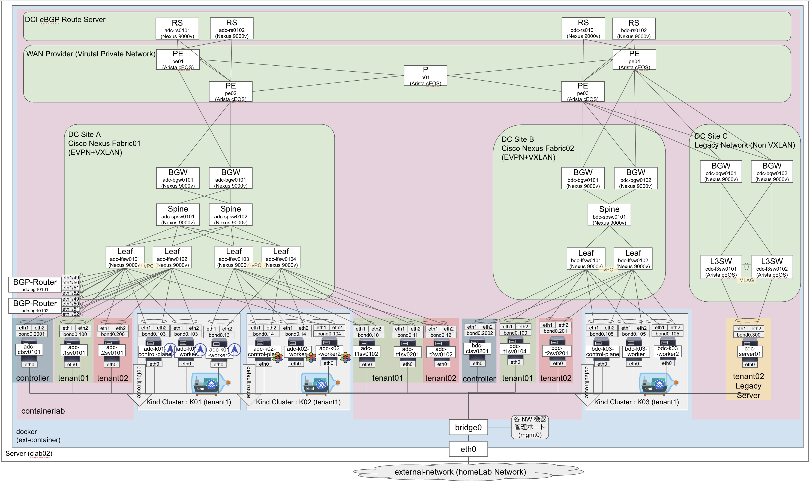
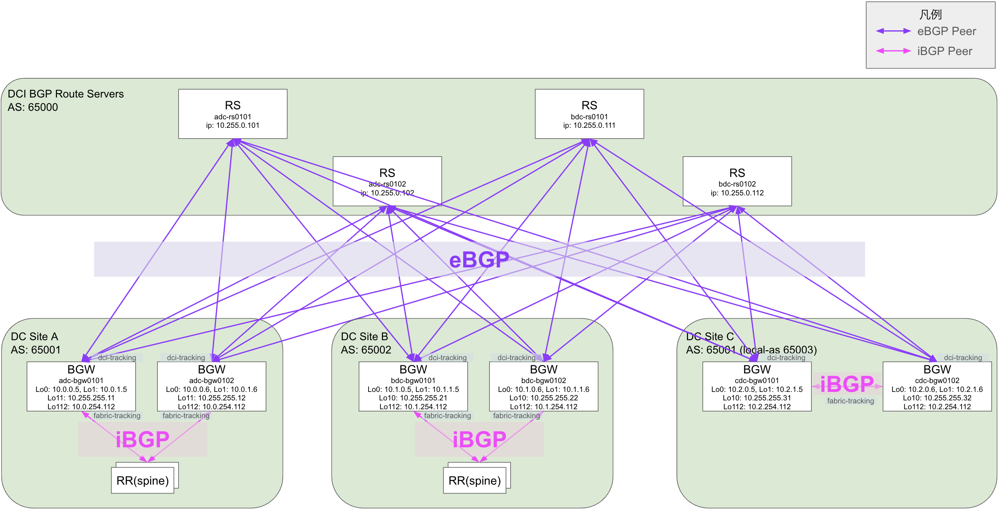
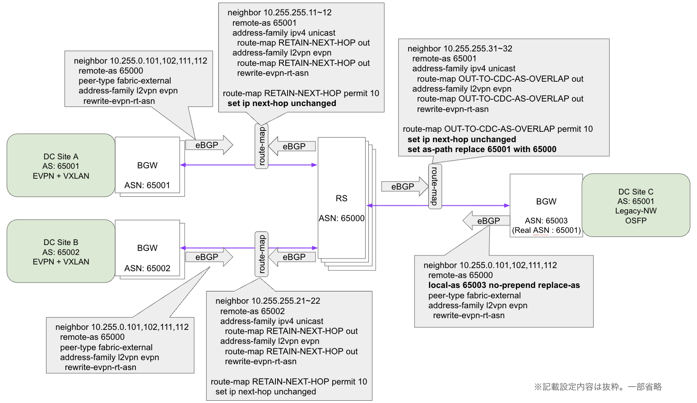
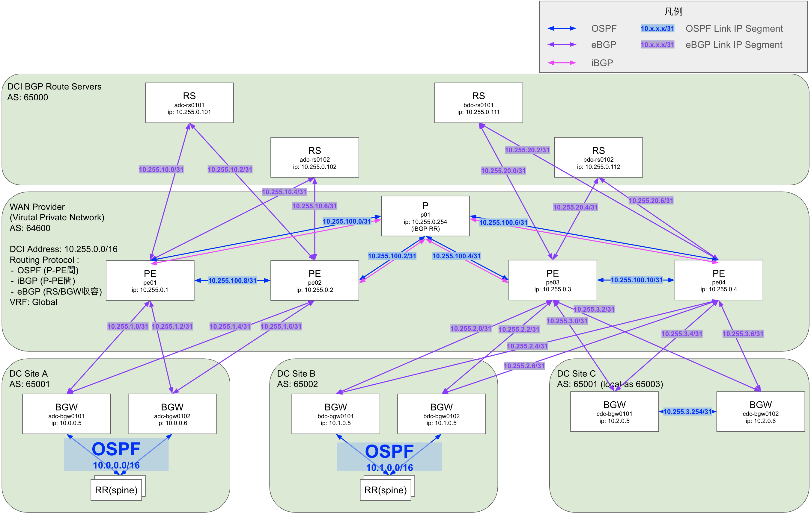
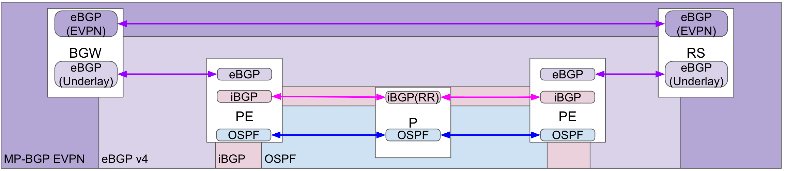
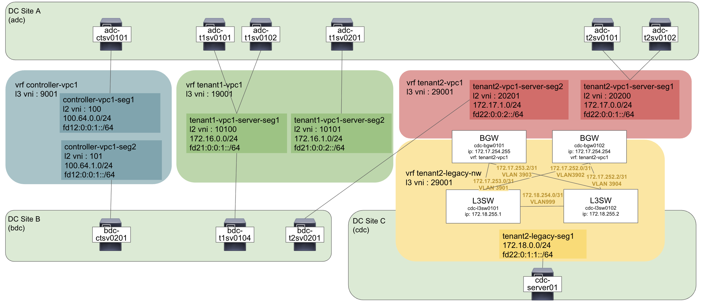

# nxos_fabric/MultiSite

Cisco Nexus 9000v (N9Kv) で構成した EVPN+VXLAN Fabric の複数サイトを WAN 越しに DCI 接続する EVPN Multisite を検証する

## 概要



`adc-k02`と`bdc-k03`へCilium Cluster Meshを段階構築する計画は
[Cilium / Hubble / Tetragon ラボ検討](../docs/cilium-lab/README.md)を参照する。

構築後は [k02／k03 の操作環境](#multisite-client-environment) と [Hubble UI アクセス](#hubble-ui-access) を参照する。

- DataCenter(DC) Site は 3 サイト版（ADC／BDC／CDC）と CDC 除外版（ADC／BDC）から選択する
  - DC Site A
    - 通常の Fabric サイト想定用
      - EVPN BGP + Underlay OSPF 構成
    - Leaf を2セットとして Fabric 内の疎通確認も可能とする
    - 冗長数を 2 として冗長試験も可能とする
  - DC Site B
    - Site 間疎通確認用での通常の Fabric 構成
    - Spine は1つに省略
    - Leaf も1セットのみ
  - DC Site C（3 サイト版のみ）
    - レガシーサイト想定用
    - レガシーサイト内に L3SW を配置して、レガシーセグメントを DCI に載せて通信を試験する
    - [Nexus 9000v は vPC BGW をサポートしてない](https://www.cisco.com/c/ja_jp/td/docs/dcn/nx-os/nexus9000/106x/n9000v-9300v-9500v/cisco-nexus-9000v-9300v-9500v-guide-release-106x/m-overview.html?utm_source=chatgpt.com#Cisco_Reference.dita_55d93795-31c2-428b-be6b-8c2ed0fa7677) ため、L3 ルーティングの延伸のみとする
      - [レガシーサイト統合](https://www.cisco.com/c/en/us/products/collateral/switches/nexus-9000-series-switches/white-paper-c11-739942.html#Legacysiteintegration)と[vPCボーダーゲートウェイを使用した構成設計](https://www.cisco.com/c/en/us/products/collateral/switches/nexus-9000-series-switches/whitepaper-c11-742114.html)は設計の参考資料とする
        -  EVPNマルチサイトアーキテクチャではvPCは必須ではありませんが、既存サイトへの回復力が高くループのない接続を提供するために必要です。
      - 既存レガシーネットワーク想定の L3SW と BGW との接続
        - fabric-tracking は SVI 非対応のため物理ポートで収容する
          - [EVPN multisite DCI-tracking and EVPN multisite fabric-tracking are only supported on physical interfaces. Use on SVIs is not supported.](https://www.cisco.com/c/en/us/td/docs/dcn/nx-os/nexus9000/106x/configuration/vxlan/cisco-nexus-9000-series-nx-os-vxlan-configuration-guide-release-106x/m_configuring_multisite_93x.html#reference_imd_jvs_sgb)
        - Sub-Interface で複数 VRF がある場合は収容する
          - [Separate sub-interfaces can be defined in a multitenant (that is, multi-VRF) deployment.](https://www.cisco.com/c/en/us/products/collateral/switches/nexus-9000-series-switches/whitepaper-c11-742114.html#Step6MigratefirsthopFHRPGatewayinthelegacysitetothevPCBGWAnycastGateway)


### 機種構成

- Fabric 機器は Cisco Nexus 9000v (N9Kv) / Nexus 9300v Lite を使用する
  - mgmt0 は外部からアクセス用として containerlab サーバの bridge0 へ接続して固定 IP をアサインする
  - メモリフットプリントを削減するため、10.5(3)F 以上を使用する ([参照 Reduced footprint N9Kv Lite image to 4.5G](https://www.cisco.com/c/en/us/td/docs/dcn/nx-os/nexus9000/105x/configuration/n9000v-9300v-9500v/cisco-nexus-9000v-9300v-9500v-guide-release-105x/m-new-and-changed-105x.html))
  - VXLAN の対応として、所謂 [New L3 VNI Mode](https://community.cisco.com/t5/tkb-%E3%83%87%E3%83%BC%E3%82%BF%E3%82%BB%E3%83%B3%E3%82%BF%E3%83%BC-%E3%83%89%E3%82%AD%E3%83%A5%E3%83%A1%E3%83%B3%E3%83%88/ndfc-new-l3vni-mode-%E3%81%AB%E3%81%A4%E3%81%84%E3%81%A6/ta-p/5128776#toc-hId-328186197) が N9Kv が非対応 ([L3VNI without VLAN : No](https://www.cisco.com/c/en/us/td/docs/dcn/nx-os/nexus9000/106x/configuration/n9000v-9300v-9500v/cisco-nexus-9000v-9300v-9500v-guide-release-106x/m-overview.html#Cisco_Reference.dita_55d93795-31c2-428b-be6b-8c2ed0fa7677)) のため、VLAN 付きの L3 VNI で試験する必要がある
- Fabric 機器以外は軽量化・複数種類試験のため [`Arista cEOS`](https://containerlab.dev/manual/kinds/ceos/) を使用する
  - Management0 は外部からアクセス用として containerlab サーバの bridge0 へ接続して固定 IP をアサインする
- Server は疎通確認用に [network-multitool](https://github.com/srl-labs/network-multitool) を使用する
  - bonding で Network 機器へ接続する (eth1,eth2)
  - containerlab 上の検証ネットワーク向けにデフォルトルートを作成して疎通試験するようにする
  - eth0 は外部からアクセス用として containerlab サーバの bridge0 へ接続する
    - 基本的には `docker exec -it [container name] bash` などでアクセスするので IP は固定してない
- kind (Kubernetes in Docker) は Kubernetes `v1.35.5` の Node image を使用する

現在の topology に指定しているコンテナイメージ（両構成共通）:

バージョンは試験要件に合わせて選択・変更する。変更時は使用する YAML の `image`（kind は digest を含む）と、この一覧を揃える。

```text
REPOSITORY                        TAG
vrnetlab/cisco_n9kv               10.6.4.M.lite
ceos                              4.35.4M
ghcr.io/hellt/network-multitool   latest
kindest/node                      v1.35.5
```

- Default User/Password
  - cisco_n9kv : admin:admin ([参照](https://containerlab.dev/manual/kinds/vr-n9kv/#credentials))
  - ceos : admin:admin ([参照](https://containerlab.dev/manual/kinds/ceos/#credentials))
  - network-multitool : admin:multit00l ([参照](https://github.com/srl-labs/network-multitool#network-multitool-container-image))

## EVPN MultiSite BGP 構成

### AS 番号を Fabric 間と DCI AS が一致するパターン



- EVPN eBGP/iBGP
  - データセンターサイト内は iBGP, サイト間は eBGP
  - iBGP はルートリフレクター(RR)を使用する。RRはSpineで実装する
  - eBGP はルートサーバ(RS)を使用する。RSは専用ルータを実装する ([参考: Configure Nexus EVPN-VXLAN Multi-Site with Route Server](https://www.cisco.com/c/en/us/support/docs/switches/nexus-9000-series-switches/220269-configure-nexus-evpn-vxlan-multi-site-wi.html))
- AS 番号
  - [AS番号設計.md #1. AS 番号統一](./docs/AS番号設計.md#1-as-番号統一)



- EVPN eBGP Route Server (RS)
  - Route Server では next-hop は書き換えずに伝搬して、データトラフィックは BGW 間で直接疎通できるようにする
  - AS 重複している BGW 向けには AS Path の書き換えを実施する (Overlap)
    - BGW 側での allowas-in でも可能

#### 対応 Config

[AS番号統一configディレクトリ](./configs/as-equals/)

### AS 番号を Fabric 間と DCI AS が別々で重複回避するパターン

AS 番号を全てのレイヤで分けて重複を回避する場合は、neighbor-specific `local-as` と `remote-as` を使用して、サイト内 Fabric AS、DCI Underlay AS、DCI EVPN AS を分離する。

- AS 番号
  - [AS番号設計.md #2. AS 番号不一致](./docs/AS番号設計.md#2-as-番号不一致)
- 注意点
  - DCI EVPN セッションで neighbor-specific `local-as` を使用すると、DCI で認識される AS とサイト内で auto 生成される RT の AS が異なる。
  - `rewrite-evpn-rt-asn` ではサイト内 auto RT へ正しく変換できないため、AS 番号不一致パターンでは同コマンドを使用せず、共通 RT を明示設定する。
  - サイト内 Leaf/Spine は Site Local Fabric AS と auto RT を維持する。共通 RT は DCI に接続する BGW へ設定し、BGW のサイト内向け再オリジネートを利用する。
- `rewrite-evpn-rt-asn` に代わる対応
  - 共通 RT `65000:<VNI>` への import/export を実施する。RT の Administrator 値 65000 は RS AS と同じだが、同じである必要はない。
    - BGW での Config 例
      - AS 番号一致 (`rewrite-evpn-rt-asn`が動くので自 AS で auto のみ)
      ```
      vrf context controller-vpc1
        rd auto
        address-family ipv4 unicast
          route-target both auto
          route-target both auto evpn
      ```
      - AS 書き換えている場合 (`rewrite-evpn-rt-asn`が効かないので共通RTで明示)
      ```
      vrf context controller-vpc1
        rd auto
        address-family ipv4 unicast
          route-target both auto
          route-target both auto evpn
          route-target import 65000:9001 evpn
          route-target export 65000:9001 evpn
        address-family ipv6 unicast
          route-target both auto
          route-target both auto evpn
          route-target import 65000:9001 evpn
          route-target export 65000:9001 evpn
      ```

  - ADC/BDC 間で L2 延伸する L2VNI 10100 にも共通 RT を設定する。

    ```
    evpn
      vni 10100 l2
        rd auto
        route-target import auto
        route-target export auto
        route-target import 65000:10100
        route-target export 65000:10100
    ```

  - L3VNI の共通 RT 対象
    - ADC/BDC BGW: `65000:9001`, `65000:19001`, `65000:29001`
    - CDC BGW: `65000:29001` のみ
  - DCI Underlay の AS 64699 は RS の WAN PE 向け neighbor-specific `local-as` として使用する。

    ```
    router bgp 65000
      neighbor <WAN-PE>
        remote-as 64600
        local-as 64699 no-prepend replace-as
    ```


#### 対応 Config

[AS番号不一致configディレクトリ](./configs/as-changes/)

### EVPN Multisite Storm Control

[VXLAN EVPNマルチサイトストーム制御の設定](https://www.cisco.com/c/en/us/td/docs/dcn/nx-os/nexus9000/106x/configuration/vxlan/cisco-nexus-9000-series-nx-os-vxlan-configuration-guide-release-106x/m_configuring_multisite_93x.html#Cisco_Task.dita_52c31ad1-43f1-4739-863a-50542a64332a)も入れておく

```sh
evpn storm-control broadcast level 10
evpn storm-control multicast level 10
evpn storm-control unicast level 10
```


### DCI Underlay IP Address



- 各サイト下記 IP をアサインする
  - DC Site A : 10.0.0.0/16
  - DC Site B : 10.1.0.0/16
  - DC Site C : 10.2.0.0/16
  - WAN 接続 / RS : 10.255.0.0/16
- アドレス境界
  - DC Site と WAN 用のアドレス境界は BGW で実施する

EVPN BGP と DCI Underlay のプロトコル関係の概要図は下記の通り




### Overlay IP Address



Server コンテナは `scripts/linux/init-bond-singlevlan-route.sh` で `eth1`/`eth2` を bonding し、VLAN subinterface に IPv4/IPv6 とデフォルトルートを設定する。

| Node | VLAN | IPv4 | IPv4 GW | IPv6 | IPv6 GW |
| --- | ---: | --- | --- | --- | --- |
| adc-ctsv0101 | 2001 | 100.64.0.1/24 | 100.64.0.254 | fd12:0:0:1::101/64 | fd12:0:0:1::1 |
| bdc-ctsv0201 | 2002 | 100.64.1.1/24 | 100.64.1.254 | fd12:0:0:2::101/64 | fd12:0:0:2::1 |
| adc-t1sv0101 | 100 | 172.16.0.1/24 | 172.16.0.254 | fd21:0:0:1::101/64 | fd21:0:0:1::1 |
| adc-t1sv0102 | 10 | 172.16.0.2/24 | 172.16.0.254 | fd21:0:0:1::102/64 | fd21:0:0:1::1 |
| adc-t1sv0201 | 11 | 172.16.1.1/24 | 172.16.1.254 | fd21:0:0:2::101/64 | fd21:0:0:2::1 |
| bdc-t1sv0104 | 100 | 172.16.0.4/24 | 172.16.0.254 | fd21:0:0:1::104/64 | fd21:0:0:1::1 |
| adc-t2sv0101 | 200 | 172.17.0.1/24 | 172.17.0.254 | fd22:0:0:1::101/64 | fd22:0:0:1::1 |
| adc-t2sv0102 | 20 | 172.17.0.2/24 | 172.17.0.254 | fd22:0:0:1::102/64 | fd22:0:0:1::1 |
| bdc-t2sv0201 | 201 | 172.17.1.1/24 | 172.17.1.254 | fd22:0:0:2::101/64 | fd22:0:0:2::1 |
| cdc-cmsv01 | 300 | 172.18.0.1/24 | 172.18.0.254 | fd22:0:1:1::101/64 | fd22:0:1:1::1 |

## 構築手順

### 前提

- `bridge0` に接続できる containerlab 実行環境を用意する
  - 機器の外部接続に利用する
  - 必要に応じて選択する topology YAML の IP を変更する
  - containerlab 環境の IP は `172.16.0.0/12` は使用してない前提で、重複するとサーバの接続 IP に影響が出る
- 選択する topology の NX-OS イメージと `ceos:4.35.4M` を事前に pull/import しておく（[機種構成](#機種構成) を参照）
- N9Kv は台数が多いため、ホスト側のメモリに余裕を持たせる

### 構成の選択

試験対象と実行環境のメモリ容量に合わせて、3 サイト版または CDC 除外版を選択する。

3 サイト版は、ADC／BDC の Fabric 間接続に加え、CDC のレガシーサイト接続を含む検証に使用する。
CDC 除外版は、メモリに制約のある実行環境（例：128 GB 未満）で、kind 上の Cilium Cluster Mesh 試験など、
Network OS 以外にもメモリを必要とする検証を行うための構成である。
CDC のネットワーク機器とサーバを省くことで試験用のメモリ余力を確保し、
ADC／BDC 間の **EVPN＋VXLAN＋Multisite による 2 サイト検証**を行えるようにしている。
128 GB は環境の例であり、動作可否の境界や最小要件ではない。必要な容量は Network OS の版・割当メモリ、
Kubernetes の構成、試験負荷によって異なるため、起動後の使用量と余力を確認する。

| 構成 | 対象サイト | topology | 機器台帳 |
|---|---|---|---|
| 3 サイト版 | ADC／BDC／CDC | [nxos-fabric-multisite.clab.yaml](nxos-fabric-multisite.clab.yaml) | [hosts.txt](hosts.txt) |
| CDC 除外版 | ADC／BDC | [nxos-fabric-multisite-no-cdc.clab.yaml](nxos-fabric-multisite-no-cdc.clab.yaml) | [hosts-no-cdc.txt](hosts-no-cdc.txt) |

両構成とも k01／k02／k03、共通 WAN、DCI route-server を含む。
CDC 除外版は、3 サイト版に含まれる CDC の 6 ノード・20 リンクを持たない。
CDC のレガシーサイト接続・共有サーバへの疎通確認には 3 サイト版を使用する。

lab 名は両構成とも `nxos-fabric-multisite`。同時起動せず、使用する YAML と機器台帳を明示する。
CDC 向けの保存 config は共通の設定ディレクトリに残るため、CDC 除外版では該当する port／neighbor の Down を期待値として扱う。
NX-OS の config は両構成とも起動後に投入する。

k01 は MetalLB 比較用として使用できる。資源は基盤導入後と試験負荷を加えた状態で測定し、
swap／OOM が発生する場合は起動対象や負荷を見直す。
Mesh の性能測定中は k01 の負荷試験を同時実行せず、CPU 競合を避ける。

### 起動

同一ホスト上で single-site から切り替える場合は、同名 `adc-k02-*` Node の破棄・再作成前に
[旧 checksum timer の停止手順](../docs/cilium-lab/runbooks/checksum-compat-multisite.md#2-旧-single-site-の監視と実行環境を分ける) を実施する。
旧 state は新しいクラスタへ流用しない。別ホストで single-site を維持する場合は、そのホストの timer も維持する。

```sh
export CLABNAME="nxos-fabric-multisite"
export REPODIR="${HOME}/my-containerlab"
export CLABPATH="${REPODIR}/nxos_fabric/nxos_multisite/"
cd $CLABPATH
```

次のいずれかを選択し、topology と機器台帳を設定する。lab 名は両構成で共通とする。

3 サイト版:

```sh
export CLAB_TOPOLOGY="nxos-fabric-multisite.clab.yaml"
export CLAB_HOSTS="hosts.txt"
```

CDC 除外版:

```sh
export CLAB_TOPOLOGY="nxos-fabric-multisite-no-cdc.clab.yaml"
export CLAB_HOSTS="hosts-no-cdc.txt"
```

選択した topology を検証し、成功を確認してから起動する。

```sh
containerlab validate -t "${CLAB_TOPOLOGY}"
```

```sh
containerlab deploy -t "${CLAB_TOPOLOGY}"
```

起動中に `error creating fsnotify watcher: too many open files` が出る場合は、
[Appendix: kind Node の `inotify` instance 上限不足](#kind-inotify-limit) の確認・対処手順を参照する。

N9Kv は起動に時間がかかり起動時に containerlab 実行環境サーバに負荷がかかるので、一部 Node に `startup-delay` を設定して初期起動時の負荷を分散している。よって40分程度待つことになる。

WAN の cEOS Node と C Site の L3SW は `startup-config` で `configs/` 配下にあるフォルダの中の `arista_ceos` 内を指定して投入する。N9Kv Fabric/Route Server は `configs/<as-type>/<node>_run.txt` に設定ファイルを用意しているため、起動後に適用する。

個人で用意したツールを使用する場合 ([aled](https://github.com/suzuyu/alred#alred))。手動ログインして設定するでも問題はない。

```sh
cd $CLABPATH
```

AS 統一版の場合

```sh
alred prepare-hosts --input "${CLAB_HOSTS}" --output hosts.lab.yaml
alred push-config-dir --input-dir configs/as-equals/cisco_n9kv/ --file-suffix _run.txt --hosts hosts.lab.yaml --username admin --password admin
```

AS 重複回避の場合

```sh
alred prepare-hosts --input "${CLAB_HOSTS}" --output hosts.lab.yaml
alred push-config-dir --input-dir configs/as-changes/cisco_n9kv/ --file-suffix _run.txt --hosts hosts.lab.yaml --username admin --password admin
```


投入が問題なければ write memory (`copy running-config startup-config`) をする

```sh
alred write-memory --hosts hosts.lab.yaml
```


### 疎通確認

Server コンテナから tenant 間・site 間の疎通を確認する。

#### 環境設定の設定


```sh
export CLABNAME="nxos-fabric-multisite"
export ADCctsv0101v4=100.64.0.1
export ADCctsv0101v6=fd12:0:0:1::101
export BDCctsv0201v4=100.64.1.1
export BDCctsv0201v6=fd12:0:0:2::101
export ADCt1sv0101v4=172.16.0.1
export ADCt1sv0101v6=fd21:0:0:1::101
export ADCt1sv0102v4=172.16.0.2
export ADCt1sv0102v6=fd21:0:0:1::102
export ADCt1sv0201v4=172.16.1.1
export ADCt1sv0201v6=fd21:0:0:2::101
export BDCt1sv0104v4=172.16.0.4
export BDCt1sv0104v6=fd21:0:0:1::104
export ADCt2sv0101v4=172.17.0.1
export ADCt2sv0101v6=fd22:0:0:1::101
export ADCt2sv0102v4=172.17.0.2
export ADCt2sv0102v6=fd22:0:0:1::102
export BDCt2sv0201v4=172.17.1.1
export BDCt2sv0201v6=fd22:0:0:2::101
export CDCcmsv01v4=172.18.0.1
export CDCcmsv01v6=fd22:0:1:1::101
export CDCcmsv02v4=172.17.0.10
export CDCcmsv02v6=fd22:0:0:1::10a
```

#### Site-A Leaf Set1 to Leaf Set2

```sh
docker exec -it clab-${CLABNAME}-adc-t1sv0101 ping -c 5 $ADCt1sv0102v4
docker exec -it clab-${CLABNAME}-adc-t1sv0101 ping -c 5 $ADCt1sv0201v4
docker exec -it clab-${CLABNAME}-adc-t2sv0101 ping -c 5 $ADCt2sv0102v4
```

```sh
docker exec -it clab-${CLABNAME}-adc-t1sv0101 ping6 -c 5 $ADCt1sv0102v6
docker exec -it clab-${CLABNAME}-adc-t1sv0101 ping6 -c 5 $ADCt1sv0201v6
docker exec -it clab-${CLABNAME}-adc-t2sv0101 ping6 -c 5 $ADCt2sv0102v6
```

#### Site-A to Site-B

```sh
docker exec -it clab-${CLABNAME}-adc-ctsv0101 ping -c 5 $BDCctsv0201v4
docker exec -it clab-${CLABNAME}-adc-t1sv0101 ping -c 5 $BDCt1sv0104v4
docker exec -it clab-${CLABNAME}-adc-t2sv0101 ping -c 5 $BDCt2sv0201v4
```

```sh
docker exec -it clab-${CLABNAME}-adc-ctsv0101 ping6 -c 5 $BDCctsv0201v6
docker exec -it clab-${CLABNAME}-adc-t1sv0101 ping6 -c 5 $BDCt1sv0104v6
docker exec -it clab-${CLABNAME}-adc-t2sv0101 ping6 -c 5 $BDCt2sv0201v6
```

#### Site-A/B to Site-C

```sh
docker exec -it clab-${CLABNAME}-adc-t2sv0101 ping -c 5 $CDCcmsv01v4
docker exec -it clab-${CLABNAME}-adc-t2sv0102 ping -c 5 $CDCcmsv01v4
docker exec -it clab-${CLABNAME}-bdc-t2sv0201 ping -c 5 $CDCcmsv01v4
```

```sh
docker exec -it clab-${CLABNAME}-adc-t2sv0101 ping -c 5 $CDCcmsv02v4
docker exec -it clab-${CLABNAME}-adc-t2sv0102 ping -c 5 $CDCcmsv02v4
docker exec -it clab-${CLABNAME}-bdc-t2sv0201 ping -c 5 $CDCcmsv02v4
```

```sh
docker exec -it clab-${CLABNAME}-adc-t2sv0101 ping6 -c 5 $CDCcmsv01v6
docker exec -it clab-${CLABNAME}-adc-t2sv0102 ping6 -c 5 $CDCcmsv01v6
docker exec -it clab-${CLABNAME}-bdc-t2sv0201 ping6 -c 5 $CDCcmsv01v6
```

```sh
docker exec -it clab-${CLABNAME}-adc-t2sv0101 ping6 -c 5 $CDCcmsv02v6
docker exec -it clab-${CLABNAME}-adc-t2sv0102 ping6 -c 5 $CDCcmsv02v6
docker exec -it clab-${CLABNAME}-bdc-t2sv0201 ping6 -c 5 $CDCcmsv02v6
```


#### Controller to Tenant1 / Tenant2 IPv6

##### Site-A

```sh
docker exec -it clab-${CLABNAME}-adc-ctsv0101 ping6 -c 5 $ADCt1sv0201v6
docker exec -it clab-${CLABNAME}-adc-ctsv0101 ping6 -c 5 $ADCt2sv0102v6
```

##### Site-B

```sh
docker exec -it clab-${CLABNAME}-bdc-ctsv0201 ping6 -c 5 $BDCt1sv0104v6
docker exec -it clab-${CLABNAME}-bdc-ctsv0201 ping6 -c 5 $BDCt2sv0201v6
```

### kind node to kind node

```sh
export CLABNAME="nxos-fabric-multisite"
export ADCk01masterv4=172.16.3.11
export ADCk01masterv6=fd21:0:0:3::1:1
export ADCk01worker0v4=172.16.3.21
export ADCk01worker0v6=fd21:0:0:3::2:1
export ADCk01worker2v4=172.16.3.22
export ADCk01worker2v6=fd21:0:0:3::2:2
export ADCk02masterv4=172.16.4.11
export ADCk02masterv6=fd21:0:0:4::1:1
export ADCk02worker0v4=172.16.4.21
export ADCk02worker0v6=fd21:0:0:4::2:1
export ADCk02worker2v4=172.16.4.22
export ADCk02worker2v6=fd21:0:0:4::2:2
export BDCk03masterv4=172.16.5.11
export BDCk03masterv6=fd21:0:0:5::1:1
export BDCk03worker0v4=172.16.5.21
export BDCk03worker0v6=fd21:0:0:5::2:1
export BDCk03worker2v4=172.16.5.22
export BDCk03worker2v6=fd21:0:0:5::2:2
```

#### Site-A Server to k01 node & k02 node

```sh
docker exec -it clab-${CLABNAME}-adc-t1sv0101 ping -c 5 $ADCk01masterv4
docker exec -it clab-${CLABNAME}-adc-t1sv0101 ping -c 5 $ADCk01worker0v4
docker exec -it clab-${CLABNAME}-adc-t1sv0101 ping -c 5 $ADCk01worker2v4
docker exec -it clab-${CLABNAME}-adc-t1sv0101 ping -c 5 $ADCk02masterv4
docker exec -it clab-${CLABNAME}-adc-t1sv0101 ping -c 5 $ADCk02worker0v4
docker exec -it clab-${CLABNAME}-adc-t1sv0101 ping -c 5 $ADCk02worker2v4
```

```sh
docker exec -it clab-${CLABNAME}-adc-t1sv0101 ping6 -c 5 $ADCk01masterv6
docker exec -it clab-${CLABNAME}-adc-t1sv0101 ping6 -c 5 $ADCk01worker0v6
docker exec -it clab-${CLABNAME}-adc-t1sv0101 ping6 -c 5 $ADCk01worker2v6
docker exec -it clab-${CLABNAME}-adc-t1sv0101 ping6 -c 5 $ADCk02masterv6
docker exec -it clab-${CLABNAME}-adc-t1sv0101 ping6 -c 5 $ADCk02worker0v6
docker exec -it clab-${CLABNAME}-adc-t1sv0101 ping6 -c 5 $ADCk02worker2v6
```

#### Site-B Server to k03 node & k01 node


```sh
docker exec -it clab-${CLABNAME}-bdc-t1sv0104 ping -c 5 $BDCk03masterv4
docker exec -it clab-${CLABNAME}-bdc-t1sv0104 ping -c 5 $BDCk03worker0v4
docker exec -it clab-${CLABNAME}-bdc-t1sv0104 ping -c 5 $BDCk03worker2v4
docker exec -it clab-${CLABNAME}-bdc-t1sv0104 ping -c 5 $ADCk02masterv4
docker exec -it clab-${CLABNAME}-bdc-t1sv0104 ping -c 5 $ADCk02worker0v4
docker exec -it clab-${CLABNAME}-bdc-t1sv0104 ping -c 5 $ADCk02worker2v4
```

```sh
docker exec -it clab-${CLABNAME}-bdc-t1sv0104 ping6 -c 5 $BDCk03masterv6
docker exec -it clab-${CLABNAME}-bdc-t1sv0104 ping6 -c 5 $BDCk03worker0v6
docker exec -it clab-${CLABNAME}-bdc-t1sv0104 ping6 -c 5 $BDCk03worker2v6
```

### k01 metallb up

k01 クラスタで MetalLB を導入して BGP-Router と eBGP 接続を実施する

```sh
export CLABNAME="nxos-fabric-multisite"
ls -alt clab-${CLABNAME}/adc-k01/k8s_kind/k01/kubeconfig-k01
sudo chmod g+r clab-${CLABNAME}/adc-k01/k8s_kind/k01/kubeconfig-k01
export KUBECONFIG=$PWD/clab-${CLABNAME}/adc-k01/k8s_kind/k01/kubeconfig-k01
```

```sh
kubectl get node
kubectl apply -f https://raw.githubusercontent.com/metallb/metallb/v0.15.3/config/manifests/metallb-frr.yaml
kubectl wait -n metallb-system --for=condition=Available deployment/controller --timeout=180s
kubectl rollout status -n metallb-system daemonset/speaker --timeout=180s
kubectl apply -f k8s_kind/k01/manifest/
```

MetalLB 状態確認

```sh
# 特定の Speaker Pod の名前を取得
SPEAKER_POD=$(kubectl get pod -n metallb-system -l app=metallb,component=speaker -o jsonpath='{.items[0].metadata.name}')

# 1. BGP ネイバーのサマリー（接続状態・UP時間・受信プレフィックス数など）を確認
kubectl exec -n metallb-system $SPEAKER_POD -c frr -- vtysh -c "show bgp summary"

# 2. 特定の BGP ネイバーの詳細情報を確認 (例: 対向IPが 172.16.3.4の場合)
kubectl exec -n metallb-system $SPEAKER_POD -c frr -- vtysh -c "show bgp neighbors 172.16.3.4"

# 3. FRR の実行中設定 (running-config) を確認
kubectl exec -n metallb-system $SPEAKER_POD -c frr -- vtysh -c "show running-config"

# 4. FRR が認識している IPv4 BGP テーブル全体の確認
kubectl exec -n metallb-system $SPEAKER_POD -c frr -- vtysh -c "show bgp ipv4 unicast"
```

サンプル用の Nginx への到達性を確認する

```sh
docker exec -it clab-${CLABNAME}-adc-t1sv0101 curl http://172.16.13.10
docker exec -it clab-${CLABNAME}-adc-t1sv0101 curl -g "http://[fd21::13:0:0:1:0]/"
docker exec -it clab-${CLABNAME}-bdc-t1sv0104 curl http://172.16.13.10
docker exec -it clab-${CLABNAME}-bdc-t1sv0104 curl -g "http://[fd21::13:0:0:1:0]/"
```

### k02／k03 Cilium の構築と最終設定

containerlab による kubeconfig の作成後、Cilium の構築手順へ進む前に、k02／k03 の読み取り権限を設定する。
`nxos_fabric/nxos_multisite` ディレクトリで実行する。
作業ユーザーが kubeconfig の所有グループに所属していることを前提に、k01 と同様にグループの読み取り権限を追加する。

```bash
export CLABNAME="nxos-fabric-multisite"
ls -l "clab-${CLABNAME}/adc-k02/k8s_kind/k02/kubeconfig-k02" \
      "clab-${CLABNAME}/bdc-k03/k8s_kind/k03/kubeconfig-k03"
sudo chmod g+r "clab-${CLABNAME}/adc-k02/k8s_kind/k02/kubeconfig-k02"
sudo chmod g+r "clab-${CLABNAME}/bdc-k03/k8s_kind/k03/kubeconfig-k03"
test -r "clab-${CLABNAME}/adc-k02/k8s_kind/k02/kubeconfig-k02"
test -r "clab-${CLABNAME}/bdc-k03/k8s_kind/k03/kubeconfig-k03"
```

[k02 Cilium README](k8s_kind/k02/cilium/README.md) と [k03 Cilium README](k8s_kind/k03/cilium/README.md) に
2 つの構築パターンを記載する。

- [A：段階導入と個別試験](k8s_kind/k02/cilium/README.md#staged-install)：k02 → CA 共有 → k03 の順に個別導入する。
- [B：個別試験を行わない最終構成の導入](k8s_kind/k02/cilium/README.md#direct-final-install)：適用条件を確認し、両クラスタを 1 回の driver 実行で導入する。

標準の `multisite-final` は Cluster Mesh を有効化し、Egress Gateway は無効とする。
B は [checksum の初回登録・監視](../docs/cilium-lab/runbooks/checksum-compat-multisite.md) を先に準備し、
クラスタごとの state を渡して再適用する。両クラスタ共通の DNS upstream を使用する。
試験済み環境の撤去・復元は各 Cilium README の補足手順を使用する。

<a id="multisite-client-environment"></a>

### k02／k03 構築後の操作環境

Containerlab 実行ホストの Bash で、新しい作業シェルを開くたびに設定する。
CLI の準備と両クラスタの構築が完了していることを前提とする。
Git 管理していない配置先では `REPO_ROOT` を実際のリポジトリ絶対パスに置き換える。

#### 環境変数設定

```bash
export REPO_ROOT="$(git rev-parse --show-toplevel)"
export SITE_TYPE="multisite"
export LAB_ROOT="${REPO_ROOT}/nxos_fabric/nxos_${SITE_TYPE}"
export K8S_CLIENT_RUNTIME="${LAB_ROOT}/k8s_kind/client/runtime"
export PATH="${K8S_CLIENT_RUNTIME}/bin:${PATH}"
hash -r
export KUBECONFIG_K02="${LAB_ROOT}/clab-nxos-fabric-multisite/adc-k02/k8s_kind/k02/kubeconfig-k02"
export KUBECONFIG_K03="${LAB_ROOT}/clab-nxos-fabric-multisite/bdc-k03/k8s_kind/k03/kubeconfig-k03"
export KUBECONFIG="${KUBECONFIG_K02}:${KUBECONFIG_K03}"
export KUBE_CONTEXT_K02="kind-adc-k02"
export KUBE_CONTEXT_K03="kind-bdc-k03"
export KUBE_CONTEXT="${KUBE_CONTEXT_K02}"
```

生成済みの管理 API 用 kubeconfig 2 個を `:` で指定し、CLI から両 context を参照する。
ファイルを結合・上書きせず、各コマンドの context を明示して対象を選ぶ。
絶対パスなので作業ディレクトリを移動しても参照先は変わらない。
Fabric client 用の `runtime/kubeconfig/config` は別途準備するファイルである。
single-site と同名の k02 context を使うため、single-site の kubeconfig を混ぜず、作業シェルを分ける。

| 対象 | context | Hubble |
|---|---|---|
| ADC k02 | `kind-adc-k02` | Agent／Relay／UI |
| BDC k03 | `kind-bdc-k03` | Agent／Relay。UI は配置しない |

#### CLI・接続先の確認

```bash
command -v kubectl cilium hubble helm
kubectl version --client
cilium version --client
hubble version
helm version --short

test -r "${KUBECONFIG_K02}"
test -r "${KUBECONFIG_K03}"
kubectl config get-contexts "${KUBE_CONTEXT_K02}"
kubectl config get-contexts "${KUBE_CONTEXT_K03}"
bash "${REPO_ROOT}/nxos_fabric/scripts/k8s-client/prepare-tools.sh" \
  --profile "${LAB_ROOT}/k8s_kind/client" --check
```

`command -v` は multisite の `runtime/bin/` 配下を指すことを確認する。
`--check` は固定 version と保存 checksum の照合のみで、ダウンロードしない。
不足する場合は [CLI 準備](k8s_kind/client/README.md) と各クラスタの kubeconfig 準備を確認してから進む。

```bash
for context in "${KUBE_CONTEXT_K02}" "${KUBE_CONTEXT_K03}"; do
  kubectl --context "$context" --request-timeout=10s get --raw='/readyz'
  kubectl --context "$context" --request-timeout=10s get nodes -o wide
  cilium status --context "$context"
  cilium bgp peers --context "$context"
  cilium clustermesh status --context "$context"
  hubble status --kube-context "$context" -P
done
```

API `ok`、各クラスタ 3 Node Ready、BGP は各 8 session Established を基準とする。
Cluster Mesh の接続状態と cross-cluster 通信は別々に確認する。

<a id="hubble-ui-access"></a>

#### Hubble UI へのアクセス

実行ホストの別端末で上記の環境変数を設定し、UI を配置する k02 を明示して開始する。

```bash
cilium hubble ui \
  --context "${KUBE_CONTEXT_K02}" \
  --port-forward 12000 \
  --open-browser=false
```

同じホストのブラウザでは `http://localhost:12000/` を開く。コマンドは利用中そのまま動かす。
手元の PC のブラウザを使う場合は、手元の別端末で次の SSH 転送を開始する。
`LAB_SSH_TARGET` は実行ホストへの接続先（`user@host` または SSH config の Host 名）に置き換える。

```bash
LAB_SSH_TARGET="user@lab-host"
ssh -N -o ExitOnForwardFailure=yes \
  -L 127.0.0.1:12000:127.0.0.1:12000 \
  "${LAB_SSH_TARGET}"
```

手元のブラウザで `http://127.0.0.1:12000/` を開く。
VS Code Remote SSH では、上記 SSH コマンドの代わりに「ポート」タブから TCP `12000` を転送してもよい。
手元のポートが使用中なら `-L` の最初のポートを `12001` へ変更し、URL も合わせる。
実行ホスト側を変更する場合は UI の `--port-forward` と `-L` の最後のポートを合わせる。
終了時は UI と SSH 転送をそれぞれ `Ctrl+C` で停止する。

UI で通信を観測する namespace を選ぶ。Cluster Mesh demo を配置した場合は `cilium-test` が対象となる。
通信が発生していない場合や demo 撤去後は、表示が空でも異常とは限らない。
k02 の UI から k03 の全 flow が見えることは前提にせず、各 Relay の CLI 出力も比較する。

##### ブラウザ表示確認用のデモ（k02 ↔ k03）

両サイトに demo を配置し、k02 の client → k03 の server、k03 の client → k02 の server の
通信を繰り返す。UI の転送を動かしたまま、実行ホストの別端末で上記の環境変数を設定する。
撤去後も同じコマンドで再配置できる。

```bash
kubectl --context "${KUBE_CONTEXT_K02}" apply \
  -f "${LAB_ROOT}/k8s_kind/k02/cilium/manifests/validation/clustermesh-demo/workload.yaml"
kubectl --context "${KUBE_CONTEXT_K03}" apply \
  -f "${LAB_ROOT}/k8s_kind/k03/cilium/manifests/validation/clustermesh-demo/workload.yaml"

for context in "${KUBE_CONTEXT_K02}" "${KUBE_CONTEXT_K03}"; do
  kubectl --context "$context" -n cilium-test \
    rollout status deployment/clustermesh-demo --timeout=180s
  kubectl --context "$context" -n cilium-test \
    wait --for=condition=Ready pod/clustermesh-client --timeout=180s
  kubectl --context "$context" -n cilium-test annotate service clustermesh-demo \
    service.cilium.io/affinity=remote --overwrite
  cilium clustermesh status --context "$context"
done
hubble status --kube-context "${KUBE_CONTEXT_K02}" -P
```

保存 manifest の既定値は `affinity: local`。このデモでは Service だけを一時的に `remote` に変更し、
相手サイトの backend を優先する。[Service Affinity の公式説明](https://docs.cilium.io/en/stable/network/clustermesh/affinity/)も参照する。
両サイトの Mesh 接続と、k02 Relay の `Connected Nodes: 6/6` を確認してから進む。

ブラウザで namespace `cilium-test` を選び、次のループを開始する。
両サイトから順に 1 回ずつ HTTP 通信を送り、1 秒待って繰り返す。

```bash
while true; do
  for context in "${KUBE_CONTEXT_K02}" "${KUBE_CONTEXT_K03}"; do
    printf '[%s] ' "$context"
    kubectl --context "$context" -n cilium-test exec clustermesh-client -- \
      curl -4 --noproxy "*" -fsS --connect-timeout 3 --max-time 5 \
        http://clustermesh-demo.cilium-test.svc.cluster.local/
  done
  sleep 1
done
```

期待する端末表示は次のとおり。UI では `clustermesh-client` → `clustermesh-demo` の
通信線と flow の追加を確認し、送信元・宛先 IP と端末のクラスタ名を照合する。

```text
[kind-adc-k02] cluster=bdc-k03
[kind-bdc-k03] cluster=adc-k02
```

反映直後は同期に時間がかかることがある。自サイトの応答が続く場合は Mesh 接続と相手の Pod Ready を確認する。
`remote` は優先指定であり、相手の backend が利用できなければ自サイトへ fallback する。
UI に表示されない場合は、下記の CLI でも両サイトの `cilium-test` の flow を比較する。

通信ループは `Ctrl+C` で停止する。通常の local 優先に戻す場合は次を実行する。

```bash
for context in "${KUBE_CONTEXT_K02}" "${KUBE_CONTEXT_K03}"; do
  kubectl --context "$context" -n cilium-test annotate service clustermesh-demo \
    service.cilium.io/affinity=local --overwrite
done
```

Pod／Service は残るので再利用できる。`local` のまま通信ループを動かすと、両サイト内の通信を観測できる。
サイト間デモを再開するときは、両 Service を `remote` に変更してから通信ループを実行する。

#### Hubble CLI とアクセス時の切り分け

実行ホストの別端末で、観測するクラスタと namespace を指定する。以下は k03 の例。

```bash
export KUBE_CONTEXT="${KUBE_CONTEXT_K03}"
export OBSERVE_NAMESPACE="cilium-test"
hubble observe --kube-context "${KUBE_CONTEXT}" -P \
  --namespace "${OBSERVE_NAMESPACE}" --follow
```

継続表示を `Ctrl+C` で終了後、保持されている直近 5 分の drop を確認する場合は次を使う。

```bash
hubble observe --kube-context "${KUBE_CONTEXT}" -P \
  --namespace "${OBSERVE_NAMESPACE}" --since 5m --verdict DROPPED
```

UI が開かない場合は UI コマンド・SSH 転送・URL のポートを確認し、実行ホストで k02 の UI／Relay を確認する。

```bash
kubectl --context "${KUBE_CONTEXT_K02}" -n kube-system get \
  deployment/hubble-ui deployment/hubble-relay service/hubble-ui service/hubble-relay
kubectl --context "${KUBE_CONTEXT_K02}" -n kube-system logs \
  deployment/hubble-ui --all-containers=true --tail=100
hubble status --kube-context "${KUBE_CONTEXT}" -P
kubectl --context "${KUBE_CONTEXT}" -n kube-system logs \
  deployment/hubble-relay --all-containers=true --tail=100
```

`address already in use` の場合、Hubble CLI の `-P` は既定の TCP `4245` で競合し得るため、
継続観測を停止してから別コマンドを実行するか `--port-forward-port 0` を追加する。
UI が空の場合は namespace、実際の通信、Relay の接続状態と CLI flow を比較する。
[Hubble UI 公式手順](https://docs.cilium.io/en/stable/observability/hubble/hubble-ui/) と
[Cilium ラボ文書](../docs/cilium-lab/README.md) も参照する。

### 停止

起動時に選択した `CLAB_TOPOLOGY` を使用する。別シェルの場合は起動時の環境変数を設定し直す。

```sh
containerlab destroy -t "${CLAB_TOPOLOGY}"
```

設定も削除する場合は下記とする。N9Kv は起動時に設定が多いと設定投入中にハングして落ちる時があるので、下記推奨。

```sh
containerlab destroy -t "${CLAB_TOPOLOGY}" -c
```

## 参考： 実施環境

以下は特定の検証環境の参考情報であり、構築に必要な固定条件や現在の稼働状況を示すものではない。
実施状況は [Cilium ラボのステータス](../docs/cilium-lab/status.md)、
clab02 の資源測定と構成検討は [起動前の評価記録](../docs/cilium-lab/design/multisite-clab02-startup-options.md) で管理する。

参考：cEOS `4.32.0F` では過去の試験でパケット複製が疑われたため別版を選択した。原因の詳細な切り分けは未完了であり、一般的な不具合判定ではない。

### サーバスペック

MiniPC(ASUS NUC) に Ubuntu を入れて KVM で仮想ホストサーバにしており、VM で Rocky9 を入れて Containerlab を動かしている

|    項目    |                         スペック                          |
| :--------: | :------------------------------------------------------: |
|   サーバ機種   |　                       NUC14RVKU5                        |
|    CPU     | Intel(R) Core(TM) Ultra 5 125H <br> 12Core(P4/E8/LPE2)/18Thread |
|   Memory   |        128GiB (DDR5-5600 64GiB x2)    |
|    Disk    |    1TB PCIe Gen4 |
|  Host OS  |          Ubuntu24.02 LTS          |
|  HyperVisor  |          KVM          |
| Guest OS | Rocky Linux 9.7 (Blue Onyx)|
| Guest vCPU | 18 vCPU |
| Guest Memory | 125 GiB |
| Guest Disk | 512 GiB |
| ContainerLab Version | 0.78.2 |


### リソース使用率

参考にリソース使用率も残す。起動が終わって安定した後の測定。cEOS が 1.5GiBあたり、サーバは数 MiB くらいなので軽量

```sh
$ (echo "NAME CPU% MEM_USAGE"; \
 docker stats --no-stream --format "{{.Name}}\t{{.CPUPerc}}\t{{.MemUsage}}" | \
 sed 's/clab-evpn-multisite-//' | \
 sort) | column -t
NAME                                     CPU%    MEM_USAGE
adc-k01-control-plane                    13.79%  910.7MiB   /  122.3GiB
adc-k01-worker                           1.08%   225.9MiB   /  122.3GiB
adc-k01-worker2                          1.64%   230.2MiB   /  122.3GiB
adc-k02-control-plane                    15.71%  735.3MiB   /  122.3GiB
adc-k02-worker                           1.57%   164MiB     /  122.3GiB
adc-k02-worker2                          1.57%   164.6MiB   /  122.3GiB
bdc-k03-control-plane                    20.30%  699.8MiB   /  122.3GiB
bdc-k03-worker                           1.38%   164.6MiB   /  122.3GiB
bdc-k03-worker2                          2.85%   164.2MiB   /  122.3GiB
clab-nxos-fabric-multisite-adc-bgrt0101  54.14%  4.611GiB   /  122.3GiB
clab-nxos-fabric-multisite-adc-bgrt0102  88.94%  4.611GiB   /  122.3GiB
clab-nxos-fabric-multisite-adc-bgw0101   54.39%  4.581GiB   /  122.3GiB
clab-nxos-fabric-multisite-adc-bgw0102   59.05%  4.586GiB   /  122.3GiB
clab-nxos-fabric-multisite-adc-ctsv0101  0.00%   1.004MiB   /  122.3GiB
clab-nxos-fabric-multisite-adc-lfsw0101  58.79%  4.604GiB   /  122.3GiB
clab-nxos-fabric-multisite-adc-lfsw0102  59.62%  4.605GiB   /  122.3GiB
clab-nxos-fabric-multisite-adc-lfsw0103  58.37%  4.582GiB   /  122.3GiB
clab-nxos-fabric-multisite-adc-lfsw0104  59.51%  4.58GiB    /  122.3GiB
clab-nxos-fabric-multisite-adc-rs0101    43.20%  4.58GiB    /  122.3GiB
clab-nxos-fabric-multisite-adc-rs0102    52.56%  4.645GiB   /  122.3GiB
clab-nxos-fabric-multisite-adc-spsw0101  66.69%  4.582GiB   /  122.3GiB
clab-nxos-fabric-multisite-adc-spsw0102  44.46%  4.582GiB   /  122.3GiB
clab-nxos-fabric-multisite-adc-t1sv0101  0.00%   2.438MiB   /  122.3GiB
clab-nxos-fabric-multisite-adc-t1sv0102  0.00%   1012KiB    /  122.3GiB
clab-nxos-fabric-multisite-adc-t1sv0201  0.00%   1004KiB    /  122.3GiB
clab-nxos-fabric-multisite-adc-t2sv0101  0.00%   1012KiB    /  122.3GiB
clab-nxos-fabric-multisite-adc-t2sv0102  0.00%   1012KiB    /  122.3GiB
clab-nxos-fabric-multisite-bdc-bgw0101   49.81%  4.582GiB   /  122.3GiB
clab-nxos-fabric-multisite-bdc-bgw0102   65.45%  4.581GiB   /  122.3GiB
clab-nxos-fabric-multisite-bdc-ctsv0201  0.00%   1MiB       /  122.3GiB
clab-nxos-fabric-multisite-bdc-lfsw0101  77.48%  4.581GiB   /  122.3GiB
clab-nxos-fabric-multisite-bdc-lfsw0102  87.31%  4.582GiB   /  122.3GiB
clab-nxos-fabric-multisite-bdc-rs0101    59.49%  4.673GiB   /  122.3GiB
clab-nxos-fabric-multisite-bdc-rs0102    64.55%  4.666GiB   /  122.3GiB
clab-nxos-fabric-multisite-bdc-spsw0101  62.51%  4.581GiB   /  122.3GiB
clab-nxos-fabric-multisite-bdc-t1sv0104  0.00%   1016KiB    /  122.3GiB
clab-nxos-fabric-multisite-bdc-t2sv0201  0.00%   1.016MiB   /  122.3GiB
clab-nxos-fabric-multisite-cdc-bgw0101   56.73%  4.583GiB   /  122.3GiB
clab-nxos-fabric-multisite-cdc-bgw0102   62.80%  4.585GiB   /  122.3GiB
clab-nxos-fabric-multisite-cdc-cmsv01    0.00%   1020KiB    /  122.3GiB
clab-nxos-fabric-multisite-cdc-cmsv02    0.00%   1020KiB    /  122.3GiB
clab-nxos-fabric-multisite-cdc-l3sw0101  2.68%   1.519GiB   /  122.3GiB
clab-nxos-fabric-multisite-cdc-l3sw0102  11.12%  1.529GiB   /  122.3GiB
clab-nxos-fabric-multisite-p01           3.06%   1.211GiB   /  122.3GiB
clab-nxos-fabric-multisite-pe01          6.80%   1.231GiB   /  122.3GiB
clab-nxos-fabric-multisite-pe02          1.72%   1.265GiB   /  122.3GiB
clab-nxos-fabric-multisite-pe03          2.33%   1.225GiB   /  122.3GiB
clab-nxos-fabric-multisite-pe04          2.00%   1.257GiB   /  122.3GiB
```

```sh
$ uptime
 20:54:46 up 56 days,  3:41,  1 user,  load average: 24.14, 26.04, 26.59
 ```

```sh
$ free
               total        used        free      shared  buff/cache   available
Mem:       128279664   117107732     1182800     1828984    13621448    11171932
```

<a id="kind-inotify-limit"></a>

## Appendix: kind Node の `inotify` instance 上限不足

### 症状

Containerlab の deploy 中に kind worker の `kubelet` が起動と crash を繰り返し、worker log に次のような
message が記録されることがある。

```text
error creating fsnotify watcher: too many open files
Registration of the raw container factory failed: inotify_init: too many open files
Failed to start cAdvisor
kubelet.service: Main process exited, status=1/FAILURE
```

このとき、`containerlab deploy` の出力では根本原因ではなく、次のような `kubeadm join` 失敗として表示される。
時刻、cluster 名、Node 名は実行環境によって異なる。

```text
14:49:42 ERRO node "adc-k01" deploy: failed to join node with kubeadm: command "docker exec --privileged adc-k01-worker kubeadm join --config /kind/kubeadm.conf --v=6" failed with error: exit status 1
```

この `ERRO` だけでは原因を特定できないため、失敗した worker の `kubelet` log で前述の
`inotify_init: too many open files` と cAdvisor 起動失敗があることを確認する。

control-plane API への IPv4／IPv6 疎通と TLS 接続が正常な場合、この事象は DNS や kubeadm 設定ではなく、
Containerlab host の `fs.inotify.max_user_instances` 不足を疑う。`inotify` resource は kind Node container ごとに
分離されず host で共有されるため、2 cluster／6 Node 構成では Linux の既定値 `128` を使い切る場合がある。

現在値は host 上で確認する。

```bash
sysctl fs.inotify.max_user_instances
sysctl fs.inotify.max_user_watches
```

Kind 公式資料でも、多 Node cluster では `fs.inotify.max_user_instances=128` と
`fs.inotify.max_user_watches=8192` が不足する場合があると説明されている。

- [kind Known Issues: Pod errors due to too many open files](https://kind.sigs.k8s.io/docs/user/known-issues/#pod-errors-due-to-too-many-open-files)

### 一時対応と再実行

`max_user_instances` の不足を確認した場合は、Containerlab host 上で上限を引き上げる。以下は `512` にする例で、必要値は Node 数と同居プロセスの使用量に合わせる。この変更は reboot すると失われる。

```bash
sudo sysctl -w fs.inotify.max_user_instances=512
```

設定値を確認してから、起動時に選択した multi-site topology を再実行する。
`CLAB_TOPOLOGY` は [起動](#起動) の手順で 3 サイト版／CDC 除外版のいずれかを設定する。

```bash
sysctl fs.inotify.max_user_instances
containerlab deploy -t "${CLAB_TOPOLOGY:?起動時の topology を指定してください}"
```

### 永続化

再起動後も維持する場合は、Containerlab host の `/etc/sysctl.d/` へ設定する。

```bash
echo 'fs.inotify.max_user_instances = 512' \
  | sudo tee /etc/sysctl.d/99-kind.conf

sudo sysctl --system
sysctl fs.inotify.max_user_instances
```

同じ `too many open files` が継続する場合は `fs.inotify.max_user_watches` の使用状況も確認し、変更する場合は
Kind 公式資料の推奨値と host 上の他 workload への影響を確認する。
