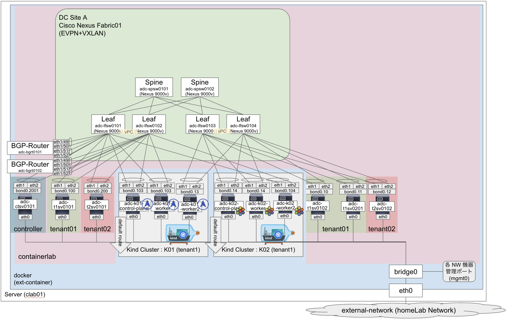
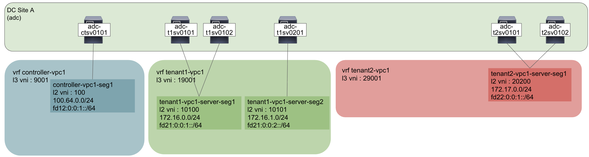

# nxos_fabric/SingleSite

Cisco Nexus 9000v (N9Kv) で構成した EVPN+VXLAN Fabric を検証する

## 概要



Cilium、Hubble、Tetragonを`adc-k02`へ段階構築する計画は
[Cilium / Hubble / Tetragon ラボ検討](../docs/cilium-lab/README.md)を参照する。

- DataCenter(DC) Site は 1サイトとする
  - DC Site A
    - 通常の Fabric サイト想定用
      - EVPN BGP + Underlay OSPF 構成
    - Leaf を2セットとして Fabric 内の疎通確認も可能とする
    - 冗長数を 2 として冗長試験も可能とする
    - Network Function として MetalLB と BGP ネイバーを張る BGP-Router も設置する

### 機種構成

- Fabric 機器は Cisco Nexus 9000v (N9Kv) / Nexus 9300v nexus9300v64-lite.10.5.4.M.qcow2 を使用する
  - mgmt0 は外部からアクセス用として containerlab サーバの bridge0 へ接続して固定 IP をアサインする
  - メモリフットプリントを削減するため、10.5(3)F 以上を使用する ([参照 Reduced footprint N9Kv Lite image to 4.5G](https://www.cisco.com/c/en/us/td/docs/dcn/nx-os/nexus9000/105x/configuration/n9000v-9300v-9500v/cisco-nexus-9000v-9300v-9500v-guide-release-105x/m-new-and-changed-105x.html))
  - VXLAN の対応として、所謂 [New L3 VNI Mode](https://community.cisco.com/t5/tkb-%E3%83%87%E3%83%BC%E3%82%BF%E3%82%BB%E3%83%B3%E3%82%BF%E3%83%BC-%E3%83%89%E3%82%AD%E3%83%A5%E3%83%A1%E3%83%B3%E3%83%88/ndfc-new-l3vni-mode-%E3%81%AB%E3%81%A4%E3%81%84%E3%81%A6/ta-p/5128776#toc-hId-328186197) が N9Kv が非対応 ([L3VNI without VLAN : No](https://www.cisco.com/c/en/us/td/docs/dcn/nx-os/nexus9000/106x/configuration/n9000v-9300v-9500v/cisco-nexus-9000v-9300v-9500v-guide-release-106x/m-overview.html#Cisco_Reference.dita_55d93795-31c2-428b-be6b-8c2ed0fa7677)) のため、VLAN 付きの L3 VNI で試験する必要がある
- Server は疎通確認用に [network-multitool](https://github.com/srl-labs/network-multitool) を使用する
  - bonding で Network 機器へ接続する (eth1,eth2)
  - containerlab 上の検証ネットワーク向けにデフォルトルートを作成して疎通試験するようにする
  - eth0 は外部からアクセス用として containerlab サーバの bridge0 へ接続する
    - 基本的には `docker exec -it [container name] bash` などでアクセスするので IP は固定してない
- kind (Kubernetes in Docker) は Kubernetes `v1.35.5` の Node image を使用する

使用するコンテナイメージ:

```text
REPOSITORY                        TAG
vrnetlab/cisco_n9kv               10.5.4.M.lite
ghcr.io/hellt/network-multitool   latest
kindest/node                      v1.35.5
```

- Default User/Password
  - cisco_n9kv : admin:admin ([参照](https://containerlab.dev/manual/kinds/vr-n9kv/#credentials))
  - network-multitool : admin:multit00l ([参照](https://github.com/srl-labs/network-multitool#network-multitool-container-image))


#### 対応 Config

[configディレクトリ](./configs/singlesite/cisco_n9kv/)


### Overlay IP Address



Server コンテナは `scripts/linux/init-bond-singlevlan-route.sh` で `eth1`/`eth2` を bonding し、VLAN subinterface に IPv4/IPv6 とデフォルトルートを設定する。

| Node | VLAN | IPv4 | IPv4 GW | IPv6 | IPv6 GW |
| --- | ---: | --- | --- | --- | --- |
| adc-ctsv0101 | 2001 | 100.64.0.1/24 | 100.64.0.254 | fd12:0:0:1::101/64 | fd12:0:0:1::1 |
| adc-t1sv0101 | 100 | 172.16.0.1/24 | 172.16.0.254 | fd21:0:0:1::101/64 | fd21:0:0:1::1 |
| adc-t1sv0102 | 10 | 172.16.0.2/24 | 172.16.0.254 | fd21:0:0:1::102/64 | fd21:0:0:1::1 |
| adc-t1sv0201 | 11 | 172.16.1.1/24 | 172.16.1.254 | fd21:0:0:2::101/64 | fd21:0:0:2::1 |
| adc-t2sv0101 | 200 | 172.17.0.1/24 | 172.17.0.254 | fd22:0:0:1::101/64 | fd22:0:0:1::1 |
| adc-t2sv0102 | 20 | 172.17.0.2/24 | 172.17.0.254 | fd22:0:0:1::102/64 | fd22:0:0:1::1 |

## 構築手順

### 前提

- `bridge0` に接続できる containerlab 実行環境を用意する
  - 機器の外部接続に利用する
  - 必要に応じて `evpn-multisite.clab.yaml` IP を変更する
  - containerlab 環境の IP は `172.16.0.0/12` は使用してない前提で、重複するとサーバの接続 IP に影響が出る
- `vrnetlab/cisco_n9kv:10.5.4.M.lite` と `ceos:4.35.4M` を事前に pull/import しておく
- N9Kv は台数が多いため、ホスト側のメモリに余裕を持たせる

### 起動

```sh
export CLABNAME="nxos-fabric-singlesite"
export REPODIR="${HOME}/my-containerlab"
export CLABPATH="${REPODIR}/nxos_fabric/nxos_singlesite/"
cd $CLABPATH
```

```sh
containerlab deploy -t ${CLABNAME}.clab.yaml
```

N9Kv は起動に時間がかかり起動時に containerlab 実行環境サーバに負荷がかかるので、一部 Node に `startup-delay` を設定して初期起動時の負荷を分散している。よって40分程度待つことになる。

N9Kv Fabric は `configs/singlesite/<node>_run.txt` に設定ファイルを用意しているため、起動後に適用する。

個人で用意したツールを使用する場合 ([aled](https://github.com/suzuyu/alred#alred))。手動ログインして設定するでも問題はない。

```sh
cd $CLABPATH
```

```sh
alred prepare-hosts --input hosts.txt --output hosts.lab.yaml
alred push-config-dir --hosts hosts.lab.yaml --input-dir configs/singlesite/cisco_n9kv/ --file-suffix _run.txt  --username admin --password admin
```

投入が問題なければ write memory (`copy running-config startup-config`) をする

```sh
alred write-memory --hosts hosts.lab.yaml
```


### 疎通確認

Server コンテナから tenant 間・site 間の疎通を確認する。

#### 環境設定の設定

```sh
export CLABNAME="nxos-fabric-singlesite"
export ADCctsv0101v4=100.64.0.1
export ADCctsv0101v6=fd12:0:0:1::101
export ADCt1sv0101v4=172.16.0.1
export ADCt1sv0101v6=fd21:0:0:1::101
export ADCt1sv0102v4=172.16.0.2
export ADCt1sv0102v6=fd21:0:0:1::102
export ADCt1sv0201v4=172.16.1.1
export ADCt1sv0201v6=fd21:0:0:2::101
export ADCt2sv0101v4=172.17.0.1
export ADCt2sv0101v6=fd22:0:0:1::101
export ADCt2sv0102v4=172.17.0.2
export ADCt2sv0102v6=fd22:0:0:1::102
```

#### Site-A Leaf Set1 to Leaf Set2

```sh
docker exec -it clab-${CLABNAME}-adc-t1sv0101 ping -c 5 $ADCt1sv0102v4
docker exec -it clab-${CLABNAME}-adc-t1sv0101 ping -c 5 $ADCt1sv0201v4
docker exec -it clab-${CLABNAME}-adc-t2sv0101 ping -c 5 $ADCt2sv0102v4
```

```sh
docker exec -it clab-${CLABNAME}-adc-t1sv0101 ping6 -c 5 $ADCt1sv0102v6
docker exec -it clab-${CLABNAME}-adc-t1sv0101 ping6 -c 5 $ADCt1sv0201v6
docker exec -it clab-${CLABNAME}-adc-t2sv0101 ping6 -c 5 $ADCt2sv0102v6
```

#### Controller to Tenant1 / Tenant2 IPv6

```sh
docker exec -it clab-${CLABNAME}-adc-ctsv0101 ping6 -c 5 $ADCt1sv0101v6
docker exec -it clab-${CLABNAME}-adc-ctsv0101 ping6 -c 5 $ADCt1sv0201v6
docker exec -it clab-${CLABNAME}-adc-ctsv0101 ping6 -c 5 $ADCt2sv0102v6
```


### kind node to kind node

```sh
export CLABNAME="nxos-fabric-singlesite"
export ADCk01masterv4=172.16.3.11
export ADCk01masterv6=fd21:0:0:3::1:1
export ADCk01worker0v4=172.16.3.21
export ADCk01worker0v6=fd21:0:0:3::2:1
export ADCk01worker2v4=172.16.3.22
export ADCk01worker2v6=fd21:0:0:3::2:2
export ADCk02masterv4=172.16.4.11
export ADCk02masterv6=fd21:0:0:4::1:1
export ADCk02worker0v4=172.16.4.21
export ADCk02worker0v6=fd21:0:0:4::2:1
export ADCk02worker2v4=172.16.4.22
export ADCk02worker2v6=fd21:0:0:4::2:2
```

#### Site-A Server to k01 node & k02 node

```sh
docker exec -it clab-${CLABNAME}-adc-t1sv0101 ping -c 5 $ADCk01masterv4
docker exec -it clab-${CLABNAME}-adc-t1sv0101 ping -c 5 $ADCk01worker0v4
docker exec -it clab-${CLABNAME}-adc-t1sv0101 ping -c 5 $ADCk01worker2v4
docker exec -it clab-${CLABNAME}-adc-t1sv0101 ping -c 5 $ADCk02masterv4
docker exec -it clab-${CLABNAME}-adc-t1sv0101 ping -c 5 $ADCk02worker0v4
docker exec -it clab-${CLABNAME}-adc-t1sv0101 ping -c 5 $ADCk02worker2v4
```

```sh
docker exec -it clab-${CLABNAME}-adc-t1sv0101 ping6 -c 5 $ADCk01masterv6
docker exec -it clab-${CLABNAME}-adc-t1sv0101 ping6 -c 5 $ADCk01worker0v6
docker exec -it clab-${CLABNAME}-adc-t1sv0101 ping6 -c 5 $ADCk01worker2v6
docker exec -it clab-${CLABNAME}-adc-t1sv0101 ping6 -c 5 $ADCk02masterv6
docker exec -it clab-${CLABNAME}-adc-t1sv0101 ping6 -c 5 $ADCk02worker0v6
docker exec -it clab-${CLABNAME}-adc-t1sv0101 ping6 -c 5 $ADCk02worker2v6
```


### k01 metallb up

k01 クラスタで MetalLB を導入して BGP-Router と eBGP 接続を実施する

```sh
export CLABNAME="nxos-fabric-singlesite"
ls -alt clab-${CLABNAME}/adc-k01/k8s_kind/k01/kubeconfig-k01
sudo chmod g+r clab-${CLABNAME}/adc-k01/k8s_kind/k01/kubeconfig-k01
export KUBECONFIG=$PWD/clab-${CLABNAME}/adc-k01/k8s_kind/k01/kubeconfig-k01
```

```sh
kubectl get node
kubectl apply -f https://raw.githubusercontent.com/metallb/metallb/v0.15.3/config/manifests/metallb-frr.yaml
kubectl wait -n metallb-system --for=condition=Available deployment/controller --timeout=180s
kubectl rollout status -n metallb-system daemonset/speaker --timeout=180s
kubectl apply -f k8s_kind/k01/manifest/
```

MetalLB 状態確認

```sh
# 特定の Speaker Pod の名前を取得
SPEAKER_POD=$(kubectl get pod -n metallb-system -l app=metallb,component=speaker -o jsonpath='{.items[0].metadata.name}')

# 1. BGP ネイバーのサマリー（接続状態・UP時間・受信プレフィックス数など）を確認
kubectl exec -n metallb-system $SPEAKER_POD -c frr -- vtysh -c "show bgp summary"

# 2. 特定の BGP ネイバーの詳細情報を確認 (例: 対向IPが 172.16.3.4の場合)
kubectl exec -n metallb-system $SPEAKER_POD -c frr -- vtysh -c "show bgp neighbors 172.16.3.4"

# 3. FRR の実行中設定 (running-config) を確認
kubectl exec -n metallb-system $SPEAKER_POD -c frr -- vtysh -c "show running-config"

# 4. FRR が認識している IPv4 BGP テーブル全体の確認
kubectl exec -n metallb-system $SPEAKER_POD -c frr -- vtysh -c "show bgp ipv4 unicast"
```

サンプル用の Nginx への到達性を確認する

```sh
docker exec -it clab-${CLABNAME}-adc-t1sv0101 curl http://172.16.13.10
docker exec -it clab-${CLABNAME}-adc-t1sv0101 curl -g "http://[fd21::13:0:0:1:0]/"
```

### k02 Cilium 構築

k01 の MetalLB 動作確認後、k02 は Cilium CNI、Cilium LoadBalancer、BGP Control Plane、Hubble、
Egress Gateway、Tetragon を初期構築する。kubeconfig の準備、preflight、Helm values の生成と導入順序は
[adc-k02 Cilium 初期構築手順](k8s_kind/k02/cilium/README.md)を参照する。

### 停止

```sh
containerlab destroy -t ${CLABNAME}.clab.yaml
```

設定も削除する場合は下記とする。N9Kv は起動時に設定が多いと設定投入中にハングして落ちる時があるので、下記推奨。

```sh
containerlab destroy -t ${CLABNAME}.clab.yaml -c
```

## Appendix: kind Node の `inotify` instance 上限不足

### 症状

Containerlab の deploy 中に kind worker の `kubelet` が起動と crash を繰り返し、worker log に次のような
message が記録されることがある。

```text
error creating fsnotify watcher: too many open files
Registration of the raw container factory failed: inotify_init: too many open files
Failed to start cAdvisor
kubelet.service: Main process exited, status=1/FAILURE
```

このとき、`containerlab deploy` の出力では根本原因ではなく、次のような `kubeadm join` 失敗として表示される。
時刻、cluster 名、Node 名は実行環境によって異なる。

```text
14:49:42 ERRO node "adc-k01" deploy: failed to join node with kubeadm: command "docker exec --privileged adc-k01-worker kubeadm join --config /kind/kubeadm.conf --v=6" failed with error: exit status 1
```

この `ERRO` だけでは原因を特定できないため、失敗した worker の `kubelet` log で前述の
`inotify_init: too many open files` と cAdvisor 起動失敗があることを確認する。

control-plane API への IPv4／IPv6 疎通と TLS 接続が正常な場合、この事象は DNS や kubeadm 設定ではなく、
Containerlab host の `fs.inotify.max_user_instances` 不足を疑う。`inotify` resource は kind Node container ごとに
分離されず host で共有されるため、多 Node 構成では Linux の既定値 `128` を使い切る場合がある。

現在値は host 上で確認する。

```bash
sysctl fs.inotify.max_user_instances
sysctl fs.inotify.max_user_watches
```

Kind 公式資料でも、多 Node cluster では `fs.inotify.max_user_instances=128` と
`fs.inotify.max_user_watches=8192` が不足する場合があると説明されている。

- [kind Known Issues: Pod errors due to too many open files](https://kind.sigs.k8s.io/docs/user/known-issues/#pod-errors-due-to-too-many-open-files)

### 一時対応と再実行

今回確認した `max_user_instances` 不足には、Containerlab host 上で次を実行する。この変更は reboot すると失われる。

```bash
sudo sysctl -w fs.inotify.max_user_instances=512
```

設定値を確認してから single-site topology を再実行する。

```bash
sysctl fs.inotify.max_user_instances
containerlab deploy -t nxos-fabric-singlesite.clab.yaml
```

### 永続化

再起動後も維持する場合は、Containerlab host の `/etc/sysctl.d/` へ設定する。

```bash
echo 'fs.inotify.max_user_instances = 512' \
  | sudo tee /etc/sysctl.d/99-kind.conf

sudo sysctl --system
sysctl fs.inotify.max_user_instances
```

同じ `too many open files` が継続する場合は `fs.inotify.max_user_watches` の使用状況も確認し、変更する場合は
Kind 公式資料の推奨値と host 上の他 workload への影響を確認する。
