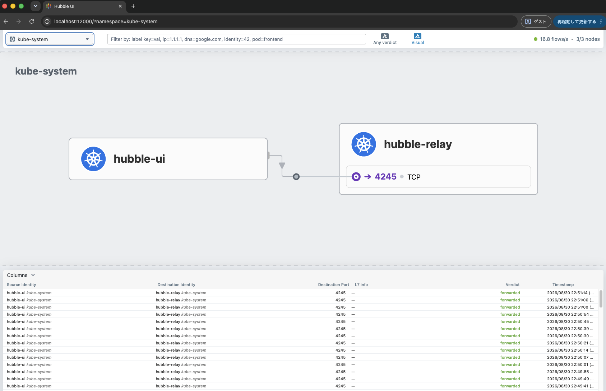

# adc-k02 Stage 2A lab-smoke 実行手順

この手順は、初期 platform 構築と resource 判定後に、Cilium LB IPAM、BGP Control Plane、
dual-stack ClusterIP／NodePort／LoadBalancer を確認する。コマンドは
`nxos_fabric/nxos_singlesite` を作業 directory として実行する。

## 1. 前提条件

- [adc-k02 Cilium 初期構築手順](../../../README.md)が完了している。
- `cilium status --context kind-adc-k02 --wait` が成功する。
- preflight が `FAIL=0` で、初期構築後に解消すべき `WARN` がない。
- worker 2 Node の aggregate blackhole route と LB IPAM／BGP resource が適用済みである。
- ADC BGR 2 台の設定が完了し、BGP session を確認できる。

試験中に発生した既知課題、回避策、再試験条件は
[Cilium ラボ試験課題台帳](../../../../../../../docs/cilium-lab/test-issue-register.md)で管理する。
手順内で課題 ID を示した項目は、課題台帳の影響と合否条件も確認する。

試験 workload の cluster への適用、Pod／Node 停止、BGP maintenance 試験は、それぞれ対象と操作を
確認してから実行する。この手順では最初に read-only の baseline と静的 render まで行う。

```bash
export REPO_ROOT="$(git rev-parse --show-toplevel)"
export K8S_CLIENT_RUNTIME="${REPO_ROOT}/nxos_fabric/nxos_singlesite/k8s_kind/client/runtime"
export PATH="${K8S_CLIENT_RUNTIME}/bin:${PATH}"
hash -r
command -v helm kubectl cilium hubble

export CLABNAME=nxos-fabric-singlesite
export KUBECONFIG="${REPO_ROOT}/nxos_fabric/nxos_singlesite/clab-${CLABNAME}/adc-k02/k8s_kind/k02/kubeconfig-k02"
export KUBE_CONTEXT=kind-adc-k02
export SMOKE_NS=cilium-lab-smoke
export SMOKE_ROOT=k8s_kind/k02/cilium/manifests/validation/lab-smoke

test -r "${KUBECONFIG}"
kubectl config get-contexts
kubectl --context "${KUBE_CONTEXT}" get nodes
```

`command -v` でいずれかが表示されない場合は、
[クライアントツール準備手順](../../../../../../../docs/cilium-lab/client-tools.md)を先に実行する。`PATH` は shell ごとの
設定であるため、新しい terminal で Hubble flow を取得する場合も同じ設定を実行する。

## 2. workload 適用前の BGP baseline

worker 2 Node から ADC BGR 2 台への IPv4／IPv6、合計 8 session が `Established` であることを確認する。

```bash
cilium bgp peers --context "${KUBE_CONTEXT}"

docker exec adc-k02-worker \
  ip route show type blackhole 172.16.14.0/26
docker exec adc-k02-worker2 \
  ip route show type blackhole 172.16.14.0/26
docker exec adc-k02-worker \
  ip -6 route show type blackhole fd21::14:0:0:1:0/112
docker exec adc-k02-worker2 \
  ip -6 route show type blackhole fd21::14:0:0:1:0/112
```

ADC BGR 2 台では tenant VRF の neighbor、受信 prefix、uptime を確認する。

```text
show bgp vrf tenant1-vpc1 ipv4 unicast summary
show bgp vrf tenant1-vpc1 ipv6 unicast summary
```

session が `Established` でない場合は workload を適用せず、Cilium peer address、source address、ASN、
VLAN／VNI、BGR neighbor を先に確認する。

## 3. 静的確認

```bash
kubectl kustomize "${SMOKE_ROOT}" > /tmp/adc-k02-lab-smoke.yaml
test -s /tmp/adc-k02-lab-smoke.yaml

kubectl --context "${KUBE_CONTEXT}" apply \
  --dry-run=client \
  -k "${SMOKE_ROOT}"
```

この時点では cluster を変更しない。`server` dry-run は object を永続化しないため、未作成の Namespace と
その Namespace 内の resource を 1 回の apply で検証すると、後続 resource の検証が `NotFound` になる。
Namespace を先に適用してから server-side 確認を行う。詳細は Kubernetes 公式の
[Server-side dry-run](https://kubernetes.io/docs/reference/using-api/api-concepts/#dry-run)を参照する。

## 4. Namespace の適用と server-side 確認

ここから cluster を変更する。試験用 Namespace の作成を明示的に判断した後に実行する。

```bash
kubectl --context "${KUBE_CONTEXT}" apply \
  -f "${SMOKE_ROOT}/namespace.yaml"

kubectl --context "${KUBE_CONTEXT}" apply \
  --dry-run=server \
  -k "${SMOKE_ROOT}"

kubectl --context "${KUBE_CONTEXT}" diff -k "${SMOKE_ROOT}"
export DIFF_RC=$?
test "${DIFF_RC}" -le 1
```

`kubectl diff` の終了 code `1` は差分ありを意味する。Namespace は差分なし、表示される差分は
`cilium-lab-smoke` Namespace 内の予定 resource だけであることを確認する。

## 5. workload の適用

cluster への適用を明示的に判断した後に実行する。

```bash
kubectl --context "${KUBE_CONTEXT}" apply -k "${SMOKE_ROOT}"
kubectl --context "${KUBE_CONTEXT}" -n "${SMOKE_NS}" \
  rollout status deployment/lab-smoke --timeout=180s
kubectl --context "${KUBE_CONTEXT}" -n "${SMOKE_NS}" \
  wait --for=condition=Ready pod/lab-smoke-client --timeout=180s

kubectl --context "${KUBE_CONTEXT}" -n "${SMOKE_NS}" get \
  pod,service,endpointslice -o wide
```

既存 workload に ConfigMap の nginx 設定変更を再適用する場合は、ConfigMap の更新だけでは既存 Pod の
`subPath` mount が更新されないため、Deployment を明示的に restart する。
Deployment は 2 replica を worker 2 Node へ `required` Pod anti-affinity で分散するため、3 個目の surge Pod は
配置できない。`maxSurge: 0`、`maxUnavailable: 1` により、最低 1 Pod を維持しながら 1 Pod ずつ置換する。

```bash
kubectl --context "${KUBE_CONTEXT}" apply -k "${SMOKE_ROOT}"
kubectl --context "${KUBE_CONTEXT}" -n "${SMOKE_NS}" \
  rollout restart deployment/lab-smoke
kubectl --context "${KUBE_CONTEXT}" -n "${SMOKE_NS}" \
  rollout status deployment/lab-smoke --timeout=180s
```

backend 2 Pod が異なる worker に配置され、2 つの LoadBalancer Service へ `k02-app` pool から
IPv4／IPv6 VIP が動的に割り当てられることを確認する。

## 6. ClusterIP と Pod backend

```bash
export CLUSTER_V4="$(kubectl --context "${KUBE_CONTEXT}" -n "${SMOKE_NS}" \
  get service lab-smoke-clusterip -o jsonpath='{.spec.clusterIPs[0]}')"
export CLUSTER_V6="$(kubectl --context "${KUBE_CONTEXT}" -n "${SMOKE_NS}" \
  get service lab-smoke-clusterip -o jsonpath='{.spec.clusterIPs[1]}')"

kubectl --context "${KUBE_CONTEXT}" -n "${SMOKE_NS}" exec pod/lab-smoke-client -- \
  curl -sS --connect-timeout 3 http://lab-smoke-clusterip
kubectl --context "${KUBE_CONTEXT}" -n "${SMOKE_NS}" exec pod/lab-smoke-client -- \
  curl -sS --connect-timeout 3 "http://${CLUSTER_V4}"
kubectl --context "${KUBE_CONTEXT}" -n "${SMOKE_NS}" exec pod/lab-smoke-client -- \
  curl -g -sS --connect-timeout 3 "http://[${CLUSTER_V6}]"
```

応答は backend Pod の hostname とし、複数の新規 connection で 2 Pod の名前を確認する。
nginx は `0.0.0.0:8080` と `[::]:8080` の両方で待ち受けるため、IPv4／IPv6 ClusterIP のいずれも
同じ backend Pod へ到達できることを確認する。

## 7. Fabric 側 NodePort

`lab-smoke-nodeport` は通常の `externalTrafficPolicy: Cluster`、`lab-smoke-nodeport-local` は
既知課題 `TI-001` の試験継続用 `externalTrafficPolicy: Local` である。Cluster Service は削除せず、
local／remote backend の regression 確認に使用する。

```bash
export NODE_PORT_CLUSTER="$(kubectl --context "${KUBE_CONTEXT}" -n "${SMOKE_NS}" \
  get service lab-smoke-nodeport -o jsonpath='{.spec.ports[0].nodePort}')"
export NODE_PORT_LOCAL="$(kubectl --context "${KUBE_CONTEXT}" -n "${SMOKE_NS}" \
  get service lab-smoke-nodeport-local -o jsonpath='{.spec.ports[0].nodePort}')"

docker exec "clab-${CLABNAME}-adc-t1sv0101" \
  curl -sS --connect-timeout 3 "http://172.16.4.21:${NODE_PORT_CLUSTER}"
docker exec "clab-${CLABNAME}-adc-t1sv0101" \
  curl -sS --connect-timeout 3 "http://172.16.4.22:${NODE_PORT_CLUSTER}"
docker exec "clab-${CLABNAME}-adc-t1sv0101" \
  curl -g -sS --connect-timeout 3 "http://[fd21:0:0:4::2:1]:${NODE_PORT_CLUSTER}"
docker exec "clab-${CLABNAME}-adc-t1sv0101" \
  curl -g -sS --connect-timeout 3 "http://[fd21:0:0:4::2:2]:${NODE_PORT_CLUSTER}"
```

`TI-001` の再現条件に一致して IPv6 Cluster NodePort だけが断続的に timeout する場合は、失敗した
request の応答 backend、試行回数、時刻を記録し、次の Local NodePort の連続確認へ進む。

```bash
for TARGET in \
  172.16.4.21 \
  172.16.4.22 \
  '[fd21:0:0:4::2:1]' \
  '[fd21:0:0:4::2:2]'
do
  echo "### Local NodePort target: ${TARGET}"
  for ATTEMPT in $(seq 1 20); do
    if RESULT="$(docker exec "clab-${CLABNAME}-adc-t1sv0101" \
      curl -g -sS --connect-timeout 3 --max-time 3 \
      "http://${TARGET}:${NODE_PORT_LOCAL}" 2>&1)"
    then
      printf '%02d PASS %s\n' "${ATTEMPT}" "${RESULT}"
    else
      printf '%02d FAIL %s\n' "${ATTEMPT}" "${RESULT}"
    fi
  done
done
```

両 worker に local backend がある初期状態では、4 target が各 20 回連続で成功し、応答 hostname が
target と同じ worker の backend であることを回避策の初期合格条件とする。失敗が 1 回でもあれば後続試験を
止め、`TI-001` の影響範囲を更新する。

### 7.1 `TI-001` の原因推定と情報ソース

このラボでは、IPv6 Cluster NodePort の remote backend 応答だけで TCP checksum 不整合を観測した。
Fabric route／NDP、Pod 間 IPv6、backend の IPv6 待受、Cilium Service map、policy drop、NIC offload、
BPF／Legacy host routing を切り分けた結果、IPv6 reverse NAT 時の L4 checksum 更新を暫定原因の候補とした。
観測結果と否定できた要因の詳細は、
[試験課題台帳の `TI-001`](../../../../../../../docs/cilium-lab/test-issue-register.md)を参照する。

Cilium `v1.20.1` の [`ipv6_l4_csum_update()` 実装](https://github.com/cilium/cilium/blob/v1.20.1/bpf/lib/lb.h)は、
最初に `BPF_F_IPV6` を使用し、kernel がこの flag を受け付けず `-EINVAL` を返した場合は旧 kernel 向けの
fallback path を使用する。関連する Cilium の [PR #39279](https://github.com/cilium/cilium/pull/39279)と
[PR #39631](https://github.com/cilium/cilium/pull/39631)には、IPv6 tunneling／underlay の checksum 問題に対する
workaround と long-term solution の経緯がある。

Linux の [stable patch](https://www.spinics.net/lists/netdev/msg1099852.html)は、Cilium が IPv6 packet の
reverse SNAT 後に L4 checksum を更新する際、`CHECKSUM_COMPLETE` の一部条件で `skb->csum` が不正になる問題と、
それを区別する `BPF_F_IPV6` を説明している。これは今回の「IPv4 は成功し、IPv6 remote backend 応答だけが
checksum 不整合になる」という観測と整合する。

ただし、現時点ではこのラボでの原因を upstream defect と確定していない。`BPF_F_IPV6` と関連 stable fix を
含む host kernel で同一 workload を A／B 比較し、Cluster NodePort の remote backend が安定して成功することを
確認するまでは「有力な原因仮説」として扱う。kind Node image の変更だけでは host kernel の比較にはならない。

試験継続時に `externalTrafficPolicy: Local` を使用する根拠は、local endpoint のみを転送対象にして今回の
remote backend path を避けるためである。LoadBalancer VIP の BGP 広告についても、Cilium の
[ExternalTrafficPolicy と Prefix Aggregation の仕様](https://docs.cilium.io/en/stable/network/bgp-control-plane/bgp-control-plane-configuration/#prefix-aggregation)に従い、
local endpoint を持つ Node だけが exact route を広告することを確認する。

## 8. LoadBalancer VIP と BGP route

動的に割り当てられた VIP を取得する。

```bash
export LB_CLUSTER_V4="$(kubectl --context "${KUBE_CONTEXT}" -n "${SMOKE_NS}" \
  get service lab-smoke-lb-cluster \
  -o jsonpath='{range .status.loadBalancer.ingress[*]}{.ip}{"\n"}{end}' | awk '!/:/')"
export LB_CLUSTER_V6="$(kubectl --context "${KUBE_CONTEXT}" -n "${SMOKE_NS}" \
  get service lab-smoke-lb-cluster \
  -o jsonpath='{range .status.loadBalancer.ingress[*]}{.ip}{"\n"}{end}' | awk '/:/')"
export LB_LOCAL_V4="$(kubectl --context "${KUBE_CONTEXT}" -n "${SMOKE_NS}" \
  get service lab-smoke-lb-local \
  -o jsonpath='{range .status.loadBalancer.ingress[*]}{.ip}{"\n"}{end}' | awk '!/:/')"
export LB_LOCAL_V6="$(kubectl --context "${KUBE_CONTEXT}" -n "${SMOKE_NS}" \
  get service lab-smoke-lb-local \
  -o jsonpath='{range .status.loadBalancer.ingress[*]}{.ip}{"\n"}{end}' | awk '/:/')"

test -n "${LB_CLUSTER_V4}" && test -n "${LB_CLUSTER_V6}"
test -n "${LB_LOCAL_V4}" && test -n "${LB_LOCAL_V6}"

printf 'Cluster: %s %s\nLocal: %s %s\n' \
  "${LB_CLUSTER_V4}" "${LB_CLUSTER_V6}" "${LB_LOCAL_V4}" "${LB_LOCAL_V6}"
```

Cilium から広告した route と、Fabric client の経路を確認する。

```bash
cilium bgp routes advertised ipv4 unicast --context "${KUBE_CONTEXT}"
cilium bgp routes advertised ipv6 unicast --context "${KUBE_CONTEXT}"

docker exec "clab-${CLABNAME}-adc-t1sv0101" ip route get "${LB_CLUSTER_V4}"
docker exec "clab-${CLABNAME}-adc-t1sv0101" ip -6 route get "${LB_CLUSTER_V6}"

docker exec "clab-${CLABNAME}-adc-t1sv0101" \
  curl -sS --connect-timeout 3 "http://${LB_CLUSTER_V4}"
docker exec "clab-${CLABNAME}-adc-t1sv0101" \
  curl -g -sS --connect-timeout 3 "http://[${LB_CLUSTER_V6}]"
docker exec "clab-${CLABNAME}-adc-t1sv0101" \
  curl -sS --connect-timeout 3 "http://${LB_LOCAL_V4}"
docker exec "clab-${CLABNAME}-adc-t1sv0101" \
  curl -g -sS --connect-timeout 3 "http://[${LB_LOCAL_V6}]"
```

IPv6 Cluster LoadBalancer は `TI-001` と同じ remote backend path を使用する可能性があるため、複数回実行して
応答 backend と失敗率を記録する。IPv6 Local LoadBalancer は 20 回連続で成功することを確認する。Cluster 側で
`TI-001` と同じ症状だけが発生し、Local 側が課題台帳の回避策合格条件を満たした場合は、基盤全体を合格には
せず「`TI-001` の既知課題付き」として後続の Hubble／Tetragon 試験を継続できる。

```bash
for URL in \
  "http://${LB_CLUSTER_V4}" \
  "http://[${LB_CLUSTER_V6}]" \
  "http://${LB_LOCAL_V4}" \
  "http://[${LB_LOCAL_V6}]"
do
  echo "### LoadBalancer target: ${URL}"
  for ATTEMPT in $(seq 1 20); do
    if RESULT="$(docker exec "clab-${CLABNAME}-adc-t1sv0101" \
      curl -g -sS --connect-timeout 3 --max-time 3 \
      "${URL}" 2>&1)"
    then
      printf '%02d PASS %s\n' "${ATTEMPT}" "${RESULT}"
    else
      printf '%02d FAIL %s\n' "${ATTEMPT}" "${RESULT}"
    fi
  done
done
```

Cluster／Local の各結果を分けて記録する。Local の IPv4／IPv6 が各 20 回連続で成功しない場合は、
`TI-001` の回避策として使用しない。

Service ごとの期待する広告は次のとおりである。

| Service | `externalTrafficPolicy` | IPv4／IPv6 prefix | 広告 Node |
|---|---|---|---|
| `lab-smoke-lb-cluster` | `Cluster` | `/26`／`/112` aggregate | BGP speaker 2 Node |
| `lab-smoke-lb-local` | `Local` | `/32`／`/128` exact route | local endpoint を持つ Node だけ |

Cilium は `externalTrafficPolicy: Local` の LoadBalancerIP を広告する場合、
`aggregationLengthIPv4`／`aggregationLengthIPv6` を無視して exact route を広告する。詳細は
[Cilium BGP Control Plane Resources: Prefix Aggregation](https://docs.cilium.io/en/stable/network/bgp-control-plane/bgp-control-plane-configuration/#prefix-aggregation)を参照する。

初期 workload は backend 2 Pod を異なる worker へ配置するため、Local Service の exact route も
2 Node から広告される。endpoint がない Node から広告されないことの証明は、基本通信合格後に backend を
1 Node へ限定する障害／withdraw 試験で行う。

### 8.1 ADC BGR の unicast route

ADC BGR 2 台では、Cluster Service の aggregate、Local Service の exact route、Cilium Node next-hop を確認する。
次の block は `adc-bgrt0101` と `adc-bgrt0102` へ個別に、そのまま貼り付けて実行する。

```text
terminal length 0

show bgp vrf tenant1-vpc1 ipv4 unicast 172.16.14.0/26
show bgp vrf tenant1-vpc1 ipv6 unicast fd21::14:0:0:1:0/112
show bgp vrf tenant1-vpc1 ipv4 unicast 172.16.14.21/32
show bgp vrf tenant1-vpc1 ipv6 unicast fd21::14:0:0:1:101/128

show ip route 172.16.14.20 vrf tenant1-vpc1
show ip route 172.16.14.21 vrf tenant1-vpc1
show ipv6 route fd21::14:0:0:1:100 vrf tenant1-vpc1
show ipv6 route fd21::14:0:0:1:101 vrf tenant1-vpc1

show forwarding ipv4 route 172.16.14.0/26 detail vrf tenant1-vpc1
show forwarding ipv4 route 172.16.14.21/32 detail vrf tenant1-vpc1
show forwarding ipv6 route fd21::14:0:0:1:0/112 detail vrf tenant1-vpc1
show forwarding ipv6 route fd21::14:0:0:1:101/128 detail vrf tenant1-vpc1
```

Cluster Service の aggregate は worker 2 Node の next-hop を持つことを確認する。Local Service の exact route は、
該当 Service の local endpoint を持つ Node だけを next-hop とすることを確認する。

`show ip route` は IPv4 RIB 専用であり、IPv6 address を指定すると `% Invalid ip address` になる。
IPv6 RIB は `show ipv6 route <IPv6-address> vrf <vrf-name>` を使用する。構文は Cisco 公式の
[Nexus 9000 NX-OS `10.5(x)` Show Commands: `show ipv6 route`](https://www.cisco.com/c/en/us/td/docs/dcn/nx-os/nexus9000/105x/command-reference/show/b_n9k_show_commands_1051/m_i_showcmds.html)を参照する。

Nexus 9000v `10.5(4)` では、aggregate 内の VIP address を `show forwarding ... route` に指定すると、
BGP／RIB に route が存在していても `no longest match` と表示された。FIB の受入確認では VIP address ではなく、
aggregate／exact prefix 自体と `detail` を指定する。構文は Cisco 公式の
[Nexus 9000 NX-OS `10.5(x)` F Show Commands](https://www.cisco.com/c/en/us/td/docs/dcn/nx-os/nexus9000/105x/command-reference/show/b_n9k_show_commands_1051/m_f_showcmds.pdf)を参照する。

### 8.2 ADC Leaf の EVPN Type-5

ADC Leaf 1／2 では、BGR から受信した aggregate／exact route が EVPN Route Type 5 に変換され、
tenant VRF の RIB／FIB に存在することを確認する。次の block は `adc-lfsw0101` と `adc-lfsw0102` へ
個別に、そのまま貼り付けて実行する。

```text
terminal length 0

show bgp l2vpn evpn route-type 5 | include 172.16.14
show bgp l2vpn evpn route-type 5 | include fd21

show ip route 172.16.14.20 vrf tenant1-vpc1
show ip route 172.16.14.21 vrf tenant1-vpc1
show ipv6 route fd21::14:0:0:1:100 vrf tenant1-vpc1
show ipv6 route fd21::14:0:0:1:101 vrf tenant1-vpc1

show forwarding ipv4 route 172.16.14.0/26 detail vrf tenant1-vpc1
show forwarding ipv4 route 172.16.14.21/32 detail vrf tenant1-vpc1
show forwarding ipv6 route fd21::14:0:0:1:0/112 detail vrf tenant1-vpc1
show forwarding ipv6 route fd21::14:0:0:1:101/128 detail vrf tenant1-vpc1
```

NX-OS `10.5(4)` では `show bgp l2vpn evpn route-type 5 <PREFIX>` が構文エラーになるため、
route-type 5 の一覧を `include` で絞り込む。IPv4／IPv6 の aggregate と Local Service exact route が
存在せず、BGR の unicast RIB だけに存在する場合は合格としない。

### 8.3 Forwarding 表の差異がある場合

BGP／RIB／EVPN に route が存在する一方、aggregate prefix が Forwarding 表で `no exact match` となる場合、
または BGR の 2-path RIB が Forwarding 表で 1 path だけに見える場合は、Stage 8 全体を合格にしない。
基本通信と後続の観測試験は継続できるが、Forwarding／ECMP 冗長性は
[試験課題台帳の `TI-002`](../../../../../../../docs/cilium-lab/test-issue-register.md)として切り分ける。

ADC BGR 2 台で次を取得し、`partial`／`unresolved` route と RIB／Forwarding inconsistency の有無を確認する。

```text
terminal length 0

show forwarding ipv4 route partial vrf tenant1-vpc1
show forwarding ipv6 route partial vrf tenant1-vpc1
show forwarding ipv4 route unresolved vrf tenant1-vpc1
show forwarding ipv6 route unresolved vrf tenant1-vpc1
show forwarding ecmp platform
show forwarding ecmp partial
show forwarding ipv4 unicast inconsistency suppress-transient vrf tenant1-vpc1
show forwarding ipv6 unicast inconsistency suppress-transient vrf tenant1-vpc1
```

## 9. Hubble flow

### 9.1 Relay status

```bash
hubble status --kube-context "${KUBE_CONTEXT}" -P
hubble list nodes --kube-context "${KUBE_CONTEXT}" -P
```

`Healthcheck: Ok` かつ `Connected Nodes: 3/3`、全 Node が `Connected` であることを確認する。

Hubble の `Current/Max Flows` が `100%` でも、ring buffer が満杯になり古い flow を順次上書きしている状態であり、
それ自体は Relay 障害を意味しない。過去 5 分の namespace 全体を表示すると kubelet probe などが混在するため、
合否確認では次の live follow と Pod filter を使用する。Hubble の buffer と Relay の動作は
[Cilium Hubble internals](https://docs.cilium.io/en/stable/internals/hubble/)を参照する。

### 9.2 client Pod の live flow

1 つ目の terminal で client Pod に関係する flow を追跡する。

```bash
hubble observe --kube-context "${KUBE_CONTEXT}" -P \
  --follow \
  --pod "${SMOKE_NS}/lab-smoke-client" \
  --print-node-name
```

2 つ目の terminal で dual-stack ClusterIP 通信を発生させる。

```bash
kubectl --context "${KUBE_CONTEXT}" -n "${SMOKE_NS}" \
  exec pod/lab-smoke-client -- \
  curl -4 -sS --connect-timeout 3 http://lab-smoke-clusterip

kubectl --context "${KUBE_CONTEXT}" -n "${SMOKE_NS}" \
  exec pod/lab-smoke-client -- \
  curl -6 -g -sS --connect-timeout 3 http://lab-smoke-clusterip
```

必要に応じて Service filter と詳細出力を追加する。

```bash
hubble observe --kube-context "${KUBE_CONTEXT}" -P \
  --last 100 \
  --service "${SMOKE_NS}/lab-smoke-clusterip" \
  --output dict \
  --print-node-name
```

client Pod、転送先 backend Pod、IPv4／IPv6、TCP、`FORWARDED`、観測 Node を確認する。L7 HTTP 情報は
L7 policy／proxy を有効化する Network Policy 試験で確認し、L3／L4 smoke test の必須条件にはしない。
[Hubble CLI の公式 flow 確認手順](https://docs.cilium.io/en/stable/observability/hubble/hubble-cli/)も参照する。

### 9.3 Hubble UI の基本確認

3 つ目の terminal でこの文書の冒頭にある `PATH`、`KUBECONFIG`、`KUBE_CONTEXT` の設定を再実行し、UI の
port-forward を開始する。

```bash
cilium hubble ui \
  --context "${KUBE_CONTEXT}" \
  --port-forward 12000 \
  --open-browser=false
```

browser を同じ host で使用する場合は `http://localhost:12000/` を開く。VS Code Remote SSH の場合は、試験 server の
TCP `12000` を local TCP `12000` へ転送する。Namespace `cilium-lab-smoke` を選択してから 9.2 の dual-stack 通信を
再実行し、次を確認する。

- 画面右上の接続 Node 数が `3/3` である。
- `lab-smoke-client` から `lab-smoke` への `forwarded` flow が表示される。
- TCP destination port `8080` と service map が表示される。
- CLI と UI の時刻、source、destination、verdict が対応する。

Hubble UI／Relay の基本動作を確認した出力例を次に示す。Namespace は `kube-system`、画面右上は
`3/3 nodes`、service map は `hubble-ui` から `hubble-relay:4245/TCP`、flow verdict は `forwarded` である。



*図 9-1: Hubble UI から Hubble Relay への接続と 3 Node の flow 集約例*

過去 flow が表示されない場合は、UI を開いた状態で通信を再生成する。基本確認後の Policy verdict／L7 表示は
[Network Policy／Tetragon 検証計画](../../../../../../../docs/cilium-lab/network-policy-and-tetragon-test-plan.md#453-hubble-cli-と-ui-の開始)で
試験する。詳細は [Cilium 公式 Hubble UI](https://docs.cilium.io/en/stable/observability/hubble/hubble-ui/)を参照する。

### 9.4 2026-08-30 の初回結果

- Hubble Relay healthcheck は `Ok`
- `Connected Nodes` は `3/3`
- Relay buffer は `12,285/12,285`、16.18 flows/s
- worker 1／2 上の両 backend に対する TCP flow と `FORWARDED` を確認
- namespace 全体の履歴は Node 由来の probe が中心だったため、Pod filter を使用した live flow を追加取得

live flow と同時に client Pod から IPv4／IPv6 ClusterIP へ接続し、次を確認した。

| Address family | client／観測 Node | Service translation／経路 | backend／観測 Node | 応答 | 判定 |
|---|---|---|---|---|---|
| IPv4 | `lab-smoke-client`／`adc-k02-worker2` | `lab-smoke-clusterip:80` の socket translation を `TRACED` | `lab-smoke-7d7bb8cdc7-hpt4c:8080`／`adc-k02-worker2` | `lab-smoke-7d7bb8cdc7-hpt4c` | 合格 |
| IPv6 | `lab-smoke-client`／`adc-k02-worker2` | `to-overlay` による cross-node 転送 | `lab-smoke-7d7bb8cdc7-sgxzw:8080`／`adc-k02-worker` | `lab-smoke-7d7bb8cdc7-sgxzw` | 合格 |

DNS query／response、TCP SYN／SYN-ACK、data、FIN を含む flow はすべて `FORWARDED` で、client Pod、Service、
backend、local／cross-node の観測 Node を識別できた。これにより Stage 9 の初期 Hubble flow 確認は合格とする。

IPv6 ClusterIP の cross-node 通信成功は Cluster 内 datapath の正常性を示すが、Fabric から ingress する
Cluster NodePort／LoadBalancer の intermittent timeout を対象とする `TI-001` の解消根拠にはしない。

Hubble CLI `v1.19.4` から Relay `v1.20.1` への接続では、CLI が Relay より古く API compatibility を
保証しない旨の warning が表示された。2026-08-30 時点で Hubble CLI の公式 latest は `v1.19.4` であり、
healthcheck、3 Node 接続、flow 取得が成功しているため、この warning 単独では不合格にしない。
version 差と warning は受入記録へ残し、matching または newer CLI が公開された時点で再評価する。

## 10. Tetragon process event

### 10.1 compact event の基本確認

1 つ目の terminal で client Pod と同じ Node 上の Tetragon Pod を選び、event stream を開始する。

```bash
export TARGET_POD=lab-smoke-client
export TARGET_NODE="$(kubectl --context "${KUBE_CONTEXT}" -n "${SMOKE_NS}" \
  get pod "${TARGET_POD}" -o jsonpath='{.spec.nodeName}')"
export TETRAGON_POD="$(kubectl --context "${KUBE_CONTEXT}" -n kube-system \
  get pods -l app.kubernetes.io/name=tetragon \
  --field-selector "spec.nodeName=${TARGET_NODE}" \
  -o jsonpath='{.items[0].metadata.name}')"

test -n "${TETRAGON_POD}"
kubectl --context "${KUBE_CONTEXT}" -n kube-system exec \
  "${TETRAGON_POD}" -c tetragon -- \
  tetra getevents -o compact --pods "${TARGET_POD}"
```

2 つ目の terminal で process event と HTTP flow を発生させる。

```bash
kubectl --context "${KUBE_CONTEXT}" -n "${SMOKE_NS}" exec pod/lab-smoke-client -- \
  sh -c 'curl -sS --connect-timeout 3 http://lab-smoke-clusterip >/dev/null'
```

compact event では `process_exec`／`process_exit`、Pod metadata、binary、arguments、exit code を確認する。

### 10.2 full event の parent 確認

Tetragon 公式手順に従い、`-o compact` を外して full JSON event を取得する。

```bash
kubectl --context "${KUBE_CONTEXT}" -n kube-system exec \
  "${TETRAGON_POD}" -c tetragon -- \
  tetra getevents --pods "${TARGET_POD}"
```

別 terminal で 10.1 と同じ `curl` を実行し、`process_exec.process` の `binary`、`arguments`、
`parent_exec_id`、Pod metadata と、`process_exec.parent` の `binary`／`arguments` を確認する。
full event の構造は Tetragon 公式の
[Execution Monitoring](https://tetragon.io/docs/getting-started/execution/)を参照する。

argument に token、password、kubeconfig、Secret の内容を渡さない。full JSON は container ID などを含むため、
保存する場合は `operations/` 配下の Git 管理外領域を使用する。

### 10.3 2026-08-30 の初回結果

- 対象 workload と同じ `adc-k02-worker2` 上の Tetragon Pod から event を取得
- `cilium-lab-smoke/lab-smoke-client` の `/bin/sh` と `/usr/bin/curl` の process event を確認
- `curl -sS --connect-timeout 3 http://lab-smoke-clusterip` の arguments を確認
- `/usr/bin/curl` の process exit code は `0`
- compact event の基本確認は合格
- full JSON で curl の `parent_exec_id` と `/bin/sh` の `exec_id` が一致
- curl の `process_exec.parent.binary` は `/bin/sh`、parent arguments は実行した shell command と一致
- namespace、Pod、container、image、Pod label、workload、Node、cluster metadata を確認
- Stage 10 の compact／full process event 確認は合格

## 11. 初期合格条件

- Cilium 側の 8 BGP session が `Established` である。
- worker 2 Node に `/26`／`/112` の blackhole route がある。
- ClusterIP、Cluster／Local NodePort、2 種類の LoadBalancer で IPv4／IPv6 HTTP が成功する。
- app pool から動的に IPv4／IPv6 VIP が割り当てられる。
- Cluster Service は `/26`／`/112` aggregate、Local Service は `/32`／`/128` exact route として広告される。
- ADC BGR 2 台が期待する unicast route と Cilium Node next-hop を保持する。
- ADC Leaf 1／2 が IPv4／IPv6 の aggregate／exact route を EVPN Type-5 として保持する。
- 応答 hostname と Hubble flow から backend を識別できる。
- Tetragon で client Pod の process event を取得できる。
- Cilium／Tetragon Pod の restart と OOMKill が増加しない。

### 11.1 最終 health／restart／OOM 確認

Stage 9／10 の観測後に、component health と restart 増加がないことを確認する。

```bash
cilium status --context "${KUBE_CONTEXT}" --wait

kubectl --context "${KUBE_CONTEXT}" -n kube-system \
  rollout status daemonset/cilium --timeout=180s
kubectl --context "${KUBE_CONTEXT}" -n kube-system \
  rollout status daemonset/tetragon --timeout=180s
kubectl --context "${KUBE_CONTEXT}" -n kube-system \
  rollout status deployment/tetragon-operator --timeout=180s

kubectl --context "${KUBE_CONTEXT}" get pods -A \
  -o custom-columns='NAMESPACE:.metadata.namespace,NAME:.metadata.name,READY:.status.containerStatuses[*].ready,RESTARTS:.status.containerStatuses[*].restartCount,PHASE:.status.phase'

kubectl --context "${KUBE_CONTEXT}" get pods -A \
  -o jsonpath='{range .items[*]}{.metadata.namespace}{"/"}{.metadata.name}{" "}{range .status.containerStatuses[*]}{.name}{"="}{.lastState.terminated.reason}{" "}{end}{"\n"}{end}' | \
  grep OOMKilled || true

journalctl -k --since '-30 min' --no-pager | \
  grep -Ei 'oom|out of memory|killed process' || true
```

合格条件は Cilium、Operator、Envoy、Hubble Relay、Tetragon、Tetragon Operator が Ready、試験前から
意図しない restart 増加がなく、`OOMKilled` と host kernel の OOM 記録がないことである。完了済み Job の
Pod は `Succeeded` を正常とし、Ready が `false` であることだけを失敗にしない。

### 11.2 現時点の判定

| 項目 | 状態 | 備考 |
|---|---|---|
| Cilium／LB IPAM／BGP 基本動作 | 条件付き合格 | BGP／RIB／EVPN と基本通信は確認済み。Forwarding／ECMP は `TI-002` |
| Cluster 内 dual-stack 通信 | 合格 | ClusterIP、same-node／cross-node Pod 通信、Cilium health を確認済み |
| Fabric NodePort／LoadBalancer | 条件付き合格 | Local は合格。IPv6 Cluster の remote backend は `TI-001` |
| Hubble | 合格 | Relay 3／3 Node、Service translation、local／cross-node backend、`FORWARDED` を確認 |
| Tetragon | 合格 | process exec／exit、Pod metadata、binary、arguments、parent を確認 |
| 最終 resource health | 合格 | Component／Pod の Ready、restart 0、Pod の `OOMKilled` なし、host kernel の OOM 記録なしを確認済み |

`TI-001` の再現条件に限定して Cluster NodePort／LoadBalancer の IPv6 remote backend が失敗する場合、
この項目は未合格のまま課題台帳へ結果を記録する。Local NodePort／LoadBalancer の回避策合格条件をすべて
満たした場合に限り、`Workaround validated` として後続の観測・policy 試験を継続できる。

### 11.3 2026-08-30 の確認結果

- `cilium status` は Cilium、Operator、Envoy DaemonSet、Hubble Relay がすべて `OK`
- Cilium DaemonSet、Tetragon DaemonSet、Tetragon Operator Deployment の rollout はすべて完了
- 常駐 Pod はすべて Ready で、restart は 0
- `hubble-generate-certs` Job の Pod は `Succeeded` であり正常終了
- Pod の `lastState.terminated.reason` に `OOMKilled` はなし
- host kernel の直近 30 分の journal に OOM 関連記録はなし
- Single-site のため ClusterMesh が `disabled` であることは初期設計どおり

host kernel の OOM 記録は、次を host shell で実行して出力がないことを確認した。

```bash
journalctl -k --since '-30 min' --no-pager | \
  grep -Ei 'oom|out of memory|killed process' || true
```

`TI-002` により BGP／RIB と Nexus 9000v の Forwarding／ECMP 表が一致しない場合、基本通信、Hubble、
Tetragon、Network Policy の試験は継続できる。ただし Node／BGR 障害時の経路冗長性は、controlled withdraw で
実動作を確認するまで合格にしない。

未割り当て VIP、Node／BGR 障害、`planned-shut`、withdraw、ECMP の詳細試験は、基本通信合格後に
[Cilium Service VIP 経路集約の比較設計](../../../../../../../docs/cilium-lab/bgp-route-aggregation-design.md)と
[Cilium BGP 経路退避とメンテナンス設計](../../../../../../../docs/cilium-lab/bgp-maintenance-and-route-drain.md)へ進む。

## 12. 後続試験

`lab-smoke` の初期合格後は、
[Network Policy／Tetragon 検証計画](../../../../../../../docs/cilium-lab/network-policy-and-tetragon-test-plan.md)の
`NP-00` から開始し、Policy なしの baseline、default-deny、DNS、L3／L4、identity、FQDN、HTTP L7 の順に
確認する。

## 13. rollback

`lab-smoke` だけを削除し、Cilium、LB IPAM／BGP resource、Tetragon は維持する。

```bash
kubectl --context "${KUBE_CONTEXT}" delete -k "${SMOKE_ROOT}"
cilium bgp peers --context "${KUBE_CONTEXT}"
cilium status --context "${KUBE_CONTEXT}" --wait
```
