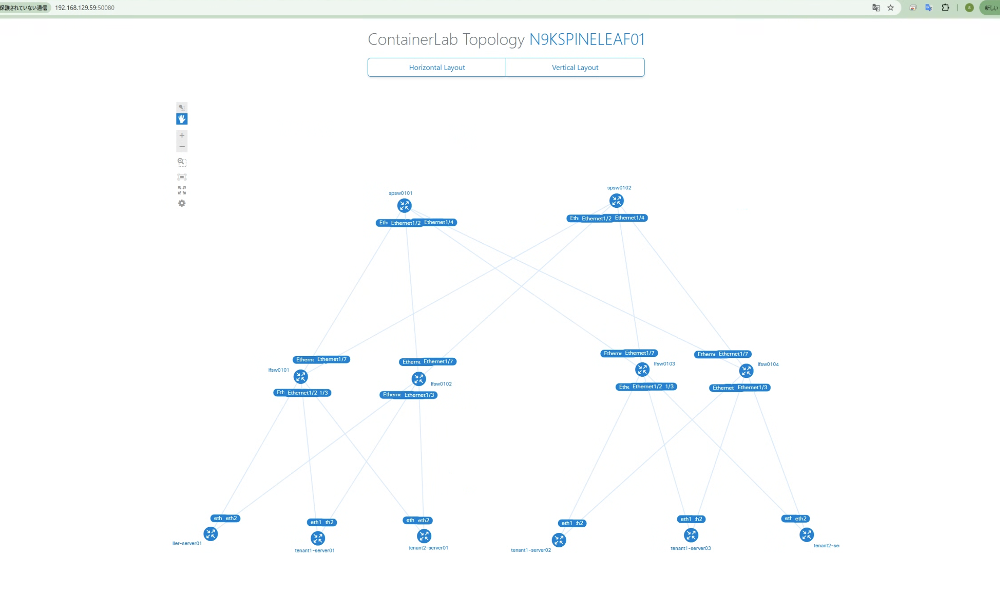

# nxos_spine-leaf

Cisco Nexus 9000v (N9Kv) で Leaf-Spine 構成を containerlab で動かす試験コード置き場



## 概要

N9Kv での Leaf-Spine 構成は CML コードで先に実行していたので、CML 内容とできるだけ同じになるように再現を試した

- 対象となる構成 CML は下記の通り
  - コード： `./cml/Leaf-Spine-01.yaml`
  - 構成は下記の画像


- 下記が現状での CML 実施との差分
  - mgmt0 の IP は Config では固定にしてない
  - vPC 設定の `peer-keepalive` は mgmt0 の IP を指定せずに、`virtual peer-link`と同じにしている
  - 外部アクセス用の IP は重複回避のため別の IP となるようにしている

実行サーバの**メモリ消費量は 90 GiB 近くになった**ので実施する場合には注意

### 書き替え場所

mgmt0 は実質使えないので、書き換える必要がある。`peer-keepalive`個所は書き換えて、vrf management の IP はコメントアウトする(もしくは削除)

```diff_sh:lfsw0101.cfg
...
vpc domain 1
-  peer-keepalive destination 192.168.129.72 source 192.168.129.71
+  peer-keepalive destination 10.0.0.2 source 10.0.0.1 vrf default
...
vrf context management
!  ip name-server 192.168.129.254
!  ip route 0.0.0.0/0 192.168.129.254
...
!interface mgmt0
!  vrf member management
!  ip address 192.168.129.81/24
...
```

`vrf management` の IP 設定は containerlab 側が設定するので外部アクセス観点では設定不要

## 事前準備： N9K image import

コンテナ化されてない VM イメージの実行お試しとして Cisco Nexus 9000v を動かす

- 参照ドキュメントページ
  - [User manual > VM-based routers integration](https://containerlab.dev/manual/vrnetlab/#vm-based-routers-integration)
  - [User manual > Kinds > Cisco > Cisco Nexus 9000v](https://containerlab.dev/manual/kinds/vr-n9kv/)


### N9Kv イメージダウンロード

ここでは構成試験用として Lite モードを選択してダウンロードする

[Cisco ページ](https://software.cisco.com/download/home)へログインして、
`Switches > Data Center Switches > Nexus 9000 Series Switches > Nexus 9000v Switch` で動作させたいバージョンを指定して`.qcow2`イメージをダウンロードする

今回は `nexus9300v64-lite.10.4.5.M.qcow2` をダウンロードしている

### Vrnetlab での N9Kv イメージインポート

[Vrnetlab](https://containerlab.dev/manual/vrnetlab/#vrnetlab)は通常の VM イメージ(qcow2)をコンテナ内にパッケージ化し、コンテナイメージ化できる

下記コマンドでダウンロード (git clone) して、`n9kv`のフォルダへ移動する

```sh
git clone https://github.com/srl-labs/vrnetlab
cd vrnetlab/cisco/n9kv
```

<details><summary>　git clone Logs　</summary><div>


```sh
[suzuyu@clab01 ~]$ git clone https://github.com/srl-labs/vrnetlab
Cloning into 'vrnetlab'...
remote: Enumerating objects: 6235, done.
remote: Counting objects: 100% (969/969), done.
remote: Compressing objects: 100% (113/113), done.
remote: Total 6235 (delta 899), reused 858 (delta 856), pack-reused 5266 (from 2)
Receiving objects: 100% (6235/6235), 4.00 MiB | 14.90 MiB/s, done.
Resolving deltas: 100% (3734/3734), done.
[suzuyu@clab01 ~]$ cd vrnetlab/cisco/n9kv
```

</div></details>


ダウンロードしたファイル(`nexus9300v64-lite.10.4.5.M.qcow2`)を `$HOME/vrnetlab/cisco/n9kv/`の下に配置する

```sh
[suzuyu@clab01 n9kv]$ ls
Makefile  README.md  docker  nexus9300v64-lite.10.4.5.M.qcow2
```

make コマンドでコンテナイメージに変換を実施する 

(`make docker-image`だけだとエラーになるので、下記のような指定オプションを実施している)

```sh
make docker-image IMAGE=nexus9300v64-lite.10.4.5.M.qcow2 VERSION=10.4.5.M
```


```sh
git clone https://github.com/srl-labs/vrnetlab
cd vrnetlab/cisco/n9kv
```

`vrnetlab/cisco/n9kv` へ `nexus9300v64-lite.10.4.5.M.qcow2` を配置してから下記を実行する

```sh
make docker-image IMAGE=nexus9300v64-lite.10.4.5.M.qcow2 VERSION=10.4.5.M
```

<details><summary>　make docker-image Logs　</summary><div>

```sh
[suzuyu@clab01 n9kv]$ make docker-image IMAGE=nexus9300v64-lite.10.4.5.M.qcow2 VERSION=10.4.5.M
for IMAGE in nexus9300v64-lite.10.4.5.M.qcow2; do \
        echo "Making $IMAGE"; \
        make IMAGE=$IMAGE docker-build; \
        make IMAGE=$IMAGE docker-clean-build; \
done
Making nexus9300v64-lite.10.4.5.M.qcow2
make[1]: ディレクトリ '/home/suzuyu/vrnetlab/cisco/n9kv' に入ります
--> Cleaning docker build context
rm -f docker/*.qcow2* docker/*.tgz* docker/*.vmdk* docker/*.iso docker/*.xml docker/*.bin
rm -f docker/healthcheck.py docker/vrnetlab.py
Building docker image using nexus9300v64-lite.10.4.5.M.qcow2 as vrnetlab/cisco_n9kv:10.4.5.M
make IMAGE=$IMAGE docker-build-image-copy
make[2]: ディレクトリ '/home/suzuyu/vrnetlab/cisco/n9kv' に入ります
cp nexus9300v64-lite.10.4.5.M.qcow2* docker/
make[2]: ディレクトリ '/home/suzuyu/vrnetlab/cisco/n9kv' から出ます
(cd docker; docker build --build-arg http_proxy= --build-arg HTTP_PROXY= --build-arg https_proxy= --build-arg HTTPS_PROXY= --build-arg IMAGE=nexus9300v64-lite.10.4.5.M.qcow2 --build-arg VERSION=10.4.5.M --label "vrnetlab-version=$(git log -1 --format=format:"Commit: %H from %aD")" -t vrnetlab/cisco_n9kv:10.4.5.M .)
[+] Building 21.7s (10/10) FINISHED                                                          docker:default
 => [internal] load build definition from Dockerfile                                                   0.0s
 => => transferring dockerfile: 294B                                                                   0.0s
 => [internal] load metadata for ghcr.io/srl-labs/vrnetlab-base:0.2.1                                  1.3s
 => [internal] load .dockerignore                                                                      0.0s
 => => transferring context: 2B                                                                        0.0s
 => [1/5] FROM ghcr.io/srl-labs/vrnetlab-base:0.2.1@sha256:4956c1ea80dbcbe1bfbc93c9a5c96bef33c7b6ccf  11.9s
 => => resolve ghcr.io/srl-labs/vrnetlab-base:0.2.1@sha256:4956c1ea80dbcbe1bfbc93c9a5c96bef33c7b6ccf4  0.0s
 => => sha256:4956c1ea80dbcbe1bfbc93c9a5c96bef33c7b6ccf4a21d1f23916273ad2d89ef 1.79kB / 1.79kB         0.0s
 => => sha256:061f67bf50cb59ded134a2bff7938d32933d17c74dfed15d656c3c87c52fdf7b 3.15kB / 3.15kB         0.0s
 => => sha256:efc2b5ad9eec05befa54239d53feeae3569ccbef689aa5e5dbfc25da6c4df559 29.13MB / 29.13MB       3.5s
 => => sha256:54d5e32361566d09ae3fbd51c62c9755fddd82beefb8b88d59ed7d9af8297bb4 15.66MB / 15.66MB       2.4s
 => => sha256:c5dc7af34ef3b1aa0b23eb6afae0f5332d922e32267389367e294003343ba1a2 102.49MB / 102.49MB     9.2s
 => => sha256:9414e63f785027c772db476df3dd0877281861ebbead1401a307c4ea5535db9d 373B / 373B             2.9s
 => => sha256:0aae2da289f2eed78511d50720bf81ab8ff495a80d1f1d360b28c5905f6e18ec 2.65kB / 2.65kB         3.5s
 => => extracting sha256:efc2b5ad9eec05befa54239d53feeae3569ccbef689aa5e5dbfc25da6c4df559              0.8s
 => => sha256:5a67243d020539a6b29ed67f6eff19d243678628b213fe3955388ee64975aee1 26.40MB / 26.40MB       6.4s
 => => sha256:3162d6fd0f0f052f9e56444f80de4b5eafc53cbc166605855ee2eff5ca2c5986 10.99kB / 10.99kB       4.0s
 => => extracting sha256:54d5e32361566d09ae3fbd51c62c9755fddd82beefb8b88d59ed7d9af8297bb4              0.2s
 => => extracting sha256:c5dc7af34ef3b1aa0b23eb6afae0f5332d922e32267389367e294003343ba1a2              1.3s
 => => extracting sha256:9414e63f785027c772db476df3dd0877281861ebbead1401a307c4ea5535db9d              0.0s
 => => extracting sha256:0aae2da289f2eed78511d50720bf81ab8ff495a80d1f1d360b28c5905f6e18ec              0.0s
 => => extracting sha256:5a67243d020539a6b29ed67f6eff19d243678628b213fe3955388ee64975aee1              0.8s
 => => extracting sha256:3162d6fd0f0f052f9e56444f80de4b5eafc53cbc166605855ee2eff5ca2c5986              0.0s
 => [internal] load build context                                                                      7.6s
 => => transferring context: 2.27GB                                                                    7.5s
 => [2/5] RUN apt-get update -qy    && apt-get install -y --no-install-recommends    udev vsftpd ftp   4.0s
 => [3/5] COPY nexus9300v64-lite.10.4.5.M.qcow2* /                                                     1.6s 
 => [4/5] COPY OVMF.fd /                                                                               0.0s 
 => [5/5] COPY *.py /                                                                                  0.0s 
 => exporting to image                                                                                 2.7s 
 => => exporting layers                                                                                2.7s 
 => => writing image sha256:5ddaa9940e08bb245376aa4f67902a1e1ae845abe7b1645b841c7e4f35df5ac1           0.0s 
 => => naming to docker.io/vrnetlab/cisco_n9kv:10.4.5.M                                                0.0s
make[1]: ディレクトリ '/home/suzuyu/vrnetlab/cisco/n9kv' から出ます
make[1]: ディレクトリ '/home/suzuyu/vrnetlab/cisco/n9kv' に入ります
--> Cleaning docker build context
rm -f docker/*.qcow2* docker/*.tgz* docker/*.vmdk* docker/*.iso docker/*.xml docker/*.bin
rm -f docker/healthcheck.py docker/vrnetlab.py
make[1]: ディレクトリ '/home/suzuyu/vrnetlab/cisco/n9kv' から出ます
[suzuyu@clab01 n9kv]$
```

`make docker-image`のみだとエラーになる。おそらく"F系"のイメージしか対応してない。

```sh:error_log
[suzuyu@clab01 n9kv]$ make docker-image
for IMAGE in nexus9300v64-lite.10.4.5.M.qcow2; do \
        echo "Making $IMAGE"; \
        make IMAGE=$IMAGE docker-build; \
        make IMAGE=$IMAGE docker-clean-build; \
done
Making nexus9300v64-lite.10.4.5.M.qcow2
make[1]: ディレクトリ '/home/suzuyu/vrnetlab/cisco/n9kv' に入ります
--> Cleaning docker build context
rm -f docker/*.qcow2* docker/*.tgz* docker/*.vmdk* docker/*.iso docker/*.xml docker/*.bin
rm -f docker/healthcheck.py docker/vrnetlab.py
ERROR: Incorrect version string (nexus9300v64-lite.10.4.5.M.qcow2). The regexp for extracting version information is likely incorrect, check the regexp in the Makefile or open an issue at https://github.com/hellt/vrnetlab/issues/new including the image file name you are using.
make[1]: *** [../../makefile.include:30: docker-build-common] エラー 1
make[1]: ディレクトリ '/home/suzuyu/vrnetlab/cisco/n9kv' から出ます
make[1]: ディレクトリ '/home/suzuyu/vrnetlab/cisco/n9kv' に入ります
--> Cleaning docker build context
rm -f docker/*.qcow2* docker/*.tgz* docker/*.vmdk* docker/*.iso docker/*.xml docker/*.bin
rm -f docker/healthcheck.py docker/vrnetlab.py
make[1]: ディレクトリ '/home/suzuyu/vrnetlab/cisco/n9kv' から出ます
[suzuyu@clab01 n9kv]$
```

</div></details>

`docker images` でコンテナイメージとしてインポートできていることを確認する

```sh
[suzuyu@clab01 n9kv]$ docker images
REPOSITORY              TAG        IMAGE ID       CREATED          SIZE
vrnetlab/cisco_n9kv     10.4.5.M   5ddaa9940e08   41 seconds ago   2.81GB
ceos                    4.32.0F    5be1eca0b025   7 hours ago      2.4GB
ghcr.io/nokia/srlinux   24.10      318c5a5c97cc   2 months ago     2.15GB
[suzuyu@clab01 n9kv]$ 
```

以上で、containerlab での実行イメージ準備完了

### containerlab 実行サーバ bridge 設定

mgmt0 を外部から接続するために、外部 IF (ここでは`enp1s0`) へブリッジ設定を実施する

```sh:ホストサーバ側で実施
# bridge 作成
sudo nmcli con add type bridge ifname bridge0
sudo nmcli con add type ethernet ifname enp1s0 master bridge0
sudo nmcli con mod bridge-bridge0 ipv4.method auto
sudo nmcli con up bridge-slave-enp1s0
sudo nmcli con up bridge-bridge0
```

外部 NW に合わせて `n9k_spine-leaf.clab.yaml` 内は下記の設定としている (ここでは外部 NW が `192.168.129.0/24` の場合)

```yaml
# https://containerlab.dev/manual/network/#bridge-name
mgmt:
  network: mgmt-ext
  ipv4-subnet: 192.168.129.0/24
  ipv4-range: 192.168.129.112/28
  bridge: bridge0
```


### 外部アクセス (サーバがRHEL9系の場合)

サーバがRHEL9系の場合は、[containerlabのドキュメントにある通り](https://containerlab.dev/manual/network/#external-access)下記の設定を事前に設定する

```sh
systemctl disable firewalld
systemctl stop firewalld
systemctl mask firewalld

systemctl enable --now nftables
```

### サーバ Bonding 設定

vPC 試験用にサーバの Bonding を  `./linux_scripts/init-bond-vlan-v4v6-modprobe.sh` を起動時に実行することで実現した

## ラボ実行

下記コマンドでラボをデプロイする

```sh
containerlab deploy
```

下記はデプロイ後の`docker ps`結果。起動・設定が終わると`(healthy)`となる

```sh:docker_ps_出力例
[suzuyu@clab01 nxos_spine-leaf]$ docker ps
CONTAINER ID   IMAGE                                    COMMAND                   CREATED          STATUS                    PORTS             NAMES
7d64be2fd1c0   ghcr.io/hellt/network-multitool:latest   "/docker-entrypoint.…"   55 minutes ago   Up 55 minutes             80/tcp, 443/tcp   clab-n9kspineleaf01-tenant2-server02
0ad902f02f3a   ghcr.io/hellt/network-multitool:latest   "/docker-entrypoint.…"   55 minutes ago   Up 55 minutes             80/tcp, 443/tcp   clab-n9kspineleaf01-tenant2-server01
98ce4abbc13b   ghcr.io/hellt/network-multitool:latest   "/docker-entrypoint.…"   55 minutes ago   Up 55 minutes             80/tcp, 443/tcp   clab-n9kspineleaf01-tenant1-server02
d90457213a47   ghcr.io/hellt/network-multitool:latest   "/docker-entrypoint.…"   55 minutes ago   Up 55 minutes             80/tcp, 443/tcp   clab-n9kspineleaf01-controller-server01
dac737d5bdc0   ghcr.io/hellt/network-multitool:latest   "/docker-entrypoint.…"   55 minutes ago   Up 55 minutes             80/tcp, 443/tcp   clab-n9kspineleaf01-tenant1-server03
17214fb97925   ghcr.io/hellt/network-multitool:latest   "/docker-entrypoint.…"   55 minutes ago   Up 55 minutes             80/tcp, 443/tcp   clab-n9kspineleaf01-tenant1-server01
eabff02f4d9c   vrnetlab/cisco_n9kv:10.4.5.M             "uv run /launch.py -…"   55 minutes ago   Up 55 minutes (healthy)                     clab-n9kspineleaf01-lfsw0101
d17862a44ffb   vrnetlab/cisco_n9kv:10.4.5.M             "uv run /launch.py -…"   55 minutes ago   Up 55 minutes (healthy)                     clab-n9kspineleaf01-lfsw0102
5c6780adb7d5   vrnetlab/cisco_n9kv:10.4.5.M             "uv run /launch.py -…"   55 minutes ago   Up 55 minutes (healthy)                     clab-n9kspineleaf01-spsw0102
af0b5dde8e4e   vrnetlab/cisco_n9kv:10.4.5.M             "uv run /launch.py -…"   55 minutes ago   Up 55 minutes (healthy)                     clab-n9kspineleaf01-spsw0101
6ac93342b0a6   vrnetlab/cisco_n9kv:10.4.5.M             "uv run /launch.py -…"   55 minutes ago   Up 55 minutes (healthy)                     clab-n9kspineleaf01-lfsw0103
0d7ed29dd43f   vrnetlab/cisco_n9kv:10.4.5.M             "uv run /launch.py -…"   55 minutes ago   Up 55 minutes (healthy)                     clab-n9kspineleaf01-lfsw0104
[suzuyu@clab01 nxos_spine-leaf]$ 
```

`containerlab graph` を実行するとグラフで構成が見れる

```sh:containerlab_graph_出力例
[suzuyu@clab01 nxos_spine-leaf]$ containerlab graph
23:29:00 INFO Parsing & checking topology file=n9k_spine-leaf.clab.yaml
23:29:00 INFO Serving topology graph
  addresses=
  │   http://172.17.0.1:50080
  │   http://192.168.129.59:50080


```

ブラウザでアクセスした表示結果が下記の通り (階層構成はドラックで動かした後の状態。こんな綺麗には最初ならない)


対象機器をクリックすると情報も見れる


### 機器操作

サーバ IF 経由で外部 NW から `./n9k_spine-leaf.clab.yaml` に設定している `mgmt-ipv4:` の IP を指定すれば ssh でログイン可能

```sh:ssh例
[suzuyu@clab01 nxos_spine-leaf]$ ssh admin@192.168.129.81
The authenticity of host '192.168.129.81 (192.168.129.81)' can't be established.
RSA key fingerprint is SHA256:Q4O1rGpcgG1MkxVxzPxRPEEfiNUkOOoJkCwKaFDn6Hs.
This key is not known by any other names
Are you sure you want to continue connecting (yes/no/[fingerprint])? yes
Warning: Permanently added '192.168.129.81' (RSA) to the list of known hosts.
User Access Verification
(admin@192.168.129.81) Password: 
(admin@192.168.129.81) Password: 

Cisco NX-OS Software
Copyright (c) 2002-2025, Cisco Systems, Inc. All rights reserved.
Nexus 9000v software ("Nexus 9000v Software") and related documentation,
files or other reference materials ("Documentation") are
the proprietary property and confidential information of Cisco
Systems, Inc. ("Cisco") and are protected, without limitation,
pursuant to United States and International copyright and trademark
laws in the applicable jurisdiction which provide civil and criminal
penalties for copying or distribution without Cisco's authorization.

Any use or disclosure, in whole or in part, of the Nexus 9000v Software
or Documentation to any third party for any purposes is expressly
prohibited except as otherwise authorized by Cisco in writing.
The copyrights to certain works contained herein are owned by other
third parties and are used and distributed under license. Some parts
of this software may be covered under the GNU Public License or the
GNU Lesser General Public License. A copy of each such license is
available at
http://www.gnu.org/licenses/gpl.html and
http://www.gnu.org/licenses/lgpl.html
***************************************************************************
*  Nexus 9000v is strictly limited to use for evaluation, demonstration   *
*  and NX-OS education. Any use or disclosure, in whole or in part of     *
*  the Nexus 9000v Software or Documentation to any third party for any   *
*  purposes is expressly prohibited except as otherwise authorized by     *
*  Cisco in writing.                                                      *
***************************************************************************
lfsw0101# 
```

同じくブラウザで IP へアクセスすると `NX-API Sandbox` へアクセスが可能


サーバは `docker exec -it <NAMES> bash` で操作可能 (下記は実施例)

```sh
[suzuyu@clab01 ~]$ docker exec -it clab-n9kspineleaf01-tenant1-server01 bash
bash-5.0# ip addr show
1: lo: <LOOPBACK,UP,LOWER_UP> mtu 65536 qdisc noqueue state UNKNOWN group default qlen 1000
    link/loopback 00:00:00:00:00:00 brd 00:00:00:00:00:00
    inet 127.0.0.1/8 scope host lo
       valid_lft forever preferred_lft forever
    inet6 ::1/128 scope host 
       valid_lft forever preferred_lft forever
3: bond0: <BROADCAST,MULTICAST,MASTER,UP,LOWER_UP> mtu 1500 qdisc noqueue state UP group default qlen 1000
    link/ether aa:c1:ab:67:76:d6 brd ff:ff:ff:ff:ff:ff
    inet6 fe80::a8c1:abff:fe67:76d6/64 scope link 
       valid_lft forever preferred_lft forever
4: bond0.100@bond0: <BROADCAST,MULTICAST,UP,LOWER_UP> mtu 1500 qdisc noqueue state UP group default qlen 1000
    link/ether aa:c1:ab:67:76:d6 brd ff:ff:ff:ff:ff:ff
    inet 172.16.0.1/24 scope global bond0.100
       valid_lft forever preferred_lft forever
    inet6 fd21:0:0:1::101/64 scope global 
       valid_lft forever preferred_lft forever
    inet6 fe80::a8c1:abff:fe67:76d6/64 scope link 
       valid_lft forever preferred_lft forever
952: eth2@if953: <BROADCAST,MULTICAST,SLAVE,UP,LOWER_UP> mtu 1500 qdisc noqueue master bond0 state UP group default 
    link/ether aa:c1:ab:67:76:d6 brd ff:ff:ff:ff:ff:ff link-netnsid 2
970: eth1@if971: <BROADCAST,MULTICAST,SLAVE,UP,LOWER_UP> mtu 1500 qdisc noqueue master bond0 state UP group default 
    link/ether aa:c1:ab:67:76:d6 brd ff:ff:ff:ff:ff:ff link-netnsid 1
974: eth0@if975: <BROADCAST,MULTICAST,UP,LOWER_UP> mtu 1500 qdisc noqueue state UP group default 
    link/ether 02:42:c0:a8:81:72 brd ff:ff:ff:ff:ff:ff link-netnsid 0
    inet 192.168.129.114/24 brd 192.168.129.255 scope global eth0
       valid_lft forever preferred_lft forever
    inet6 fe80::42:c0ff:fea8:8172/64 scope link 
       valid_lft forever preferred_lft forever
bash-5.0# ping 172.16.0.2
PING 172.16.0.2 (172.16.0.2) 56(84) bytes of data.
64 bytes from 172.16.0.2: icmp_seq=1 ttl=64 time=9.52 ms
64 bytes from 172.16.0.2: icmp_seq=2 ttl=64 time=5.13 ms
64 bytes from 172.16.0.2: icmp_seq=3 ttl=64 time=4.84 ms
^C
--- 172.16.0.2 ping statistics ---
3 packets transmitted, 3 received, 0% packet loss, time 2002ms
rtt min/avg/max/mdev = 4.844/6.498/9.516/2.137 ms
bash-5.0# ping6 fd21:0:0:1::102
PING fd21:0:0:1::102(fd21:0:0:1::102) 56 data bytes
64 bytes from fd21:0:0:1::102: icmp_seq=1 ttl=64 time=5.30 ms
64 bytes from fd21:0:0:1::102: icmp_seq=2 ttl=64 time=4.76 ms
64 bytes from fd21:0:0:1::102: icmp_seq=3 ttl=64 time=6.76 ms
^C
--- fd21:0:0:1::102 ping statistics ---
3 packets transmitted, 3 received, 0% packet loss, time 2003ms
rtt min/avg/max/mdev = 4.761/5.605/6.758/0.843 ms
bash-5.0# 
```

### EVPN-VXLAN 動作試験ログ

`./nxos_logs/` 内に各機器で下記を実行したログを入れている

leaf でのコマンド

```sh:leaf
show nve peers
show nve vni
show bgp l2vpn evpn summary
show bgp l2vpn evpn
show l2route evpn mac all
show l2route evpn mac-ip all
show vpc brief
show ip route vrf all
```

spine でのコマンド

```sh:spine
show bgp l2vpn evpn summary
show bgp l2vpn evpn
show ip route vrf all
show ip ospf neighbors 
```

## lite モード での注意点

メモリが `QEMU_MEMORY: 6144` だと bgp が `NoMem` となる。これはメモリ不足から起きたので、注意。ひとまず `QEMU_MEMORY: 12288` にしたら動いたので、12G にしている

下記はメモリ割り当て 6GiB 時のエラー発生時の出力ログ

```sh:6GiB時のエラー表示
lfsw0101# show bgp l2vpn evpn summary 
BGP summary information for VRF default, address family L2VPN EVPN
BGP router identifier 10.0.0.1, local AS number 65001
BGP table version is 35, L2VPN EVPN config peers 2, capable peers 0
18 network entries and 18 paths using 5256 bytes of memory
BGP attribute entries [15/5520], BGP AS path entries [0/0]
BGP community entries [0/0], BGP clusterlist entries [0/0]

Neighbor        V    AS    MsgRcvd    MsgSent   TblVer  InQ OutQ Up/Down  State/PfxRcd
10.0.0.253      4     0          0          0        0    0    0 00:10:39 Idle (NoMem)
10.0.0.254      4     0          0          0        0    0    0 00:10:39 Idle (NoMem)

Neighbor        T    AS PfxRcd     Type-2     Type-3     Type-4     Type-5     Type-12   
10.0.0.253      I     0 Idle (NoMem) 0          0          0          0          0         
10.0.0.254      I     0 Idle (NoMem) 0          0          0          0          0    
lfsw0101# show system resources
Load average:   1 minute: 0.36   5 minutes: 0.54   15 minutes: 0.81
Processes   :   854 total, 2 running
CPU states  :   2.05% user,   16.92% kernel,   81.02% idle
        CPU0 states  :   3.03% user,   9.09% kernel,   87.87% idle
        CPU1 states  :   2.06% user,   25.77% kernel,   72.16% idle
Memory usage:   6081940K total,   5538852K used,   543088K free
Kernel vmalloc:   0K total,   0K free
Kernel buffers:   184K Used
Kernel cached :   2751748K Used
Current memory status: Critical Alert
lfsw0101# show processes memory | inc bgp
 9611    157272  0           2743712     7ffc47624910/0             bgp
```
