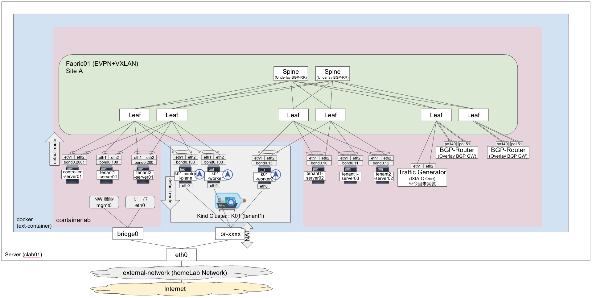
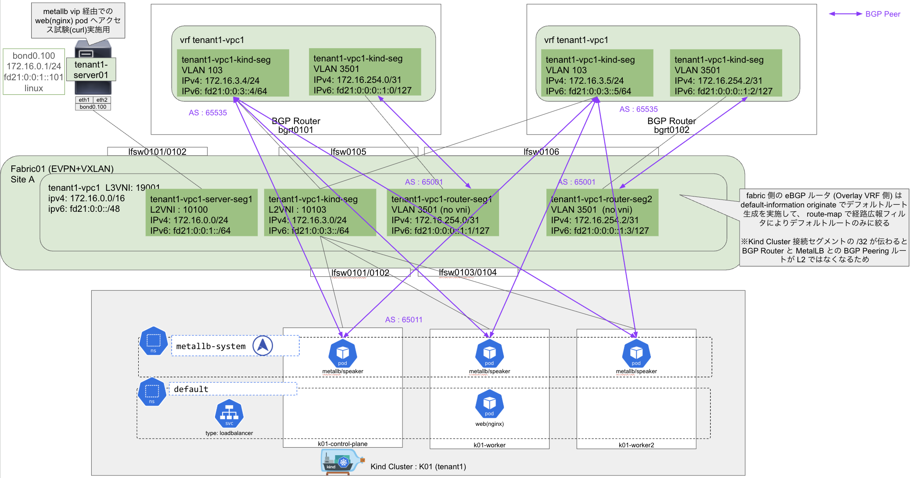

# nxos_spine-leaf_k8s

Cisco Nexus 9000v (N9Kv) で Leaf-Spine 構成を構築して、kind (kubernetes in docker) で Kubernetes クラスタ・MetalLB での BGP 接続を containerlab で動かす試験コード置き場

## 概要

`../nxos_spine-leaf/`. で実施した内容に Kubernetes クラスタ (`kind`) を追加した構成を試す

Kubernetes クラスタ上で MetalLB (FRRモード) を L3 mode で実施して、Leaf/Spine の先にある BGP Router と BGP 接続して LB としての動作試験を実施する

構成概要は下記の通り



Overlay 側視点での概要図は下記の通り。web(nginx)アプリを試験用に動かして動作確認する




## 事前準備

`../nxos_spine-leaf/` で下記を一通り実施済み

- NX-OS のコンテナイメージを作成 (N9Kv `10.5.3.M.lite`)

```sh
$ docker image ls | grep n9k
vrnetlab/cisco_n9kv                         10.5.4.M.lite   af38656712e2   47 hours ago   2.99GB
vrnetlab/cisco_n9kv                         10.6.2.F.lite   af38656712e2   47 hours ago   2.99GB
vrnetlab/cisco_n9kv                         10.4.5.M        5ddaa9940e08   8 days ago     2.81GB
```

kubernetes 操作のため kubectl のインストール


```sh
curl -LO https://dl.k8s.io/release/v1.34.3/bin/linux/amd64/kubectl
chmod +x kubectl
mkdir -p ~/.local/bin
mv ./kubectl ~/.local/bin/kubectl
```

下記ファイルを環境によって PATH を書き換える

```sh
vi $PWD/k8s_kind/k01/k01.kind.yaml
```

## 構築

### 使用する Network OS

メイン OS としては下記を選定する

| 項目 | 内容 |
|:-:|:-:|
| OS | Cisco Nexus 9000v (N9Kv)  |
| OS Ver. | 10.5(4)M |
| Ver. 理由 | [10.5(3)Fから Memory の footprint が 4.5G に削減](https://www.cisco.com/c/en/us/td/docs/dcn/nx-os/nexus9000/105x/configuration/n9000v-9300v-9500v/cisco-nexus-9000v-9300v-9500v-guide-release-105x/m-new-and-changed-105x.html) されたため <br> 10.6(X) でも可能 |
| vCPU | 4 (最小2,推奨4) <br> オーバコミット環境のため推奨値で設定 |
| Memory | 6144 (6GiB) (最小4.5GiB, 推奨 8BiB) <br> EVPN+VXLAN や vPC のため少し余裕を持たせた。要チューニング |


### 必要スペック概算

実行スペックの概算は下記の通り

| 種別 | OS | 台数 | vCPU | Memory |
|:-:|:-:|:-:|:-:|:-:|
| Spine | N9Kv | 2 | 8 (4x2) | 12 (6x2) |
| Leaf | N9Kv | 6 | 24(4x6) | 36 (6x6) |
| BGP-Router | N9Kv | 2 | 8 (4x2) | 12 (6x2) |
| Linux Server | alpine([network-multitool](https://github.com/srl-labs/network-multitool)) | 6 | 3 (0.5(目安)x6)  | 1 (128MiB(目安)x6) |
| Kubernetes Cluster | [kind](https://kind.sigs.k8s.io/) (v1.34.3) <br> + [MetalLB (FRR Mode)](https://metallb.io/#frr-mode)(v0.15.3) | 1Cluster<br>(3Node) | 2(目安) | 8(目安) |
| 合計 | - | 19 | 45 vCPU |  69GiB |

vCPU はオーバコミット前提で使用した。Memory は必須で、実施環境は used が 70GiB くらいとなった

```sh:参考メモリ利用状況
$ free
               total        used        free      shared  buff/cache   available
Mem:        94197128    70514284      878016      368364    24740472    23682844
Swap:        4194300           0     4194300
```

### 構築、確認

```sh
containerlab deploy
```

N9Kv の起動は 5~10 分くらいかかるので、下記コマンドで `(unhealthy)` -> `(healthy)` となったことを確認する

```sh
docker ps | grep n9kv
```

※ **注意**。この環境で Config 投入で途中で止まることがあったので、Leaf は containerlab での `startup-config` 投入をオフにしているので、起動後に手動で投入する

```sh
sudo chmod g+r clab-n9kspineleaf01/k01/k8s_kind/k01/kubeconfig-k01
export KUBECONFIG=$PWD/clab-n9kspineleaf01/k01/k8s_kind/k01/kubeconfig-k01
```

```sh
kubectl get node -owide
```

```sh:表示例
$ kubectl get node -owide
NAME                STATUS   ROLES           AGE   VERSION   INTERNAL-IP   EXTERNAL-IP   OS-IMAGE                         KERNEL-VERSION                 CONTAINER-RUNTIME
k01-control-plane   Ready    control-plane   16h   v1.34.3   172.18.0.2    <none>        Debian GNU/Linux 12 (bookworm)   5.14.0-611.27.1.el9_7.x86_64   containerd://2.2.0
k01-worker          Ready    <none>          16h   v1.34.3   172.18.0.3    <none>        Debian GNU/Linux 12 (bookworm)   5.14.0-611.27.1.el9_7.x86_64   containerd://2.2.0
k01-worker2         Ready    <none>          16h   v1.34.3   172.18.0.4    <none>        Debian GNU/Linux 12 (bookworm)   5.14.0-611.27.1.el9_7.x86_64   containerd://2.2.0
```

metallb をインストールする (実施のコードは`curl -LO https://raw.githubusercontent.com/metallb/metallb/v0.15.3/config/manifests/metallb-frr.yaml`でダウンロードしたもの)

```sh
kubectl apply -f k8s_kind/k01/manifest/metallb-frr.yaml
```

metallb の pool ip や bgppeer 設定などを設定する

```sh
kubectl apply -f k8s_kind/k01/manifest/10-metallb-ipaddresspool.yaml
kubectl apply -f k8s_kind/k01/manifest/20-metallb-bgppeer.yaml
kubectl apply -f k8s_kind/k01/manifest/30-metallb-bgpadv.yaml
```

metallb の状態を確認する

```sh
kubectl -n metallb-system get po -owide
```

```sh:表示例
$ kubectl -n metallb-system get po -owide
NAME                         READY   STATUS    RESTARTS   AGE    IP           NODE                NOMINATED NODE   READINESS GATES
controller-7b57bb8b6-vxptn   1/1     Running   0          16h    10.244.2.2   k01-worker          <none>           <none>
speaker-j5gr6                4/4     Running   0          122m   172.18.0.4   k01-worker2         <none>           <none>
speaker-lvktp                4/4     Running   0          122m   172.18.0.2   k01-control-plane   <none>           <none>
speaker-ndx6v                4/4     Running   0          122m   172.18.0.3   k01-worker          <none>           <none>
```

bgp 状態を確認する

```sh
kubectl -n metallb-system exec -it <speaker pod 名> -c frr --   vtysh -c "show bgp ipv4 summary"
kubectl -n metallb-system exec -it <speaker pod 名> -c frr --   vtysh -c "show bgp ipv6 summary"
```

下記は実施での出力例

```sh
$ kubectl -n metallb-system exec -it speaker-j5gr6 -c frr --   vtysh -c "show bgp ipv4 summary"

IPv4 Unicast Summary:
BGP router identifier 172.18.0.4, local AS number 65011 VRF default vrf-id 0
BGP table version 1
RIB entries 1, using 128 bytes of memory
Peers 2, using 33 KiB of memory

Neighbor        V         AS   MsgRcvd   MsgSent   TblVer  InQ OutQ  Up/Down State/PfxRcd   PfxSnt Desc
172.16.3.4      4      65535       130       129        1    0    0 02:04:23            0        1 N/A
172.16.3.5      4      65535       130       129        1    0    0 02:04:23            0        1 N/A

Total number of neighbors 2
$ kubectl -n metallb-system exec -it speaker-j5gr6 -c frr --   vtysh -c "show bgp ipv6 summary"

IPv6 Unicast Summary:
BGP router identifier 172.18.0.4, local AS number 65011 VRF default vrf-id 0
BGP table version 1
RIB entries 1, using 128 bytes of memory
Peers 2, using 33 KiB of memory

Neighbor        V         AS   MsgRcvd   MsgSent   TblVer  InQ OutQ  Up/Down State/PfxRcd   PfxSnt Desc
fd21:0:0:3::4   4      65535       130       129        1    0    0 02:04:28            0        1 N/A
fd21:0:0:3::5   4      65535       130       129        1    0    0 02:04:28            0        1 N/A

Total number of neighbors 2
```


試験用アプリをデプロイする

```sh
kubectl apply -f k8s_kind/k01/manifest/90-demo-service.yaml
```

Pod と SVC のデプロイ状況を確認する

```sh
kubectl get po
kubectl get svc
```

下記は実施での出力例


```sh:実行表示例
$ kubectl get po
NAME                   READY   STATUS    RESTARTS   AGE
demo-7745fb869-dtz4b   1/1     Running   0          16h
$ kubectl get svc
NAME         TYPE           CLUSTER-IP     EXTERNAL-IP                   PORT(S)        AGE
demo-lb      LoadBalancer   10.96.82.141   172.16.4.10,fd21::4:0:0:1:0   80:31736/TCP   16h
kubernetes   ClusterIP      10.96.0.1      <none>                        443/TCP        17h
```

metallb が VIP を広報していることを確認する

```sh
kubectl -n metallb-system exec -it <speaker pod 名> -c frr --   vtysh -c "show bgp ipv4 unicast"
kubectl -n metallb-system exec -it <speaker pod 名> -c frr --   vtysh -c "show bgp ipv6 unicast"
```

下記は実施での出力例


```sh:実行表示例
$ kubectl -n metallb-system exec -it speaker-j5gr6 -c frr --   vtysh -c "show bgp ipv4 unicast"
BGP table version is 1, local router ID is 172.18.0.4, vrf id 0
Default local pref 100, local AS 65011
Status codes:  s suppressed, d damped, h history, u unsorted, * valid, > best, = multipath,
               i internal, r RIB-failure, S Stale, R Removed
Nexthop codes: @NNN nexthop's vrf id, < announce-nh-self
Origin codes:  i - IGP, e - EGP, ? - incomplete
RPKI validation codes: V valid, I invalid, N Not found

     Network          Next Hop            Metric LocPrf Weight Path
 *>  172.16.4.10/32   0.0.0.0                  0         32768 i

Displayed 1 routes and 1 total paths
$ kubectl -n metallb-system exec -it speaker-j5gr6 -c frr --   vtysh -c "show bgp ipv6 unicast"
BGP table version is 1, local router ID is 172.18.0.4, vrf id 0
Default local pref 100, local AS 65011
Status codes:  s suppressed, d damped, h history, u unsorted, * valid, > best, = multipath,
               i internal, r RIB-failure, S Stale, R Removed
Nexthop codes: @NNN nexthop's vrf id, < announce-nh-self
Origin codes:  i - IGP, e - EGP, ? - incomplete
RPKI validation codes: V valid, I invalid, N Not found

     Network          Next Hop            Metric LocPrf Weight Path
 *>  fd21::4:0:0:1:0/128
                    ::                       0         32768 i

Displayed 1 routes and 1 total paths
```

Fabric で同じ VRF に接続している Linux サーバから web(nginx) アプリの VIP に curl でアクセスを試す

```sh
docker exec -it clab-n9kspineleaf01-tenant1-server01 bash
curl 172.16.4.10
curl http://[fd21::4:0:0:1:0/]
```

下記は実施での出力例

```sh:実行表示例
$ docker exec -it clab-n9kspineleaf01-tenant1-server01 bash
bash-5.0# curl 172.16.4.10
<!DOCTYPE html>
<html>
<head>
<title>Welcome to nginx!</title>
<style>
html { color-scheme: light dark; }
body { width: 35em; margin: 0 auto;
font-family: Tahoma, Verdana, Arial, sans-serif; }
</style>
</head>
<body>
<h1>Welcome to nginx!</h1>
<p>If you see this page, the nginx web server is successfully installed and
working. Further configuration is required.</p>

<p>For online documentation and support please refer to
<a href="http://nginx.org/">nginx.org</a>.<br/>
Commercial support is available at
<a href="http://nginx.com/">nginx.com</a>.</p>

<p><em>Thank you for using nginx.</em></p>
</body>
</html>
bash-5.0# curl http://[fd21::4:0:0:1:0/]
curl: (3) bad range in URL position 9:
http://[fd21::4:0:0:1:0/]
        ^
bash-5.0# 
bash-5.0# exit
exit
```


## 9000v での注意点

[サポートされている機能はドキュメントに明記されている](https://www.cisco.com/c/ja_jp/td/docs/dcn/nx-os/nexus9000/105x/configuration/n9000v-9300v-9500v/cisco-nexus-9000v-9300v-9500v-guide-release-105x/m-nexus-9300v-and-9500v-lite-nx-os-image.html#reference_bs4_tmm_ftb) が、非対応は明示はされてないのでここで見つかったのものを記載している

### L2 Sub-inteface 非対応

エラーが出るので、Trunk 方式に書き直した (デジタルツインを実施するなら自動書き換え対応が必要)

```sh:エラー例
bgrt0101(config)# interface port-channel1149.102
L2 sub-interface is not supported on this platform
```

#### BFD MultiHop 非対応

下記がログで出力されたため非対応

```sh
%BFD-5-MULTIHOP_BFD_NOT_SUPPORTED: Multihop BFD is not supported on this platform
```

### Config 投入が途中で止まって unhealthy 継続後にコンテナ消滅

Leaf スイッチで途中で Config 投入が止まってしばらく経つと time out して、さらに時間が経つとコンテナが消えるエラーとなった (起動時によってどのノードかは固定されず。ただし高頻度で発生)

```sh:エラー例(docker logs)
False 2026-02-22 14:39:22,022: decorators CRITICAL operation timed out, closing connection
```

ssh でログインしてコンフィグを入れ直すことができるが、内部でクラッシュしてしばらくするとコンテナが消えてしまうので、Leaf 系は startup-config の自動投入を諦めて起動後に手動投入とした

原因は不明。調査中
